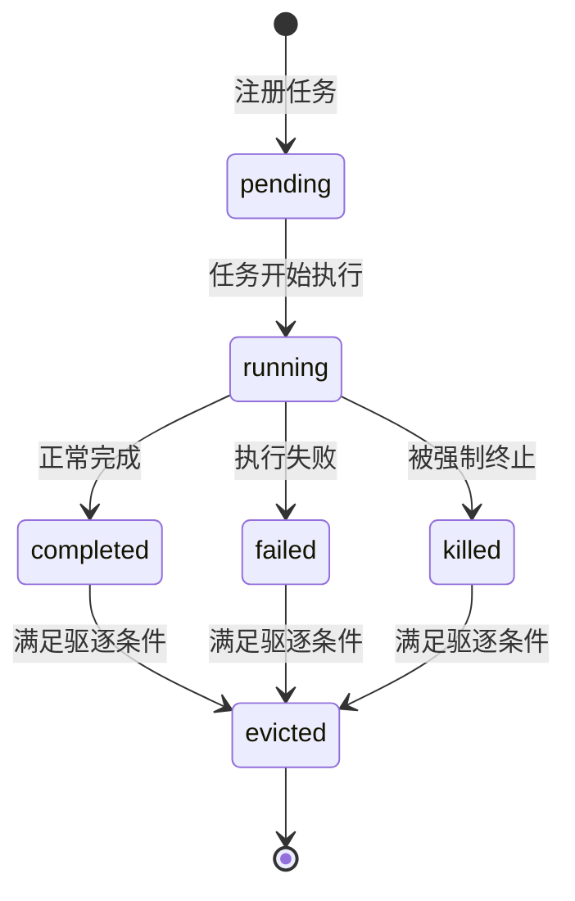
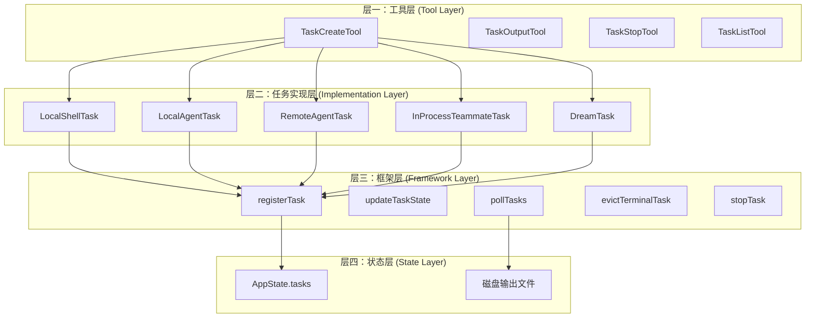
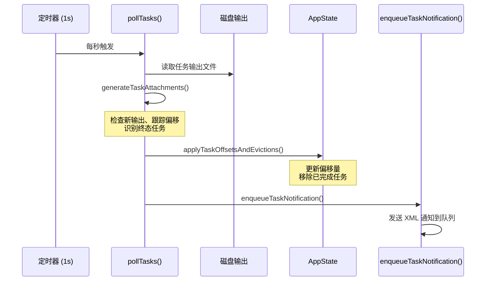
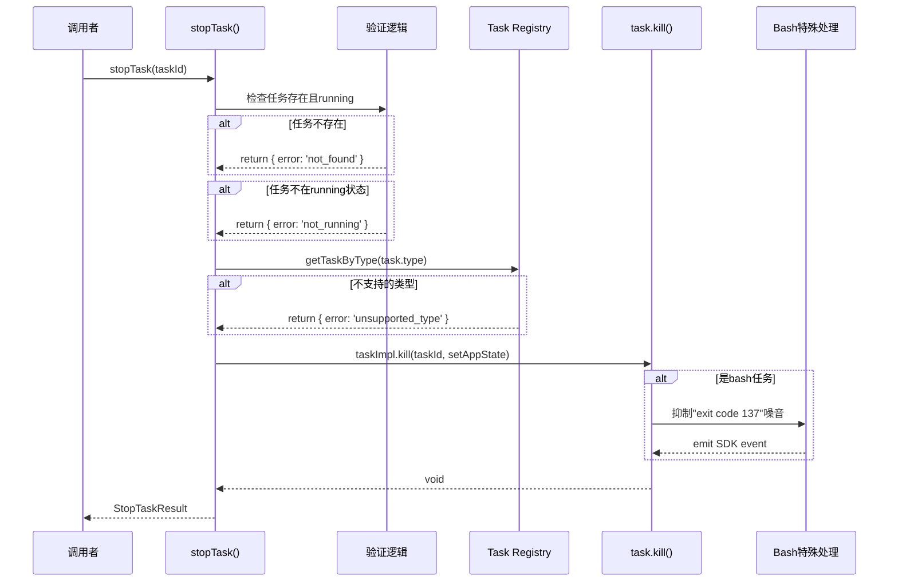
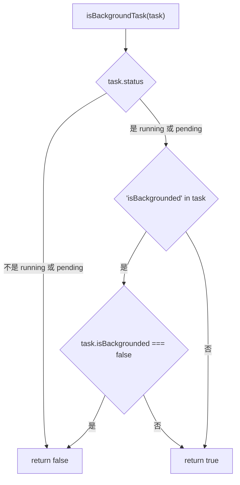
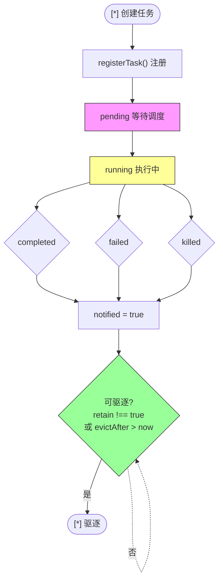
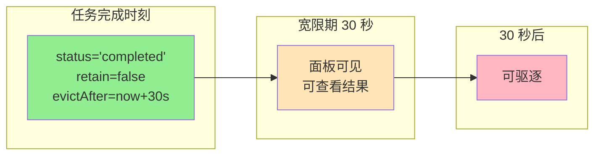
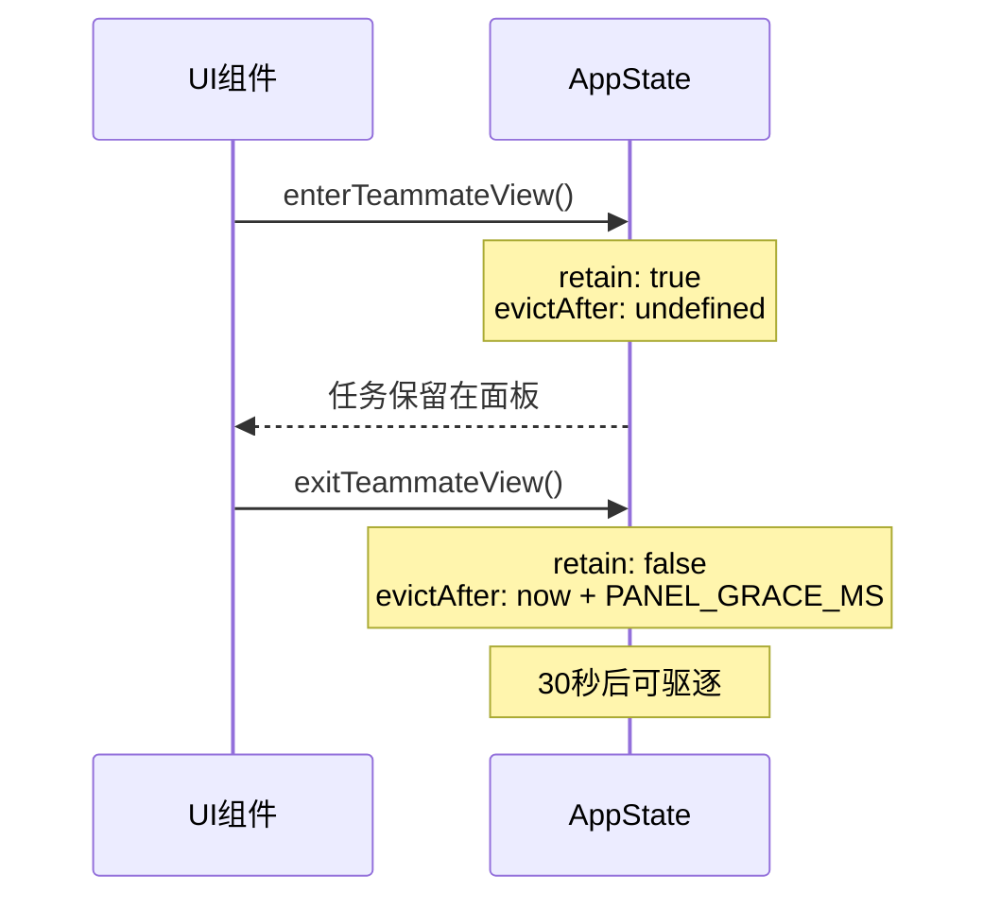
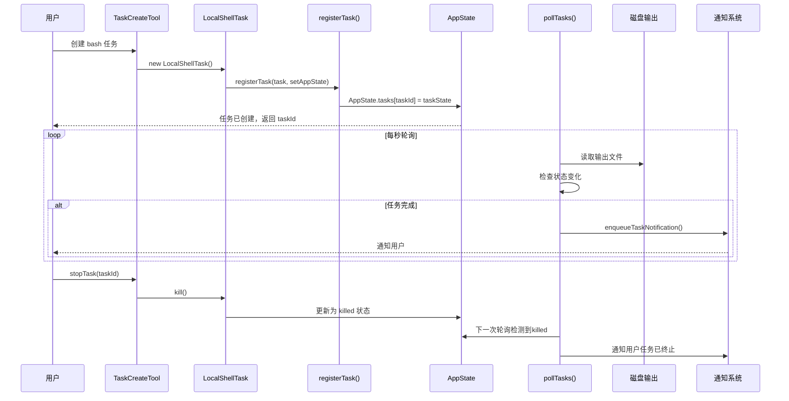

# Task System 任务系统架构

## 概述

Task System（任务系统）负责管理 Claude Code 中的并发长时运行操作。它提供统一的接口来追踪、监控和控制各类后台任务。

## 核心概念

### 任务类型

| 类型 | 前缀 | 描述 |
|------|------|------|
| `local_bash` | `b` | 本地 shell 命令执行 |
| `local_agent` | `a` | 本地异步 Agent（通过 AgentTool） |
| `remote_agent` | `r` | 远程 Claude.ai 会话（teleport） |
| `in_process_teammate` | `t` | 进程内队友 Agent |
| `local_workflow` | `w` | 工作流脚本（功能开关） |
| `monitor_mcp` | `m` | MCP 服务器监控（功能开关） |
| `dream` | `d` | 自动记忆整合（auto-dream） |

### 任务状态流转



**终态（Terminal States）**：`completed`、`failed`、`killed`

### Task ID 格式

```
{prefix}{8位随机字符 [0-9a-z]}
```

示例：`b1a2b3c4d5e6f7g8`

- 36^8 ≈ 2.8 万亿种组合
- 前缀保持向后兼容（bash 保持 `b`）

## 架构分层



### 各层职责

| 层级 | 职责 | 关键组件 |
|------|------|----------|
| **工具层** | 提供用户交互接口 | TaskCreateTool、TaskOutputTool、TaskStopTool |
| **任务实现层** | 具体任务类型的生命周期管理 | 各种 Task 实现类 |
| **框架层** | 通用框架逻辑：注册、更新、轮询、驱逐 | framework.ts |
| **状态层** | 持久化和内存状态管理 | AppState.tasks、磁盘文件 |

## 核心接口

### Task 基类 (`src/Task.ts`)

```typescript
// 任务注册表条目 - 仅 kill() 为多态调用
interface Task {
  name: string
  type: TaskType
  kill(taskId: string, setAppState: SetAppState): Promise<void>
}

// 所有任务状态共享的基类字段
interface TaskStateBase {
  id: string
  type: TaskType
  status: TaskStatus
  description: string
  toolUseId?: string
  startTime: number
  endTime?: number
  totalPausedMs?: number
  outputFile: string      // 磁盘输出路径
  outputOffset: number   // 增量读取偏移
  notified: boolean       // 用户是否已通知
}
```

### 任务状态存储

任务存储在 `AppState.tasks` 中：

```typescript
interface AppState {
  tasks: Record<string, TaskState>
}
```

### 框架函数 (`src/utils/task/framework.ts`)

| 函数 | 用途 |
|------|------|
| `registerTask(task, setAppState)` | 添加新任务到 AppState |
| `updateTaskState<T>(taskId, setAppState, updater)` | 类型安全的 state 更新 |
| `pollTasks(getAppState, setAppState)` | 主轮询循环（每 1 秒） |
| `evictTerminalTask(taskId, setAppState)` | 移除已完成的任务 |
| `generateTaskAttachments(state)` | 生成推送通知 |
| `applyTaskOffsetsAndEvictions(...)` | 应用轮询结果 |

## 轮询机制



## 任务实现详解

### 1. LocalShellTask (`local_bash`)

**状态：** `LocalShellTaskState`

```typescript
{
  type: 'local_bash'
  command: string
  result?: { code: number; interrupted: boolean }
  shellCommand: ShellCommand | null
  isBackgrounded: boolean
  agentId?: AgentId  // 派生此任务的父 Agent
  kind?: 'bash' | 'monitor'
}
```

**关键文件：**
- `src/tasks/LocalShellTask/LocalShellTask.tsx` - 主实现
- `src/tasks/LocalShellTask/guards.ts` - 状态类型 + 守卫函数
- `src/tasks/LocalShellTask/killShellTasks.ts` - 终止逻辑

### 2. LocalAgentTask (`local_agent`)

**状态：** `LocalAgentTaskState`

```typescript
{
  type: 'local_agent'
  agentId: string
  prompt: string
  selectedAgent?: AgentDefinition
  agentType: string
  model?: string
  abortController?: AbortController
  error?: string
  result?: AgentToolResult
  progress?: AgentProgress
  messages?: Message[]
  isBackgrounded: boolean
  retain: boolean       // UI 是否保留此任务
  diskLoaded: boolean   // Bootstrap 是否完成
  evictAfter?: number   // 面板宽限期截止时间
}
```

**进度追踪：**

```typescript
interface AgentProgress {
  toolUseCount: number
  tokenCount: number
  lastActivity?: ToolActivity
  recentActivities?: ToolActivity[]
  summary?: string
}
```

### 3. RemoteAgentTask (`remote_agent`)

**状态：** `RemoteAgentTaskState`

```typescript
{
  type: 'remote_agent'
  remoteTaskType: RemoteTaskType  // 'remote-agent' | 'ultraplan' | 'ultrareview' | 'autofix-pr' | 'background-pr'
  remoteTaskMetadata?: RemoteTaskMetadata
  sessionId: string
  command: string
  title: string
  todoList: TodoList
  log: SDKMessage[]
  isLongRunning?: boolean
  pollStartedAt: number
  isRemoteReview?: boolean
  reviewProgress?: { stage?: 'finding' | 'verifying' | 'synthesizing'; bugsFound/Verified/Refuted: number }
  isUltraplan?: boolean
  ultraplanPhase?: Exclude<UltraplanPhase, 'running'>
}
```

**特性：**
- 通过 `pollRemoteSessionEvents()` 轮询远程会话事件
- 支持不同远程任务类型的完成检查器
- 元数据持久化到会话 sidecar

### 4. InProcessTeammateTask (`in_process_teammate`)

**状态：** `InProcessTeammateTaskState`

```typescript
{
  type: 'in_process_teammate'
  identity: TeammateIdentity  // agentId, agentName, teamName, color, planModeRequired, parentSessionId
  prompt: string
  model?: string
  selectedAgent?: AgentDefinition
  abortController?: AbortController
  currentWorkAbortController?: AbortController  // 中止当前轮次但不终止任务
  awaitingPlanApproval: boolean
  permissionMode: PermissionMode
  error?: string
  result?: AgentToolResult
  progress?: AgentProgress
  messages?: Message[]
  inProgressToolUseIDs?: Set<string>
  pendingUserMessages: string[]
  isIdle: boolean
  shutdownRequested: boolean
}
```

**消息 UI 上限：** `TEAMMATE_MESSAGES_UI_CAP = 50`

### 5. DreamTask (`dream`)

**用途：** 记忆整合子 Agent（auto-dream）

**状态：** `DreamTaskState`

```typescript
{
  type: 'dream'
  phase: 'starting' | 'updating'
  sessionsReviewing: number
  filesTouched: string[]  // 不完整 - bash 写入未被捕获
  turns: DreamTurn[]        // 折叠了 toolUseCount 的 Assistant 响应
  abortController?: AbortController
  priorMtime: number        // 用于 kill 时回滚锁
}
```

**UI 展示：** 在底部药丸和 Shift+Down 对话框中可见forked dream agent

## 停止任务



## 输出管理

### 磁盘输出 (`src/utils/task/diskOutput.ts`)

```
~/.claude/memory/{sessionId}/task_output/{taskId}
```

- 每个任务输出到专用文件
- 通过偏移量跟踪增量输出
- 为 agent 转录路径创建符号链接

### 通知格式

```xml
<task_notification>
  <task_id>b1a2b3c4</task_id>
  <tool_use_id>...</tool_use_id>
  <task_type>local_bash</task_type>
  <output_file>/path/to/output</output_file>
  <status>completed</status>
  <summary>Task "npm test" completed successfully</summary>
</task_notification>
```

## 后台任务检测



## 任务生命周期完整流程



**驱逐规则：**
1. 必须是终态（`completed` | `failed` | `killed`）
2. 必须 `notified=true`
3. 不能被保留（`retain !== true` 或 `evictAfter > now`）

## 面板宽限期



- **LocalAgentTask：** `PANEL_GRACE_MS = 30_000`（30 秒）
  - 让完成的 agent 在协调器面板中短暂可见
  - 允许用户在看结果前看到结果

- **DreamTask：** 通知后立即驱逐（仅 UI）

## 关键设计模式

### 1. 类型安全的 State 更新

```typescript
updateTaskState<LocalAgentTaskState>(taskId, setAppState, task => ({
  ...task,
  status: 'completed',
  endTime: Date.now()
}))
```

### 2. 引用相等优化

```typescript
const updated = updater(task)
if (updated === task) {
  return prev  // 跳过展开 - 无状态变化
}
```

### 3. TOCTOU 保护

```typescript
// 异步操作后重新检查 fresh state 上的状态
if (fresh?.status === 'running') {
  newTasks[id] = { ...fresh, outputOffset: updatedTaskOffsets[id]! }
}
```

### 4. 任务保留模式



## 任务创建到驱逐完整时序



## 相关文件

| 文件 | 用途 |
|------|------|
| `src/Task.ts` | 核心类型、ID 生成 |
| `src/tasks.ts` | 任务注册表（getAllTasks, getTaskByType） |
| `src/tasks/types.ts` | 联合类型、isBackgroundTask 守卫 |
| `src/tasks/stopTask.ts` | 任务停止逻辑 |
| `src/tasks/LocalMainSessionTask.ts` | 主会话后台化 |
| `src/utils/task/framework.ts` | 核心框架函数 |
| `src/utils/task/diskOutput.ts` | 任务输出磁盘 I/O |
| `src/tools/TaskCreateTool/` | 创建任务的工具 |
| `src/tools/TaskOutputTool/` | 读取任务输出的工具 |

## 功能开关

| 开关 | 任务类型 | 描述 |
|------|---------|------|
| `WORKFLOW_SCRIPTS` | `local_workflow` | 启用工作流脚本 |
| `MONITOR_TOOL` | `monitor_mcp` | 启用 MCP 服务器监控 |
