# Agent Hook 机制 多轮自主验证型 Hook 的设计实现

> 本文档基于代码分析，整理 Claude Code 中 Agent Hook 机制的完整设计。

## 目录

- [一、概述](#一概述)
- [二、核心概念](#二核心概念)
- [三、架构总览](#三架构总览)
  - [系统上下文（C4 Context）](#系统上下文c4-context)
  - [容器拆分（C4 Container）](#容器拆分c4-container)
  - [工作流概览](#工作流概览)
  - [各模块职责概述](#各模块职责概述)
- [四、核心工作流](#四核心工作流)
  - [核心工作流程](#核心工作流程)
  - [核心实体状态流转](#核心实体状态流转)
- [五、分模块详解](#五分模块详解)
  - [5.1 Prompt 构建与参数替换模块](#51-prompt-构建与参数替换模块)
  - [5.2 工具集装配模块](#52-工具集装配模块)
  - [5.3 多轮查询循环模块](#53-多轮查询循环模块)
  - [5.4 结构化输出捕获与验证模块](#54-结构化输出捕获与验证模块)
  - [5.5 结果映射与返回模块](#55-结果映射与返回模块)
- [六、设计原理与对比分析](#六设计原理与对比分析)
- [七、总结与索引](#七总结与索引)

---

## 一、概述

Agent Hook 是 Claude Code 六种 Hook 类型中最复杂的一种——它不是一个简单的 Shell 命令或单轮 LLM 评估，而是一个完整的多轮自主验证 Agent。当用户配置 `type: 'agent'` 的 Hook 时，系统会启动一个独立的子 Agent，该 Agent 拥有几乎全部内置工具的访问权限（除 Agent/Plan 等递归危险工具外），可以在多轮对话中自主读取文件、搜索代码、执行 Shell 命令，最终通过 `StructuredOutput` 工具返回 `{ok, reason}` 结构化结果。这种设计使 Agent Hook 成为 Stop Hook 的理想载体——它可以在模型声称完成后，自主验证是否真正达成了目标。

### 系统定位

| 维度 | 说明 |
|------|------|
| 核心职责 | 启动一个多轮自主 Agent 执行用户定义的验证逻辑，返回结构化通过/阻塞决策 |
| 系统性质 | 多轮自主验证型 Hook，兼具 Agent 自主性和 Hook 决策性 |
| 边界 | 上游：executeHooks 在匹配到 `type: 'agent'` Hook 后调用 execAgentHook；下游：query() 完整查询循环、StructuredOutput 工具、LLM API |
| 使用方 | 主要被 Stop/SubagentStop Hook 消费（验证模型是否真正完成了任务），也可用于任何需要自主验证的 Hook 事件 |

### 与其他系统的关系总览

| 关联系统 | 关系 |
|----------|------|
| Hook 执行引擎 | execAgentHook 被 executeHooks 在 `hook.type === 'agent'` 分支中调用，是 Agent Hook 的唯一入口 |
| Prompt Hook | 共享 hookResponseSchema、addArgumentsToPrompt、StructuredOutput 工具创建逻辑；区别是 Prompt Hook 仅做单轮评估，Agent Hook 做多轮自主验证 |
| Query 循环 | Agent Hook 通过 `query()` 函数启动完整的多轮 Agent 循环，与主 REPL 使用同一套查询基础设施 |
| StructuredOutput 工具 | Agent Hook 的唯一输出通道——子 Agent 必须调用此工具返回 `{ok, reason}` 结果 |
| Function Hook / Session Hook | 通过 `registerStructuredOutputEnforcement` 注册 Session 级 Function Hook，强制子 Agent 在 Stop 时调用 StructuredOutput |
| Tool 系统 | Agent Hook 继承父上下文的工具集，但过滤掉 Agent/Plan 等递归危险工具，并注入 StructuredOutput 工具 |

---

## 二、核心概念

### AgentHook（配置类型）

用户在 settings.json 中配置的 Agent Hook 定义，是 HookCommand discriminated union 的 `type: 'agent'` 成员。

```typescript
// 来自 src/schemas/hooks.ts
const AgentHookSchema = z.object({
  type: z.literal('agent').describe('Agentic verifier hook type'),
  prompt: z.string()
    .describe('Prompt describing what to verify (e.g. "Verify that unit tests ran and passed."). Use $ARGUMENTS placeholder for hook input JSON.'),
  if: IfConditionSchema(),           // 权限规则语法条件过滤
  timeout: z.number().positive().optional()
    .describe('Timeout in seconds for agent execution (default 60)'),
  model: z.string().optional()
    .describe('Model to use for this agent hook (e.g., "claude-sonnet-4-6"). If not specified, uses Haiku.'),
  statusMessage: z.string().optional()
    .describe('Custom status message to display in spinner while hook runs'),
  once: z.boolean().optional()
    .describe('If true, hook runs once and is removed after execution'),
})

export type AgentHook = Extract<HookCommand, { type: 'agent' }>
```

### hookResponseSchema（结构化输出 Schema）

Agent Hook 和 Prompt Hook 共享的输出验证 Schema，定义了子 Agent 必须返回的结构。

```typescript
// 来自 src/utils/hooks/hookHelpers.ts
export const hookResponseSchema = lazySchema(() =>
  z.object({
    ok: z.boolean().describe('Whether the condition was met'),
    reason: z.string().describe('Reason, if the condition was not met').optional(),
  }),
)
```

### StructuredOutput 工具（输出通道）

Agent Hook 注入到子 Agent 工具池中的特殊工具，是子 Agent 返回验证结果的唯一通道。基于 `SyntheticOutputTool` 构建，但覆写了 inputSchema 和 inputJSONSchema 为 hookResponseSchema。

```typescript
// 来自 src/utils/hooks/hookHelpers.ts
export function createStructuredOutputTool(): Tool {
  return {
    ...SyntheticOutputTool,
    inputSchema: hookResponseSchema(),     // { ok: boolean, reason?: string }
    inputJSONSchema: {
      type: 'object',
      properties: {
        ok: { type: 'boolean', description: 'Whether the condition was met' },
        reason: { type: 'string', description: 'Reason, if the condition was not met' },
      },
      required: ['ok'],
      additionalProperties: false,
    },
    async prompt(): Promise<string> {
      return `Use this tool to return your verification result. You MUST call this tool exactly once at the end of your response.`
    },
  }
}
```

### ALL_AGENT_DISALLOWED_TOOLS（禁用工具集）

Agent Hook 子 Agent 被禁止使用的工具集合，防止递归 Agent 嵌套和计划模式进入。

```typescript
// 来自 src/constants/tools.ts
export const ALL_AGENT_DISALLOWED_TOOLS = new Set([
  TASK_OUTPUT_TOOL_NAME,        // TaskOutput
  EXIT_PLAN_MODE_V2_TOOL_NAME,  // ExitPlanMode
  ENTER_PLAN_MODE_TOOL_NAME,    // EnterPlanMode
  AGENT_TOOL_NAME,              // Agent（非 ant 用户禁止嵌套子 Agent）
  ASK_USER_QUESTION_TOOL_NAME,  // AskUserQuestion
  TASK_STOP_TOOL_NAME,          // TaskStop
  WORKFLOW_TOOL_NAME,           // Workflow（如果启用）
])
```

### registerStructuredOutputEnforcement（结构化输出强制）

通过 Session 级 Function Hook 强制子 Agent 在 Stop 时调用 StructuredOutput 工具。如果子 Agent 试图在没有调用 StructuredOutput 的情况下停止，Function Hook 会返回 false 并注入错误消息，迫使子 Agent 继续执行。

```typescript
// 来自 src/utils/hooks/hookHelpers.ts
export function registerStructuredOutputEnforcement(
  setAppState: SetAppState,
  sessionId: string,
): void {
  addFunctionHook(
    setAppState,
    sessionId,
    'Stop',              // 在 Stop 事件触发
    '',                   // 无 matcher — 适用于所有 Stop
    messages => hasSuccessfulToolCall(messages, SYNTHETIC_OUTPUT_TOOL_NAME),
    `You MUST call the ${SYNTHETIC_OUTPUT_TOOL_NAME} tool to complete this request. Call this tool now.`,
    { timeout: 5000 },
  )
}
```

---

## 三、架构总览

### 系统上下文（C4 Context）

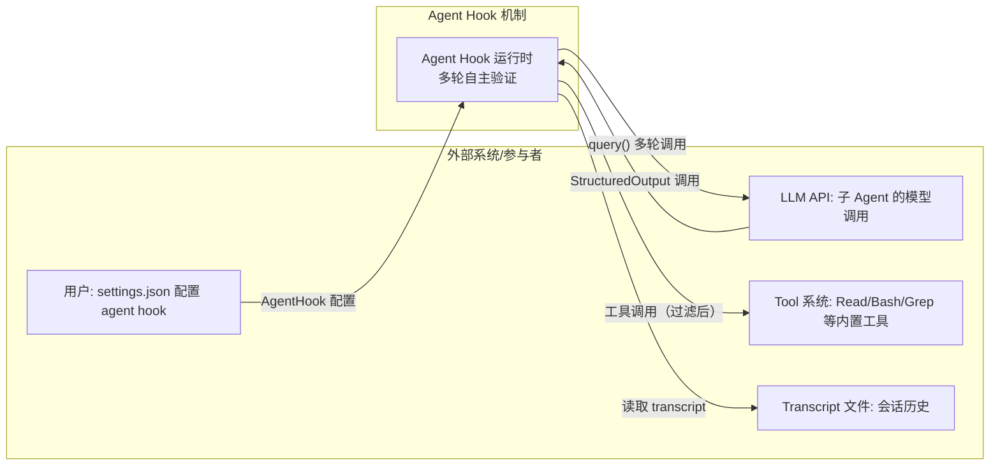

**Context 图解释：**

1. 驱动关系：Agent Hook 由 Hook 执行引擎在匹配到 `type: 'agent'` 配置时驱动，用户通过 settings.json 定义验证 prompt
2. 服务对象：Agent Hook 主要服务于 Stop/SubagentStop 事件——当模型声称完成时，Agent Hook 启动子 Agent 自主验证是否真正达成了目标
3. 外部交互：Agent Hook 通过 query() 函数与 LLM API 交互（多轮对话），通过 Tool 系统执行读取/搜索/命令等操作，通过 Transcript 文件回溯会话历史
4. 边界划分：Agent Hook 不负责 Hook 匹配和调度（由 executeHooks 负责），不负责结果聚合（由 executeHooks 负责），只负责"启动子 Agent 并捕获结构化输出"

### 容器拆分（C4 Container）

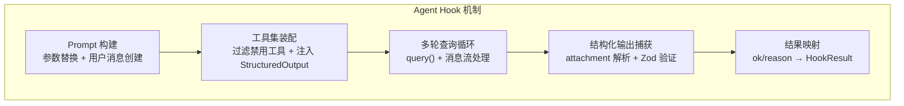

**Container 图解释：**

1. 拆分依据：按 Agent Hook 的执行流水线阶段拆分——Prompt 准备→工具集装配→多轮查询→输出捕获→结果映射
2. 职责边界：PromptBuilder 只负责 prompt 文本处理，不关心工具选择；ToolAssembler 只负责工具集装配和权限上下文，不关心查询执行；QueryLoop 是核心执行循环，负责驱动 LLM 多轮对话
3. 依赖与数据流：Prompt 文本流向 ToolAssembler（System Prompt 包含 transcript 路径）→装配后的工具集和 ToolUseContext 流向 QueryLoop→QueryLoop 的消息流流向 OutputCapture→结构化输出流向 ResultMapper
4. 核心与辅助：QueryLoop 是核心模块，承载多轮对话的完整控制流；PromptBuilder 和 ToolAssembler 是辅助模块，为 QueryLoop 准备输入

### 工作流概览

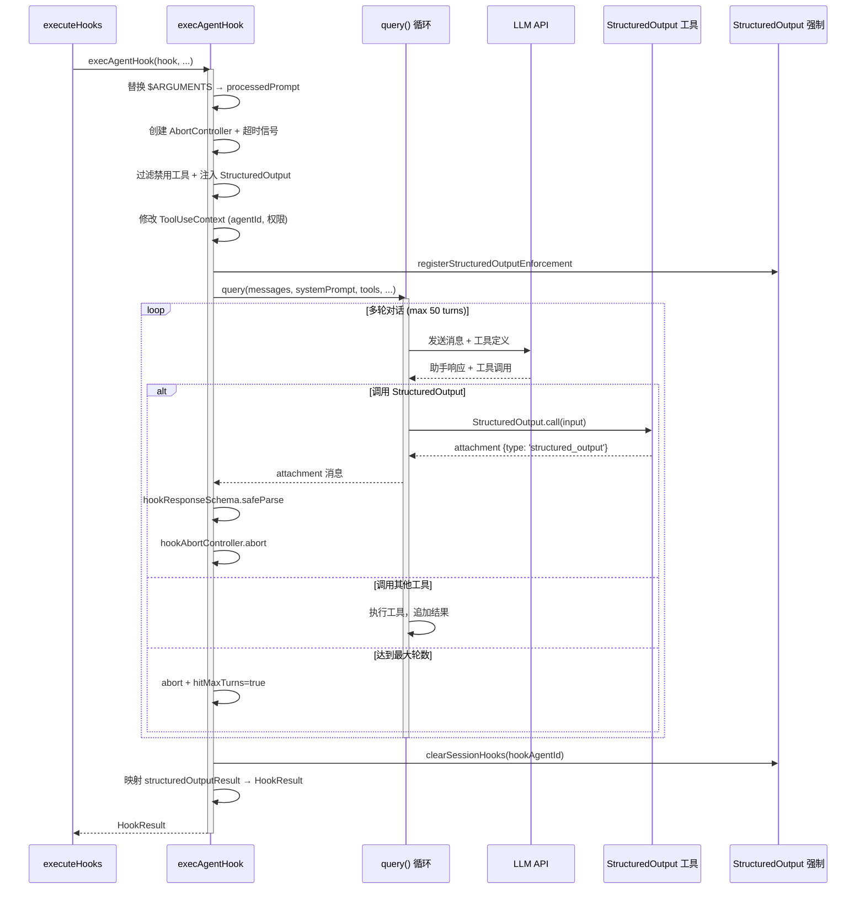

**工作流概览解释：**

1. 起点：executeHooks 在 `hook.type === 'agent'` 分支调用 execAgentHook，传入 AgentHook 配置、hookInput JSON、AbortSignal 和 ToolUseContext
2. 主路径：prompt 参数替换 → 创建 AbortController → 过滤禁用工具 + 注入 StructuredOutput → 修改 ToolUseContext → 注册结构化输出强制 → 启动 query() 循环 → 在消息流中捕获 StructuredOutput attachment → 中断循环 → 映射结果
3. 外部交互点：query() 与 LLM API 交互执行多轮对话；StructuredOutput 工具是子 Agent 返回结果的通道；registerStructuredOutputEnforcement 注册 Function Hook 强制调用
4. 终点：将 `{ok, reason}` 映射为 HookResult——ok=true 映射为 outcome='success'，ok=false 映射为 outcome='blocking'

### 各模块职责概述

| 模块 | 核心职责 | 关键接口 | 依赖 |
|------|----------|----------|------|
| Prompt 构建与参数替换 | 替换 $ARGUMENTS、创建用户消息、构建 System Prompt | `addArgumentsToPrompt()`, `createUserMessage()` | argumentSubstitution |
| 工具集装配 | 过滤禁用工具、注入 StructuredOutput、修改 ToolUseContext | `createStructuredOutputTool()`, `ALL_AGENT_DISALLOWED_TOOLS` | Tool 系统, SyntheticOutputTool |
| 多轮查询循环 | 驱动 query() 多轮对话、处理消息流、计数轮数、检测结构化输出 | `query()`, `handleMessageFromStream()` | Query 系统, LLM API |
| 结构化输出捕获与验证 | 从 attachment 中提取 structured_output、Zod 验证 | `hookResponseSchema().safeParse()` | hookHelpers |
| 结果映射与返回 | 将 {ok, reason} 映射为 HookResult、清理 Session Hook、发送遥测 | — | SessionHooks, Analytics |

---

## 四、核心工作流

### 核心工作流程

#### 正常流：Agent Hook 多轮验证

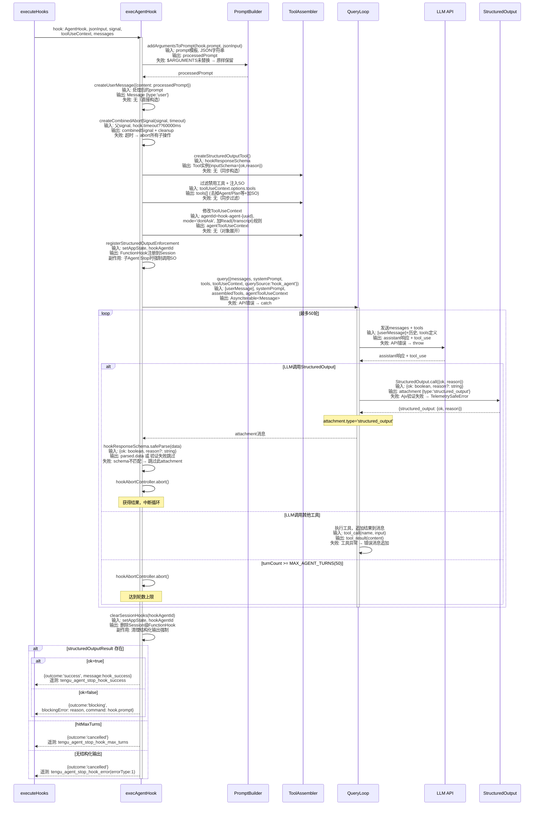

**正常流解释：**

1. 流程目标：启动一个多轮自主子 Agent 验证用户定义的条件（如"验证单元测试已运行并通过"），通过 StructuredOutput 工具返回 `{ok, reason}` 结构化决策
2. 步骤拆解：prompt 参数替换 → AbortController 创建 → 工具集装配（过滤+注入） → ToolUseContext 修改 → 结构化输出强制注册 → query() 循环 → 结构化输出捕获 → Session Hook 清理 → 结果映射
3. 数据变化：hookInput(JSON) → processedPrompt(string) → userMessage(Message) → query()消息流 → attachment(structured_output) → {ok,reason} → HookResult
4. 关键决策：工具集装配时过滤 Agent/Plan 等递归危险工具防止无限嵌套；registerStructuredOutputEnforcement 确保子 Agent 必须调用 StructuredOutput 而非直接停止；MAX_AGENT_TURNS=50 防止失控循环

#### 异常流：Agent Hook 超时与失败

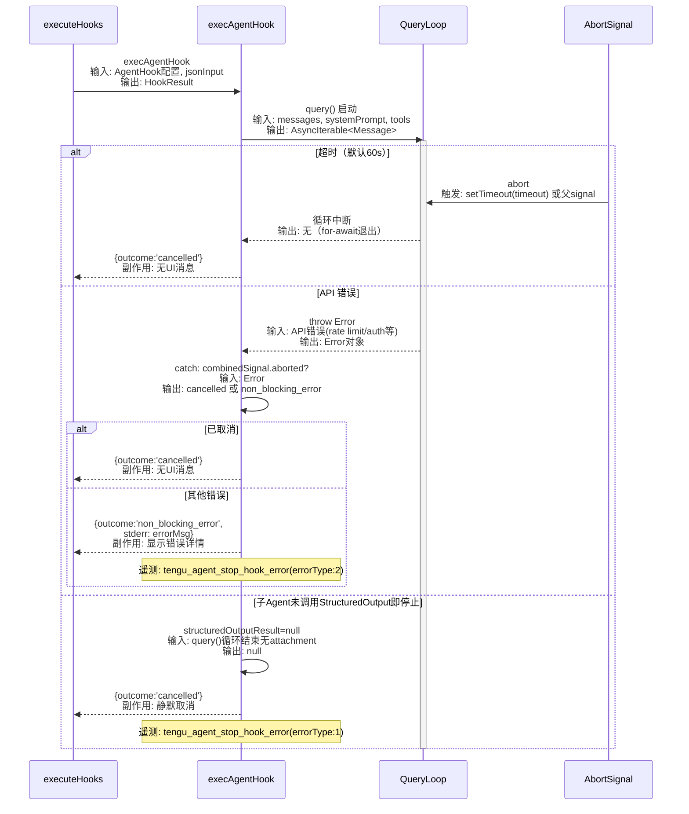

**异常流解释：**

1. 触发条件：超时由 createCombinedAbortSignal 触发（默认 60s，可通过 hook.timeout 配置）；API 错误由 LLM 返回（rate limit、auth failure 等）；未调用 StructuredOutput 由子 Agent 提前停止导致
2. 处理机制：超时和取消标记为 outcome='cancelled'，不显示错误消息；API 错误标记为 outcome='non_blocking_error'，显示错误详情；未调用 StructuredOutput 标记为 outcome='cancelled'，不显示错误消息（静默取消）
3. 恢复策略：cancelled 和 non_blocking_error 均不阻塞主流程——Hook 执行引擎会继续处理其他 Hook，最终聚合结果中不包含阻止继续的标记
4. 影响范围：超时取消不影响其他 Hook 的执行；API 错误通过 attachment 消息可见但标记为 non_blocking；未调用 StructuredOutput 的 cancelled 结果完全静默

### 核心实体状态流转

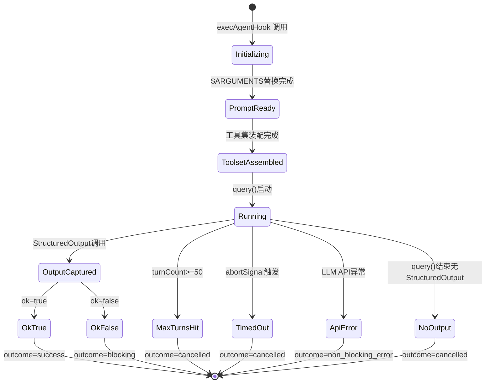

**状态流转解释：**

1. 生命周期主线：Initializing → PromptReady → ToolsetAssembled → Running → OutputCaptured → 终态
2. 状态语义：Initializing 表示参数准备；Running 表示子 Agent 在 query() 循环中执行；OutputCaptured 表示捕获到有效的结构化输出
3. 终态与异常态：OkTrue/OkFalse 是正常终态；MaxTurnsHit/TimedOut/NoOutput 是 cancelled 终态；ApiError 是 non_blocking_error 异常态
4. 转移触发：StructuredOutput 调用触发 Running→OutputCaptured；MAX_AGENT_TURNS 触发 Running→MaxTurnsHit；abortSignal 触发 Running→TimedOut

#### 状态定义

| 状态 | 含义 | 是否终态 | 触发条件 |
|------|------|----------|----------|
| Initializing | 参数准备和 AbortController 创建 | 否 | execAgentHook 入口 |
| ToolsetAssembled | 工具集过滤+注入+ToolUseContext 修改完成 | 否 | createStructuredOutputTool + filter + context spread |
| Running | 子 Agent 在 query() 循环中多轮执行 | 否 | query() 启动 |
| OutputCaptured | 从 attachment 中捕获到有效 StructuredOutput | 否 | hookResponseSchema.safeParse 成功 |
| OkTrue | 验证条件通过 | 是 | structuredOutputResult.ok === true |
| OkFalse | 验证条件未通过 | 是 | structuredOutputResult.ok === false |
| MaxTurnsHit | 达到最大轮数限制 (50) | 是 | turnCount >= MAX_AGENT_TURNS |
| NoOutput | 子 Agent 结束但未调用 StructuredOutput | 是 | structuredOutputResult === null && !hitMaxTurns |

---

## 五、分模块详解

### 5.1 Prompt 构建与参数替换模块

#### C4 Component 图

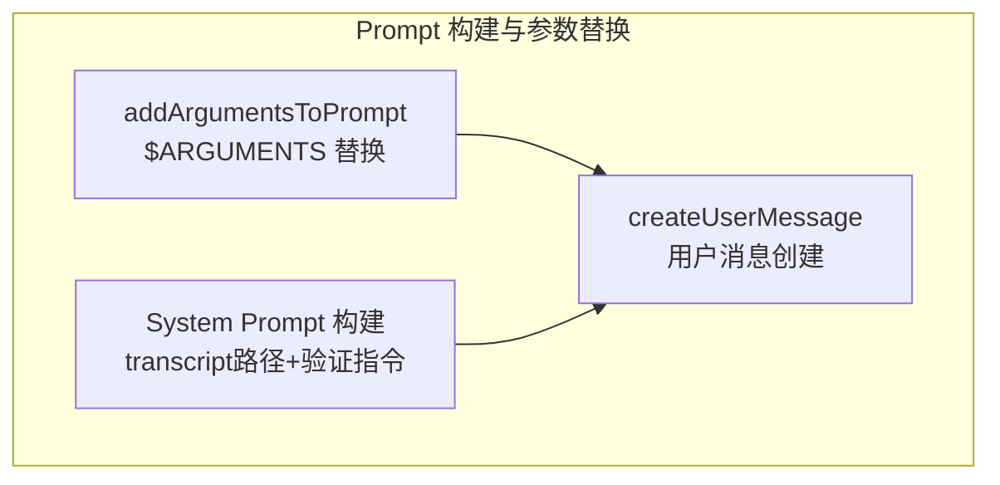

**Component 图解释：**

1. 拆分逻辑：按 prompt 处理的三步拆分——参数替换、用户消息创建、System Prompt 构建
2. 核心组件是 ArgSub，它处理 `$ARGUMENTS`、`$ARGUMENTS[0]`、`$0` 等占位符替换，将 hookInput JSON 注入 prompt 模板
3. System Prompt 包含两个关键信息：transcript 文件路径（供子 Agent 回溯会话历史）和验证指令（要求使用 StructuredOutput 工具返回结果）
4. 用户消息直接构造而非通过 processUserInput——后者会触发 UserPromptSubmit Hook 导致无限递归

#### 数据结构

```typescript
// 来自 src/utils/hooks/execAgentHook.ts (内联构造)
const processedPrompt = addArgumentsToPrompt(hook.prompt, jsonInput)
// hook.prompt 示例: "Verify that $ARGUMENTS passed all tests"
// jsonInput 示例: '{"hook_event_name":"Stop","last_assistant_message":"..."}'
// 输出: "Verify that {\"hook_event_name\":\"Stop\",...} passed all tests"

const userMessage = createUserMessage({ content: processedPrompt })
// → Message { type: 'user', message: { role: 'user', content: processedPrompt } }

const systemPrompt = asSystemPrompt([
  `You are verifying a stop condition in Claude Code. Your task is to verify that the agent completed the given plan. The conversation transcript is available at: ${transcriptPath}\nYou can read this file to analyze the conversation history if needed.

Use the available tools to inspect the codebase and verify the condition.
Use as few steps as possible - be efficient and direct.

When done, return your result using the ${SYNTHETIC_OUTPUT_TOOL_NAME} tool with:
- ok: true if the condition is met
- ok: false with reason if the condition is not met`,
])
```

#### 存储与持久化

- 存储路径：纯内存，无持久化
- System Prompt 中的 transcriptPath 指向磁盘文件（`~/.claude/projects/.../sessions/{id}.jsonl`），子 Agent 通过 Read 工具读取

#### 模块内部时序图

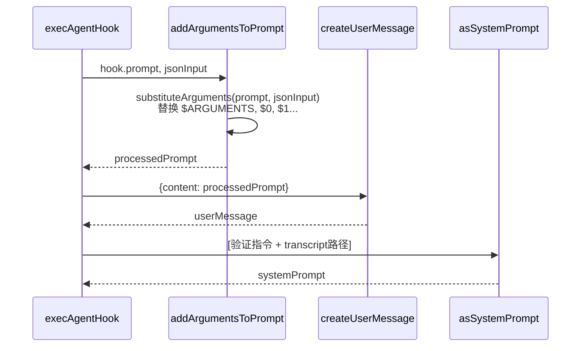

**模块内部时序解释：**

1. 时序起点是 execAgentHook 接收到 AgentHook 配置和 JSON 输入
2. substituteArguments 处理三种占位符：`$ARGUMENTS`（完整 JSON）、`$ARGUMENTS[0]`（索引参数）、`$0`/`$1`（简写）
3. System Prompt 明确要求子 Agent "Use as few steps as possible"——这是性能优化，防止子 Agent 执行过多工具调用
4. 失败路径：$ARGUMENTS 替换失败时原样保留占位符文本，不做特殊错误处理

#### 与其他模块的交互

| 交互对象 | 交互方式 | 数据格式 | 触发条件 |
|----------|----------|----------|----------|
| 工具集装配 | 提供 systemPrompt | SystemPrompt 对象 | 流水线顺序调用 |
| 多轮查询循环 | 提供 messages + systemPrompt | Message[] + SystemPrompt | 流水线顺序调用 |
| Hook 执行引擎 | 接收 hook.prompt + jsonInput | string + string | executeHooks 分支调用 |

### 5.2 工具集装配模块

#### C4 Component 图

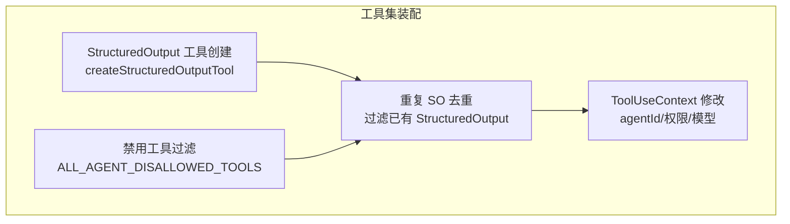

**Component 图解释：**

1. 拆分逻辑：按工具集装配的四个步骤拆分——SO 创建→禁用过滤→去重→上下文修改
2. 核心组件是 Filter，它防止子 Agent 产生递归嵌套——过滤掉 Agent Tool（防无限子 Agent 嵌套）、EnterPlanMode/ExitPlanMode（防进入计划模式）、AskUserQuestion（防交互对话框）、TaskStop/TaskOutput（防任务系统干扰）
3. Dedup 处理父上下文可能已存在的 StructuredOutput 工具（如 --json-schema 标志产生的），避免两个不同 schema 的 SO 工具冲突
4. ContextMod 创建独立的 hookAgentId，设置 mode='dontAsk'（非交互模式），添加 Read(/transcript) 权限规则

#### 数据结构

```typescript
// 来自 src/utils/hooks/execAgentHook.ts (内联构造)
const structuredOutputTool = createStructuredOutputTool()
// → Tool { name: 'StructuredOutput', inputSchema: hookResponseSchema }

const filteredTools = toolUseContext.options.tools.filter(
  tool => !toolMatchesName(tool, SYNTHETIC_OUTPUT_TOOL_NAME),
)
// 过滤掉已有的 StructuredOutput（不同 schema）

const tools: Tool[] = [
  ...filteredTools.filter(
    tool => !ALL_AGENT_DISALLOWED_TOOLS.has(tool.name),
  ),
  structuredOutputTool,
]
// 最终工具集 = (父工具 - 禁用工具 - 已有SO) + 新SO

const hookAgentId = asAgentId(`hook-agent-${randomUUID()}`)
// 独立 agentId，隔离权限和 Session Hook

const agentToolUseContext: ToolUseContext = {
  ...toolUseContext,
  agentId: hookAgentId,
  abortController: hookAbortController,
  options: {
    ...toolUseContext.options,
    tools,
    mainLoopModel: model,              // hook.model ?? getSmallFastModel()
    isNonInteractiveSession: true,       // 非交互模式
    thinkingConfig: { type: 'disabled' }, // 禁用 thinking
  },
  setInProgressToolUseIDs: () => {},     // no-op
  getAppState() {
    const appState = toolUseContext.getAppState()
    const existingSessionRules =
      appState.toolPermissionContext.alwaysAllowRules.session ?? []
    return {
      ...appState,
      toolPermissionContext: {
        ...appState.toolPermissionContext,
        mode: 'dontAsk' as const,       // 自动批准所有工具调用
        alwaysAllowRules: {
          ...appState.toolPermissionContext.alwaysAllowRules,
          session: [...existingSessionRules, `Read(/${transcriptPath})`],
        },
      },
    }
  },
}
```

#### 存储与持久化

- 存储路径：纯内存，ToolUseContext 对象生命周期与 execAgentHook 调用一致
- 权限规则：`Read(/${transcriptPath})` 是动态添加的 session 级规则，允许子 Agent 读取主对话的 transcript 文件

#### 模块内部时序图

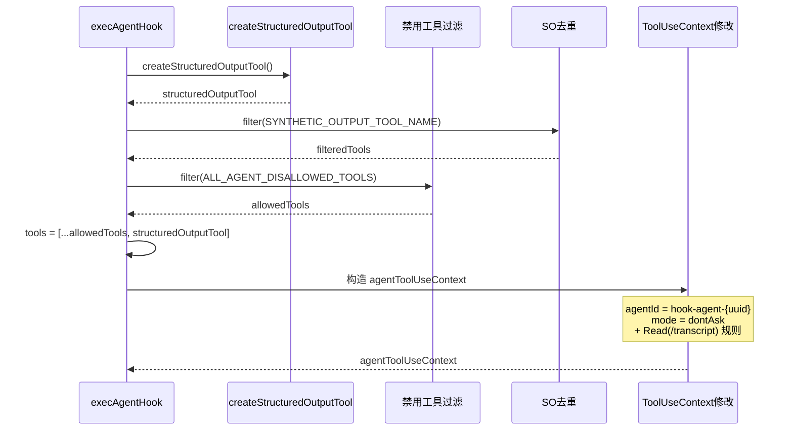

**模块内部时序解释：**

1. SO 创建是第一步，因为后续的 Dedup 需要知道 SO 工具名
2. 过滤顺序：先去重已有 SO（可能来自 --json-schema 标志），再过滤禁用工具，最后添加新 SO
3. Context 修改中 mode='dontAsk' 确保子 Agent 不会弹出权限确认对话框
4. transcript 路径的 Read 权限规则是动态计算——每次 getAppState() 调用时重新构建

#### 与其他模块的交互

| 交互对象 | 交互方式 | 数据格式 | 触发条件 |
|----------|----------|----------|----------|
| 多轮查询循环 | 提供 tools + agentToolUseContext | Tool[] + ToolUseContext | 流水线顺序调用 |
| 结构化输出捕获 | structuredOutputTool 被 query() 调用 | attachment {structured_output} | 子 Agent 调用 SO 工具 |
| Session Hook 管理 | registerStructuredOutputEnforcement | FunctionHook 注册 | 工具集装配完成后 |

### 5.3 多轮查询循环模块

#### C4 Component 图

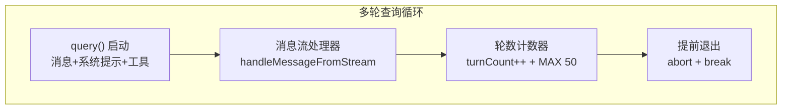

**Component 图解释：**

1. 拆分逻辑：按查询循环的四个阶段拆分——启动→流处理→轮数管理→退出控制
2. 核心组件是 StreamHandler，它处理 query() 产生的 AsyncIterable<Message>，区分 stream_event（流式文本增量）、assistant（完整响应）、attachment（工具结果）
3. TurnCounter 在每个 assistant 消息时递增，达到 MAX_AGENT_TURNS=50 时触发 EarlyExit
4. EarlyExit 调用 hookAbortController.abort() 中断 query() 循环，然后 break 退出 for-await

#### 数据结构

```typescript
// 来自 src/utils/hooks/execAgentHook.ts (内联逻辑)
const MAX_AGENT_TURNS = 50

let structuredOutputResult: { ok: boolean; reason?: string } | null = null
let turnCount = 0
let hitMaxTurns = false

for await (const message of query({
  messages: agentMessages,      // [userMessage]
  systemPrompt,
  userContext: {},
  systemContext: {},
  canUseTool: hasPermissionsToUseTool,
  toolUseContext: agentToolUseContext,
  querySource: 'hook_agent',
})) {
  // 1. 处理流式事件（更新 spinner 长度）
  handleMessageFromStream(message, ...)

  // 2. 跳过流式中间事件
  if (message.type === 'stream_event' || message.type === 'stream_request_start') continue

  // 3. 计数轮数 + 检查上限
  if (message.type === 'assistant') {
    turnCount++
    if (turnCount >= MAX_AGENT_TURNS) {
      hitMaxTurns = true
      hookAbortController.abort()
      break
    }
  }

  // 4. 捕获结构化输出
  if (message.type === 'attachment' && message.attachment.type === 'structured_output') {
    const parsed = hookResponseSchema().safeParse(message.attachment.data)
    if (parsed.success) {
      structuredOutputResult = parsed.data
      hookAbortController.abort()  // 获得结果，立即中断
      break
    }
  }
}
```

#### 存储与持久化

- 存储路径：纯内存，structuredOutputResult 和 turnCount 是局部变量
- query() 产生的 transcript 写入磁盘（`~/.claude/projects/.../agents/hook-agent-{uuid}.jsonl`），但 execAgentHook 不读取此文件

#### 模块内部时序图

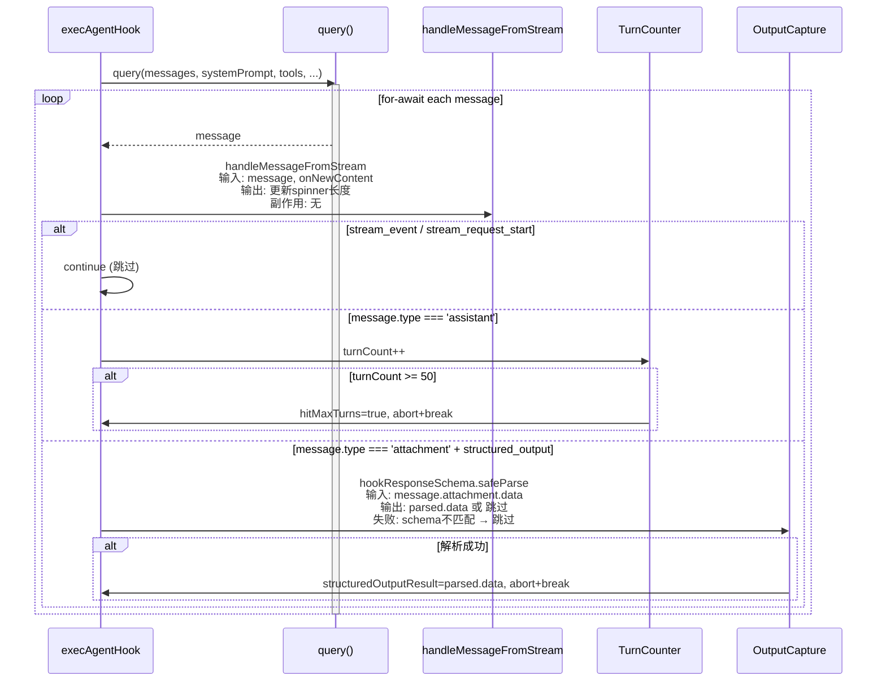

**模块内部时序解释：**

1. query() 是完整的多轮对话循环，每次迭代产生一个 Message——可能是 stream_event（流式增量）、assistant（完整响应）或 attachment（工具结果）
2. handleMessageFromStream 处理流式增量更新，通过 setResponseLength 更新 UI spinner 显示进度
3. 轮数计数仅对 assistant 类型消息——每个 assistant 消息代表一次 LLM 调用 + 工具执行循环
4. 结构化输出从 attachment 消息中提取——StructuredOutput.call() 的结果会以 `{type: 'structured_output', data: ...}` 形式出现在消息流中

#### 与其他模块的交互

| 交互对象 | 交互方式 | 数据格式 | 触发条件 |
|----------|----------|----------|----------|
| LLM API | query() 内部调用 | API request/response | 每轮对话 |
| Tool 系统 | query() 内部执行工具 | Tool call/result | 子 Agent 调用工具时 |
| 结构化输出捕获 | attachment 消息 | `{type: 'structured_output', data: {ok, reason}}` | 子 Agent 调用 StructuredOutput |

### 5.4 结构化输出捕获与验证模块

#### C4 Component 图

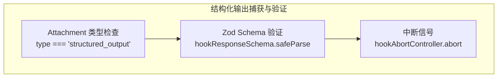

**Component 图解释：**

1. 拆分逻辑：按捕获流程的三个步骤拆分——类型识别→Schema 验证→中断信号
2. 核心组件是 SchemaValid，使用 hookResponseSchema 对 StructuredOutput 工具返回的数据做 Zod 验证，确保 `ok` 字段存在且为 boolean
3. 验证失败时静默跳过——不做错误处理，继续等待下一个有效的结构化输出
4. 验证成功后立即调用 hookAbortController.abort() 中断 query() 循环——不需要等待循环自然结束

#### 数据结构

```typescript
// 来自 src/utils/hooks/hookHelpers.ts
export const hookResponseSchema = lazySchema(() =>
  z.object({
    ok: z.boolean().describe('Whether the condition was met'),
    reason: z.string().describe('Reason, if the condition was not met').optional(),
  }),
)

// 来自 src/utils/hooks/execAgentHook.ts (内联逻辑)
let structuredOutputResult: { ok: boolean; reason?: string } | null = null

// 捕获逻辑（在 query() 循环内）
if (message.type === 'attachment' && message.attachment.type === 'structured_output') {
  const parsed = hookResponseSchema().safeParse(message.attachment.data)
  if (parsed.success) {
    structuredOutputResult = parsed.data
    hookAbortController.abort()
    break
  }
}
```

#### 存储与持久化

- 存储路径：纯内存局部变量
- 生命周期：从捕获到 execAgentHook 返回

#### 模块内部时序图

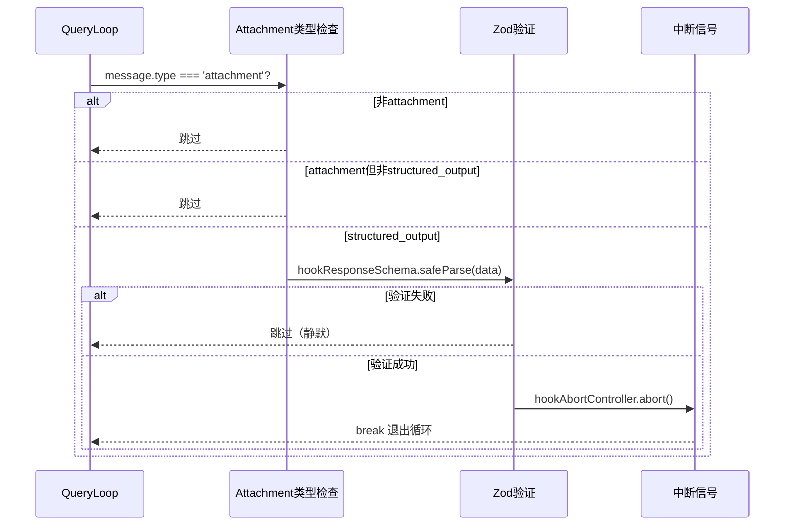

**模块内部时序解释：**

1. 时序起点是 QueryLoop 产生的每条消息
2. 三级过滤：message.type 必须是 'attachment' → attachment.type 必须是 'structured_output' → hookResponseSchema.safeParse 必须成功
3. 验证失败静默跳过的设计意图：子 Agent 可能在中间步骤产生不合规的输出，不应因此中断——继续等待最终的有效输出
4. 中断信号的副作用：hookAbortController.abort() 会传递到 query() 内部的 AbortSignal，取消正在进行的 LLM API 调用

#### 与其他模块的交互

| 交互对象 | 交互方式 | 数据格式 | 触发条件 |
|----------|----------|----------|----------|
| 多轮查询循环 | 从 attachment 消息中提取 | `{type: 'structured_output', data: {ok, reason}}` | 子 Agent 调用 StructuredOutput |
| 结果映射 | 提供 structuredOutputResult | `{ok: boolean, reason?: string} \| null` | query() 循环结束后 |

### 5.5 结果映射与返回模块

#### C4 Component 图

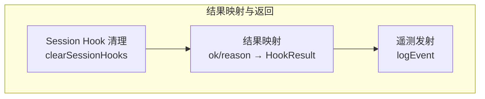

**Component 图解释：**

1. 拆分逻辑：按返回前的三个步骤拆分——清理→映射→遥测
2. 核心组件是 Mapper，将 `{ok, reason}` 映射为标准 HookResult——ok=true 映射为 outcome='success'，ok=false 映射为 outcome='blocking'
3. Cleanup 清理注册的 StructuredOutput 强制 Function Hook，防止影响后续的 Stop Hook 执行
4. Telemetry 发射三种事件：success（条件通过）、max_turns（轮数超限）、error（无输出或 API 错误）

#### 数据结构

```typescript
// 来自 src/utils/hooks/execAgentHook.ts (返回值构造)

// ok=true: 条件通过
{
  hook,
  outcome: 'success',
  message: createAttachmentMessage({
    type: 'hook_success',
    hookName,
    toolUseID: effectiveToolUseID,
    hookEvent,
    content: '',
  }),
}

// ok=false: 条件未通过 → 阻塞
{
  hook,
  outcome: 'blocking',
  blockingError: {
    blockingError: `Agent hook condition was not met: ${structuredOutputResult.reason}`,
    command: hook.prompt,
  },
}

// hitMaxTurns / 无结构化输出: 取消
{
  hook,
  outcome: 'cancelled',
}

// API 错误: 非阻塞错误
{
  hook,
  outcome: 'non_blocking_error',
  message: createAttachmentMessage({
    type: 'hook_non_blocking_error',
    hookName,
    toolUseID: effectiveToolUseID,
    hookEvent,
    stderr: `Error executing agent hook: ${errorMsg}`,
    stdout: '',
    exitCode: 1,
  }),
}
```

#### 存储与持久化

- 存储路径：纯内存，HookResult 由 executeHooks 进一步聚合为 AggregatedHookResult

#### 模块内部时序图

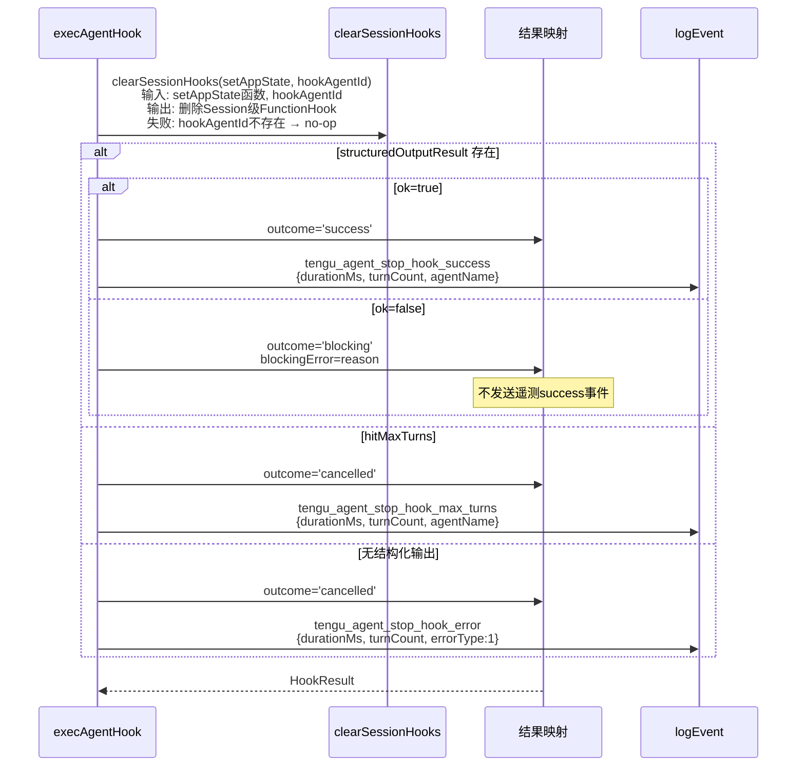

**模块内部时序解释：**

1. Session Hook 清理始终执行——即使在 catch 块中也要确保 Function Hook 被移除，防止泄漏到后续的 Stop Hook 执行
2. ok=false 映射为 outcome='blocking' 而非 'non_blocking_error'——这是 Agent Hook 的核心语义：验证未通过意味着应该阻止主流程继续
3. cancelled 结果不显示任何 UI 消息——静默取消是为了避免干扰用户
4. 遥测事件中的 durationMs 和 turnCount 用于监控 Agent Hook 的执行性能和成本

#### 与其他模块的交互

| 交互对象 | 交互方式 | 数据格式 | 触发条件 |
|----------|----------|----------|----------|
| Hook 执行引擎 | 返回 HookResult | `{outcome, blockingError?, message?}` | execAgentHook 返回 |
| Session Hook 管理 | clearSessionHooks | hookAgentId | query() 循环结束后 |
| Analytics | logEvent | `{durationMs, turnCount, errorType?}` | 每种终态 |

---

## 六、设计原理与对比分析

### 设计取舍

| # | 当前方案 | 替代方案 | 当前方案优势 | 替代方案优势 | 选择理由 |
|---|----------|----------|-------------|-------------|----------|
| 1 | 多轮自主 Agent（query()） | 单轮 LLM 评估（queryModelWithoutStreaming） | 可使用工具读取文件、搜索代码、执行命令，验证深度高 10x+ | 延迟低（1-3s vs 10-60s），成本低（1 次 API 调用 vs 多轮） | Agent Hook 的核心价值正是自主验证——需要工具调用的验证场景（如"检查测试是否通过"）无法用单轮评估完成；对简单条件用 Prompt Hook |
| 2 | StructuredOutput 工具作为唯一输出通道 | 解析助手消息文本中的 JSON | 结构化输出类型安全（Zod 验证），不会与对话文本混淆 | 无需注入额外工具，减少 prompt token | StructuredOutput 工具提供类型安全保证——hookResponseSchema.safeParse 确保输出格式正确；解析文本 JSON 容易受对话干扰 |
| 3 | Function Hook 强制调用 StructuredOutput | System Prompt 指令要求调用 | 强制性——Function Hook 返回 false 会阻止停止，100% 保证调用 | 无额外 Session Hook 注册/清理开销 | System Prompt 指令不被 100% 遵守（模型可能忽略）；Function Hook 是硬性约束，确保子 Agent 必须调用 StructuredOutput |
| 4 | 过滤 ALL_AGENT_DISALLOWED_TOOLS | 不过滤，允许子 Agent 使用所有工具 | 防止递归嵌套（Agent 套 Agent）、计划模式进入、用户交互对话框弹出 | 子 Agent 能力更强，可执行更复杂验证 | 递归嵌套风险高——Stop Hook Agent 如果再 spawn Agent 会导致无限循环；计划模式和用户交互也不适合后台验证场景 |
| 5 | 独立 hookAgentId 隔离子 Agent | 复用父 agentId | Session Hook 隔离（clearSessionHooks 不影响父级）、权限上下文独立、transcript 独立写入 | 无需创建新 agentId，代码更简单 | 独立 agentId 确保子 Agent 的 Function Hook 和 transcript 不会污染父级上下文；clearSessionHooks 只清理子 Agent 的 Hook |
| 6 | MAX_AGENT_TURNS=50 硬上限 | 无轮数限制 | 防止失控循环，成本可控（最多 50 次 API 调用） | 子 Agent 可完成任意复杂的验证任务 | 50 轮已覆盖绝大多数验证场景；失控循环的代价极高（token 消耗、延迟）；超时机制（默认 60s）是双重保险 |

### 系统间对比

| 对比维度 | Agent Hook | Prompt Hook | Command Hook |
|----------|-----------|-------------|-------------|
| 执行方式 | query() 多轮循环 | queryModelWithoutStreaming 单轮 | spawn Shell 子进程 |
| 工具访问 | 全部（除禁用）+ StructuredOutput | 无工具 | 无（仅 Shell 命令） |
| 延迟 | 10-60s（多轮） | 1-5s（单轮） | 0.1-10s（命令执行） |
| 成本 | 高（多轮 API 调用） | 低（1 次 API 调用） | 无（本地执行） |
| 验证深度 | 最高（可读文件、搜索代码、执行命令） | 中（仅 LLM 评估） | 中（仅 Shell 命令输出） |
| 输出格式 | `{ok, reason}` (Zod 验证) | `{ok, reason}` (Zod 验证) | JSON 或纯文本 (Zod 可选) |
| 默认超时 | 60s | 30s | 10min |
| 默认模型 | getSmallFastModel (Haiku) | getSmallFastModel (Haiku) | N/A |
| REPL 外支持 | 否（"Agent stop hooks are not yet supported outside REPL"） | 否（需要 toolUseContext） | 是 |

### 边界条件

| 设计结论 | 何时不成立 | 原因 |
|----------|-----------|------|
| Function Hook 强制调用 StructuredOutput 100% 保证 | 子 Agent 在 Function Hook 超时（5s）内未完成调用 | FunctionHook 的 timeout 默认 5s，如果子 Agent 在 Stop 时正在执行长时间工具调用，可能来不及响应 Function Hook 的重试；但 5s 通常足够完成简单的 StructuredOutput 调用 |
| MAX_AGENT_TURNS=50 防止失控 | 子 Agent 在每轮消耗极少 token 但执行 50 轮有效验证 | 50 轮限制是计数限制而非 token 限制；如果每轮只做简单操作（如 Read 一个文件），50 轮可能在 60s 超时前用完 |
| 独立 hookAgentId 隔离子 Agent 上下文 | 子 Agent 修改了全局状态（如通过 Bash 写入文件） | agentId 隔离的是 Session Hook 和 transcript，不隔离文件系统或 Shell 环境的副作用 |
| ALL_AGENT_DISALLOWED_TOOLS 防止递归 | ant 用户环境下 Agent Tool 不在禁用列表 | 代码中 `process.env.USER_TYPE === 'ant' ? [] : [AGENT_TOOL_NAME]`——ant 用户允许嵌套 Agent，可能导致递归 |
| StructuredOutput 工具的 Zod 验证确保输出格式 | 模型调用 StructuredOutput 时传入的对象不符合 hookResponseSchema | SyntheticOutputTool.call() 内部使用 Ajv 验证输入 schema，不合规输入会抛出 TelemetrySafeError，但 execAgentHook 只通过 attachment 消息捕获成功调用的结果 |

### 设计原则总结

1. **自主验证优先**：Agent Hook 的核心价值是"让子 Agent 自己去验证"，而非"让用户写脚本去验证"——子 Agent 可以读取 transcript、搜索代码、执行命令，做出比脚本更智能的判断
2. **结构化输出刚性约束**：Function Hook 强制 + StructuredOutput 工具 + Zod 验证三重保障，确保子 Agent 的输出格式始终可控——不存在"模型自由文本被误读为决策"的风险
3. **隔离与清理**：独立 hookAgentId + clearSessionHooks 确保子 Agent 的副作用（Session Hook 注册、权限规则添加）不会泄漏到父级上下文

---

## 七、总结与索引

### 核心关系表

| 概念A | 关系 | 概念B |
|-------|------|-------|
| AgentHook | 输入到 | execAgentHook |
| execAgentHook | 调用 | createStructuredOutputTool |
| execAgentHook | 调用 | query() |
| query() | 产生 | attachment (structured_output) |
| attachment | 验证于 | hookResponseSchema |
| hookResponseSchema | 映射到 | HookResult |
| registerStructuredOutputEnforcement | 注册于 | Session Hook (hookAgentId) |
| clearSessionHooks | 清理于 | Session Hook (hookAgentId) |
| ALL_AGENT_DISALLOWED_TOOLS | 过滤于 | toolUseContext.options.tools |

### 设计原则

1. 自主验证优先——子 Agent 拥有工具访问权，可自主读取/搜索/执行验证
2. 结构化输出刚性约束——Function Hook + StructuredOutput + Zod 三重保障输出格式
3. 隔离与清理——独立 agentId + clearSessionHooks 防止上下文泄漏

### 核心洞察

Agent Hook 的核心设计洞察是"结构化输出作为控制流"——它不是传统意义上的数据通道，而是一个控制流原语：子 Agent 调用 StructuredOutput 就是"提交决策"，不调用就是"未完成"。这种设计将 LLM 的自由文本输出转化为可编程的 boolean 决策，使 Hook 执行引擎能够基于 `{ok, reason}` 做出确定性的阻塞/放行判断。第二个关键洞察是"Function Hook 作为硬性约束层"——System Prompt 中的指令是软性约束（模型可能忽略），而 Function Hook 在 Stop 事件时返回 false 是硬性约束（阻止子 Agent 停止），两者配合实现了 100% 的 StructuredOutput 调用保证。第三个洞察是"Agent Hook 只在 REPL 内执行"——executeHooksOutsideREPL 对 agent 类型直接返回 `succeeded: false`，因为多轮查询需要完整的 ToolUseContext 和消息流，这在 REPL 外不可用。

### 相关文件索引

| 文件路径 | 职责 |
|----------|------|
| `src/utils/hooks/execAgentHook.ts` | Agent Hook 执行主文件：prompt 替换、工具集装配、query() 循环、结构化输出捕获、结果映射 |
| `src/utils/hooks/hookHelpers.ts` | 共享工具：hookResponseSchema、addArgumentsToPrompt、createStructuredOutputTool、registerStructuredOutputEnforcement |
| `src/schemas/hooks.ts` | AgentHookSchema 定义：prompt、timeout、model、if、once 等字段 |
| `src/tools/SyntheticOutputTool/SyntheticOutputTool.ts` | StructuredOutput 工具：Ajv schema 验证、structured_output attachment 生成 |
| `src/constants/tools.ts` | ALL_AGENT_DISALLOWED_TOOLS 定义：Agent/Plan/Ask/Task 等禁用工具集合 |
| `src/utils/hooks/sessionHooks.ts` | addFunctionHook / clearSessionHooks：Session 级 Hook 注册和清理 |
| `src/utils/argumentSubstitution.ts` | substituteArguments：$ARGUMENTS/$0/$1 等占位符替换 |
| `src/utils/messages.ts` | hasSuccessfulToolCall：检查消息中是否有指定工具的成功调用 |
| `src/query.ts` | query() 函数：完整多轮查询循环（被 Agent Hook 调用） |
