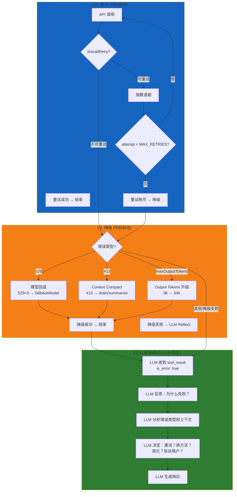

# Fault Tolerance System 容错机制

> 本文档基于代码分析，整理 Claude Code 中的容错机制设计。

## 概述

Claude Code 实现了**三级容错体系**，从程序化恢复逐步过渡到 LLM 自主决策：

```
重试 (代码)  →  降级 (代码)  →  LLM Reflect (LLM)
```

| 层级 | 执行者 | LLM 知情 | 灵活性 |
|------|--------|----------|--------|
| **重试** | 代码 | ❌ | 固定策略 |
| **降级** | 代码 | ❌ | 固定策略 |
| **LLM Reflect** | LLM | ✅ | 无限灵活 |

---

## 一、重试 (Retry)

### 1.1 核心机制

**触发时机**：API 调用抛出异常后，**在 LLM 看到结果之前**，代码自动执行。

```typescript
// withRetry.ts - 伪代码
async function withRetry(apiCall) {
  for (attempt = 1; attempt <= MAX_RETRIES; attempt++) {
    try {
      return await apiCall()
    } catch (error) {
      if (!shouldRetry(error)) throw error
      delay = getRetryDelay(attempt)
      await sleep(delay)
    }
  }
  throw new CannotRetryError()
}
```

**指数退避 + jitter：**
```
baseDelay = min(500ms * 2^(attempt-1), maxDelayMs)
jitter = random() * 0.25 * baseDelay
totalDelay = baseDelay + jitter
```

### 1.2 重试条件

| 错误类型 | 是否重试 | 说明 |
|---------|---------|------|
| 408 (Request Timeout) | ✅ | 超时重试 |
| 409 (Conflict) | ✅ | 冲突重试 |
| 429 (Rate Limit) | ✅ | 限流重试 |
| 500+ (Server Error) | ✅ | 服务端错误重试 |
| 529 (Overloaded) | ✅ | 最多 3 次 |
| `x-should-retry: true` header | ✅ | 服务端指示可重试 |
| 连接错误 (`APIConnectionError`) | ✅ | 网络问题重试 |
| 401/403 (CCR 模式) | ✅ | 视为瞬态错误 |
| 401/403 (普通模式) | ❌ | 认证问题不重试 |

### 1.3 关键常量

| 常量 | 值 | 说明 |
|-----|-----|------|
| `DEFAULT_MAX_RETRIES` | 10 | 默认最大重试次数 |
| `MAX_529_RETRIES` | 3 | 529 错误最大重试次数 |
| `BASE_DELAY_MS` | 500ms | 退避基数 |
| `PERSISTENT_MAX_BACKOFF_MS` | 5 分钟 | 最大退避时间 |
| `SHORT_RETRY_THRESHOLD_MS` | 20s | 短重试阈值 |

### 1.4 无人值守模式

当设置 `CLAUDE_CODE_UNATTENDED_RETRY` 环境变量时：
- 429/529 错误无限重试
- 最长 5 分钟回退间隔
- 每 30 秒 yield 一次 heartbeat 防止会话被标记为空闲
- 解析 `retry-after` header 等待到 reset 时间再重试

---

## 二、降级 (Degradation)

### 2.1 核心机制

**触发时机**：所有重试都失败后，**在 LLM 看到结果之前**，代码自动切换策略。

```typescript
// query.ts - 伪代码
if (error is 529 && attempts >= 3 && fallbackModel) {
  switchToFallbackModel()      // Opus → Sonnet
  stripThinkingSignatures()    // 去除 model-specific 语法
  retryFromScratch()           // 全新请求
}

if (error is 413) {
  if (canDrainContext()) drainContextCheaply()
  else compactWithHaiku()      // 用 Haiku 做摘要
  retry()
}
```

### 2.2 降级策略

| 降级策略 | 触发条件 | 动作 |
|---------|---------|------|
| **模型回退** | 529 × 3 + `fallbackModel` 配置 | Opus → Sonnet，去除 thinking 签名 |
| **Context Collapse** | 413 prompt too long | 廉价 drain，保留粒度 |
| **Reactive Compact** | Context collapse 不够 | 用 Haiku 做全量摘要 |
| **Output Tokens 升级** | `maxOutputTokens` 耗尽 | 8k → 64k，注入恢复消息 |
| **Fallback Storage** | Primary storage 失败 | 降级到 secondary storage |

### 2.3 Prompt Too Long (413) 恢复

413 错误在 streaming 期间**被扣留 (withheld)**，不立即暴露。恢复策略按顺序尝试：

1. **Context collapse drain** — 廉价方案，保留粒度
2. **Reactive compact** — 用 Haiku 做全量摘要（如果启用）
3. 都失败才触发 stop hooks

### 2.4 Max Output Tokens 恢复

同样 withheld，恢复策略：

1. 首次重试：`maxOutputTokens` 从 8k 升至 64k
2. 后续重试：注入恢复消息 "pick up mid-thought"
3. 超过 3 次恢复限制（`MAX_OUTPUT_TOKENS_RECOVERY_LIMIT`）才暴露错误

### 2.5 模型回退 (Fallback)

529 错误超过 3 次且配置了 `fallbackModel` 时：
- 抛出 `FallbackTriggeredError`
- 切换到 fallback model
- 去除 thinking signatures（model 特定）
- 从头重试（不带之前失败的上下文）

---

## 三、LLM Reflect

### 3.1 核心机制

**触发时机**：当所有程序化恢复都失败，或者错误类型不适合程序化恢复时，错误作为 `tool_result { is_error: true }` 返回给 LLM。

**这是最关键的一层，但代码实现却极其简单：**

```typescript
// toolExecution.ts - catch 块
catch (error) {
  const content = formatError(error)
  return [
    {
      message: createUserMessage({
        content: [
          {
            type: 'tool_result',
            content,              // 错误消息
            is_error: true,       // ← 唯一标识
            tool_use_id: toolUseID,
          },
        ],
      }),
    },
  ]
}
```

**关键洞察**：错误和成功的结果在格式上**完全一致**，都是 `ContentBlockParam` 数组，都是 `createUserMessage()` 包装。唯一区别是 `is_error: true`。

### 3.2 完整流程

```
Tool 执行失败
    │
    ▼
catch 块捕获 → formatError() → "Error: ENOENT: no such file..."
    │
    ▼
包装成 { type: 'tool_result', content: '...', is_error: true, tool_use_id: xxx }
    │
    ▼
createUserMessage() → 作为普通用户消息进入消息队列
    │
    ▼
LLM 在下一轮 query 收到这条消息
    │
    ▼
LLM 看到 is_error: true，意识到失败了
    │
    ▼
LLM 反思："为什么失败？怎么办？"
    │
    ▼
LLM 决定：重试？换方法？简化？告诉用户？
    │
    ▼
重新调用 tool 或生成其他响应
```

### 3.3 为什么叫 "Reflect"

不是代码里有什么 `reflect()` 函数，而是：
1. **错误被注入到对话上下文中** — LLM 下一轮会"看到"这个错误
2. **LLM 自己反思** — "这个 tool 失败了，为什么？怎么办？"
3. **LLM 自己决定恢复策略** — 重试、换方法、或告诉用户

### 3.4 LLM Reflect 能处理什么

代码层面只做了把错误格式化成字符串并标记 `is_error: true`，剩下的全靠 LLM 的推理能力：

| 错误类型 | LLM 可能的恢复策略 |
|---------|------------------|
| Permission denied | 换一个文件操作方式，或请用户授权 |
| File not found | 检查路径或列出目录内容 |
| Timeout | 重试或简化请求 |
| Invalid input | 修正参数格式 |
| Rate limit | 等待一下再试 |
| 完全未知的错误 | 分析错误消息，猜测原因 |

### 3.5 对比传统异常处理

| | 传统 try/catch | Claude Code LLM Reflect |
|---|---|---|
| **控制流** | 异常打断，跳跃到 handler | 错误作为普通消息继续流程 |
| **错误处理** | 匹配类型，代码决定动作 | LLM 看到错误，自己决定动作 |
| **灵活性** | 有限，硬编码分支 | 无限，LLM 自主决策 |
| **上下文保留** | 需要手动传递 | 自然保留在对话中 |
| **复杂性** | handler 可能很复杂 | 代码极简（就一行 `is_error: true`） |

---

## 四、三级容错完整流程图



---

## 五、具体例子与 Bad Case

### 5.1 重试例子：网络抖动

```
用户输入: "帮我写一个 Hello World"
    │
    ▼
LLM 调用 API
    │
    ▼
网络抖动 → ECONNRESET
    │
    ▼
重试 attempt 1 (500ms + jitter)
    │
    ▼
仍然失败
    │
    ▼
重试 attempt 2 (1000ms + jitter)
    │
    ▼
成功 → 返回结果给 LLM
```

**用户感知**：比平时慢 1-2 秒，但最终成功，不知道中间重试了。

---

### 5.2 重试例子：Rate Limit

```
用户输入: "解释这段代码"
    │
    ▼
LLM 调用 API
    │
    ▼
429 Rate Limit
    │
    ▼
解析 retry-after header: 30秒
    │
    ▼
重试 attempt 1: 等待 30s → 仍然 429
    │
    ▼
重试 attempt 2: 等待 60s → 成功
```

**用户感知**：等待一段时间后成功。

---

### 5.3 降级例子：模型回退

```
用户输入: "重构这个模块"
    │
    ▼
LLM 调用 API ( Opus )
    │
    ▼
529 Overloaded
    │
    ▼
重试 × 3 → 全部 529
    │
    ▼
降级: 切换到 fallbackModel (Sonnet)
    │
    ▼
去除 thinking signatures ( Opus 特有语法 )
    │
    ▼
重新发送请求 → 成功
```

**用户感知**：Claude Code 自动换成了更快的模型，不知道具体原因。

---

### 5.4 降级例子：Context 过长

```
用户粘贴了一篇很长的文章
    │
    ▼
LLM 调用 API
    │
    ▼
413 Prompt Too Long
    │
    ▼
重试 × 3 → 全部 413
    │
    ▼
降级: Context Collapse (廉价 drain)
    │
    ▼
尝试 compact 一些历史消息
    │
    ▼
重试 → 成功 (上下文变短了)
```

**用户感知**：回复变短了，但回答质量可能略有下降。

---

### 5.5 LLM Reflect 例子：权限拒绝

```
用户输入: "删除 ~/.ssh/id_rsa"
    │
    ▼
LLM 调用 BashTool("rm -rf /home/user/.ssh/id_rsa")
    │
    ▼
权限拒绝: Permission denied
    │
    ▼
返回 tool_result { is_error: true, content: "Permission denied" }
    │
    ▼
LLM 反思: "权限被拒了，可能需要用户授权"
    │
    ▼
LLM 生成: "无法删除该文件，需要提升权限。您可以手动执行 sudo rm -rf /home/user/.ssh/id_rsa"
```

**用户感知**：Claude Code 解释了为什么做不到，并给出了替代方案。

---

### 5.6 LLM Reflect 例子：文件不存在

```
用户输入: "读取 /tmp/nonexistent.txt"
    │
    ▼
LLM 调用 ReadTool("/tmp/nonexistent.txt")
    │
    ▼
文件不存在: ENOENT
    │
    ▼
返回 tool_result { is_error: true, content: "Error: ENOENT: no such file..." }
    │
    ▼
LLM 反思: "文件不存在，可能是路径错误"
    │
    ▼
LLM 决定: "先检查目录里有什么文件"
    │
    ▼
LLM 调用 BashTool("ls /tmp/")
    │
    ▼
发现文件在别处，修正路径，重新读取
```

**用户感知**：Claude Code 自动尝试了替代方案，而不是直接报错。

---

### 5.7 Bad Case：Zod 校验失败 + LLM 修正

```
用户输入: "用 grep 搜索包含 'error' 的文件"
    │
    ▼
LLM 调用 GrepTool({ pattern: "error" })  ← 缺少必需参数 path
    │
    ▼
Zod 校验失败: Required field 'path' missing
    │
    ▼
返回 tool_result { is_error: true, content: "InputValidationError: path is required" }
    │
    ▼
LLM 反思: "参数不够，需要加上 path 参数"
    │
    ▼
LLM 修正: GrepTool({ pattern: "error", path: "." })
    │
    ▼
重试 → 成功
```

**用户感知**：Claude Code 自动修正了参数，任务成功完成。

---

### 5.8 Bad Case：连续重试耗尽

```
用户输入: "分析这个 100MB 的日志文件"
    │
    ▼
LLM 调用 API
    │
    ▼
图像/媒体过大错误
    │
    ▼
重试 × 10 → 全部失败
    │
    ▼
降级: Reactive Compact → 失败
    │
    ▼
返回 tool_result { is_error: true, content: "Error: File too large..." }
    │
    ▼
LLM 反思: "文件太大，需要先压缩或分割"
    │
    ▼
LLM 生成: "这个日志文件太大了(100MB)，我可以帮您：
  1. 压缩后再分析
  2. 只分析最后 N 行
  3. 分割成小文件后分别分析"
```

---

### 5.9 Bad Case：未知错误类型

```
用户输入: "执行某个自定义操作"
    │
    ▼
LLM 调用某个 Tool
    │
    ▼
抛出完全未预料的错误: "The wheel on the bus goes round and round"
    │
    ▼
返回 tool_result { is_error: true, content: "Error: The wheel on the bus..." }
    │
    ▼
LLM 反思: "这个错误信息很奇怪，不像是标准错误"
    │
    ▼
LLM 决定: "这是个未知错误，我应该告诉用户，并建议他们检查操作是否正确"
```

**这就是 LLM Reflect 的强大之处**：即使是完全未知的错误，LLM 也能分析并给出合理的响应。

---

### 5.10 Bad Case：MCP Server 连接失败

```
用户输入: "使用 GitHub MCP 搜索仓库"
    │
    ▼
LLM 调用 GitHub MCP tool
    │
    ▼
MCP server 返回: Connection refused (ECONNREFUSED)
    │
    ▼
返回 tool_result { is_error: true, content: "<tool_use_error>Error calling tool (github): Connection refused" }
    │
    ▼
LLM 反思: "GitHub MCP 服务连不上"
    │
    ▼
LLM 生成: "GitHub MCP 服务似乎不可用，您可以：
  1. 检查 MCP 服务是否在运行
  2. 手动在 GitHub 网页上操作
  3. 稍后再试"
```

---

### 5.11 例子总结表

| 场景 | 层级 | 错误类型 | LLM 恢复策略 |
|------|------|---------|------------|
| 网络抖动 | 重试 | ECONNRESET | 无（代码自动恢复） |
| Rate Limit | 重试 | 429 | 无（代码自动恢复） |
| 模型过载 | 降级 | 529 × 3 | 无（代码自动换模型） |
| 上下文超限 | 降级 | 413 | 无（代码自动压缩） |
| 权限拒绝 | LLM Reflect | Permission denied | 解释+替代方案 |
| 文件不存在 | LLM Reflect | ENOENT | 检查路径+重试 |
| 参数错误 | LLM Reflect | Zod validation | 修正参数+重试 |
| MCP 不可用 | LLM Reflect | ECONNREFUSED | 解释+建议 |
| 完全未知错误 | LLM Reflect | 奇怪的消息 | 分析 |

---

## 六、没有熔断器 (Circuit Breaker)

Claude Code 没有实现熔断器，原因是：

### 6.1 不需要熔断的场景

**分布式系统需要熔断**：防止级联故障。A 服务挂了，不应该继续调用 B，B 应该快速失败。

**Claude Code 不需要**：
- 单客户端 → 单 API（Anthropic）
- 重试已经处理了瞬态错误
- API 真正挂了，重试会全部超时，最终返回 `is_error: true` 给 LLM Reflect

### 6.2 可以加熔断的地方（如果需要）

| 位置 | 熔断条件 | 动作 |
|------|---------|------|
| Rate Limit | 429 持续出现 | 5 分钟内不再请求，提示用户"限流中" |
| 认证错误 | 401/403 连续出现 | 暂时跳过验证，防止 token 反复失败 |
| MCP Server | 某个 server 连续超时/错误 | 暂时禁用这个 server |

---

## 七、错误日志与追踪

### 7.1 错误日志

所有错误写入 `~/.claude/logs/errors/{date}.jsonl`：
- Axios 错误 enrichment（URL、status、server message）
- MCP server 错误写入 `mcpLogs/{serverName}/errors.jsonl`

### 7.2 错误 ID

```typescript
// constants/errorIds.ts
E_TOOL_USE_SUMMARY_GENERATION_FAILED = 344
// Next ID: 346
```

### 7.3 Telemetry Safe Error

```typescript
// utils/errors.ts
class TelemetrySafeError_I_VERIFIED_THIS_IS_NOT_CODE_OR_FILEPATHS
// 错误消息必须经过验证，不含敏感信息才能使用此类
```

---

## 八、错误处理文件索引

| 文件 | 职责 |
|------|------|
| `services/api/withRetry.ts` | API 重试逻辑、指数退避 |
| `services/api/errors.ts` | API 错误分类、用户友好消息 |
| `services/api/errorUtils.ts` | 连接错误分类、SSL 错误提示 |
| `services/tools/toolExecution.ts` | Tool 调用错误处理、返回 `is_error: true` |
| `query.ts` | 降级策略（模型回退、compact、output tokens） |
| `utils/errors.ts` | 基础错误类型定义 |
| `utils/errorLogSink.ts` | 错误日志写入 |
| `services/mcp/client.ts` | MCP 连接错误处理、重连机制 |

---

## 九、总结

| 维度 | 重试 | 降级 | LLM Reflect |
|------|------|------|------------|
| **本质** | 瞬态错误自动重试 | 程序化策略切换 | 把决策权交给 LLM |
| **执行者** | 代码 | 代码 | LLM |
| **触发条件** | 网络/429/529 等瞬态错误 | 重试耗尽 + 特定错误 | 所有程序化手段都失败 |
| **LLM 知情？** | ❌ 完全不知道 | ❌ 完全不知道 | ✅ 看到 `is_error: true` |
| **灵活性** | 固定（指数退避） | 固定（预设策略） | 无限（LLM 自主决策） |
| **典型场景** | 网络抖动、限流、短暂过载 | 模型过载、上下文超限、输出超限 | 权限拒绝、文件不存在、未预见的错误 |

**设计哲学**：前两级是程序预设的固定套路，处理最常见的错误；第三级是最终兜底，当程序搞不定时，把问题交给 LLM 让它自己想办法。这比传统异常处理（catch → 匹配类型 → 硬编码处理）灵活得多——LLM 可以处理代码未曾预见到的错误类型。
