# Hook 模块 生命周期事件驱动的用户扩展框架

> 本文档基于代码分析，整理 Claude Code 中 Hook 模块的完整设计。

## 目录

- [一、概述](#一概述)
- [二、核心概念](#二核心概念)
- [三、架构总览](#三架构总览)
  - [系统上下文（C4 Context）](#系统上下文c4-context)
  - [容器拆分（C4 Container）](#容器拆分c4-container)
  - [工作流概览](#工作流概览)
  - [各模块职责概述](#各模块职责概述)
- [四、核心工作流](#四核心工作流)
  - [核心工作流程](#核心工作流程)
  - [核心实体状态流转](#核心实体状态流转)
- [五、分模块详解](#五分模块详解)
  - [5.1 配置加载与快照模块](#51-配置加载与快照模块)
  - [5.2 Hook 匹配与路由模块](#52-hook-匹配与路由模块)
  - [5.3 Hook 执行引擎模块](#53-hook-执行引擎模块)
  - [5.4 异步 Hook 注册表模块](#54-异步-hook-注册表模块)
  - [5.5 Session Hook 管理模块](#55-session-hook-管理模块)
  - [5.6 事件发射与进度模块](#56-事件发射与进度模块)
- [六、设计原理与对比分析](#六设计原理与对比分析)
- [七、总结与索引](#七总结与索引)

---

## 一、概述

Hook 模块是 Claude Code 的生命周期事件扩展框架，允许用户、插件和内部组件在 Claude Code 运行的 26 个关键节点上注入自定义逻辑。它不是一个简单的回调系统，而是一个支持 6 种 Hook 类型（command / prompt / agent / http / callback / function）、两种执行模式（同步 REPL 内 / 异步 REPL 外）、多层安全策略的完整扩展运行时。

### 系统定位

| 维度 | 说明 |
|------|------|
| 核心职责 | 在 Claude Code 生命周期关键节点执行用户/插件/内部定义的扩展逻辑 |
| 系统性质 | 事件驱动 + 策略控制的扩展运行时框架 |
| 边界 | 上游：Claude Code 生命周期事件触发器（Tool 调用、Session 管理、权限决策等）；下游：Shell 子进程 / LLM API / HTTP 端点 / 内存回调 |
| 使用方 | 终端用户（settings.json 配置）、插件系统（plugin hooks）、内部模块（callback / function hooks）、SDK 集成 |

### 与其他系统的关系总览

| 关联系统 | 关系 |
|----------|------|
| Settings 系统 | Hook 配置的主要来源，从 user/project/local/policy 四层 settings.json 读取 Hook 定义 |
| Permission 系统 | PreToolUse Hook 可输出 permissionDecision 覆盖权限决策；PermissionRequest Hook 可直接 allow/deny 权限请求 |
| Plugin 系统 | 插件通过 `loadPluginHooks` 注册 Hook，以 PluginHookMatcher 形式注入 Hook 池 |
| Tool 系统 | PreToolUse / PostToolUse / PostToolUseFailure 等 Hook 事件由 Tool 执行流程驱动 |
| Query/REPL 循环 | Stop Hook 在 REPL 循环末端执行，可通过 exit code 2 阻止模型停止并注入反馈 |
| Session 系统 | SessionStart / SessionEnd Hook 在会话边界触发；Session Hook 以 sessionId 为作用域存入 AppState |

---

## 二、核心概念

### HookEvent（Hook 事件）

Claude Code 定义的 26 个生命周期事件，作为 Hook 触发的时机标识。

```typescript
// 来自 src/entrypoints/sdk/coreTypes.ts
export const HOOK_EVENTS = [
  'PreToolUse', 'PostToolUse', 'PostToolUseFailure',
  'Notification', 'UserPromptSubmit', 'SessionStart', 'SessionEnd',
  'Stop', 'StopFailure', 'SubagentStart', 'SubagentStop',
  'PreCompact', 'PostCompact', 'PermissionRequest', 'PermissionDenied',
  'Setup', 'TeammateIdle', 'TaskCreated', 'TaskCompleted',
  'Elicitation', 'ElicitationResult', 'ConfigChange',
  'WorktreeCreate', 'WorktreeRemove', 'InstructionsLoaded',
  'CwdChanged', 'FileChanged',
] as const
```

### HookCommand（可持久化 Hook 命令）

用户可通过 settings.json 配置的四种 Hook 类型，采用 Zod discriminated union 验证。

```typescript
// 来自 src/schemas/hooks.ts
export const HookCommandSchema = lazySchema(() => {
  const { BashCommandHookSchema, PromptHookSchema, AgentHookSchema, HttpHookSchema } = buildHookSchemas()
  return z.discriminatedUnion('type', [
    BashCommandHookSchema,  // type: 'command' — Shell 命令
    PromptHookSchema,       // type: 'prompt' — LLM 单轮评估
    AgentHookSchema,        // type: 'agent' — LLM 多轮验证
    HttpHookSchema,         // type: 'http' — HTTP POST 请求
  ])
})
```

### HookMatcher（匹配器）

将 Hook 与特定事件参数（如 tool_name、source）关联的配置结构。每个 HookEvent 下可以有多个 matcher，每个 matcher 可包含多个 Hook。

```typescript
// 来自 src/schemas/hooks.ts
export const HookMatcherSchema = lazySchema(() =>
  z.object({
    matcher: z.string().optional()
      .describe('String pattern to match (e.g. tool names like "Write")'),
    hooks: z.array(HookCommandSchema())
      .describe('List of hooks to execute when the matcher matches'),
  }),
)
```

### HookCallback / FunctionHook（内存 Hook）

不可持久化到 settings.json 的两种内存 Hook 类型，仅通过代码注册。

| 属性 | HookCallback | FunctionHook |
|------|-------------|-------------|
| 来源 | SDK 注册 / 内部模块 | Session 级代码注册 |
| 输入 | HookInput JSON | Message[] |
| 输出 | HookJSONOutput | boolean |
| 持久化 | 不可 | 不可 |
| 超时 | 可配置 | 默认 5s |
| 场景 | SDK 集成、内部遥测 | 结构化输出强制、验证守卫 |

```typescript
// 来自 src/types/hooks.ts
export type HookCallback = {
  type: 'callback'
  callback: (input: HookInput, toolUseID: string | null, abort: AbortSignal | undefined, hookIndex?: number, context?: HookCallbackContext) => Promise<HookJSONOutput>
  timeout?: number
  internal?: boolean  // 排除于 tengu_run_hook 遥测
}

// 来自 src/utils/hooks/sessionHooks.ts
export type FunctionHook = {
  type: 'function'
  id?: string
  timeout?: number
  callback: FunctionHookCallback  // (messages: Message[], signal?: AbortSignal) => boolean | Promise<boolean>
  errorMessage: string
  statusMessage?: string
}
```

### HookResult / AggregatedHookResult（执行结果）

单 Hook 执行结果与批量聚合结果。

```typescript
// 来自 src/utils/hooks.ts
export interface HookResult {
  message?: HookResultMessage
  systemMessage?: string
  blockingError?: HookBlockingError
  outcome: 'success' | 'blocking' | 'non_blocking_error' | 'cancelled'
  preventContinuation?: boolean
  stopReason?: string
  permissionBehavior?: 'ask' | 'deny' | 'allow' | 'passthrough'
  updatedInput?: Record<string, unknown>       // PreToolUse 可修改工具输入
  updatedMCPToolOutput?: unknown               // PostToolUse 可修改 MCP 输出
  permissionRequestResult?: PermissionRequestResult
  watchPaths?: string[]                         // CwdChanged/FileChanged 可注册文件监视
  hook: HookCommand | HookCallback | FunctionHook
}
```

### Sync vs Async Hook 输出

Hook 的 JSON 输出分为同步和异步两种模式。异步模式允许 Hook 在后台运行而不阻塞主流程。

```typescript
// 异步输出 — Hook 在后台执行，不阻塞主流程
{ async: true, asyncTimeout?: number }

// 同步输出 — Hook 执行完毕后返回决策
{ continue?: boolean, suppressOutput?: boolean, stopReason?: string,
  decision?: 'approve' | 'block', reason?: string,
  systemMessage?: string, hookSpecificOutput?: { ... } }
```

### if 条件过滤

HookCommand 支持可选的 `if` 字段，使用权限规则语法（如 `Bash(git *)`）在进程 spawn 前过滤，避免不必要的开销。

---

## 三、架构总览

### 系统上下文（C4 Context）

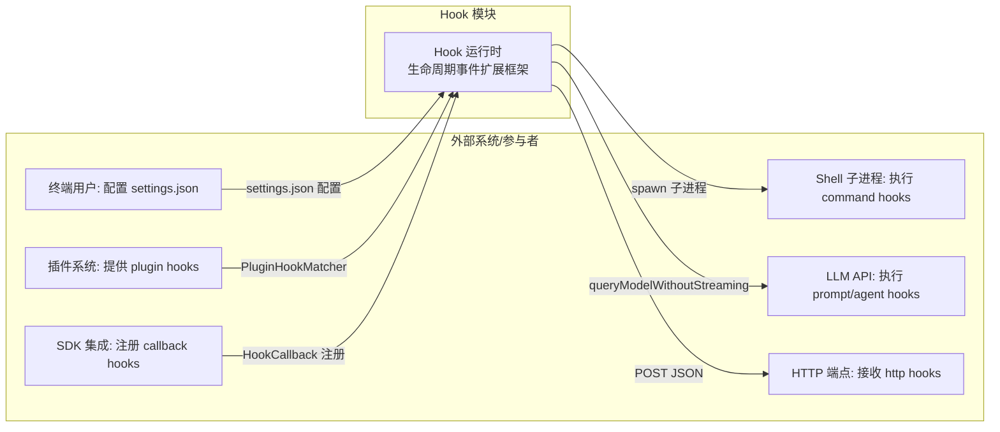

**Context 图解释：**

1. 驱动关系：Hook 模块由 Claude Code 生命周期事件驱动（Tool 调用、Session 边界、权限决策等），每个事件触发一次 Hook 匹配和执行循环
2. 服务对象：Hook 模块主要服务于三类角色——终端用户通过 settings.json 注入自动化逻辑，插件通过 hooks.json 注入扩展能力，SDK 通过 callback 实现程序化控制
3. 外部交互：Command Hook 通过 spawn 执行 Shell 子进程，Prompt/Agent Hook 通过 LLM API 完成条件评估，HTTP Hook 通过 POST 请求与远程服务交互
4. 边界划分：Hook 模块负责配置加载、匹配、执行和结果聚合；权限决策的最终执行、Shell 环境管理、LLM 请求构建均在边界外

### 容器拆分（C4 Container）

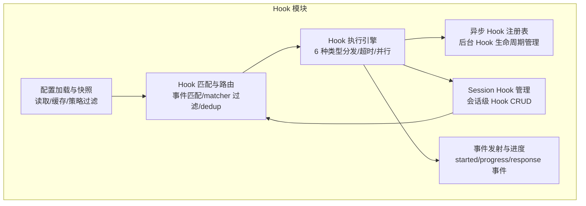

**Container 图解释：**

1. 拆分依据：按 Hook 处理流水线阶段拆分——配置加载（静态）→ 匹配路由（查询时）→ 执行（运行时）→ 异步管理（后台），每个阶段职责单一且可独立测试
2. 职责边界：ConfigLoader 只负责配置读取和策略过滤，不参与执行决策；Matcher 只负责匹配和去重，不关心执行方式；Executor 只负责调度执行，不关心配置来源
3. 依赖与数据流：配置从 ConfigLoader 流向 Matcher；Matcher 产出匹配的 Hook 列表流向 Executor；Executor 在执行过程中可能注册异步 Hook 到 AsyncRegistry、访问 SessionManager 获取会话 Hook、通过 EventEmitter 发射进度事件
4. 核心与辅助：Executor 是核心模块，承载所有 6 种 Hook 类型的执行逻辑；ConfigLoader 和 Matcher 是辅助模块，为 Executor 提供输入

### 工作流概览

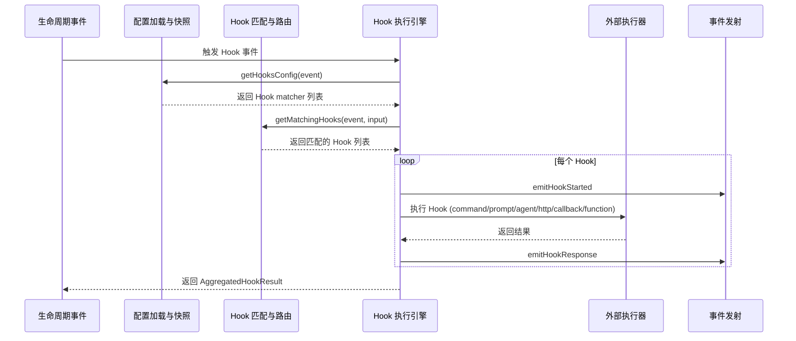

**工作流概览解释：**

1. 起点：Claude Code 生命周期中的任意事件触发 executeHooks 或 executeHooksOutsideREPL
2. 主路径：先从配置快照获取当前事件的 matcher 列表，再根据 hookInput 中的匹配字段（如 tool_name）过滤出匹配的 Hook，然后并行执行所有匹配的 Hook
3. 外部交互点：Command Hook 与 Shell 子进程交互，Prompt Hook 与 LLM API 交互，HTTP Hook 与远程端点交互，Agent Hook 与完整 query() 循环交互
4. 终点：所有 Hook 执行完毕后，聚合结果返回给调用方，包含 blocking 决策、permission 覆盖、additionalContext 等字段

### 各模块职责概述

| 模块 | 核心职责 | 关键接口 | 依赖 |
|------|----------|----------|------|
| 配置加载与快照 | 从 settings.json 读取 Hook 配置，按策略过滤并缓存 | `captureHooksConfigSnapshot()`, `getHooksConfigFromSnapshot()` | Settings 系统 |
| Hook 匹配与路由 | 根据 event 和 matchQuery 过滤、去重、if 条件过滤 | `getMatchingHooks()`, `getHooksConfig()` | 配置快照, SessionManager |
| Hook 执行引擎 | 调度 6 种 Hook 类型的执行，管理超时和信号 | `executeHooks()`, `executeHooksOutsideREPL()`, `execCommandHook()` | Matcher, AsyncRegistry, EventEmitter |
| 异步 Hook 注册表 | 管理后台运行的异步 Hook 生命周期 | `registerPendingAsyncHook()`, `checkForAsyncHookResponses()` | EventEmitter |
| Session Hook 管理 | 会话级 Hook 的 CRUD 和 function hook 管理 | `addSessionHook()`, `addFunctionHook()`, `clearSessionHooks()` | AppState |
| 事件发射与进度 | 向 SDK/遥测系统广播 Hook 执行状态 | `emitHookStarted()`, `emitHookResponse()`, `startHookProgressInterval()` | 无 |

---

## 四、核心工作流

### 核心工作流程

#### 正常流：PreToolUse Hook 执行

以 PreToolUse 为例，展示 Tool 执行前 Hook 的完整匹配-执行-决策流程。

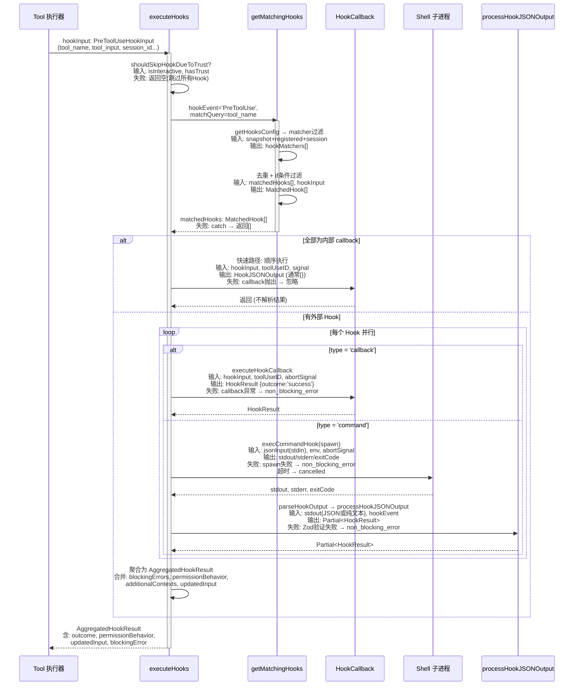

**正常流解释：**

1. 流程目标：在 Tool 执行前，收集所有匹配的 PreToolUse Hook 的决策，包括是否允许执行（permissionDecision）、是否修改输入（updatedInput）、是否注入上下文（additionalContext）
2. 步骤拆解：先检查工作区信任→获取匹配 Hook→区分内部快速路径和外部执行路径→并行执行所有 Hook→聚合结果
3. 数据变化：hookInput（JSON）→ 子进程 stdin → stdout → parseHookOutput → processHookJSONOutput → HookResult → AggregatedHookResult
4. 关键决策：内部 callback 全部走快速路径（跳过进度/超时/JSON 解析），有外部 Hook 时走完整流水线

#### 异常流：Hook 阻塞与超时

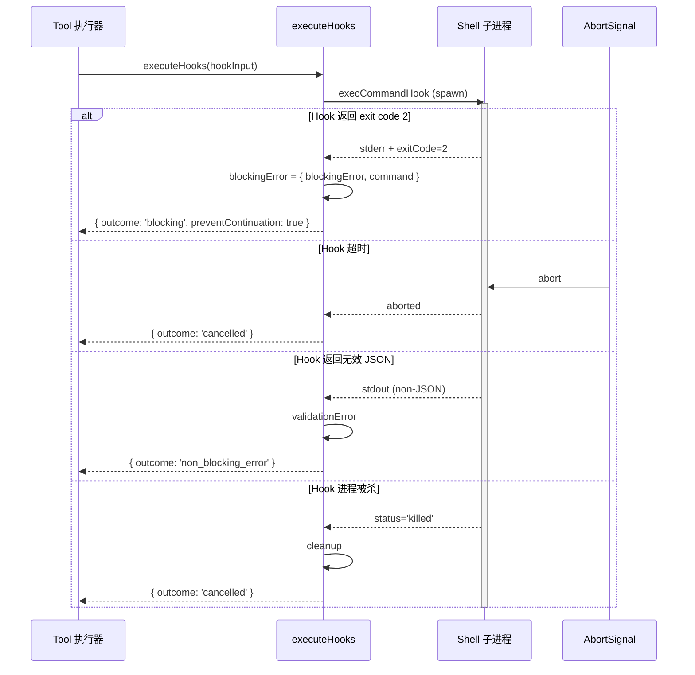

**异常流解释：**

1. 触发条件：exit code 2 表示 Hook 主动阻塞；超时由 createCombinedAbortSignal 触发；无效 JSON 由 Zod schema 验证失败触发；进程被杀由 ShellCommand.status='killed' 检测
2. 处理机制：阻塞结果直接设置 preventContinuation=true；超时和被杀标记为 cancelled；无效 JSON 标记为 non_blocking_error——不阻塞主流程
3. 恢复策略：阻塞和无效 JSON 不支持自动恢复，由调用方决定是否重试；超时可通过 CLAUDE_CODE_SESSIONEND_HOOKS_TIMEOUT_MS 环境变量调整
4. 影响范围：阻塞结果阻止 Tool 执行；cancelled 和 non_blocking_error 不阻止主流程继续

### 核心实体状态流转

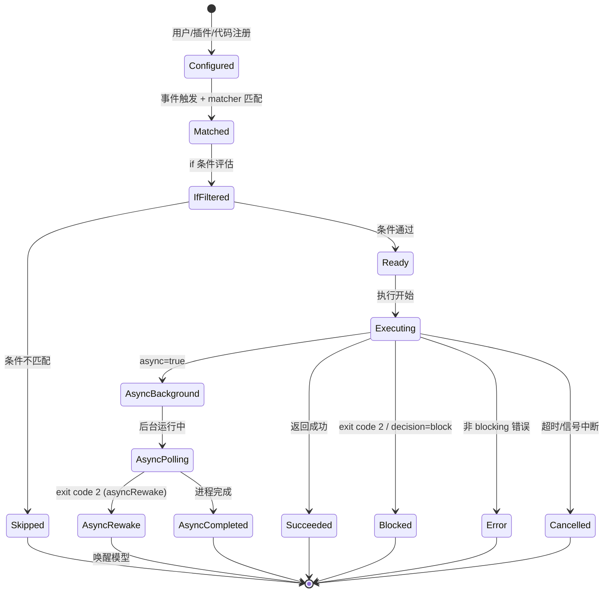

**状态流转解释：**

1. 生命周期主线：Configured → Matched → Ready → Executing → 终态（Succeeded / Blocked / Error / Cancelled）
2. 状态语义：Configured 表示 Hook 已注册但未触发；Matched 表示事件匹配成功；Ready 表示 if 条件通过准备执行；Executing 表示正在运行
3. 终态与异常态：Succeeded/Blocked/Cancelled 是终态；Error 是非阻塞异常态，不会阻止后续流程；AsyncBackground/AsyncPolling 是异步中间态
4. 转移触发：matcher 匹配触发 Configured→Matched；if 条件评估触发 Matched→Ready/Skipped；async:true 触发 Executing→AsyncBackground
5. 恢复机制：asyncRewake 模式下，后台 Hook 以 exit code 2 完成时会通过 enqueuePendingNotification 唤醒模型，实现"后台执行完成后注入反馈"的恢复路径

#### 状态定义

| 状态 | 含义 | 是否终态 | 触发条件 |
|------|------|----------|----------|
| Configured | Hook 已注册到系统 | 否 | 用户配置/插件加载/代码注册 |
| Matched | 事件触发且 matcher 匹配 | 否 | hookInput.hook_event_name 匹配 + matcher 字段匹配 |
| Ready | if 条件通过，准备执行 | 否 | if 条件为空或匹配 hookInput |
| Executing | Hook 正在执行 | 否 | 调度执行 |
| Succeeded | 执行成功 | 是 | exit code 0 / callback 返回成功 |
| Blocked | Hook 主动阻塞 | 是 | exit code 2 / decision='block' |
| Cancelled | 被取消 | 是 | 超时 / AbortSignal 中断 |
| AsyncBackground | 异步模式后台运行 | 否 | Hook 返回 `{async: true}` |

---

## 五、分模块详解

### 5.1 配置加载与快照模块

#### C4 Component 图

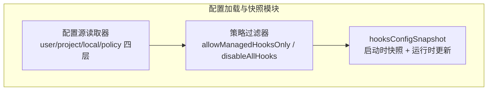

**Component 图解释：**

1. 拆分逻辑：按配置处理流水线拆分——读取多源配置→策略过滤→快照缓存
2. 核心组件是 PolicyFilter，它决定了哪些 Hook 能被执行——policySettings 的 disableAllHooks 可禁用所有 Hook（包括 managed），而 user/project/local 的 disableAllHooks 只禁用非 managed Hook
3. 数据流向：四层 settings.json → SourceReader 合并 → PolicyFilter 过滤 → Snapshot 缓存为 HooksSettings
4. 关键设计：快照在应用启动时通过 captureHooksConfigSnapshot() 一次性捕获，运行时通过 updateHooksConfigSnapshot() 增量更新（重置 settings 缓存后重新读取）

#### 数据结构

```typescript
// 来自 src/utils/hooks/hooksConfigSnapshot.ts
let initialHooksConfig: HooksSettings | null = null

// 来自 src/schemas/hooks.ts
export type HooksSettings = Partial<Record<HookEvent, HookMatcher[]>>
```

#### 存储与持久化

- 存储路径：`~/.claude/settings.json`（user）、`.claude/settings.json`（project）、`.claude/settings.local.json`（local）、managed settings（policy）
- 内存 vs 磁盘：快照 `initialHooksConfig` 存储在内存中，启动时从磁盘读取，运行时通过 updateHooksConfigSnapshot 刷新
- 读写时序：启动时 capture → 使用时 getHooksConfigFromSnapshot → 配置变更时 updateHooksConfigSnapshot

#### 模块内部时序图

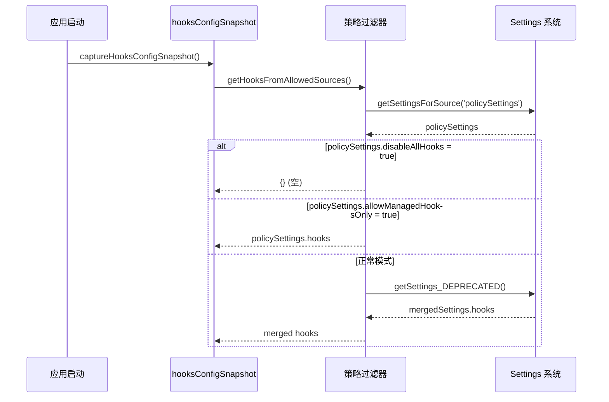

**模块内部时序解释：**

1. 时序起点是应用启动时的 captureHooksConfigSnapshot()，确保在信任对话框之前就有配置快照
2. 策略过滤器按优先级检查三层策略：全禁用→仅 managed→正常合并
3. 关键决策：即使 trust dialog 尚未完成，快照已捕获配置——这是故意的，因为 shouldSkipHookDueToTrust() 会在执行时二次检查
4. 失败路径：任何 settings 读取失败都返回空配置，不会阻塞启动

#### 与其他模块的交互

| 交互对象 | 交互方式 | 数据格式 | 触发条件 |
|----------|----------|----------|----------|
| Matcher | `getHooksConfigFromSnapshot()` 返回 `HooksSettings` | `Partial<Record<HookEvent, HookMatcher[]>>` | 每次 Hook 匹配时 |
| Settings 系统 | `getSettingsForSource()` / `getSettings_DEPRECATED()` | Settings 对象 | 快照捕获/更新时 |
| HooksConfigMenu UI | `groupHooksByEventAndMatcher()` | `Record<HookEvent, Record<string, IndividualHookConfig[]>>` | 用户查看 /hooks 时 |

### 5.2 Hook 匹配与路由模块

#### C4 Component 图

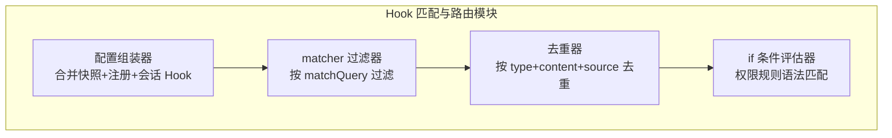

**Component 图解释：**

1. 拆分逻辑：按匹配流水线的四个阶段拆分——合并所有来源→按 matcher 字段过滤→去重→if 条件过滤
2. 核心组件是 ConfigAssembler，它将三个来源（配置快照、已注册 Hook、Session Hook）合并为一个统一列表，并处理 managedOnly 策略
3. 去重器按 Hook 类型分组去重——command 按 shell+command+if 去重，prompt/agent 按 prompt+if 去重，http 按 url+if 去重，callback/function 不去重
4. if 条件评估器使用权限规则语法匹配，支持 `Bash(git *)` 等模式，避免为不匹配的命令 spawn 子进程

#### 数据结构

```typescript
// 来自 src/utils/hooks.ts
type MatchedHook = {
  hook: HookCommand | HookCallback | FunctionHook
  pluginRoot?: string     // 插件 Hook 来源路径
  pluginId?: string       // 插件 source 标识
  skillRoot?: string      // Skill Hook 来源路径
  hookSource: string      // 'settings' | 'plugin:xxx' | 'skill:xxx'
}
```

#### 存储与持久化

- 存储路径：纯内存计算，无持久化
- 匹配查询映射：PreToolUse/PostToolUse 等 → `hookInput.tool_name`；SessionStart → `hookInput.source`；Notification → `hookInput.notification_type`；FileChanged → `basename(hookInput.file_path)`

#### 模块内部时序图

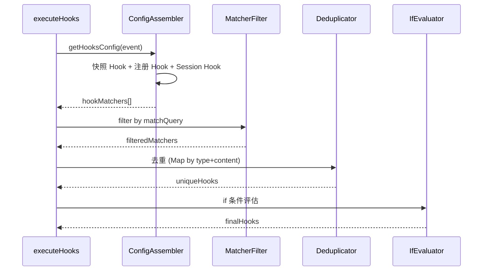

**模块内部时序解释：**

1. 起点是 executeHooks 调用 getHooksConfig 获取所有匹配器的原始列表
2. ConfigAssembler 按优先级合并三个来源，同时过滤 managedOnly 下的插件 Hook
3. matcher 过滤使用 `matchesPattern(matchQuery, matcher.matcher)` 做通配符匹配
4. if 条件评估在最后一步执行，使用 `prepareIfConditionMatcher` 将权限规则编译为匹配函数

#### 与其他模块的交互

| 交互对象 | 交互方式 | 数据格式 | 触发条件 |
|----------|----------|----------|----------|
| 配置快照 | `getHooksConfigFromSnapshot()` | `HooksSettings` | 每次 Hook 匹配 |
| 已注册 Hook | `getRegisteredHooks()` | `Record<HookEvent, HookCallbackMatcher[]>` | 每次 Hook 匹配 |
| Session Hook | `getSessionHooks()` / `getSessionFunctionHooks()` | `Map<HookEvent, SessionDerivedHookMatcher[]>` | 每次 Hook 匹配 |
| 执行引擎 | `getMatchingHooks()` 返回 | `MatchedHook[]` | executeHooks 入口 |

### 5.3 Hook 执行引擎模块

#### C4 Component 图

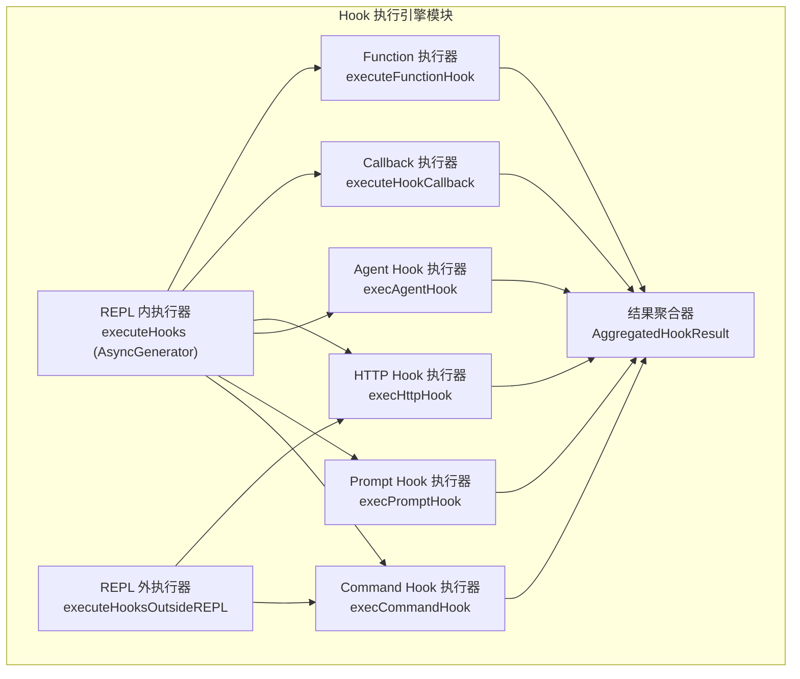

**Component 图解释：**

1. 拆分逻辑：按执行上下文（REPL 内 vs 外）和 Hook 类型双维度拆分
2. REPL 内执行器是核心——它以 AsyncGenerator 形式产出进度消息和 HookResult，支持实时 UI 更新；REPL 外执行器是简化版，不暴露给模型，只返回精简的 HookOutsideReplResult
3. 每种 Hook 类型有独立的执行器，各自管理超时、信号和结果解析
4. 所有执行器的输出都流向 ResultAgg，聚合为 AggregatedHookResult

#### 数据结构

```typescript
// 来自 src/utils/hooks.ts — REPL 外执行结果
export type HookOutsideReplResult = {
  command: string
  succeeded: boolean
  output: string
  blocked: boolean
  watchPaths?: string[]
  systemMessage?: string
}
```

#### 存储与持久化

- 存储路径：执行结果为纯内存对象，不持久化
- 内存 vs 磁盘：Hook 执行的子进程输出通过 TaskOutput 对象在内存中累积，大输出可溢出到磁盘（ShellCommand.background() 调用 taskOutput.spillToDisk()）

#### 模块内部时序图

以 Command Hook 为例：

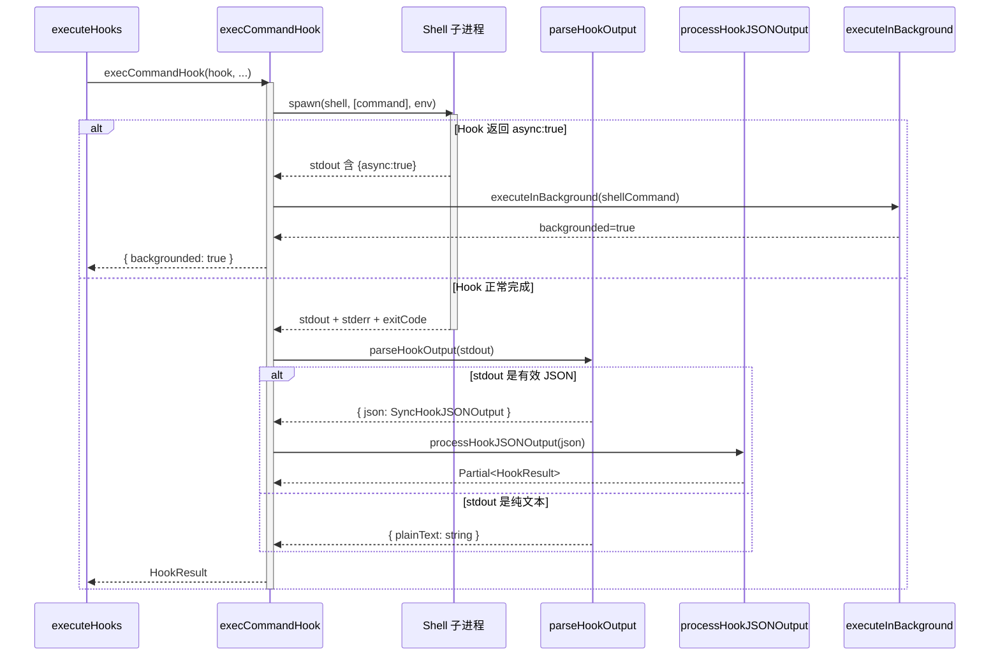

**模块内部时序解释：**

1. execCommandHook 通过 spawn 启动子进程，传入 hookInput JSON 作为 stdin，同时设置 CLAUDE_ENV_FILE 等环境变量
2. 如果 Hook 在 stdout 中输出 `{async:true}`，立即转入后台模式——注册到 AsyncHookRegistry，不阻塞主流程
3. 正常完成的 Hook 通过 parseHookOutput 解析 stdout：先尝试 JSON 解析+Zod 验证，失败则作为纯文本处理
4. JSON 输出通过 processHookJSONOutput 转换为结构化 HookResult——根据 hookSpecificOutput.hookEventName 分派到不同处理逻辑

#### 与其他模块的交互

| 交互对象 | 交互方式 | 数据格式 | 触发条件 |
|----------|----------|----------|----------|
| 异步注册表 | `registerPendingAsyncHook()` | `PendingAsyncHook` | Hook 返回 async:true |
| 事件发射 | `emitHookStarted()` / `emitHookResponse()` | `HookExecutionEvent` | 每个 Hook 执行前后 |
| Session 管理 | `getSessionFunctionHooks()` | `Map<HookEvent, FunctionHookMatcher[]>` | 匹配阶段 |
| LLM API | `queryModelWithoutStreaming()` | API request | Prompt Hook |
| Query 循环 | `query()` (完整循环) | AsyncIterable | Agent Hook |

### 5.4 异步 Hook 注册表模块

#### C4 Component 图

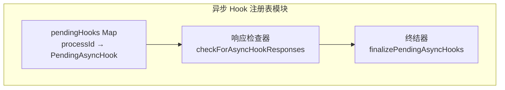

**Component 图解释：**

1. 拆分逻辑：按异步 Hook 生命周期阶段拆分——注册→轮询检查→终结清理
2. 核心组件是 Registry（Map），以 processId 为键存储所有正在后台运行的 Hook
3. Checker 由主循环定期调用，检查后台 Hook 是否完成并提取同步响应
4. Finalizer 在会话结束时强制终结所有残留 Hook

#### 数据结构

```typescript
// 来自 src/utils/hooks/AsyncHookRegistry.ts
export type PendingAsyncHook = {
  processId: string
  hookId: string
  hookName: string
  hookEvent: HookEvent | 'StatusLine' | 'FileSuggestion'
  toolName?: string
  pluginId?: string
  startTime: number
  timeout: number
  command: string
  responseAttachmentSent: boolean    // 防止重复投递
  shellCommand?: ShellCommand
  stopProgressInterval: () => void
}

// 全局注册表
const pendingHooks = new Map<string, PendingAsyncHook>()
```

#### 存储与持久化

- 存储路径：纯内存 Map，不持久化
- 生命周期：从 `registerPendingAsyncHook` 到 `checkForAsyncHookResponses` 确认投递后删除

#### 模块内部时序图

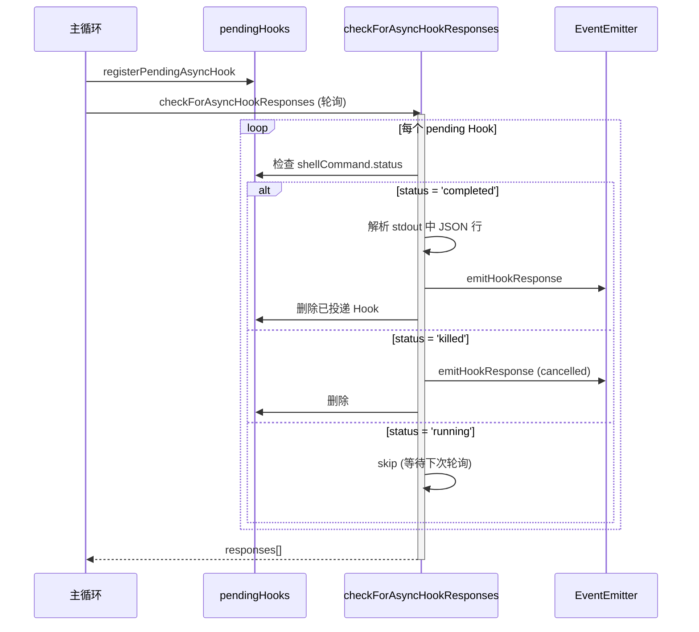

**模块内部时序解释：**

1. 主循环定期调用 checkForAsyncHookResponses，使用 allSettled 并行检查所有 pending Hook
2. 完成的 Hook 从 stdout 中逐行查找非 async JSON 行作为同步响应
3. SessionStart Hook 完成后额外调用 invalidateSessionEnvCache，确保后续 BashTool 使用最新的环境变量
4. allSettled 隔离每个 Hook 的错误，防止单个 Hook 抛出导致其他 Hook 的副作用（如 responseAttachmentSent）丢失

#### 与其他模块的交互

| 交互对象 | 交互方式 | 数据格式 | 触发条件 |
|----------|----------|----------|----------|
| 执行引擎 | `registerPendingAsyncHook()` | `PendingAsyncHook` | Hook 返回 async:true |
| 事件发射 | `emitHookResponse()` / `startHookProgressInterval()` | HookExecutionEvent | Hook 注册/完成时 |
| Session 环境 | `invalidateSessionEnvCache()` | 无 | SessionStart Hook 完成 |

### 5.5 Session Hook 管理模块

#### C4 Component 图

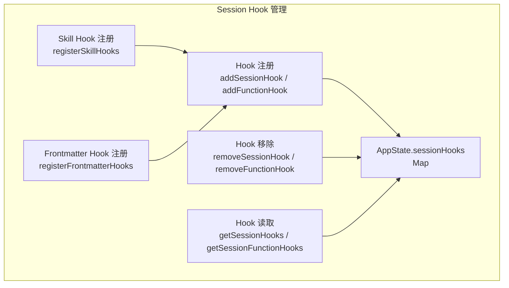

**Component 图解释：**

1. 拆分逻辑：按 CRUD 操作拆分，加上两个上游注册入口（Skill 和 Frontmatter）
2. 核心组件是 SessionStore，使用 Map 而非 Record 存储——Map.set() 是 O(1) 且不改变容器引用，避免了 React 状态检测的 O(N) 开销
3. SkillReg 和 FrontmatterReg 是两个重要的注册入口——前者处理 Skill frontmatter 中的 Hook（支持 once: true 自动移除），后者处理 Agent frontmatter 中的 Hook（自动将 Stop 转为 SubagentStop）
4. FunctionHook 是 Session 独有的概念，用于内存中的验证守卫（如结构化输出强制）

#### 数据结构

```typescript
// 来自 src/utils/hooks/sessionHooks.ts
export type FunctionHook = {
  type: 'function'
  id?: string
  timeout?: number
  callback: FunctionHookCallback  // (messages, signal?) => boolean | Promise<boolean>
  errorMessage: string
  statusMessage?: string
}

type SessionHookMatcher = {
  matcher: string
  skillRoot?: string
  hooks: Array<{
    hook: HookCommand | FunctionHook
    onHookSuccess?: OnHookSuccess  // once: true 时的自动移除回调
  }>
}

export type SessionHooksState = Map<string, SessionStore>
// 使用 Map 而非 Record，使 setAppState 中 Object.is(next, prev) 短路
```

#### 存储与持久化

- 存储路径：`AppState.sessionHooks`（Map<sessionId, {hooks}>），纯内存
- 生命周期：随 Session 创建，随 Session 结束通过 clearSessionHooks 清理

#### 模块内部时序图

```mermaid
sequenceDiagram
    participant Skill as Skill 加载
    participant Frontmatter as Agent Frontmatter
    participant Adder as addSessionHook
    participant Store as AppState.sessionHooks
    participant Reader as getSessionHooks

    Skill->>Adder : registerSkillHooks(hooks, skillName, skillRoot)
    Frontmatter->>Adder : registerFrontmatterHooks(hooks, isAgent=true)
    Note over Frontmatter : isAgent 时 Stop → SubagentStop

    Adder->>Store : setAppState(prev => { prev.sessionHooks.set(...) ; return prev })
    Note over Adder,Store : 返回 prev（不变引用），跳过 React 通知

    Reader->>Store : getSessionHooks(appState, sessionId)
    Store-->>Reader : SessionDerivedHookMatcher[] (过滤掉 FunctionHook)
```

**模块内部时序解释：**

1. Skill 和 Agent Frontmatter 都通过 addSessionHook 注册，但语义不同——Skill Hook 保留 skillRoot 用于 CLAUDE_PLUGIN_ROOT 环境变量，Agent Hook 自动将 Stop 转为 SubagentStop
2. addSessionHook 通过 setAppState 的函数式更新操作，返回 prev（不变引用）避免触发 ~30 个 store listener
3. getSessionHooks 和 getSessionFunctionHooks 分别返回不同类型的 Hook——前者排除 FunctionHook（因为不可持久化），后者只返回 FunctionHook
4. once: true 的 Hook 通过 onHookSuccess 回调在执行成功后自动调用 removeSessionHook

#### 与其他模块的交互

| 交互对象 | 交互方式 | 数据格式 | 触发条件 |
|----------|----------|----------|----------|
| 匹配路由 | `getSessionHooks()` / `getSessionFunctionHooks()` | `Map<HookEvent, SessionDerivedHookMatcher[]>` | 每次 Hook 匹配 |
| 执行引擎 | `getSessionHookCallback()` | `{ hook, onHookSuccess }` | Hook 执行成功后调用 onHookSuccess |
| Skill 系统 | `registerSkillHooks()` | `HooksSettings` | Skill 加载时 |
| Agent 系统 | `registerFrontmatterHooks()` | `HooksSettings` | Agent 启动时 |

### 5.6 事件发射与进度模块

#### C4 Component 图

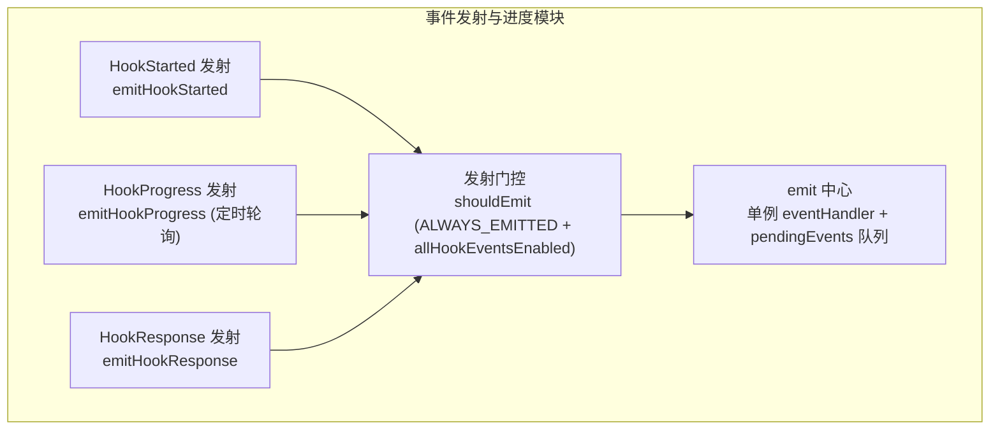

**Component 图解释：**

1. 拆分逻辑：按事件类型拆分发射器，统一通过 Gate 门控和 Emitter 中心派发
2. 核心组件是 Emitter——采用单 handler + pending queue 模式，如果 handler 未注册则缓存事件（最多 100 条），注册后一次性回放
3. Gate 控制哪些事件类型可发射——SessionStart 和 Setup 始终发射，其他事件需要 `allHookEventsEnabled=true`（由 SDK 的 `includeHookEvents` 选项或 `CLAUDE_CODE_REMOTE` 模式启用）
4. ProgressEmit 使用 setInterval（1s）定期轮询后台 Hook 的 stdout/stderr 增量，实现实时进度更新

#### 数据结构

```typescript
// 来自 src/utils/hooks/hookEvents.ts
export type HookExecutionEvent =
  | HookStartedEvent     // { type: 'started', hookId, hookName, hookEvent }
  | HookProgressEvent    // { type: 'progress', hookId, stdout, stderr, output }
  | HookResponseEvent    // { type: 'response', hookId, exitCode, outcome }

const pendingEvents: HookExecutionEvent[] = []  // 最多 100 条
let eventHandler: HookEventHandler | null = null
let allHookEventsEnabled = false                 // 由 SDK / remote 模式控制
```

#### 存储与持久化

- 存储路径：纯内存，pendingEvents 数组 + eventHandler 函数引用
- 生命周期：随会话创建，clearHookEventState() 清理

#### 模块内部时序图

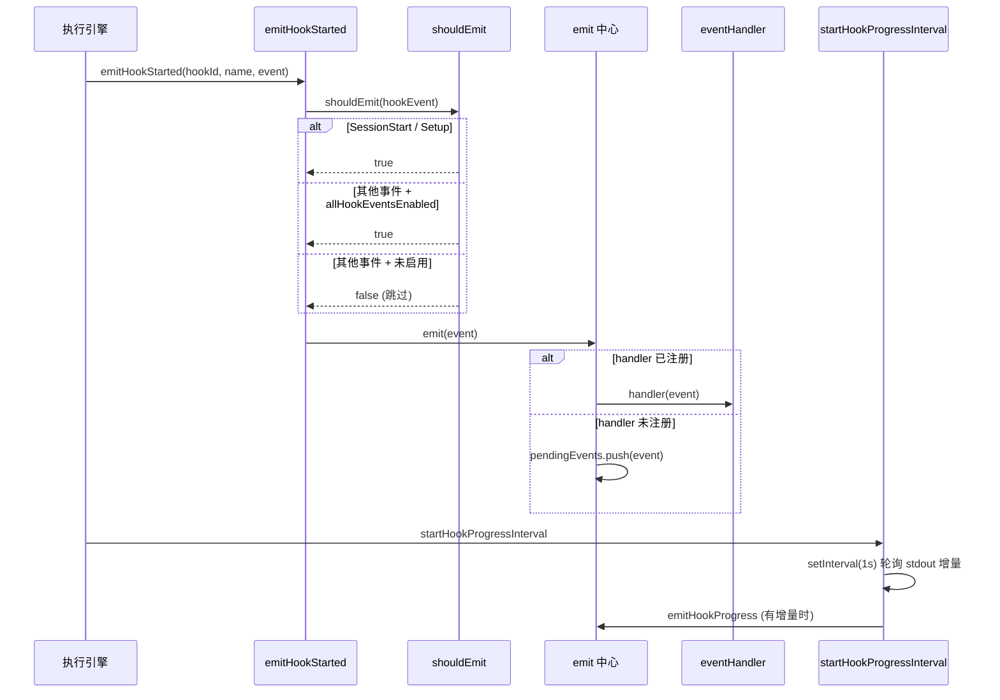

**模块内部时序解释：**

1. emitHookStarted 和 emitHookResponse 在 Hook 执行的起止点调用，不受轮询间隔影响
2. shouldEmit 门控确保只有 SDK 需要的事件才会被发射，减少不必要的 IPC 开销
3. pendingEvents 机制解决了 handler 注册时序问题——Hook 可能在 SDK handler 注册之前就开始执行（如 SessionStart）
4. startHookProgressInterval 的 interval.unref() 确保定时器不会阻止 Node.js 进程退出

#### 与其他模块的交互

| 交互对象 | 交互方式 | 数据格式 | 触发条件 |
|----------|----------|----------|----------|
| 执行引擎 | `emitHookStarted()` / `emitHookResponse()` | HookExecutionEvent | Hook 执行前后 |
| 异步注册表 | `startHookProgressInterval()` | 返回 stop 函数 | 异步 Hook 注册时 |
| SDK 集成 | `registerHookEventHandler()` | HookEventHandler | SDK 初始化时 |

---

## 六、设计原理与对比分析

### 设计取舍

| # | 当前方案 | 替代方案 | 当前方案优势 | 替代方案优势 | 选择理由 |
|---|----------|----------|-------------|-------------|----------|
| 1 | 启动时快照（hooksConfigSnapshot） | 每次执行时实时读取 settings | 避免每次 Hook 匹配时的磁盘 I/O 和 settings 合并开销（约节省 2-5ms/次） | 配置变更实时生效 | 99% 场景下配置不变，快照减少重复计算；updateHooksConfigSnapshot 在配置变更时显式刷新 |
| 2 | 内部 callback 快速路径（跳过进度/超时/JSON 解析） | 统一走完整流水线 | 内部 callback 执行时间从 6µs 降至 1.8µs（-70%），PostToolUse 每次都命中 | 代码路径统一，减少分支 | 内部 callback（如 sessionFileAccessHooks）返回 `{}` 且不需要超时/进度，快速路径避免 6-pass filter 和 4×Map 的开销 |
| 3 | SessionHooks 使用 Map + 返回 prev 引用 | Record + spread 复制 | 并行 Agent 场景下 N 次 addFunctionHook 从 O(N²) 降至 O(N)，跳过 ~30 个 listener 通知 | React 状态变更自动检测 | session hooks 是运行时临时回调，不被 React 组件 reactively 读取，不需要触发 store listener |
| 4 | AsyncHookResponse 后台模式（async:true） | 所有 Hook 同步阻塞 | 异步 Hook 不阻塞主流程，允许长时间运行的 Hook 在后台执行 | 简单可靠，无需轮询机制 | SessionStart/Setup 等 Hook 可能需要长时间初始化（如环境准备），阻塞会导致启动延迟 10s+ |
| 5 | if 条件字段（权限规则语法） | 无预过滤，所有 Hook 都 spawn | 匹配 Bash(git *) 的 Hook 不会在 npm 命令时 spawn，节省约 50-200ms/次 | 无额外匹配逻辑复杂度 | 权限规则解析器已存在（permissionRuleParser），if 字段复用同一基础设施，匹配开销极小（<0.1ms） |
| 6 | HTTP Hook SSRF 防护（ssrfGuardedLookup） | 无 SSRF 防护 | 阻止 HTTP Hook 访问内网/localhost（除 loopback），防止 SSRF 攻击 | 无延迟开销 | HTTP Hook 由用户配置，可能被恶意项目设置利用；ssrfGuardedLookup 增加约 1-2ms DNS 解析延迟，可接受 |

### 系统间对比

| 对比维度 | Hook 模块 | Plugin 系统 | Permission 系统 |
|----------|-----------|-------------|-----------------|
| 触发方式 | 生命周期事件驱动 | 显式加载/卸载 | Tool 调用时决策 |
| 执行位置 | Shell 子进程 / LLM / HTTP / 内存 | MCP Server / 内存 | 内存决策管道 |
| 可阻塞 | 是（exit code 2 / decision=block） | 否（MCP 协议不阻塞） | 是（deny 规则） |
| 配置来源 | settings.json + plugin + session + SDK | settings.json enabledPlugins | settings.json permissions |
| 热重载 | 支持（settingsChangeDetector → updateHooksConfigSnapshot） | 支持（clearPluginCache → loadPluginHooks） | 支持（文件监视 → settings 缓存刷新） |
| 超时管理 | 每个 Hook 独立超时 + 全局 AbortSignal | MCP 协议级超时 | 无（内存决策） |

### 设计原则总结

1. **安全纵深防御**：三层安全策略——工作区信任检查（shouldSkipHookDueToTrust）→ managed-only 策略（shouldAllowManagedHooksOnly）→ HTTP SSRF 防护和 CRLF 注入清理——任何一层失效不会导致 RCE
2. **性能优先路径**：内部 callback 快速路径、lazy JSON stringify、Map.set() O(1) 更新——每个优化都针对高频路径（PostToolUse 每次 Tool 调用都触发）
3. **渐进式扩展**：6 种 Hook 类型从简单到复杂（callback → command → prompt → http → agent → function），用户按需选择，复杂类型有独立超时和执行策略

### 边界条件

| 设计结论 | 何时不成立 | 原因 |
|----------|-----------|------|
| 快照策略减少 99% 场景的磁盘 I/O | 配置高频变更（如远程 managed settings 每 10s 推送一次） | updateHooksConfigSnapshot 每次都重置缓存并重新读取，频繁变更反而增加 I/O |
| 内部 callback 快速路径节省 70% 执行时间 | callback 内部抛出未捕获异常 | 快速路径跳过了 try-catch 包裹，未捕获异常可能穿透到主循环；但当前所有内部 callback（sessionFileAccessHooks、attributionHooks）都稳定返回 {} |
| Map + prev 引用避免 React 通知 | 未来有 React 组件需要 reactive 读取 session hooks | 返回 prev 使 Object.is(next, prev) 为 true，React 组件不会重新渲染；但当前无组件 reactively 读取 session hooks |
| HTTP SSRF 防护阻止内网访问 | 通过企业代理访问内网服务 | 代码已处理：envProxyActive 时跳过 SSRF guard（execHttpHook:184-188），但 sandbox proxy 模式下未跳过 |
| if 条件过滤节省 spawn 开销 | hookInput 不包含 tool_name 等匹配字段 | 非工具事件（如 TeammateIdle）无 matchQuery，if 条件无法评估，日志记录后跳过该 Hook |

---

## 七、总结与索引

### 核心关系表

| 概念A | 关系 | 概念B |
|-------|------|-------|
| HookEvent | 触发 | HookMatcher |
| HookMatcher | 包含 | HookCommand / HookCallback / FunctionHook |
| HookCommand | 分发到 | execCommandHook / execPromptHook / execAgentHook / execHttpHook |
| AsyncHookJSONOutput | 注册到 | AsyncHookRegistry (pendingHooks) |
| SessionStore | 存储于 | AppState.sessionHooks (Map) |
| HooksSettings | 快照于 | hooksConfigSnapshot (initialHooksConfig) |
| HookExecutionEvent | 发射到 | eventHandler / pendingEvents |

### 设计原则

1. 安全纵深防御——信任检查 + 策略过滤 + SSRF/CRLF 防护三层保护
2. 性能优先路径——内部 callback 快速路径，避免高频场景的不必要开销
3. 渐进式扩展——6 种 Hook 类型覆盖从简单 Shell 到多轮 Agent 的完整能力谱

### 核心洞察

Hook 模块的核心设计洞察是"双轨执行"——REPL 内的 `executeHooks` 以 AsyncGenerator 暴露进度和结果给模型，REPL 外的 `executeHooksOutsideREPL` 返回精简结果给调用方。这种分离使得同一套匹配和执行逻辑能在两种截然不同的上下文中复用，同时保持对模型的信息透明度。其次，配置快照+运行时更新的组合策略，在 99% 场景下避免了磁盘 I/O，又能在配置变更时及时刷新。最后，Session Hook 使用 Map + 返回 prev 引用的设计，巧妙地绕过了 React 状态检测的开销，在并行 Agent 场景下将复杂度从 O(N²) 降至 O(N)。

### 相关文件索引

| 文件路径 | 职责 |
|----------|------|
| `src/utils/hooks.ts` | Hook 执行引擎主文件：executeHooks、executeHooksOutsideREPL、execCommandHook、6 种类型分发、结果聚合 |
| `src/types/hooks.ts` | Hook 类型定义：HookCallback、HookResult、AggregatedHookResult、PromptRequest/Response、Zod schema |
| `src/schemas/hooks.ts` | Hook Zod 验证 schema：HookCommandSchema（discriminated union）、HookMatcherSchema、HooksSchema |
| `src/utils/hooks/hooksConfigSnapshot.ts` | 配置快照管理：captureHooksConfigSnapshot、getHooksConfigFromSnapshot、策略过滤（managedOnly/disableAll） |
| `src/utils/hooks/hooksConfigManager.ts` | Hook 事件元数据和 UI 分组：getHookEventMetadata、groupHooksByEventAndMatcher |
| `src/utils/hooks/hooksSettings.ts` | Hook 配置源读取：getAllHooks、isHookEqual、sortMatchersByPriority、HookSource 定义 |
| `src/utils/hooks/AsyncHookRegistry.ts` | 异步 Hook 注册表：registerPendingAsyncHook、checkForAsyncHookResponses、finalizePendingAsyncHooks |
| `src/utils/hooks/sessionHooks.ts` | Session Hook CRUD：addSessionHook、addFunctionHook、removeFunctionHook、clearSessionHooks |
| `src/utils/hooks/hookEvents.ts` | 事件发射系统：emitHookStarted、emitHookResponse、startHookProgressInterval、门控逻辑 |
| `src/utils/hooks/hookHelpers.ts` | 共享工具：hookResponseSchema、addArgumentsToPrompt、createStructuredOutputTool、registerStructuredOutputEnforcement |
| `src/utils/hooks/execPromptHook.ts` | Prompt Hook 执行器：queryModelWithoutStreaming 单轮评估 |
| `src/utils/hooks/execAgentHook.ts` | Agent Hook 执行器：query() 多轮验证 + StructuredOutputTool |
| `src/utils/hooks/execHttpHook.ts` | HTTP Hook 执行器：axios POST + SSRF 防护 + env var 插值 + URL allowlist |
| `src/utils/hooks/registerSkillHooks.ts` | Skill Hook 注册：从 Skill frontmatter 注册 session Hook（支持 once: true） |
| `src/utils/hooks/registerFrontmatterHooks.ts` | Agent Frontmatter Hook 注册：Stop→SubagentStop 转换 |
| `src/utils/hooks/postSamplingHooks.ts` | Post-sampling Hook 注册：REPLHookContext、PostSamplingHook、内部 API |
| `src/utils/hooks/apiQueryHookHelper.ts` | API Query Hook 工厂：createApiQueryHook 通用 LLM 查询 Hook |
| `src/utils/hooks/skillImprovement.ts` | Skill 改进 Hook：自动检测用户偏好并建议更新 Skill 定义 |
| `src/utils/plugins/loadPluginHooks.ts` | 插件 Hook 加载：loadPluginHooks、热重载、pruneRemovedPluginHooks |
| `src/entrypoints/sdk/coreTypes.ts` | HOOK_EVENTS 常量定义：26 个生命周期事件枚举 |
