# 插件系统 四通道可扩展架构

> 本文档基于代码分析，整理 Claude Code 中插件系统（MCP Server、Skills、Hooks、Subagents 四大扩展通道）的完整设计。

## 目录

- [一、概述](#一概述)
- [二、核心概念](#二核心概念)
  - [2.1 MCP Server](#21-mcp-server)
  - [2.2 Skill](#22-skill)
  - [2.3 Hook](#23-hook)
  - [2.4 Subagent](#24-subagent)
  - [2.5 Settings](#25-settings)
- [三、架构总览](#三架构总览)
  - [系统上下文（C4 Context）](#系统上下文c4-context)
  - [容器拆分（C4 Container）](#容器拆分c4-container)
  - [工作流概览](#工作流概览)
  - [各模块职责概述](#各模块职责概述)
- [四、核心工作流](#四核心工作流)
  - [核心工作流程](#核心工作流程)
  - [核心实体状态流转](#核心实体状态流转)
- [五、分模块详解](#五分模块详解)
  - [5.1 MCP Server 模块](#51-mcp-server-模块)
  - [5.2 Skills 模块](#52-skills-模块)
  - [5.3 Hooks 模块](#53-hooks-模块)
  - [5.4 Subagents 模块](#54-subagents-模块)
- [六、设计原理与对比分析](#六设计原理与对比分析)
- [七、总结与索引](#七总结与索引)

---

## 一、概述

Claude Code 的插件系统并非传统意义上的"插件市场"，而是由 **MCP Server、Skills、Hooks、Subagents** 四条独立扩展通道组成的可扩展架构。每条通道解决不同层面的扩展需求：MCP Server 扩展"能访问什么外部资源"，Skills 扩展"知道怎么做"，Hooks 扩展"在什么时机拦截/增强"，Subagents 扩展"如何并行分发任务"。四条通道通过 Settings 系统统一配置，通过 Tool 系统统一暴露给 LLM，形成了"配置层 → 注册层 → 装配层 → 执行层"的四层管线。

### 系统定位

| 维度 | 说明 |
|------|------|
| 核心职责 | 为 Claude Code 提供四类正交扩展能力：外部资源接入、工作流指导、生命周期拦截、任务并行化 |
| 系统性质 | 四通道正交可扩展架构，配置驱动 + 协议标准化 |
| 边界 | 上游：用户配置（settings.json / .mcp.json / SKILL.md）驱动本系统；下游：本系统操作 Tool 执行管道、LLM 上下文、Shell 子进程 |
| 使用方 | LLM（通过 Tool 接口）、用户（通过配置文件）、企业（通过 managed policy） |

### 与其他系统的关系总览

| 关联系统 | 关系 |
|----------|------|
| Tool System | 四通道的输出全部汇入 Tool Pool——MCP 工具以 `mcp__*` 命名注册，Skill 以 SkillTool 注册，Hook 在工具执行前后拦截，Subagent 以 AgentTool 启动 |
| Permission System | MCP/Skill/Tool 的调用需经权限检查管道，Hook 的 PreToolUse 可干预权限决策 |
| Settings System | 所有通道的配置源：MCP 配置在 settings.mcpServers / .mcp.json，Hooks 在 settings.hooks，Skills 在 .claude/skills/ |
| Query Engine | 四通道的执行时机由 Query Loop 驱动——每轮 LLM 响应触发工具执行，工具执行触发 Hook，工具结果触发 Skill 动态发现 |

---

## 二、核心概念

### 2.1 MCP Server

MCP Server 是通过 Model Context Protocol 标准协议接入的外部服务代理。Claude Code 作为 MCP Client，连接 MCP Server 后获取其工具列表，动态注册为 `mcp__{serverName}__{toolName}` 格式的 Tool。

```typescript
// 来自 src/services/mcp/types.ts
export const McpServerConfigSchema = z.union([
  McpStdioServerConfigSchema(),     // stdio: 本地子进程
  McpSSEServerConfigSchema(),       // sse: SSE 远程连接
  McpSSEIDEServerConfigSchema(),    // sse-ide: IDE 内置
  McpWebSocketIDEServerConfigSchema(), // ws-ide: WebSocket IDE
  McpHTTPServerConfigSchema(),      // http: HTTP Streamable
  McpWebSocketServerConfigSchema(), // ws: WebSocket 远程
  McpSdkServerConfigSchema(),       // sdk: SDK 进程内
  McpClaudeAIProxyServerConfigSchema(), // claudeai-proxy: 云端代理
])

export type MCPServerConnection =
  | ConnectedMCPServer    // 已连接
  | FailedMCPServer       // 连接失败
  | NeedsAuthMCPServer    // 需要认证
  | PendingMCPServer      // 等待连接
  | DisabledMCPServer     // 已禁用
```

### 2.2 Skill

Skill 是纯文本 Prompt 模板，以 Markdown + YAML Frontmatter 形式存储在 `.claude/skills/` 目录中。Skill 不执行代码，而是注入指导性文本到 LLM 上下文中，让模型"知道怎么做"。

| 属性 | 说明 |
|------|------|
| 文件格式 | SKILL.md（YAML frontmatter + Markdown 正文） |
| 加载方式 | 启动时扫描固定目录 + 文件操作时动态发现嵌套目录 |
| 执行方式 | 展开为 prompt 文本注入对话，模型按指导行动 |
| 权限控制 | `allowed-tools` 白名单限制可用工具 |

### 2.3 Hook

Hook 是在 Claude Code 生命周期特定事件点执行的用户自定义逻辑。支持四种 Hook 类型：Shell 命令、LLM Prompt、HTTP 请求、Agent 验证器。

```typescript
// 来自 src/schemas/hooks.ts
export const HookCommandSchema = z.discriminatedUnion('type', [
  BashCommandHookSchema,   // type: 'command' — 执行 Shell 命令
  PromptHookSchema,        // type: 'prompt'  — LLM Prompt 评估
  AgentHookSchema,         // type: 'agent'   — Agentic 验证器
  HttpHookSchema,          // type: 'http'    — HTTP POST 请求
])

// 来自 src/entrypoints/sdk/coreTypes.ts
export const HOOK_EVENTS = [
  'PreToolUse', 'PostToolUse', 'PostToolUseFailure',
  'Notification', 'UserPromptSubmit', 'SessionStart', 'SessionEnd',
  'Stop', 'StopFailure', 'SubagentStart', 'SubagentStop',
  'PreCompact', 'PostCompact', 'PermissionRequest', 'PermissionDenied',
  'Setup', 'TeammateIdle', 'TaskCreated', 'TaskCompleted',
  'Elicitation', 'ElicitationResult', 'ConfigChange',
  'WorktreeCreate', 'WorktreeRemove', 'InstructionsLoaded',
  'CwdChanged', 'FileChanged',
] as const
```

### 2.4 Subagent

Subagent 是通过 AgentTool 启动的独立 LLM 执行单元。每个 Subagent 拥有自己的 `query()` 循环、工具集和对话上下文，支持前台同步/后台异步执行以及 worktree 隔离。

| 属性 | 说明 |
|------|------|
| 启动方式 | AgentTool.call() 触发 |
| 执行模式 | foreground（同步等待）/ background（异步任务） |
| 隔离级别 | 共享上下文 / worktree 隔离 / 进程隔离 |
| 工具限制 | 按 AgentType 过滤，异步 Agent 仅允许白名单工具 |

### 2.5 Settings

Settings 系统是所有扩展通道的配置中枢，采用分层合并策略。

```typescript
// 来自 src/services/mcp/types.ts
export type ConfigScope =
  | 'local'       // .claude/settings.local.json
  | 'user'        // ~/.claude/settings.json
  | 'project'     // .mcp.json / .claude/settings.json
  | 'dynamic'     // 运行时动态注入
  | 'enterprise'  // managed/ 目录
  | 'claudeai'    // claude.ai 云端
  | 'managed'     // managed/ 目录

// 合并优先级（低→高）：
// plugin < claudeai < user < project < local < enterprise
```

---

## 三、架构总览

### 系统上下文（C4 Context）

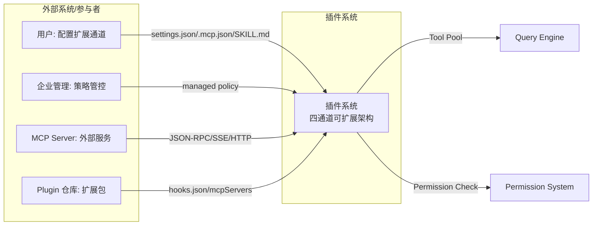

**Context 图解释：**

1. 驱动关系：用户通过配置文件（settings.json、.mcp.json、SKILL.md）驱动所有扩展通道的注册；企业管理通过 managed policy 覆盖用户配置，实现组织级管控
2. 服务对象：插件系统主要为 Query Engine 提供 Tool 供给，为 Permission System 提供拦截点
3. 外部交互：MCP Server 通过 JSON-RPC/SSE/HTTP 协议提供远程工具能力，Plugin 仓库通过 hooks.json 和 mcpServers 配置注入扩展
4. 边界划分：插件系统负责"注册与装配"，不负责"执行与调度"——执行由 Tool System 负责，调度由 Query Engine 负责

### 容器拆分（C4 Container）

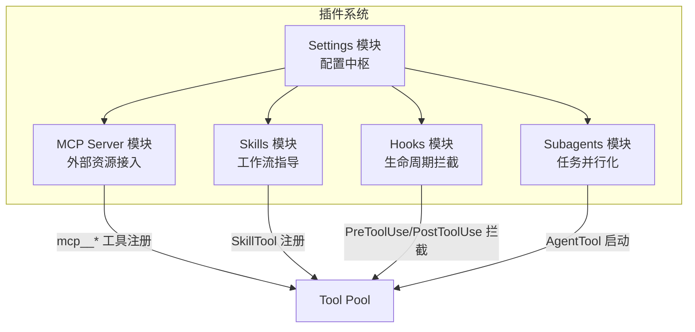

**Container 图解释：**

1. 拆分依据：按扩展维度正交拆分——MCP 扩展"能力边界"，Skill 扩展"知识指导"，Hook 扩展"流程控制"，Subagent 扩展"执行并行度"
2. 职责边界：MCP 管连接与协议，Skill 管文本与发现，Hook 管时机与拦截，Subagent 管任务与隔离，Settings 管配置与合并
3. 依赖与数据流：Settings 是所有模块的上游配置源；所有模块的输出最终汇入 Tool Pool
4. 核心与辅助：MCP 和 Hook 是核心扩展通道（改变行为），Skill 和 Subagent 是辅助通道（增强指导/并行度）

### 工作流概览

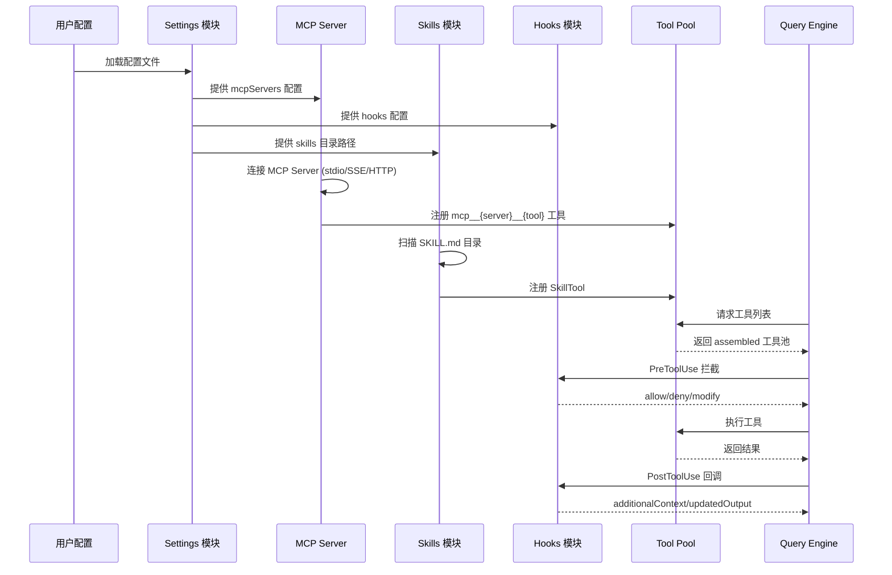

**工作流概览解释：**

1. 起点：用户配置文件触发 Settings 模块加载，各扩展通道从 Settings 获取自身配置
2. 主路径：MCP 连接远程服务并注册工具 → Skills 扫描目录注册 SkillTool → Hook 绑定生命周期事件 → 所有注册汇入 Tool Pool → Query Engine 在每轮对话中使用工具池
3. 外部交互点：MCP 与远程 Server 通过 JSON-RPC 交互；Hook 通过 Shell 子进程/HTTP 请求与外部系统交互
4. 终点：Query Engine 获得 assembled 工具池后，在每轮 LLM 对话中执行工具调用，并在执行前后触发 Hook 拦截

### 各模块职责概述

| 模块 | 核心职责 | 关键接口 | 依赖 |
|------|----------|----------|------|
| MCP Server | 连接外部服务、动态注册工具 | `connectToMcpServer()`, `listTools()`, `callTool()` | Settings, Tool Pool |
| Skills | 扫描 SKILL.md、动态发现、注入 prompt | `loadSkillsDir()`, `addSkillDirectories()`, `getPromptForCommand()` | Settings, Tool Pool |
| Hooks | 生命周期拦截、权限干预、结果修改 | `executePreToolHooks()`, `executePostToolHooks()`, `executeHooks()` | Settings, Tool 执行管道 |
| Subagents | 并行任务分发、worktree 隔离 | `AgentTool.call()`, `createAgentWorktree()`, `runAgent()` | AgentTool, Tool Pool |
| Settings | 配置分层合并、策略管控 | `getClaudeCodeMcpConfigs()`, `getHooksConfigFromSnapshot()`, `getInitialSettings()` | 文件系统 |

---

## 四、核心工作流

### 核心工作流程

#### 正常流：扩展通道从配置到执行的完整管线

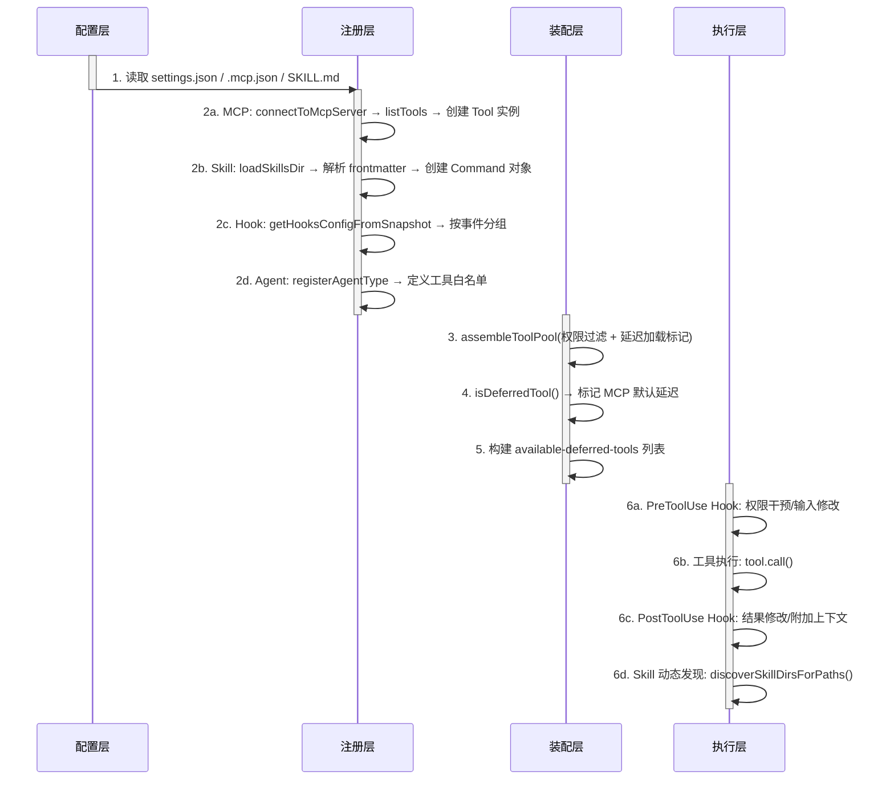

**正常流解释：**

1. 流程目标：将用户配置转化为可执行的工具能力，并在执行过程中提供拦截和增强点
2. 步骤拆解：配置层读取→注册层实例化→装配层过滤排序→执行层调用+拦截，四步逐层推进
3. 数据变化：配置文件（JSON/Markdown）→ 内存对象（Tool/Command/HookMatcher）→ API Schema（JSON Schema/Zod）→ 执行结果（ToolResult）
4. 关键决策：MCP 工具默认延迟加载（`shouldDefer: true`），避免大量工具定义占用上下文窗口

#### 异常流：MCP Server 连接失败

当 MCP Server 连接失败时，系统进入降级模式：工具池中不包含该 Server 的工具，ToolSearchTool 返回 pending server 信息提示用户。如果该 Server 之前连接成功但因网络断开，状态转为 `pending`，系统会尝试自动重连。

**异常流解释：**

1. 触发条件：MCP Server 进程崩溃、网络超时、OAuth token 过期、服务器返回错误
2. 处理机制：连接状态转为 `failed`/`needs-auth`/`pending`，工具池自动排除该 Server，不影响其他通道
3. 恢复策略：`pending` 状态自动重连（指数退避）；`needs-auth` 需用户交互重新授权；`failed` 需用户手动排查
4. 影响范围：仅影响该 Server 的工具集，其他 MCP Server/Skill/Hook 不受影响

### 核心实体状态流转

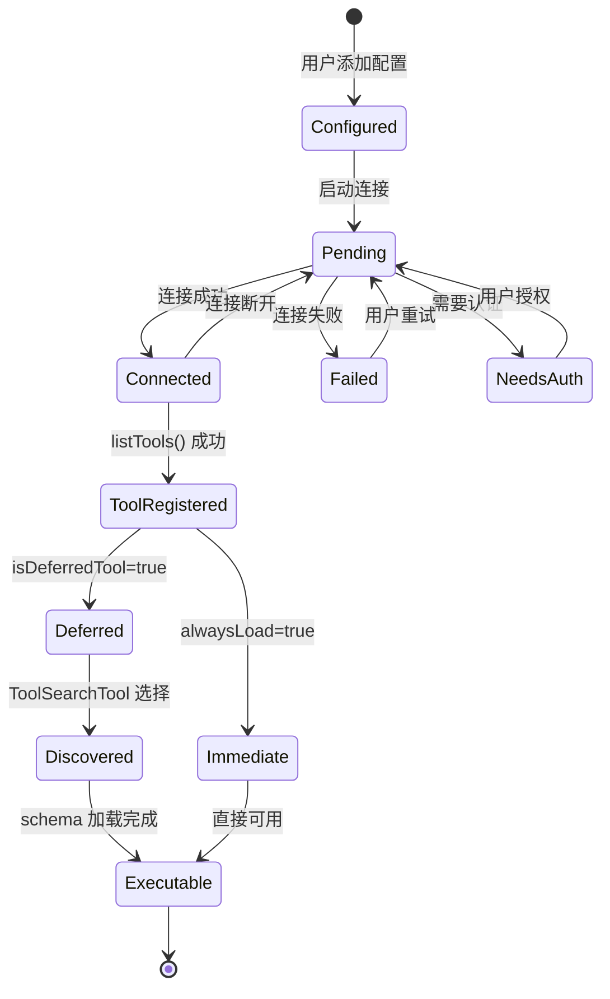

**状态流转解释：**

1. 生命周期主线：配置→连接→注册→延迟/即时→可执行，这是 MCP 工具从配置到可用的主路径
2. 状态语义：`Deferred` 表示工具名已知但 schema 未加载（节省上下文），`Discovered` 表示模型已通过 ToolSearchTool 选择了该工具，`Executable` 表示完整 schema 已加载
3. 终态与异常态：`Executable` 是可用终态；`Failed`/`NeedsAuth` 是异常态，需要外部干预才能恢复
4. 转移触发：连接由 `connectToMcpServer()` 触发，注册由 `listTools()` 触发，发现由 `ToolSearchTool.call()` 触发
5. 恢复机制：`Failed` 可通过用户重试回到 `Pending`；`NeedsAuth` 通过 OAuth 流程回到 `Pending`

#### 状态定义

| 状态 | 含义 | 是否终态 | 触发条件 |
|------|------|----------|----------|
| Configured | 配置已写入文件 | 否 | 用户添加 MCP Server 配置 |
| Pending | 正在建立连接 | 否 | 启动连接/重连 |
| Connected | 连接成功 | 否 | MCP 协议握手完成 |
| Failed | 连接失败 | 否 | 进程崩溃/网络错误 |
| NeedsAuth | 需要用户认证 | 否 | OAuth 401 |
| ToolRegistered | 工具已注册到内存 | 否 | listTools() 返回 |
| Deferred | 延迟加载（仅名称） | 否 | isDeferredTool()=true |
| Executable | 完整可执行 | 是 | Schema 加载完成 |

---

## 五、分模块详解

### 5.1 MCP Server 模块

#### C4 Component 图

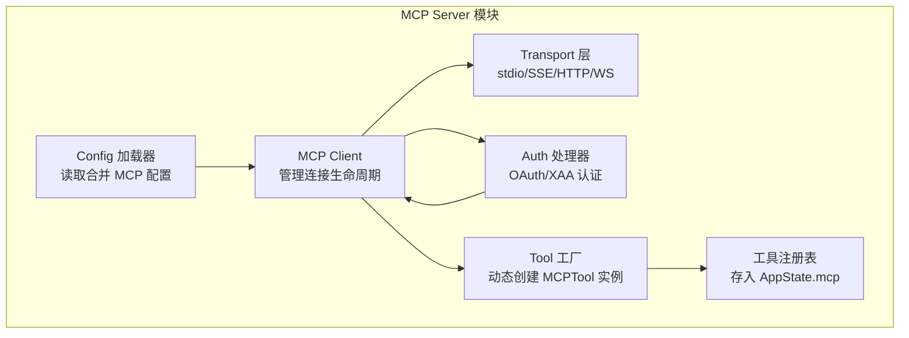

**Component 图解释：**

1. 组件拆分逻辑：按职责单一性拆分——配置加载、连接管理、传输协议、认证、工具实例化、状态存储各自独立
2. 核心组件是 Client 和 ToolFactory：Client 管理 MCP 协议交互，ToolFactory 将 MCP 工具定义转换为 Claude Code Tool 实例
3. 组件间的数据流向：Config 提供 Server 列表 → Client 逐个连接 → Transport 建立底层通道 → Auth 处理认证 → ToolFactory 从 listTools() 结果创建 Tool → Registry 存入内存
4. 关键设计决策：MCPTool 是泛型模板（`buildTool` 创建），运行时通过 spread override 动态替换 name/call/description

#### 数据结构

```typescript
// 来自 src/services/mcp/types.ts
export type ConnectedMCPServer = {
  client: Client                    // @modelcontextprotocol/sdk Client
  name: string                      // Server 名称
  type: 'connected'
  capabilities: ServerCapabilities   // 服务器能力声明
  serverInfo?: { name: string; version: string }
  instructions?: string             // 服务器指令文本
  config: ScopedMcpServerConfig     // 带作用域的配置
  cleanup: () => Promise<void>      // 清理函数
}

// 来自 src/services/mcp/types.ts
export type McpStdioServerConfig = {
  type: 'stdio'                     // 传输类型
  command: string                    // 可执行命令
  args: string[]                     // 命令参数
  env: Record<string, string>        // 环境变量
}
```

#### 存储与持久化

- 存储路径：`~/.claude/settings.json`（全局）、`.mcp.json`（项目级）、`managed/managed-mcp.json`（企业级）
- 内存 vs 磁盘：Server 配置在磁盘，连接状态和工具列表在内存（`AppState.mcp`）
- 读写时序：启动时读取所有配置源 → 合并去重 → 逐个连接 → 工具列表缓存在内存 → 断开重连时刷新

#### 模块内部时序图

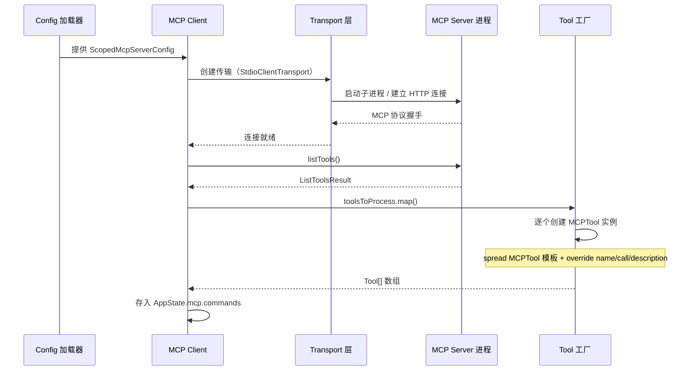

**模块内部时序解释：**

1. 时序起点：Config 加载器从多源合并配置，按优先级去重（enterprise > local > project > user > plugin）
2. 每步的数据转换：配置→传输层实例→MCP 协议握手→工具列表→Tool 实例数组→内存注册
3. 关键决策点：连接失败时转入 `failed` 状态而非阻塞启动；需要认证时转入 `needs-auth` 等待用户交互
4. 失败时的处理路径：Transport 建立失败 → Client 标记 failed → 通知 UI → 下次 `/mcp` 命令可重试

#### 与其他模块的交互

| 交互对象 | 交互方式 | 数据格式 | 触发条件 |
|----------|----------|----------|----------|
| Tool Pool | `assembleToolPool()` 注册 | `Tool[]` | 启动时、MCP 连接/断开时 |
| Settings | `getClaudeCodeMcpConfigs()` 读取 | `Record<string, ScopedMcpServerConfig>` | 启动时、配置变更时 |
| Hooks | PreToolUse Hook 可拦截 MCP 工具调用 | `HookResult` | 每次 MCP 工具调用前 |
| Permission | `checkPermissions()` 委托 | `PermissionResult` | MCP 工具 `passthrough` 模式 |
| ToolSearch | `isDeferredTool()` 标记延迟 | `boolean` | 工具池装配时 |

### 5.2 Skills 模块

#### C4 Component 图

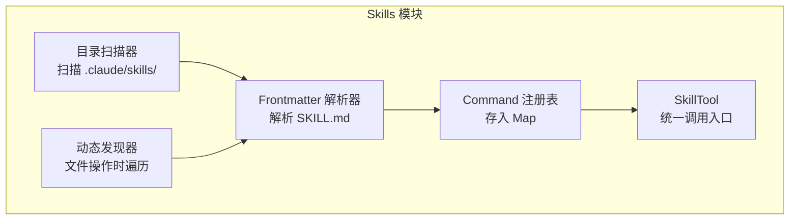

**Component 图解释：**

1. 组件拆分逻辑：扫描（发现目录）→ 解析（提取元数据）→ 注册（存入 Map）→ 发现（运行时扩展）→ 调用（SkillTool 入口），五步对应五个组件
2. 核心组件是 Parser 和 SkillTool：Parser 将 Markdown 转化为内存对象，SkillTool 是 LLM 调用 Skill 的唯一入口
3. 组件间的数据流向：Scanner/Discoverer 发现目录 → Parser 解析 SKILL.md → Registry 存储 Command 对象 → SkillTool 执行时查找并展开 prompt
4. 关键设计决策：启动时只加载固定目录，嵌套目录在文件操作时按需发现（延迟发现避免启动开销）

#### 数据结构

```typescript
// 来自 src/commands.ts (推断)
type PromptCommand = {
  type: 'prompt'
  name: string                         // Skill 名称
  description: string                  // 触发描述
  allowedTools?: string[]              // 工具白名单
  model?: string                       // 模型覆盖
  context?: 'inline' | 'fork'          // 执行模式
  effort?: EffortValue                 // 推理力度
  paths?: string[]                     // 条件路径匹配
  hooks?: HooksSettings                // Skill 专属 hooks
  getPromptForCommand(
    args: string,
    context: ToolUseContext,
  ): Promise<ContentBlockParam[]>      // 展开 prompt
}
```

#### 存储与持久化

- 存储路径：`~/.claude/skills/`（用户级）、`.claude/skills/`（项目级）、`managed/.claude/skills/`（企业级）
- 内存 vs 磁盘：`SKILL.md` 正文全量加载到内存（~5KB/个），引用文件由 LLM 通过 Read 工具按需读取
- 读写时序：启动扫描固定目录 → 文件操作时动态发现嵌套目录 → 前端匹配 `paths` 激活条件 Skill

#### 模块内部时序图

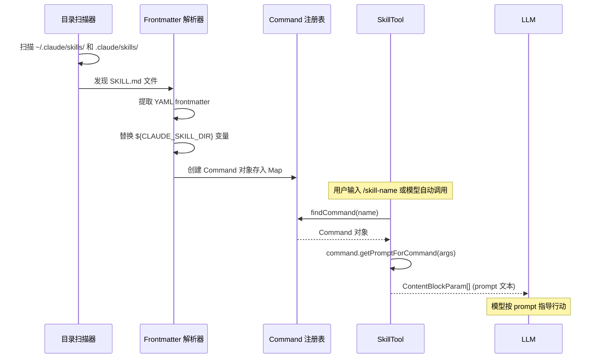

**模块内部时序解释：**

1. 时序起点：启动时 Scanner 遍历固定目录（用户级+项目级），运行时 Discoverer 在文件操作时遍历嵌套目录
2. 每步的数据转换：目录路径 → SKILL.md 文件 → YAML+Markdown → Command 对象 → prompt 文本 → LLM 上下文
3. 关键决策点：条件 Skill（有 `paths` 前置字段）在路径匹配后才激活，避免无关 Skill 干扰
4. 失败时的处理路径：SKILL.md 解析失败 → 记录警告 → 跳过该 Skill → 不影响其他 Skill 加载

#### 与其他模块的交互

| 交互对象 | 交互方式 | 数据格式 | 触发条件 |
|----------|----------|----------|----------|
| Tool Pool | SkillTool 注册 | `Tool` | 启动时 |
| FileEditTool | `discoverSkillDirsForPaths()` | `string[]` | 每次文件编辑操作 |
| Hooks | Skill frontmatter 中的 hooks 配置 | `HookMatcher[]` | Skill 激活时 |
| Settings | 配置 Skill 搜索路径 | `string[]` | 启动时 |

### 5.3 Hooks 模块

#### C4 Component 图

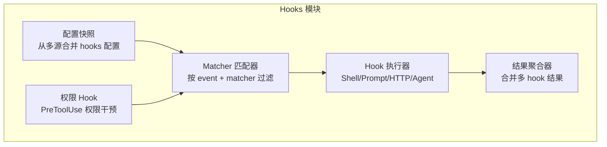

**Component 图解释：**

1. 组件拆分逻辑：按 Hook 执行管线拆分——配置合并→匹配过滤→分发执行→结果聚合，权限 Hook 是特殊的 PreToolUse Hook
2. 核心组件是 Executor 和 PermissionHook：Executor 负责四种 Hook 类型的实际执行，PermissionHook 是最强大的拦截点（可 allow/deny/修改输入）
3. 组件间的数据流向：ConfigSnapshot 提供完整 hooks 配置 → Matcher 按 event 和 matcher 字段过滤 → Executor 按类型分发（Shell 子进程/Prompt 评估/HTTP 请求/Agent 验证）→ ResultAggregator 合并结果
4. 关键设计决策：Hook 并行执行（`Promise.all`），结果按优先级聚合（deny > ask > allow）；exit code 2 表示阻塞，exit code 0 表示成功

#### 数据结构

```typescript
// 来自 src/schemas/hooks.ts
export type BashCommandHook = {
  type: 'command'
  command: string                    // Shell 命令
  if?: string                        // 条件过滤（权限规则语法）
  shell?: 'bash' | 'powershell'      // Shell 类型
  timeout?: number                   // 超时（秒）
  statusMessage?: string             // 进度消息
  once?: boolean                     // 仅执行一次
  async?: boolean                    // 异步执行
  asyncRewake?: boolean              // 异步+退出码2唤醒
}

// 来自 src/types/hooks.ts
export type HookResult = {
  message?: Message                  // 附加到对话的消息
  systemMessage?: Message            // 系统消息
  blockingError?: HookBlockingError  // 阻塞错误（exit code 2）
  outcome: 'success' | 'blocking' | 'non_blocking_error' | 'cancelled'
  preventContinuation?: boolean      // 阻止继续
  permissionBehavior?: 'ask' | 'deny' | 'allow' | 'passthrough'
  additionalContext?: string         // 附加上下文注入 LLM
  updatedInput?: Record<string, unknown>  // 修改工具输入
  updatedMCPToolOutput?: unknown     // 修改 MCP 工具输出
  permissionRequestResult?: PermissionRequestResult
  retry?: boolean                    // 权限拒绝后重试
}
```

#### 存储与持久化

- 存储路径：`settings.json` 的 `hooks` 字段（用户/项目/本地）、Plugin 的 `hooks/hooks.json`、Session 内存
- 内存 vs 磁盘：配置在磁盘，运行时 Hook 注册表在内存（`AppState` + `getRegisteredHooks()`）
- 读写时序：启动时从 Settings 读取 → 运行时从 Plugin/Skill/Frontmatter 动态注册 → `once: true` 执行后自动移除

#### 模块内部时序图

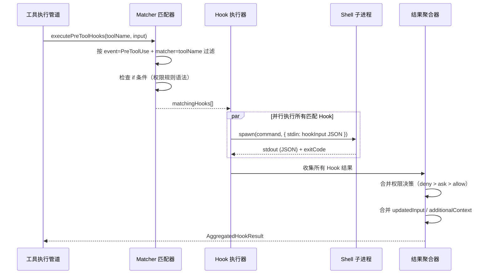

**模块内部时序解释：**

1. 时序起点：工具执行管道在调用 `tool.call()` 前触发 PreToolUse Hook，在调用后触发 PostToolUse Hook
2. 每步的数据转换：Hook 配置 → 匹配的 Hook 列表 → Shell 子进程 → JSON 输出 → 聚合结果 → 权限决策/输入修改
3. 关键决策点：`if` 条件使用权限规则语法（如 `Bash(git *)`），在 spawn 子进程前过滤，避免不必要的进程创建
4. 失败时的处理路径：Hook 执行超时 → 取消进程 → 记录 non_blocking_error → 不影响工具执行；exit code 2 → 阻塞工具执行 → 反馈给 LLM

#### 与其他模块的交互

| 交互对象 | 交互方式 | 数据格式 | 触发条件 |
|----------|----------|----------|----------|
| Tool 执行管道 | `executePreToolHooks()` / `executePostToolHooks()` | `AggregatedHookResult` | 每次工具调用前后 |
| Permission System | PreToolUse Hook 返回 `permissionBehavior` | `'allow'/'deny'/'ask'/'passthrough'` | 权限决策管道 |
| MCP Tool | PostToolUse Hook 的 `updatedMCPToolOutput` | `unknown` | MCP 工具返回结果后 |
| Query Engine | `executeStopHooks()` / `executeSessionStartHooks()` | `AggregatedHookResult` | 会话生命周期事件 |
| Skills | Skill frontmatter 中定义 hooks | `HookMatcher[]` | Skill 激活时注册 |

### 5.4 Subagents 模块

#### C4 Component 图

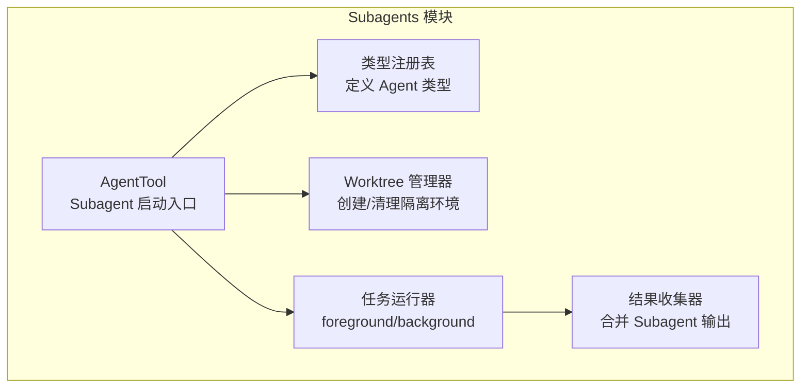

**Component 图解释：**

1. 组件拆分逻辑：按 Subagent 生命周期拆分——启动入口→类型定义→环境隔离→执行模式→结果收集
2. 核心组件是 AgentTool 和 TaskRunner：AgentTool 是 LLM 调用 Subagent 的唯一入口，TaskRunner 管理 foreground/background 两种执行模式
3. 组件间的数据流向：AgentTool.call() → 选择 Agent 类型 → 可选创建 Worktree → TaskRunner 执行 → ResultCollector 合并输出返回主对话
4. 关键设计决策：background Agent 创建 LocalAgentTask 由 pollTasks() 管理，foreground Agent 同步等待结果

#### 数据结构

```typescript
// 来自 src/tools/AgentTool (推断)
type AgentToolInput = {
  prompt: string                      // Subagent 任务描述
  description: string                 // 简短描述
  subagent_type: string               // Agent 类型
  run_in_background?: boolean         // 后台执行
  isolation?: 'worktree'              // 隔离模式
  model?: string                      // 模型覆盖
}

// Agent 类型定义（内置 + 自定义）
type AgentDefinition = {
  name: string                        // 类型名
  description: string                 // 触发描述
  tools: string[]                     // 可用工具白名单
  model?: string                      // 默认模型
  isSubAgent: boolean                 // 是否为 SubAgent
  customSystemPrompt?: string         // 自定义系统提示
}
```

#### 存储与持久化

- 存储路径：Agent 类型定义在 `src/tools/AgentTool/builtInAgents.ts`（内置）；自定义 Agent 通过 Plugin 注册
- 内存 vs 磁盘：Agent 定义和运行状态在内存；Worktree 在磁盘（`.claude/worktrees/`）；后台任务输出在磁盘（`taskOutputDir`）
- 读写时序：AgentTool.call() → 创建 AgentId → 可选创建 Worktree → 启动 query() 循环 → 结果写入对话/任务输出

#### 模块内部时序图

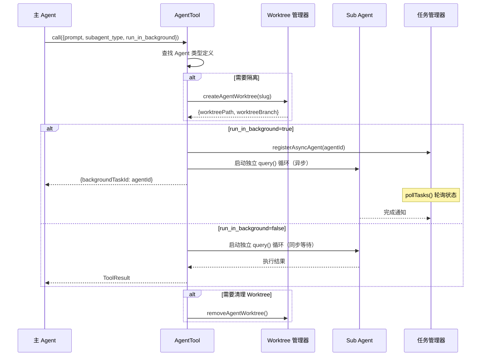

**模块内部时序解释：**

1. 时序起点：主 Agent 的 LLM 输出包含 AgentTool 调用，StreamingToolExecutor 分发执行
2. 每步的数据转换：prompt 文本 → Agent 定义查找 → 可选 Worktree 创建 → 独立 query() 循环 → 结果合并回主对话
3. 关键决策点：`run_in_background` 决定同步/异步模式；`isolation: 'worktree'` 决定是否创建隔离环境
4. 失败时的处理路径：SubAgent 超时 → AbortController 取消 → Worktree 清理 → 部分结果返回主对话

#### 与其他模块的交互

| 交互对象 | 交互方式 | 数据格式 | 触发条件 |
|----------|----------|----------|----------|
| Tool Pool | AgentTool 注册 + 工具白名单 | `Tool[]` | 启动时、Agent 类型注册时 |
| Hooks | `SubagentStart`/`SubagentStop` 事件 | `HookInput` | Subagent 启动/停止时 |
| MCP | 异步 Agent 可使用 MCP 工具 | `Tool call` | Agent 执行期间 |
| Worktree | `createAgentWorktree()`/`removeAgentWorktree()` | `WorktreeResult` | 隔离模式启动/清理 |
| Task System | `registerAsyncAgent()`/`pollTasks()` | `LocalAgentTask` | 后台 Agent 创建/轮询 |

---

## 六、设计原理与对比分析

### 设计取舍

| # | 当前方案 | 替代方案 | 当前方案优势 | 替代方案优势 | 选择理由 |
|---|----------|----------|-------------|-------------|----------|
| 1 | MCP 工具默认延迟加载（ToolSearch） | 全量加载所有工具 | 节省约 2-10MB 上下文 token（数百 MCP 工具时） | 模型 Turn 1 即可使用所有工具 | MCP 工具 workflow-specific，多数对话不需要全部工具；延迟加载使 token 开销从 O(n) 降为 O(1) |
| 2 | Hook 并行执行 + 优先级聚合 | Hook 串行执行 | 执行时间从 O(n) 降为 O(max)，延迟减少 50-80% | 串行可做依赖链，前一个 Hook 的输出影响后一个 | Hook 间通常无依赖，并行更高效；优先级（deny>ask>allow）保证安全性 |
| 3 | Skill 延迟发现嵌套目录 | 递归扫描所有目录 | 启动时间减少 ~200ms（大型项目嵌套多时） | 所有 Skill 立即可用 | 嵌套 Skill 通常与特定子目录相关，只在操作该目录时需要 |
| 4 | Subagent worktree 隔离 | 进程级沙箱隔离 | 创建快（~50ms），Git 原生支持 | 更强的隔离性 | Git worktree 提供文件级隔离已满足大多数场景；进程沙箱开销更大 |
| 5 | MCPTool 泛型模板 + spread override | 每个 MCP 工具独立类 | 注册 100 个 MCP 工具仅需 ~5KB 内存 | 类型安全更强 | MCP 工具运行时动态发现，无法预编译类型；泛型模板避免代码膨胀 |

### 系统间对比

| 对比维度 | MCP Server | Skill | Hook | Subagent |
|----------|-----------|-------|------|----------|
| 扩展层面 | 能力（能访问什么） | 知识（知道怎么做） | 控制流（何时拦截） | 执行（如何并行） |
| 配置方式 | settings.json / .mcp.json | SKILL.md 文件 | settings.json hooks 字段 | AgentTool 参数 |
| 执行位置 | 远程/本地子进程 | 本地 prompt 注入 | Shell 子进程/HTTP/LLM | 独立 query() 循环 |
| 状态管理 | 有状态（连接管理） | 无状态（纯文本） | 无状态（请求-响应） | 有状态（独立对话） |
| 权限模型 | MCP 服务器信任 + 权限委托 | allowedTools 白名单 | 任意权限干预 | Agent 类型白名单 |
| 延迟特征 | 网络延迟 + 进程开销 | 无延迟（内存注入） | Shell 启动开销 | 独立 LLM 调用开销 |
| 上下文占用 | ~2-10MB（Schema） | ~250KB（SKILL.md） | ~0（按需执行） | 独立上下文窗口 |
| 适合场景 | 接入外部 API/服务 | 工作流指导/最佳实践 | 审计/合规/自动化 | 长任务/并行研究 |

### 接入 Claude Code 的方式

| 接入方式 | 适合场景 | 配置位置 | 示例 |
|----------|----------|----------|------|
| MCP Server | 接入外部服务/API | `.mcp.json` 或 `settings.json` | `claude mcp add github -- npx @anthropic/mcp-github` |
| Skill | 注入工作流指导 | `.claude/skills/my-skill/SKILL.md` | 编写 Markdown + frontmatter |
| Hook | 拦截/增强流程 | `settings.json` 的 `hooks` 字段 | `{"PreToolUse": [{"matcher":"Bash","hooks":[{"type":"command","command":"audit.sh"}]}]}` |
| Subagent | 并行任务分发 | 通过 `AgentTool` 参数配置 | 调用 `Agent` 工具 + 指定 `subagent_type` |
| Plugin | 打包 MCP+Hooks+Skills | `~/.claude/plugins/` | `claude plugin install my-plugin` |

### 流程改造的方式

| 改造目标 | 推荐通道 | 实现方式 |
|----------|----------|----------|
| 在工具执行前做审批/拦截 | Hook (PreToolUse) | 编写 Shell 命令，exit code 2 阻塞，JSON 输出 `decision: 'approve'/'block'` |
| 修改工具输入参数 | Hook (PreToolUse) | JSON 输出 `updatedInput: {key: value}` |
| 修改 MCP 工具返回结果 | Hook (PostToolUse) | JSON 输出 `updatedMCPToolOutput: {...}` |
| 注入额外上下文给 LLM | Hook (任意事件) | JSON 输出 `additionalContext: "..."` |
| 添加新的外部工具 | MCP Server | 实现 MCP 协议 Server，在 `.mcp.json` 注册 |
| 添加工作流指导 | Skill | 编写 SKILL.md，放到 `.claude/skills/` |
| 并行化长任务 | Subagent | 调用 AgentTool，设置 `run_in_background: true` |
| 企业策略管控 | Settings (enterprise/managed) | 在 managed 目录配置 `allowedMcpServers`/`deniedMcpServers`/`allowManagedHooksOnly` |
| 替换 VCS 后端 | Hook (WorktreeCreate/WorktreeRemove) | 配置 WorktreeCreate Hook，返回 `worktreePath` |
| 自动化审计/日志 | Hook (PostToolUse/Stop) | 编写 Shell 命令记录工具调用到审计日志 |

### 设计原则总结

1. **正交扩展**：四条通道解决不同维度需求，互不依赖，可独立使用
2. **配置驱动**：所有扩展通过配置文件声明，不修改 Claude Code 源码
3. **渐进加载**：MCP 延迟加载、Skill 动态发现、Hook 按需匹配，避免启动时全量初始化
4. **安全优先**：PreToolUse Hook 可干预权限决策，deny 优先级最高，企业策略可覆盖用户配置

---

## 七、总结与索引

### 核心关系表

| 概念A | 关系 | 概念B |
|-------|------|-------|
| MCP Server | 注册为 | Tool (mcp__*) |
| Skill | 注册为 | Command (PromptCommand) |
| Hook | 拦截于 | Tool 执行管道 |
| Subagent | 启动于 | AgentTool.call() |
| Settings | 配置所有 | MCP/Skill/Hook |
| Permission | 被 Hook 干预 | 权限决策管道 |
| ToolSearch | 延迟加载 | MCP 工具 |

### 设计原则

1. 正交扩展——四通道不耦合，各管各的维度
2. 配置驱动——零代码扩展，通过声明式配置接入
3. 渐进加载——延迟发现、延迟注册、按需装配
4. 安全优先——Hook deny 最高优先级，企业策略覆盖用户配置
5. 协议标准化——MCP 采用开放协议，Skill 采用 Markdown，Hook 采用 JSON stdio

### 核心洞察

Claude Code 的插件系统本质上是一个**四通道正交可扩展架构**，核心洞察在于：扩展能力不是通过统一的"插件接口"实现，而是通过四条独立的正交通道（MCP=能力、Skill=知识、Hook=控制流、Subagent=并行度）组合完成。这种设计的代价是概念复杂度较高，但收益是每条通道可以独立演进、独立优化——MCP 不需要知道 Skill 的存在，Hook 不需要理解 Subagent 的语义，每条通道只需关注自己的扩展维度。

### 如何接入与改造

1. **接入外部服务**：编写 MCP Server（实现 `listTools`/`callTool`），在 `.mcp.json` 注册
2. **注入工作流指导**：编写 `SKILL.md`，放到 `.claude/skills/{name}/` 目录
3. **拦截/增强流程**：在 `settings.json` 配置 Hook，选择事件类型和 Matcher
4. **并行化任务**：通过 AgentTool 启动 Subagent，选择 foreground/background 模式
5. **企业管控**：在 managed 目录配置策略，覆盖用户级配置

### 相关文件索引

| 文件路径 | 职责 |
|----------|------|
| `src/services/mcp/types.ts` | MCP 类型定义（ServerConfig、MCPServerConnection、ConfigScope） |
| `src/services/mcp/config.ts` | MCP 配置加载、合并、去重、策略过滤 |
| `src/services/mcp/client.ts` | MCP Client 实现、连接管理、工具列表获取、OAuth 认证 |
| `src/services/mcp/useManageMCPConnections.ts` | MCP 连接管理 React Hook |
| `src/tools/MCPTool/MCPTool.ts` | MCPTool 泛型模板（buildTool 创建，运行时 override） |
| `src/tools/SkillTool/SkillTool.ts` | SkillTool 实现（调用入口） |
| `src/skills/loadSkillsDir.ts` | Skills 目录扫描与加载 |
| `src/skills/bundledSkills.ts` | 内置 Skill 注册 |
| `src/commands.ts` | Command 查找（Skill 以 PromptCommand 注册） |
| `src/types/hooks.ts` | Hook 类型定义（HookResult、AggregatedHookResult、PromptRequest） |
| `src/schemas/hooks.ts` | Hook Zod Schema（BashCommandHook、PromptHook、AgentHook、HttpHook） |
| `src/utils/hooks.ts` | Hook 执行器（executeHooks、executePreToolHooks、executePostToolHooks） |
| `src/utils/hooks/hooksSettings.ts` | Hook 配置管理与显示 |
| `src/utils/hooks/hooksConfigSnapshot.ts` | Hook 配置快照与策略管控 |
| `src/entrypoints/sdk/coreTypes.ts` | HOOK_EVENTS 常量定义 |
| `src/tools/AgentTool/AgentTool.tsx` | AgentTool 实现（Subagent 启动入口） |
| `src/tools/shared/spawnMultiAgent.ts` | 多 Agent 启动工具 |
| `src/utils/worktree.ts` | Worktree 管理器（创建/清理/过期扫描） |
| `src/utils/settings/settings.ts` | Settings 加载与合并 |
| `src/utils/settings/types.ts` | Settings 类型定义（SettingsJson、HookMatcher） |
| `src/Tool.ts` | Tool 核心接口、buildTool 工厂、ToolUseContext |
| `src/tools.ts` | 工具注册表、assembleToolPool()、getTools() |
| `src/utils/toolSearch.ts` | ToolSearch 延迟加载核心逻辑 |
| `src/services/tools/StreamingToolExecutor.ts` | 流式工具执行器（并发控制） |
