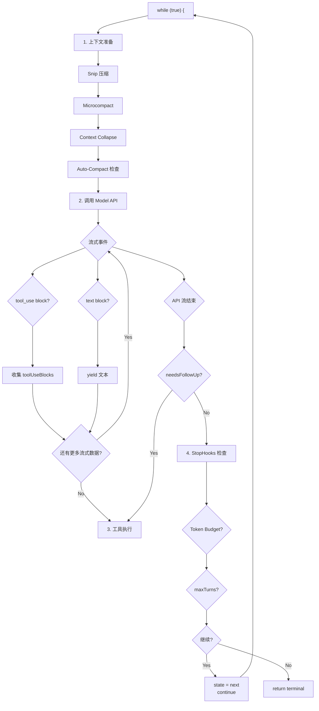
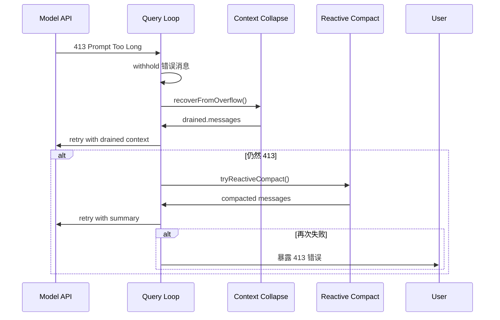

# Query Loop 核心 Agentic Loop 深度解析

> 本文档基于代码分析，整理 Claude Code 中核心 Agentic Loop（Query Loop）的完整设计。

---

## 摘要

Query Loop 是 Claude Code 的**核心执行引擎**，负责：
- 接收用户输入 → 调用 Claude API → 执行工具 → 循环直到完成
- 管理上下文压缩（Auto-Compact）
- 处理错误恢复和重试
- 执行 Stop Hooks
- 管理 Token 预算

**核心文件：**
- `query.ts` — Query Loop 主体（1730 行）
- `QueryEngine.ts` — 循环驱动层（1296 行）
- `query/stopHooks.ts` — 停止钩子系统
- `query/tokenBudget.ts` — Token 预算管理
- `query/config.ts` — 配置快照
- `query/deps.ts` — 依赖注入

---

## 一、整体架构

### 1.1 核心位置

```
┌─────────────────────────────────────────────────────────────┐
│                        QueryEngine                            │
│  submitMessage()  ←── 外部调用（REPL/SDK/Bridge）            │
│         │                                                    │
│         ▼                                                    │
│    ┌─────────┐                                              │
│    │  query  │  ←── AsyncGenerator 核心循环                 │
│    └─────────┘                                              │
│         │                                                    │
│         ▼                                                    │
│  ┌─────────────────────────────────────────────────────┐     │
│  │              queryLoop() 内部                        │     │
│  │                                                     │     │
│  │  while (true) {                                     │     │
│  │    1. 上下文压缩（Snip/Micro/Collapse/Auto）         │     │
│  │    2. 调用 Model API（流式）                        │     │
│  │    3. 工具执行（Streaming 或 批量）                  │     │
│  │    4. StopHooks / TokenBudget / maxTurns 检查        │     │
│  │    5. continue / return                            │     │
│  │  }                                                  │     │
│  └─────────────────────────────────────────────────────┘     │
└─────────────────────────────────────────────────────────────┘
```

### 1.2 QueryEngine 与 Query 的关系

**`QueryEngine`** 是**状态拥有者**：
- 持有 `mutableMessages`（完整消息历史）
- 持有 `totalUsage`（累计使用量）
- 持有 `permissionDenials`（权限拒绝记录）
- 驱动 `query()` generator 并消费其 yield

**`query()`** 是**纯函数式循环**：
- 输入：初始 messages + 配置参数
- 输出：AsyncGenerator yields 各类消息事件
- 内部维护 `State`（跨循环迭代的可变状态）

```typescript
// QueryEngine.ts — 驱动循环
for await (const message of query({ messages, systemPrompt, ... })) {
  // 消费 yield 的消息
  switch (message.type) {
    case 'assistant': /* ... */ break
    case 'user': /* ... */ break
    case 'attachment': /* ... */ break
  }
}
```

---

## 二、Query Loop 状态机

### 2.1 循环状态类型

```typescript
// query.ts — 跨迭代状态
type State = {
  messages: Message[]                    // 当前轮次消息
  toolUseContext: ToolUseContext         // 工具执行上下文
  autoCompactTracking: AutoCompactTrackingState | undefined  // 压缩状态
  maxOutputTokensRecoveryCount: number   // 输出超限重试计数
  hasAttemptedReactiveCompact: boolean    // 已尝试响应式压缩
  maxOutputTokensOverride: number | undefined  // 输出 token 上限覆盖
  pendingToolUseSummary: Promise | undefined  // 待处理的工具摘要
  stopHookActive: boolean | undefined    // StopHook 是否激活
  turnCount: number                      // 当前轮次计数
  transition: Continue | undefined        // 上一次循环继续的原因
}
```

### 2.2 循环继续原因（Continue / Terminal）

```typescript
// query.ts (inline types, not in separate file)
type Terminal =
  | { reason: 'completed' }
  | { reason: 'stop_hook_prevented' }
  | { reason: 'stop_hook_blocking' }      // Blocking errors → retry with injected message
  | { reason: 'token_budget_continuation' } // Token 预算 → 继续但发 nudge
  | { reason: 'max_output_tokens_recovery' } // 输出超限 → 注入恢复消息重试
  | { reason: 'max_output_tokens_escalate' }  // 8k → 64k 升级
  | { reason: 'collapse_drain_retry' }      // 折叠耗尽重试
  | { reason: 'reactive_compact_retry' }    // 响应式压缩重试
  | { reason: 'aborted_streaming' }
  | { reason: 'aborted_tools' }
  | { reason: 'hook_stopped' }
  | { reason: 'blocking_limit' }
  | { reason: 'prompt_too_long' }
  | { reason: 'image_error' }
  | { reason: 'model_error'; error: Error }
  | { reason: 'max_turns'; turnCount: number }
```

### 2.3 循环流转图



---

## 三、Context 压缩系统

### 3.1 四层压缩架构

Claude Code 实现了**四层上下文压缩**，按执行顺序：

| 层级 | 名称 | 触发条件 | 作用 |
|------|------|----------|------|
| 1 | **Snip** | `HISTORY_SNIP` feature | 裁剪超长 assistant 消息 |
| 2 | **Microcompact** | 每次请求 | 精简 tool result 内容 |
| 3 | **Context Collapse** | `CONTEXT_COLLAPSE` feature | 选择性折叠历史消息 |
| 4 | **Auto-Compact** | token 超过阈值 | 生成摘要替换历史 |

### 3.2 Snip 压缩

```typescript
// services/compact/snipCompact.ts
if (feature('HISTORY_SNIP')) {
  const snipResult = snipModule!.snipCompactIfNeeded(messagesForQuery)
  messagesForQuery = snipResult.messages
  snipTokensFreed = snipResult.tokensFreed
}
```
- 裁剪超长 assistant 消息（保留头部 + 尾部）
- 释放的 token 数传递给 autocompact 用于阈值计算

### 3.3 Microcompact

```typescript
// query.ts:414-426
const microcompactResult = await deps.microcompact(
  messagesForQuery,
  toolUseContext,
  querySource,
)
messagesForQuery = microcompactResult.messages
```
- 精简 tool result 中的冗余内容
- 支持缓存编辑（`CACHED_MICROCOMPACT` feature）

### 3.4 Context Collapse

```typescript
// query.ts:440-447
if (feature('CONTEXT_COLLAPSE') && contextCollapse) {
  const collapseResult = await contextCollapse.applyCollapsesIfNeeded(
    messagesForQuery,
    toolUseContext,
    querySource,
  )
  messagesForQuery = collapseResult.messages
}
```
- 选择性折叠特定类型的历史消息
- 支持 staged collapse（在 API 错误时 drain）

### 3.5 Auto-Compact

```typescript
// query.ts:454-543
const { compactionResult, consecutiveFailures } = await deps.autocompact(
  messagesForQuery,
  toolUseContext,
  { systemPrompt, userContext, systemContext, ... },
  querySource,
  tracking,
  snipTokensFreed,
)
```
- 超过 token 阈值时触发
- 生成摘要消息替换历史
- 追踪 `turnId` 和 `turnCounter`

**Auto-Compact 后的消息结构：**
```
[原始消息 1...N] → [summaryMessages] + [attachments] + [hookResults]
```

---

## 四、API 调用与流式处理

### 4.1 模型调用入口

```typescript
// query.ts:659-708
for await (const message of deps.callModel({
  messages: prependUserContext(messagesForQuery, userContext),
  systemPrompt: fullSystemPrompt,
  thinkingConfig: toolUseContext.options.thinkingConfig,
  tools: toolUseContext.options.tools,
  signal: toolUseContext.abortController.signal,
  // ... 更多配置
})) {
  // 处理每个流式事件
}
```

### 4.2 流式事件处理

```typescript
// query.ts:826-845
if (message.type === 'assistant') {
  assistantMessages.push(message)

  // 收集 tool_use blocks
  const msgToolUseBlocks = message.message.content.filter(
    content => content.type === 'tool_use',
  ) as ToolUseBlock[]

  if (msgToolUseBlocks.length > 0) {
    toolUseBlocks.push(...msgToolUseBlocks)
    needsFollowUp = true  // 触发工具执行阶段
  }

  // Streaming Tool Executor：流式添加工具
  if (streamingToolExecutor) {
    for (const toolBlock of msgToolUseBlocks) {
      streamingToolExecutor.addTool(toolBlock, message)
    }
  }
}
```

### 4.3 Withheld 错误处理

**关键设计：可恢复错误被暂存（withheld），直到确认无法恢复才暴露给用户。**

```typescript
// query.ts:799-822
let withheld = false

// Context Collapse 暂存
if (feature('CONTEXT_COLLAPSE')) {
  if (contextCollapse?.isWithheldPromptTooLong(message, ...)) {
    withheld = true
  }
}

// Reactive Compact 暂存
if (reactiveCompact?.isWithheldPromptTooLong(message)) {
  withheld = true
}

// 媒体大小错误暂存
if (mediaRecoveryEnabled && reactiveCompact?.isWithheldMediaSizeError(message)) {
  withheld = true
}

// max_output_tokens 暂存
if (isWithheldMaxOutputTokens(message)) {
  withheld = true
}

if (!withheld) {
  yield yieldMessage  // 正常 yield
}
```

### 4.4 模型降级（Fallback）

```typescript
// query.ts:893-951
try {
  // ... API 调用
} catch (innerError) {
  if (innerError instanceof FallbackTriggeredError && fallbackModel) {
    currentModel = fallbackModel
    attemptWithFallback = true

    // 清理 orphan 消息
    yield* yieldMissingToolResultBlocks(assistantMessages, 'Model fallback triggered')

    // 重试
    continue
  }
  throw innerError
}
```

---

## 五、工具执行系统

### 5.1 两种执行模式

Claude Code 支持**流式**和**批量**两种工具执行模式：

| 模式 | 启用条件 | 优势 |
|------|----------|------|
| **StreamingToolExecutor** | `streamingToolExecution` gate 开启 | 工具结果边执行边返回 |
| **runTools** | 默认 | 等待所有工具完成 |

```typescript
// query.ts:561-568
const useStreamingToolExecution = config.gates.streamingToolExecution
let streamingToolExecutor = useStreamingToolExecution
  ? new StreamingToolExecutor(tools, canUseTool, toolUseContext)
  : null

// query.ts:1380-1382
const toolUpdates = streamingToolExecutor
  ? streamingToolExecutor.getRemainingResults()
  : runTools(toolUseBlocks, assistantMessages, canUseTool, toolUseContext)
```

### 5.2 StreamingToolExecutor

```typescript
// services/tools/StreamingToolExecutor.ts
class StreamingToolExecutor {
  addTool(toolBlock: ToolUseBlock, assistantMessage: AssistantMessage)
  getCompletedResults(): AsyncGenerator<ToolResult>
  getRemainingResults(): AsyncGenerator<ToolResult>
  discard()  // 丢弃未完成的工具调用
}
```

- 工具调用**边 streaming 边执行**，无需等待模型流结束
- `addTool()` 在模型流式输出 tool_use block 时立即调用
- `getCompletedResults()` 实时返回已完成工具的结果

### 5.3 工具结果收集

```typescript
// query.ts:1384-1408
for await (const update of toolUpdates) {
  if (update.message) {
    yield update.message  // 实时 yield 工具结果

    if (update.message.type === 'attachment' &&
        update.message.attachment.type === 'hook_stopped_continuation') {
      shouldPreventContinuation = true
    }

    // 标准化为 user 消息（API 格式）
    toolResults.push(
      ...normalizeMessagesForAPI([update.message], toolUseContext.options.tools)
        .filter(_ => _.type === 'user')
    )
  }
  if (update.newContext) {
    updatedToolUseContext = { ...update.newContext, queryTracking }
  }
}
```

---

## 六、Stop Hooks 系统

### 6.1 Hook 执行时机

Stop Hooks 在**每次循环迭代结束时**（`needsFollowUp = false`）执行：

```typescript
// query.ts:1267-1306
const stopHookResult = yield* handleStopHooks(
  messagesForQuery,
  assistantMessages,
  systemPrompt,
  userContext,
  systemContext,
  toolUseContext,
  querySource,
  stopHookActive,
)

if (stopHookResult.preventContinuation) {
  return { reason: 'stop_hook_prevented' }
}

if (stopHookResult.blockingErrors.length > 0) {
  // 注入了 blocking error 消息 → 继续循环
  state = { ...state, transition: { reason: 'stop_hook_blocking' } }
  continue
}
```

### 6.2 Hook 类型

```typescript
// utils/hooks.ts
executeStopHooks()           // Stop Hook — 每次 turn 结束后运行
executeTaskCompletedHooks()  // TaskCompleted Hook — teammate 完成任务时
executeTeammateIdleHooks()   // TeammateIdle Hook — teammate 空闲时
```

### 6.3 完整 Hook 执行流程

```typescript
// query/stopHooks.ts:175-455
async function* handleStopHooks(...) {
  // 1. 保存 CacheSafeParams（用于 forked agent）
  saveCacheSafeParams(createCacheSafeParams(stopHookContext))

  // 2. 模板任务分类
  if (feature('TEMPLATES')) {
    await jobClassifierModule!.classifyAndWriteState(...)
  }

  // 3. Prompt Suggestion（后台）
  if (!isBareMode()) {
    void executePromptSuggestion(stopHookContext)
  }

  // 4. 记忆提取（后台）
  if (feature('EXTRACT_MEMORIES')) {
    void extractMemoriesModule!.executeExtractMemories(...)
  }

  // 5. Auto-Dream（后台）
  if (!toolUseContext.agentId) {
    void executeAutoDream(stopHookContext, ...)
  }

  // 6. Chicago MCP 清理
  if (feature('CHICAGO_MCP')) {
    await cleanupComputerUseAfterTurn(toolUseContext)
  }

  // 7. 执行 Stop Hooks
  const generator = executeStopHooks(permissionMode, signal, ...)

  for await (const result of generator) {
    // 收集 blocking errors
    // 检查 preventContinuation
  }

  // 8. Teammate 特定 Hooks
  if (isTeammate()) {
    executeTaskCompletedHooks()  // 任务完成时
    executeTeammateIdleHooks()    // Teammate 空闲时
  }
}
```

---

## 七、Token Budget 系统

### 7.1 Budget 追踪

```typescript
// query.ts:280
const budgetTracker = feature('TOKEN_BUDGET') ? createBudgetTracker() : null

// bootstrap/state.ts
getCurrentTurnTokenBudget()    // 本轮 token 预算
getTurnOutputTokens()          // 本轮已用 output tokens
```

### 7.2 Budget 检查

```typescript
// query.ts:1308-1355
if (feature('TOKEN_BUDGET')) {
  const decision = checkTokenBudget(
    budgetTracker!,
    toolUseContext.agentId,
    getCurrentTurnTokenBudget(),
    getTurnOutputTokens(),
  )

  if (decision.action === 'continue') {
    // Token 预算充足 → 注入 nudge message 继续
    incrementBudgetContinuationCount()
    state = {
      messages: [...messages, createUserMessage({ content: decision.nudgeMessage, isMeta: true })],
      transition: { reason: 'token_budget_continuation' }
    }
    continue
  }

  if (decision.completionEvent) {
    // 触发完成事件
    logEvent('tengu_token_budget_completed', ...)
  }
}
```

### 7.3 Budget 决策

```typescript
// query/tokenBudget.ts
export function checkTokenBudget(tracker, agentId, budget, globalTurnTokens): TokenBudgetDecision {
  // 1. SubAgent 或无预算 → 停止
  if (agentId || budget === null || budget <= 0) {
    return { action: 'stop', completionEvent: null }
  }

  // 2. 未达阈值（90%）且非递减 → 继续
  if (!isDiminishing && turnTokens < budget * COMPLETION_THRESHOLD) {
    return { action: 'continue', nudgeMessage: ... }
  }

  // 3. 递减或已超阈值 → 停止
  return { action: 'stop', completionEvent: { diminishingReturns, ... } }
}
```

---

## 八、错误恢复机制

### 8.1 恢复策略总览

| 错误类型 | 恢复策略 | 代码位置 |
|----------|----------|----------|
| **Prompt Too Long (413)** | Context Collapse drain → Reactive Compact → 暴露错误 | query.ts:1062-1183 |
| **Max Output Tokens** | 8k→64k 升级 → recovery message 注入 | query.ts:1185-1256 |
| **Media Size Error** | Reactive Compact strip-retry | query.ts:1075-1175 |
| **Model Fallback** | 切换 fallback model 重试 | query.ts:893-951 |
| **API Error** | 暴露错误，终止循环 | query.ts:955-997 |

### 8.2 Prompt Too Long 恢复流程



### 8.3 Max Output Tokens 恢复

```typescript
// query.ts:1188-1256
if (isWithheldMaxOutputTokens(lastMessage)) {
  // 第一次：8k → 64k 升级
  if (capEnabled && maxOutputTokensOverride === undefined) {
    state = {
      maxOutputTokensOverride: ESCALATED_MAX_TOKENS,  // 64k
      transition: { reason: 'max_output_tokens_escalate' }
    }
    continue
  }

  // 第二次+：注入 recovery message
  if (maxOutputTokensRecoveryCount < MAX_OUTPUT_TOKENS_RECOVERY_LIMIT) {
    const recoveryMessage = createUserMessage({
      content: `Output token limit hit. Resume directly — no apology, no recap...`
    })
    state = {
      messages: [...messagesForQuery, ...assistantMessages, recoveryMessage],
      maxOutputTokensRecoveryCount: maxOutputTokensRecoveryCount + 1,
      transition: { reason: 'max_output_tokens_recovery' }
    }
    continue
  }
}
```

---

## 九、Query Chain 与深度追踪

### 9.1 Query Chain ID

每个 Query 有一个 `chainId`，用于跨链事件关联：

```typescript
// query.ts:347-363
const queryTracking = toolUseContext.queryTracking
  ? {
      chainId: toolUseContext.queryTracking.chainId,
      depth: toolUseContext.queryTracking.depth + 1,
    }
  : {
      chainId: deps.uuid(),
      depth: 0,
    }

toolUseContext = { ...toolUseContext, queryTracking }
```

### 9.2 Chain 深度

| 上下文 | depth |
|--------|-------|
| Main Session | 0 |
| SubAgent (via AgentTool) | depth + 1 |
| Nested SubAgent | depth + 2 |

---

## 十、完整循环时序图

```mermaid
sequenceDiagram
    participant QE as QueryEngine
    participant Q as query()
    participant API as Model API
    participant STE as StreamingToolExecutor
    participant Hooks as StopHooks
    participant Compact as Auto-Compact

    QE->>Q: submitMessage(prompt)
    loop while (true)
        Q->>Q: Snip/Microcompact/Collapse
        Q->>Compact: autoCompactIfNeeded()
        Compact-->>Q: compactionResult?
        Q->>API: callModel() streaming
        loop 每个流式事件
            API->>Q: message (assistant/user/tool_use)
            alt tool_use block
                Q->>STE: addTool()
                STE->>STE: 执行工具（并行）
            end
            Q->>Q: yield message
            Q->>QE: yield message
        end
        Q->>STE: getCompletedResults()
        STE-->>Q: tool results
        Q->>Q: yield tool results
        Q->>Q: generateToolUseSummary()
        Q->>Hooks: handleStopHooks()
        alt preventContinuation
            Q-->>QE: return { reason: 'stop_hook_prevented' }
        end
        alt blockingErrors
            Q->>Q: continue with injected errors
        end
        alt needsFollowUp
            Q->>Q: state = next; continue
        end
        alt tokenBudget exhausted
            Q-->>QE: return { reason: 'completed' }
        end
    end
    Q-->>QE: return { reason: 'completed' }
```

---

## 十一、关键设计模式

### 11.1 AsyncGenerator 作为循环骨架

```typescript
// query.ts — 使用 async generator 实现循环
export async function* query(params: QueryParams): AsyncGenerator<...> {
  const terminal = yield* queryLoop(params, consumedCommandUuids)
  return terminal
}

async function* queryLoop(...): AsyncGenerator<..., Terminal> {
  while (true) {
    // ... 处理逻辑
    if (shouldReturn) {
      return { reason: 'completed' }
    }
    if (shouldContinue) {
      state = nextState
      continue
    }
  }
}
```

**优势：**
- `yield*` 允许委托给子生成器（`handleStopHooks`）
- `return` 值通过 `.return()` 传播
- 支持从外部中止（`AbortController`）

### 11.2 依赖注入（QueryDeps）

```typescript
// query/deps.ts
export type QueryDeps = {
  callModel: typeof queryModelWithStreaming
  microcompact: typeof microcompactMessages
  autocompact: typeof autoCompactIfNeeded
  uuid: () => string
}

export function productionDeps(): QueryDeps {
  return {
    callModel: queryModelWithStreaming,
    microcompact: microcompactMessages,
    autocompact: autoCompactIfNeeded,
    uuid: randomUUID,
  }
}
```

**测试优势：** 测试可以注入 mock 函数，无需 spyOn per module。

### 11.3 配置快照（QueryConfig）

```typescript
// query/config.ts
export type QueryConfig = {
  sessionId: SessionId
  gates: {
    streamingToolExecution: boolean
    emitToolUseSummaries: boolean
    isAnt: boolean
    fastModeEnabled: boolean
  }
}

export function buildQueryConfig(): QueryConfig {
  return {
    sessionId: getSessionId(),
    gates: {
      streamingToolExecution: checkStatsigFeatureGate_CACHED_MAY_BE_STALE(...),
      // ...
    },
  }
}
```

**设计意图：** Immutable 快照避免运行时 gate 变化影响循环。

### 11.4 状态只读契约

```typescript
// query.ts:307-321
while (true) {
  // Destructuring at top of each iteration — read-only between continue sites
  let { toolUseContext } = state  // 仅 toolUseContext 在循环内可写
  const { messages, autoCompactTracking, ... } = state  // 其余只读
}
```

**Continue 时完整替换 State：**
```typescript
const next: State = {
  messages: [...newMessages],
  toolUseContext: newToolUseContext,
  // ... 完整字段
}
state = next
continue
```

---

## 十二、与 Task System 的关系

### 12.1 LocalAgentTask 与 Query 的绑定

当 AgentTool 启动 SubAgent 时：

```typescript
// AgentTool.tsx
const agentResult = await runAgent(...)  // 内部调用 query()
```

SubAgent 的执行**就是一次完整的 query() 循环**。

### 12.2 Task Notification 传递

```typescript
// LocalAgentTask.tsx
completeAsyncAgent(backgroundedTaskId, rootSetAppState)
enqueueAgentNotification({
  taskId: backgroundedTaskId,
  status: 'completed',
  finalMessage: extractTextContent(agentResult.finalResult.content),
  ...
})
```

Main Agent 的 `query()` 在**下次循环**通过 `getCommandsByMaxPriority()` 获取 task notification 作为 attachment。

---

## 十三、相关文件索引

| 文件 | 职责 |
|------|------|
| `query.ts` | Query Loop 主体（1730 行） |
| `QueryEngine.ts` | Query 驱动层 + SDK 接口 |
| `query/deps.ts` | 依赖注入类型和工厂 |
| `query/config.ts` | 不可变配置快照 |
| `query/stopHooks.ts` | StopHooks 执行逻辑 |
| `query/tokenBudget.ts` | Token 预算检查 |
| `query.ts` (inline) | Continue/Terminal 类型定义 |
| `services/tools/StreamingToolExecutor.ts` | 流式工具执行器 |
| `services/tools/toolOrchestration.ts` | 批量工具执行 |
| `services/compact/autoCompact.ts` | 自动压缩 |
| `services/compact/microCompact.ts` | 微压缩 |
| `services/compact/snipCompact.ts` | 消息裁剪 |
| `services/compact/reactiveCompact.ts` | 响应式压缩 |

---

## 十四、总结

### 核心设计原则

1. **AsyncGenerator 作为控制流** — 循环逻辑通过 generator 的 `yield`、`continue`、`return` 实现
2. **不可变状态快照** — `QueryConfig` 在入口快照，避免运行时变化
3. **可恢复错误暂存** — 413/max_output_tokens 等错误被 withheld，直到确认无法恢复
4. **四层上下文压缩** — Snip → Micro → Collapse → Auto，优先级递减
5. **流式工具执行** — StreamingToolExecutor 允许边 streaming 边执行工具
6. **StopHooks 作为扩展点** — 每次 turn 结束提供多个扩展钩子
