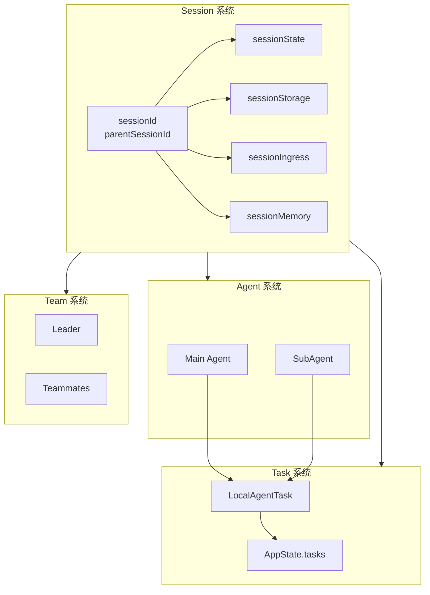
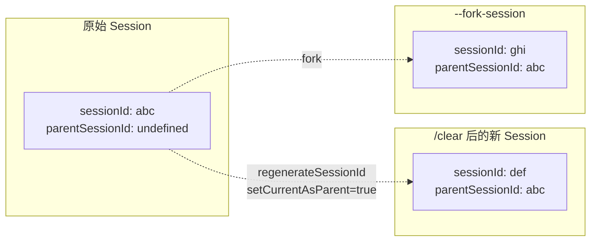
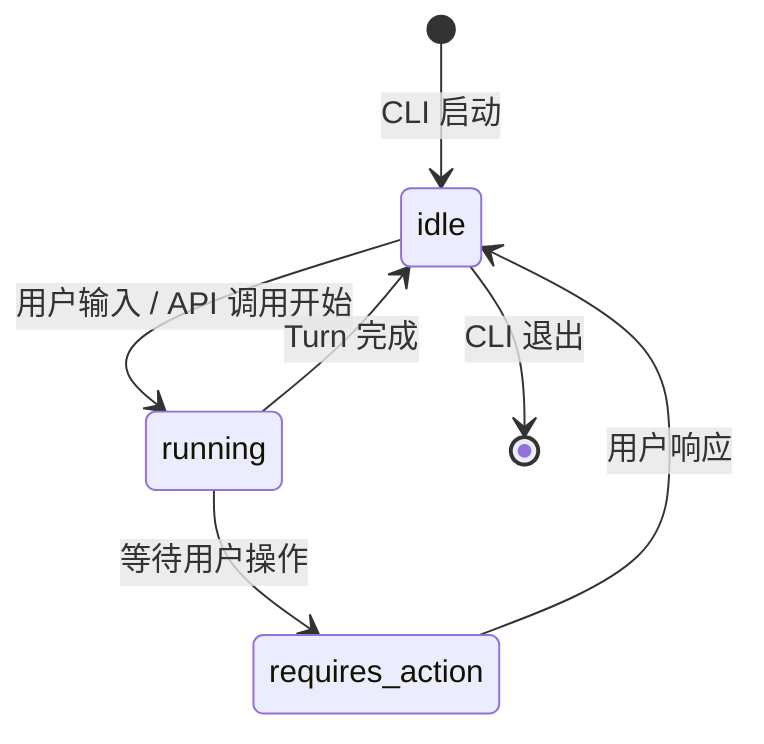
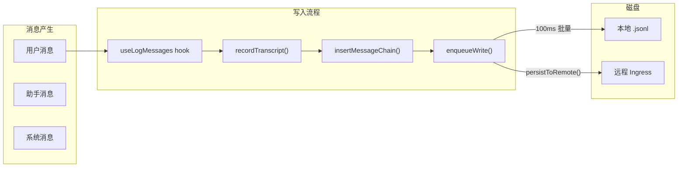
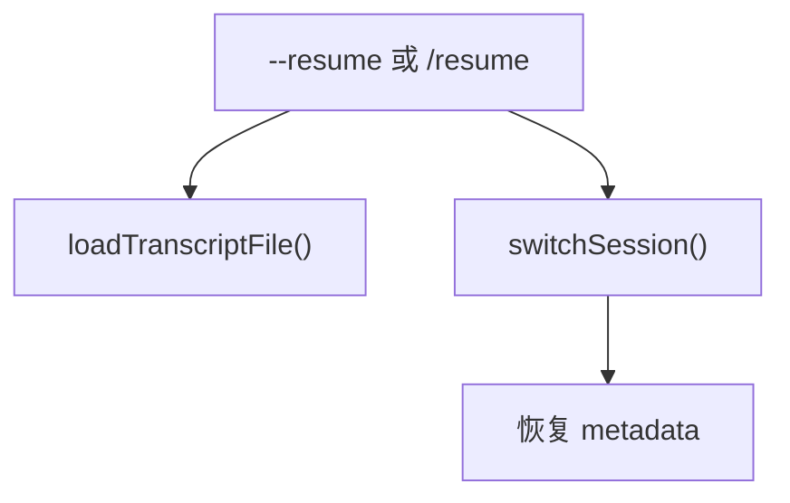
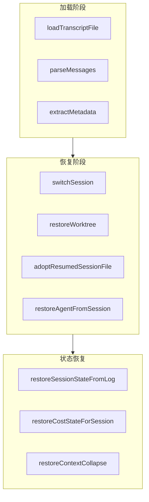
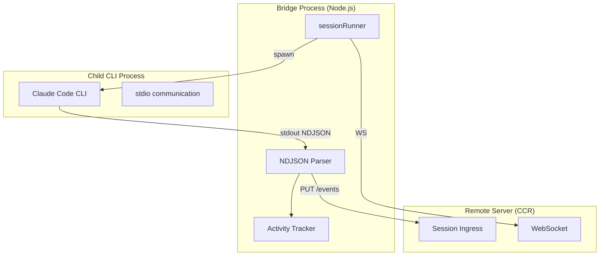
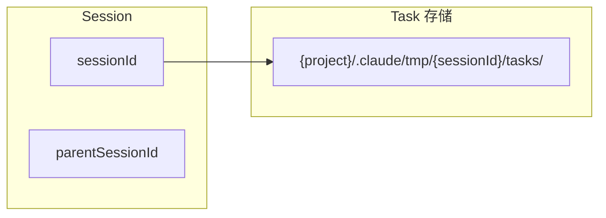

# Session System 会话系统详解

> 本文档基于 Claude Code 源码分析，详细解析 Session 系统的架构、生命周期、持久化机制与状态管理。

---

## 摘要

Claude Code 的 Session 系统是整个 CLI 的核心执行单元。每次 CLI 启动创建一个 Session，通过 `sessionId`（UUID）唯一标识，支持完整的生命周期管理、远程持久化和会话恢复。

**你将了解：**

- Session 的核心身份体系（sessionId、parentSessionId）
- Session 状态机（idle/running/requires_action）
- 远程持久化与乐观并发控制
- Session 恢复机制（resume/continue/fork）
- Session Memory 自动笔记系统
- Bridge Session 远程执行模式
- Session 与其他系统的关联（Task、Agent、Team）

**范围：** `bootstrap/state.ts`、`utils/sessionState.ts`、`utils/sessionStorage.ts`、`utils/sessionRestore.ts`、`services/api/sessionIngress.ts`、`services/SessionMemory/`、`bridge/sessionRunner.ts`

---

## 零、核心概念

### 0.1 Session 是基本执行单元

```
┌─────────────────────────────────────────────────────────────┐
│                      Claude Code CLI                         │
├─────────────────────────────────────────────────────────────┤
│                                                              │
│   每次启动 = 1 个 Session                                    │
│   sessionId (UUID) = 唯一标识                                │
│                                                              │
│   Session 管理：                                             │
│   • 身份标识（谁是这个 session）                             │
│   • 状态追踪（idle/running/requires_action）                │
│   • 持久化（消息历史、元数据）                               │
│   • 恢复（resume/continue）                                 │
│   • 远程同步（session ingress）                              │
│                                                              │
└─────────────────────────────────────────────────────────────┘
```

### 0.2 Session 与其他系统的关系



---

## 一、Session Identity 身份体系

### 1.1 核心标识符

Session 的身份由以下字段确定：

```typescript
// bootstrap/state.ts
type State = {
  sessionId: SessionId              // UUID，唯一标识
  parentSessionId: SessionId | undefined  // 追踪 session 血统
  sessionProjectDir: string | null   // transcript 所在目录
  // ...
}
```

| 字段 | 类型 | 说明 |
|------|------|------|
| `sessionId` | UUID | 每次 CLI 启动随机生成 |
| `parentSessionId` | UUID \| undefined | 记录父 session（fork/clear 后保留） |
| `sessionProjectDir` | string \| null | transcript 文件所在目录 |

### 1.2 Session ID 的生命周期操作

```typescript
// 获取当前 sessionId
export function getSessionId(): SessionId {
  return STATE.sessionId
}

// 重新生成 sessionId（用于 /clear）
// options.setCurrentAsParent = true 时，当前的 sessionId 会成为 parentSessionId
export function regenerateSessionId(
  options: { setCurrentAsParent?: boolean } = {},
): SessionId {
  if (options.setCurrentAsParent) {
    STATE.parentSessionId = STATE.sessionId
  }
  STATE.planSlugCache.delete(STATE.sessionId)
  STATE.sessionId = randomUUID() as SessionId
  STATE.sessionProjectDir = null
  return STATE.sessionId
}

// 切换到另一个 session（用于 resume）
export function switchSession(
  sessionId: SessionId,
  projectDir: string | null = null,
): void {
  STATE.planSlugCache.delete(STATE.sessionId)
  STATE.sessionId = sessionId
  STATE.sessionProjectDir = projectDir
  sessionSwitched.emit(sessionId)
}
```

### 1.3 Session 血统追踪

Session 通过 `parentSessionId` 追踪血统关系：



**血统追踪的用途：**
- `/share` 时序列化 conversation 包含 parentSessionId
- 支持跨 session 的上下文关联分析
- Plan mode 切换时追踪 session 关系

### 1.4 Project Directory 隔离

```typescript
// sessionProjectDir 决定 transcript 文件位置
// null = 从 originalCwd 推导
// string = 显式指定（用于跨项目 resume）
export function getSessionProjectDir(): string | null {
  return STATE.sessionProjectDir
}
```

**存储位置：**
```
{projectDir}/.claude/sessions/{sessionId}.jsonl
```

---

## 二、Session State 状态机

### 2.1 三态模型

```typescript
// utils/sessionState.ts
type SessionState = 'idle' | 'running' | 'requires_action'
```



### 2.2 RequiresAction 详细状态

当 Session 处于 `requires_action` 状态时，携带详细的阻塞信息：

```typescript
type RequiresActionDetails = {
  tool_name: string              // 阻塞的工具名
  action_description: string     // 人类可读的描述
  tool_use_id: string           // 工具调用 ID
  request_id: string            // 请求 ID
  input?: Record<string, unknown>  // 原始输入（用于解析选项）
}
```

**用途：**
- CCR sidebar 显示"正在等待什么"
- 推送通知显示阻塞原因
- Webhook  payload 包含完整上下文

### 2.3 External Metadata 扩展

```typescript
type SessionExternalMetadata = {
  permission_mode?: string | null
  is_ultraplan_mode?: boolean | null
  model?: string | null
  pending_action?: RequiresActionDetails | null
  post_turn_summary?: unknown   // SummaryMessage 内容
  task_summary?: string | null   // Mid-turn 进度
}
```

### 2.4 事件监听机制

```typescript
// 注册状态变更监听器
export function setSessionStateChangedListener(
  cb: SessionStateChangedListener | null,
): void

// 注册 metadata 变更监听器
export function setSessionMetadataChangedListener(
  cb: SessionMetadataChangedListener | null,
): void

// 注册权限模式变更监听器
export function setPermissionModeChangedListener(
  cb: PermissionModeChangedListener | null,
): void

// 触发状态变更
export function notifySessionStateChanged(
  state: SessionState,
  details?: RequiresActionDetails,
): void
```

**监听器用途：**
- CCR bridge 转发状态到 WebSocket 客户端
- SDK 发送 `system:status` 消息
- UI 更新显示状态

---

## 三、Session 持久化

### 3.0 持久化时机总览

Session 在以下**四个时间点**进行持久化：

```
┌─────────────────────────────────────────────────────────────┐
│                     运行时（增量）                            │
│  useLogMessages → recordTranscript → insertMessageChain     │
│         ↓                                                   │
│  enqueueWrite() → 100ms 批量 → drainWriteQueue()           │
│                        ↓                 ↓                    │
│                   本地 .jsonl    →   远程 Ingress (可选)    │
├─────────────────────────────────────────────────────────────┤
│                     退出时（清理）                            │
│  gracefulShutdown → flush() + reAppendSessionMetadata()     │
├─────────────────────────────────────────────────────────────┤
│                     Resume 时（恢复）                         │
│  loadTranscriptFile → restoreSessionMetadata                 │
├─────────────────────────────────────────────────────────────┤
│                     特殊操作（立即）                         │
│  saveCustomTitle / saveAgentSetting / compact               │
└─────────────────────────────────────────────────────────────┘
```

### 3.1 磁盘存储结构

Session 的持久化包含两个层面：

```
~/.claude/
└── sessions/
    └── {sessionId}.jsonl          # Transcript 日志

{project}/.claude/
└── sessions/
    └── {sessionId}.jsonl          # 项目级 session

~/.claude/config/
└── sessions/
    └── {sessionId}/
        ├── metadata.json          # Session 元数据
        └── ...
```

### 3.2 Session Metadata

```typescript
// utils/sessionStorage.ts 存储的内容
type SessionMetadata = {
  sessionId: string
  name?: string                    // 自定义 session 名称
  agentSetting?: string            // 使用的 agent 类型
  worktreeSession?: PersistedWorktreeSession
  customTitle?: string
  tag?: string
  mode?: 'coordinator' | 'normal'
  createdAt: number
  lastAccessedAt: number
}
```

### 3.3 持久化时机详解

#### 3.3.1 运行时增量写入（每条消息）



**调用链：**
```
useLogMessages(messages)
  → recordTranscript(slice)  // 增量追加新消息
    → Project.insertMessageChain()
      → enqueueWrite()  // 进入写队列
        → flushTimer (100ms) 触发批量写入
        → drainWriteQueue()  // 写入 .jsonl 文件
        → persistToRemote()  // 远程同步
```

**关键机制：**
- `useLogMessages` 是 React hook，每次消息数组变化触发
- 使用**增量写入**（只写新消息），避免 O(n) 全量扫描
- 写队列批量合并，100ms 定时刷新到磁盘
- 远程持久化走 `sessionIngress.appendSessionLog()`（乐观并发 + 重试）

#### 3.3.2 会话退出时（Graceful Shutdown）

```
gracefulShutdown()
  → runCleanupFunctions()
    → Project.flush()           // 等待所有 pending writes
    → Project.reAppendSessionMetadata()  // 重新追加 metadata 到 EOF
```

**退出时追加的 metadata（确保在文件末尾 64KB 内）：**
- `custom-title` - 用户设置的会话名
- `tag` - 会话标签
- `agent-name` / `agent-color` - Agent 信息
- `mode` - coordinator/normal 模式
- `worktree` - 当前 worktree 状态

**注册方式（`sessionStorage.ts:449`）：**
```typescript
registerCleanup(async () => {
  await project?.flush()
  project?.reAppendSessionMetadata()  // 重写 metadata 到 EOF
})
```

#### 3.3.3 会话恢复时（Resume）



**`switchSession()` 时：**
- 切换 `sessionId` + `sessionProjectDir`
- 通过 `onSessionSwitch` 信号触发其他组件更新

#### 3.3.4 特定操作时（立即写入）

| 操作 | 触发函数 | 说明 |
|------|----------|------|
| 首次用户消息 | `materializeSessionFile()` | 创建 `.jsonl` 文件，写入缓存的 metadata |
| 会话重命名 | `saveCustomTitle()` | **立即** `appendEntryToFile` 追加到文件 |
| Agent 设置 | `saveAgentSetting()` | 缓存到内存，退出时写入 |
| 压缩完成 | `compact.ts` | 写入 `compact-boundary` + metadata |
| Fork session | `recordContentReplacement()` | 复制 content replacement 记录 |

**立即写入示例：**
```typescript
// saveCustomTitle - 用户重命名时立即落盘
export async function saveCustomTitle(sessionId, customTitle, fullPath) {
  appendEntryToFile(resolvedPath, { type: 'custom-title', customTitle, sessionId })
  // 不走批量队列，直接 append
}
```

---

## 四、Remote Persistence 远程持久化

### 4.1 Session Ingress API

```typescript
// services/api/sessionIngress.ts
// 远程持久化使用 JWT token + 乐观并发控制
```

### 4.2 乐观并发控制

```typescript
// 每次写入携带 Last-Uuid header
headers['Last-Uuid'] = lastUuid

// 服务端响应
// 200/201 = 成功，更新 lastUuid
// 409 = 并发冲突，采用服务端的 lastUuid 重试
// 401 = token 失效，立即失败
```

### 4.3 重试策略

```typescript
const MAX_RETRIES = 10
const BASE_DELAY_MS = 500

// 指数退避：500ms → 1s → 2s → 4s → ... → 8s (上限)
// 409 处理：采用服务端 lastUuid 后立即重试
// 5xx/网络错误：等待后重试
```

### 4.4 Sequential Per-Session

```typescript
// 同一 session 的日志必须顺序写入
// 使用 sequential() 包装器保证顺序
const sequentialAppendBySession: Map<
  string,
  (entry: TranscriptMessage, url: string, headers: Record<string, string>) => Promise<boolean>
> = new Map()

function getOrCreateSequentialAppend(sessionId: string) {
  let sequentialAppend = sequentialAppendBySession.get(sessionId)
  if (!sequentialAppend) {
    sequentialAppend = sequential(async (...) => await appendSessionLogImpl(...))
    sequentialAppendBySession.set(sessionId, sequentialAppend)
  }
  return sequentialAppend
}
```

### 4.5 历史事件获取

```typescript
// 分页获取历史
fetchLatestEvents(ctx, limit)    // 最新 N 条
fetchOlderEvents(ctx, beforeId, limit)  // 翻页

// CCR v2 API：getTeleportEvents
// 支持游标分页，500 条/页，最多 1000 页
```

---

## 五、Session Restore 会话恢复

### 5.1 恢复场景

| 场景 | 触发 | 恢复内容 |
|------|------|----------|
| `--continue` | CLI flag | 完整恢复 |
| `--resume` | CLI flag | 完整恢复 |
| `/resume` | Slash command | 完整恢复 |
| `--fork-session` | CLI flag | 复制消息到新文件 |

### 5.2 恢复的数据类型

```typescript
// sessionRestore.ts — 核心恢复数据
type ResumeResult = {
  messages?: Message[]
  fileHistorySnapshots?: FileHistorySnapshot[]
  attributionSnapshots?: AttributionSnapshotMessage[]
  contextCollapseCommits?: ContextCollapseCommitEntry[]
  contextCollapseSnapshot?: ContextCollapseSnapshotEntry
}

// conversationRecovery.ts — 恢复后的会话元信息
type ResumedSessionInfo = {
  sessionId: UUID | undefined
  agentName?: string
  agentColor?: string
  agentSetting?: string
  customTitle?: string
  tag?: string
  mode?: 'coordinator' | 'normal'
  worktreeSession?: PersistedWorktreeSession | null
  prNumber?: number
  prUrl?: string
  prRepository?: string
}
```

### 5.3 恢复流程



### 5.4 关键恢复函数

```typescript
// 切换到目标 session
switchSession(asSessionId(sid), projectDir)

// 恢复 worktree 目录
restoreWorktreeForResume(worktreeSession)

// 指向旧的 transcript 文件
adoptResumedSessionFile()

// 恢复 agent 设置
restoreAgentFromSession(agentSetting, currentAgent, agentDefs)

// 恢复各种状态
restoreSessionStateFromLog(result, setAppState)
restoreCostStateForSession(sid)
```

### 5.5 Fork Session 的特殊处理

```typescript
// --fork-session 不采用旧 session ID
// 但需要复制 content replacement 记录
if (opts.forkSession && result.contentReplacements?.length) {
  await recordContentReplacement(result.contentReplacements)
}
```

---

## 六、Session Memory 自动笔记

### 6.1 功能概述

Session Memory 自动维护一个 markdown 文件，记录会话中的关键信息：

```
~/.claude/sessions/{sessionId}/memory.md
```

### 6.2 实现机制

```typescript
// 使用 forked subagent 定期提取
const extractSessionMemory = sequential(async function (context) {
  // 1. 检查触发阈值
  if (!shouldExtractMemory(messages)) return

  // 2. 读取当前 memory 文件
  const { memoryPath, currentMemory } = await setupSessionMemoryFile(...)

  // 3. 使用 forked agent 提取关键信息
  await runForkedAgent({
    promptMessages: [createUserMessage({
      content: buildSessionMemoryUpdatePrompt(currentMemory, memoryPath)
    })],
    ...
  })
})
```

### 6.3 触发阈值

```typescript
// 两个维度必须同时满足
const shouldExtract =
  (hasMetTokenThreshold && hasMetToolCallThreshold) ||
  (hasMetTokenThreshold && !hasToolCallsInLastTurn)

// Token 阈值
minimumMessageTokensToInit: 6000    // 首次初始化
minimumTokensBetweenUpdate: 4000     // 后续更新间隔

// Tool call 阈值
toolCallsBetweenUpdates: 10          // 10 次调用后
```

### 6.4 注册为 Post-Sampling Hook

```typescript
export function initSessionMemory(): void {
  if (getIsRemoteMode()) return
  if (!isAutoCompactEnabled()) return

  registerPostSamplingHook(extractSessionMemory)
}
```

---

## 七、Bridge Session 远程执行

### 7.1 架构概览

Bridge Session 用于 CCR（Cloud Code Runtime）远程执行：



### 7.2 Session Spawner

```typescript
// bridge/sessionRunner.ts
type SessionSpawnerDeps = {
  execPath: string
  scriptArgs: string[]
  env: NodeJS.ProcessEnv
  verbose: boolean
  sandbox: boolean
  debugFile?: string
  permissionMode?: string
  onDebug: (msg: string) => void
  onActivity?: (sessionId: string, activity: SessionActivity) => void
  onPermissionRequest?: ...
}

export function createSessionSpawner(deps: SessionSpawnerDeps): SessionSpawner
```

### 7.3 Activity 追踪

```typescript
// Ring buffer 保留最近 10 个活动
const MAX_ACTIVITIES = 10

type SessionActivityType = 'tool_start' | 'text' | 'result' | 'error'

type SessionActivity = {
  type: SessionActivityType
  summary: string
  timestamp: number
}
```

### 7.4 传输协议切换

```typescript
// v1: HybridTransport (WS reads + POST writes)
CLAUDE_CODE_POST_FOR_SESSION_INGRESS_V2: '1'

// v2: SSETransport + CCRClient
CLAUDE_CODE_USE_CCR_V2: '1'
CLAUDE_CODE_WORKER_EPOCH: String(opts.workerEpoch)
```

---

## 八、Session 与其他系统的关联

### 8.1 Session 与 Task



- **后台任务输出**存储在 `{sessionId}/tasks/` 目录
- `/clear` 改变 sessionId → 新任务存在新目录
- 旧任务仍在磁盘但不再被访问

### 8.2 Session 与 Agent

| 上下文 | agentId | AppState.todos key |
|--------|---------|---------------------|
| Main Session | `null` | `sessionId` |
| SubAgent | `agentId` | `agentId` |

```typescript
// SubAgent 的 agentId 用于
// - AppState.tasks[agentId] = LocalAgentTaskState
// - AppState.todos[agentId] = TodoList
// - Task ID = agentId（一对一）
```

### 8.3 Session 与 Team

```typescript
// Team 中 session 共享 teamName
// 但每个 member 有自己独立的 sessionId
type TeamMember = {
  sessionId?: string      // 每个成员自己的 session
  agentId: string
  // ...
}
```

### 8.4 Session 与 Hooks

```typescript
// utils/sessionStart.ts
processSessionStartHooks(source: 'startup' | 'resume' | 'clear' | 'compact')
processSetupHooks(trigger: 'init' | 'maintenance')

// 不同触发源的上下文
startup: 全新 session
resume: 从磁盘恢复
clear: 重新生成 sessionId
compact: 压缩后继续同一 session
```

---

## 九、关键设计模式

### 9.1 设计模式汇总

| 模式 | 实现 | 目的 |
|------|------|------|
| **原子性切换** | `switchSession()` 同时更新 sessionId + projectDir | 防止状态漂移 |
| **乐观并发** | Last-Uuid header + 409 处理 | 处理并发写入 |
| **延迟初始化** | memoize + cached gate | 避免启动阻塞 |
| **Sequential per-session** | `sequential()` wrapper | 保证日志顺序 |
| **血统追踪** | parentSessionId | 支持跨 session 关联 |
| **事件监听器** | listener 回调模式 | 解耦状态通知 |
| **Ring Buffer** | activity array (max=10) | 限制内存使用 |

### 9.2 状态隔离策略

```typescript
// Session 级别状态
STATE.sessionId              // 核心标识
STATE.sessionProjectDir      // 文件位置
STATE.parentSessionId        // 血统

// Session 持久化状态
sessionStorage.ts            // 元数据磁盘存储
sessionIngress.ts           // 远程日志
sessionMemory.ts            // 自动笔记

// 临时状态（进程结束时丢失）
AppState.tasks              // 后台任务（内存）
STATE.slowOperations         // Dev bar 显示
STATE.sessionCronTasks       // Cron 任务
```

### 9.3 性能优化

1. **GrowthBook 缓存**：配置值延迟加载，缓存后快速返回
2. **Sequential append**：避免锁，顺序保证
3. **Activity ring buffer**：固定大小，超出移除最旧
4. **Post-sampling hook**：session memory 在采样后异步执行

---

## 十、风险与技术债

### 10.1 风险登记表

| 风险 | 触发条件 | 影响 | 缓解 |
|------|----------|------|------|
| **Session 冲突** | 多个进程写入同一 session | 409 冲突 | 指数退避重试 |
| **Token 失效** | OAuth token 过期 | 持久化失败 | 401 立即失败，提示重新登录 |
| **Transcript 损坏** | JSONL 解析失败 | 无法 resume | 错误边界，优雅降级 |
| **Worktree 目录丢失** | 目录被删除 | 无法恢复 worktree 状态 | 捕获 ENOENT，清除缓存 |

### 10.2 技术债

| 项目 | 说明 | 优先级 |
|------|------|--------|
| **sessionId 前缀迁移** | 从 `session_` 切换到 `cse_` 需要 compat 层 | 中 |
| **Session 清理** | 旧 session 文件累积，无自动清理 | 低 |
| **跨设备 sync** | Session 无法跨设备同步 | 高（长期） |

---

## 十一、证据索引

| 结论 | 证据文件 |
|------|----------|
| sessionId 是 UUID | `bootstrap/state.ts` → `randomUUID()` |
| 三态机 | `utils/sessionState.ts` → `SessionState` |
| 乐观并发 | `services/api/sessionIngress.ts` → Last-Uuid |
| Sequential append | `services/api/sessionIngress.ts` → `sequentialAppendBySession` |
| Session 恢复 | `utils/sessionRestore.ts` → `processResumedConversation` |
| Session Memory | `services/SessionMemory/sessionMemory.ts` → `extractSessionMemory` |
| Bridge Session | `bridge/sessionRunner.ts` → `createSessionSpawner` |
| ID compat | `bridge/sessionIdCompat.ts` → `toCompatSessionId` |

---

## 相关页面

- [Task System 任务体系总览](TASK-SYSTEM.md)
- [Agent System 代理系统详解](./AGENT-SYSTEM.md)
- [Coordinator 协调模式](./COORDINATOR.md)（待完成）
