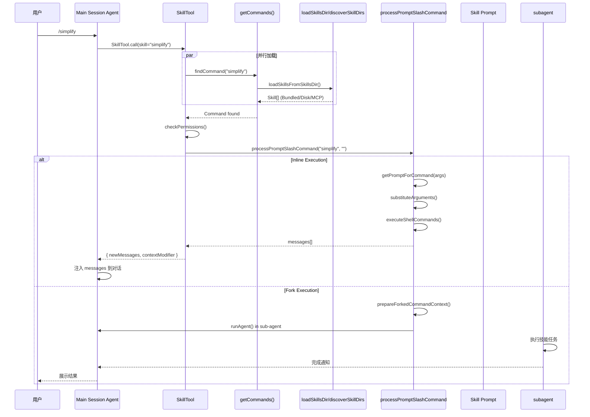

# Skill System 技能系统深度解析

> 本文档基于代码分析，整理 Claude Code 中技能（Skill）系统的完整设计。

## 概述

Claude Code 的 Skill 系统是**可扩展的 prompt 命令系统**，允许用户通过 `/skill-name` 语法调用预定义的 prompt 模板。Skill 本质上是 `type: 'prompt'` 的 Command，通过 `getPromptForCommand()` 返回 prompt 内容。

```mermaid
flowchart LR
    subgraph Agent
        Agent["Agent (Query Engine)"]
    end

    subgraph SkillLayer
        commands["getCommands()"]
        skillTool["SkillTool"]
        loadSkills["loadSkillsDir()"]
        dynamic["discoverSkillDirsForPaths()"]
    end

    subgraph SkillSources
        bundled["Bundled Skills<br/>/skills/bundled/"]
        disk["Disk Skills<br/>~/.claude/skills/<br/>.claude/skills/"]
        mcp["MCP Skills<br/>MCP Servers"]
        plugin["Plugin Skills<br/>Plugins"]
        remote["Remote Skills<br/>AKI/GCS (实验性)"]
    end

    query --> skillTool
    skillTool --> commands
    commands --> loadSkills
    commands --> dynamic
    loadSkills --> SkillSources
    dynamic --> SkillSources

    style Agent fill:#1565c0
    style SkillLayer fill:#e65100
    style SkillSources fill:#1b5e20
```

---

## 一、核心类型系统

### 1.1 Command 类型层次

```typescript
// command.ts
export type Command = CommandBase &
  (PromptCommand | LocalCommand | LocalJSXCommand)
```

`CommandBase` 是所有 Command 类型的共享基类，包含通用字段：

| 类型 | 说明 | 用途 |
|------|------|------|
| `PromptCommand` | prompt 模板命令 | **Skill** 的核心类型 |
| `LocalCommand` | 本地命令实现 | 非 prompt 类命令 |
| `LocalJSXCommand` | React 组件命令 | UI 交互命令 |

### 1.2 CommandBase 接口（所有 Command 的共享基类）

```typescript
// command.ts
export type CommandBase = {
  availability?: CommandAvailability[]
  description: string
  hasUserSpecifiedDescription?: boolean
  /** Defaults to true. Only set when the command has conditional enablement (feature flags, env checks, etc). */
  isEnabled?: () => boolean
  /** Defaults to false. Only set when the command should be hidden from typeahead/help. */
  isHidden?: boolean
  name: string
  aliases?: string[]
  isMcp?: boolean
  argumentHint?: string
  whenToUse?: string            // 何时使用此命令的详细场景描述
  version?: string
  disableModelInvocation?: boolean
  userInvocable?: boolean       // 是否可通过 /skill-name 调用
  loadedFrom?:                  // 命令加载来源
    | 'commands_DEPRECATED'
    | 'skills'
    | 'plugin'
    | 'managed'
    | 'bundled'
    | 'mcp'
  kind?: 'workflow'             // 区分工作流支持的命令
  immediate?: boolean
  isSensitive?: boolean
  userFacingName?: () => string
}
```

### 1.3 PromptCommand 接口

```typescript
// command.ts
export type PromptCommand = {
  type: 'prompt'
  progressMessage: string
  contentLength: number // Length of command content in characters (used for token estimation)
  argNames?: string[]
  allowedTools?: string[]
  model?: string
  source: SettingSource | 'builtin' | 'mcp' | 'plugin' | 'bundled'
  pluginInfo?: {
    pluginManifest: PluginManifest
    repository: string
  }
  disableNonInteractive?: boolean
  hooks?: HooksSettings
  skillRoot?: string
  context?: 'inline' | 'fork'
  agent?: string
  effort?: EffortValue
  paths?: string[]
  getPromptForCommand(
    args: string,
    context: ToolUseContext,
  ): Promise<ContentBlockParam[]>
}
```

### 1.4 BundledSkillDefinition 接口

```typescript
// bundledSkills.ts
export type BundledSkillDefinition = {
  name: string
  description: string
  aliases?: string[]
  whenToUse?: string
  argumentHint?: string
  allowedTools?: string[]
  model?: string
  disableModelInvocation?: boolean
  userInvocable?: boolean
  isEnabled?: () => boolean
  hooks?: HooksSettings
  context?: 'inline' | 'fork'
  agent?: string
  files?: Record<string, string>  // 提取到磁盘的参考文件
  getPromptForCommand: (
    args: string,
    context: ToolUseContext,
  ) => Promise<ContentBlockParam[]>
}
```

### 1.5 BundledSkillDefinition 与 PromptCommand 的关系

**BundledSkillDefinition 是技能注册时的输入类型，PromptCommand 是系统内部的运行时类型。**

`registerBundledSkill()` 函数将 `BundledSkillDefinition` 转换为 `PromptCommand & CommandBase`：

```typescript
// bundledSkills.ts
function registerBundledSkill(definition: BundledSkillDefinition): void {
  const command: PromptCommand & CommandBase = {
    name: definition.name,
    description: definition.description,
    aliases: definition.aliases,
    whenToUse: definition.whenToUse,
    argumentHint: definition.argumentHint,
    allowedTools: definition.allowedTools,
    model: definition.model,
    disableModelInvocation: definition.disableModelInvocation ?? false,
    userInvocable: definition.userInvocable ?? true,
    isEnabled: definition.isEnabled,
    isHidden: !(definition.userInvocable ?? true),
    contentLength: 0,
    source: 'bundled',
    loadedFrom: 'bundled',
    hooks: definition.hooks,
    skillRoot,
    context: definition.context,
    agent: definition.agent,
    files: definition.files,
    progressMessage: 'running',
    getPromptForCommand,
  }
  bundledSkills.push(command)
}
```

关键转换点：
- `BundledSkillDefinition.userInvocable` → `PromptCommand.isHidden` (取反)
- `BundledSkillDefinition.isEnabled` → `PromptCommand.isEnabled` (直接传递)
- `BundledSkillDefinition.whenToUse` → `CommandBase.whenToUse` (直接传递)
- `BundledSkillDefinition` 中的 `files` 字段会在首次调用时提取到磁盘

---

## 二、Skill 来源分类

| 来源 | `loadedFrom` | 存储位置 | 加载时机 |
|------|-------------|----------|----------|
| **Bundled** | `'bundled'` | 代码内置 | 启动时注册 |
| **Disk Skills** | `'skills'` | `~/.claude/skills/`、`.claude/skills/` | 启动时 + 动态发现 |
| **Legacy Commands** | `'commands_DEPRECATED'` | `commands/` | 启动时 |
| **MCP** | `'mcp'` | MCP Servers | MCP 连接时 |
| **Plugin** | `'plugin'` | Plugins | 插件加载时 |
| **Remote** | — | AKI/GCS | 发现后按需加载 |

---

## 三、磁盘技能加载 (`loadSkillsDir.ts`)

### 3.1 加载目录优先级

```typescript
export const getSkillDirCommands = memoize(
  async (cwd: string): Promise<Command[]> => {
    // 1. Managed Skills（策略配置）
    const managedSkillsDir = join(getManagedFilePath(), '.claude', 'skills')

    // 2. User Skills（用户配置）
    const userSkillsDir = join(getClaudeConfigHomeDir(), 'skills')

    // 3. Project Skills（项目配置）
    const projectSkillsDirs = getProjectDirsUpToHome('skills', cwd)

    // 4. Additional Dirs（--add-dir 指定）
    const additionalDirs = getAdditionalDirectoriesForClaudeMd()

    // 5. Legacy Commands
    const legacyCommands = loadSkillsFromCommandsDir(cwd)
  }
)
```

### 3.2 目录格式要求

**Skills 目录 (`/skills/`)**：
- **仅支持目录格式**：`skill-name/SKILL.md`
- 不支持单文件格式

**Commands 目录 (`/commands/`)**：
- 支持目录格式：`skill-name/skill.md`
- 支持单文件格式：`command-name.md`

### 3.3 动态技能发现

```typescript
// discoverSkillDirsForPaths() 在文件操作时调用
export async function discoverSkillDirsForPaths(
  filePaths: string[],
  cwd: string,
): Promise<string[]> {
  // 从文件路径向上遍历，发现 .claude/skills 目录
  // 跳过 gitignored 的目录
}

// activateConditionalSkillsForPaths() 激活条件技能
export function activateConditionalSkillsForPaths(
  filePaths: string[],
  cwd: string,
): string[] {
  // 使用 ignore 库进行路径匹配
  // 匹配后移到 dynamicSkills map 中
}
```

---

## 四、前端元数据解析

### 4.1 Frontmatter 字段

```yaml
---
name: skill-name           # 可选：显示名称
description: 描述文本     # 必填：技能描述
when_to_use: 使用场景      # 可选：何时使用
allowed-tools:            # 可选：允许的工具列表
  - Read
  - Edit
  - Bash
argument-hint: <args>     # 可选：参数提示
arguments: [arg1, arg2]   # 可选：参数名列表
model: opus               # 可选：模型覆盖
disable-model-invocation: false  # 可选：禁止模型调用
user-invocable: true      # 可选：是否可通过 / 调用
context: inline           # 可选：inline | fork
agent: general-purpose    # 可选：fork 时使用的 agent
effort: medium            # 可选：努力程度
paths:                    # 可选：条件技能路径
  - "**/*.ts"
  - "src/**/*.js"
hooks:                    # 可选：钩子配置
  pre-tool-use:
    - name: my-hook
shell: true               # 可选：启用 shell 命令执行
---
```

### 4.2 解析函数

```typescript
export function parseSkillFrontmatterFields(
  frontmatter: FrontmatterData,
  markdownContent: string,
  resolvedName: string,
): {
  displayName: string | undefined
  description: string
  allowedTools: string[]
  argumentHint: string | undefined
  argumentNames: string[]
  whenToUse: string | undefined
  model: ReturnType<typeof parseUserSpecifiedModel> | undefined
  disableModelInvocation: boolean
  userInvocable: boolean
  hooks: HooksSettings | undefined
  executionContext: 'fork' | undefined
  agent: string | undefined
  effort: EffortValue | undefined
  shell: FrontmatterShell | undefined
}
```

---

## 五、执行流程

### 5.1 SkillTool 执行

```typescript
// SkillTool.ts
async call({ skill, args }, context, canUseTool, parentMessage) {
  // 1. 验证技能存在且可执行
  const command = findCommand(commandName, commands)

  // 2. 检查执行上下文
  if (command.context === 'fork') {
    // Fork 模式：在子 agent 中执行
    return executeForkedSkill(command, ...)
  }

  // 3. Inline 模式：展开 prompt 到对话
  const processedCommand = await processPromptSlashCommand(
    commandName, args, commands, context
  )

  // 4. 返回新消息和上下文修改
  return {
    data: { success: true, commandName, allowedTools, model },
    newMessages: processedCommand.messages,
    contextModifier: (ctx) => ({
      ...ctx,
      getAppState() {
        return {
          ...ctx.getAppState(),
          toolPermissionContext: {
            ...ctx.getAppState().toolPermissionContext,
            alwaysAllowRules: { command: allowedTools }
          }
        }
      }
    })
  }
}
```

### 5.2 Inline vs Fork 执行

| 模式 | 说明 | 使用场景 |
|------|------|----------|
| `inline`（默认） | Skill prompt 展开到当前对话，共享 token 预算 | 简单指导、一次性任务 |
| `fork` | 在独立子 agent 中执行，有自己的 token 预算 | 复杂任务、并行审查 |

```typescript
// Fork 模式示例
export const SIMPLIFY_SKILL = registerBundledSkill({
  name: 'simplify',
  context: 'fork',        // 启用 fork 模式
  agent: 'general-purpose',
  async getPromptForCommand(args) {
    return [{ type: 'text', text: SIMPLIFY_PROMPT + args }]
  }
})
```

### 5.3 参数替换

Skill prompt 支持参数替换：

```typescript
// createSkillCommand() 中
finalContent = substituteArguments(
  finalContent,
  args,
  true,  // stripMultipleArgsPlaceholder
  argumentNames,
)

// 支持的变量替换
// ${CLAUDE_SKILL_DIR}  → 技能目录路径
// ${CLAUDE_SESSION_ID} → 当前 session ID
```

---

## 六、Bundled Skills 系统

### 6.1 注册流程

```typescript
// bundled/index.ts
export function initBundledSkills(): void {
  registerUpdateConfigSkill()
  registerKeybindingsSkill()
  registerVerifySkill()
  registerDebugSkill()
  // ...
}

// 特性开关控制
if (feature('AGENT_TRIGGERS')) {
  registerLoopSkill()
}
if (feature('BUILDING_CLAUDE_APPS')) {
  registerClaudeApiSkill()
}
```

### 6.2 Bundled Skill 示例

```typescript
// bundled/simplify.ts
export function registerSimplifySkill(): void {
  registerBundledSkill({
    name: 'simplify',
    description: 'Review changed code for reuse, quality, and efficiency.',
    userInvocable: true,
    async getPromptForCommand(args) {
      let prompt = SIMPLIFY_PROMPT
      if (args) {
        prompt += `\n\n## Additional Focus\n\n${args}`
      }
      return [{ type: 'text', text: prompt }]
    },
  })
}
```

### 6.3 内嵌文件支持

Bundled Skills 可以通过 `files` 字段内嵌参考文件：

```typescript
registerBundledSkill({
  name: 'my-skill',
  files: {
    'schemas/config.json': '{ "type": "object" }',
    'templates/template.md': '# Template\n\n${CLAUDE_SKILL_DIR}/input.txt',
  },
  async getPromptForCommand(args, ctx) {
    // files 被提取到 ~/.claude/skills/my-skill/
    // 并在 prompt 前添加 "Base directory for this skill: ..."
    return [{ type: 'text', text: '...' }]
  }
})
```

---

## 七、条件技能（Conditional Skills）

### 7.1 路径匹配

```typescript
// loadSkillsDir.ts 中存储条件技能
if (skill.paths && skill.paths.length > 0) {
  conditionalSkills.set(skill.name, skill)
}

// activateConditionalSkillsForPaths() 激活匹配的技能
export function activateConditionalSkillsForPaths(filePaths: string[]): string[] {
  for (const [name, skill] of conditionalSkills) {
    const skillIgnore = ignore().add(skill.paths)
    for (const filePath of filePaths) {
      const relativePath = relative(cwd, filePath)
      if (skillIgnore.ignores(relativePath)) {
        dynamicSkills.set(name, skill)
        activatedConditionalSkillNames.add(name)
      }
    }
  }
}
```

### 7.2 使用场景

当技能标记 `paths` 时，只有在操作匹配的文件后才对模型可见：

```yaml
---
name: react-best-practices
description: React best practices reviewer
paths:
  - "**/*.tsx"
  - "**/*.jsx"
---
```

---

## 八、权限与安全

### 8.1 技能权限检查

```typescript
// SkillTool.ts checkPermissions()
const SAFE_SKILL_PROPERTIES = new Set([
  'type', 'progressMessage', 'contentLength', 'argNames',
  'model', 'effort', 'source', 'context', 'agent',
  // ... 更多安全属性
])

if (skillHasOnlySafeProperties(command)) {
  // 自动允许：只有安全属性
  return { behavior: 'allow' }
}

// 需要用户确认：包含非安全属性（如自定义 hooks）
return { behavior: 'ask', suggestions: [...] }
```

### 8.2 Shell 命令执行

```typescript
// 只有非 MCP 技能可以执行 shell 命令
if (loadedFrom !== 'mcp') {
  finalContent = await executeShellCommandsInPrompt(
    finalContent,
    { ...toolUseContext, alwaysAllowRules: { command: allowedTools } },
    `/${skillName}`,
    shell,
  )
}
```

---

## 九、远程技能（Remote Skills）

### 9.1 实验性功能

```typescript
// SkillTool.ts 中
if (
  feature('EXPERIMENTAL_SKILL_SEARCH') &&
  process.env.USER_TYPE === 'ant'
) {
  // 远程技能处理
  const slug = stripCanonicalPrefix(commandName)
  if (slug !== null) {
    return executeRemoteSkill(slug, commandName, parentMessage, context)
  }
}
```

### 9.2 加载流程

```typescript
async function executeRemoteSkill(slug, commandName, context) {
  // 1. 从会话状态获取远程技能元数据
  const meta = getDiscoveredRemoteSkill(slug)

  // 2. 从 AKI/GCS 加载 SKILL.md 内容
  const { content, cacheHit, latencyMs } = await loadRemoteSkill(slug, meta.url)

  // 3. 提取到本地缓存目录
  const skillDir = extractToLocalCache(slug, content)

  // 4. 注入 base directory 前缀
  let finalContent = `Base directory for this skill: ${skillDir}\n\n${bodyContent}`

  // 5. 注册为 invoked skill（压缩时保留）
  addInvokedSkill(commandName, skillPath, finalContent, agentId)

  // 6. 直接作为用户消息注入
  return { newMessages: [createUserMessage({ content: finalContent, isMeta: true })] }
}
```

---

## 十、完整执行时序



---

## 十一、相关文件

| 文件 | 用途 |
|------|------|
| `src/skills/loadSkillsDir.ts` | 磁盘技能加载、动态发现、条件技能 |
| `src/skills/bundledSkills.ts` | Bundled Skill 注册 |
| `src/skills/bundled/index.ts` | 内置技能初始化 |
| `src/skills/bundled/*.ts` | 各内置技能实现 |
| `src/skills/mcpSkillBuilders.ts` | MCP 技能构建器注册 |
| `src/tools/SkillTool/SkillTool.ts` | SkillTool 实现 |
| `src/types/command.ts` | Command 类型定义 |
| `src/commands.ts` | 命令查找与获取 |
| `src/utils/processUserInput/processSlashCommand.tsx` | Slash 命令处理 |
| `src/utils/frontmatterParser.ts` | Frontmatter 解析 |

---

## 十二、总结

| 维度 | 说明 |
|------|------|
| **本质** | `type: 'prompt'` 的 Command，prompt 模板 |
| **调用方式** | `/skill-name` 或模型通过 SkillTool |
| **加载时机** | 启动时 + 文件操作时动态发现 |
| **执行模式** | Inline（展开 prompt）或 Fork（子 agent） |
| **条件激活** | `paths` frontmatter 匹配文件时激活 |
| **权限** | 安全属性自动放行，非安全属性需确认 |
| **远程技能** | 实验性，从 AKI/GCS 按需加载 |

**设计原则**：

- Skill 是**轻量级、可组合**的 prompt 模板
- 支持**多层加载**（bundled → disk → mcp → remote）
- **延迟加载**通过动态发现实现，不影响启动速度
- **条件技能**只在相关文件被操作时才激活，减少干扰
