# 记忆系统 文件驱动的跨会话持久化记忆框架

> 本文档基于代码分析，整理 harness/claude-code 中记忆系统（Memory System）的完整设计。

## 目录

- [一、概述](#一概述)
- [二、核心概念](#二核心概念)
- [三、架构总览](#三架构总览)
  - [系统上下文（C4 Context）](#系统上下文c4-context)
  - [容器拆分（C4 Container）](#容器拆分c4-container)
  - [工作流概览](#工作流概览)
  - [各模块职责概述](#各模块职责概述)
- [四、核心工作流](#四核心工作流)
  - [核心工作流程](#核心工作流程)
  - [核心实体状态流转](#核心实体状态流转)
- [五、分模块详解](#五分模块详解)
  - [5.1 Auto Memory 核心（memdir）](#51-auto-memory-核心memdir)
  - [5.2 Team Memory 模块](#52-team-memory-模块)
  - [5.3 Agent Memory 模块](#53-agent-memory-模块)
  - [5.4 Extract Memories 模块](#54-extract-memories-模块)
  - [5.5 Auto Dream 模块](#55-auto-dream-模块)
  - [5.6 Session Memory 模块](#56-session-memory-模块)
  - [5.7 CLAUDE.md 指令加载模块](#57-claudemd-指令加载模块)
- [六、设计原理与对比分析](#六设计原理与对比分析)
- [七、总结与索引](#七总结与索引)

---

## 一、概述

Claude Code 的记忆系统是一套多层次的、文件驱动的持久化框架，使 AI 助手能够跨会话保留和回溯用户偏好、项目上下文、行为反馈和外部系统指针。系统采用"写入即文件、读取即提示注入"的极简架构：所有记忆以 Markdown 文件形式存储在磁盘上，通过将 `MEMORY.md` 入口文件注入系统提示词实现跨会话召回。在此基础上，后台代理（extractMemories、autoDream、sessionMemory）在对话的各生命周期节点自动提取、整合和压缩记忆，形成从即时写入到夜间蒸馏的完整闭环。

### 系统定位

| 维度 | 说明 |
|------|------|
| 核心职责 | 跨会话持久化用户偏好、项目上下文、行为反馈和外部系统指针 |
| 系统性质 | 文件驱动的多层持久化框架，配合后台代理实现自动提取与整合 |
| 边界 | 上游：主对话循环（用户交互）、后台 Hook（postSampling/stop）；下游：磁盘文件系统（Markdown 文件） |
| 使用方 | 主 Agent（读写记忆）、分叉 Agent（extractMemories/autoDream 只写）、CLAUDE.md 加载器（读取注入） |

### 与其他系统的关系总览

| 关联系统 | 关系 |
|----------|------|
| 主对话循环（REPL） | 主 Agent 在对话中直接读写记忆文件；stopHooks 触发 extractMemories 和 autoDream |
| 提示词构建系统 | `loadMemoryPrompt()` 将行为指南注入系统提示词；`getMemoryFiles()`/`getClaudeMds()` 将 MEMORY.md 内容注入用户上下文 |
| 压缩系统（Compact） | 压缩时清空 readFileState 缓存，重置 getMemoryFiles 缓存（`resetGetMemoryFilesCache('compact')`），使记忆文件在压缩后重新加载 |
| 权限系统 | `createAutoMemCanUseTool()` 限制后台代理只能写入记忆目录；`isAutoMemPath()` 用于文件写入豁免 |
| 特性开关（GrowthBook） | 控制各类记忆功能的启停：`tengu_passport_quail`（extract）、`tengu_onyx_plover`（dream）、`tengu_herring_clock`（team）、`tengu_moth_copse`（跳过索引）、`tengu_session_memory`（session） |

---

## 二、核心概念

### MemoryType（记忆类型）

四类型闭式分类法，每种类型定义了何时保存、如何使用、正反示例。核心原则：只保存从当前项目状态**不可推导**的信息。

```typescript
// 来自 memdir/memoryTypes.ts
export const MEMORY_TYPES = ['user', 'feedback', 'project', 'reference'] as const
export type MemoryType = (typeof MEMORY_TYPES)[number]
```

| 类型 | 定义 | 默认 scope | 典型内容 |
|------|------|-----------|----------|
| `user` | 用户角色、目标、偏好、知识 | 始终 private | "用户是数据科学家，关注可观测性" |
| `feedback` | 行为指导（避免什么、保持什么） | private，项目级约定为 team | "集成测试必须命中真实数据库，不要 mock" |
| `project` | 项目上下文（不可从代码/git 推导） | 强烈偏向 team | "auth 中间件重写由合规驱动" |
| `reference` | 外部系统指针 | 通常 team | "流水线 bug 追踪在 Linear 项目 INGEST" |

### MemoryHeader（记忆文件头）

扫描记忆目录时提取的文件元数据，用于 AI 选择器判断相关性。

```typescript
// 来自 memdir/memoryScan.ts
export type MemoryHeader = {
  filename: string       // 相对路径（如 "user_role.md"）
  filePath: string       // 绝对路径
  mtimeMs: number        // 最后修改时间（毫秒时间戳）
  description: string | null  // 来自 frontmatter 的 description 字段
  type: MemoryType | undefined  // 解析后的记忆类型
}
```

### EntrypointTruncation（入口截断）

`MEMORY.md` 的行数和字节双限制，防止索引膨胀占用过多系统提示词 token。

```typescript
// 来自 memdir/memdir.ts
export type EntrypointTruncation = {
  content: string
  lineCount: number
  byteCount: number
  wasLineTruncated: boolean   // 超过 200 行？
  wasByteTruncated: boolean   // 超过 25KB？
}
```

| 属性 | 值 | 说明 |
|------|-----|------|
| MAX_ENTRYPOINT_LINES | 200 | MEMORY.md 最大行数 |
| MAX_ENTRYPOINT_BYTES | 25,000 | MEMORY.md 最大字节数（~125 字符/行 × 200 行） |
| MAX_MEMORY_FILES | 200 | 扫描时最多处理的记忆文件数 |

### AgentMemoryScope（代理记忆范围）

代理记忆的三级作用域，决定存储位置和可见范围。

```typescript
// 来自 tools/AgentTool/agentMemory.ts
export type AgentMemoryScope = 'user' | 'project' | 'local'
```

| Scope | 路径 | 跨项目 | VCS |
|-------|------|--------|-----|
| `user` | `~/.claude/agent-memory/<agentType>/` | 是 | 否 |
| `project` | `<cwd>/.claude/agent-memory/<agentType>/` | 否 | 是（可提交） |
| `local` | `<cwd>/.claude/agent-memory-local/<agentType>/` | 否 | 否（gitignore） |

### PathTraversalError（路径穿越错误）

Team Memory 的安全守卫，检测并拒绝目录穿越攻击。

```typescript
// 来自 memdir/teamMemPaths.ts
export class PathTraversalError extends Error {
  constructor(message: string) {
    super(message)
    this.name = 'PathTraversalError'
  }
}
```

### Feature Gates（特性开关）

记忆系统的每个子功能都受 GrowthBook 特性开关控制，实现渐进式灰度发布。

| 开关名 | 控制功能 | 默认值 |
|--------|----------|--------|
| `tengu_passport_quail` | extractMemories 后台提取 | false |
| `tengu_onyx_plover` | autoDream 夜间整合 | false |
| `tengu_herring_clock` | teamMemory 团队记忆 | false |
| `tengu_moth_copse` | 跳过 MEMORY.md 索引（改为 attachment 注入） | false |
| `tengu_session_memory` | sessionMemory 会话记忆 | false |
| `tengu_coral_fern` | 搜索历史上下文指南 | false |
| `tengu_bramble_lintel` | extractMemories 节流（每次提取间隔轮数） | 1 |
| `tengu_slate_thimble` | 允许非交互会话运行 extractMemories | false |

---

## 三、架构总览

### 系统上下文（C4 Context）

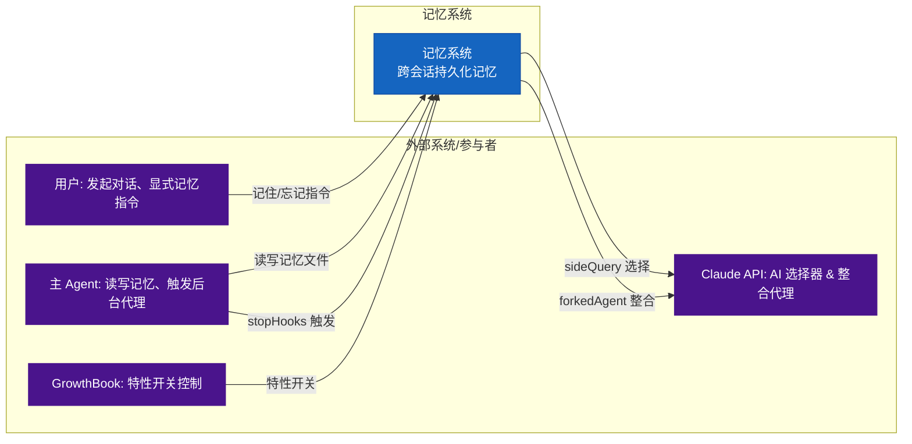
```mermaid
flowchart LR
    classDef core fill:#1565c0,stroke:#0d47a1,color:#fff
    classDef external fill:#4a148c,stroke:#4a148c,color:#fff

    subgraph External["外部系统/参与者"]
        User["用户: 发起对话、显式记忆指令"]
        MainAgent["主 Agent: 读写记忆、触发后台代理"]
        GrowthBook["GrowthBook: 特性开关控制"]
        ClaudeAPI["Claude API: AI 选择器 & 整合代理"]
    end

    subgraph Target["记忆系统"]
        MemorySystem["记忆系统<br/>跨会话持久化记忆"]
    end

    User -->|记住/忘记指令| MemorySystem
    MainAgent -->|读写记忆文件| MemorySystem
    MainAgent -->|stopHooks 触发| MemorySystem
    GrowthBook -->|特性开关| MemorySystem
    MemorySystem -->|sideQuery 选择| ClaudeAPI
    MemorySystem -->|forkedAgent 整合| ClaudeAPI

    class MemorySystem core
    class User,MainAgent,GrowthBook,ClaudeAPI external
```

**Context 图解释：**

用户通过自然语言指令（"记住 X"、"忘记 Y"）和主 Agent 交互，主 Agent 直接使用 Write/Edit 工具写入记忆文件。对话结束时的 stopHooks 触发 extractMemories（从最近对话中提取遗漏记忆）和 autoDream（跨会话整合蒸馏）。GrowthBook 作为横切关注点控制所有子功能的灰度开关。记忆的"智能选择"（findRelevantMemories）和"自动提取"均通过 Claude API 的 sideQuery/forkedAgent 调用小型 AI 代理完成。

### 容器拆分（C4 Container）

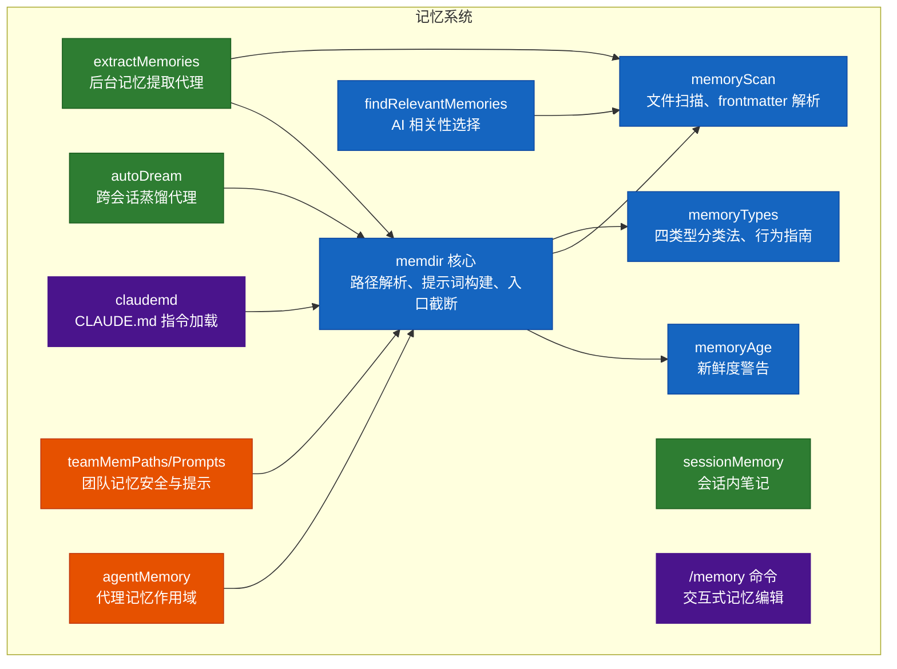
```mermaid
flowchart TD
    classDef core fill:#1565c0,stroke:#0d47a1,color:#fff
    classDef infra fill:#e65100,stroke:#bf360c,color:#fff
    classDef auto fill:#2e7d32,stroke:#1b5e20,color:#fff
    classDef entry fill:#4a148c,stroke:#4a148c,color:#fff

    subgraph MemorySystem["记忆系统"]
        MemdirCore["memdir 核心<br/>路径解析、提示词构建、入口截断"]
        MemoryTypes["memoryTypes<br/>四类型分类法、行为指南"]
        MemoryScan["memoryScan<br/>文件扫描、frontmatter 解析"]
        FindRelevant["findRelevantMemories<br/>AI 相关性选择"]
        MemoryAge["memoryAge<br/>新鲜度警告"]
        TeamMem["teamMemPaths/Prompts<br/>团队记忆安全与提示"]
        AgentMem["agentMemory<br/>代理记忆作用域"]
        ExtractMem["extractMemories<br/>后台记忆提取代理"]
        AutoDream["autoDream<br/>跨会话蒸馏代理"]
        SessionMem["sessionMemory<br/>会话内笔记"]
        ClaudeMd["claudemd<br/>CLAUDE.md 指令加载"]
        MemoryCmd["/memory 命令<br/>交互式记忆编辑"]
    end

    class MemdirCore,MemoryTypes,MemoryScan,FindRelevant,MemoryAge core
    class TeamMem,AgentMem infra
    class ExtractMem,AutoDream,SessionMem auto
    class ClaudeMd,MemoryCmd entry

    MemdirCore --> MemoryTypes
    MemdirCore --> MemoryScan
    MemdirCore --> MemoryAge
    FindRelevant --> MemoryScan
    ExtractMem --> MemoryScan
    ExtractMem --> MemdirCore
    AutoDream --> MemdirCore
    ClaudeMd --> MemdirCore
    TeamMem --> MemdirCore
    AgentMem --> MemdirCore
```

**Container 图解释：**

记忆系统采用"核心 + 扩展"的分层架构。memdir 核心（路径解析、提示词构建、入口截断）和 memoryTypes（分类法、行为指南）构成基础层，所有其他模块均依赖它们。扩展层分为三类：存储扩展（teamMem、agentMem 提供不同作用域的记忆路径）、自动化扩展（extractMemories、autoDream、sessionMemory 提供不同时间尺度的自动记忆管理）、入口扩展（claudemd 负责将记忆注入上下文、/memory 命令提供用户界面）。MemoryScan 作为共享原语被 findRelevantMemories 和 extractMemories 共同使用。

### 工作流概览

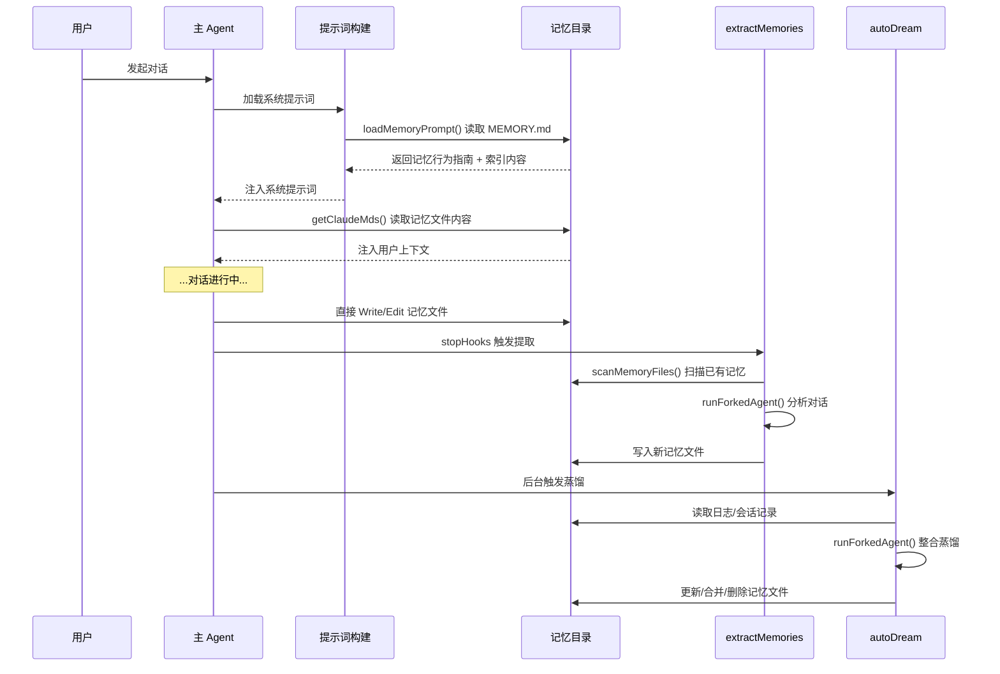
```mermaid
sequenceDiagram
    participant User as 用户
    participant Main as 主 Agent
    participant Prompt as 提示词构建
    participant MemDir as 记忆目录
    participant Extract as extractMemories
    participant Dream as autoDream

    User->>Main: 发起对话
    Main->>Prompt: 加载系统提示词
    Prompt->>MemDir: loadMemoryPrompt() 读取 MEMORY.md
    MemDir-->>Prompt: 返回记忆行为指南 + 索引内容
    Prompt-->>Main: 注入系统提示词
    Main->>MemDir: getClaudeMds() 读取记忆文件内容
    MemDir-->>Main: 注入用户上下文

    Note over Main: ...对话进行中...
    Main->>MemDir: 直接 Write/Edit 记忆文件

    Main->>Extract: stopHooks 触发提取
    Extract->>MemDir: scanMemoryFiles() 扫描已有记忆
    Extract->>Extract: runForkedAgent() 分析对话
    Extract->>MemDir: 写入新记忆文件

    Main->>Dream: 后台触发蒸馏
    Dream->>MemDir: 读取日志/会话记录
    Dream->>Dream: runForkedAgent() 整合蒸馏
    Dream->>MemDir: 更新/合并/删除记忆文件
```

**工作流概览解释：**

记忆系统的完整生命周期包含三个阶段。**加载阶段**：会话启动时，`loadMemoryPrompt()` 构建记忆行为指南（如何保存、何时访问、信任级别）并注入系统提示词；`getMemoryFiles()`/`getClaudeMds()` 读取 MEMORY.md 入口文件内容注入用户上下文。**写入阶段**：主 Agent 在对话中根据用户指令或自身判断直接使用 Write/Edit 工具写入记忆文件，遵循两步流程——先写主题文件（含 frontmatter），再更新 MEMORY.md 索引。**自动化阶段**：对话结束时 extractMemories 捕获主 Agent 遗漏的记忆；跨会话时 autoDream 整合蒸馏过时记忆、合并重复、清理索引。三者互斥：主 Agent 已写入记忆时 extractMemories 跳过该轮。

### 各模块职责概述

| 模块 | 核心职责 | 关键接口 | 依赖 |
|------|----------|----------|------|
| memdir 核心 | 路径解析、目录创建、提示词构建、入口截断 | `loadMemoryPrompt()`, `buildMemoryLines()`, `truncateEntrypointContent()` | paths.ts, memoryTypes.ts |
| memoryTypes | 四类型分类法定义、行为指南模板 | `MEMORY_TYPES`, `TYPES_SECTION_INDIVIDUAL`, `TYPES_SECTION_COMBINED` | 无 |
| paths | 自动记忆路径解析、启停判断 | `getAutoMemPath()`, `isAutoMemoryEnabled()`, `isAutoMemPath()` | settings, env |
| memoryScan | 记忆文件扫描、frontmatter 提取 | `scanMemoryFiles()`, `formatMemoryManifest()` | memoryTypes, frontmatterParser |
| findRelevantMemories | AI 相关性选择（Sonnet sideQuery） | `findRelevantMemories()` | memoryScan, sideQuery |
| teamMemPaths/Prompts | 团队记忆路径、安全验证、提示词 | `validateTeamMemWritePath()`, `buildCombinedMemoryPrompt()` | paths, memdir |
| agentMemory | 代理记忆路径与加载 | `getAgentMemoryDir()`, `loadAgentMemoryPrompt()` | memdir, paths |
| extractMemories | 后台记忆提取代理 | `executeExtractMemories()`, `drainPendingExtraction()` | memoryScan, forkedAgent, paths |
| autoDream | 跨会话蒸馏代理 | `executeAutoDream()` | forkedAgent, consolidationLock, paths |
| sessionMemory | 会话内笔记维护 | `initSessionMemory()`, `shouldExtractMemory()` | forkedAgent, postSamplingHooks |
| claudemd | CLAUDE.md 加载与上下文注入 | `getMemoryFiles()`, `getClaudeMds()` | memdir, paths |

---

## 四、核心工作流

### 核心工作流程

#### 正常流：记忆保存与召回

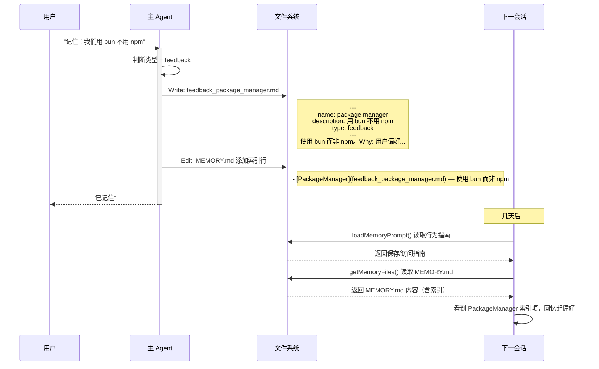
```mermaid
sequenceDiagram
    participant User as 用户
    participant Agent as 主 Agent
    participant FS as 文件系统
    participant Next as 下一会话

    User->>Agent: "记住：我们用 bun 不用 npm"
    activate Agent
    Agent->>Agent: 判断类型 = feedback
    Agent->>FS: Write: feedback_package_manager.md
    Note right of FS: ---<br/>name: package manager<br/>description: 用 bun 不用 npm<br/>type: feedback<br/>---<br/>使用 bun 而非 npm。Why: 用户偏好...
    Agent->>FS: Edit: MEMORY.md 添加索引行
    Note right of FS: - [PackageManager](feedback_package_manager.md) — 使用 bun 而非 npm
    Agent-->>User: "已记住"
    deactivate Agent

    Note over Next: 几天后...
    Next->>FS: loadMemoryPrompt() 读取行为指南
    FS-->>Next: 返回保存/访问指南
    Next->>FS: getMemoryFiles() 读取 MEMORY.md
    FS-->>Next: 返回 MEMORY.md 内容（含索引）
    Next->>Next: 看到 PackageManager 索引项，回忆起偏好
```

**正常流解释：**

记忆保存遵循两步流程。**步骤一**：主 Agent 将记忆内容写入独立的主题文件，文件名语义化（如 `feedback_package_manager.md`），包含 YAML frontmatter 声明 `name`、`description`、`type` 三个必填字段，正文采用"规则 + Why + How to apply"结构。**步骤二**：在 `MEMORY.md` 索引文件中添加一行指针（`- [Title](file.md) — one-line hook`），不超过 150 字符。召回时，`MEMORY.md` 的全部内容被注入对话上下文（截断上限 200 行/25KB），主 Agent 通过索引项定位到具体主题文件并用 Read 工具读取详细内容。tengu_moth_copse 特性开启后，MEMORY.md 不再注入系统提示词，改为 findRelevantMemories 通过 attachment 按需注入。

#### 异常流：记忆提取与主 Agent 写入互斥

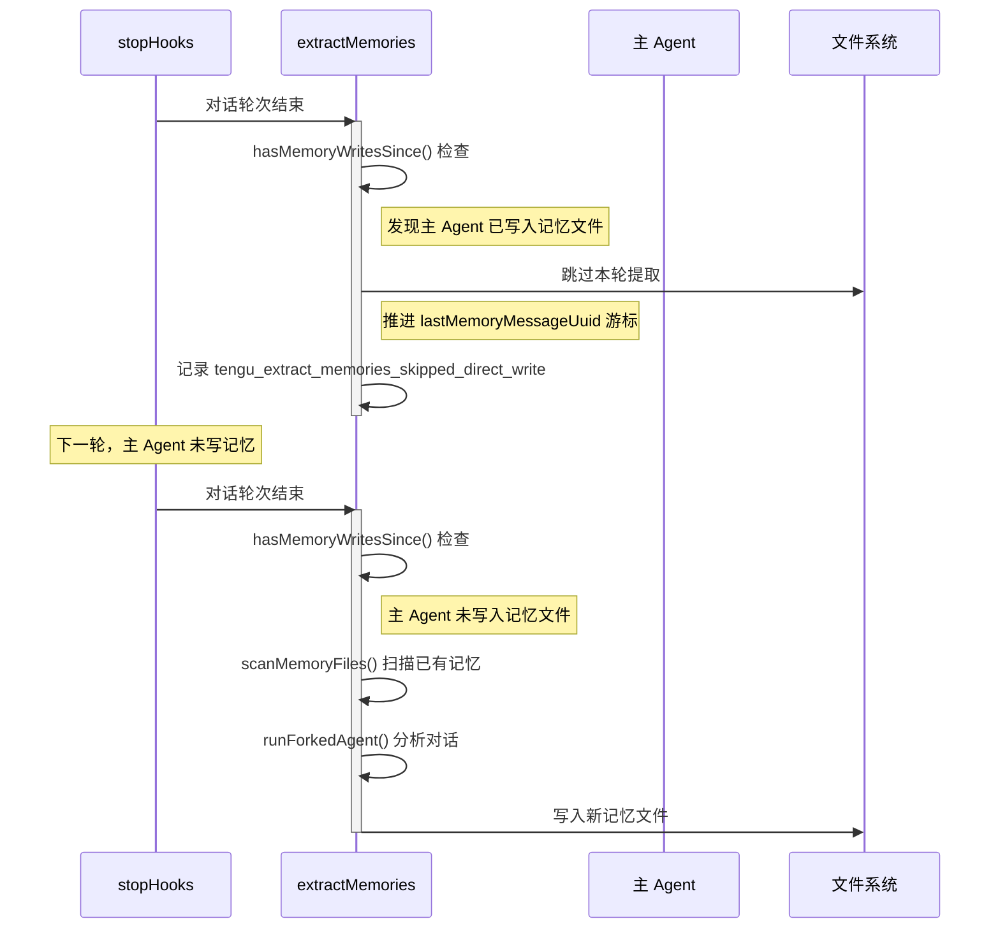
```mermaid
sequenceDiagram
    participant Hook as stopHooks
    participant Extract as extractMemories
    participant Main as 主 Agent
    participant FS as 文件系统

    Hook->>Extract: 对话轮次结束
    activate Extract
    Extract->>Extract: hasMemoryWritesSince() 检查
    Note right of Extract: 发现主 Agent 已写入记忆文件
    Extract->>FS: 跳过本轮提取
    Note right of Extract: 推进 lastMemoryMessageUuid 游标
    Extract->>Extract: 记录 tengu_extract_memories_skipped_direct_write
    deactivate Extract

    Note over Hook: 下一轮，主 Agent 未写记忆
    Hook->>Extract: 对话轮次结束
    activate Extract
    Extract->>Extract: hasMemoryWritesSince() 检查
    Note right of Extract: 主 Agent 未写入记忆文件
    Extract->>Extract: scanMemoryFiles() 扫描已有记忆
    Extract->>Extract: runForkedAgent() 分析对话
    Extract->>FS: 写入新记忆文件
    deactivate Extract
```

**异常流解释：**

extractMemories 和主 Agent 采用"互斥写"策略。当 `hasMemoryWritesSince()` 检测到主 Agent 在当前轮次已使用 Write/Edit 工具写入自动记忆目录下的文件时，extractMemories 跳过该轮提取并推进游标（`lastMemoryMessageUuid`），避免重复写入。当主 Agent 未写记忆时，extractMemories 通过 forkedAgent 在后台分析对话并写入遗漏的记忆。这种设计基于以下考量：主 Agent 的系统提示词中已包含完整的保存指南，其写入的记忆质量高于后台代理的自动提取；两者同时写入会产生文件冲突和索引不一致。互斥的代价是：如果主 Agent 选择不保存某个值得记忆的信息，extractMemories 只能在下一轮（主 Agent 未写入的轮次）补漏。

### 核心实体状态流转

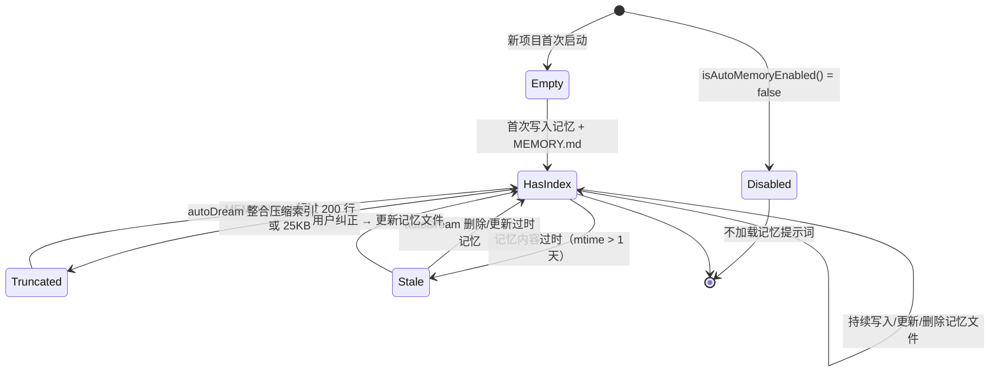
```mermaid
stateDiagram-v2
    [*] --> Disabled: isAutoMemoryEnabled() = false
    [*] --> Empty: 新项目首次启动
    Empty --> HasIndex: 首次写入记忆 + MEMORY.md
    HasIndex --> HasIndex: 持续写入/更新/删除记忆文件
    HasIndex --> Truncated: MEMORY.md 超过 200 行或 25KB
    Truncated --> HasIndex: autoDream 整合压缩索引
    HasIndex --> Stale: 记忆内容过时（mtime > 1天）
    Stale --> HasIndex: autoDream 删除/更新过时记忆
    Stale --> HasIndex: 用户纠正 → 更新记忆文件
    Disabled --> [*]: 不加载记忆提示词
    HasIndex --> [*]
```

<!-- stateDiagram 着色说明：Disabled=红色(终态), Empty=橙色(初始), HasIndex=绿色(正常), Truncated=橙色(警告), Stale=橙色(退化) -->

**状态流转解释：**

记忆实体的生命周期从"是否启用"开始。`Disabled` 状态由环境变量（`CLAUDE_CODE_DISABLE_AUTO_MEMORY`）、模式（`--bare`/`SIMPLE`）、远程无存储（CCR 无 `CLAUDE_CODE_REMOTE_MEMORY_DIR`）或 settings.json 的 `autoMemoryEnabled: false` 决定。启用后，`Empty` 状态在首次写入记忆文件和创建 `MEMORY.md` 索引后转为 `HasIndex`。`Truncated` 是一个警告状态——当 MEMORY.md 超过 200 行或 25KB 时，`truncateEntrypointContent()` 截断内容并追加 WARNING 标记，autoDream 的 Phase 4（Prune and index）负责压缩索引恢复到 `HasIndex`。`Stale` 不是一个显式状态，而是通过 `memoryFreshnessNote()` 在读取时注入 `<system-reminder>` 警告：超过 1 天的记忆会附上"此记忆可能过时，请验证当前代码状态"的提示。

#### 状态定义

| 状态 | 含义 | 是否终态 | 触发条件 |
|------|------|----------|----------|
| Disabled | 记忆功能未启用 | 是 | 环境变量/设置/模式禁用 |
| Empty | 记忆目录为空（无 MEMORY.md） | 否 | 新项目首次启动 |
| HasIndex | 正常工作状态，MEMORY.md 索引可用 | 否 | 首次写入 或 从其他状态恢复 |
| Truncated | MEMORY.md 超过限制，部分内容被截断 | 否 | 索引行数 >200 或字节数 >25KB |
| Stale | 记忆内容可能过时 | 否 | mtime 距今 >1 天 |

---

## 五、分模块详解

### 5.1 Auto Memory 核心（memdir）

#### C4 Component 图

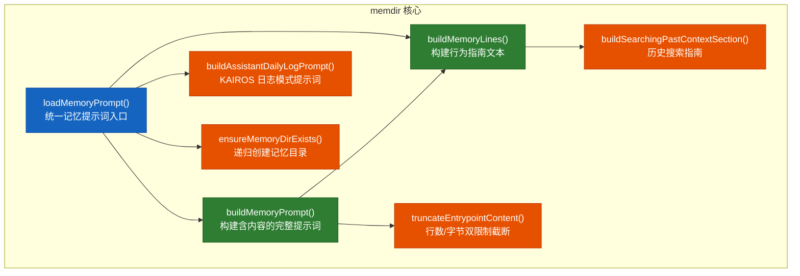
```mermaid
flowchart TD
    classDef core fill:#1565c0,stroke:#0d47a1,color:#fff
    classDef helper fill:#e65100,stroke:#bf360c,color:#fff
    classDef entry fill:#2e7d32,stroke:#1b5e20,color:#fff

    subgraph memdir["memdir 核心"]
        LoadPrompt["loadMemoryPrompt()<br/>统一记忆提示词入口"]
        BuildLines["buildMemoryLines()<br/>构建行为指南文本"]
        BuildPrompt["buildMemoryPrompt()<br/>构建含内容的完整提示词"]
        Truncate["truncateEntrypointContent()<br/>行数/字节双限制截断"]
        EnsureDir["ensureMemoryDirExists()<br/>递归创建记忆目录"]
        DailyLog["buildAssistantDailyLogPrompt()<br/>KAIROS 日志模式提示词"]
        SearchPast["buildSearchingPastContextSection()<br/>历史搜索指南"]
    end

    class LoadPrompt core
    class BuildLines,BuildPrompt entry
    class Truncate,EnsureDir,DailyLog,SearchPast helper

    LoadPrompt --> BuildLines
    LoadPrompt --> BuildPrompt
    LoadPrompt --> DailyLog
    BuildPrompt --> Truncate
    BuildPrompt --> BuildLines
    BuildLines --> SearchPast
    LoadPrompt --> EnsureDir
```

**Component 图解释：**

memdir 核心采用"入口分发 + 构建器组合"模式。`loadMemoryPrompt()` 是统一入口，根据当前启用的记忆系统分发到三条路径：KAIROS 模式走 `buildAssistantDailyLogPrompt()`（追加式日志而非维护索引）、TEAMMEM 模式走 `buildCombinedMemoryPrompt()`（双目录提示词）、默认走 `buildMemoryLines()`（单目录提示词）。`buildMemoryPrompt()` 用于代理记忆（agentMemory），因为它需要同步读取 MEMORY.md 内容并内联到提示词中——主对话的记忆内容通过 `getMemoryFiles()`/`getClaudeMds()` 单独注入用户上下文。`truncateEntrypointContent()` 是共享截断逻辑，先按行截断（自然边界），再按字节截断（在最后一个换行符处切断避免破坏行），两者独立检测。

#### 数据结构

```typescript
// 来自 memdir/memdir.ts
export const ENTRYPOINT_NAME = 'MEMORY.md'
export const MAX_ENTRYPOINT_LINES = 200
export const MAX_ENTRYPOINT_BYTES = 25_000

// 来自 memdir/paths.ts
export function isAutoMemoryEnabled(): boolean  // 优先级链：env→SIMPLE→CCR→settings→默认true
export function getAutoMemPath(): string        // 返回带尾部分隔符的目录路径
export function getAutoMemEntrypoint(): string  // MEMORY.md 完整路径
export function isAutoMemPath(absolutePath: string): boolean  // 路径包含检测
```

#### 存储与持久化

- 存储路径：`{memoryBase}/projects/{sanitized-git-root}/memory/`
  - `memoryBase` 解析优先级：`CLAUDE_CODE_REMOTE_MEMORY_DIR` → `~/.claude`
  - `sanitized-git-root` 使用 `findCanonicalGitRoot()` 确保同一 repo 的所有 worktree 共享一个记忆目录
- 可覆盖：`CLAUDE_COWORK_MEMORY_PATH_OVERRIDE`（完整路径覆盖）、settings.json `autoMemoryDirectory`（支持 `~/` 展开，仅限 policy/flag/local/user 来源，排除 projectSettings 防止恶意仓库设置）
- 内存 vs 磁盘：所有记忆均为磁盘文件，无内存缓存（`getMemoryFiles()` 使用 lodash memoize 缓存扫描结果，但内容本身从磁盘读取）
- 读写时序：读（loadMemoryPrompt）在系统提示词构建时同步完成；写（主 Agent 的 Write/Edit）在对话中异步完成

#### 模块内部时序图

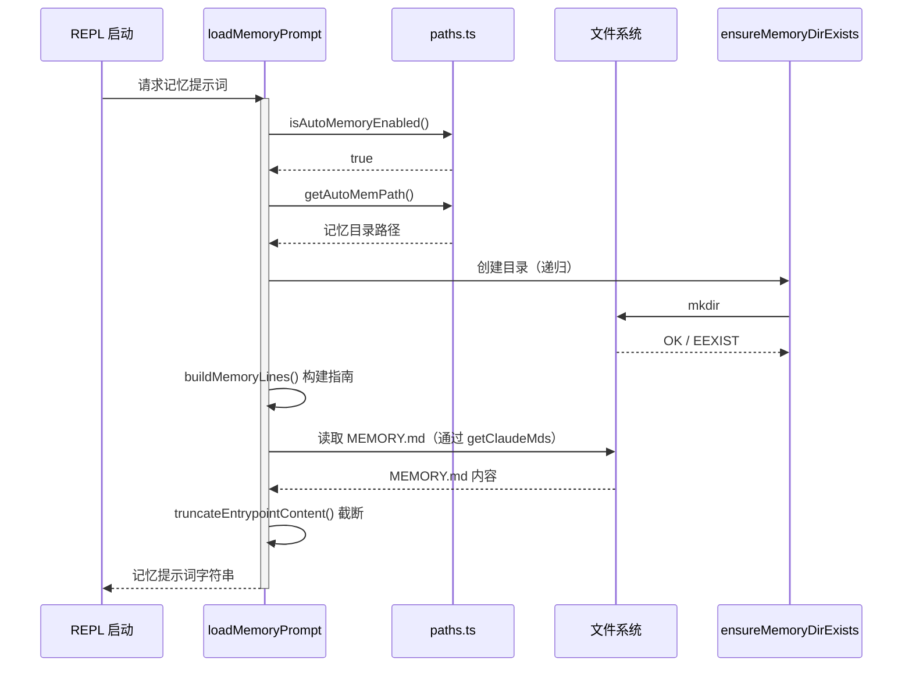
```mermaid
sequenceDiagram
    participant REPL as REPL 启动
    participant Load as loadMemoryPrompt
    participant Paths as paths.ts
    participant FS as 文件系统
    participant Ensure as ensureMemoryDirExists

    REPL->>Load: 请求记忆提示词
    activate Load
    Load->>Paths: isAutoMemoryEnabled()
    Paths-->>Load: true
    Load->>Paths: getAutoMemPath()
    Paths-->>Load: 记忆目录路径
    Load->>Ensure: 创建目录（递归）
    Ensure->>FS: mkdir
    FS-->>Ensure: OK / EEXIST
    Load->>Load: buildMemoryLines() 构建指南
    Load->>FS: 读取 MEMORY.md（通过 getClaudeMds）
    FS-->>Load: MEMORY.md 内容
    Load->>Load: truncateEntrypointContent() 截断
    Load-->>REPL: 记忆提示词字符串
    deactivate Load
```

**模块内部时序解释：**

会话启动时，`loadMemoryPrompt()` 首先通过 `isAutoMemoryEnabled()` 检查功能开关链（env → SIMPLE → CCR → settings → 默认），然后通过 `getAutoMemPath()` 解析目录路径（memoized 避免重复 realpath 调用）。`ensureMemoryDirExists()` 递归创建目录——这是一个幂等操作，EEXIST 被内部吞掉，真正的权限错误（EACCES/EPERM/EROFS）只做日志不影响提示词构建。`buildMemoryLines()` 生成纯行为指南文本（不含 MEMORY.md 内容），内容注入由下游 `getMemoryFiles()` 负责。这种分离设计使得系统提示词（行为指南，较长但稳定）和用户上下文（MEMORY.md 内容，较短但频繁变化）可以分别缓存。

#### 与其他模块的交互

| 交互对象 | 交互方式 | 数据格式 | 触发条件 |
|----------|----------|----------|----------|
| paths.ts | 函数调用 | 路径字符串、布尔值 | loadMemoryPrompt 调用时 |
| memoryTypes.ts | 常量引用 | `TYPES_SECTION_*`, `WHAT_NOT_TO_SAVE_SECTION` 等 | buildMemoryLines 构建时 |
| claudemd.ts | 被 getClaudeMds() 调用 | EntrypointTruncation 结果 | 提示词构建时 |
| extractMemories | 被引用 | ENTRYPOINT_NAME 常量、createAutoMemCanUseTool | 后台提取时 |
| autoDream | 被引用 | DIR_EXISTS_GUIDANCE、buildConsolidationPrompt | 蒸馏代理构建时 |
| teamMemPrompts | 条件 require | buildCombinedMemoryPrompt | TEAMMEM 特性开启时 |

### 5.2 Team Memory 模块

#### C4 Component 图

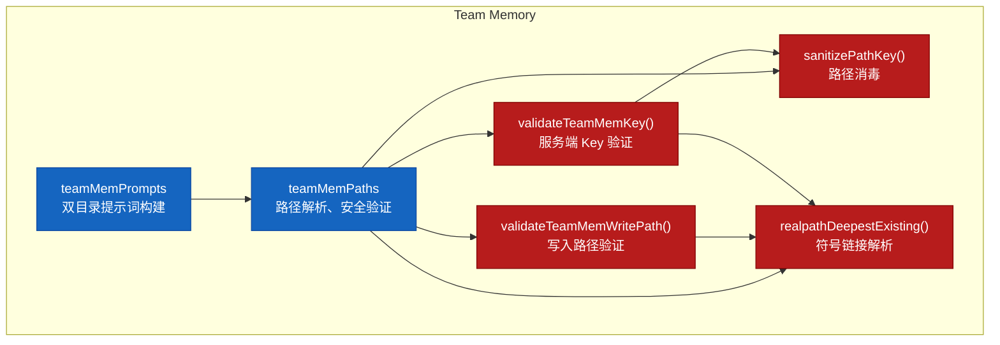
```mermaid
flowchart TD
    classDef core fill:#1565c0,stroke:#0d47a1,color:#fff
    classDef security fill:#b71c1c,stroke:#7f0000,color:#fff
    classDef helper fill:#e65100,stroke:#bf360c,color:#fff

    subgraph TeamMemory["Team Memory"]
        TeamPaths["teamMemPaths<br/>路径解析、安全验证"]
        TeamPrompts["teamMemPrompts<br/>双目录提示词构建"]
        Sanitize["sanitizePathKey()<br/>路径消毒"]
        Realpath["realpathDeepestExisting()<br/>符号链接解析"]
        ValidateWrite["validateTeamMemWritePath()<br/>写入路径验证"]
        ValidateKey["validateTeamMemKey()<br/>服务端 Key 验证"]
    end

    class TeamPaths,TeamPrompts core
    class Sanitize,Realpath,ValidateWrite,ValidateKey security

    TeamPaths --> Sanitize
    TeamPaths --> Realpath
    TeamPaths --> ValidateWrite
    TeamPaths --> ValidateKey
    ValidateWrite --> Realpath
    ValidateKey --> Sanitize
    ValidateKey --> Realpath
    TeamPrompts --> TeamPaths
```

**Component 图解释：**

Team Memory 的核心挑战是安全性。团队记忆目录位于 `{autoMemPath}/team/`，可被所有项目成员读写，因此需要防御两类攻击向量：**路径穿越**（通过 `..`、URL 编码 `%2e%2e%2f`、Unicode NFKC 标准化攻击逃逸出团队目录）和**符号链接逃逸**（在 teamDir 内放置指向敏感目录的 symlink，如 `~/.ssh/authorized_keys`）。`sanitizePathKey()` 是第一道防线，拒绝 null 字节、URL 编码穿越、Unicode 标准化穿越、反斜杠和绝对路径。`validateTeamMemWritePath()` 和 `validateTeamMemKey()` 是两阶段验证：先 `path.resolve()` 消除 `..` 段并检查字符串级包含，再 `realpathDeepestExisting()` 解析最深现有祖先的符号链接并验证真实路径仍在 teamDir 内。`realpathDeepestExisting()` 特殊处理悬挂符号链接（lstat 成功但 realpath 失败）——这是攻击向量，直接拒绝。

#### 数据结构

```typescript
// 来自 memdir/teamMemPaths.ts
export function isTeamMemoryEnabled(): boolean  // autoEnabled && GrowthBook gate
export function getTeamMemPath(): string        // {autoMemPath}/team/
export function getTeamMemEntrypoint(): string  // {autoMemPath}/team/MEMORY.md
export function isTeamMemPath(filePath: string): boolean  // resolve() 字符串包含
export function isTeamMemFile(filePath: string): boolean  // enabled && isTeamMemPath

export async function validateTeamMemWritePath(filePath: string): Promise<string>
// 输入：绝对文件路径 → 输出：解析后的绝对路径 / 抛出 PathTraversalError
// 两阶段：resolve() + realpathDeepestExisting() + isRealPathWithinTeamDir()

export async function validateTeamMemKey(relativeKey: string): Promise<string>
// 输入：服务端返回的相对路径 → 输出：解析后的绝对路径 / 抛出 PathTraversalError
// 三步：sanitizePathKey() → resolve() → realpathDeepestExisting()
```

#### 存储与持久化

- 存储路径：`{autoMemPath}/team/`（autoMemPath 的子目录）
- 共享机制：通过 `services/teamMemorySync/` 与 Claude API 双向同步
- 安全层级：
  1. 字符串级：`path.resolve()` 消除 `..`，前缀匹配检查
  2. 文件系统级：`realpathDeepestExisting()` 解析 symlink
  3. 悬挂链接检测：`lstat()` 区分"真正不存在"和"悬挂 symlink"
  4. 循环检测：`ELOOP` 错误直接拒绝
  5. 权限失败关闭：`EACCES`/`EIO` 等无法验证 → `isRealPathWithinTeamDir()` 返回 false

#### 模块内部时序图

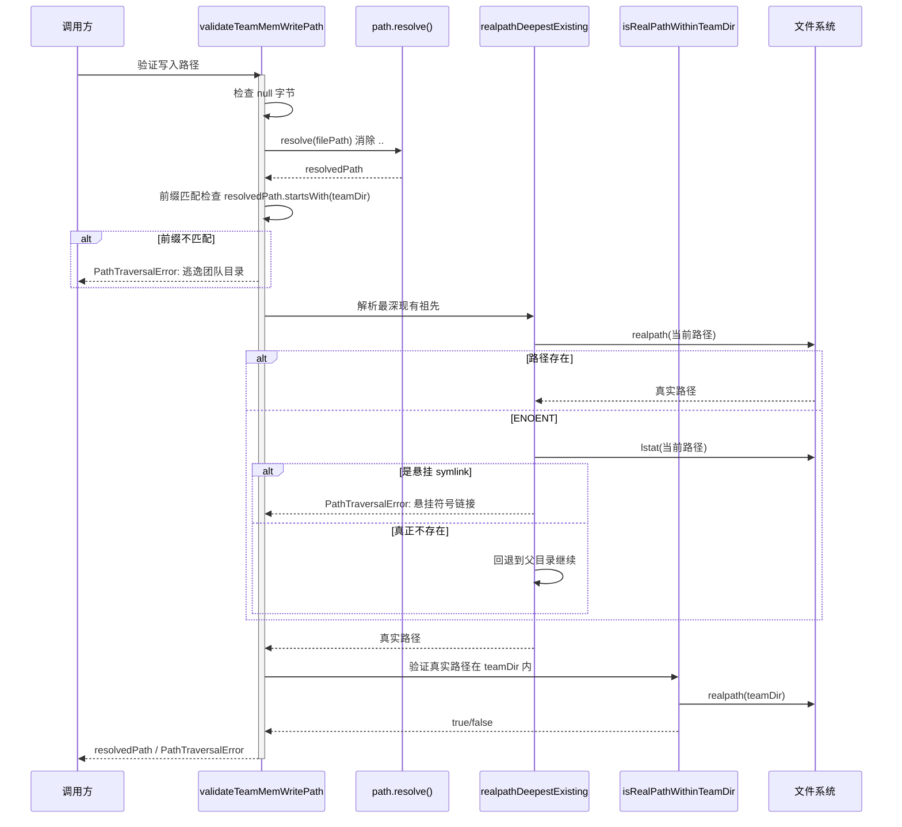
```mermaid
sequenceDiagram
    participant Caller as 调用方
    participant Validate as validateTeamMemWritePath
    participant Resolve as path.resolve()
    participant Realpath as realpathDeepestExisting
    participant Within as isRealPathWithinTeamDir
    participant FS as 文件系统

    Caller->>Validate: 验证写入路径
    activate Validate
    Validate->>Validate: 检查 null 字节
    Validate->>Resolve: resolve(filePath) 消除 ..
    Resolve-->>Validate: resolvedPath
    Validate->>Validate: 前缀匹配检查 resolvedPath.startsWith(teamDir)
    alt 前缀不匹配
        Validate-->>Caller: PathTraversalError: 逃逸团队目录
    end
    Validate->>Realpath: 解析最深现有祖先
    Realpath->>FS: realpath(当前路径)
    alt 路径存在
        FS-->>Realpath: 真实路径
    else ENOENT
        Realpath->>FS: lstat(当前路径)
        alt 是悬挂 symlink
            Realpath-->>Validate: PathTraversalError: 悬挂符号链接
        else 真正不存在
            Realpath->>Realpath: 回退到父目录继续
        end
    end
    Realpath-->>Validate: 真实路径
    Validate->>Within: 验证真实路径在 teamDir 内
    Within->>FS: realpath(teamDir)
    Within-->>Validate: true/false
    Validate-->>Caller: resolvedPath / PathTraversalError
    deactivate Validate
```

**模块内部时序解释：**

写入路径验证是两阶段管道。第一阶段是快速的字符串级检查（resolve + 前缀匹配），能拦截绝大多数明显的穿越尝试而不触及文件系统。第二阶段是文件系统级验证，通过 `realpathDeepestExisting()` 从目标路径向上遍历直到找到存在的祖先，用 `realpath()` 解析真实位置。关键设计是处理"目标文件尚未存在"的场景——写入时文件可能正在被创建，所以只解析最深现有祖先，然后拼合不存在的尾部路径。`lstat()` 用于区分 ENOENT 的两种来源：真正不存在的路径（安全，继续向上）和悬挂符号链接（危险，直接拒绝）。最终 `isRealPathWithinTeamDir()` 确保解析后的真实路径仍在 teamDir 内，使用前缀匹配（要求分隔符后缀，防止 `/foo/team-evil` 匹配 `/foo/team`）。

#### 与其他模块的交互

| 交互对象 | 交互方式 | 数据格式 | 触发条件 |
|----------|----------|----------|----------|
| memdir/paths | 依赖 | `getAutoMemPath()`, `isAutoMemoryEnabled()` | 路径解析、启停判断 |
| memdir/teamMemPrompts | 被调用 | `buildCombinedMemoryPrompt()` | teamMemory 启用时 |
| services/teamMemorySync | 提供验证 | `validateTeamMemKey()` | 服务端同步时 |
| utils/claudemd | 被引用 | `getTeamMemEntrypoint()`, `isTeamMemFile()` | 加载团队记忆到上下文 |

### 5.3 Agent Memory 模块

#### C4 Component 图

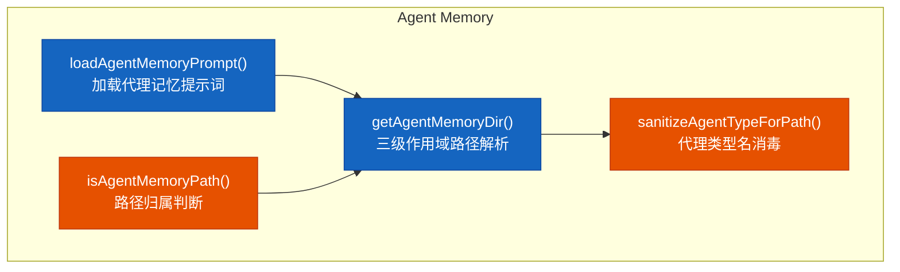
```mermaid
flowchart TD
    classDef core fill:#1565c0,stroke:#0d47a1,color:#fff
    classDef helper fill:#e65100,stroke:#bf360c,color:#fff

    subgraph AgentMem["Agent Memory"]
        GetDir["getAgentMemoryDir()<br/>三级作用域路径解析"]
        LoadPrompt["loadAgentMemoryPrompt()<br/>加载代理记忆提示词"]
        IsPath["isAgentMemoryPath()<br/>路径归属判断"]
        Sanitize["sanitizeAgentTypeForPath()<br/>代理类型名消毒"]
    end

    class GetDir,LoadPrompt core
    class IsPath,Sanitize helper

    GetDir --> Sanitize
    LoadPrompt --> GetDir
    IsPath --> GetDir
```

**Component 图解释：**

Agent Memory 是 memdir 的垂直扩展，为自定义代理提供独立的记忆空间。与 Auto Memory 的"单目录 + 可选 team 子目录"不同，Agent Memory 支持三级作用域：`user`（跨项目）、`project`（项目内、可提交到 VCS）、`local`（项目内、不提交）。`sanitizeAgentTypeForPath()` 将代理类型名中的冒号替换为连字符（如 `my-plugin:my-agent` → `my-plugin-my-agent`），因为冒号在 Windows 路径中非法，且插件命名空间使用冒号分隔。`loadAgentMemoryPrompt()` 使用 `buildMemoryPrompt()` 而非 `buildMemoryLines()`，因为代理记忆没有独立的 `getClaudeMds()` 等价物——内容必须内联到提示词中。

#### 数据结构

```typescript
// 来自 tools/AgentTool/agentMemory.ts
export type AgentMemoryScope = 'user' | 'project' | 'local'

export function getAgentMemoryDir(agentType: string, scope: AgentMemoryScope): string
// 'user'  → {memoryBase}/agent-memory/{agentType}/
// 'project' → {cwd}/.claude/agent-memory/{agentType}/
// 'local'  → {cwd}/.claude/agent-memory-local/{agentType}/ (或 CCR 挂载路径)

export function isAgentMemoryPath(absolutePath: string): boolean
// 检查三种作用域路径 + CCR 远程路径
```

#### 存储与持久化

- 存储路径：三种作用域分别对应不同位置
- `ensureMemoryDirExists()` 通过 fire-and-forget 调用（`void ensureMemoryDirExists(memoryDir)`），因为 `loadAgentMemoryPrompt()` 在同步 `getSystemPrompt()` 回调中执行（由 React 渲染触发），不能 await
- 代理首次写入前会有完整的 API 往返时间，mkdir 通常在此之前完成；即使未完成，FileWriteTool 自身也会创建父目录

#### 与其他模块的交互

| 交互对象 | 交互方式 | 数据格式 | 触发条件 |
|----------|----------|----------|----------|
| memdir/memdir | 调用 | `buildMemoryPrompt()`, `ensureMemoryDirExists()` | 加载代理记忆时 |
| memdir/paths | 调用 | `getMemoryBaseDir()` | 解析 user scope 路径 |

### 5.4 Extract Memories 模块

#### C4 Component 图

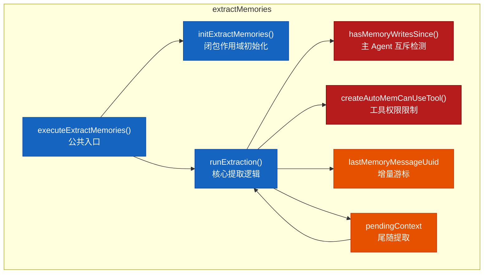
```mermaid
flowchart TD
    classDef core fill:#1565c0,stroke:#0d47a1,color:#fff
    classDef safety fill:#b71c1c,stroke:#7f0000,color:#fff
    classDef state fill:#e65100,stroke:#bf360c,color:#fff

    subgraph ExtractMem["extractMemories"]
        Init["initExtractMemories()<br/>闭包作用域初始化"]
        Execute["executeExtractMemories()<br/>公共入口"]
        Run["runExtraction()<br/>核心提取逻辑"]
        Mutex["hasMemoryWritesSince()<br/>主 Agent 互斥检测"]
        CanUse["createAutoMemCanUseTool()<br/>工具权限限制"]
        Cursor["lastMemoryMessageUuid<br/>增量游标"]
        Trailing["pendingContext<br/>尾随提取"]
    end

    class Init,Execute,Run core
    class Mutex,CanUse safety
    class Cursor,Trailing state

    Execute --> Init
    Execute --> Run
    Run --> Mutex
    Run --> CanUse
    Run --> Cursor
    Run --> Trailing
    Trailing --> Run
```

**Component 图解释：**

Extract Memories 采用"闭包作用域 + 尾随合并"模式。`initExtractMemories()` 创建闭包捕获所有可变状态（游标、互斥标志、待处理上下文），而非使用模块级变量——这使得测试可以在 `beforeEach` 中获得全新闭包。`runExtraction()` 是核心逻辑，包含五重门控：特性开关（`tengu_passport_quail`）→ 非 Agent 线程检查 → Auto Memory 启用检查 → 非远程模式检查 → 主 Agent 写入互斥。`createAutoMemCanUseTool()` 创建权限函数，限制 forkedAgent 只能使用 Read/Grep/Glob（无限制）、只读 Bash、以及记忆目录内的 Edit/Write——这是一个沙箱，防止后台代理修改项目代码或执行危险命令。尾随提取机制：当提取正在进行时新请求到达，将最新上下文暂存到 `pendingContext`，当前提取完成后自动运行一轮尾随提取处理暂存内容，确保不丢失任何消息。

#### 数据结构

```typescript
// 来自 services/extractMemories/extractMemories.ts（闭包内部状态）
// lastMemoryMessageUuid: string | undefined  — 上次处理的最后消息 UUID
// inProgress: boolean                         — 是否正在提取中
// turnsSinceLastExtraction: number            — 自上次提取以来的轮次数
// pendingContext: { context, appendSystemMessage } | undefined  — 暂存的待处理上下文
// inFlightExtractions: Set<Promise<void>>     — 正在进行的提取 Promise 集合

// 来自 services/extractMemories/extractMemories.ts
export function createAutoMemCanUseTool(memoryDir: string): CanUseToolFn
// 允许：Read, Grep, Glob, REPL, 只读 Bash, 记忆目录内 Edit/Write
// 拒绝：MCP, Agent, 写入 Bash, 记忆目录外 Edit/Write
```

#### 存储与持久化

- 无独立持久化状态，所有可变状态在闭包内
- 游标 `lastMemoryMessageUuid` 是内存态，会话重启后重置
- 提取结果写入 Auto Memory 目录（主题文件 + MEMORY.md 更新）
- `drainPendingExtraction(timeoutMs=60000)` 确保进程退出前提取完成

#### 模块内部时序图

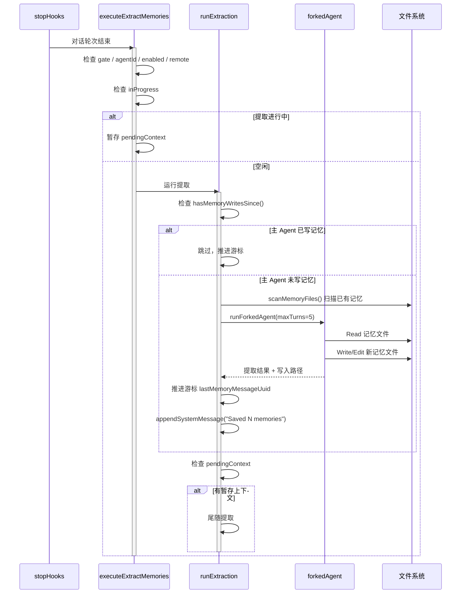
```mermaid
sequenceDiagram
    participant Hook as stopHooks
    participant Exec as executeExtractMemories
    participant Run as runExtraction
    participant Fork as forkedAgent
    participant FS as 文件系统

    Hook->>Exec: 对话轮次结束
    activate Exec
    Exec->>Exec: 检查 gate / agentId / enabled / remote
    Exec->>Exec: 检查 inProgress
    alt 提取进行中
        Exec->>Exec: 暂存 pendingContext
    else 空闲
        Exec->>Run: 运行提取
        activate Run
        Run->>Run: 检查 hasMemoryWritesSince()
        alt 主 Agent 已写记忆
            Run->>Run: 跳过，推进游标
        else 主 Agent 未写记忆
            Run->>FS: scanMemoryFiles() 扫描已有记忆
            Run->>Fork: runForkedAgent(maxTurns=5)
            Fork->>FS: Read 记忆文件
            Fork->>FS: Write/Edit 新记忆文件
            Fork-->>Run: 提取结果 + 写入路径
            Run->>Run: 推进游标 lastMemoryMessageUuid
            Run->>Run: appendSystemMessage("Saved N memories")
        end
        Run->>Run: 检查 pendingContext
        alt 有暂存上下文
            Run->>Run: 尾随提取
        end
        deactivate Run
    end
    deactivate Exec
```

**模块内部时序解释：**

提取流程是"门控 → 互斥 → 扫描 → 提取 → 尾随"的管道。`executeExtractMemories()` 首先做快速失败检查（gate、agentId、enabled、remote、inProgress），任何一项不通过立即返回。如果提取正在进行，将当前上下文暂存到 `pendingContext`（覆盖旧的，因为最新的消息最多）。`runExtraction()` 的核心互斥检查 `hasMemoryWritesSince()` 遍历自上次游标以来的所有 assistant 消息，检测 Edit/Write 工具调用是否指向记忆目录——如果是则跳过并推进游标。提取通过 `runForkedAgent()` 启动受限代理（maxTurns=5，防止无限循环），代理共享主对话的提示词缓存（cacheSafeParams），但只能写入记忆目录。提取完成后，如果有暂存上下文，自动运行尾随提取——游标已推进，所以尾随提取只处理两次调用之间的增量消息。

#### 与其他模块的交互

| 交互对象 | 交互方式 | 数据格式 | 触发条件 |
|----------|----------|----------|----------|
| memdir/memoryScan | 调用 | `scanMemoryFiles()`, `formatMemoryManifest()` | 预注入已有记忆列表 |
| memdir/paths | 调用 | `getAutoMemPath()`, `isAutoMemPath()`, `isAutoMemoryEnabled()` | 路径解析、权限检查 |
| utils/forkedAgent | 调用 | `runForkedAgent()`, `createCacheSafeParams()` | 后台提取 |
| services/autoDream | 共享 | `createAutoMemCanUseTool()` | autoDream 复用同一权限函数 |

### 5.5 Auto Dream 模块

#### C4 Component 图

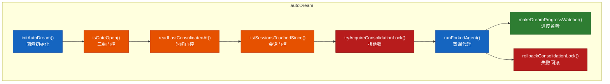
```mermaid
flowchart TD
    classDef core fill:#1565c0,stroke:#0d47a1,color:#fff
    classDef gate fill:#e65100,stroke:#bf360c,color:#fff
    classDef safety fill:#b71c1c,stroke:#7f0000,color:#fff
    classDef helper fill:#2e7d32,stroke:#1b5e20,color:#fff

    subgraph AutoDream["autoDream"]
        InitDream["initAutoDream()<br/>闭包初始化"]
        GateCheck["isGateOpen()<br/>三重门控"]
        TimeGate["readLastConsolidatedAt()<br/>时间门控"]
        SessionGate["listSessionsTouchedSince()<br/>会话门控"]
        Lock["tryAcquireConsolidationLock()<br/>排他锁"]
        Fork["runForkedAgent()<br/>蒸馏代理"]
        Progress["makeDreamProgressWatcher()<br/>进度监听"]
        Rollback["rollbackConsolidationLock()<br/>失败回滚"]
    end

    class InitDream,Fork core
    class GateCheck,TimeGate,SessionGate gate
    class Lock,Rollback safety
    class Progress helper

    InitDream --> GateCheck
    GateCheck --> TimeGate
    TimeGate --> SessionGate
    SessionGate --> Lock
    Lock --> Fork
    Fork --> Progress
    Fork --> Rollback
```

**Component 图解释：**

Auto Dream 的核心设计是"多层门控 + 锁 + 回滚"。三重门控按代价递增排列：时间门控（一次 stat，检查距上次整合是否 >= 24 小时）→ 扫描节流（10 分钟内不重复扫描）→ 会话门控（readdir + mtime 过滤，检查是否有 >= 5 个新会话）。门控通过后，`tryAcquireConsolidationLock()` 获取排他锁（通过更新锁文件 mtime 实现文件锁），防止多个 Claude Code 实例同时蒸馏。蒸馏代理使用 `buildConsolidationPrompt()` 构建四阶段提示词（Orient → Gather → Consolidate → Prune and index），限制 Bash 为只读命令。失败时 `rollbackConsolidationLock()` 将锁文件 mtime 回退到之前值，使时间门控重新通过（扫描节流作为退避）。`makeDreamProgressWatcher()` 监听代理消息，提取 Edit/Write 的文件路径用于进度展示和完成通知。

#### 数据结构

```typescript
// 来自 services/autoDream/autoDream.ts
type AutoDreamConfig = {
  minHours: number    // 默认 24，距上次整合的最小小时数
  minSessions: number // 默认 5，最小新会话数
}

// 来自 services/autoDream/consolidationPrompt.ts
export function buildConsolidationPrompt(
  memoryRoot: string,     // 记忆目录路径
  transcriptDir: string,  // 会话记录目录
  extra: string           // 额外上下文（工具限制、会话列表）
): string  // 返回四阶段蒸馏提示词
```

#### 存储与持久化

- 锁文件：`consolidationLock`（文件锁，通过 mtime 实现）
- `lastConsolidatedAt`：从锁文件 mtime 读取
- 会话列表：`listSessionsTouchedSince(lastAt)` 扫描项目目录下的 JSONL 文件
- 蒸馏结果写入 Auto Memory 目录（更新/合并/删除记忆文件 + 压缩 MEMORY.md 索引）
- DreamTask 状态：通过 `registerDreamTask()`/`completeDreamTask()`/`failDreamTask()` 管理 UI 展示

#### 模块内部时序图

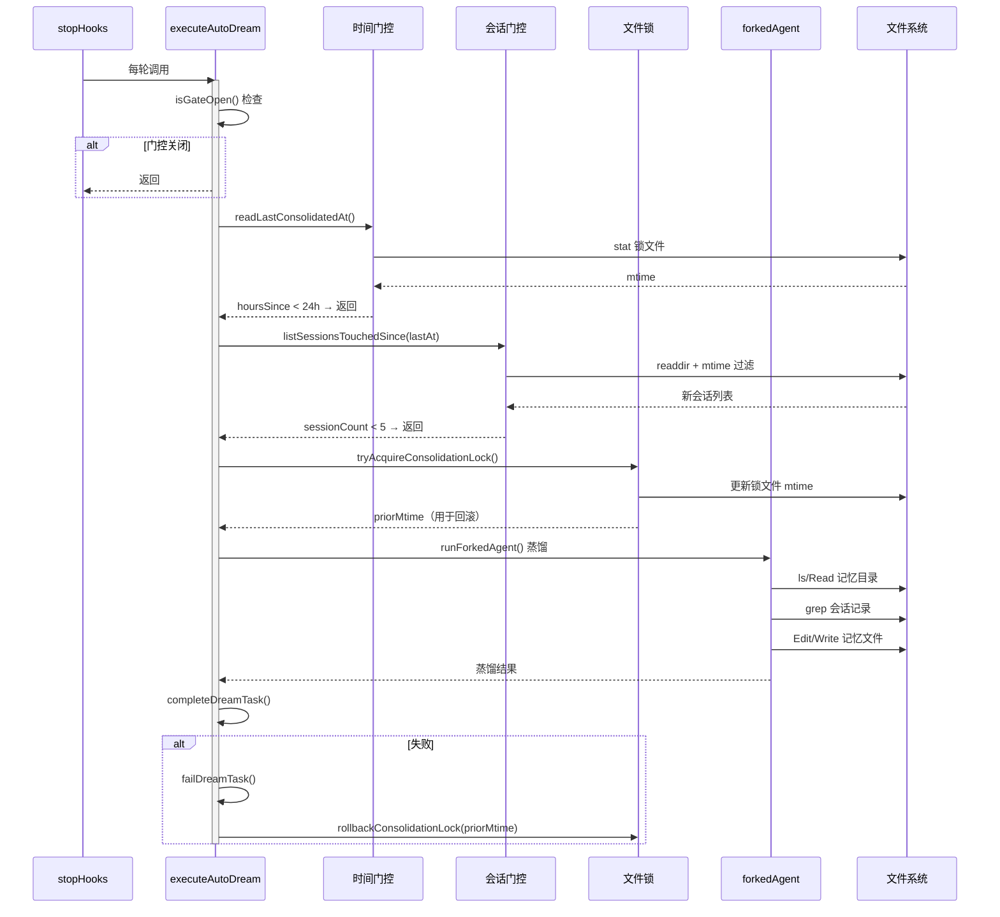
```mermaid
sequenceDiagram
    participant Hook as stopHooks
    participant Dream as executeAutoDream
    participant Time as 时间门控
    participant Session as 会话门控
    participant Lock as 文件锁
    participant Fork as forkedAgent
    participant FS as 文件系统

    Hook->>Dream: 每轮调用
    activate Dream
    Dream->>Dream: isGateOpen() 检查
    alt 门控关闭
        Dream-->>Hook: 返回
    end
    Dream->>Time: readLastConsolidatedAt()
    Time->>FS: stat 锁文件
    FS-->>Time: mtime
    Time-->>Dream: hoursSince < 24h → 返回
    Dream->>Session: listSessionsTouchedSince(lastAt)
    Session->>FS: readdir + mtime 过滤
    FS-->>Session: 新会话列表
    Session-->>Dream: sessionCount < 5 → 返回
    Dream->>Lock: tryAcquireConsolidationLock()
    Lock->>FS: 更新锁文件 mtime
    Lock-->>Dream: priorMtime（用于回滚）
    Dream->>Fork: runForkedAgent() 蒸馏
    Fork->>FS: ls/Read 记忆目录
    Fork->>FS: grep 会话记录
    Fork->>FS: Edit/Write 记忆文件
    Fork-->>Dream: 蒸馏结果
    Dream->>Dream: completeDreamTask()
    alt 失败
        Dream->>Dream: failDreamTask()
        Dream->>Lock: rollbackConsolidationLock(priorMtime)
    end
    deactivate Dream
```

**模块内部时序解释：**

Auto Dream 的设计哲学是"每轮只花最少的代价做最多的排除"。时间门控只需一次 stat 系统调用；扫描节流（10 分钟间隔）防止时间门控通过后的每轮重复扫描；会话门控需要 readdir + N 次 stat，但只在时间门控通过后执行。三层门控确保 99%+ 的轮次在 1ms 内返回。锁机制基于文件 mtime 而非 fcntl/flock，因为多进程间需要跨进程可见——`tryAcquireConsolidationLock()` 将锁文件 mtime 更新为当前时间，其他进程检查 mtime 时发现时间差 < minHours 即认为锁被持有。失败时回滚 mtime 到之前值，确保下一轮时间门控重新通过。蒸馏代理的限制比 extractMemories 更严格：Bash 限制为只读命令（连 `ls`/`find`/`grep` 等只读命令也做了白名单），而 extractMemories 允许任意只读 Bash。

#### 与其他模块的交互

| 交互对象 | 交互方式 | 数据格式 | 触发条件 |
|----------|----------|----------|----------|
| extractMemories | 共享 | `createAutoMemCanUseTool()` | 复用权限沙箱函数 |
| memdir/paths | 调用 | `getAutoMemPath()`, `isAutoMemoryEnabled()` | 路径解析 |
| consolidationLock | 调用 | `readLastConsolidatedAt()`, `tryAcquireConsolidationLock()`, `rollbackConsolidationLock()` | 排他控制 |
| DreamTask | 调用 | `registerDreamTask()`, `addDreamTurn()`, `completeDreamTask()` | UI 进度展示 |

### 5.6 Session Memory 模块

#### C4 Component 图

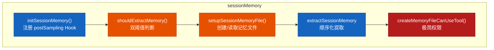
```mermaid
flowchart TD
    classDef core fill:#1565c0,stroke:#0d47a1,color:#fff
    classDef helper fill:#e65100,stroke:#bf360c,color:#fff
    classDef safety fill:#b71c1c,stroke:#7f0000,color:#fff

    subgraph SessionMem["sessionMemory"]
        InitSM["initSessionMemory()<br/>注册 postSampling Hook"]
        ShouldExtract["shouldExtractMemory()<br/>双阈值判断"]
        SetupFile["setupSessionMemoryFile()<br/>创建/读取记忆文件"]
        ExtractSM["extractSessionMemory<br/>顺序化提取"]
        CanUseSM["createMemoryFileCanUseTool()<br/>极简权限"]
    end

    class InitSM,ExtractSM core
    class ShouldExtract,SetupFile helper
    class CanUseSM safety

    InitSM --> ShouldExtract
    ShouldExtract --> SetupFile
    SetupFile --> ExtractSM
    ExtractSM --> CanUseSM
```

**Component 图解释：**

Session Memory 是最轻量的记忆子系统，与 Auto Memory 的核心区别在于：它只维护当前会话的笔记（一个 Markdown 文件），且只允许 Edit 该文件（不能创建新文件、不能写其他路径）。`shouldExtractMemory()` 采用双阈值触发：令牌阈值（`minimumTokensBetweenUpdate`，衡量上下文窗口增长量）+ 工具调用阈值（`toolCallsBetweenUpdates`），两者同时满足或令牌阈值满足且最后助手消息无工具调用时触发。`createMemoryFileCanUseTool()` 创建极简权限函数——只允许对单个记忆文件执行 Edit，比 extractMemories 的权限更严格。`extractSessionMemory` 通过 `sequential()` 包装确保串行执行，避免并发提取。

#### 数据结构

```typescript
// 来自 services/SessionMemory/sessionMemory.ts
// 无独立类型导出，核心状态在 sessionMemoryUtils.ts 中

// 来自 services/SessionMemory/sessionMemoryUtils.ts
export type SessionMemoryConfig = {
  minimumMessageTokensToInit: number    // 初始化令牌阈值
  minimumTokensBetweenUpdate: number    // 更新间最小令牌增量
  toolCallsBetweenUpdates: number       // 更新间最小工具调用数
}

export const DEFAULT_SESSION_MEMORY_CONFIG: SessionMemoryConfig = {
  // 具体默认值从 GrowthBook tengu_sm_config 远程配置
}
```

#### 存储与持久化

- 存储路径：`getSessionMemoryPath()` 返回的文件路径
- 文件创建：`writeFile(memoryPath, '', { flag: 'wx' })` 原子创建（O_CREAT|O_EXCL），EEXIST 被捕获
- 模板加载：首次创建后加载 `loadSessionMemoryTemplate()`
- 权限：目录 `0o700`，文件 `0o600`

#### 模块内部时序图

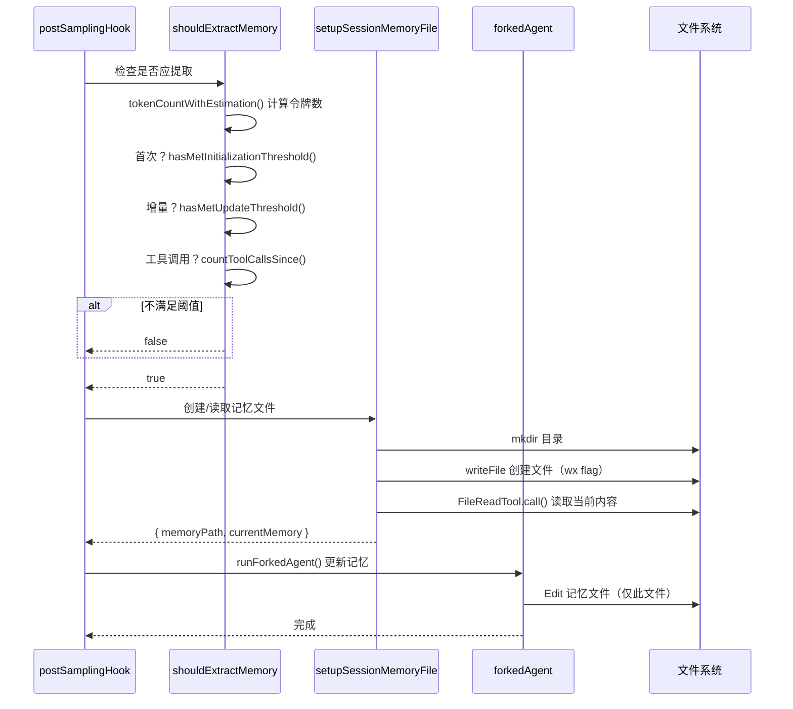
```mermaid
sequenceDiagram
    participant Hook as postSamplingHook
    participant Should as shouldExtractMemory
    participant Setup as setupSessionMemoryFile
    participant Fork as forkedAgent
    participant FS as 文件系统

    Hook->>Should: 检查是否应提取
    Should->>Should: tokenCountWithEstimation() 计算令牌数
    Should->>Should: 首次？hasMetInitializationThreshold()
    Should->>Should: 增量？hasMetUpdateThreshold()
    Should->>Should: 工具调用？countToolCallsSince()
    alt 不满足阈值
        Should-->>Hook: false
    end
    Should-->>Hook: true
    Hook->>Setup: 创建/读取记忆文件
    Setup->>FS: mkdir 目录
    Setup->>FS: writeFile 创建文件（wx flag）
    Setup->>FS: FileReadTool.call() 读取当前内容
    Setup-->>Hook: { memoryPath, currentMemory }
    Hook->>Fork: runForkedAgent() 更新记忆
    Fork->>FS: Edit 记忆文件（仅此文件）
    Fork-->>Hook: 完成
```

**模块内部时序解释：**

Session Memory 的设计哲学是"最小化干扰"。postSampling Hook 在每次采样后检查是否应提取，但 99%+ 的检查在双阈值判断中快速返回 false。令牌阈值使用上下文窗口增长量（而非消息数），与 autocompact 使用同一度量——这保证了两者行为的一致性。`setupSessionMemoryFile()` 先创建目录和文件（幂等操作），再通过 FileReadTool 读取当前内容——需要清除 readFileState 缓存（`toolUseContext.readFileState.delete(memoryPath)`）以获取最新内容而非缓存命中。forkedAgent 只能 Edit 单个文件，这比 extractMemories 的"记忆目录内自由读写"更受限——因为 Session Memory 的内容是单文件笔记而非结构化的主题文件集合。

#### 与其他模块的交互

| 交互对象 | 交互方式 | 数据格式 | 触发条件 |
|----------|----------|----------|----------|
| postSamplingHooks | 注册 | `registerPostSamplingHook(extractSessionMemory)` | initSessionMemory() 调用时 |
| compact | 依赖 | `isAutoCompactEnabled()` | Session Memory 仅在 autocompact 启用时激活 |
| utils/forkedAgent | 调用 | `runForkedAgent()` | 后台提取 |

### 5.7 CLAUDE.md 指令加载模块

#### C4 Component 图

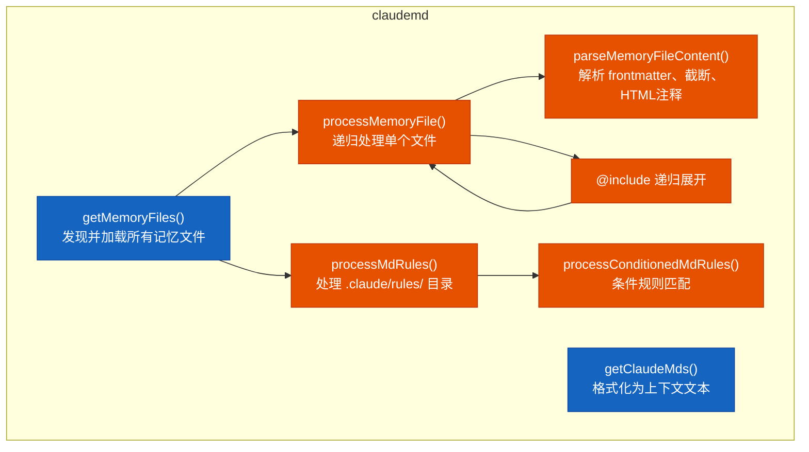
```mermaid
flowchart TD
    classDef core fill:#1565c0,stroke:#0d47a1,color:#fff
    classDef helper fill:#e65100,stroke:#bf360c,color:#fff
    classDef entry fill:#2e7d32,stroke:#1b5e20,color:#fff

    subgraph ClaudeMd["claudemd"]
        GetMemFiles["getMemoryFiles()<br/>发现并加载所有记忆文件"]
        GetClaudeMds["getClaudeMds()<br/>格式化为上下文文本"]
        ProcessFile["processMemoryFile()<br/>递归处理单个文件"]
        ProcessRules["processMdRules()<br/>处理 .claude/rules/ 目录"]
        Parse["parseMemoryFileContent()<br/>解析 frontmatter、截断、HTML注释"]
        Include["@include 递归展开"]
        Conditional["processConditionedMdRules()<br/>条件规则匹配"]
    end

    class GetMemFiles,GetClaudeMds core
    class ProcessFile,ProcessRules,Parse,Include,Conditional helper

    GetMemFiles --> ProcessFile
    GetMemFiles --> ProcessRules
    ProcessFile --> Parse
    ProcessFile --> Include
    ProcessRules --> Conditional
    Include --> ProcessFile
```

**Component 图解释：**

CLAUDE.md 模块是记忆系统的"最后一公里"——将磁盘上的记忆文件转换为注入对话上下文的文本。`getMemoryFiles()` 是核心入口，按优先级从低到高加载六类文件：Managed（全局策略）→ User（用户全局）→ Project（项目级，从 CWD 向上遍历到 root）→ Local（项目本地，同上遍历）→ AutoMem（MEMORY.md 入口）→ TeamMem（团队 MEMORY.md）。加载顺序反向对应优先级：后加载的文件内容被模型赋予更高权重。`processMemoryFile()` 处理单个文件，包括 frontmatter 解析（提取 `paths` 条件规则）、HTML 注释剥离（`stripHtmlComments()`）、`@include` 递归展开（深度上限 5 层）、MEMORY.md 截断。`processMdRules()` 处理 `.claude/rules/` 目录，区分无条件规则（每次加载）和条件规则（仅在匹配的文件路径时加载）。`isClaudeMdExcluded()` 支持通过 `claudeMdExcludes` 设置排除特定文件。

#### 数据结构

```typescript
// 来自 utils/claudemd.ts
export type MemoryFileInfo = {
  path: string              // 文件绝对路径
  type: MemoryType          // 'Managed' | 'User' | 'Project' | 'Local' | 'AutoMem' | 'TeamMem'
  content: string           // 处理后的内容（可能截断/去 frontmatter/去 HTML 注释）
  parent?: string           // @include 引用者的路径
  globs?: string[]          // frontmatter paths 条件匹配模式
  contentDiffersFromDisk?: boolean  // 内容是否经过转换（截断/去注释等）
  rawContent?: string       // 未处理的磁盘原始内容
}

export const MAX_MEMORY_CHARACTER_COUNT = 40000  // 单文件推荐最大字符数

// 来自 utils/memory/types.ts
// MemoryType = 'Managed' | 'User' | 'Project' | 'Local' | 'AutoMem' | 'TeamMem'
```

#### 存储与持久化

- 缓存策略：`getMemoryFiles()` 使用 lodash `memoize` 缓存扫描结果
- 缓存失效：
  - `clearMemoryFileCaches()`：纯正确性失效，不触发 InstructionsLoaded Hook
  - `resetGetMemoryFilesCache(reason)`：语义性失效，触发 Hook（compact 后重载）
- 文件发现：从 CWD 向上遍历到 root，每个目录尝试 CLAUDE.md、.claude/CLAUDE.md、.claude/rules/*.md
- Worktree 特殊处理：嵌套在主 repo 内的 worktree 跳过主 repo 的 Project 类型文件，避免重复加载
- 附加目录：`CLAUDE_CODE_ADDITIONAL_DIRECTORIES_CLAUDE_MD` 启用 `--add-dir` 目录的 CLAUDE.md 加载

#### 模块内部时序图

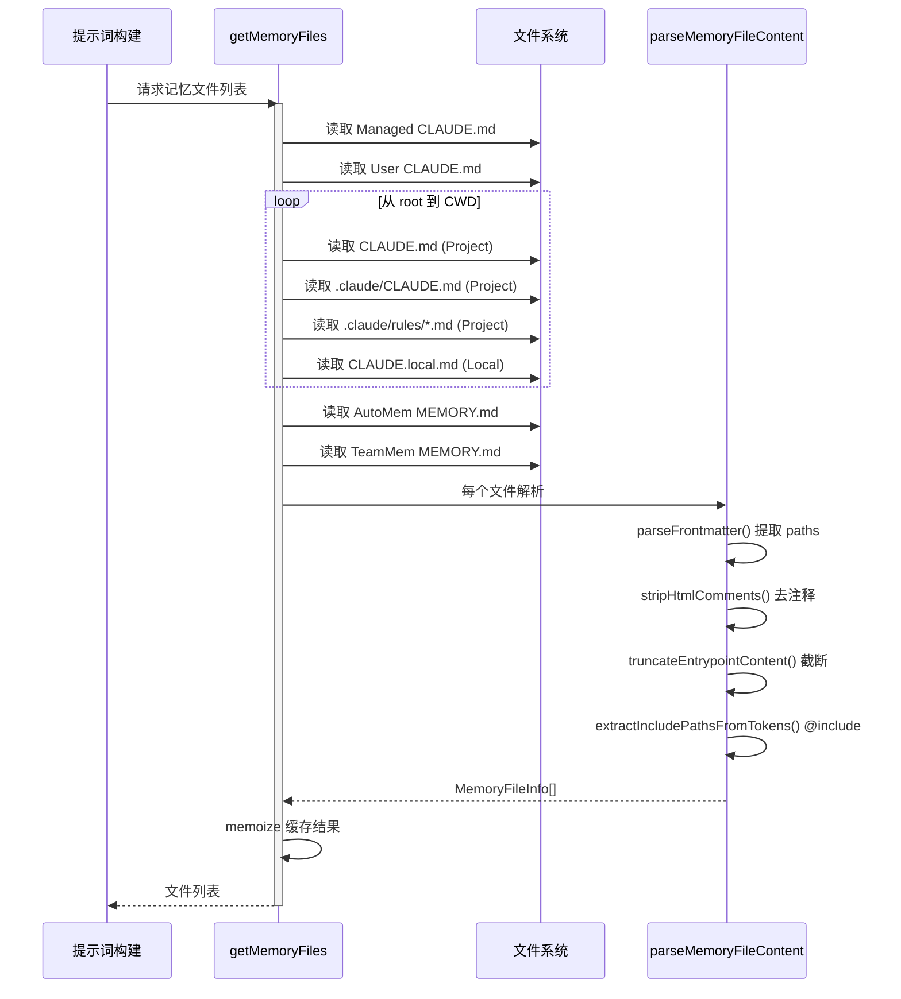
```mermaid
sequenceDiagram
    participant Builder as 提示词构建
    participant Get as getMemoryFiles
    participant FS as 文件系统
    participant Parse as parseMemoryFileContent

    Builder->>Get: 请求记忆文件列表
    activate Get
    Get->>FS: 读取 Managed CLAUDE.md
    Get->>FS: 读取 User CLAUDE.md
    loop 从 root 到 CWD
        Get->>FS: 读取 CLAUDE.md (Project)
        Get->>FS: 读取 .claude/CLAUDE.md (Project)
        Get->>FS: 读取 .claude/rules/*.md (Project)
        Get->>FS: 读取 CLAUDE.local.md (Local)
    end
    Get->>FS: 读取 AutoMem MEMORY.md
    Get->>FS: 读取 TeamMem MEMORY.md
    Get->>Parse: 每个文件解析
    Parse->>Parse: parseFrontmatter() 提取 paths
    Parse->>Parse: stripHtmlComments() 去注释
    Parse->>Parse: truncateEntrypointContent() 截断
    Parse->>Parse: extractIncludePathsFromTokens() @include
    Parse-->>Get: MemoryFileInfo[]
    Get->>Get: memoize 缓存结果
    Get-->>Builder: 文件列表
    deactivate Get
```

**模块内部时序解释：**

CLAUDE.md 加载的核心是"有序遍历 + 去重 + 缓存"。文件按优先级从低到高加载，`processedPaths` Set 确保同一文件不被重复处理（路径通过 `normalizePathForComparison()` 标准化，处理 Windows 驱动器大小写差异）。symlink 解析后，真实路径也被加入 Set 防止 symlink 导致的重复。`parseMemoryFileContent()` 是纯函数（无 I/O），对读取的原始内容做三步转换：frontmatter 剥离（保留 `paths` 条件规则）、HTML 注释剥离（仅块级，保留代码块内的注释）、MEMORY.md 截断（仅 AutoMem/TeamMem 类型）。`@include` 通过 marked lexer 预分词提取路径，深度限制 5 层，循环引用通过 `processedPaths` 防止。memoize 缓存以 `forceIncludeExternal` 参数为 key，外部审批检查（`getExternalClaudeMdIncludes`）使用 `true` 触发独立缓存行。

#### 与其他模块的交互

| 交互对象 | 交互方式 | 数据格式 | 触发条件 |
|----------|----------|----------|----------|
| memdir/memdir | 调用 | `truncateEntrypointContent()` | 处理 AutoMem/TeamMem 文件 |
| memdir/paths | 调用 | `getAutoMemEntrypoint()`, `isAutoMemoryEnabled()` | 加载 MEMORY.md |
| teamMemPaths | 调用 | `getTeamMemEntrypoint()`, `isTeamMemoryEnabled()` | 加载团队 MEMORY.md |
| compact | 被调用 | `resetGetMemoryFilesCache('compact')` | 压缩后重载 |
| /memory 命令 | 被调用 | `clearMemoryFileCaches()`, `getMemoryFiles()` | 记忆编辑后刷新 |

---

## 六、设计原理与对比分析

### 设计取舍

| # | 当前方案 | 替代方案 | 当前方案优势 | 替代方案优势 | 选择理由 |
|---|----------|----------|-------------|-------------|----------|
| 1 | 文件驱动（Markdown 文件 + 磁盘 I/O） | 数据库驱动（SQLite/LevelDB） | 人类可读/可编辑、VCS 可追踪、零依赖、调试简单 | 索引查询快 O(1)、事务保证、节省 ~200 次 stat/scan 开销 | 记忆文件数上限 200 个，scan 开销可接受（<50ms）；用户可直接 `$EDITOR` 修改记忆；与 CLAUDE.md 生态一致（也是 Markdown 文件）；跨会话时文件系统是最小公共依赖 |
| 2 | MEMORY.md 索引 + 主题文件二级结构 | 单文件全量记忆（类似 sessionMemory） | 主题文件可独立更新、索引 O(1) 浏览、并行读写安全 | 实现简单、无索引一致性维护、无截断问题 | 索引行 200 行限制下可引用 ~200 个主题文件，足够覆盖常见项目；二级结构使 extractMemories 可并行写不同文件而不冲突；代价是双步保存（步骤一写主题，步骤二更新索引），但 eval 验证索引对召回率至关重要 |
| 3 | 主 Agent + extractMemories 互斥写 | 仅依赖 extractMemories 后台提取 | 主 Agent 记忆质量高（有完整对话上下文）、用户指令即时响应 | 实现简单、无互斥逻辑、无游标管理 | 主 Agent 的系统提示词包含完整保存指南，其保存决策基于完整对话上下文（前后文 + 用户意图），质量显著高于后台代理（只看最近 N 条消息的有限上下文）。互斥逻辑 ~30 行代码，代价极低；主 Agent 写入时跳过提取，节省 API 调用（约 500-2000 tokens/提取） |
| 4 | realpathDeepestExisting 两阶段路径验证 | 仅 path.resolve() 字符串级验证 | 防御 symlink 逃逸攻击（PSR M22186） | 零文件系统 I/O、实现简单 | symlink 逃逸是实际攻击向量——攻击者可在 teamDir 内放置 `~/.ssh` 的 symlink，resolve() 看不到真实目标。realpathDeepestExisting 增加约 3-5 次文件系统调用（对不存在的尾部路径向上遍历），但仅在 teamMem 写入验证时触发（低频），延迟 <10ms |
| 5 | Closure-scoped 状态（非模块级变量） | 模块级全局状态 | 测试隔离（beforeEach 获得全新状态）、无测试间污染 | 代码更简洁、无需 init 函数 | extractMemories 和 autoDream 的测试需要完全隔离的可变状态（游标、互斥标志、暂存上下文）。模块级变量需要手动重置，遗漏任一变量会导致测试间污染和不可复现的测试失败。init 函数模式增加 ~5 行代码，但消除了整个类别的测试问题 |

### 系统间对比

| 对比维度 | Auto Memory (memdir) | Session Memory | Extract Memories | Auto Dream |
|----------|---------------------|----------------|------------------|------------|
| 生命周期 | 跨会话持久化 | 会话内临时 | 跨会话持久化（写入 memdir） | 跨会话持久化（更新 memdir） |
| 触发方式 | 主 Agent 主动写入 | postSampling Hook 自动 | stopHooks 自动 | stopHooks 自动（时间+会话门控） |
| 写入权限 | 记忆目录内任意文件 | 单文件 Edit | 记忆目录内任意文件 | 记忆目录内任意文件 + 只读 Bash |
| 内容结构 | 主题文件 + MEMORY.md 索引 | 单文件笔记 | 主题文件 + MEMORY.md 更新 | 主题文件合并/删除 + 索引压缩 |
| AI 代理 | 无（主 Agent 直接写） | forkedAgent（更新笔记） | forkedAgent（maxTurns=5） | forkedAgent（无 turn 限制，有 Bash 只读约束） |
| Token 预算 | MEMORY.md ≤25KB | 无硬限制（compact 时截断） | ~2000 tokens/提取 | 无硬限制 |

### 设计原则总结

1. **文件即记忆，读取即注入**：所有记忆以 Markdown 文件存储，通过将 MEMORY.md 注入系统提示词实现召回。这消除了数据库依赖，使用户可直接编辑，与 CLAUDE.md 生态保持一致。
2. **多时间尺度的自动化闭环**：即时写入（主 Agent）→ 轮次补漏（extractMemories）→ 会话笔记（sessionMemory）→ 跨会话蒸馏（autoDream），形成从秒级到天级的完整记忆生命周期。
3. **最小权限沙箱**：后台代理通过 `canUseTool` 函数限制为只读工具 + 记忆目录内写入，防止失控的 AI 代理修改项目代码或执行危险命令。
4. **渐进式门控**：每个自动化功能通过 GrowthBook 特性开关独立控制，支持灰度发布、即时回滚和 A/B 实验。门控检查使用缓存值（`getFeatureValue_CACHED_MAY_BE_STALE`），避免阻塞主循环。
5. **互斥写与游标推进**：主 Agent 与 extractMemories 采用互斥策略，主 Agent 写入时跳过提取，避免重复写入和文件冲突。游标推进确保增量处理，不重复扫描已处理的消息。

---

## 七、总结与索引

### 核心关系表

| 概念A | 关系 | 概念B |
|-------|------|-------|
| MEMORY.md | 索引指向 | 主题文件 (*.md) |
| 主 Agent | 直接写入 | 主题文件 + MEMORY.md |
| extractMemories | 互斥于 | 主 Agent 写入（同一轮次） |
| autoDream | 整合压缩 | 主题文件 + MEMORY.md |
| sessionMemory | 独立于 | Auto Memory（单文件 vs 主题文件集） |
| CLAUDE.md | 优先级低于 | AutoMem/TeamMem（后加载权重更高） |
| teamMem | 子目录于 | autoMem（team/ 在 memory/ 下） |
| agentMemory | 独立于 | autoMem（不同目录树） |
| findRelevantMemories | 按 query 筛选 | memoryScan 结果 |
| GrowthBook | 控制启停 | 所有自动化功能 |
| forkedAgent | 共享缓存 | 主对话（cacheSafeParams） |

### 设计原则

1. 文件即记忆，读取即注入——Markdown 文件 + 磁盘 I/O + 系统提示词注入
2. 多时间尺度自动化闭环——秒/轮/会话/天四级记忆生命周期
3. 最小权限沙箱——canUseTool 限制后台代理读写范围
4. 渐进式门控——GrowthBook 特性开关 + 缓存值非阻塞检查
5. 互斥写与游标推进——主 Agent 与后台代理互斥，增量处理

### 核心洞察

记忆系统的核心洞察是**"文件系统作为共享内存"**——利用 Markdown 文件的人类可读性和 Git 可追踪性，同时满足 AI 自动化写入和人类手动审查两个需求。四类型闭式分类法（user/feedback/project/reference）配合"不可从代码推导"的排除原则，精准地划定记忆边界，避免记忆膨胀为代码镜像。互斥写策略巧妙地将主 Agent 的高质量主动写入与后台代理的被动补漏统一为互补管道，而非竞争关系。

### 相关文件索引

| 文件路径 | 职责 |
|----------|------|
| `harness/claude-code/memdir/memdir.ts` | 记忆核心：提示词构建、入口截断、目录创建 |
| `harness/claude-code/memdir/memoryTypes.ts` | 四类型分类法、行为指南模板、frontmatter 格式 |
| `harness/claude-code/memdir/paths.ts` | 自动记忆路径解析、启停判断、路径验证 |
| `harness/claude-code/memdir/memoryScan.ts` | 记忆文件扫描、frontmatter 提取、manifest 格式化 |
| `harness/claude-code/memdir/findRelevantMemories.ts` | AI 相关性选择（Sonnet sideQuery） |
| `harness/claude-code/memdir/memoryAge.ts` | 记忆新鲜度计算和警告 |
| `harness/claude-code/memdir/teamMemPaths.ts` | 团队记忆路径、安全验证（两阶段+symlink检测） |
| `harness/claude-code/memdir/teamMemPrompts.ts` | 团队记忆提示词构建（双目录模式） |
| `harness/claude-code/tools/AgentTool/agentMemory.ts` | 代理记忆路径与加载（三级作用域） |
| `harness/claude-code/services/extractMemories/extractMemories.ts` | 后台记忆提取代理（闭包+互斥+尾随） |
| `harness/claude-code/services/extractMemories/prompts.ts` | 提取代理提示词（auto-only / combined） |
| `harness/claude-code/services/autoDream/autoDream.ts` | 跨会话蒸馏代理（多层门控+锁+回滚） |
| `harness/claude-code/services/autoDream/consolidationPrompt.ts` | 蒸馏代理提示词（四阶段：Orient→Gather→Consolidate→Prune） |
| `harness/claude-code/services/SessionMemory/sessionMemory.ts` | 会话内笔记（postSampling Hook + 双阈值） |
| `harness/claude-code/services/SessionMemory/prompts.ts` | 会话记忆提示词模板 |
| `harness/claude-code/services/SessionMemory/sessionMemoryUtils.ts` | 会话记忆配置与状态管理 |
| `harness/claude-code/utils/claudemd.ts` | CLAUDE.md 加载与上下文注入（六类文件 + @include + 条件规则） |
| `harness/claude-code/utils/memory/types.ts` | MemoryType 类型定义（Managed/User/Project/Local/AutoMem/TeamMem） |
| `harness/claude-code/utils/memoryFileDetection.ts` | 记忆文件路径检测工具 |
| `harness/claude-code/commands/memory/memory.tsx` | /memory CLI 命令（交互式记忆文件编辑） |
| `harness/claude-code/components/memory/MemoryFileSelector.tsx` | 记忆文件选择器 UI 组件 |
| `harness/claude-code/components/memory/MemoryUpdateNotification.tsx` | 记忆更新通知 UI 组件 |
| `harness/claude-code/services/compact/compact.ts` | 压缩系统（与记忆的交互：缓存重置、会话元数据重追加） |
| `harness/claude-code/services/compact/sessionMemoryCompact.ts` | 压缩时的会话记忆整合 |
