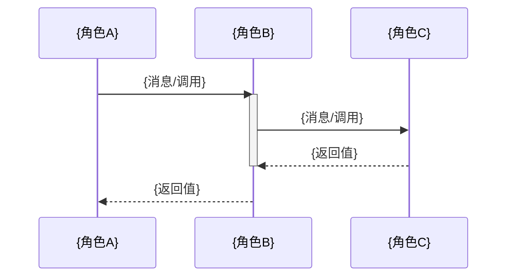

# 深度功能分析模板

> 本模板是 SKILL.md 的可填充版本。生成文档时，直接复制此模板，将 `{占位符}` 替换为实际内容，删除不适用章节并标注。

---

# {功能/机制名称} 深度解析

> 本文档基于代码分析，深入解析 {项目名} 中 {功能/机制名称} 的实现原理。

## 目录

- [一、概述](#一概述)
- [二、核心问题](#二核心问题)
- [三、完整生命周期](#三完整生命周期)
- [四、实现流程详解](#四实现流程详解)
- [五、关键技术机制](#五关键技术机制)
- [六、质量保障体系](#六质量保障体系)
- [七、对比分析](#七对比分析)
- [八、相关文件索引](#八相关文件索引)
- [九、总结](#九总结)

---

## 一、概述

{用 2-3 句话回答"这个功能/机制是什么、为什么重要"。}

### 功能定位

| 维度 | 说明 |
|------|------|
| 核心职责 | {一句话：功能/机制做什么} |
| 解决问题 | {一句话：解决什么具体问题} |
| 使用场景 | {一句话：在什么情况下被使用} |
| 核心文件 | {列出关键源码文件路径} |

---

## 二、核心问题：{核心问题描述}

### 问题与答案

| 问题 | 答案 | 证据 |
|------|------|------|
| {问题1} | {直接回答} | `{文件路径}` -> `{函数/类名}` |
| {问题2} | {直接回答} | `{文件路径}` -> `{函数/类名}` |
| {问题3} | {直接回答} | `{文件路径}` -> `{函数/类名}` |

> **填写指引**：至少提出 3 个核心问题，每个问题必须有直接回答和代码证据。

---

## 三、完整生命周期

{展示功能/机制的完整生命周期，包括初始化、运行、终止等阶段。}

```mermaid
stateDiagram-v2
    [*] --> {初始状态}
    {初始状态} --> {状态A} : {触发条件}
    {状态A} --> {状态B} : {触发条件}
    {状态A} --> {失败状态} : {异常条件}
    {状态B} --> {终态} : {触发条件}
    {失败状态} --> {初始状态} : {重试/恢复}
    {终态} --> [*]
```

**状态流转解释：**

1. 生命周期主线：{从创建到终结的主路径}
2. 状态语义：{每个状态的含义、驻留条件、退出条件}
3. 终态与异常态：{哪些是终态，哪些是异常态，如何区分}
4. 转移触发：{状态间流转的触发条件与副作用}
5. 恢复机制：{异常态如何恢复到可继续执行状态}

---

## 四、实现流程详解

{逐步深入讲解实现细节，配合时序图。}

### 4.1 {步骤1名称}

{用 2-3 段正文解释这一步的作用和机制。}



**时序解释：**

1. {时序的起点和触发条件}
2. {每个步骤的目的和数据转换}
3. {关键决策点和分支逻辑}
4. {失败时的处理路径}

### 4.2 {步骤2名称}

{同上结构}

---

## 五、关键技术机制

{识别 3 个以上关键技术点并深入讲解。}

### 5.1 {技术点1名称}

{用 3-5 段正文解释这个技术点的原理、作用和实现方式。}

```{语言标识}
// 来自 {文件路径}
{关键代码片段}
```

**关键实现细节：**

1. {实现细节1}
2. {实现细节2}
3. {实现细节3}

### 5.2 {技术点2名称}

{同上结构}

---

## 六、质量保障体系

{展示多层质量保障机制，包括检查点、回滚机制、边界条件等。}

```
┌─────────────────────────────────────────────────┐
│              质量保障体系总结                  │
├─────────────────────────────────────────────────┤
│                                                 │
│  第 1 层：{检查名称}                            │
│  ├─ {检查项1}                                  │
│  ├─ {检查项2}                                  │
│  └─ {检查项3}                                  │
│                                                 │
│  第 2 层：{检查名称}                            │
│  ├─ {检查项1}                                  │
│  ├─ {检查项2}                                  │
│  └─ {检查项3}                                  │
│                                                 │
│  第 3 层：{检查名称}                            │
│  ├─ {检查项1}                                  │
│  ├─ {检查项2}                                  │
│  └─ {检查项3}                                  │
│                                                 │
└─────────────────────────────────────────────────┘
```

**质量保障层说明：**

| 层级 | 名称 | 作用 | 触发时机 |
|------|------|------|----------|
| 1 | {名称1} | {作用} | {时机} |
| 2 | {名称2} | {作用} | {时机} |
| 3 | {名称3} | {作用} | {时机} |

---

## 七、对比分析

{与相似机制、外部系统、理想方案的对比。}

### 与相似机制对比

| 对比维度 | {机制A} | {机制B} |
|----------|---------|---------|
| {维度1} | {...} | {...} |
| {维度2} | {...} | {...} |

### 与理想方案对比

| 当前方案 | 理想方案 | 差距说明 |
|----------|----------|----------|
| {当前} | {理想} | {说明} |

---

## 八、相关文件索引

| 文件路径 | 职责 | 关键符号 |
|----------|------|----------|
| `{路径1}` | {职责说明} | `{函数/类名}` |
| `{路径2}` | {职责说明} | `{函数/类名}` |
| `{路径3}` | {职责说明} | `{函数/类名}` |

> **填写指引**：列出所有被分析到的源码文件，路径必须为项目中的真实路径。

---

## 九、总结

### 核心洞察

{用 2-3 句话总结这个功能/机制最核心的设计洞察——不是复述，而是提炼。}

### 关键要点

1. {要点1}
2. {要点2}
3. {要点3}

### 边界条件

- {条件1}：何时不成立
- {条件2}：残留风险
- {条件3}：假设前提