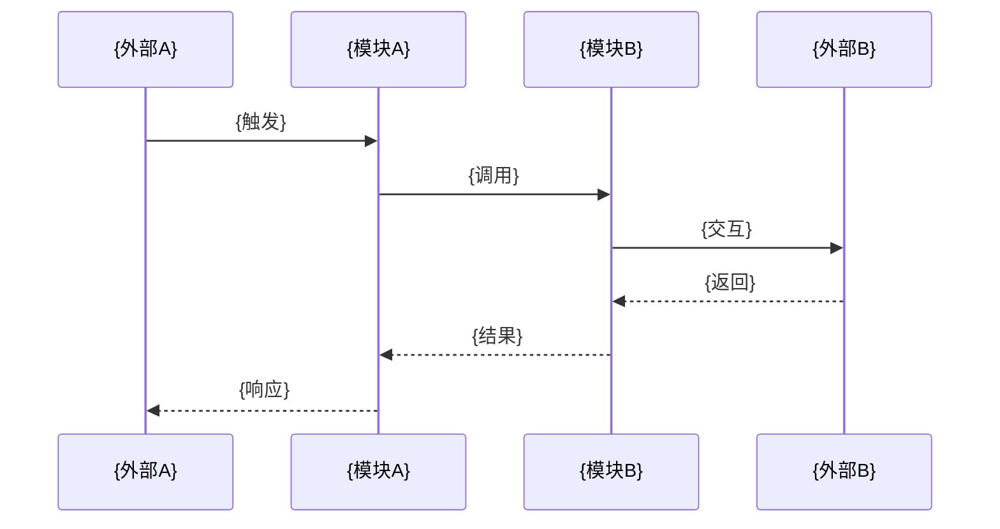
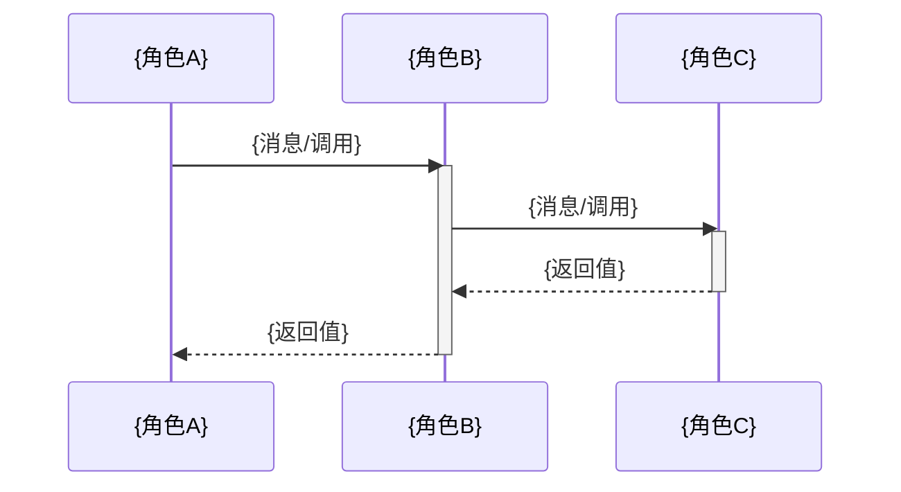
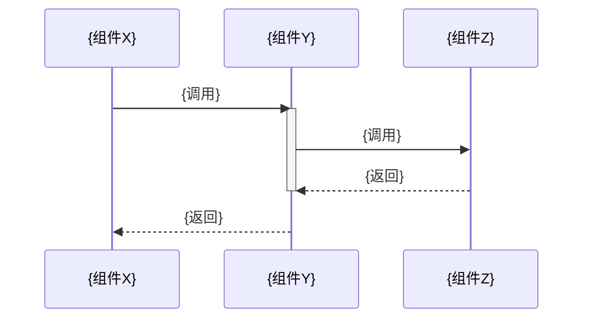

# 文章模板 — Deep Code Analysis

> 本模板是 SKILL.md 的可填充版本。生成文档时，直接复制此模板，将 `{占位符}` 替换为实际内容，删除不适用章节并标注。

---

# {系统名称} {系统性质一句话}

> 本文档基于代码分析，整理 {项目名} 中 {系统名称} 的完整设计。

## 目录

- [一、概述](#一概述)
- [二、核心概念](#二核心概念)
- [三、架构总览](#三架构总览)
  - [系统上下文（C4 Context）](#系统上下文c4-context)
  - [容器拆分（C4 Container）](#容器拆分c4-container)
  - [工作流概览](#工作流概览)
  - [各模块职责概述](#各模块职责概述)
- [四、核心工作流](#四核心工作流)
  - [核心工作流程](#核心工作流程)
  - [核心实体状态流转](#核心实体状态流转)
- [五、分模块详解](#五分模块详解)
  - [5.1 {模块A名称}](#51-模块a名称)
  - [5.2 {模块B名称}](#52-模块b名称)
  - {按实际模块数量增减}
- [六、设计原理与对比分析](#六设计原理与对比分析)
- [七、总结与索引](#七总结与索引)

---

## 一、概述

{用 2-3 句话回答"这个系统是什么、为什么存在"。}

### 系统定位

| 维度 | 说明 |
|------|------|
| 核心职责 | {一句话：系统做什么} |
| 系统性质 | {一句话：架构风格/模式，如"事件驱动扩展框架"} |
| 边界 | 上游：{谁驱动本系统}；下游：{本系统操作什么} |
| 使用方 | {谁使用本系统} |

### 与其他系统的关系总览

| 关联系统 | 关系 |
|----------|------|
| {系统A} | {交互方向和方式} |
| {系统B} | {...} |
| {系统C} | {...} |

> **填写指引**：至少列出 3 个关联系统。

---

## 二、核心概念

{为每个关键概念建一个小节，包含定义和类型签名。}

### {概念1名称}

{一句话定义。}

```{语言标识}
// 来自 {文件路径}
{类型定义或关键常量}
```

### {概念2名称}

{一句话定义。}

| 属性 | 说明 |
|------|------|
| {属性A} | {值/说明} |
| {属性B} | {值/说明} |

> **填写指引**：覆盖本系统所有关键抽象。每个概念至少含：名称、定义、类型/结构、与其他概念的关系。

---

## 三、架构总览

{从全局视角展示系统边界、模块拆分、与周边模块的交互。不深入模块实现。}

### 系统上下文（C4 Context）

{展示本系统与外部参与者/系统的边界关系。}

```mermaid
flowchart LR
    subgraph External["外部系统/参与者"]
        {参与者A}["{参与者A}: {角色}"]
        {参与者B}["{参与者B}: {角色}"]
    end

    subgraph Target["{系统名称}"]
        System["{系统名称}<br/>{核心职责}"]
    end

    {参与者A} -->|{交互方式}| System
    System -->|{交互方式}| {参与者B}
```

**Context 图解释：**

1. 驱动关系：{谁驱动本系统，触发方式是什么，频率如何}
2. 服务对象：{本系统主要为谁提供能力，输出结果是什么}
3. 外部交互：{与哪些外部系统发生数据/控制交互，交互方向是什么}
4. 边界划分：{哪些能力属于本系统边界内，哪些明确在边界外}

### 容器拆分（C4 Container）

{展示系统内部的模块拆分、各模块职责和模块间关系。}

```mermaid
flowchart TD
    subgraph {系统名称}["{系统名称}"]
        {模块A}["{模块A}<br/>{职责}"]
        {模块B}["{模块B}<br/>{职责}"]
        {模块C}["{模块C}<br/>{职责}"]
    end

    {模块A} --> {模块B}
    {模块A} --> {模块C}
    {模块B} --> {模块C}
```

**Container 图解释：**

1. 拆分依据：{为什么按当前方式拆分模块，拆分遵循什么原则}
2. 职责边界：{各模块分别负责什么，不负责什么}
3. 依赖与数据流：{模块间依赖关系和主要数据流向}
4. 核心与辅助：{哪些是核心模块，哪些是辅助模块，以及判定依据}

### 工作流概览

{展示本系统与周边模块的主要交互序列，给出系统整体工作流。}



**工作流概览解释：**

1. 起点：{从哪个外部触发开始，触发条件是什么}
2. 主路径：{依次经过哪些模块处理，每一步的目标是什么}
3. 外部交互点：{在哪些步骤与外部系统交互，输入输出分别是什么}
4. 终点：{最终输出给谁，输出形态是什么}

### 各模块职责概述

| 模块 | 核心职责 | 关键接口 | 依赖 |
|------|----------|----------|------|
| {模块A} | {...} | `{函数签名}` | {依赖的模块} |
| {模块B} | {...} | `{函数签名}` | {依赖的模块} |
| {模块C} | {...} | `{函数签名}` | {依赖的模块} |

---

## 四、核心工作流

{聚焦系统最核心的工作流程和实体状态流转。全局视角，不深入模块实现。}

### 核心工作流程

{展示系统最核心的工作流时序，包含正常流和异常流。}

#### 正常流：{工作流名称}



**正常流解释：**

1. 流程目标：{这条正常流要达成的业务/系统目标}
2. 步骤拆解：{每个关键步骤的目的与执行条件}
3. 数据变化：{数据在步骤间如何转换，关键字段如何演进}
4. 关键决策：{流程中的决策点及采用当前分支的原因}

#### 异常流：{异常场景}

{描述异常场景的触发条件、处理逻辑、恢复策略。}

**异常流解释：**

1. 触发条件：{在什么前置条件下进入该异常流}
2. 处理机制：{系统如何检测并处理该异常}
3. 恢复策略：{是否支持自动恢复/重试，恢复门槛是什么}
4. 影响范围：{对正常流、上下游系统、最终结果的影响}

### 核心实体状态流转

{展示核心实体的状态机。}

```mermaid
stateDiagram-v2
    [*] --> {初始状态}
    {初始状态} --> {状态A} : {触发条件}
    {状态A} --> {状态B} : {触发条件}
    {状态A} --> {失败状态} : {异常条件}
    {状态B} --> {终态} : {触发条件}
    {失败状态} --> {初始状态} : {重试/恢复}
    {终态} --> [*]
```

**状态流转解释：**

1. 生命周期主线：{从创建到终结的主路径}
2. 状态语义：{每个状态的含义、驻留条件、退出条件}
3. 终态与异常态：{哪些是终态，哪些是异常态，如何区分}
4. 转移触发：{状态间流转的触发条件与副作用}
5. 恢复机制：{异常态如何恢复到可继续执行状态}

#### 状态定义

| 状态 | 含义 | 是否终态 | 触发条件 |
|------|------|----------|----------|
| {初始状态} | {...} | 否 | {...} |
| {终态} | {...} | 是 | {...} |

---

## 五、分模块详解

{逐模块深入，每个模块使用 C4 Component 图和结构化解析。}

### 5.1 {模块A名称}

#### C4 Component 图

{展示模块内部的组件拆分和关系。}

```mermaid
flowchart TD
    subgraph {模块A}["{模块A名称}"]
        {组件X}["{组件X}: {职责}"]
        {组件Y}["{组件Y}: {职责}"]
        {组件Z}["{组件Z}: {职责}"]
    end

    {组件X} --> {组件Y}
    {组件Y} --> {组件Z}
```

**Component 图解释：**

1. {组件拆分逻辑：为什么这样分}
2. {核心组件是哪些，辅助组件是哪些}
3. {组件间的数据流向和依赖关系}
4. {关键设计决策}

#### 数据结构

```{语言标识}
// 来自 {文件路径}
{核心类型定义，包含字段注释}
```

#### 存储与持久化

- 存储路径：`{路径}`
- 内存 vs 磁盘：{说明}
- 读写时序：{说明}

#### 模块内部时序图

{展示模块内部组件间的交互时序。}



**模块内部时序解释：**

1. {时序的起点和触发条件}
2. {每个步骤的目的和数据转换}
3. {关键决策点和分支逻辑}
4. {失败时的处理路径}

#### 与其他模块的交互

| 交互对象 | 交互方式 | 数据格式 | 触发条件 |
|----------|----------|----------|----------|
| {模块B} | {函数调用/事件/消息} | {...} | {...} |
| {模块C} | {...} | {...} | {...} |

### 5.2 {模块B名称}

{同上结构}

---

## 六、设计原理与对比分析

{回答"为什么这样设计"，量化设计取舍。}

### 设计取舍

| # | 当前方案 | 替代方案 | 当前方案优势 | 替代方案优势 | 选择理由 |
|---|----------|----------|-------------|-------------|----------|
| 1 | {当前} | {替代} | {...} | {...} | {量化理由} |
| 2 | {当前} | {替代} | {...} | {...} | {量化理由} |
| 3 | {当前} | {替代} | {...} | {...} | {量化理由} |
| 4 | {当前} | {替代} | {...} | {...} | {量化理由} |

> **填写指引**：至少 4 组。量化 = 具体数字（如"节省 3 次 IPC"、"增加 200ms 延迟"）。

### 系统间对比

| 对比维度 | {系统A} | {系统B} |
|----------|---------|---------|
| {维度1} | {...} | {...} |
| {维度2} | {...} | {...} |

### 设计原则总结

1. {原则1}：{说明}
2. {原则2}：{说明}
3. {原则3}：{说明}

---

## 七、总结与索引

### 核心关系表

| 概念A | 关系 | 概念B |
|-------|------|-------|
| {概念1} | {关系} | {概念2} |
| {概念1} | {关系} | {概念3} |

### 设计原则

1. {原则1}
2. {原则2}
3. {原则3}

### 核心洞察

{2-3 句话总结这个系统最核心的设计洞察——不是复述，而是提炼。}

### 相关文件索引

| 文件路径 | 职责 |
|----------|------|
| `{路径1}` | {职责说明} |
| `{路径2}` | {职责说明} |
| `{路径3}` | {职责说明} |

> **填写指引**：列出所有被分析到的源码文件，路径必须为项目中的真实路径。
