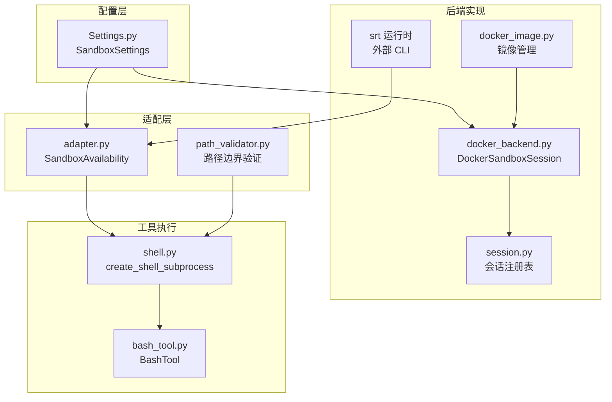
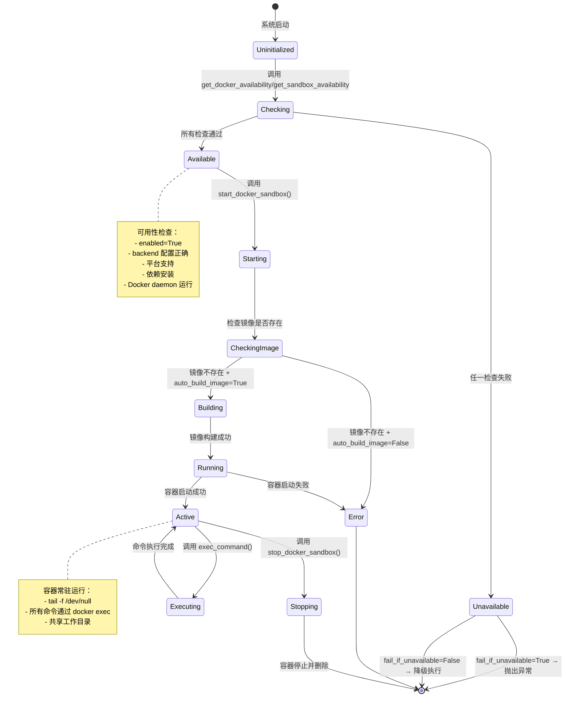
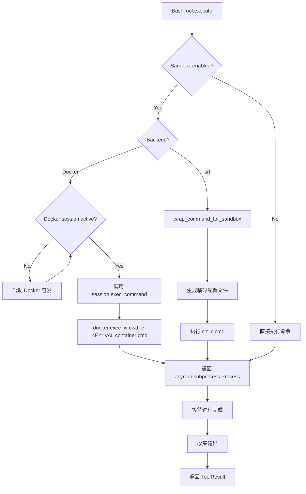
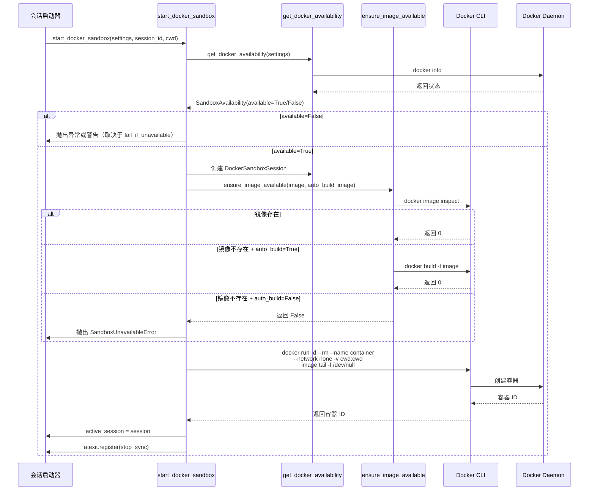
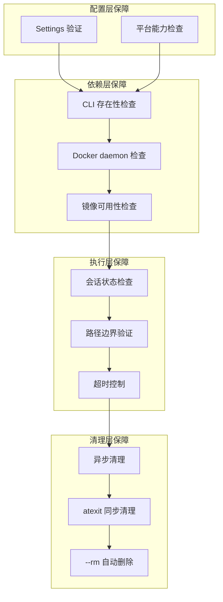

# Sandbox 系统深度解析

## 目录

- [一、概述](#一概述)
- [二、核心问题](#二核心问题)
- [三、完整生命周期](#三完整生命周期)
- [四、实现流程详解](#四实现流程详解)
- [五、关键技术机制](#五关键技术机制)
- [六、质量保障体系](#六质量保障体系)
- [七、对比分析](#七对比分析)
- [八、相关文件索引](#八相关文件索引)
- [九、总结](#九总结)

---

## 一、概述

Sandbox 系统是 OpenHarness 的核心安全机制，通过隔离代码执行环境来保护宿主机器。系统支持两种后端：

- **srt 后端**：基于 `bubblewrap`（Linux/WSL）和 `sandbox-exec`（macOS）的操作系统级隔离
- **Docker 后端**：基于 Docker 容器的进程级隔离

本文档以问题驱动的方式，深入分析沙箱系统的安全隔离原理、两种后端的设计权衡、以及边界条件和风险。

### 核心文件关系图



---

## 二、核心问题

### 问题 1：沙箱系统如何实现安全隔离？

| 问题 | 答案 | 证据 |
|------|------|------|
| **进程隔离**如何实现？ | srt 后端通过 `bubblewrap`/`sandbox-exec` 创建受限进程；Docker 后端通过容器命名空间隔离 | `adapter.py:86-100` 检查平台依赖；`docker_backend.py:89-127` 构建隔离参数 |
| **网络隔离**如何实现？ | Docker 后端使用 `--network none` 或 `--network bridge`；srt 后端支持域名级过滤（`allowed_domains`） | `docker_backend.py:98-107` 网络配置；`adapter.py:38-42` 构建网络策略 |
| **文件系统隔离**如何实现？ | srt 后端通过路径模式过滤；Docker 后端通过 bind mount 限制访问 | `adapter.py:43-48` 文件系统配置；`path_validator.py:8-37` 路径边界验证 |
| **资源约束**如何实现？ | Docker 后端通过 `--cpus` 和 `--memory` 限制；srt 后端不提供原生资源限制 | `docker_backend.py:110-113` 资源限制参数 |
| **边界条件**是什么？ | macOS 不支持 Docker 后端；Windows 不支持任何后端；srt 后端需要平台特定依赖 | `platforms.py:55-86` 平台能力矩阵 |

### 问题 2：Docker 后端与 srt 后端如何权衡？

| 维度 | Docker 后端 | srt 后端 | 权衡结论 |
|------|-------------|---------|----------|
| **隔离强度** | 容器级（进程 + 网络 + 文件系统） | 操作系统级（内核命名空间） | srt 提供更细粒度的域名和路径控制 |
| **启动开销** | 容器创建 ~2-5s（首次）；后续 `docker exec` ~50-200ms | 每次命令执行开销 ~50-200ms | Docker 常驻容器降低重复开销 |
| **资源限制** | 原生支持 CPU/内存限制 | 不支持原生资源限制 | Docker 适合需要资源配额的场景 |
| **网络控制** | 仅支持 none/bridge 二元选择 | 支持域名级白名单/黑名单 | srt 适合需要精确网络控制的场景 |
| **平台兼容性** | 仅支持 Linux/WSL | 支持 macOS/Linux/WSL（带依赖） | srt 覆盖更广，但需要额外依赖 |
| **配置复杂度** | 镜像构建 + 容器管理 | 依赖安装 + 运行时配置 | srt 无需镜像，但有平台特定依赖 |
| **适用场景** | 长时间运行、需要资源限制的任务 | 短期任务、需要精确安全控制的任务 | 选择取决于隔离粒度 vs 性能需求 |

---

## 三、完整生命周期

### 沙箱会话状态机



### 命令执行流程图



---

## 四、实现流程详解

### 4.1 可用性检查流程

**步骤 1：配置检查**

```python
# adapter.py:52-56
if not resolved_settings.sandbox.enabled:
    return SandboxAvailability(enabled=False, available=False, reason="sandbox is disabled")
```

**步骤 2：平台能力检查**

```python
# adapter.py:58-65
platform_name = get_platform()  # "macos", "linux", "windows", "wsl"
capabilities = get_platform_capabilities(platform_name)
if not capabilities.supports_sandbox_runtime:
    # 返回平台不支持的原因
```

平台能力矩阵（`platforms.py:55-86`）：

| 平台 | supports_sandbox_runtime | supports_docker_sandbox |
|------|-------------------------|------------------------|
| macOS | ✅ (需 sandbox-exec) | ❌ |
| Linux | ✅ (需 bwrap) | ✅ |
| WSL | ✅ (需 bwrap) | ✅ |
| Windows | ❌ | ❌ |
| unknown | ❌ | ❌ |

**步骤 3：CLI 可用性检查**

```python
# adapter.py:75-92
srt = shutil.which("srt")
if not srt:
    return SandboxAvailability(available=False, reason="srt CLI not found")

if platform_name in {"linux", "wsl"} and shutil.which("bwrap") is None:
    return SandboxAvailability(available=False, reason="bubblewrap required")

if platform_name == "macos" and shutil.which("sandbox-exec") is None:
    return SandboxAvailability(available=False, reason="sandbox-exec required")
```

**步骤 4：Docker daemon 检查（仅 Docker 后端）**

```python
# docker_backend.py:43-56
subprocess.run(
    [docker, "info"],
    capture_output=True,
    timeout=5,
    check=True,
)
```

### 4.2 Docker 容器启动流程

**时序图：Docker 容器启动**



### 4.3 命令执行流程详解

**Docker 后端执行路径**

```python
# docker_backend.py:198-232
async def exec_command(
    self,
    argv: list[str],
    *,
    cwd: str | Path,
    stdin: int | None = None,
    stdout: int | None = None,
    stderr: int | None = None,
    env: dict[str, str] | None = None,
) -> asyncio.subprocess.Process:
    if not self._running:
        raise SandboxUnavailableError("Docker sandbox session is not running")

    docker = shutil.which("docker") or "docker"
    cmd: list[str] = [docker, "exec"]
    cmd.extend(["-w", str(Path(cwd).resolve())])

    if env:
        for key, value in env.items():
            cmd.extend(["-e", f"{key}={value}"])

    cmd.append(self._container_name)
    cmd.extend(argv)

    return await asyncio.create_subprocess_exec(
        *cmd,
        stdin=stdin,
        stdout=stdout,
        stderr=stderr,
    )
```

**srt 后端执行路径**

```python
# adapter.py:105-131
def wrap_command_for_sandbox(
    command: list[str],
    *,
    settings: Settings | None = None,
) -> tuple[list[str], Path | None]:
    resolved_settings = settings or load_settings()
    if resolved_settings.sandbox.backend == "docker":
        return command, None

    availability = get_sandbox_availability(resolved_settings)
    if not availability.active:
        if resolved_settings.sandbox.enabled and resolved_settings.sandbox.fail_if_unavailable:
            raise SandboxUnavailableError(availability.reason or "sandbox runtime is unavailable")
        return command, None

    settings_path = _write_runtime_settings(build_sandbox_runtime_config(resolved_settings))
    wrapped = [
        availability.command or "srt",
        "--settings",
        str(settings_path),
        "-c",
        shlex.join(command),  # 将 argv 转为单字符串以保留退出码
    ]
    return wrapped, settings_path
```

### 4.4 清理流程

**异步清理（正常路径）**

```python
# docker_backend.py:160-180
async def stop(self) -> None:
    if not self._running:
        return
    docker = shutil.which("docker") or "docker"
    try:
        process = await asyncio.create_subprocess_exec(
            docker,
            "stop",
            "-t",
            "5",  # 5秒优雅退出
            self._container_name,
            stdout=asyncio.subprocess.PIPE,
            stderr=asyncio.subprocess.PIPE,
        )
        await asyncio.wait_for(process.communicate(), timeout=15)
    except (asyncio.TimeoutError, OSError) as exc:
        logger.warning("Error stopping Docker sandbox: %s", exc)
    finally:
        self._running = False
```

**同步清理（atexit 路径）**

```python
# docker_backend.py:182-196
def stop_sync(self) -> None:
    if not self._running:
        return
    docker = shutil.which("docker") or "docker"
    try:
        subprocess.run(
            [docker, "stop", "-t", "3", self._container_name],
            capture_output=True,
            timeout=10,
        )
    except (subprocess.TimeoutExpired, OSError):
        pass
    finally:
        self._running = False
```

---

## 五、关键技术机制

### 5.1 网络隔离机制

**Docker 后端的二元选择**

当前实现只支持两种网络模式：

```python
# docker_backend.py:98-107
if sandbox.network.allowed_domains or sandbox.network.denied_domains:
    logger.warning(
        "Docker sandbox does not enforce allowed_domains/denied_domains yet; "
        "keeping network disabled"
    )
argv.extend(["--network", "none"])
```

**设计权衡：**

- **为什么不用 `--network bridge` + DNS 代理？**
  - 需要额外组件（如 dnsmasq、iptables 规则）
  - 增加部署复杂度
  - 对于大多数场景，`none` 已足够

- **边界条件**：当用户配置 `allowed_domains` 期望域名级控制时，Docker 后端会降级为完全隔离，并记录警告

**srt 后端的域名级控制**

```python
# adapter.py:38-42
def build_sandbox_runtime_config(settings: Settings) -> dict[str, Any]:
    return {
        "network": {
            "allowedDomains": list(settings.sandbox.network.allowed_domains),
            "deniedDomains": list(settings.sandbox.network.denied_domains),
        },
        # ...
    }
```

srt 运行时通过内核级别的网络命名空间实现域名过滤，这是 Docker 后端无法提供的。

### 5.2 资源限制机制

**CPU 限制**

```python
# docker_backend.py:110-112
if docker_cfg.cpu_limit > 0:
    argv.extend(["--cpus", str(docker_cfg.cpu_limit)])
```

- 配置字段：`settings.sandbox.docker.cpu_limit`（浮点数）
- Docker flag：`--cpus 2.5`（2.5 个核心）
- 默认值：`0.0`（不限制）

**内存限制**

```python
# docker_backend.py:113-114
if docker_cfg.memory_limit:
    argv.extend(["--memory", docker_cfg.memory_limit])
```

- 配置字段：`settings.sandbox.docker.memory_limit`（字符串）
- Docker flag：`--memory 512m` 或 `--memory 2g`
- 默认值：`""`（不限制）

**srt 后端的限制**

srt 运行时不提供原生资源限制。需要操作系统级控制（如 `ulimit`、`cgroups`）。

### 5.3 路径边界验证

```python
# path_validator.py:8-37
def validate_sandbox_path(
    path: Path,
    cwd: Path,
    extra_allowed: list[str] | None = None,
) -> tuple[bool, str]:
    resolved = path.resolve()
    resolved_cwd = cwd.resolve()

    # 主检查：路径必须在项目目录内
    try:
        resolved.relative_to(resolved_cwd)
        return True, ""
    except ValueError:
        pass

    # 次要检查：额外允许的路径
    for allowed in extra_allowed or []:
        allowed_path = Path(allowed).expanduser().resolve()
        try:
            resolved.relative_to(allowed_path)
            return True, ""
        except ValueError:
            continue

    return False, f"path {resolved} is outside sandbox boundary ({resolved_cwd})"
```

**关键机制：**
1. 使用 `Path.resolve()` 解析符号链接和相对路径
2. 使用 `relative_to()` 验证路径关系
3. 支持通过 `extra_allowed` 配置额外的允许路径

**边界条件：**
- 软链接指向目录外的文件会被阻止
- `~` 会被展开为用户主目录
- 相对路径会被解析为基于 `cwd` 的绝对路径

### 5.4 会话生命周期管理

**全局会话注册表**

```python
# session.py:16-26
_active_session: DockerSandboxSession | None = None

def get_docker_sandbox():
    """Return the active Docker sandbox session, or ``None``."""
    return _active_session

def is_docker_sandbox_active() -> bool:
    """Return whether a Docker sandbox session is currently running."""
    return _active_session is not None and _active_session.is_running
```

**设计权衡：**

- **为什么用全局变量而不是依赖注入？**
  - 简化工具执行器的集成
  - 避免在整个调用栈中传递会话对象
  - 保证会话唯一性（一个会话对应一个 OpenHarness 实例）

- **风险**：全局状态可能导致测试困难，需要显式清理

---

## 六、质量保障体系

### 多层保障架构



### 各层保障详解

| 层级 | 保障机制 | 实现位置 | 失败处理 |
|------|----------|----------|----------|
| **配置层** | Pydantic 模型验证 | `settings.py` | 抛出 ValidationError |
| **平台层** | 平台能力矩阵 | `platforms.py:55-86` | 返回 `available=False` |
| **依赖层** | CLI/Daemon 检查 | `adapter.py:75-92`, `docker_backend.py:43-56` | 返回 `available=False` 或抛出异常 |
| **执行层** | 会话状态检查 | `docker_backend.py:213-214` | 抛出 `SandboxUnavailableError` |
| **路径层** | 边界验证 | `path_validator.py:8-37` | 返回 `(False, reason)` |
| **清理层** | 双重清理机制 | `docker_backend.py:160-196`, `session.py:55` | 记录警告但不阻塞 |

### 边界条件处理

**Docker daemon 未启动**

```python
# docker_backend.py:50-56
except (subprocess.CalledProcessError, subprocess.TimeoutExpired, OSError):
    return SandboxAvailability(
        enabled=True,
        available=False,
        reason="Docker daemon is not running",
        command=docker,
    )
```

处理：返回 `available=False`，根据 `fail_if_unavailable` 决定是否抛出异常。

**镜像不存在且禁止构建**

```python
# docker_image.py:93-103
async def ensure_image_available(image: str, auto_build: bool) -> bool:
    if await _image_exists(image):
        return True
    if not auto_build:
        logger.warning("Docker image %r not found and auto_build_image is disabled", image)
        return False
    return await build_default_image(image)
```

处理：抛出 `SandboxUnavailableError`，阻止会话启动。

**容器启动失败**

```python
# docker_backend.py:152-158
if process.returncode != 0:
    msg = stderr.decode("utf-8", errors="replace").strip()
    raise SandboxUnavailableError(f"Failed to start Docker sandbox: {msg}")
```

处理：抛出异常，`_running` 保持 `False`，不进入清理流程。

---

## 七、对比分析

### 7.1 Docker 后端 vs srt 后端

| 特性 | Docker 后端 | srt 后端 | 推荐场景 |
|------|-------------|---------|----------|
| **隔离类型** | 容器隔离（Linux 命名空间） | 操作系统级隔离（bubblewrap/sandbox-exec） | |
| **进程隔离** | ✅ 完整隔离 | ✅ 完整隔离 | 两者都满足 |
| **网络隔离** | 仅 none/bridge | 域名级白名单/黑名单 | 需要精确网络控制 → srt |
| **文件系统隔离** | Bind mount 限制 | 路径模式过滤 | 需要复杂路径规则 → srt |
| **资源限制** | CPU/内存原生支持 | 不支持 | 需要资源配额 → Docker |
| **启动开销** | 首次 ~2-5s，后续 ~50-200ms | 每次命令 ~50-200ms | 长时间运行 → Docker |
| **平台支持** | Linux/WSL | Linux/WSL/macOS | macOS → 必须用 srt |
| **依赖复杂度** | 需要安装 Docker Desktop | 需要安装 srt CLI + 平台依赖 | 快速上手 → srt |
| **镜像管理** | 需要构建/拉取镜像 | 无需镜像 | 快速部署 → srt |

### 7.2 网络隔离策略对比

| 策略 | 适用后端 | 配置方式 | 安全级别 | 性能影响 |
|------|----------|----------|----------|----------|
| `--network none` | Docker | `allowed_domains=[]` | 最高（无网络） | 无 |
| `--network bridge` | Docker | `allowed_domains=[...]` | 低（完全开放） | 小 |
| srt 域名过滤 | srt | `allowed_domains=["api.github.com"]` | 中（白名单控制） | 小 |

**关键洞察**：Docker 后端的网络控制粒度不足，但 `none` 模式提供了最强的安全保证。srt 后端的域名控制更灵活，但需要信任 srt 运行时的实现。

### 7.3 清理机制对比

| 清理方式 | Docker 后端 | srt 后端 | 优缺点 |
|----------|-------------|---------|--------|
| **会话结束清理** | `docker stop` + `--rm` | 进程自动退出 | Docker 需要 5-15s 优雅退出 |
| **异常退出清理** | atexit `stop_sync` | 进程自动退出 | Docker 的 atexit 可能失败 |
| **资源残留风险** | 低（容器自动删除） | 极低（进程自动回收） | Docker 有 `--rm` 保护 |
| **状态污染风险** | 中（容器常驻共享状态） | 低（每次命令独立） | Docker 可能积累临时文件 |

---

## 八、相关文件索引

### 核心实现文件

| 文件 | 职责 | 关键导出 |
|------|------|----------|
| `src/openharness/sandbox/__init__.py` | 模块入口，导出公共 API | `DockerSandboxSession`, `SandboxAvailability` |
| `src/openharness/sandbox/session.py` | 会话注册表 | `start_docker_sandbox`, `stop_docker_sandbox` |
| `src/openharness/sandbox/docker_backend.py` | Docker 后端实现 | `DockerSandboxSession`, `get_docker_availability` |
| `src/openharness/sandbox/docker_image.py` | 镜像管理 | `ensure_image_available`, `build_default_image` |
| `src/openharness/sandbox/adapter.py` | srt 适配器 | `get_sandbox_availability`, `wrap_command_for_sandbox` |
| `src/openharness/sandbox/path_validator.py` | 路径边界验证 | `validate_sandbox_path` |

### 配置文件

| 文件 | 职责 | 关键类 |
|------|------|--------|
| `src/openharness/config/settings.py` | 配置模型 | `SandboxSettings`, `DockerSandboxSettings` |
| `src/openharness/platforms.py` | 平台能力检测 | `PlatformCapabilities`, `get_platform_capabilities` |

### 集成文件

| 文件 | 职责 | 关键函数 |
|------|------|----------|
| `src/openharness/utils/shell.py` | 命令执行集成 | `create_shell_subprocess` |
| `src/openharness/tools/bash_tool.py` | Bash 工具实现 | `BashTool.execute` |

### 文档文件

| 文件 | 职责 |
|------|------|
| `docs/workflows/sandbox-execution.md` | 沙箱执行流程文档 |
| `docs/reference/config.md` | 配置参考 |

---

## 九、总结

### 核心洞察

1. **安全隔离的本质**：沙箱系统的安全不是"绝对隔离"，而是"受控边界"。通过明确的边界定义（路径、网络、资源）和多层检查，实现了在可用性和安全性之间的平衡。

2. **Docker vs srt 的根本差异**：
   - Docker 是"重隔离"，提供资源限制和强隔离，但启动开销大、平台支持受限
   - srt 是"轻隔离"，提供细粒度控制和快速启动，但缺乏原生资源限制
   - 选择取决于场景：长时间运行 + 需要资源控制 → Docker；短期任务 + 需要精确安全 → srt

3. **全局会话的设计取舍**：使用全局变量管理会话虽然简化了集成，但增加了测试复杂度。这是为了实用性的妥协。

### 关键要点

| 要点 | 说明 | 代码位置 |
|------|------|----------|
| **macOS 不支持 Docker 后端** | Docker Desktop 的虚拟化限制导致路径映射复杂 | `platforms.py:66` |
| **Docker 网络控制粒度不足** | 仅支持 none/bridge，不支持域名级过滤 | `docker_backend.py:98-107` |
| **常驻容器的状态污染风险** | 前一个命令的状态可能影响后续命令 | `session.py:51-52` |
| **双重清理机制** | 异步清理 + atexit 同步清理，确保容器被清理 | `docker_backend.py:160-196` |
| **srt 依赖平台特定工具** | Linux/WSL 需要 bwrap，macOS 需要 sandbox-exec | `adapter.py:86-100` |

### 边界条件

**何时 Docker 后端不成立：**
- macOS 环境（Docker 虽可运行，但系统认为不支持）
- Windows 环境（完全不支持）
- 需要域名级网络控制
- 需要快速启动且不需要资源限制

**何时 srt 后端不成立：**
- Windows 环境
- 需要原生资源限制（CPU/内存）
- 不想安装额外依赖（srt CLI、bwrap、sandbox-exec）

**残留风险：**
1. **Docker 容器泄漏**：如果 atexit 失败，容器可能继续运行
2. **临时文件泄漏**：srt 的临时配置文件可能在异常时未删除
3. **状态污染**：常驻容器内的临时文件可能累积
4. **路径绕过**：符号链接可能绕过路径边界验证（但已通过 `resolve()` 缓解）

### 设计哲学

沙箱系统的设计哲学是 **"防御深度 + 实用主义"**：

1. **防御深度**：配置检查 → 平台检查 → 依赖检查 → 执行时检查 → 清理检查，每层都有失败处理
2. **实用主义**：不是追求绝对安全，而是在可用性、性能、安全性之间找到最佳平衡点
3. **渐进式降级**：沙箱不可用时可以降级为无沙箱执行（取决于配置），而不是完全失败

---

**文档版本**：1.0
**最后更新**：2026-05-08
**分析对象**：OpenHarness Sandbox 系统（srt + Docker 后端）
