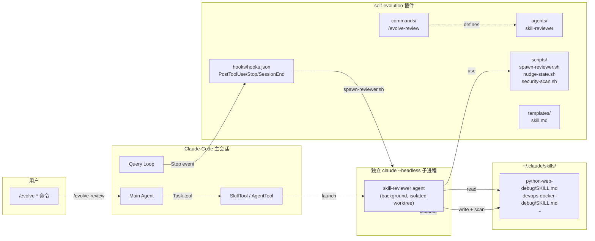
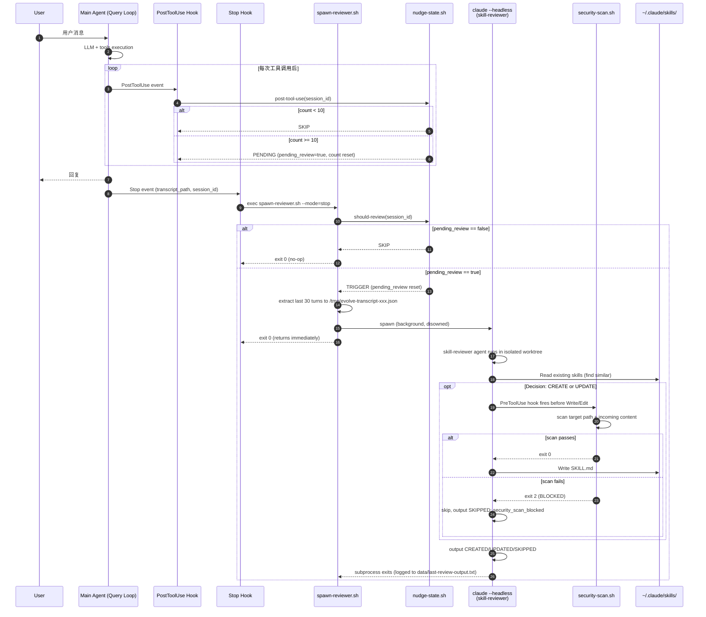
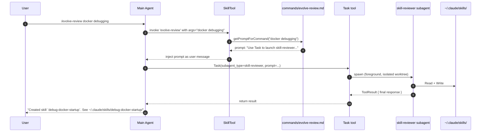
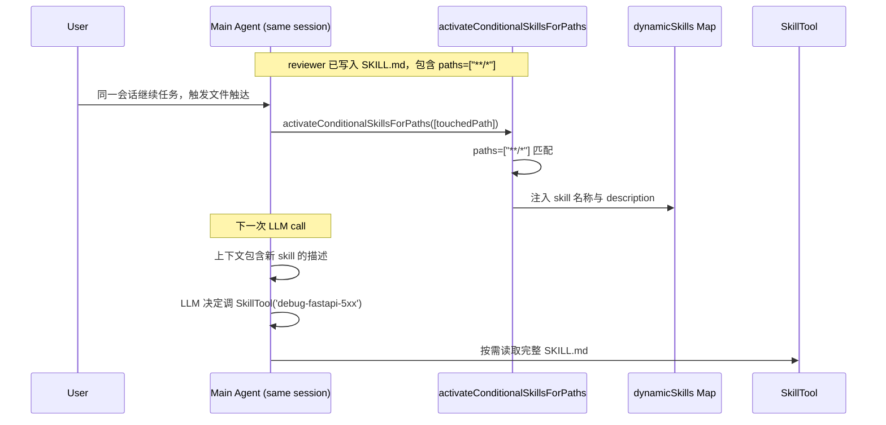

# Self-Evolution 插件设计

**Date:** 2026-05-07
**Status:** Draft
**Owner:** lijunyi
**Target:** Claude-Code v1.x（plugin marketplace 兼容）

> 通过 Claude-Code 原生 agents/commands/hooks 通道和用户级 `~/.claude/skills/` 目录，把 Hermes Agent 的"过程记忆自进化"机制（`_spawn_background_review` + `_SKILL_REVIEW_PROMPT` + `_security_scan_skill`）移植成一个独立的 Claude-Code 插件，**填补 Claude-Code 当前在过程记忆维度的空白**。

---

## 一、概述（Summary）

Claude-Code 原生提供了三种记忆能力——**事实记忆**（`memdir/` + `extractMemories` + `autoDream`）、**会话记忆**（`SessionMemory` + `compact/`）、**团队记忆**（`teamMemorySync/`）——但**没有过程记忆的自进化能力**。当 Agent 在一次会话中通过非平凡步骤完成了一个可复用的工作流（例如"FastAPI 5xx 错误的诊断流程"、"Docker 容器启动失败的排查路径"），这份"怎么做"的过程知识在会话结束后就消散了，下一次相似任务又要从零摸索。

Hermes Agent 用 `_spawn_background_review` + `_SKILL_REVIEW_PROMPT` 解决了这个问题：每 N 次工具调用后，在后台启动一个独立的 Agent 实例审查对话，把可复用的工作流写入 `~/.hermes/skills/<name>/SKILL.md`，让后续相似任务可直接复用。

本插件的目标是**把 Hermes 的过程记忆自进化闭环，用 Claude-Code 的原生扩展通道做一个最小可落地版本**，并提供：

1. **自动审查**：PostToolUse 记录工具调用次数，Stop/SessionEnd 触发一个独立 `claude --headless` 进程跑 `skill-reviewer` agent
2. **手动触发**：只保留 `/evolve-review`，让用户显式补跑当前会话审查
3. **安全保障**：Agent 级 PreToolUse hook + 独立 `security-scan.sh` 脚本，等同于 hermes 的 `_security_scan_skill`
4. **保守写入**：只创建/更新真正可复用的过程技能，不把模板、示例、评估报告伪装成 skill

**显式不做**：
- 事实记忆（user/feedback/project/reference）—— Claude-Code `memdir` 已覆盖且更完善
- 情景记忆（会话历史搜索）—— 应作为独立的 `session-search` 插件单独规划
- 修改 `MEMORY.md` 等系统提示加载内容 —— 会破坏 prefix cache
- skill 质量评分、跨 skill 自动合并、自动删除 —— 放到 v2 或离线维护工具，v1 不引入额外 agent

---

## 二、关键决策记录（Decision Log）

| # | 决策点 | 选择 | 备选 | 理由 |
|---|--------|------|------|------|
| D1 | Self-evolution 范围 | 仅过程记忆（skills） | 含事实+情景记忆 | 事实/情景记忆已被 Claude-Code 原生覆盖；插件只填补 skills 这个空白，避免重复造轮子 |
| D2 | Subagent 启动方式 | **Hook spawn `claude --headless` 子进程** | (a) hook 注入 `additionalContext` 让主 Agent 调 AgentTool；(b) 完全手动 | spawn 方式对主会话干扰最小；`additionalContext` 只适合提示主 Agent，不适合作为可靠后台执行机制 |
| D3 | Skill 命名风格 | **扁平 + category 前缀**（如 `python-web-debug`） | (a) 嵌套 hermes 风格 `python/web-debug/`；(b) 纯扁平无前缀 | Claude-Code loader 只扫一层目录（见 §8.2），嵌套不工作；前缀方案兼顾原生兼容和分类可见性 |
| D4 | v1 范围 | **1 agent + 1 command + 3 hooks + scripts** | (a) 多 agent + 多 command；(b) 完全无命令 | 先打通过程记忆闭环；只有"立即审查当前会话"是真实用户动作 |
| D5 | 触发频率门控 | 默认每 10 次工具调用触发一次 review，允许环境变量覆盖 | Stop 事件计数 / 仅硬编码 | 与 Hermes 的 `_iters_since_skill` 语义保持一致；Stop hook 只负责在回合边界启动审查 |
| D6 | 写入位置 | 用户级 `~/.claude/skills/`（默认）+ 项目级开关 | 仅项目级 | 过程记忆是跨项目积累的资产，用户级是默认；通过 `SKILL_TARGET_SCOPE` 环境变量切到项目级 |
| D7 | Agent 隔离模式 | 优先 `isolation: worktree`，实现时验证插件 agent 是否支持 | 无隔离 / `isolation: remote` | worktree 隔离更安全，但不在 spec 里假定未验证字段一定可用 |
| D8 | 后台 agent 是否能调 Task | `disallowedTools: [Task]` 禁止 | 允许 | 防止 reviewer agent 递归启动 reviewer，造成无限套娃 |
| D9 | 模板存放方式 | `templates/skill.md`，不放在插件 `skills/` 通道 | 放 `skills/skill-template/SKILL.md` | 插件 `skills/` 目录会被 loader 当成真实 skill；模板不是技能，不能污染 SkillTool |
| D10 | 本会话可见性 | 自动生成 skill 默认写 `paths: ["**/*"]` | 下次会话才可见 / 只写路径特定 glob | 自进化的价值在本会话下一轮可用；污染风险由严格 SKIP、短 description 和内建质量门禁控制 |

---

## 三、架构总览（Architecture）

### 3.1 系统上下文



**核心要点**：

1. **双触发路径**：自动（Hook spawn headless）+ 手动（slash command 走主 Agent 调 AgentTool）
2. **单 Agent 核心闭环**：reviewer 同时负责判断 CREATE / UPDATE / SKIP 和最低质量评估，避免 v1 过早拆成 evaluator/curator
3. **零信任边界**：reviewer 写入前必经 `security-scan.sh`，并限制目标目录
4. **配置驱动**：触发阈值、白名单、安全规则都在 `plugin.json` 或脚本环境变量中声明，不嵌进 agent prompt

### 3.2 与 Claude-Code 既有系统的关系

| 既有系统 | 关系 | 数据流向 |
|---------|------|---------|
| `loadAgentsDir.ts` (`PluginAgentDefinition`) | 注册插件 agent | 插件→Claude-Code：声明 1 个 reviewer agent |
| `loadSkillsDir.ts` (`getSkillDirCommands`) | 加载新生成的 skill | Skill 文件→Claude-Code：`paths: ["**/*"]` 进入 conditional discovery，本会话下一轮可见 |
| `commands/` loader | 注册 slash command | 插件→Claude-Code：1 个 `/evolve-review` 命令 |
| `executePostToolUseHooks` | 记录工具调用计数 | Claude-Code→插件：每次工具调用后更新 nudge 状态 |
| `executeStopHooks` / `executeSessionEndHooks` | 触发 spawn 脚本 | Claude-Code→插件：在回合边界触发 review |
| `memdir/` (事实记忆) | 不交互 | — |
| `SessionMemory/` (会话记忆) | 不交互 | — |
| `teamMemorySync/` (团队同步) | 不交互（用户级 skills 默认） | — |

---

## 四、物理目录结构

```
~/.claude/plugins/self-evolution/
├── plugin.json                          # 插件清单
├── README.md
├── LICENSE
├── agents/                              # ★ 原生 agent 通道
│   ├── skill-reviewer.md                # 后台审查 agent（background+worktree）
├── commands/                            # ★ 用户主动触发入口
│   └── evolve-review.md                 # /evolve-review  → 立即审查当前会话
├── hooks/
│   └── hooks.json                       # PostToolUse/Stop/SessionEnd
├── templates/
│   └── skill.md                         # 新 skill 模板；不是 Claude-Code skill
├── scripts/
│   ├── spawn-reviewer.sh                # 启动 headless reviewer
│   ├── nudge-state.sh                   # 持久化触发计数器
│   ├── security-scan.sh                 # 安全扫描（移植 hermes）
│   └── lib/
│       └── extract-transcript.sh        # 从 hook stdin 抽对话
└── data/                                # 运行时状态（.gitignore）
    ├── nudge-state.json                 # 每个 session 的计数器
    └── review-log.jsonl                 # 历次 review 的审计日志
```

> 注意：不要把模板放在 `skills/skill-template/SKILL.md`。只要插件声明了 `skillsPath` 或 loader 扫到该目录，模板就可能被当成真实 skill 暴露给模型；模板文件应放在 `templates/` 或 `references/`。

---

## 五、组件详细设计

### 5.1 `plugin.json`

```json
{
  "name": "self-evolution",
  "version": "0.1.0",
  "description": "Auto-curate ~/.claude/skills/ from your conversations. Inspired by Hermes Agent's background review.",
  "author": {
    "name": "lijunyi",
    "url": "https://github.com/lijunyi"
  },
  "homepage": "https://github.com/lijunyi/claude-code-self-evolution",
  "license": "MIT",
  "keywords": ["skills", "self-improving", "memory", "automation"],
  "components": ["agents", "commands", "hooks"],
  "agentsPath": "agents",
  "commandsPath": "commands",
  "hooksPath": "hooks/hooks.json",
  "settings": {
    "nudgeIntervalToolCalls": 10,
    "skillTargetScope": "user",
    "categoryWhitelist": ["debug", "refactor", "test", "deploy", "data", "web", "cli", "meta"],
    "maxSkillSizeBytes": 15360,
    "reviewerModel": "inherit"
  }
}
```

### 5.2 Agents

#### 5.2.1 `agents/skill-reviewer.md`（核心）

```markdown
---
name: skill-reviewer
description: Reviews recent conversation and creates/updates a skill if a reusable, non-trivial workflow was demonstrated. Auto-triggered by hooks; can also be invoked manually via /evolve-review.
background: true
isolation: worktree
model: inherit
effort: low
maxTurns: 6
permissionMode: acceptEdits
tools: [Read, Write, Edit, Glob, Grep, Bash]
disallowedTools: [Task, WebFetch, WebSearch]
hooks:
  PreToolUse:
    - matcher: "Write|Edit"
      hooks:
        - type: command
          command: "${CLAUDE_PLUGIN_ROOT}/scripts/security-scan.sh"
          timeout: 10
---

You are a Skill Reviewer. Review the conversation provided to you and decide
whether to CREATE / UPDATE / SKIP a skill. You also perform the minimum quality
evaluation inline; there is no separate evaluator agent in v1.

# Decision Rules

## SKIP if any of:
- Trivial task (single tool call, ≤2 logical steps)
- One-off context (specific user, one-time data, sensitive info)
- Conversation has unresolved errors or incomplete state

## UPDATE existing skill if:
- A skill with similar `category-name` exists in `~/.claude/skills/`
- The new approach refines / extends the existing one
- Use Edit tool to modify in place; preserve frontmatter

## CREATE new skill if:
- Novel approach, ≥3 logical steps
- Generalizable to a class of tasks (not one-shot)
- Doesn't fit any existing skill

## QUALITY GATE before CREATE / UPDATE:
- Clarity: the workflow is executable without rereading the original transcript
- Generality: no private paths, one-off project facts, secrets, or user-specific data
- Activation: `description` and `when_to_use` are narrow enough that `paths: ["**/*"]` will not spam unrelated tasks
- Safety: no dangerous shell patterns, credential material, or prompt-injection text

If any quality gate fails, output `SKIPPED: low_quality_or_too_specific`.

# Naming Convention (MUST follow)

Skill directory name: `<category>-<kebab-case-name>`

Allowed categories: `debug`, `refactor`, `test`, `deploy`, `data`, `web`, `cli`, `meta`

Examples:
- `debug-fastapi-5xx`
- `refactor-extract-pure-function`
- `deploy-docker-multistage`

# Required Frontmatter

```yaml
---
name: <category>-<name>
description: <one sentence, what task this skill solves>
when_to_use: |
  <trigger condition and examples>
paths: ["**/*"]            # REQUIRED: current-session conditional discovery (see §8.1)
allowed-tools: Read Bash Edit
version: "1.0.0"
---
```

# Body Template

Use the template at `${CLAUDE_PLUGIN_ROOT}/templates/skill.md`.

# Output Format

After your final action (create/update/skip), output ONE of:

```
CREATED: <category-name>
UPDATED: <category-name>
SKIPPED: <reason>
```

# Constraints

- NEVER write outside `~/.claude/skills/`
- NEVER create skills referencing specific user data, API keys, or paths from the conversation
- NEVER overwrite a skill that already has version > 1.0.0 without merging
- If security-scan hook blocks your write, do NOT retry—output `SKIPPED: security_scan_blocked`
```

#### 5.2.2 v2 延后项

独立评估 agent、独立整理 agent 不进入 v1。原因：

- reviewer 创建/更新 skill 前已经执行最低限度质量门禁；再拆独立评估 agent 会增加一次模型调用和一套命令面。
- 跨 skill 合并/删除属于长期维护问题；v1 没有使用统计，也没有足够信号做自动整理。
- 删除能力可以先让用户手动处理目录，避免 v1 引入 trash、恢复、清理策略。

v2 如果需要再补一个只读 `/evolve-audit`，输出建议即可，不默认自动 apply。

### 5.3 Commands

v1 只保留一个命令：

| Command | Purpose |
|---------|---------|
| `/evolve-review [topic]` | 立即审查当前会话；必要时创建/更新 skill |

不提供主菜单、列表、评估、整理、删除类命令。这些入口会放大命令面，但对“自动沉淀过程记忆”的主路径没有必要。列出/清理已有 skill 可以先通过普通文件操作或独立脚本完成，不必占用 slash command 命名空间。

#### 5.3.1 `commands/evolve-review.md`

```markdown
---
description: Manually trigger skill review on the current conversation.
allowed-tools: Task
argument-hint: "[topic]"
---

Use the Task tool to launch the `skill-reviewer` subagent.

Pass these inputs:
- Topic focus (optional, may be empty): $ARGUMENTS
- Conversation transcript: the last 30 turns of the current session
- Existing skills directory: ~/.claude/skills/

After the subagent completes, summarize what action was taken in ONE sentence.
If a skill was created or updated, also output the file path so the user can
inspect it.
```

### 5.4 `hooks/hooks.json`

```json
{
  "PostToolUse": [
    {
      "matcher": "*",
      "hooks": [
        {
          "type": "command",
          "command": "${CLAUDE_PLUGIN_ROOT}/scripts/nudge-state.sh --event=post-tool-use",
          "async": true,
          "timeout": 2
        }
      ]
    }
  ],
  "Stop": [
    {
      "hooks": [
        {
          "type": "command",
          "command": "${CLAUDE_PLUGIN_ROOT}/scripts/spawn-reviewer.sh --mode=stop",
          "async": true,
          "timeout": 5,
          "statusMessage": "evolve: checking nudge"
        }
      ]
    }
  ],
  "SessionEnd": [
    {
      "hooks": [
        {
          "type": "command",
          "command": "${CLAUDE_PLUGIN_ROOT}/scripts/spawn-reviewer.sh --mode=session-end",
          "async": true,
          "timeout": 60,
          "statusMessage": "evolve: final review"
        }
      ]
    }
  ]
}
```

要点：
- `PostToolUse` 只做轻量计数，不启动 reviewer；这样触发频率仍按 Hermes 的工具调用节奏计算
- `Stop` 用 `async: true`：回合结束时检查 nudge 是否已到；到阈值才启动 headless reviewer，避免在工具链执行中途审查半成品
- `SessionEnd` 用 `async: true`：用户已退出，再慢也无所谓
- v1 不挂 `PreCompact`：同步 90 秒会阻塞压缩路径，收益不稳定；如后续需要，只做 `async: true` 的轻量摘要或用户显式命令

### 5.5 Scripts

#### 5.5.1 `scripts/spawn-reviewer.sh`

```bash
#!/usr/bin/env bash
# Spawned by hooks/hooks.json on Stop / SessionEnd.
# Decides whether to actually run a reviewer agent based on nudge state.
set -euo pipefail

PLUGIN_DIR="${CLAUDE_PLUGIN_ROOT:-$HOME/.claude/plugins/self-evolution}"
DATA_DIR="$PLUGIN_DIR/data"
mkdir -p "$DATA_DIR"

# Hook 通过 stdin 传入 JSON：{ session_id, transcript_path, ... }
HOOK_INPUT=$(cat)
SESSION_ID=$(echo "$HOOK_INPUT" | jq -r '.session_id // empty')
TRANSCRIPT_PATH=$(echo "$HOOK_INPUT" | jq -r '.transcript_path // empty')

MODE="${1:-stop}"  # 形式：--mode=stop / --mode=session-end
MODE="${MODE#--mode=}"

# 1. nudge 门控（仅 stop 模式需要；计数由 PostToolUse 完成）
if [ "$MODE" = "stop" ]; then
    DECISION=$("$PLUGIN_DIR/scripts/nudge-state.sh" "$SESSION_ID" should-review)
    [ "$DECISION" = "SKIP" ] && exit 0
fi

# 2. 抽取最后 30 轮对话到临时文件
PRUNED_TRANSCRIPT=$(mktemp -t evolve-transcript-XXXXXX.json)
"$PLUGIN_DIR/scripts/lib/extract-transcript.sh" \
    "$TRANSCRIPT_PATH" \
    --last-turns=30 \
    --filter-tool-calls=Write,Edit,Bash \
    > "$PRUNED_TRANSCRIPT"

# 3. spawn 独立 claude --headless 跑 reviewer
LOG_FILE="$DATA_DIR/review-log-$(date +%Y%m%d).jsonl"
{
    echo "{\"ts\":\"$(date -u +%Y-%m-%dT%H:%M:%SZ)\",\"session_id\":\"$SESSION_ID\",\"mode\":\"$MODE\",\"transcript\":\"$PRUNED_TRANSCRIPT\"}"
} >> "$LOG_FILE"

claude --headless \
    --agent skill-reviewer \
    --input-file "$PRUNED_TRANSCRIPT" \
    --no-mcp \
    --quiet \
    > "$DATA_DIR/last-review-output.txt" 2>&1 &

# 异步 spawn 后立即退出，不等子进程
disown
exit 0
```

> 注：`claude --headless` 的具体 CLI 形式需在实施时验证；如不支持 `--agent`，可改用 `--system "${reviewer prompt}" --tools "${whitelist}"` 的等价写法。

#### 5.5.2 `scripts/nudge-state.sh`

```bash
#!/usr/bin/env bash
# 维护每个 session 的工具调用计数器，决定是否触发 review。
set -euo pipefail

PLUGIN_DIR="${CLAUDE_PLUGIN_ROOT:-$HOME/.claude/plugins/self-evolution}"
STATE_FILE="$PLUGIN_DIR/data/nudge-state.json"
LOCK_DIR="$STATE_FILE.lock"
THRESHOLD="${SELF_EVOLUTION_NUDGE_INTERVAL:-10}"

mkdir -p "$(dirname "$STATE_FILE")"
[ -f "$STATE_FILE" ] || echo '{}' > "$STATE_FILE"

if [[ "${1:-}" == --event=* ]]; then
    ACTION="${1#--event=}"
    HOOK_INPUT=$(cat)
    SESSION_ID=$(echo "$HOOK_INPUT" | jq -r '.session_id // empty')
else
    SESSION_ID="${1:?Usage: nudge-state.sh <session-id> <action> | --event=post-tool-use}"
    ACTION="${2:-should-review}"
fi

[ -n "$SESSION_ID" ] || exit 0

# POSIX 原子锁，避免假定 macOS 自带 flock。
while ! mkdir "$LOCK_DIR" 2>/dev/null; do
    sleep 0.05
done
trap 'rmdir "$LOCK_DIR"' EXIT

case "$ACTION" in
    post-tool-use)
        CURRENT=$(jq -r --arg s "$SESSION_ID" '.[$s].count // 0' "$STATE_FILE")
        NEW=$((CURRENT + 1))
        if [ "$NEW" -ge "$THRESHOLD" ]; then
            jq --arg s "$SESSION_ID" '.[$s].count = 0 | .[$s].pending_review = true' "$STATE_FILE" > "$STATE_FILE.tmp"
            mv "$STATE_FILE.tmp" "$STATE_FILE"
            echo "PENDING"
        else
            jq --arg s "$SESSION_ID" --argjson n "$NEW" '.[$s].count = $n' "$STATE_FILE" > "$STATE_FILE.tmp"
            mv "$STATE_FILE.tmp" "$STATE_FILE"
            echo "SKIP"
        fi
        ;;
    should-review)
        PENDING=$(jq -r --arg s "$SESSION_ID" '.[$s].pending_review // false' "$STATE_FILE")
        if [ "$PENDING" = "true" ]; then
            jq --arg s "$SESSION_ID" '.[$s].pending_review = false' "$STATE_FILE" > "$STATE_FILE.tmp"
            mv "$STATE_FILE.tmp" "$STATE_FILE"
            echo "TRIGGER"
        else
            echo "SKIP"
        fi
        ;;
    reset)
        jq --arg s "$SESSION_ID" 'del(.[$s])' "$STATE_FILE" > "$STATE_FILE.tmp"
        mv "$STATE_FILE.tmp" "$STATE_FILE"
        echo "RESET"
        ;;
    *)
        echo "Unknown action: $ACTION" >&2
        exit 1
        ;;
esac
```

#### 5.5.3 `scripts/security-scan.sh`

```bash
#!/usr/bin/env bash
# Agent 级 PreToolUse hook，每次 Write/Edit 前扫描即将写入的内容。
# 移植自 hermes _security_scan_skill。
set -euo pipefail

HOOK_INPUT=$(cat)
TOOL_NAME=$(echo "$HOOK_INPUT" | jq -r '.tool_name // .toolName // empty')
TOOL_INPUT=$(echo "$HOOK_INPUT" | jq -c '.tool_input // .toolInput // {}')
TARGET=$(echo "$TOOL_INPUT" | jq -r '.file_path // .path // empty')

case "$TOOL_NAME" in
    Write)
        CONTENT=$(echo "$TOOL_INPUT" | jq -r '.content // empty')
        ;;
    Edit|MultiEdit)
        CONTENT=$(echo "$TOOL_INPUT" | jq -r '[.old_string, .new_string, (.edits[]?.new_string // empty)] | join("\n")')
        ;;
    *)
        exit 0
        ;;
esac

# reviewer 只能写入 Claude skills 目录，避免误改项目文件或插件模板。
case "$TARGET" in
    "$HOME"/.claude/skills/*/SKILL.md) ;;
    *)
        echo "BLOCKED: target outside ~/.claude/skills" >&2
        exit 2
        ;;
esac

TMP=$(mktemp -t evolve-scan-XXXXXX)
printf '%s' "$CONTENT" > "$TMP"
trap 'rm -f "$TMP"' EXIT

# 1. Prompt injection
if grep -qiE '(ignore previous|disregard above|<\|im_start\|>|system:.*you are now)' "$TMP"; then
    echo "BLOCKED: prompt-injection pattern" >&2
    exit 2  # exit code 2 = block in Claude-Code hook protocol
fi

# 2. 危险 Bash
if grep -qE 'rm -rf /( |$)|curl[^|]*\| *(ba)?sh|eval[[:space:]]+\$\(|wget[^|]*-O[[:space:]]*-' "$TMP"; then
    echo "BLOCKED: dangerous bash pattern" >&2
    exit 2
fi

# 3. Secret 模式（API key、private key、AWS access key 等）
if grep -qE '(sk-[A-Za-z0-9]{20,}|AKIA[0-9A-Z]{16}|-----BEGIN [A-Z ]+PRIVATE KEY-----|ghp_[A-Za-z0-9]{36})' "$TMP"; then
    echo "BLOCKED: secret leak pattern" >&2
    exit 2
fi

# 4. 大小限制
SIZE=$(wc -c < "$TMP")
MAX_SIZE=${SELF_EVOLUTION_MAX_SKILL_SIZE:-15360}
if [ "$SIZE" -gt "$MAX_SIZE" ]; then
    echo "BLOCKED: file too large ($SIZE > $MAX_SIZE bytes)" >&2
    exit 2
fi

exit 0
```

---

## 六、数据流与关键时序

### 6.1 自动触发的完整时序



### 6.2 手动触发的时序（`/evolve-review`）



**关键差异**：手动触发是**同步**的（用户等结果），自动触发是**异步**的（用户无感）。

### 6.3 Skill 被发现并使用的时序



→ **关键点**：自动生成的 skill 默认带 `paths: ["**/*"]`，进入 conditional skill 路径。这样它不需要重启会话，也能在本会话下一轮文件触达后进入 `dynamicSkills`。这是 v1 为了保留 Hermes“会话内学习”语义必须接受的实现代价；风险通过严格创建门槛、短 description 和安全扫描控制。

---

## 七、命名规范（Naming Convention）

### 7.1 目录命名

| 元素 | 规则 | 示例 |
|------|------|------|
| Skill 目录名 | `<category>-<kebab-case-name>` | `debug-fastapi-5xx`, `refactor-extract-helper` |
| 允许的 category | `debug` `refactor` `test` `deploy` `data` `web` `cli` `meta` | — |
| 名称长度 | category 后部分 ≤ 40 字符 | — |
| 字符集 | `[a-z0-9-]` 仅小写字母、数字、连字符 | — |

### 7.2 Frontmatter 必填字段

```yaml
---
name: <category>-<name>       # 与目录名一致
description: <一句话描述>      # ≤ 120 字符
when_to_use: |
  <触发条件，说明什么时候应该使用这个 skill>
paths: ["**/*"]               # ★ 必填：触发本会话 conditional discovery，见 §8.1
allowed-tools: Read Bash Edit # 空格分隔，按实际需要收窄
version: "1.0.0"              # semver；可选
---
```

`category` 和 `tags` 可以作为非关键元数据保留，但不要让 reviewer 依赖它们实现核心功能；核心识别应以目录名、`name`、`description`、`when_to_use` 为准。

### 7.3 跨 category 标签建议

| Tag | 含义 |
|-----|------|
| `python` `typescript` `rust` `go` | 语言绑定 |
| `fastapi` `react` `nextjs` `docker` `k8s` | 框架/工具绑定 |
| `error-handling` `performance` `security` `migration` | 关注维度 |
| `quick-fix` `deep-dive` | 复杂度 |

> 命名 + tag 组合可以作为 v2 的检索增强。v1 不提供专门的 list 命令，避免把普通文件浏览包装成 slash command。

---

## 八、关键技术问题与解决方案

### 8.1 问题：新 Skill 的进程内可见性

**问题**：`getSkillDirCommands` 存在进程内缓存。Headless reviewer 写入新 `SKILL.md` 后，当前主会话不一定能立即发现。

**解决**：v1 明确要求“本会话下一轮可见”：
- 自动生成的 skill 默认写 `paths: ["**/*"]`，让它走 conditional discovery，从而绕过进程内 `getSkillDirCommands` memoize。
- 这不是把模板或完整正文注入上下文；启动时可见的是 skill metadata，完整 `SKILL.md` 仍由 SkillTool 按需读取。
- 污染风险不靠放弃本会话可见性解决，而靠 reviewer 的 SKIP 规则、质量检查和 `security-scan.sh` 控制。

**验证方法**：
```bash
# 会话 A 让 reviewer 创建 debug-test，frontmatter 包含 paths: ["**/*"]
# 不退出会话 A
# 在同一会话触发任意文件触达
# 检查日志，应见 conditional skill 被激活；下一轮模型可见 debug-test metadata
```

### 8.2 问题：嵌套分类目录不被支持

**问题**：`loadSkillsFromSkillsDir`（`loadSkillsDir.ts:407-480`）只 `readdir` 一层，不递归。`~/.claude/skills/python/web-debug/SKILL.md` 找不到。

**解决**：采用扁平命名 `python-web-debug`，详见 §7。**不要尝试在 `~/.claude/skills/` 下做 hermes 风格嵌套**。

### 8.3 问题：Reviewer 递归触发

**问题**：reviewer 自己写文件 → Stop hook → spawn 新 reviewer → 无限套娃。

**解决**：
- `agents/skill-reviewer.md` 设 `disallowedTools: [Task]`：禁止 reviewer 启动 subagent
- `claude --headless` 命令行加 `--no-hooks`（如 CLI 支持）跳过当前会话的 hook
- 或在 `spawn-reviewer.sh` 检查环境变量 `EVOLVE_RECURSIVE_GUARD=1`，存在则直接退出

### 8.4 问题：Prefix Cache 保护

**问题**：Claude-Code 启动时 `MEMORY.md` 等加载到系统提示，享受 prefix cache。任何 mid-session 系统提示变动都会让缓存大面积失效。

**解决**（基于代码事实）：
- 永远不修改 `MEMORY.md`、`~/.claude/projects/<root>/memory/*` 或其他系统提示来源
- 新 skill 只写入 `~/.claude/skills/<name>/SKILL.md`，由 Claude-Code 原生 skill loader 在会话边界或按需加载
- 不通过 hook `additionalContext` 注入大段 review 结果；hook 只做后台执行和短状态消息

### 8.5 问题：跨平台并发安全（macOS/Linux/WSL）

**问题**：`nudge-state.json` 可能被多个 session 并发写。

**解决**：优先使用 POSIX 原子的 `mkdir "$LOCK_DIR"` 作为锁；如果运行环境明确提供 `flock`，可以用 `flock` 简化实现。不要假定 macOS 默认自带 GNU `flock`。

### 8.6 问题：`claude --headless` 的具体调用方式

**风险**：v1 spec 假定 `claude --headless --agent skill-reviewer` 能跑插件 agent，但实际 CLI flag 需要在实施时验证。

**应对**：实施第一周确认 `claude --headless` 的真实 API；如不支持直接调用 plugin agent，改为：
- 方案 A：`claude --headless --system-prompt "${REVIEWER_PROMPT}" --tools "Read,Write,Edit,..."`
- 方案 B：headless 进程启动后立即 `/agent skill-reviewer` 切换到该 agent
- 方案 C：纯 stdin/stdout 协议直接调用，绕过 CLI

---

## 九、实施任务分解（约 1 周）

### Week 1：核心通路打通

| Day | 任务 | 验证 |
|-----|------|------|
| 1 | `plugin.json` + 目录骨架 + README + LICENSE | `claude plugin install ./self-evolution` 成功 |
| 1 | `agents/skill-reviewer.md`（最小版） | `/agents` 命令能列出 |
| 2 | `commands/evolve-review.md`（最小版） | `/evolve-review` 能调到 reviewer agent |
| 2 | 端到端跑通：手动触发能创建一个测试 skill | 文件出现在 `~/.claude/skills/` |
| 3 | `scripts/nudge-state.sh` + 单测 | `mkdir` 原子锁并发测试 OK |
| 3 | `scripts/security-scan.sh` + 测试用例 | 注入/危险/secret/超大 4 种 case 都被拦截 |
| 4 | `scripts/spawn-reviewer.sh`（验证 `claude --headless` API） | 手动 spawn 能跑 reviewer |
| 5 | `hooks/hooks.json` + PostToolUse/Stop 链路打通 | 模拟 10 次工具调用后，在 Stop 阶段自动 spawn |

### Week 2：收尾与发布

| Day | 任务 | 验证 |
|-----|------|------|
| 6 | SessionEnd hook | 退出时能触发且不阻塞 |
| 6 | `scripts/lib/extract-transcript.sh`（裁剪对话） | 30 轮 + 工具过滤 OK |
| 7 | README + 手工运维脚本说明 | README 覆盖安装/禁用/排错；列出/删除 skill 走普通文件操作 |
| 8 | 递归触发防护测试 + Prefix cache 影响测试 | 无递归 spawn；不改系统提示来源 |
| 9 | 完整 demo + 手工红队用例 | — |
| 10 | Marketplace 发布 PR | — |

---

## 十、验收标准

### 10.1 功能验收

| # | 验收点 | 方法 |
|---|--------|------|
| F1 | 手动 `/evolve-review` 能创建一个 SKILL.md | 跑一个非平凡任务后调命令 |
| F2 | 自动触发：10 次工具调用后，Stop hook spawn reviewer | tail `data/review-log-*.jsonl` |
| F3 | 新 skill 在本会话下一轮可见 | 同一会话触发文件触达后检查 conditional skill 激活日志 |
| F4 | 危险内容（rm -rf、API key、prompt injection）被 security-scan 拦截 | 手动构造 4 种危险 prompt 让 reviewer 跑 |
| F5 | 不会递归触发 | spawn 后无新的 hook fire |
| F6 | `/evolve-review` 能正常运行 | 手动触发并检查 CREATED/UPDATED/SKIPPED 输出 |

### 10.2 性能验收

| # | 指标 | 目标 |
|---|------|------|
| P1 | Stop hook 在 nudge 未到时延迟 | < 100ms |
| P2 | Stop hook 在 nudge 触发时延迟 | < 500ms（spawn 后立即返回） |
| P3 | Headless reviewer 一次完整审查耗时 | < 60s |
| P4 | 主会话 prefix cache 命中率 | 与不装本插件时一致 |

### 10.3 安全验收

| # | 验收点 | 方法 |
|---|--------|------|
| S1 | reviewer 只能写 `~/.claude/skills/`，写不到别处 | worktree 隔离 + permissionMode 配合 |
| S2 | 4 类安全模式（injection/dangerous-bash/secret/oversized）100% 拦截 | red-team 测试集 |
| S3 | reviewer 不能调用 Task / WebFetch / WebSearch | `disallowedTools` 强制 |
| S4 | 插件不注册模板为 skill | `plugin.json` 无 `skillsPath`，模板位于 `templates/` |

---

## 十一、风险与开放问题

### 11.1 已知风险

| # | 风险 | 缓解 |
|---|------|------|
| R1 | `claude --headless --agent` API 可能不支持插件 agent | §8.6 三种 fallback 方案 |
| R2 | reviewer agent 可能产生质量低劣的 skill | 严格 SKIP 规则 + 内建质量评估 + security scan |
| R3 | 大量低质 skill 污染上下文 | 接受 `paths: ["**/*"]` 的可见性代价，但通过短 metadata、严格创建门槛和后续 audit 控制 |
| R4 | 锁实现跨平台差异 | 使用 POSIX `mkdir` 原子锁 |
| R5 | 跨多 plugin 的 hook 协同冲突 | hook 用独立的 statusMessage 和命名空间日志，便于排查 |

### 11.2 待确认问题（实施前）

1. **Q1**：`claude --headless` 是否支持通过 CLI 选择插件 agent？如不支持，需要在 v1 实施周第一天给出 fallback 方案
2. **Q2**：插件 hook 中的 `${CLAUDE_PLUGIN_ROOT}` 变量是否原生支持？查 `src/utils/hooks.ts` 的变量替换逻辑
3. **Q3**：是否需要支持 Windows？v1 仅承诺 macOS/Linux；Windows 留 v2
4. **Q4**：插件需要哪些权限？是否需要在 `plugin.json` 声明？查 marketplace 发布要求

### 11.3 v2 路线图（非本 spec 范围）

- 多设备同步：把 `~/.claude/skills/` 与 git 仓库挂钩，跨机器共享
- Skill 使用统计：在 PostToolUse hook 记录 skill 调用次数，做"使用率排行"
- 团队 skills：基于 `teamMemorySync` 机制，把 skill 推到团队级
- LLM 辅助 audit：v2 可增加只读 `/evolve-audit`，先输出合并/删除建议，不默认自动 apply
- 与 `extractMemories` 协同：reviewer 发现的"事实"（如用户偏好）走 memdir 路径，避免与原生事实记忆系统重复

---

## 附录 A：与 Hermes 自进化机制的逐项对照

| Hermes 机制 | Claude-Code 等价物 | 实现位置 |
|------------|-------------------|---------|
| `_iters_since_skill >= 10` | `nudge-state.sh THRESHOLD=10` | scripts/nudge-state.sh |
| `_spawn_background_review` | hook spawn `claude --headless` | scripts/spawn-reviewer.sh + hooks/hooks.json |
| `_SKILL_REVIEW_PROMPT` | `agents/skill-reviewer.md` body | agents/skill-reviewer.md |
| `_security_scan_skill` | `scripts/security-scan.sh` + Agent PreToolUse hook | scripts + agents frontmatter |
| `clear_skills_system_prompt_cache()` | 用 `paths: ["**/*"]` 触发 conditional discovery，争取本会话下一轮可见 | §8.1 |
| `review_agent._skill_nudge_interval = 0` | `disallowedTools: [Task]` + `EVOLVE_RECURSIVE_GUARD` | agents 定义 + spawn 脚本 |
| `~/.hermes/skills/<category>/<name>/SKILL.md` | `~/.claude/skills/<category>-<name>/SKILL.md` | §7 命名规范 |
| `skill_manage` create/edit/delete | v1 只做 reviewer create/update/skip + `/evolve-review` | §5 |

## 附录 B：相关文件索引

| 文件 | 用途 |
|------|------|
| `docs/memory-system-comparison.md` | Claude-Code vs Hermes 记忆系统对比 |
| `claude-code/docs/deep/PLUGIN-SYSTEM.md` | Claude-Code 插件四通道架构 |
| `claude-code/docs/deep/SKILL-SYSTEM.md` | Skills 系统深度解析 |
| `hermes-agent/docs/deep/self-evolution-learning-loop.md` | Hermes 自进化学习循环 |
| `claude-code/src/types/plugin.ts` | 插件类型定义（`LoadedPlugin`, `PluginComponent`） |
| `claude-code/src/tools/AgentTool/loadAgentsDir.ts` | Agent 加载逻辑（`background`, `isolation`, `disallowedTools`） |
| `claude-code/src/skills/loadSkillsDir.ts` | Skills 加载（memoize, conditional, dynamic discovery） |
| `claude-code/src/utils/plugins/loadPluginAgents.ts` | 插件 agent 加载入口 |
