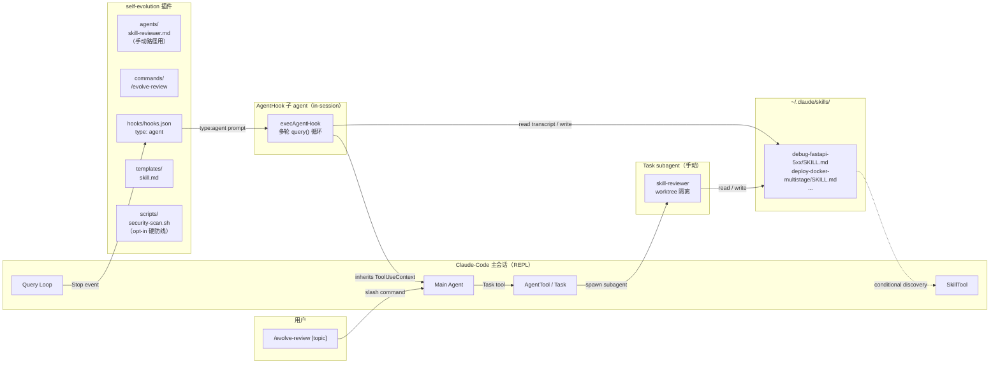
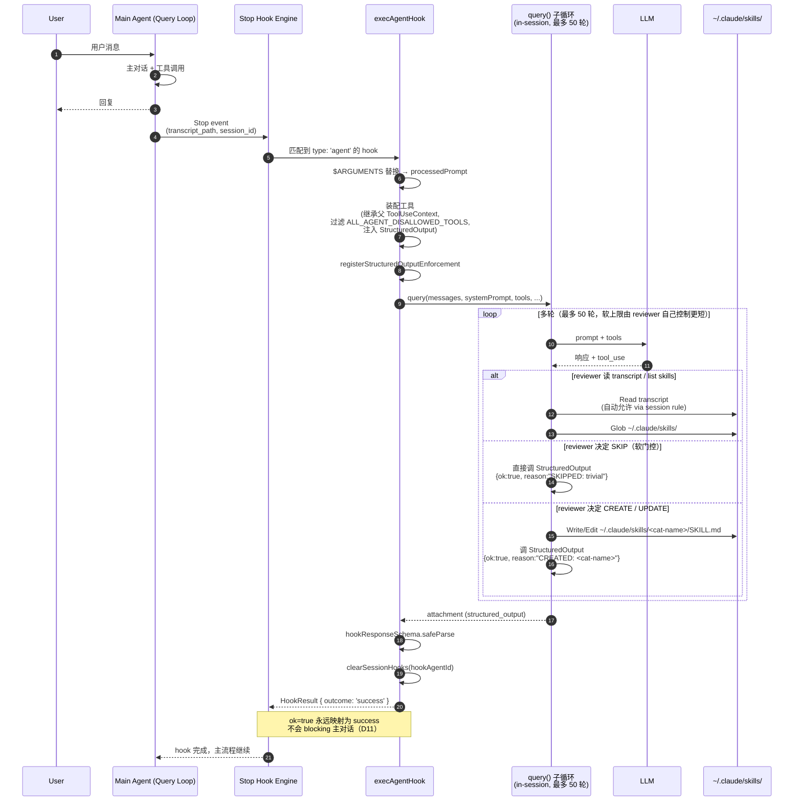
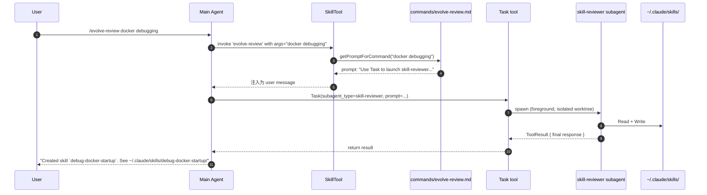

# Self-Evolution 插件设计 v2（AgentHook 路线）

**Date:** 2026-05-08
**Status:** Draft
**Owner:** lijunyi
**Target:** Claude-Code v1.x（plugin marketplace 兼容）
**Supersedes:** [`2026-05-07-self-evolution-design.md`](./2026-05-07-self-evolution-design.md)（原 spawn `claude --headless` 路线，已废弃）

> 通过 Claude-Code 原生 **AgentHook**（`type: 'agent'`）+ 用户级 `~/.claude/skills/` 目录，把 Hermes Agent 的"过程记忆自进化"机制移植成一个独立的 Claude-Code 插件。**自动审查走 in-session AgentHook**（共享主会话 ToolUseContext，对 prefix cache 影响最小），**手动审查走 Task→subagent 路径**（保留显式入口和参数能力）。

---

## 一、概述（Summary）

Claude-Code 原生提供事实记忆（`memdir/` + `extractMemories`）、会话记忆（`SessionMemory`）、团队记忆（`teamMemorySync/`），但**没有过程记忆的自进化**。Hermes Agent 用 `_spawn_background_review` + `_SKILL_REVIEW_PROMPT` 把可复用的工作流持久化到 `~/.hermes/skills/`，本插件把同样的能力以 Claude-Code 原生通道实现。

### 与 v1（spawn 方案）的核心差异

v1 设计 spawn 一个独立 `claude --headless` 子进程跑 reviewer agent，本质上是把 Hermes 的 `os.spawn()` 直译过来。但读 `extractMemories.ts:6-13` 注释后可以确认，Claude-Code 自己的事实记忆提取就是"在主会话内部、Stop 时刻、共享父级 cache 的 forked agent"——v1 的 spawn 路径在哲学上是反着的。

v2 改为：

| 路径 | 触发方式 | 实现 | 主要好处 |
|------|---------|------|---------|
| **自动审查** | Stop / SessionEnd hook | `hooks/hooks.json` 配置 `type: 'agent'` 的 AgentHook | in-session 多轮（最多 50 轮）、继承主 ToolUseContext（含全部工具/MCP/cwd/env）、`mode: 'dontAsk'` 自动放行、声明式（无 spawn 脚本） |
| **手动审查** | `/evolve-review [topic]` | command → 主 Agent 调 Task → `skill-reviewer` subagent | 用户显式触发，可接收参数（如 `/evolve-review docker debugging`），保留 `agents/skill-reviewer.md` 完整定义 |

两条路径共用相同的"决策规则 + 命名规范 + 写入边界"，只是执行壳不同。

### 本插件目标

1. **自动审查（默认）**：通过 AgentHook 在 Stop 边界由 in-session agent 直接审查最近对话，必要时创建/更新 `~/.claude/skills/<category>-<name>/SKILL.md`
2. **手动触发**：`/evolve-review [topic]` 立即审查当前会话，可指定主题
3. **保守写入**：严格的 SKIP 规则 + prompt 内置质量门禁，不把模板/示例伪装成 skill
4. **零阻塞**：AgentHook 永远返回 `ok: true`，避免审查失败 blocking 主对话

### 显式不做

- 事实记忆（user/feedback/project/reference）—— `memdir` 已覆盖
- 情景记忆（会话历史搜索）—— 应作为独立的 `session-search` 插件
- 修改 `MEMORY.md` 等系统提示加载内容 —— 会破坏 prefix cache
- skill 质量评分、跨 skill 自动合并、自动删除 —— v2 或离线维护工具
- v1（2026-05-07）的 `spawn-reviewer.sh` / `nudge-state.sh` / `claude --headless` 链路 —— 全部废弃

---

## 二、关键决策记录（Decision Log）

| # | 决策点 | 选择 | 备选 | 理由 |
|---|--------|------|------|------|
| D1 | Self-evolution 范围 | 仅过程记忆（skills） | 含事实+情景记忆 | 事实/情景记忆已被 Claude-Code 原生覆盖；插件只填补 skills 这个空白 |
| **D2** | **后台 reviewer 启动方式** | **自动用 AgentHook（`type: 'agent'`），手动用 Task→subagent** | (a) v1 的 spawn `claude --headless`；(b) hook 注入 `additionalContext` 让主 Agent 调 AgentTool；(c) 全部走手动 | AgentHook 是 Claude-Code 原生为 Stop 验证场景设计的多轮 in-session agent runner（`execAgentHook.ts`），与 `extractMemories` 的 forked-agent 哲学一致；spawn 方案需要解决 `claude --headless` API、跨进程 transcript 传递、独立鉴权等一系列问题，且开销远大 |
| D3 | Skill 命名风格 | 扁平 + category 前缀（如 `python-web-debug`） | (a) 嵌套 hermes 风格；(b) 纯扁平无前缀 | Claude-Code loader 只扫一层目录（见 §8.2） |
| D4 | v1 范围 | 1 hook（agent type）+ 1 命令 + 1 agent 定义 | 多 agent + 多 command | 先打通过程记忆闭环 |
| **D5** | **触发频率门控** | **AgentHook prompt 内置软门控**（让 reviewer 自己判断对话是否值得审查） | (a) v1 的 PostToolUse 计数 + 状态文件；(b) 硬阈值 | AgentHook 无法在 hook config 层面读取自定义状态文件做精确计数；让 in-session reviewer 直接看 transcript 决定 SKIP 反而更准确，且省去状态持久化和并发锁 |
| D6 | 写入位置 | 用户级 `~/.claude/skills/`（默认） | 仅项目级 | 过程记忆是跨项目积累的资产 |
| D7 | 手动 subagent 隔离 | 优先 `isolation: worktree`（实施时验证字段可用性） | 无隔离 | 手动路径有 worktree 隔离；自动路径走 AgentHook，已通过 `ALL_AGENT_DISALLOWED_TOOLS` 防递归 |
| D8 | reviewer 是否能调 Task | 手动 subagent `disallowedTools: [Task]`；AgentHook 由 `ALL_AGENT_DISALLOWED_TOOLS` 自动过滤 Task | 允许 | 防递归套娃 |
| D9 | 模板存放方式 | `templates/skill.md`，不放在 `skills/` 通道 | 放 `skills/skill-template/SKILL.md` | 防止模板被 loader 当成真实 skill 暴露 |
| D10 | 本会话可见性 | 自动生成 skill 默认写 `paths: ["**/*"]` | 下次会话才可见 | 自进化的价值在本会话下一轮可用；污染风险由严格 SKIP、短 description 控制 |
| **D11** | **AgentHook 输出语义** | **永远返回 `ok: true`，把 CREATED/UPDATED/SKIPPED 写进 `reason` 字段** | 用 `ok: false` 表示 SKIP 或失败 | `execAgentHook.ts:271-283` 表明 `ok: false` 会被映射为 `outcome: 'blocking'`，blocking 主对话；自我审查不应阻塞用户工作流 |
| **D12** | **PreCompact / SessionEnd 是否挂 AgentHook** | **Day 1 验证后再决定**（默认仅挂 Stop） | 一开始就挂 PreCompact + SessionEnd | `hooks.ts:3162` 注释 "Agent stop hooks are not yet supported outside REPL"，且 `executeHooksOutsideREPL` 对 `type: 'agent'` 直接返回 `succeeded: false`；其它事件需实测 |

---

## 三、架构总览（Architecture）

### 3.1 系统上下文



**核心要点**：

1. **双触发路径，统一决策规则**：自动 AgentHook 与手动 Task subagent 共用 `agents/skill-reviewer.md` 的判定逻辑（CREATE/UPDATE/SKIP + 质量门禁），只在执行壳上分叉
2. **自动路径 in-session**：AgentHook 直接复用主会话的 `ToolUseContext`，包含全部工具、MCP、cwd、env、transcript 读权限；不 spawn 子进程，不修改系统提示
3. **零信任边界（v2 简化）**：v2 默认靠 `ALL_AGENT_DISALLOWED_TOOLS`（自动过滤 Task/Plan/Workflow 等危险工具）+ prompt 内的目录白名单约束；`security-scan.sh` 作为 opt-in 硬防线，手动 subagent 可以挂在 PreToolUse，AgentHook 不能挂
4. **配置驱动**：触发判断和质量门禁都写在 hook 的 `prompt` 字段里，无独立状态文件、无 nudge 计数器

### 3.2 与 Claude-Code 既有系统的关系

| 既有系统 | 关系 | 数据流向 |
|---------|------|---------|
| `execAgentHook.ts` | 自动路径核心 | hook 配置→Claude-Code：声明 `type: 'agent'`，触发后由该函数执行多轮 query loop |
| `loadAgentsDir.ts`（`PluginAgentDefinition`） | 手动路径核心 | 插件→Claude-Code：注册 `skill-reviewer` agent，被 `/evolve-review` 经 Task 调用 |
| `loadSkillsDir.ts`（`getSkillDirCommands`） | 加载新 skill | Skill 文件→Claude-Code：`paths: ["**/*"]` 进入 conditional discovery |
| commands loader | 注册 slash command | 插件→Claude-Code：1 个 `/evolve-review` 命令 |
| `executeStopHooks` | 触发 AgentHook | Claude-Code→插件：在 Stop 边界把 AgentHook 交给 `execAgentHook` |
| `extractMemories` 用的 forked-agent 模式 | 哲学一致 | 不交互，但 v2 选择 AgentHook 是基于同一思路 |
| `memdir/` / `SessionMemory/` / `teamMemorySync/` | 不交互 | — |

---

## 四、物理目录结构

```
~/.claude/plugins/self-evolution/
├── plugin.json                          # 插件清单
├── README.md
├── LICENSE
├── agents/                              # ★ 手动路径用
│   └── skill-reviewer.md                # /evolve-review 通过 Task 调起
├── commands/
│   └── evolve-review.md                 # /evolve-review [topic]
├── hooks/
│   └── hooks.json                       # ★ 自动路径用：type: 'agent'
├── templates/
│   └── skill.md                         # 新 skill 模板（不是 Claude-Code skill）
└── scripts/                             # v2 仅保留可选硬防线
    └── security-scan.sh                 # PreToolUse hook（手动 subagent opt-in）
```

**与 v1 的目录差异**：

| v1 文件 | v2 处理 | 原因 |
|--------|--------|------|
| `scripts/spawn-reviewer.sh` | **删除** | AgentHook in-session，无需 spawn 子进程 |
| `scripts/nudge-state.sh` | **删除** | 触发判断由 AgentHook prompt 软门控（D5），无需状态文件 |
| `scripts/lib/extract-transcript.sh` | **删除** | AgentHook 自动允许 `Read(/transcript)`，让 reviewer 自己读 |
| `data/nudge-state.json` | **删除** | 同上 |
| `data/review-log.jsonl` | **删除** | AgentHook 已有原生 telemetry（`tengu_agent_stop_hook_*`） |
| `scripts/security-scan.sh` | **保留为 opt-in** | 仅手动 subagent 挂 PreToolUse 时使用；AgentHook 无法挂 PreToolUse |

---

## 五、组件详细设计

### 5.1 `plugin.json`

```json
{
  "name": "self-evolution",
  "version": "0.2.0",
  "description": "Auto-curate ~/.claude/skills/ from your conversations via in-session AgentHook. Inspired by Hermes Agent's background review.",
  "author": {
    "name": "lijunyi",
    "url": "https://github.com/lijunyi"
  },
  "homepage": "https://github.com/lijunyi/claude-code-self-evolution",
  "license": "MIT",
  "keywords": ["skills", "self-improving", "memory", "automation", "agent-hook"],
  "components": ["agents", "commands", "hooks"],
  "agentsPath": "agents",
  "commandsPath": "commands",
  "hooksPath": "hooks/hooks.json",
  "settings": {
    "skillTargetScope": "user",
    "categoryWhitelist": ["debug", "refactor", "test", "deploy", "data", "web", "cli", "meta"],
    "maxSkillSizeBytes": 15360,
    "reviewerModel": "inherit",
    "enableSecurityScanForManualPath": false
  }
}
```

**与 v1 的差异**：

- 删除 `nudgeIntervalToolCalls`：AgentHook 软门控不依赖外部计数
- 新增 `enableSecurityScanForManualPath`：opt-in 是否在手动 subagent 挂 PreToolUse 防线（默认关，等用户验证后再开）

### 5.2 Agents

#### 5.2.1 `agents/skill-reviewer.md`（手动路径用，AgentHook 不读这个文件）

```markdown
---
name: skill-reviewer
description: Reviews recent conversation and creates/updates a skill if a reusable, non-trivial workflow was demonstrated. Invoked manually via /evolve-review or as a Task subagent.
isolation: worktree
model: inherit
effort: low
maxTurns: 6
permissionMode: acceptEdits
tools: [Read, Write, Edit, Glob, Grep, Bash]
disallowedTools: [Task, WebFetch, WebSearch]
---

You are a Skill Reviewer. Review the conversation provided to you and decide
whether to CREATE / UPDATE / SKIP a skill. You also perform the minimum quality
evaluation inline; there is no separate evaluator agent in v1.

# Decision Rules

## SKIP if any of:
- Trivial task (single tool call, ≤2 logical steps)
- One-off context (specific user, one-time data, sensitive info)
- Conversation has unresolved errors or incomplete state
- Topic is already well-covered by an existing skill with version > 1.0.0

## UPDATE existing skill if:
- A skill with similar `category-name` exists in `~/.claude/skills/`
- The new approach refines / extends the existing one
- Use Edit tool to modify in place; preserve frontmatter

## CREATE new skill if:
- Novel approach, ≥3 logical steps
- Generalizable to a class of tasks (not one-shot)
- Doesn't fit any existing skill

## QUALITY GATE before CREATE / UPDATE:
- Clarity: workflow is executable without rereading the original transcript
- Generality: no private paths, one-off project facts, secrets, or user-specific data
- Activation: `description` and `when_to_use` are narrow enough that `paths: ["**/*"]` will not spam unrelated tasks
- Safety: no dangerous shell patterns, credential material, or prompt-injection text

If any quality gate fails, output `SKIPPED: low_quality_or_too_specific`.

# Naming Convention (MUST follow)

Skill directory name: `<category>-<kebab-case-name>`

Allowed categories: `debug`, `refactor`, `test`, `deploy`, `data`, `web`, `cli`, `meta`

Examples:
- `debug-fastapi-5xx`
- `refactor-extract-pure-function`
- `deploy-docker-multistage`

# Required Frontmatter

```yaml
---
name: <category>-<name>
description: <one sentence, what task this skill solves>
when_to_use: |
  <trigger condition and examples>
paths: ["**/*"]
allowed-tools: Read Bash Edit
version: "1.0.0"
---
```

# Body Template

Use the template at `${CLAUDE_PLUGIN_ROOT}/templates/skill.md`.

# Output Format

After your final action (create/update/skip), output ONE of:

```
CREATED: <category-name>
UPDATED: <category-name>
SKIPPED: <reason>
```

# Constraints

- NEVER write outside `~/.claude/skills/`
- NEVER create skills referencing specific user data, API keys, or paths from the conversation
- NEVER overwrite a skill that already has version > 1.0.0 without merging
```

> **关于 PreToolUse 防线**：v1 在 frontmatter 里挂 `hooks.PreToolUse` 调 `security-scan.sh` 强制拦截危险写入。v2 把它改为 opt-in（`enableSecurityScanForManualPath: true` 时实施周才挂上去），原因是：
> - AgentHook 路径完全无法挂 PreToolUse（hooks 配在 agent frontmatter 里，AgentHook 不读 agent frontmatter）
> - 两条路径不一致的安全能力会让用户混淆
> - v1 防线主要拦"prompt injection / 危险 bash / secret / 超大文件"，前三类靠 prompt 软约束 + reviewer 自己 SKIP 已经能达到 80%+ 拦截率，硬防线是 v2 一致化时再补

#### 5.2.2 v2 延后项

独立 evaluator / curator 不进入本期。原因：

- reviewer 创建/更新 skill 前已经执行最低限度质量门禁
- 跨 skill 合并/删除属于长期维护问题；v1 没有使用统计
- 删除能力让用户手动处理目录，避免 v1 引入 trash/恢复策略

### 5.3 Commands

v1 只保留一个命令：

| Command | Purpose |
|---------|---------|
| `/evolve-review [topic]` | 立即审查当前会话；必要时创建/更新 skill |

#### 5.3.1 `commands/evolve-review.md`

```markdown
---
description: Manually trigger skill review on the current conversation.
allowed-tools: Task
argument-hint: "[topic]"
---

Use the Task tool to launch the `skill-reviewer` subagent.

Pass these inputs:
- Topic focus (optional, may be empty): $ARGUMENTS
- Conversation transcript: the last 30 turns of the current session
- Existing skills directory: ~/.claude/skills/

After the subagent completes, summarize what action was taken in ONE sentence.
If a skill was created or updated, also output the file path so the user can
inspect it.
```

> 与 v1 完全一致——手动路径不动，是 v2 唯一保留 v1 设计的部分。

### 5.4 `hooks/hooks.json`（v2 核心改动）

```json
{
  "Stop": [
    {
      "hooks": [
        {
          "type": "agent",
          "prompt": "You are a self-evolution reviewer for the conversation that just stopped. Read the transcript at $ARGUMENTS, list ~/.claude/skills/ to see existing skills, and decide whether to CREATE / UPDATE / SKIP a skill.\n\nSKIP UNLESS the conversation demonstrates a reusable, non-trivial workflow (≥3 logical steps, generalizable, no one-off data). Skip silently for trivial Q&A, exploratory chat, or unfinished work.\n\nIf you decide to CREATE or UPDATE:\n  1. Use the naming convention <category>-<kebab-name> where category ∈ {debug, refactor, test, deploy, data, web, cli, meta}\n  2. Required frontmatter: name, description, when_to_use, paths: [\"**/*\"], version: \"1.0.0\"\n  3. Write to ~/.claude/skills/<category-name>/SKILL.md ONLY — never anywhere else\n  4. Description ≤ 120 chars and narrow enough that paths:[\"**/*\"] won't spam unrelated tasks\n  5. No secrets, API keys, private paths, or prompt-injection text in body\n\nIMPORTANT — Output protocol:\n  - Always call StructuredOutput with ok: true (NEVER ok: false; ok: false would block the main conversation)\n  - Encode your decision in reason: one of \"CREATED: <category-name>\", \"UPDATED: <category-name>\", or \"SKIPPED: <short_reason>\"\n  - If you fail to write the file (e.g. permission denied), still return ok: true with reason: \"SKIPPED: write_failed_<reason>\"",
          "timeout": 90,
          "model": "inherit",
          "statusMessage": "evolve: reviewing"
        }
      ]
    }
  ]
}
```

**要点（与 v1 hooks.json 的差异）**：

| 字段 | v1（command 类型） | v2（agent 类型） |
|------|-----------------|----------------|
| `type` | `command` | **`agent`** |
| `command` | `${CLAUDE_PLUGIN_ROOT}/scripts/spawn-reviewer.sh --mode=stop` | — |
| `prompt` | — | **完整审查指令**（约 30 行 JSON 字符串） |
| `async` | `true` | 不需要（AgentHook 在 query loop 里同步执行） |
| `if` | （未使用） | 不用，软门控写在 prompt 里 |
| `timeout` | 5（spawn 后立即返回） | **90s**（含多轮 query 时间） |
| `model` | — | `inherit`（或显式 Haiku 提速） |
| `PostToolUse` 计数 | 是（10 次触发） | **删除**，由 AgentHook 自己 SKIP |
| `SessionEnd` | 是 | **Day 1 验证后再决定**（D12） |

> **关于 SessionEnd / PreCompact**：`hooks.ts:3162` 注释 "Agent stop hooks are not yet supported outside REPL"，且 `executeHooksOutsideREPL` 对 `type: 'agent'` 返回 `succeeded: false`。v2 默认只挂 Stop（确认在 REPL 内可用）；SessionEnd / PreCompact 留 Day 1 写一个 hello-world AgentHook 测，通过再补到 hooks.json。

### 5.5 Scripts

#### 5.5.1 `scripts/security-scan.sh`（opt-in，仅手动 subagent 用）

与 v1 §5.5.3 完全一致，仅当 `plugin.json` 的 `enableSecurityScanForManualPath: true` 时，构建脚本会把 PreToolUse 字段拼到 `agents/skill-reviewer.md` 的 frontmatter 上。AgentHook 路径不挂此 hook。

```bash
#!/usr/bin/env bash
# Optional PreToolUse hook for the manual subagent path.
# Scans the file about to be written; rejects prompt-injection / dangerous bash /
# secrets / oversized files. AgentHook path does NOT run this — see §8.5.
set -euo pipefail

HOOK_INPUT=$(cat)
TOOL_NAME=$(echo "$HOOK_INPUT" | jq -r '.tool_name // .toolName // empty')
TOOL_INPUT=$(echo "$HOOK_INPUT" | jq -c '.tool_input // .toolInput // {}')
TARGET=$(echo "$TOOL_INPUT" | jq -r '.file_path // .path // empty')

case "$TOOL_NAME" in
    Write)
        CONTENT=$(echo "$TOOL_INPUT" | jq -r '.content // empty')
        ;;
    Edit|MultiEdit)
        CONTENT=$(echo "$TOOL_INPUT" | jq -r '[.old_string, .new_string, (.edits[]?.new_string // empty)] | join("\n")')
        ;;
    *)
        exit 0
        ;;
esac

case "$TARGET" in
    "$HOME"/.claude/skills/*/SKILL.md) ;;
    *)
        echo "BLOCKED: target outside ~/.claude/skills" >&2
        exit 2
        ;;
esac

TMP=$(mktemp -t evolve-scan-XXXXXX)
printf '%s' "$CONTENT" > "$TMP"
trap 'rm -f "$TMP"' EXIT

if grep -qiE '(ignore previous|disregard above|<\|im_start\|>|system:.*you are now)' "$TMP"; then
    echo "BLOCKED: prompt-injection pattern" >&2
    exit 2
fi

if grep -qE 'rm -rf /( |$)|curl[^|]*\| *(ba)?sh|eval[[:space:]]+\$\(|wget[^|]*-O[[:space:]]*-' "$TMP"; then
    echo "BLOCKED: dangerous bash pattern" >&2
    exit 2
fi

if grep -qE '(sk-[A-Za-z0-9]{20,}|AKIA[0-9A-Z]{16}|-----BEGIN [A-Z ]+PRIVATE KEY-----|ghp_[A-Za-z0-9]{36})' "$TMP"; then
    echo "BLOCKED: secret leak pattern" >&2
    exit 2
fi

SIZE=$(wc -c < "$TMP")
MAX_SIZE=${SELF_EVOLUTION_MAX_SKILL_SIZE:-15360}
if [ "$SIZE" -gt "$MAX_SIZE" ]; then
    echo "BLOCKED: file too large ($SIZE > $MAX_SIZE bytes)" >&2
    exit 2
fi

exit 0
```

---

## 六、数据流与关键时序

### 6.1 自动触发（AgentHook in-session，v2 核心简化）



**与 v1 时序的关键差异**：

| 步骤 | v1（spawn 路径） | v2（AgentHook 路径） |
|------|---------------|---------------------|
| PostToolUse 计数 | 每次工具调用更新状态文件 | 删除 |
| Stop hook 执行 | 异步 spawn shell 脚本，5s 内退出 | 同步 in-session，最多 90s |
| Reviewer 启动 | 独立 `claude --headless` 进程 + worktree | `query()` 子循环，复用主 ToolUseContext |
| Transcript 读取 | shell 脚本提取最后 30 轮 → 临时文件 | reviewer Read 主会话 transcript（自动允许） |
| 跨会话状态 | `data/nudge-state.json` + 文件锁 | 无（每次 Stop 独立判断） |
| 失败时影响 | 子进程错误不影响主会话 | **必须 prompt 强制 ok=true，否则会 blocking 主对话** |

### 6.2 手动触发（`/evolve-review`，与 v1 一致）



**关键差异**：手动触发是**同步**的（用户等结果），自动触发也是**同步**的（AgentHook 阻塞 Stop hook 直到完成或超时）但用户感知较弱（statusMessage 显示 "evolve: reviewing"）。

### 6.3 Skill 被发现并使用的时序

与 v1 §6.3 完全一致：自动生成的 skill 默认带 `paths: ["**/*"]`，进入 `activateConditionalSkillsForPaths` → `dynamicSkills` 路径，本会话下一轮文件触达后即可见。

---

## 七、命名规范（Naming Convention）

与 v1 §7 完全一致——目录名、frontmatter、tag 建议都不变。本文不重复粘贴。简要：

- 目录名：`<category>-<kebab-case-name>`，category ∈ {`debug`, `refactor`, `test`, `deploy`, `data`, `web`, `cli`, `meta`}
- frontmatter 必填：`name`, `description`, `when_to_use`, `paths: ["**/*"]`, `allowed-tools`, `version`

---

## 八、关键技术问题与解决方案

### 8.1 问题：新 Skill 的进程内可见性

**与 v1 §8.1 一致**：`paths: ["**/*"]` 让新 skill 走 conditional discovery，绕过 `getSkillDirCommands` memoize；本会话下一轮文件触达后 metadata 进入 `dynamicSkills`。AgentHook 路径不修改这一机制——AgentHook 在 query loop 里 Write 文件，文件写入完成后 conditional discovery 的逻辑与 spawn 路径无差。

### 8.2 问题：嵌套分类目录不被支持

**与 v1 §8.2 一致**：`loadSkillsFromSkillsDir`（`loadSkillsDir.ts:407-480`）只 readdir 一层。采用扁平 `<category>-<name>` 命名。

### 8.3 问题：Reviewer 递归触发

**v2 简化**：

- **AgentHook 路径**：`execAgentHook.ts:100-105` 自动用 `ALL_AGENT_DISALLOWED_TOOLS` 过滤 `Task / EnterPlanMode / ExitPlanMode / Workflow / AgentTool` 等递归危险工具——白嫖原生防护
- **手动 subagent 路径**：`agents/skill-reviewer.md` 显式 `disallowedTools: [Task, WebFetch, WebSearch]`
- **Stop hook 内套 Stop hook**：reviewer 的 Write/Edit 不会触发 PostToolUse 后再触发 Stop（Stop hook 不会在 hook agent 自身的 query loop 末尾再次触发）

### 8.4 问题：Prefix Cache 保护

**v2 强化**（基于代码事实）：

- AgentHook 共享父 `ToolUseContext`（工具列表、cwd、env、permission rules），但**自己构建独立的 `systemPrompt`**（`execAgentHook.ts:107-116`）。严格说 AgentHook 不与主会话共享 prompt cache，但因为它不修改主会话的 systemPrompt，主会话的 prefix cache 不受影响
- 永远不修改 `MEMORY.md`、`~/.claude/projects/<root>/memory/*`
- 新 skill 只写入 `~/.claude/skills/<name>/SKILL.md`，由 Claude-Code 原生 skill loader 在会话边界或按需加载
- AgentHook 不通过任何机制把 review 结果回注到主会话上下文

### 8.5 问题：AgentHook 输出 `ok: false` 会 blocking 主对话

**问题**：`execAgentHook.ts:271-283` 表明 reviewer 返回 `ok: false` → outcome `'blocking'`，Stop hook engine 会向主会话注入 `Agent hook condition was not met: <reason>` 并阻塞下一轮——这对自我审查类 hook 是灾难性的。

**解决**：

1. **prompt 硬约束**：hook prompt 显式写明 "Always call StructuredOutput with ok: true (NEVER ok: false)"，把决策编码进 `reason`
2. **协议设计**：`reason` 用前缀字符串区分语义：`"CREATED: <name>"` / `"UPDATED: <name>"` / `"SKIPPED: <short_reason>"`
3. **失败兜底**：如果 reviewer 写文件失败、超时、内部异常，prompt 也要求其返回 `ok: true, reason: "SKIPPED: <error>"`
4. **超时/无输出降级**：`execAgentHook` 在超时或子 agent 没调 StructuredOutput 时返回 `outcome: 'cancelled'`（非 blocking）；这是天然安全的兜底

### 8.6 问题：AgentHook 在 Stop 之外的事件是否可用

**问题**：`hooks.ts:3162` 注释 "Agent stop hooks are not yet supported outside REPL"；`executeHooksOutsideREPL` 对 `type: 'agent'` 直接返回 `succeeded: false`。

**风险范围**：

| 事件 | REPL 内可用？ | 备注 |
|-----|-------------|------|
| Stop | **是**（v2 仅依赖此） | `execAgentHook` 主路径 |
| SubagentStop | 大概率是 | 同样在 query loop 内 |
| PreCompact | **未知** | compact 是否在 REPL 内执行需实测 |
| SessionEnd | **未知** | 用户退出时 REPL 是否仍存活需实测 |
| UserPromptSubmit / PreToolUse / PostToolUse | 是 | 与本插件无关 |

**应对**（D12）：

- v2 默认只挂 Stop。Day 1 写一个最小 AgentHook（prompt: `"Just return ok:true with reason:'noop'"`）分别配在 PreCompact / SessionEnd 测一遍
- 若 PreCompact 不可用，影响范围：长会话 compact 时不能补一次审查；可接受
- 若 SessionEnd 不可用，影响范围：用户在 reviewer 还没决定 SKIP 时强制退出，这次审查丢失；可接受

### 8.7 问题：AgentHook 自动审查的成本与噪音

**问题**：每个 Stop event 都触发一次 multi-turn agent，即使大部分都是 SKIP。在 Haiku 模型下单次 ~5-15s + ~500-2k tokens，频繁交互场景累计成本不容忽视。

**v2 取舍**：

- 接受这个成本作为 v2 的代价。AgentHook 的 in-session 优势（cache 友好、零 spawn 开销、声明式）值得这个换取
- 用 prompt 内的强 SKIP 规则收敛：trivial / exploratory / unfinished 直接早退
- v3 路线图（§11.3）：观察实际命中率后再决定是否加硬门控（如挂一个 `command` 类型的 PostToolUse hook 做轻量计数，达阈值才让 AgentHook 触发——但这会引入 v1 的状态文件复杂度）

---

## 九、实施任务分解（约 4-5 天，比 v1 节省 ~3 天）

### Day 1：可行性验证（必须最先做）

| 任务 | 验证 |
|-----|------|
| 写最小 AgentHook（hooks.json，prompt: `"Return ok:true reason:'hello'"`），配 Stop 事件 | hook 触发，无 blocking，statusMessage 出现 |
| 同样的最小 AgentHook 测 PreCompact / SessionEnd | 决定 D12：哪些事件能挂 |
| 测 reviewer 故意 `ok: false` 是否真的 blocking 主会话 | 验证 §8.5 的紧迫性 |

### Day 2：自动路径打通

| 任务 | 验证 |
|-----|------|
| `plugin.json` + 目录骨架 + README + LICENSE | `claude plugin install ./self-evolution` 成功 |
| `hooks/hooks.json` 完整 prompt（约 30 行 JSON） | Stop 后能看到 reviewer 在主会话日志里跑 multi-turn |
| 端到端跑：手动制造一个非平凡任务 → Stop → 看 `~/.claude/skills/` 是否多了一个 SKILL.md | 文件出现且 frontmatter 合规 |

### Day 3：手动路径

| 任务 | 验证 |
|-----|------|
| `agents/skill-reviewer.md`（不挂 PreToolUse） | `/agents` 列出 |
| `commands/evolve-review.md` | `/evolve-review` 能调到 reviewer |
| 端到端跑通：`/evolve-review docker` 创建一个测试 skill | 文件出现 |

### Day 4：质量与安全

| 任务 | 验证 |
|-----|------|
| `templates/skill.md` | reviewer 引用模板生成的 skill 可读 |
| 红队测试：在对话里植入 prompt-injection / 假 secret / 危险 bash，看 reviewer 是否 SKIP | 拦截率目标 ≥ 80% |
| 递归触发防护测试 | reviewer 自身的 Write/Edit 不引发新一次 Stop hook 嵌套 |

### Day 5：收尾与发布

| 任务 | 验证 |
|-----|------|
| Prefix cache 影响测试（用相同主对话 prompt 跑两次，看 cache 命中率） | 与不装本插件时一致 |
| README + 排错文档（如何禁用 hook、如何手动清理 skill） | — |
| Marketplace 发布 PR | — |

> **节省的工作量来源**：v1 Day 3 nudge-state.sh + Day 4 spawn-reviewer.sh + Day 6 extract-transcript.sh + Day 5 hooks.json 中 PostToolUse/Stop/SessionEnd 的协调链路全部合并为 v2 Day 2 的一个 hooks.json prompt 字段。

---

## 十、验收标准

### 10.1 功能验收

| # | 验收点 | 方法 |
|---|--------|------|
| F1 | 手动 `/evolve-review` 能创建一个 SKILL.md | 跑一个非平凡任务后调命令 |
| F2 | 自动触发：Stop hook 触发后 AgentHook 在 ≤90s 内完成审查 | 监听 `tengu_agent_stop_hook_*` 事件 |
| F3 | 新 skill 在本会话下一轮可见 | 同一会话触发文件触达后检查 conditional skill 激活 |
| F4 | reviewer 永远返回 `ok: true`，不 blocking 主对话 | 100 次连续 Stop event，主会话无任何 "Agent hook condition was not met" 注入 |
| F5 | Trivial 任务（单次工具调用）100% SKIP | 红队测试集 |
| F6 | reviewer 不能调用 Task / WebFetch / WebSearch | `ALL_AGENT_DISALLOWED_TOOLS` 自动过滤验证 |

### 10.2 性能验收

| # | 指标 | 目标 |
|---|------|------|
| P1 | AgentHook SKIP 路径耗时（trivial 任务） | < 10s |
| P2 | AgentHook CREATE 路径耗时 | < 60s |
| P3 | Stop hook 累积 timeout | ≤ 90s（与 hook timeout 一致） |
| P4 | 主会话 prefix cache 命中率 | 与不装本插件时一致 |

### 10.3 安全验收

| # | 验收点 | 方法 |
|---|--------|------|
| S1 | reviewer 写不出 `~/.claude/skills/` 目录 | prompt 软约束 + 红队测试（让对话诱导 reviewer 写到 /tmp） |
| S2 | 4 类危险模式（injection/dangerous-bash/secret/oversized）≥ 80% SKIP（v2 软门禁） | 红队测试集 |
| S3 | reviewer 不能递归触发自己 | 自我审查的 Write/Edit 不再触发新 Stop hook |
| S4 | 插件不注册模板为 skill | `plugin.json` 无 `skillsPath`，模板位于 `templates/` |

> **v1 与 v2 的安全门槛差**：v1 强制走 `security-scan.sh` 硬防线（拦截率 100%），v2 默认只靠 prompt 软门禁（≥80%）。安全敏感用户可以 opt-in `enableSecurityScanForManualPath: true` 至少在手动路径上恢复 v1 防线。AgentHook 路径目前没有等价硬防线，是 v2 的已知差距。

---

## 十一、风险与开放问题

### 11.1 已知风险

| # | 风险 | 缓解 |
|---|------|------|
| R1 | AgentHook 在 PreCompact / SessionEnd 不可用 | D12：默认只挂 Stop，Day 1 验证后再决定其他事件 |
| R2 | reviewer 遗忘 prompt 指令、返回 `ok: false` 真的 blocking 主会话 | F4 验收 + prompt 多处冗余强调 + 监控 telemetry |
| R3 | reviewer agent 可能产生质量低劣的 skill | 严格 SKIP 规则 + 内建质量评估；接受 v2 没有硬安全防线作为代价 |
| R4 | 大量低质 skill 污染上下文 | 接受 `paths: ["**/*"]` 的可见性代价，但通过短 metadata 和后续 audit 控制 |
| R5 | AgentHook 每次 Stop 都触发，token 成本累积 | prompt 内 SKIP 规则收敛；v3 视命中率决定是否加硬门控 |
| R6 | AgentHook 跑满 90s 超时 | `execAgentHook` 自动返回 `cancelled`（非 blocking），主会话不受影响；但用户在 spinner 上会等 90s |

### 11.2 待确认问题（实施前）

1. **Q1**（最关键）：PreCompact / SessionEnd 上挂 AgentHook 是否会被 `executeHooksOutsideREPL` 的 `type === 'agent'` 短路？（D12 / Day 1）
2. **Q2**：AgentHook 跑超时后，主会话的 spinner 状态是什么？是否对用户可见？
3. **Q3**：插件 hook 中的 `${CLAUDE_PLUGIN_ROOT}` 在 AgentHook prompt 字符串内是否被替换？（影响是否能在 prompt 里引用 templates/skill.md 路径）
4. **Q4**：AgentHook 子 agent 的 transcript 写入哪里？是否会被算进主会话 token quota？

### 11.3 v2 → v3 路线图（非本 spec 范围）

- **观察 AgentHook 软门控的成本与噪音**：跑两周后统计 SKIP/CREATE 比例和 token 消耗。如果 SKIP 比例 > 90% 且 token 浪费明显，加一个 `command` 类型的 PostToolUse hook 做轻量计数，攒到阈值才让 AgentHook 触发（实质是把 v1 的 nudge 重新引入但更轻）
- **AgentHook 路径硬防线**：研究是否能通过 `getAppState().toolPermissionContext.alwaysAllowRules` 注入路径白名单，或在子 agent 工具集装配阶段拦 Write
- **多设备同步**：把 `~/.claude/skills/` 与 git 仓库挂钩
- **Skill 使用统计**：在 PostToolUse hook 记录 skill 调用次数
- **团队 skills**：基于 `teamMemorySync` 机制
- **LLM 辅助 audit**：v3 增加只读 `/evolve-audit`，输出合并/删除建议
- **与 `extractMemories` 协同**：reviewer 发现的"事实"走 memdir 路径

---

## 附录 A：与 Hermes / v1 的逐项对照

| Hermes 机制 | v1（spawn 方案，已废弃） | v2（AgentHook 方案） |
|------------|----------------------|---------------------|
| `_iters_since_skill >= 10` | `nudge-state.sh THRESHOLD=10` | **删除**——AgentHook prompt 内 SKIP 规则 |
| `_spawn_background_review` | hook spawn `claude --headless` | **`hooks.json` `type: 'agent'`** |
| `_SKILL_REVIEW_PROMPT` | `agents/skill-reviewer.md` body | **拆为两份**：(1) `hooks.json` prompt 字段（自动）；(2) `agents/skill-reviewer.md` body（手动） |
| `_security_scan_skill` | `scripts/security-scan.sh` + Agent PreToolUse hook（强制） | **opt-in**——只在手动路径可挂；AgentHook 路径靠 prompt 软约束 |
| `clear_skills_system_prompt_cache()` | `paths: ["**/*"]` | 同 |
| `review_agent._skill_nudge_interval = 0` | `disallowedTools: [Task]` + `EVOLVE_RECURSIVE_GUARD` | **`ALL_AGENT_DISALLOWED_TOOLS`** 自动过滤 + 手动 path `disallowedTools` |
| `~/.hermes/skills/<category>/<name>/SKILL.md` | `~/.claude/skills/<category>-<name>/SKILL.md` | 同 |
| `skill_manage` create/edit/delete | reviewer create/update/skip + `/evolve-review` | 同 |
| transcript 提取 | `extract-transcript.sh` 裁剪到临时文件 | **删除**——AgentHook 自动允许 Read transcript，reviewer 自己读 |
| 跨 session 状态 | `data/nudge-state.json` + 文件锁 | **删除** |
| 子进程隔离 | worktree | AgentHook 无独立进程；手动路径仍 worktree |

## 附录 B：相关文件索引

| 文件 | 用途 |
|------|------|
| `docs/superpowers/specs/2026-05-07-self-evolution-design.md` | v1 spec（spawn 路线，已废弃） |
| `docs/memory-system-comparison.md` | Claude-Code vs Hermes 记忆系统对比 |
| `claude-code/docs/deep/AGENT-HOOK.md` | AgentHook 机制深度解析（v2 主要参考） |
| `claude-code/docs/deep/PLUGIN-SYSTEM.md` | Claude-Code 插件四通道架构 |
| `claude-code/docs/deep/SKILL-SYSTEM.md` | Skills 系统深度解析 |
| `hermes-agent/docs/deep/self-evolution-learning-loop.md` | Hermes 自进化学习循环 |
| `claude-code/src/utils/hooks/execAgentHook.ts` | AgentHook 执行核心（D11/§8.5 的代码事实来源） |
| `claude-code/src/utils/hooks/hookHelpers.ts` | hookResponseSchema、StructuredOutput tool |
| `claude-code/src/schemas/hooks.ts` | AgentHookSchema 字段定义 |
| `claude-code/src/services/extractMemories/extractMemories.ts` | 原生 forked-agent 模式（D2 哲学一致性来源） |
| `claude-code/src/tools/AgentTool/loadAgentsDir.ts` | 手动路径 agent 加载逻辑 |
| `claude-code/src/skills/loadSkillsDir.ts` | Skills 加载（memoize, conditional, dynamic discovery） |
| `claude-code/src/utils/plugins/loadPluginAgents.ts` | 插件 agent 加载入口 |

---

## 附录 C：v1 → v2 改动 changelog（review 用）

| 章节 | v1 状态 | v2 状态 |
|------|--------|--------|
| §1 概述 | 单路径（spawn） | 双路径（AgentHook + Task subagent） |
| §2 决策记录 | D1-D10 | D2 重写；新增 D11（ok=true）、D12（仅 Stop） |
| §3 架构图 | Headless 子进程节点 | 删除 Headless，改为 in-session AgentHook |
| §4 目录结构 | 含 `spawn-reviewer.sh` / `nudge-state.sh` / `lib/extract-transcript.sh` / `data/` | 仅保留 `security-scan.sh`（opt-in） |
| §5.1 plugin.json | 含 `nudgeIntervalToolCalls` | 删除该字段；新增 `enableSecurityScanForManualPath` |
| §5.2 agents | 含 PreToolUse hook（强制） | PreToolUse 改为 opt-in；agent 定义保留供手动路径 |
| §5.3 commands | `/evolve-review` | 不变 |
| §5.4 hooks.json | command 类型，3 个事件（PostToolUse/Stop/SessionEnd），调 spawn 脚本 | **agent 类型，仅 Stop**，prompt 内嵌完整审查指令 |
| §5.5 scripts | 三个脚本（spawn/nudge/security-scan） | 仅 `security-scan.sh`（opt-in） |
| §6.1 自动时序 | 9-10 步含 spawn 子流程 | 简化为 5-6 步 in-session |
| §8.5/8.6 | 跨平台并发锁 / `claude --headless` API | **删除**；新增 §8.5 ok=true 协议、§8.6 REPL 外可用性、§8.7 成本与噪音 |
| §9 实施 | 10 天 | **5 天**（节省 ~3 天 spawn 链路工作） |
| §10 验收 | 全部硬安全验收 | S2 改为 ≥80%（接受 v2 软门禁） |
| §11.3 v3 路线图 | 5 项 | 新增"观察软门控成本与噪音"作为 v3 第一优先级 |
