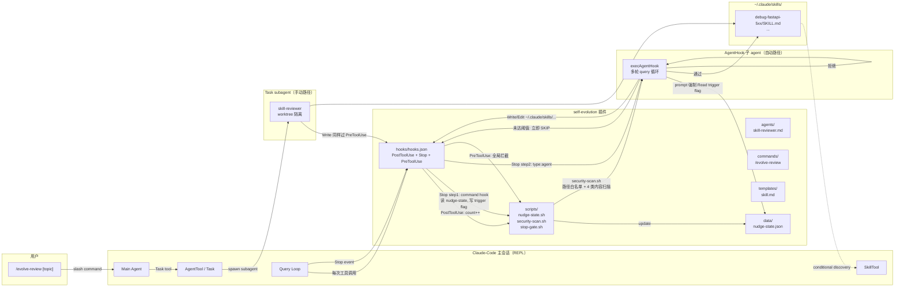
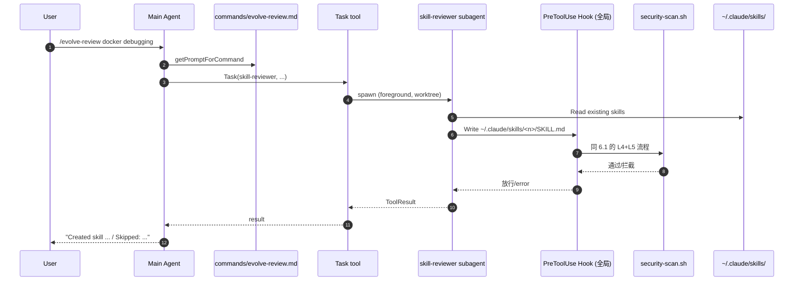

# Self-Evolution 插件设计 v3（AgentHook + 硬门控路线）

**Date:** 2026-05-08
**Status:** Draft
**Owner:** lijunyi
**Target:** Claude-Code v1.x（plugin marketplace 兼容）
**Supersedes:** [`2026-05-08-self-evolution-design-v2.md`](./2026-05-08-self-evolution-design-v2.md)（v2 用 prompt 软门控，已被 v3 的硬门控方案替代）
**Predecessor:** [`2026-05-07-self-evolution-design.md`](./2026-05-07-self-evolution-design.md)（v1 spawn 路线，已废弃）

> 在 v2 双路径架构（自动 AgentHook + 手动 Task subagent）的基础上，**把所有可硬化的门控都改回代码层硬实现**：路径白名单（全局 PreToolUse）、内容扫描（`security-scan.sh` 强制）、频率半硬门控（PostToolUse 计数 + Stop 前置 command hook + 状态文件）。v2 的 prompt 软门控降级为兜底，不再作为唯一防线。

---

## 一、概述（Summary）

v3 的核心动机是**把 v2 中"靠 AgentHook prompt 自我约束"的几个位置改回代码层硬约束**——理由是：prompt 软门控对模型不可靠（80% 命中），而本插件触及的是"自动写入用户级 skills 目录"这种敏感操作，应该用 hook config 层、文件系统层、状态机层的硬约束兜底，prompt 仅作为补充。

### v3 硬门控覆盖范围

| 维度 | v2 实现 | **v3 实现** | 说明 |
|------|--------|-----------|------|
| **路径白名单**（reviewer 写不出 `~/.claude/skills/`） | AgentHook prompt 内自我约束 | **全局 PreToolUse hook + `security-scan.sh` 路径检查** | 在 `hooks.json` 顶层配 PreToolUse，对所有 Write/Edit/MultiEdit 强制走 `security-scan.sh`；非白名单路径直接 `exit 2` block。AgentHook 子 agent 与手动 subagent 都生效 |
| **内容扫描**（4 类危险模式） | AgentHook prompt 内自我约束 | **复用上述全局 PreToolUse 链路** | `security-scan.sh` 内做 prompt-injection / 危险 bash / secret / oversize 检查，违规 `exit 2` block |
| **频率门控**（不每次 Stop 都跑） | AgentHook prompt 自己 SKIP | **PostToolUse 计数（command hook）+ Stop 前置 command hook + 状态文件 + AgentHook prompt 强制读状态文件** | 半硬：未达阈值时 AgentHook 仍触发但 ≤5s 内由 prompt 强制 SKIP；完全代码层硬门控做不到（见 §8.7 详细解释） |
| **递归触发** | `disallowedTools: [Task]` + `ALL_AGENT_DISALLOWED_TOOLS` | 不变 | v2 已是硬门控 |

### 双路径架构（与 v2 一致）

| 路径 | 触发 | 实现 |
|------|------|------|
| **自动审查** | Stop hook | hooks.json 配 `type: 'agent'` |
| **手动审查** | `/evolve-review [topic]` | command → Task → `skill-reviewer` subagent |

两条路径共用 `agents/skill-reviewer.md` 的决策规则（CREATE/UPDATE/SKIP + 命名规范），只在执行壳上分叉。**v3 路径硬门控走全局 PreToolUse 同时覆盖两条路径**，所以手动路径不再额外挂 agent frontmatter PreToolUse（避免双重扫描）。

### 显式不做（与 v2 一致）

- 事实记忆 / 情景记忆（已被原生覆盖）
- 修改 `MEMORY.md`（破坏 prefix cache）
- skill 评分 / 跨 skill 自动合并 / 自动删除（v3+ 或离线工具）
- 完全代码层频率硬门控（见 §8.7：在 AgentHook 路线下技术上做不到，需放弃 AgentHook 才能实现）

---

## 二、关键决策记录（Decision Log）

| # | 决策点 | 选择 | 备选 | 理由 |
|---|--------|------|------|------|
| D1 | Self-evolution 范围 | 仅过程记忆（skills） | 含事实+情景 | 事实/情景已被原生覆盖 |
| D2 | reviewer 启动方式 | 自动用 AgentHook，手动用 Task subagent | (a) v1 spawn `claude --headless`；(b) `additionalContext` | AgentHook 与 `extractMemories` 的 forked-agent 哲学一致，in-session 优势明显 |
| D3 | Skill 命名风格 | 扁平 + category 前缀 | 嵌套 | loader 只扫一层 |
| D4 | v1 范围 | 1 hook（agent type）+ 1 命令 + 1 agent 定义 + 2 scripts | — | — |
| **D5** | **频率门控** | **半硬：PostToolUse 计数 + Stop 前置 command hook + AgentHook prompt 强制读状态文件** | (a) v2 的纯 prompt 软门控；(b) 完全代码硬门控（需放弃 AgentHook） | hooks engine 没有"前 hook 阻断后 hook"协议，AgentHook 一旦在 hooks.json 里声明就会被触发；半硬方案让未达阈值时 AgentHook ≤5s 快速 SKIP，比 v2 软门控节省一个数量级 token |
| D6 | 写入位置 | 用户级 `~/.claude/skills/` | 仅项目级 | 跨项目积累 |
| D7 | 手动 subagent 隔离 | `isolation: worktree`（实施时验证字段可用） | 无 | 手动路径有 worktree 隔离；自动路径靠 ALL_AGENT_DISALLOWED_TOOLS + 全局 PreToolUse |
| D8 | reviewer 是否能调 Task | 手动 `disallowedTools: [Task]`；AgentHook 由 `ALL_AGENT_DISALLOWED_TOOLS` 自动过滤 | — | 防递归 |
| D9 | 模板存放 | `templates/skill.md` | `skills/skill-template/SKILL.md` | 防止被 loader 当 skill |
| D10 | 本会话可见性 | 自动生成 skill 默认 `paths: ["**/*"]` | 下次会话 | 自进化的价值在本会话下一轮可用 |
| D11 | AgentHook 输出语义 | 永远返回 `ok: true`，决策写进 `reason` | 用 `ok: false` 表示 SKIP | `ok: false` 会 blocking 主对话 |
| D12 | PreCompact / SessionEnd | 默认仅挂 Stop，Day 1 验证后再决定 | 一开始就挂 | `executeHooksOutsideREPL` 对 `type: 'agent'` 直接 `succeeded: false` |
| **D13** | **路径白名单实现** | **全局 PreToolUse hook（hooks.json 顶层）+ 不在 agent frontmatter 重复挂** | (a) v2 的 prompt 软约束；(b) v1 在 agent frontmatter 挂 PreToolUse | AgentHook 不读 agent frontmatter；唯一统一覆盖两条路径的方法是全局 PreToolUse；副作用是用户手动编辑 `~/.claude/skills/` 也会被扫描，但这是 feature（保护用户不写危险 skill） |
| **D14** | **PreToolUse `if` filter 范围** | **`Write\|Edit\|MultiEdit` matcher，不加 `if` 字段** | (a) `if: "Write(~/.claude/skills/**)"` 仅匹配 skills 目录；(b) 完全无过滤 | 选项 (a) 会导致"写非 skills 路径"完全不扫描——reviewer 越权写入 `~/.bashrc` 不会被发现，路径白名单破功；选 matcher 拦所有 Write，scan 内做路径白名单判断，主 agent 写正常代码时 scan 早退（target 不在 skills 目录直接 exit 0），性能影响 < 50ms |

---

## 三、架构总览（Architecture）

### 3.1 系统上下文



**v3 与 v2 的关键架构差异**：

1. **回归 PostToolUse 计数 + 状态文件**：恢复 v1 的 `nudge-state.sh` 和 `data/nudge-state.json`
2. **Stop hook 序列化**：先 command hook（前置门控）再 AgentHook，依靠状态文件做 IPC
3. **PreToolUse 升为全局硬防线**：hooks.json 顶层配 PreToolUse，对 Write/Edit/MultiEdit 强制走 `security-scan.sh`；同时对自动路径（AgentHook）和手动路径（Task subagent）生效
4. **Agent frontmatter 不再挂 PreToolUse**：v3 去除 v1 在 `agents/skill-reviewer.md` frontmatter 上的 PreToolUse 配置——避免与全局 PreToolUse 重复扫描

---

## 四、物理目录结构

```
~/.claude/plugins/self-evolution/
├── plugin.json
├── README.md
├── LICENSE
├── agents/
│   └── skill-reviewer.md                # 手动路径用，不挂 PreToolUse
├── commands/
│   └── evolve-review.md                 # /evolve-review [topic]
├── hooks/
│   └── hooks.json                       # PostToolUse + Stop（command + agent）+ PreToolUse
├── templates/
│   └── skill.md
├── scripts/
│   ├── nudge-state.sh                   # ★ v1 复活：PostToolUse 计数器
│   ├── stop-gate.sh                     # ★ 新增：Stop 前置 command hook，决定是否触发 AgentHook
│   └── security-scan.sh                 # ★ v1 升级：全局 PreToolUse 硬防线
└── data/                                # ★ v1 复活：运行时状态
    └── nudge-state.json                 # 每个 session 的工具调用计数
```

**与 v2 的目录差异（部分回归 v1）**：

| 文件 | v2 状态 | v3 状态 | 原因 |
|------|--------|--------|------|
| `scripts/nudge-state.sh` | 删除 | **恢复** | D5 半硬频率门控需要 |
| `scripts/stop-gate.sh` | — | **新增** | Stop 前置 command hook，决定是否在状态文件里写 trigger flag |
| `scripts/security-scan.sh` | opt-in | **升为强制** | D13 全局 PreToolUse 硬防线 |
| `data/nudge-state.json` | 删除 | **恢复** | 计数持久化 |
| `data/review-log.jsonl` | — | 不引入 | AgentHook 已有原生 telemetry |

---

## 五、组件详细设计

### 5.1 `plugin.json`

```json
{
  "name": "self-evolution",
  "version": "0.3.0",
  "description": "Auto-curate ~/.claude/skills/ from your conversations via in-session AgentHook with hard-gated security and frequency control.",
  "author": {
    "name": "lijunyi",
    "url": "https://github.com/lijunyi"
  },
  "homepage": "https://github.com/lijunyi/claude-code-self-evolution",
  "license": "MIT",
  "keywords": ["skills", "self-improving", "memory", "automation", "agent-hook"],
  "components": ["agents", "commands", "hooks"],
  "agentsPath": "agents",
  "commandsPath": "commands",
  "hooksPath": "hooks/hooks.json",
  "settings": {
    "nudgeIntervalToolCalls": 10,
    "skillTargetScope": "user",
    "categoryWhitelist": ["debug", "refactor", "test", "deploy", "data", "web", "cli", "meta"],
    "maxSkillSizeBytes": 15360,
    "reviewerModel": "inherit"
  }
}
```

**与 v2 的差异**：

- 恢复 `nudgeIntervalToolCalls: 10`（v1 字段，v2 删除）
- 删除 v2 的 `enableSecurityScanForManualPath`：v3 全局 PreToolUse 已统一覆盖两条路径，无需 opt-in 字段

### 5.2 Agents

#### 5.2.1 `agents/skill-reviewer.md`（手动路径用，**v3 不挂 frontmatter PreToolUse**）

```markdown
---
name: skill-reviewer
description: Reviews recent conversation and creates/updates a skill if a reusable, non-trivial workflow was demonstrated. Invoked manually via /evolve-review or as a Task subagent.
isolation: worktree
model: inherit
effort: low
maxTurns: 6
permissionMode: acceptEdits
tools: [Read, Write, Edit, Glob, Grep, Bash]
disallowedTools: [Task, WebFetch, WebSearch]
---

You are a Skill Reviewer. Review the conversation provided to you and decide
whether to CREATE / UPDATE / SKIP a skill.

# Decision Rules

## SKIP if any of:
- Trivial task (single tool call, ≤2 logical steps)
- One-off context (specific user, one-time data, sensitive info)
- Conversation has unresolved errors or incomplete state

## UPDATE existing skill if:
- A skill with similar `category-name` exists in `~/.claude/skills/`
- The new approach refines / extends the existing one
- Use Edit tool to modify in place; preserve frontmatter

## CREATE new skill if:
- Novel approach, ≥3 logical steps
- Generalizable to a class of tasks (not one-shot)
- Doesn't fit any existing skill

## QUALITY GATE:
- Clarity: workflow is executable without rereading the original transcript
- Generality: no private paths, one-off project facts, secrets, user-specific data
- Activation: `description` and `when_to_use` narrow enough that `paths: ["**/*"]` won't spam unrelated tasks

# Naming Convention

Skill directory: `<category>-<kebab-case-name>`, category ∈ {debug, refactor, test, deploy, data, web, cli, meta}

# Frontmatter

```yaml
---
name: <category>-<name>
description: <one sentence, ≤120 chars>
when_to_use: |
  <trigger condition + examples>
paths: ["**/*"]
allowed-tools: Read Bash Edit
version: "1.0.0"
---
```

# Output Format

After your final action, output ONE of:

```
CREATED: <category-name>
UPDATED: <category-name>
SKIPPED: <reason>
```

# Constraints

NOTE: A global PreToolUse hook will independently enforce path whitelist
(only `~/.claude/skills/<name>/SKILL.md` is writable) and content scanning
(prompt-injection / dangerous bash / secrets / oversize). If you attempt to
write outside the whitelist or include dangerous content, the Write tool
will fail with `BLOCKED: ...` — do NOT retry, output `SKIPPED: hard_gate_blocked`.
```

> **v2 → v3 改动**：删除 frontmatter 上的 `hooks.PreToolUse`（v1 配置）。v3 用全局 PreToolUse 替代，避免双重扫描。新增"NOTE"段告知 reviewer 全局硬门控存在，让它在被 block 时直接 SKIP 不重试。

### 5.3 Commands（与 v2 一致）

```markdown
---
description: Manually trigger skill review on the current conversation.
allowed-tools: Task
argument-hint: "[topic]"
---

Use the Task tool to launch the `skill-reviewer` subagent.

Pass these inputs:
- Topic focus (optional, may be empty): $ARGUMENTS
- Conversation transcript: the last 30 turns of the current session
- Existing skills directory: ~/.claude/skills/

After the subagent completes, summarize what action was taken in ONE sentence.
```

### 5.4 `hooks/hooks.json`（v3 核心，三层硬门控）

```json
{
  "PostToolUse": [
    {
      "matcher": "*",
      "hooks": [
        {
          "type": "command",
          "command": "${CLAUDE_PLUGIN_ROOT}/scripts/nudge-state.sh --event=post-tool-use",
          "async": true,
          "timeout": 2
        }
      ]
    }
  ],
  "Stop": [
    {
      "hooks": [
        {
          "type": "command",
          "command": "${CLAUDE_PLUGIN_ROOT}/scripts/stop-gate.sh",
          "timeout": 3,
          "statusMessage": "evolve: gate"
        },
        {
          "type": "agent",
          "prompt": "You are a self-evolution reviewer for the conversation that just stopped.\n\nFIRST STEP — frequency gate (MUST do this before anything else):\n  1. Read $CLAUDE_PLUGIN_ROOT/data/trigger-flag-${session_id}.json (path provided in $ARGUMENTS).\n  2. If the file does NOT exist, immediately call StructuredOutput with ok:true reason:\"SKIPPED: nudge_gate_not_met\". Do not read transcript, do not list skills.\n  3. If the file exists, proceed to step 2.\n\nSECOND STEP — review:\n  Read transcript at the path in $ARGUMENTS, list ~/.claude/skills/, decide CREATE / UPDATE / SKIP.\n\nSKIP UNLESS the conversation demonstrates a reusable, non-trivial workflow (≥3 logical steps, generalizable, no one-off data).\n\nIf CREATE / UPDATE:\n  - Naming: <category>-<kebab-name>, category ∈ {debug, refactor, test, deploy, data, web, cli, meta}\n  - Required frontmatter: name, description (≤120 chars), when_to_use, paths:[\"**/*\"], version:\"1.0.0\"\n  - Write to ~/.claude/skills/<category-name>/SKILL.md ONLY. The global PreToolUse hook will hard-block any other path or dangerous content; if you receive 'BLOCKED: ...' from a Write tool call, do NOT retry — call StructuredOutput with ok:true reason:\"SKIPPED: hard_gate_blocked: <short_reason>\".\n\nTHIRD STEP — output protocol:\n  ALWAYS call StructuredOutput with ok:true (NEVER ok:false; ok:false would block the main conversation).\n  Encode decision in reason: \"CREATED: <name>\" / \"UPDATED: <name>\" / \"SKIPPED: <reason>\".",
          "timeout": 90,
          "model": "inherit",
          "statusMessage": "evolve: reviewing"
        },
        {
          "type": "command",
          "command": "${CLAUDE_PLUGIN_ROOT}/scripts/stop-gate.sh --cleanup",
          "timeout": 2,
          "async": true
        }
      ]
    }
  ],
  "PreToolUse": [
    {
      "matcher": "Write|Edit|MultiEdit",
      "hooks": [
        {
          "type": "command",
          "command": "${CLAUDE_PLUGIN_ROOT}/scripts/security-scan.sh",
          "timeout": 10
        }
      ]
    }
  ]
}
```

**三层硬门控解读**：

| 层 | hooks.json 位置 | 类型 | 硬度 | 作用 |
|----|---------------|------|------|------|
| **L1 频率半硬** | `PostToolUse` + `Stop[0]` | command | 半硬 | PostToolUse 计数；Stop[0] 检查计数，达阈值时 touch `trigger-flag-{session_id}.json`，未达阈值不创建 |
| **L2 执行壳** | `Stop[1]` | agent | — | AgentHook prompt FIRST STEP 强制 Read trigger-flag；不存在 → 立即 SKIP |
| **L3 状态清理** | `Stop[2]` | command (async) | — | 不论 reviewer 走到哪步，cleanup trigger-flag 避免泄漏到下次 |
| **L4 路径白名单** | `PreToolUse` | command | 全硬 | 拦截所有 Write/Edit/MultiEdit，调 `security-scan.sh`，target 不在 `~/.claude/skills/` 直接 `exit 2` block |
| **L5 内容扫描** | `PreToolUse` | command | 全硬 | 复用 L4 的 `security-scan.sh`，prompt-injection / 危险 bash / secret / oversize 全部 `exit 2` block |

**为什么是"半硬"而非"全硬"频率门控**：见 §8.7。

### 5.5 Scripts

#### 5.5.1 `scripts/nudge-state.sh`（v1 复活，POSIX 锁不变）

```bash
#!/usr/bin/env bash
# 维护每个 session 的工具调用计数器。
set -euo pipefail

PLUGIN_DIR="${CLAUDE_PLUGIN_ROOT:-$HOME/.claude/plugins/self-evolution}"
STATE_FILE="$PLUGIN_DIR/data/nudge-state.json"
LOCK_DIR="$STATE_FILE.lock"
THRESHOLD="${SELF_EVOLUTION_NUDGE_INTERVAL:-10}"

mkdir -p "$(dirname "$STATE_FILE")"
[ -f "$STATE_FILE" ] || echo '{}' > "$STATE_FILE"

if [[ "${1:-}" == --event=* ]]; then
    ACTION="${1#--event=}"
    HOOK_INPUT=$(cat)
    SESSION_ID=$(echo "$HOOK_INPUT" | jq -r '.session_id // empty')
else
    SESSION_ID="${1:?Usage: nudge-state.sh <session-id> <action> | --event=post-tool-use}"
    ACTION="${2:-should-review}"
fi

[ -n "$SESSION_ID" ] || exit 0

# POSIX 原子锁
while ! mkdir "$LOCK_DIR" 2>/dev/null; do sleep 0.05; done
trap 'rmdir "$LOCK_DIR"' EXIT

case "$ACTION" in
    post-tool-use)
        CURRENT=$(jq -r --arg s "$SESSION_ID" '.[$s].count // 0' "$STATE_FILE")
        NEW=$((CURRENT + 1))
        if [ "$NEW" -ge "$THRESHOLD" ]; then
            jq --arg s "$SESSION_ID" '.[$s].count = 0 | .[$s].pending_review = true' \
                "$STATE_FILE" > "$STATE_FILE.tmp" && mv "$STATE_FILE.tmp" "$STATE_FILE"
        else
            jq --arg s "$SESSION_ID" --argjson n "$NEW" '.[$s].count = $n' \
                "$STATE_FILE" > "$STATE_FILE.tmp" && mv "$STATE_FILE.tmp" "$STATE_FILE"
        fi
        ;;
    consume-pending)
        PENDING=$(jq -r --arg s "$SESSION_ID" '.[$s].pending_review // false' "$STATE_FILE")
        if [ "$PENDING" = "true" ]; then
            jq --arg s "$SESSION_ID" '.[$s].pending_review = false' \
                "$STATE_FILE" > "$STATE_FILE.tmp" && mv "$STATE_FILE.tmp" "$STATE_FILE"
            echo "TRIGGER"
        else
            echo "SKIP"
        fi
        ;;
    *)
        echo "Unknown action: $ACTION" >&2; exit 1 ;;
esac
exit 0
```

> **与 v1 的差异**：把 `should-review` 重命名为 `consume-pending`（语义更清晰：消费 pending 标记并返回结果）。锁/jq 实现保持 v1 设计。

#### 5.5.2 `scripts/stop-gate.sh`（v3 新增）

```bash
#!/usr/bin/env bash
# Stop hook 前置门控：消费 nudge pending 标记，决定是否为 AgentHook 写 trigger flag。
# 第二次调用（--cleanup）由 Stop[2] 触发，清理 trigger flag。
set -euo pipefail

PLUGIN_DIR="${CLAUDE_PLUGIN_ROOT:-$HOME/.claude/plugins/self-evolution}"
DATA_DIR="$PLUGIN_DIR/data"
mkdir -p "$DATA_DIR"

HOOK_INPUT=$(cat)
SESSION_ID=$(echo "$HOOK_INPUT" | jq -r '.session_id // empty')
TRANSCRIPT_PATH=$(echo "$HOOK_INPUT" | jq -r '.transcript_path // empty')
FLAG_FILE="$DATA_DIR/trigger-flag-$SESSION_ID.json"

if [ "${1:-}" = "--cleanup" ]; then
    rm -f "$FLAG_FILE"
    exit 0
fi

[ -n "$SESSION_ID" ] || exit 0

DECISION=$("$PLUGIN_DIR/scripts/nudge-state.sh" "$SESSION_ID" consume-pending)
if [ "$DECISION" = "TRIGGER" ]; then
    jq -n --arg ts "$(date -u +%Y-%m-%dT%H:%M:%SZ)" \
          --arg session "$SESSION_ID" \
          --arg transcript "$TRANSCRIPT_PATH" \
          '{ts: $ts, session_id: $session, transcript_path: $transcript}' \
        > "$FLAG_FILE"
fi
# 总是 exit 0：本 hook 不阻塞主对话；AgentHook prompt 自己读 flag 决定 SKIP/RUN
exit 0
```

> **设计要点**：`stop-gate.sh` 永远 `exit 0`，不阻塞主对话。AgentHook prompt 第一步强制读 `trigger-flag-{session_id}.json`，文件不存在就立即 SKIP——这是 §8.7 解释的"半硬门控"实现。flag 文件的存在与否由 `nudge-state.sh consume-pending` 严格决定，是真正的代码层硬条件。

#### 5.5.3 `scripts/security-scan.sh`（v1 升级，全局 PreToolUse）

```bash
#!/usr/bin/env bash
# 全局 PreToolUse hook：拦截 Write/Edit/MultiEdit。
# v3 升级：从 agent frontmatter PreToolUse 移到全局 hooks.json PreToolUse。
# 同时覆盖 AgentHook 子 agent 与手动 Task subagent。
set -euo pipefail

HOOK_INPUT=$(cat)
TOOL_NAME=$(echo "$HOOK_INPUT" | jq -r '.tool_name // .toolName // empty')
TOOL_INPUT=$(echo "$HOOK_INPUT" | jq -c '.tool_input // .toolInput // {}')
TARGET=$(echo "$TOOL_INPUT" | jq -r '.file_path // .path // empty')

# 路径白名单：仅 ~/.claude/skills/ 下的 SKILL.md 允许写
case "$TARGET" in
    "$HOME"/.claude/skills/*/SKILL.md) ;;
    *)
        # 不在白名单——但要区分两种情况：
        # 1. 主 agent 写正常项目代码（不是写 ~/.claude/skills/）：早退放行
        # 2. reviewer 越权写非 ~/.claude/skills/ 路径：block
        # 我们没法在 hook input 里知道当前是哪个 agent，但可以反向判断：
        # 如果 TARGET 在 ~/.claude/ 目录下但不是 ~/.claude/skills/，说明大概率是越权
        case "$TARGET" in
            "$HOME"/.claude/*) 
                echo "BLOCKED: write to ~/.claude/ outside skills/ subdir is forbidden" >&2
                exit 2
                ;;
            *) 
                # 主 agent 写项目代码——本插件不应干涉，放行
                exit 0
                ;;
        esac
        ;;
esac

case "$TOOL_NAME" in
    Write)
        CONTENT=$(echo "$TOOL_INPUT" | jq -r '.content // empty')
        ;;
    Edit|MultiEdit)
        CONTENT=$(echo "$TOOL_INPUT" | jq -r '[.old_string, .new_string, (.edits[]?.new_string // empty)] | join("\n")')
        ;;
    *)
        exit 0
        ;;
esac

TMP=$(mktemp -t evolve-scan-XXXXXX)
printf '%s' "$CONTENT" > "$TMP"
trap 'rm -f "$TMP"' EXIT

# 1. Prompt injection
if grep -qiE '(ignore previous|disregard above|<\|im_start\|>|system:.*you are now)' "$TMP"; then
    echo "BLOCKED: prompt-injection pattern" >&2; exit 2
fi

# 2. 危险 Bash
if grep -qE 'rm -rf /( |$)|curl[^|]*\| *(ba)?sh|eval[[:space:]]+\$\(|wget[^|]*-O[[:space:]]*-' "$TMP"; then
    echo "BLOCKED: dangerous bash pattern" >&2; exit 2
fi

# 3. Secret 模式
if grep -qE '(sk-[A-Za-z0-9]{20,}|AKIA[0-9A-Z]{16}|-----BEGIN [A-Z ]+PRIVATE KEY-----|ghp_[A-Za-z0-9]{36})' "$TMP"; then
    echo "BLOCKED: secret leak pattern" >&2; exit 2
fi

# 4. 大小限制
SIZE=$(wc -c < "$TMP")
MAX_SIZE=${SELF_EVOLUTION_MAX_SKILL_SIZE:-15360}
if [ "$SIZE" -gt "$MAX_SIZE" ]; then
    echo "BLOCKED: file too large ($SIZE > $MAX_SIZE bytes)" >&2; exit 2
fi

exit 0
```

**v1 → v3 升级要点**：

1. **覆盖范围扩大**：从 agent frontmatter 移到全局 hooks.json，AgentHook 子 agent 与手动 Task subagent 共同覆盖
2. **路径白名单分层判断**：
   - 白名单内（`~/.claude/skills/<name>/SKILL.md`）：继续走 4 类内容扫描
   - 在 `~/.claude/` 但不在 `skills/`：reviewer 越权，block
   - 完全不在 `~/.claude/`：主 agent 正常写项目代码，早退放行
3. **拒绝退出码**：`exit 2`（Claude-Code hook 协议中表示 block 此次工具调用）
4. **早退性能**：主 agent 99% 的 Write 都在项目代码路径，命中第一个 case 后早退（< 50ms）

---

## 六、数据流与关键时序

### 6.1 自动触发完整时序（v3，含三层硬门控）

```mermaid
sequenceDiagram
    autonumber
    participant User
    participant Main as Main Agent
    participant PostHook as PostToolUse Hook
    participant Nudge as nudge-state.sh
    participant Data as data/nudge-state.json
    participant Stop as Stop Hook Engine
    participant Gate as stop-gate.sh
    participant Flag as data/trigger-flag-{sid}.json
    participant ExecAgent as execAgentHook
    participant SubQuery as query() 子循环
    participant PreHook as PreToolUse Hook
    participant Scan as security-scan.sh
    participant FS as ~/.claude/skills/

    User->>Main: 用户消息
    Main->>Main: 主对话 + 工具调用
    loop 每次工具调用后
        Main->>PostHook: PostToolUse event (async)
        PostHook->>Nudge: --event=post-tool-use
        Nudge->>Data: count++; if count>=10 set pending_review=true, reset count
    end
    Main-->>User: 回复
    Main->>Stop: Stop event

    rect rgb(240, 248, 255)
        Note over Stop,Flag: L1 频率半硬门控
        Stop->>Gate: Stop[0]: stop-gate.sh
        Gate->>Nudge: consume-pending
        Nudge->>Data: read & reset pending_review
        alt pending_review = false
            Nudge-->>Gate: SKIP
            Gate->>Gate: 不创建 flag, exit 0
        else pending_review = true
            Nudge-->>Gate: TRIGGER
            Gate->>Flag: 写 {ts, session_id, transcript_path}
            Gate->>Gate: exit 0
        end
    end

    rect rgb(248, 240, 248)
        Note over Stop,SubQuery: L2 AgentHook in-session
        Stop->>ExecAgent: Stop[1]: type:'agent', prompt 强制读 flag
        ExecAgent->>SubQuery: query() 启动

        SubQuery->>Flag: Read trigger-flag-{sid}.json
        alt flag 不存在
            SubQuery->>SubQuery: 立即调 StructuredOutput<br/>{ok:true, reason:"SKIPPED: nudge_gate_not_met"}
            Note over SubQuery: ~3-5s + ~200 tokens
        else flag 存在
            SubQuery->>FS: Read transcript, list skills
            SubQuery->>SubQuery: 决策 CREATE / UPDATE / SKIP

            opt CREATE / UPDATE
                rect rgb(255, 240, 240)
                    Note over SubQuery,FS: L4+L5 路径+内容硬门控
                    SubQuery->>PreHook: Write ~/.claude/skills/<n>/SKILL.md
                    PreHook->>Scan: security-scan.sh
                    Scan->>Scan: 路径白名单判断
                    alt 路径不在 skills/
                        Scan-->>PreHook: exit 2 BLOCKED
                        PreHook-->>SubQuery: tool error: "BLOCKED: ..."
                        SubQuery->>SubQuery: 不重试，调 SO<br/>{ok:true, reason:"SKIPPED: hard_gate_blocked"}
                    else 路径合法
                        Scan->>Scan: 4 类内容扫描
                        alt 内容危险
                            Scan-->>PreHook: exit 2 BLOCKED
                            PreHook-->>SubQuery: tool error
                            SubQuery->>SubQuery: 不重试，调 SO SKIPPED
                        else 内容安全
                            Scan-->>PreHook: exit 0 OK
                            PreHook-->>SubQuery: 放行
                            SubQuery->>FS: 实际写入
                            SubQuery->>SubQuery: 调 SO {ok:true, reason:"CREATED: <n>"}
                        end
                    end
                end
            end
        end

        SubQuery-->>ExecAgent: structured_output
        ExecAgent-->>Stop: HookResult { outcome:'success' }
    end

    rect rgb(240, 248, 240)
        Note over Stop,Flag: L3 状态清理（async）
        Stop->>Gate: Stop[2]: stop-gate.sh --cleanup (async)
        Gate->>Flag: rm -f trigger-flag-{sid}.json
    end

    Stop-->>Main: 主流程继续
```

### 6.2 手动触发时序（与 v2 一致，但写入路径同样过 L4+L5）



> 手动路径**不经过频率门控**（用户主动触发就是想跑）；但路径+内容硬门控（L4+L5）通过全局 PreToolUse 同样生效。

### 6.3 Skill 被发现并使用（与 v2 一致）

`paths: ["**/*"]` 进入 conditional discovery，本会话下一轮文件触达后 metadata 进入 `dynamicSkills`。

---

## 七、命名规范

与 v2 完全一致。略。

---

## 八、关键技术问题与解决方案

### 8.1 新 Skill 的进程内可见性

与 v2 §8.1 一致。

### 8.2 嵌套分类目录不被支持

与 v2 §8.2 一致。

### 8.3 Reviewer 递归触发

与 v2 §8.3 一致：`ALL_AGENT_DISALLOWED_TOOLS` 自动过滤 Task；手动 path `disallowedTools: [Task]`。

### 8.4 Prefix Cache 保护

与 v2 §8.4 一致。

### 8.5 AgentHook 输出 `ok: false` 会 blocking 主对话

与 v2 §8.5 一致——D11 的 prompt 硬约束 + 失败兜底协议。v3 prompt 在三处冗余强调"NEVER ok:false"。

### 8.6 AgentHook 在 Stop 之外的事件是否可用

与 v2 §8.6 一致——D12，默认仅挂 Stop。

### 8.7 频率门控为什么"只能半硬"（v3 关键设计说明）

**问题**：用户期望"未达阈值时 AgentHook 完全不被触发，零成本"。

**结论**：在 AgentHook 路线下，技术上做不到。证据：

1. `src/utils/hooks.ts` 的 hook engine 对同一事件按声明顺序执行所有 hooks，**没有"前一个 hook 决定后一个 hook 是否执行"的协议**
2. `exit 2` 在 command hook 里表示 blocking error，会被聚合到 hook engine 的最终结果，但**不会跳过同一事件下的后续 hooks**
3. `if` 字段用"权限规则语法"（如 `Bash(git *)`）评估 `tool_name + tool_input`——**Stop 事件 hook input 没有 tool_name**，`if` 字段对 Stop 不生效
4. 因此 `Stop[1]` 的 AgentHook 一旦在 hooks.json 里声明，每次 Stop event 都会被触发

**v3 的半硬实现**：

| 层级 | 作用 | 硬度 |
|------|------|------|
| `PostToolUse` 计数 | 工具调用计数持久化到 `data/nudge-state.json` | **代码层硬** |
| `Stop[0]` `stop-gate.sh` | 消费 pending 标记，决定是否 touch `trigger-flag-{sid}.json` | **代码层硬**（文件系统层判断） |
| AgentHook prompt FIRST STEP | 强制读 `trigger-flag-{sid}.json`，不存在立即 SKIP | **prompt 层强约束**（≤5s + ~200 tokens 代价） |
| `Stop[2]` cleanup | 清理 flag 防泄漏 | 代码层硬 |

**未达阈值时的实际成本**：~3-5s + ~200 tokens（vs v2 软门控的 5-15s + 500-2k tokens）。这是相对 v2 节省一个数量级，但相对"完全不触发"仍有非零开销。

**如果未来需要完全代码层频率硬门控**：唯一路径是放弃 AgentHook 改回 v1 spawn 方案——`Stop[0]` 的 command hook 直接 spawn `claude --headless`，整个流程脱离 hook engine 调度。这等于推翻 D2，是 v4 路线图选项。

### 8.8 全局 PreToolUse 对主 agent 的性能影响

**问题**：全局 `Write|Edit|MultiEdit` matcher 意味着主 agent 写任何文件都会调一次 `security-scan.sh`。

**v3 设计的早退**：

```bash
case "$TARGET" in
    "$HOME"/.claude/skills/*/SKILL.md) ;;  # 走完整 4 类扫描
    *)
        case "$TARGET" in
            "$HOME"/.claude/*) exit 2 ;;   # 在 ~/.claude/ 但不在 skills/：拦
            *) exit 0 ;;                    # 项目代码：早退放行（< 50ms）
        esac
        ;;
esac
```

主 agent 99%+ 的 Write 落在项目代码路径，命中早退分支，shell 启动 + jq 解析 + 两个 case 比较的总成本 < 50ms。可接受。

### 8.9 PostToolUse 计数 + Stop 序列的并发竞争

**问题**：用户最后一次工具调用 → PostToolUse 异步更新计数 → 主 agent 立即输出 final response → Stop event。如果 PostToolUse 的 `nudge-state.sh` 写还没完成，`stop-gate.sh consume-pending` 读到的是旧状态。

**缓解**：

1. PostToolUse hook 用 `async: true` + `timeout: 2`：在 2s 内完成更新（jq 写 100 字节文件通常 < 50ms）
2. `nudge-state.sh` 用 POSIX `mkdir` 锁，并发写不会损坏
3. 如果真的赶上极少数边界 case（PostToolUse 还没完成 Stop 已经触发），下一次 Stop 时计数会被 +1 再判断一次——延迟一轮触发可接受

### 8.10 cleanup 的失败处理

**问题**：`Stop[2]` `--cleanup` 是 async 的，如果失败，`trigger-flag-{sid}.json` 残留。下次 Stop 即使未达阈值也会因为残留 flag 触发 reviewer。

**缓解**：

1. `stop-gate.sh --cleanup` 永远 `rm -f`（即使文件不存在也 exit 0）
2. flag 文件名带 `session_id`，新会话不受老 session 残留影响
3. 同一 session 内 cleanup 失败 → 下次 Stop 计数仍要从 0 涨到阈值才会再 set pending_review=true，所以最多多触发一次审查
4. 可选：`stop-gate.sh consume-pending` 同时检查并 unlink 超过 1 小时的旧 flag（兜底防泄漏）

---

## 九、实施任务分解（约 6 天，比 v2 多 1 天，比 v1 节省 ~2 天）

### Day 1：可行性验证

| 任务 | 验证 |
|-----|------|
| 写最小 AgentHook（Stop event，prompt: `"Return ok:true reason:'hello'"`） | hook 触发，无 blocking |
| 同样 AgentHook 测 PreCompact / SessionEnd | D12：哪些事件能挂 |
| 测 reviewer 故意 ok:false | 验证 §8.5 的紧迫性 |
| 测全局 PreToolUse `if`-less 的性能（让主 agent 写 100 个文件） | 单次 < 50ms 早退；总开销可接受 |

### Day 2：自动路径打通（含频率半硬门控）

| 任务 | 验证 |
|-----|------|
| `plugin.json` + 目录骨架 | install 成功 |
| `scripts/nudge-state.sh` + 单测 | mkdir 原子锁并发测试 OK |
| `scripts/stop-gate.sh` | 模拟 10 次工具调用后 trigger-flag 出现，14 次后还是只有 1 个 flag（计数 reset） |
| `hooks.json` PostToolUse + Stop 序列 | 端到端：连续输入直到 10 次工具调用，Stop 后看到 reviewer 实际跑（非 SKIP） |

### Day 3：路径+内容硬门控

| 任务 | 验证 |
|-----|------|
| `scripts/security-scan.sh` v3 升级 | 红队 5 类 case：路径白名单 / prompt-injection / 危险 bash / secret / oversize 全部 exit 2 |
| `hooks.json` PreToolUse 全局拦截 | 让 reviewer 故意 Write 到 `/tmp/foo.md`、`~/.bashrc`、`~/.claude/skills/x/SKILL.md` 三种路径，前两种被 block，第三种走内容扫描 |
| 主 agent 正常写代码不被拦截 | 在主对话里让主 agent 写 `src/foo.ts`、`README.md`，全部放行且总开销 < 50ms |

### Day 4：手动路径

| 任务 | 验证 |
|-----|------|
| `agents/skill-reviewer.md`（不挂 frontmatter PreToolUse） | `/agents` 列出 |
| `commands/evolve-review.md` | `/evolve-review docker` 创建 skill |
| 手动路径同样过全局 PreToolUse | 让手动 reviewer 故意写非白名单路径，被拦 |

### Day 5：质量与稳健性

| 任务 | 验证 |
|-----|------|
| `templates/skill.md` | reviewer 引用模板生成的 skill 可读 |
| 红队完整测试集（≥ 20 个对话样本） | CREATE/UPDATE/SKIP 分布合理 |
| 递归触发防护测试 | reviewer 自身的 Write 不引发新 Stop hook 嵌套 |
| §8.10 cleanup 失败演练 | 手动留个旧 flag，下次 Stop 多触发一次（可接受），第三次正常 |

### Day 6：收尾与发布

| 任务 | 验证 |
|-----|------|
| Prefix cache 影响测试 | 与不装本插件时一致 |
| README + 排错（如何禁用 hook、清理 nudge-state、关闭硬门控） | — |
| Marketplace 发布 PR | — |

> **节省/增加的工作量**：
> - 相对 v2：增加 1 天用于 nudge-state 复活和 stop-gate 设计
> - 相对 v1：节省 ~2 天（不需要 spawn-reviewer.sh 链路、claude --headless API 验证、worktree 自动隔离调试）

---

## 十、验收标准

### 10.1 功能验收

| # | 验收点 | 方法 |
|---|--------|------|
| F1 | 手动 `/evolve-review` 能创建 SKILL.md | 跑非平凡任务后调命令 |
| F2 | 自动触发：连续 10 次工具调用后 Stop hook 触发实际审查（非 SKIP） | 监听 telemetry + 看 nudge-state |
| F3 | 未达阈值时 AgentHook 在 ≤ 5s 内 SKIP | telemetry `tengu_agent_stop_hook_*` 时长 |
| F4 | 新 skill 在本会话下一轮可见 | conditional discovery 激活 |
| F5 | reviewer 永远返回 ok:true，不 blocking 主对话 | 100 次连续 Stop event 无 blocking 注入 |
| F6 | reviewer 不能调 Task / WebFetch / WebSearch | `ALL_AGENT_DISALLOWED_TOOLS` 验证 |

### 10.2 性能验收

| # | 指标 | 目标 |
|---|------|------|
| P1 | AgentHook SKIP 路径耗时（trigger-flag 不存在） | < 5s |
| P2 | AgentHook CREATE 路径耗时 | < 60s |
| P3 | Stop hook 累积 timeout（含 stop-gate + AgentHook + cleanup） | ≤ 95s |
| P4 | 主 agent 单次 Write 经过全局 PreToolUse 早退的开销 | < 50ms |
| P5 | 主会话 prefix cache 命中率 | 与不装本插件时一致 |

### 10.3 安全验收（v3 升级到 100% 硬拦截）

| # | 验收点 | 方法 | v2 → v3 |
|---|--------|------|---------|
| S1 | reviewer 写不出 `~/.claude/skills/` 目录 | 红队让 reviewer 故意写 `/tmp/`、`~/.bashrc`、`~/.ssh/`，全部被全局 PreToolUse block | v2 软（≥80%）→ **v3 硬（100%）** |
| S2 | 4 类危险模式 100% 拦截 | 红队测试集 | v2 软（≥80%）→ **v3 硬（100%）** |
| S3 | reviewer 不能递归触发自己 | 自身 Write 不引发新 Stop hook 嵌套 | 不变 |
| S4 | 插件不注册模板为 skill | `plugin.json` 无 `skillsPath`，模板位于 `templates/` | 不变 |
| S5 | 主 agent 写正常项目代码不被误拦 | Day 3 验证 | v3 新增 |
| S6 | 频率门控真的能限制审查触发频率 | 单 session 100 次工具调用，审查只触发 10 次 | v3 新增（v2 无频率门控） |

---

## 十一、风险与开放问题

### 11.1 已知风险

| # | 风险 | 缓解 |
|---|------|------|
| R1 | AgentHook 在 PreCompact / SessionEnd 不可用 | D12：默认仅 Stop，Day 1 验证 |
| R2 | reviewer 遗忘 prompt 指令、返回 ok:false blocking 主会话 | F5 验收 + prompt 三处冗余强调 |
| R3 | 全局 PreToolUse 误伤主 agent 写正常代码 | §8.8 早退设计 + S5 验收；用户可通过 `disable_self_evolution_pretooluse=1` 环境变量临时关闭 |
| R4 | nudge-state.json 并发竞争导致计数偏差 | §8.9：mkdir 锁 + 容忍偶发延迟一轮 |
| R5 | trigger-flag 残留导致频率门控失效 | §8.10：cleanup 即使 async 失败也最多多触发一次；可选 1 小时超时清理 |
| R6 | AgentHook 跑满 90s 超时 | `execAgentHook` 自动 cancelled（非 blocking） |
| R7 | 用户手动编辑 `~/.claude/skills/` 也会过 security-scan.sh | feature（保护用户自己），文档说明可通过环境变量临时关闭 |

### 11.2 待确认问题（实施前）

1. **Q1**（最关键）：PreCompact / SessionEnd 上挂 AgentHook 是否被 `executeHooksOutsideREPL` 短路？（D12 / Day 1）
2. **Q2**：AgentHook 跑超时后主会话 spinner 状态？
3. **Q3**：`${CLAUDE_PLUGIN_ROOT}` 在 AgentHook prompt 字符串内是否被替换？（影响 prompt 里能否引用 `data/trigger-flag-...` 路径）
4. **Q4**：AgentHook 子 agent 的 transcript token 是否计入主会话 quota？
5. **Q5**（v3 新增）：hook engine 在同一 Stop 事件上多个 hooks 是否串行执行？如果并行，Stop[0] 还没写完 flag，Stop[1] AgentHook 已经启动 → flag 不存在导致误 SKIP。需 Day 1 验证 `executeHooks` 的串行/并行语义
6. **Q6**（v3 新增）：PostToolUse async hook 在 Stop event 之前是否一定完成？还是可能遗留？

### 11.3 v3 → v4 路线图

- **完全代码层频率硬门控**：评估是否值得放弃 AgentHook 改回 v1 spawn 路径（§8.7 唯一路径）
- **AgentHook 路径权限白名单细化**：研究 `getAppState().toolPermissionContext.alwaysAllowRules` 在 AgentHook 子 agent 中是否能注入路径白名单，进一步把 §8.8 的全局 PreToolUse 收窄
- **多设备同步**：`~/.claude/skills/` 与 git 仓库挂钩
- **Skill 使用统计**：PostToolUse hook 记录 SkillTool 调用次数
- **团队 skills**：基于 `teamMemorySync`
- **LLM 辅助 audit**：只读 `/evolve-audit`
- **与 `extractMemories` 协同**：reviewer 发现的"事实"走 memdir

---

## 附录 A：Hermes / v1 / v2 / v3 四栏对照

| Hermes 机制 | v1 (spawn) | v2 (软门控) | **v3 (硬门控)** |
|------------|----------|-----------|---------------|
| `_iters_since_skill >= 10` | `nudge-state.sh THRESHOLD=10` | 删除（prompt 软门控） | **`nudge-state.sh` 复活 + `stop-gate.sh` + `data/trigger-flag-{sid}.json`** |
| `_spawn_background_review` | hook spawn `claude --headless` | hooks.json `type: 'agent'` | **同 v2 + 前置 command hook 序列化** |
| `_SKILL_REVIEW_PROMPT` | `agents/skill-reviewer.md` body | hooks.json prompt + `agents/skill-reviewer.md` | **同 v2 + prompt FIRST STEP 强制读 trigger-flag** |
| `_security_scan_skill` | agent frontmatter PreToolUse + `security-scan.sh` | opt-in（默认关） | **全局 hooks.json PreToolUse + `security-scan.sh`（强制）** |
| `clear_skills_system_prompt_cache()` | `paths: ["**/*"]` | 同 | 同 |
| 防 reviewer 递归 | `disallowedTools: [Task]` + `EVOLVE_RECURSIVE_GUARD` | `ALL_AGENT_DISALLOWED_TOOLS` 自动 + 手动 disallowedTools | 同 v2 |
| Skill 路径 | `~/.claude/skills/<category-name>/SKILL.md` | 同 | 同 |
| `skill_manage` create/edit/delete | reviewer + `/evolve-review` | 同 | 同 |
| transcript 提取 | `extract-transcript.sh` 裁剪 | 删除（reviewer 自己 Read） | 同 v2 |
| 跨 session 状态 | `data/nudge-state.json` + 锁 | 删除 | **`data/nudge-state.json` 复活 + `data/trigger-flag-{sid}.json`** |
| 子进程隔离 | worktree | 自动无；手动 worktree | 同 v2 |
| 路径白名单实现 | agent frontmatter 内（仅 reviewer agent） | prompt 软约束 | **全局 PreToolUse（覆盖所有 agent）** |
| 内容扫描实现 | 同上 | prompt 软约束 | **全局 PreToolUse + `security-scan.sh` 强制** |
| 频率门控实现 | command hook spawn 检查 | prompt 软约束 | **半硬：command hook + 状态文件 + prompt 强制读** |

## 附录 B：相关文件索引

| 文件 | 用途 |
|------|------|
| `docs/superpowers/specs/2026-05-07-self-evolution-design.md` | v1 spec（spawn，已废弃） |
| `docs/superpowers/specs/2026-05-08-self-evolution-design-v2.md` | v2 spec（软门控，已被 v3 替代） |
| `docs/memory-system-comparison.md` | 记忆系统对比 |
| `claude-code/docs/deep/AGENT-HOOK.md` | AgentHook 机制深度解析 |
| `claude-code/docs/deep/HOOK-SYSTEM.md` | Hook 引擎深度解析（§11.2 Q5/Q6 验证依据） |
| `claude-code/docs/deep/PLUGIN-SYSTEM.md` | 插件四通道架构 |
| `claude-code/docs/deep/SKILL-SYSTEM.md` | Skills 系统 |
| `hermes-agent/docs/deep/self-evolution-learning-loop.md` | Hermes 自进化 |
| `claude-code/src/utils/hooks/execAgentHook.ts` | AgentHook 执行核心（D11/§8.5） |
| `claude-code/src/utils/hooks/hookHelpers.ts` | hookResponseSchema、StructuredOutput |
| `claude-code/src/schemas/hooks.ts` | AgentHookSchema、IfConditionSchema（D14 关键证据） |
| `claude-code/src/utils/hooks.ts` | executeHooks 主路径（§8.7 串行/并行语义验证） |
| `claude-code/src/services/extractMemories/extractMemories.ts` | forked-agent 模式（D2 哲学一致性） |
| `claude-code/src/tools/AgentTool/loadAgentsDir.ts` | 手动路径 agent 加载 |
| `claude-code/src/skills/loadSkillsDir.ts` | Skills 加载 |
| `claude-code/src/utils/plugins/loadPluginAgents.ts` | 插件 agent 加载 |

---

## 附录 C：v2 → v3 改动 changelog

| 章节 | v2 状态 | v3 状态 |
|------|--------|--------|
| 标题 | 软门控 | 硬门控 |
| §1 概述 | 双路径 + 软门控 | 双路径 + 三层硬门控覆盖表 |
| §2 决策 | D1-D12 | 新增 D13（路径白名单全局 PreToolUse）、D14（matcher 不加 if filter） |
| §3 架构 | AgentHook 单次 | 新增 PostToolUse 计数 + Stop 序列（command + agent + cleanup）+ 全局 PreToolUse |
| §4 目录 | 仅 `security-scan.sh`（opt-in） | 恢复 `nudge-state.sh`、`data/`；新增 `stop-gate.sh`；`security-scan.sh` 升为强制 |
| §5.1 plugin.json | 无 nudge 字段 | 恢复 `nudgeIntervalToolCalls`；删除 `enableSecurityScanForManualPath` |
| §5.2 agents | 不挂 PreToolUse（已是这样） | 同 v2，新增 NOTE 段告知全局硬门控 |
| §5.4 hooks.json | 单 Stop AgentHook | **PostToolUse 计数 + Stop 三步序列 + 全局 PreToolUse** |
| §5.5 scripts | 仅 `security-scan.sh` | 三个脚本：`nudge-state.sh`、`stop-gate.sh`、`security-scan.sh` |
| §6.1 时序 | AgentHook 单次 | 含 PostToolUse / Stop 序列 / 全局 PreToolUse 三阶段时序图 |
| §8 | 8.1-8.7 | 新增 §8.7（半硬频率门控解释）、§8.8（全局 PreToolUse 性能）、§8.9（PostToolUse 与 Stop 并发）、§8.10（cleanup 失败处理） |
| §9 实施 | 5 天 | **6 天**（+1 天 nudge-state 复活与全局 PreToolUse 调试） |
| §10.3 安全 | S1/S2 ≥ 80% | **S1/S2 100% 硬拦截**；新增 S5（主 agent 不被误拦）、S6（频率门控真的限频） |
| §11.2 待确认 | Q1-Q4 | 新增 Q5（hook engine 串行/并行）、Q6（PostToolUse async 与 Stop 时序） |
| §11.3 路线图 | "观察软门控成本" | 改为"评估是否值得回到 v1 spawn 实现完全代码硬门控" |
| 附录 A | 三栏对照 | **四栏对照**（Hermes / v1 / v2 / v3） |
