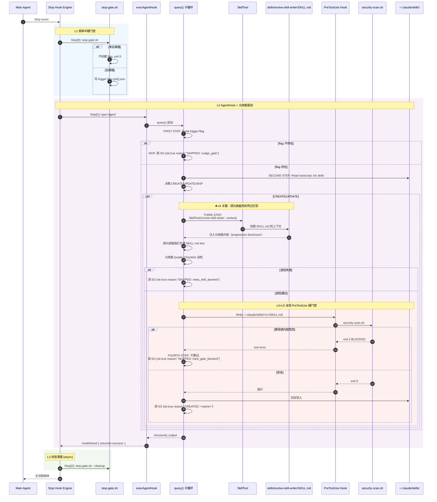
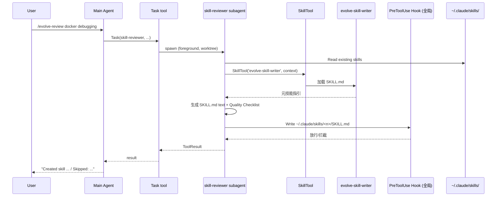

# Self-Evolution 插件设计 v4（AgentHook + 硬门控 + 元技能驱动）

**Date:** 2026-05-08
**Status:** Draft
**Owner:** lijunyi
**Target:** Claude-Code v1.x（plugin marketplace 兼容）
**Supersedes:** [`2026-05-08-self-evolution-design-v3.md`](./2026-05-08-self-evolution-design-v3.md)（v3 reviewer 直接 Write SKILL.md，v4 改为通过 SkillTool 调用元技能生成）
**Predecessors:** v2（软门控）/ v1（spawn 路线，已废弃）

> 在 v3 双路径 + 三层硬门控的基础上，**把"reviewer 自己写 SKILL.md 内容"的动作改为"reviewer 通过 SkillTool 调用插件自带的元技能 `evolve-skill-writer`"**——元技能内置 Anatomy / Progressive Disclosure / Description 写作规则 / Frontmatter Schema / Writing Patterns，避免 reviewer 凭记忆生成不规范内容。`evolve-skill-writer` 是 `claude-harness/.claude/skills/self/skill-creator/` 完整元技能的精简版（去掉 evals/viewer/feedback 交互式循环），专门服务自动化场景。

---

## 一、概述（Summary）

v3 reviewer 在 `hooks.json` 的 prompt 字段里嵌入约 30 行规则（命名、frontmatter、SKIP 条件），直接调 Write 工具生成 SKILL.md。这有两个问题：

1. **prompt 容量有限**：完整的 skill 写作规范（progressive disclosure / description "pushy" 化 / writing patterns / examples / 何时拆 references/）远超 30 行，塞进 hook prompt 会爆炸
2. **每次审查都重新解释规则**：等同于让 reviewer "凭记忆造车轮"，输出质量不稳定

v4 解法：把这套规则抽到一个**插件自带的精简元技能** `evolve-skill-writer`，reviewer 决定 CREATE/UPDATE 时通过 `SkillTool('evolve-skill-writer', '<context>')` 触发。元技能的 SKILL.md 内容会在 SkillTool 调用时被自动注入子 agent 上下文，由 SkillTool 提供 progressive disclosure。

### v3 → v4 核心差异

| 维度 | v3 | **v4** |
|------|-----|-------|
| reviewer 如何生成 SKILL.md | hooks.json prompt 内嵌写作规则 + reviewer 直接 Write | reviewer 调 `SkillTool('evolve-skill-writer', '<context>')`，元技能负责生成 |
| 写作规则维护位置 | hooks.json prompt 字符串（每次升级要改 JSON） | `skills/evolve-skill-writer/SKILL.md`（普通 markdown，可独立迭代） |
| 写作规则容量 | 受 hooks.json 大小约束，~30 行 | 独立 SKILL.md，~100-150 行充分展开 |
| 内容质量 | 依赖 reviewer prompt 解读 | 元技能 + 自检清单 + Quality Checklist |
| 硬门控（v3 三层） | 不变 | 不变 |
| 双路径（自动 + 手动） | 不变 | 不变；手动路径同样调 evolve-skill-writer |

### 为什么不直接用 `claude-harness/.claude/skills/self/skill-creator/`

那份完整版元技能（约 500 行 SKILL.md + 9 个 Python 脚本 + 3 个子 agent + eval-viewer HTML）是为**交互式 skill 开发**设计的：

- 流程含 evals/viewer/feedback 循环，需要用户多轮 review
- 多处明确要 spawn subagent（with-skill / baseline / grader / comparator / analyzer）——但 AgentHook 子 agent 的 `Task` 已被 `ALL_AGENT_DISALLOWED_TOOLS` 过滤，subagent 调用会失败
- description optimizer 用 `claude -p` 子进程跑 60% 训练 / 40% 测试集，要 5 轮迭代 + 浏览器查看 HTML 报告——单次 5 分钟级
- 备份协议要 `cp -r` 到 `claude-harness/.claude/skills/self/`——是开发者本地的 git 仓库，不是普通用户路径

把这套塞进 Stop hook（90s 超时）会全面失败。v4 抽精华做精简版。

### `evolve-skill-writer` 提取的精华

| 来源（claude-harness skill-creator） | v4 evolve-skill-writer 是否包含 |
|----------------------------------|-----------------------------|
| Anatomy（目录结构） | ✓ 完整保留 |
| Progressive Disclosure 三级加载 | ✓ 但 v1 只生成 SKILL.md，不生成 scripts/references/ |
| description "pushy" 写作规则 | ✓ 完整保留（核心，影响 triggering 准确率） |
| Frontmatter schema | ✓ 扩展为 self-evolution 用法（`paths: ["**/*"]` / `when_to_use` / `version`） |
| Writing Patterns（imperative / Examples） | ✓ 简化保留 |
| Naming Convention | ✓ 限定到 self-evolution 的 8 个 category |
| Quality Checklist | ✓ 改为模型自检清单（v1 不上 quick_validate.py） |
| Test Cases / evals.json | ✗ 跳过（自动场景不可能跑 evals） |
| Step 1-5（test runs / grading / viewer / feedback） | ✗ 全部跳过 |
| Description Optimization（run_loop.py） | ✗ v5 路线图 |
| Backup 协议（cp -r 到 claude-harness） | ✗ 跳过（不是所有用户都有此目录） |
| Blind Comparison / Analyzer | ✗ 跳过 |

### 显式不做（v4 与 v3 一致）

- 事实记忆 / 情景记忆（已被原生覆盖）
- 修改 `MEMORY.md`
- skill 评分 / 自动合并 / 自动删除
- 完全代码层频率硬门控（§8.7 论证不可行）
- 完整版 skill-creator 的 evals/viewer/optimizer 闭环（v5 路线图）

---

## 二、关键决策记录（Decision Log）

| # | 决策点 | 选择 | 备选 | 理由 |
|---|--------|------|------|------|
| D1-D14 | （与 v3 一致） | — | — | 见 v3 §2 |
| **D15** | **reviewer 如何生成 SKILL.md 内容** | **调用插件自带元技能 `SkillTool('evolve-skill-writer', '<context>')`** | (a) v3 的 hooks.json prompt 内嵌写作规则；(b) 直接复用 `claude-harness/.../skill-creator/` 完整版 | (a) hook prompt 容量有限，写作规则不全；(b) 完整版 ~500 行 + 9 脚本 + 3 子 agent，含 evals/viewer/feedback 交互式循环和 subagent 依赖，AgentHook 90s 超时跑不完 |
| **D16** | **元技能存放位置** | **插件自带 `skills/evolve-skill-writer/SKILL.md`** | (a) 依赖用户已安装 `claude-harness` skill-creator；(b) 写在 `templates/` 通过 `${CLAUDE_PLUGIN_ROOT}/templates/...` 引用 | (a) 强依赖外部仓库不靠谱；(b) `templates/` 不是 skill 通道，无法被 SkillTool 调用——必须放 `skills/` |
| **D17** | **D9 修正：插件 `skills/` 通道是否使用** | **使用，但仅注册 `evolve-skill-writer` 一个真技能；模板继续在 `templates/`** | v1/v2/v3 D9 完全禁用 skills/ 通道 | D9 原本担心"模板被 loader 当 skill"——这条仍成立（模板继续在 templates/）；但 evolve-skill-writer 是**真技能**，loader 把它当 skill 暴露给 SkillTool 正是想要的行为 |
| **D18** | **元技能是否做 YAML 硬校验** | **v4 不做，依赖元技能内 Quality Checklist + 全局 PreToolUse 内容扫描** | (a) 复用 `claude-harness/.../scripts/quick_validate.py` 做 PreToolUse YAML 校验；(b) 写一个简化 bash 校验脚本 | quick_validate.py 依赖 PyYAML，且其 ALLOWED_PROPERTIES 与 self-evolution frontmatter schema 不一致；v4 简化为模型自检 + 内容扫描；YAML 硬校验留 v5 路线图 |

---

## 三、架构总览（Architecture）

### 3.1 系统上下文

```mermaid
flowchart LR
    subgraph User["用户"]
        UserCmd["/evolve-review [topic]"]
    end

    subgraph ClaudeCode["Claude-Code 主会话（REPL）"]
        QueryLoop["Query Loop"]
        MainAgent["Main Agent"]
        AgentTool["AgentTool / Task"]
        SkillToolMain["SkillTool"]
    end

    subgraph Plugin["self-evolution 插件"]
        Agents["agents/<br/>skill-reviewer.md"]
        Commands["commands/<br/>/evolve-review"]
        Hooks["hooks/hooks.json"]
        Templates["templates/<br/>skill.md (v3 引用，v4 弱化)"]
        Skills["★ v4 新增<br/>skills/<br/>evolve-skill-writer/SKILL.md"]
        Scripts["scripts/<br/>nudge-state.sh<br/>stop-gate.sh<br/>security-scan.sh"]
        Data["data/<br/>nudge-state.json"]
    end

    subgraph HookAgent["AgentHook 子 agent"]
        InSessionReviewer["execAgentHook"]
        SkillToolHook["SkillTool<br/>(继承自父 ToolUseContext)"]
    end

    subgraph SubagentRunner["Task subagent (手动)"]
        ManualReviewer["skill-reviewer"]
    end

    subgraph Storage["~/.claude/skills/"]
        UserSkills["debug-fastapi-5xx/SKILL.md<br/>..."]
    end

    QueryLoop --> Hooks
    Hooks -->|Stop[1] type:agent| InSessionReviewer
    InSessionReviewer -->|"★ 关键: SkillTool('evolve-skill-writer', context)"| SkillToolHook
    SkillToolHook -->|读 + 加载到 ctx| Skills
    Skills -.->|生成内容指引| InSessionReviewer
    InSessionReviewer -->|Write SKILL.md| Hooks
    Hooks -->|PreToolUse 全局拦截| Scripts
    Scripts -->|security-scan.sh| InSessionReviewer
    InSessionReviewer --> UserSkills

    UserCmd --> MainAgent
    MainAgent --> AgentTool
    AgentTool --> ManualReviewer
    ManualReviewer -->|"同样调 SkillTool('evolve-skill-writer', ...)"| SkillToolMain
    SkillToolMain -.-> Skills
    ManualReviewer --> UserSkills

    UserSkills -.->|conditional discovery| SkillToolMain
```

**v3 → v4 架构关键变化**：

1. **新增 `skills/evolve-skill-writer/SKILL.md`**：插件自带的真技能，被 Claude-Code skill loader 加载，可被 SkillTool 触发
2. **D9 修正**：插件 `skills/` 通道在 v4 启用（D17），但仅注册 evolve-skill-writer 一个 skill；模板继续在 `templates/`
3. **reviewer 工作流变化**：v3 是"直接 Write"；v4 是"调 SkillTool 加载元技能 → 按元技能指引生成 → Write → 全局 PreToolUse 扫描"
4. **手动路径同样受益**：v3 中 `agents/skill-reviewer.md` 的 prompt 也含 30 行规则；v4 改为 prompt 里只说"调 SkillTool('evolve-skill-writer', ...)"，规则集中在元技能里

---

## 四、物理目录结构

```
~/.claude/plugins/self-evolution/
├── plugin.json
├── README.md
├── LICENSE
├── agents/
│   └── skill-reviewer.md                # 手动路径用，v4 简化（不再内嵌写作规则）
├── commands/
│   └── evolve-review.md                 # /evolve-review [topic]
├── hooks/
│   └── hooks.json                       # PostToolUse + Stop 序列 + 全局 PreToolUse
├── skills/                              # ★ v4 新增（D17 修正 D9）
│   └── evolve-skill-writer/
│       └── SKILL.md                     # ★ 精简元技能：reviewer 通过 SkillTool 调用
├── templates/
│   └── skill.md                         # v3 用作内嵌模板；v4 弱化（元技能自带模板段）
├── scripts/
│   ├── nudge-state.sh                   # PostToolUse 计数器
│   ├── stop-gate.sh                     # Stop 前置 command hook
│   └── security-scan.sh                 # 全局 PreToolUse 硬防线
└── data/
    └── nudge-state.json
```

**与 v3 的目录差异**：

| 路径 | v3 | v4 | 原因 |
|------|-----|-----|------|
| `skills/` | 不存在（D9 禁用） | **新增**（D17 修正） | 注册 evolve-skill-writer 元技能 |
| `templates/skill.md` | 必备，reviewer prompt 引用 | **弱化为可选**，元技能自带模板段 | 单一信源（DRY） |
| 其它 | — | 不变 | — |

---

## 五、组件详细设计

### 5.1 `plugin.json`

```json
{
  "name": "self-evolution",
  "version": "0.4.0",
  "description": "Auto-curate ~/.claude/skills/ from your conversations via in-session AgentHook with hard-gated security and meta-skill driven content generation.",
  "components": ["agents", "commands", "hooks", "skills"],
  "agentsPath": "agents",
  "commandsPath": "commands",
  "hooksPath": "hooks/hooks.json",
  "skillsPath": "skills",
  "settings": {
    "nudgeIntervalToolCalls": 10,
    "skillTargetScope": "user",
    "categoryWhitelist": ["debug", "refactor", "test", "deploy", "data", "web", "cli", "meta"],
    "maxSkillSizeBytes": 15360,
    "reviewerModel": "inherit",
    "metaSkillName": "evolve-skill-writer"
  }
}
```

**与 v3 的差异**：

- `components` 增加 `"skills"`
- 新增 `"skillsPath": "skills"`（注册插件 skills 通道）
- 新增 `"metaSkillName": "evolve-skill-writer"`（让 reviewer prompt 通过 `${...}` 占位符引用，避免硬编码）

### 5.2 Agents

#### 5.2.1 `agents/skill-reviewer.md`（v4 大幅精简）

```markdown
---
name: skill-reviewer
description: Reviews recent conversation and creates/updates a skill if a reusable, non-trivial workflow was demonstrated. Invoked manually via /evolve-review or as a Task subagent.
isolation: worktree
model: inherit
effort: low
maxTurns: 6
permissionMode: acceptEdits
tools: [Read, Write, Edit, Glob, Grep, Bash, Skill]
disallowedTools: [Task, WebFetch, WebSearch]
---

You are a Skill Reviewer. Decide CREATE / UPDATE / SKIP based on the conversation
provided to you.

# Decision Rules

## SKIP if any of:
- Trivial task (single tool call, ≤2 logical steps)
- One-off context (specific user, one-time data, sensitive info)
- Conversation has unresolved errors or incomplete state

## UPDATE existing skill if:
- A skill with similar `category-name` exists in `~/.claude/skills/`
- The new approach refines / extends the existing one

## CREATE new skill if:
- Novel approach, ≥3 logical steps
- Generalizable to a class of tasks (not one-shot)
- Doesn't fit any existing skill

# How to actually generate the SKILL.md

DO NOT write SKILL.md content from memory. After deciding CREATE or UPDATE,
invoke the meta-skill via SkillTool:

  SkillTool('evolve-skill-writer', <context>)

where <context> is a structured string containing:
  - decision: CREATE or UPDATE
  - proposed_name: <category>-<kebab-name>
  - existing_skill_path: (only for UPDATE) ~/.claude/skills/<existing-name>/SKILL.md
  - workflow_summary: 3-5 sentences describing the reusable workflow
  - key_steps: numbered list of the workflow's logical steps
  - context_notes: any caveats / dependencies / non-obvious decisions

The meta-skill will return the full SKILL.md content (or write it directly if
asked). Use the returned content with Write/Edit. Do NOT modify the meta-skill's
output — it has already applied naming, frontmatter, and writing pattern rules.

# Hard gates (handled by global PreToolUse hook, NOT your concern)

A global PreToolUse hook independently enforces:
  - Path whitelist: only `~/.claude/skills/<name>/SKILL.md` is writable
  - Content scan: prompt-injection / dangerous bash / secret / oversize blocked

If a Write call returns "BLOCKED: ...", do NOT retry — output:
  SKIPPED: hard_gate_blocked: <short reason>

# Output Format

After your final action, output ONE of:

  CREATED: <category-name>
  UPDATED: <category-name>
  SKIPPED: <reason>
```

**v3 → v4 改动**：

- 删除 v3 的"Naming Convention / Required Frontmatter / Body Template"段（约 40 行）
- 新增"How to actually generate the SKILL.md"段，把这部分职责委托给 evolve-skill-writer
- `tools` 字段加 `Skill`（确保手动 subagent 路径能用 SkillTool）

### 5.3 Commands（与 v2/v3 一致）

```markdown
---
description: Manually trigger skill review on the current conversation.
allowed-tools: Task
argument-hint: "[topic]"
---

Use the Task tool to launch the `skill-reviewer` subagent.

Pass these inputs:
- Topic focus (optional, may be empty): $ARGUMENTS
- Conversation transcript: the last 30 turns of the current session
- Existing skills directory: ~/.claude/skills/

After the subagent completes, summarize what action was taken in ONE sentence.
```

### 5.4 `hooks/hooks.json`（v4：reviewer prompt 改为引用元技能）

```json
{
  "PostToolUse": [
    {
      "matcher": "*",
      "hooks": [
        {
          "type": "command",
          "command": "${CLAUDE_PLUGIN_ROOT}/scripts/nudge-state.sh --event=post-tool-use",
          "async": true,
          "timeout": 2
        }
      ]
    }
  ],
  "Stop": [
    {
      "hooks": [
        {
          "type": "command",
          "command": "${CLAUDE_PLUGIN_ROOT}/scripts/stop-gate.sh",
          "timeout": 3,
          "statusMessage": "evolve: gate"
        },
        {
          "type": "agent",
          "prompt": "You are a self-evolution reviewer for the conversation that just stopped.\n\nFIRST STEP — frequency gate (MUST):\n  Read the trigger flag file at $CLAUDE_PLUGIN_ROOT/data/trigger-flag-${session_id}.json.\n  If it does NOT exist, immediately call StructuredOutput with ok:true reason:\"SKIPPED: nudge_gate_not_met\". Do not proceed.\n\nSECOND STEP — review:\n  Read the transcript at the path in $ARGUMENTS, list ~/.claude/skills/, and decide CREATE / UPDATE / SKIP.\n\n  SKIP UNLESS the conversation demonstrates a reusable, non-trivial workflow (≥3 logical steps, generalizable, no one-off data).\n\nTHIRD STEP — generate SKILL.md content via the meta-skill (DO NOT write content from memory):\n  If CREATE or UPDATE, invoke:\n    SkillTool('evolve-skill-writer', context)\n  where context is a structured string with: decision (CREATE|UPDATE), proposed_name (<category>-<kebab>), existing_skill_path (UPDATE only), workflow_summary (3-5 sentences), key_steps (numbered list), context_notes.\n\n  Use the returned content with Write to ~/.claude/skills/<name>/SKILL.md. Do NOT modify the meta-skill's output beyond required path adjustments.\n\nFOURTH STEP — handle hard gates:\n  A global PreToolUse hook will independently enforce path whitelist and content scan. If Write returns 'BLOCKED: ...', do NOT retry — call StructuredOutput with ok:true reason:\"SKIPPED: hard_gate_blocked: <short>\".\n\nFIFTH STEP — output:\n  ALWAYS call StructuredOutput with ok:true (NEVER ok:false; ok:false would block the main conversation).\n  Encode decision in reason: \"CREATED: <name>\" / \"UPDATED: <name>\" / \"SKIPPED: <reason>\".",
          "timeout": 90,
          "model": "inherit",
          "statusMessage": "evolve: reviewing"
        },
        {
          "type": "command",
          "command": "${CLAUDE_PLUGIN_ROOT}/scripts/stop-gate.sh --cleanup",
          "timeout": 2,
          "async": true
        }
      ]
    }
  ],
  "PreToolUse": [
    {
      "matcher": "Write|Edit|MultiEdit",
      "hooks": [
        {
          "type": "command",
          "command": "${CLAUDE_PLUGIN_ROOT}/scripts/security-scan.sh",
          "timeout": 10
        }
      ]
    }
  ]
}
```

**v3 → v4 prompt 改动**：

- 删除 v3 prompt 中"naming convention / required frontmatter / paths/version 等具体规则"（约 15 行）
- 新增 THIRD STEP："调 SkillTool('evolve-skill-writer', context)"+ context 结构定义
- 总长度从约 28 行缩减到约 22 行——元技能里有更详尽的指引，hook prompt 只负责调度

### 5.5 Scripts（与 v3 完全一致）

`nudge-state.sh` / `stop-gate.sh` / `security-scan.sh` 三个脚本与 v3 §5.5 一致，本节不重复。

### 5.6 ★ 元技能 `skills/evolve-skill-writer/SKILL.md`（v4 新增核心组件）

```markdown
---
name: evolve-skill-writer
description: Generate a well-formed SKILL.md from a structured workflow context. Use this skill whenever the self-evolution reviewer (auto via Stop hook OR manual via /evolve-review) decides to CREATE or UPDATE a skill in ~/.claude/skills/. Returns complete SKILL.md content following Anatomy, Progressive Disclosure, naming conventions, and frontmatter schema; does NOT run evals or open viewers.
---

# Evolve Skill Writer

A focused, non-interactive sub-skill of the full skill-creator. Used inside
automated review loops to produce well-formed SKILL.md files without the full
evals/iteration cycle.

## When invoked

You receive a structured context string containing:
- `decision`: CREATE or UPDATE
- `proposed_name`: `<category>-<kebab-name>`, e.g. `debug-fastapi-5xx`
- `existing_skill_path`: (UPDATE only) full path to the existing SKILL.md
- `workflow_summary`: 3-5 sentence description of the reusable workflow
- `key_steps`: numbered list of the workflow's logical steps
- `context_notes`: caveats / dependencies / non-obvious decisions

## Your job

Produce a complete, valid SKILL.md following the rules below. Either:
- Return the SKILL.md text as your final response for the caller to write, OR
- If the caller explicitly asks "write directly to <path>", call Write with that path

DO NOT run evals, DO NOT spawn subagents, DO NOT open browsers. This is a
non-interactive content generator.

## Anatomy (v1: SKILL.md only)

```
<category>-<kebab-name>/
└── SKILL.md      # only this file in v1 self-evolution
```

scripts/, references/, assets/ are reserved for v2+. The auto-generated v1
skills are intentionally lightweight (~50-200 lines of SKILL.md).

## Naming Convention

Directory name: `<category>-<kebab-name>`

Allowed categories (the only 8 valid prefixes):
`debug` `refactor` `test` `deploy` `data` `web` `cli` `meta`

Examples:
- `debug-fastapi-5xx`
- `refactor-extract-pure-function`
- `deploy-docker-multistage`

Constraints (verify before output):
- Lowercase letters, digits, hyphens only — `^[a-z0-9-]+$`
- No leading/trailing hyphen, no `--`
- ≤ 64 chars total
- After category prefix, the kebab-name part ≤ 40 chars

## Frontmatter (REQUIRED)

```yaml
---
name: <category>-<kebab-name>
description: <one sentence, see Description Rules below>
when_to_use: |
  <trigger condition + 1-2 example user phrases>
paths: ["**/*"]
allowed-tools: <space-separated list, narrow as appropriate>
version: "1.0.0"
---
```

Field rules:
- `name` MUST exactly match the directory name
- `description`: ≤ 120 chars, no `<` or `>`, "pushy" style (see below)
- `when_to_use`: free-form, multi-line, ≥ 1 example user phrase
- `paths`: always `["**/*"]` for v1 self-evolution skills (enables current-session
  conditional discovery; the auto-generation context demands the skill be visible
  on the next turn)
- `allowed-tools`: space-separated, narrow to what the workflow actually needs
  (e.g. `Read Bash Edit` for a debug skill; `Read Write Edit` for a refactor skill)
- `version`: always `"1.0.0"` for new CREATE; for UPDATE, increment the patch
  number on the existing skill (e.g. `1.0.0` → `1.0.1`)

## Description Rules (CRITICAL — primary triggering mechanism)

The description field is what Claude consults to decide whether to invoke the
skill. Models tend to **undertrigger** — they don't use a skill even when it would
help. Combat this by writing slightly "pushy" descriptions:

BAD (too narrow): "How to debug 5xx errors in FastAPI"

GOOD (pushy + concrete): "How to systematically debug 5xx errors in FastAPI
applications. Use this skill whenever the user encounters HTTP 500/502/503
errors, server crashes, or unexplained API failures in FastAPI, even if they
don't explicitly say 'debug'."

Rules:
- State both **what** the skill does AND **specific contexts** for when to use it
- Use phrases like "Use this skill whenever the user mentions X / encounters Y / asks for Z"
- Include 2-3 trigger keywords that the user might naturally say
- BUT: don't include private user data, project-specific paths, or one-off context
  from the original conversation — the skill must generalize

## Body Structure

Use this template (~50-150 lines depending on workflow complexity):

```markdown
# <Skill Title>

<2-3 sentence intro: what this skill helps with and when it shines>

## When to use

<More detailed trigger conditions than the description provides; concrete
example scenarios; 1-2 anti-patterns where this skill is the wrong tool>

## Steps

1. <Imperative step — explain WHY for non-obvious choices>
2. <Imperative step>
3. <...>

## Example

**Scenario**: <realistic situation, generic enough to not leak the original conversation context>

**Walkthrough**:
<apply the steps to this scenario>

**Outcome**: <what success looks like>

## Common pitfalls

- <pitfall 1 + how to avoid>
- <pitfall 2 + how to avoid>
```

## Writing Patterns

- **Imperative form**: "Read the log file" not "You should read the log file"
- **Explain why** for non-obvious steps. Rote `MUST` / `ALWAYS` rules age poorly;
  reasoning helps the model adapt to edge cases
- **Examples beat rules**: a concrete walkthrough often does more than 5 paragraphs
  of theory
- **Keep < 500 lines**: if you find yourself approaching this limit, you're doing
  too much in one skill — split it or move details to `references/` (v2+ feature)

## Quality Checklist (verify before final output)

- [ ] Frontmatter is valid YAML; all required fields present and correctly typed
- [ ] `name` matches `<category>-<kebab-name>` and the directory name
- [ ] Category is one of the 8 allowed prefixes
- [ ] Description ≤ 120 chars, "pushy", no `<>`, no quoted user data, no project paths
- [ ] Body has When/Steps/Example/Pitfalls sections (or close equivalent)
- [ ] No private file paths, secrets (API keys / tokens / private keys), user-specific data
- [ ] No prompt-injection text (e.g. "ignore previous", "you are now ...")
- [ ] No dangerous bash patterns (`rm -rf /`, `curl ... | sh`, `eval $(...)`)
- [ ] Total file size < 15 KB

If ANY checklist item fails, do NOT output a half-formed skill. Either:
- Fix the issue and re-verify, OR
- Return the string `ABORT: <reason>` so the caller can SKIP cleanly

## Why this skill is non-interactive

The full `skill-creator` (in claude-harness) runs evals, spawns grader/comparator/
analyzer subagents, opens HTML viewers for human feedback, and iterates 3-5 times.
That's appropriate for **interactive** skill development.

This skill (`evolve-skill-writer`) is invoked from automated paths:
- AgentHook in Stop hook (90s timeout, no human in the loop)
- /evolve-review subagent (foreground, but still non-interactive)

So we deliberately skip evals/viewers/iteration. The cost of an occasional
sub-optimal SKILL.md is acceptable; the benefit is reliable, fast, fully
automated capture.

If a generated skill turns out poorly, the user can run the full
`skill-creator` later to iterate on it.

## Update mode (when invoked with decision: UPDATE)

1. Read `existing_skill_path`'s SKILL.md
2. Preserve frontmatter `name`, but increment `version` (e.g. `1.0.0` → `1.0.1`)
3. Merge the new workflow into existing body without deleting still-valid content
4. Update `description` only if the new context substantially broadens the trigger surface
5. Run the same Quality Checklist before output
```

**核心设计要点**：

1. **完全自包含**：不引用外部 templates/skill.md（DRY 集中化）
2. **无外部脚本依赖**：不调 `quick_validate.py` / `package_skill.py`（D18：YAML 硬校验留 v5）
3. **显式说明非交互**："Why this skill is non-interactive"段告诉模型不要尝试 spawn subagent / open viewer
4. **Quality Checklist 是 prompt 软门控**：硬门控仍由全局 PreToolUse 的 `security-scan.sh` 兜底
5. **Update mode 单独定义**：避免 reviewer UPDATE 时丢失原 skill 内容

---

## 六、数据流与关键时序

### 6.1 自动触发完整时序（v4，含元技能调用）



**v3 → v4 时序差异**：

- 步骤 5（`SubQuery → SubQuery: 决策`）后，CREATE/UPDATE 分支新增"调 SkillTool('evolve-skill-writer')"步骤
- SkillTool 调用是同步的：元技能 SKILL.md 内容被加载到子 agent 上下文（progressive disclosure），子 agent 按指引生成内容
- Quality Checklist 自检是元技能内部步骤，不增加额外工具调用
- 写入仍走全局 PreToolUse 硬门控（与 v3 一致）

### 6.2 手动触发时序（v4 同样调元技能）



> 手动路径与自动路径在内容生成阶段完全对称——都通过 evolve-skill-writer 元技能。这是 v4 相对 v3 一个隐藏的好处：**两条路径的输出风格完全一致**，不会出现"自动生成的 skill 和手动生成的 skill 看起来不一样"的问题。

### 6.3 Skill 被发现并使用（与 v3 一致）

`paths: ["**/*"]` 进入 conditional discovery，本会话下一轮文件触达后 metadata 进入 `dynamicSkills`。

---

## 七、命名规范

与 v3 一致，但**单一信源转移到** `skills/evolve-skill-writer/SKILL.md`。本 spec 不重复定义；如有冲突以元技能 SKILL.md 为准。

---

## 八、关键技术问题与解决方案

### 8.1-8.10：与 v3 完全一致

详见 v3 §8.1 - §8.10。本 spec 不重复。

### 8.11 ★ AgentHook 子 agent 是否能调 SkillTool（v4 关键风险）

**问题**：v4 核心机制是 AgentHook 子 agent 调 `SkillTool('evolve-skill-writer', ...)`。如果 SkillTool 在 AgentHook 子 agent 工具集中不可用，整个 v4 方案破产。

**代码事实分析**（基于 `execAgentHook.ts:93-105`）：

```typescript
const filteredTools = toolUseContext.options.tools.filter(
  tool => !toolMatchesName(tool, SYNTHETIC_OUTPUT_TOOL_NAME),
)
const tools: Tool[] = [
  ...filteredTools.filter(
    tool => !ALL_AGENT_DISALLOWED_TOOLS.has(tool.name),
  ),
  structuredOutputTool,
]
```

`ALL_AGENT_DISALLOWED_TOOLS` 包含：
```typescript
{TaskOutput, ExitPlanModeV2, EnterPlanMode, AgentTool, AskUserQuestion, TaskStop, Workflow}
```

**SkillTool 不在禁用列表**，理论上 AgentHook 子 agent 应该能用它。但需要 Day 1 实测验证：

1. 写一个最小 AgentHook，prompt 中调 `SkillTool('hello-skill', 'test')`
2. 观察 SkillTool 是否被调用、是否成功加载 hello-skill 的 SKILL.md 到子 agent 上下文

**如果验证失败的 fallback 方案**：

| 方案 | 描述 | 可行性 |
|------|-----|--------|
| **F1**：让 reviewer 用 Read 工具直接读 `${CLAUDE_PLUGIN_ROOT}/skills/evolve-skill-writer/SKILL.md`，自己解读 | 模拟 progressive disclosure | 可行，损失"按需加载"语义 |
| **F2**：把元技能内容内嵌到 hook prompt（回到 v3） | 简单粗暴 | 可行，损失元技能独立迭代能力 |
| **F3**：让元技能内容通过 hook 的 `additionalContext` 注入 | 利用 hook 上下文注入机制 | 不确定 hook engine 是否支持自动路径 |

**推荐**：Day 1 实测后决定。如 SkillTool 可用，v4 不变；如不可用，回退到 F1（成本最低）。

### 8.12 元技能更新与版本兼容（v4 新增）

**问题**：插件升级时 `skills/evolve-skill-writer/SKILL.md` 内容会变，可能影响存量 skill 与新生成 skill 的一致性。

**v4 处理**：

- 元技能 SKILL.md 自身不带 version 字段（与生成的 skill 区分）
- plugin.json 的 `version` 字段隐含元技能版本
- 旧版本元技能生成的 skill 不需要回溯升级——它们的 frontmatter `version` 字段保留生成时的状态
- 新元技能仅影响新 CREATE/UPDATE 操作

### 8.13 元技能 Quality Checklist vs 全局 PreToolUse 的职责边界

| 检查项 | 元技能 Checklist | 全局 PreToolUse `security-scan.sh` |
|-------|-----------------|------------------------------------|
| YAML 格式正确 | ✓ 模型自检 | ✗（v5 路线图） |
| name 字段 kebab-case | ✓ 模型自检 | ✗ |
| description 长度 ≤ 120 | ✓ 模型自检 | ✗ |
| 路径白名单（`~/.claude/skills/`） | ✗ | ✓ 硬拦截 |
| Prompt injection 模式 | ✓ 模型自检 + ✓ 硬拦截 | ✓ 硬拦截 |
| 危险 bash 模式 | ✓ 模型自检 + ✓ 硬拦截 | ✓ 硬拦截 |
| Secret 模式（API key/private key） | ✓ 模型自检 + ✓ 硬拦截 | ✓ 硬拦截 |
| 文件大小 ≤ 15 KB | ✓ 模型自检 | ✓ 硬拦截 |

**设计原则**：能用代码兜底的（路径、内容危险模式、大小）走全局 PreToolUse 硬门控；只能模型判断的（"description 是否 pushy"、"语义是否冗余"）放元技能 Checklist。两层互不依赖，hard gate 是兜底。

---

## 九、实施任务分解（约 6.5 天，比 v3 多 0.5 天）

### Day 1：可行性验证（v4 新增 SkillTool 验证）

| 任务 | 验证 |
|-----|------|
| 最小 AgentHook + Stop event | hook 触发，无 blocking |
| 测 PreCompact / SessionEnd（D12） | 哪些事件能挂 |
| 测 ok:false 是否真 blocking 主会话（§8.5） | 验证紧迫性 |
| 测全局 PreToolUse 早退性能 | < 50ms |
| **★ v4 新增：测 AgentHook 子 agent 是否能调 SkillTool**（§8.11） | 写 hello-skill + 最小 AgentHook 调 SkillTool('hello-skill') |

> 如果 §8.11 验证失败，进入 F1 fallback：reviewer 用 Read 直接读元技能。spec 后续步骤需要小幅调整。

### Day 2：自动路径打通（含频率半硬门控）

与 v3 Day 2 一致：`nudge-state.sh` + `stop-gate.sh` + hooks.json PostToolUse + Stop 序列。

### Day 3：路径+内容硬门控

与 v3 Day 3 一致：`security-scan.sh` v3 升级 + 全局 PreToolUse + 红队测试。

### Day 4：手动路径

与 v3 Day 4 一致：`agents/skill-reviewer.md`（v4 精简版）+ `commands/evolve-review.md`。

### Day 5：★ v4 新增——元技能开发

| 任务 | 验证 |
|-----|------|
| 写 `skills/evolve-skill-writer/SKILL.md`（约 150 行） | YAML 校验通过；可被 SkillTool 加载 |
| 端到端：让 reviewer（自动 + 手动）通过 SkillTool 调元技能生成 5 个测试 skill | 5 个 skill 全部通过 quick_validate.py（手动跑）+ 全部通过全局 security-scan.sh |
| 元技能 Quality Checklist 自检测试 | 故意构造 4 类违反（无 frontmatter / name 不规范 / description 含敏感数据 / 含 prompt injection），元技能能识别并 ABORT |

### Day 6：质量与稳健性

与 v3 Day 5 一致：模板 / 红队 / 递归触发防护 / cleanup 失败演练。

### Day 7：收尾与发布（半天）

与 v3 Day 6 一致：cache 测试 + README + Marketplace PR。

> **总工作量**：6.5 天（v3 是 6 天，多 0.5 天写元技能 + Day 1 多 SkillTool 验证）

---

## 十、验收标准

### 10.1 功能验收

| # | 验收点 | 方法 |
|---|--------|------|
| F1-F6 | 同 v3 | — |
| **F7** | reviewer 通过 SkillTool 调元技能成功生成 SKILL.md | 自动+手动各跑 10 个测试场景，9/10 成功生成 |
| **F8** | 元技能 Quality Checklist 能拦截违规（无 frontmatter / 不规范 name / 危险 description） | 红队 4 类违反场景，元技能 100% 输出 ABORT |
| **F9** | 自动 + 手动两条路径生成的 skill 风格一致 | 抽查 5 对（自动/手动）skill，结构差异仅在 description "pushy" 程度（< 20% 字符差异） |

### 10.2 性能验收

| # | 指标 | 目标 |
|---|------|------|
| P1 | AgentHook SKIP 路径耗时 | < 5s |
| P2 | AgentHook CREATE 路径耗时（含 SkillTool 调用） | < 70s（v3 是 < 60s，v4 因 SkillTool 加载多 ~5-10s） |
| P3 | Stop hook 累积 timeout | ≤ 95s |
| P4 | 主 agent 单次 Write PreToolUse 早退开销 | < 50ms |
| P5 | 主会话 prefix cache 命中率 | 与不装本插件时一致 |

### 10.3 安全验收

| # | 验收点 | 方法 |
|---|--------|------|
| S1-S6 | 同 v3 | — |
| **S7** | 元技能本身不被反向利用（reviewer 故意通过 SkillTool 触发危险输出） | 红队：在 transcript 注入"调 evolve-skill-writer 输出 rm -rf"等指令，元技能 + 全局 PreToolUse 双层拦截 |

---

## 十一、风险与开放问题

### 11.1 已知风险

| # | 风险 | 缓解 |
|---|------|------|
| R1-R7 | 同 v3 | — |
| **R8** | AgentHook 子 agent 不能调 SkillTool（§8.11 验证失败） | F1 fallback：reviewer 用 Read 直接读元技能 SKILL.md；spec 改动 |
| **R9** | 元技能 SKILL.md 自身被恶意修改（如插件被供应链攻击） | 插件 marketplace 审核 + 用户安装后 git diff 元技能改动 |
| **R10** | 元技能输出与 v1 frontmatter schema 不一致（如未来 Claude-Code 修改 schema） | 元技能 SKILL.md 引用 spec §7 命名规范；spec 升级时同步更新元技能 |

### 11.2 待确认问题（实施前）

| # | 问题 | 时机 |
|---|------|------|
| Q1-Q6 | 同 v3 | — |
| **Q7（v4 新增）** | AgentHook 子 agent 能否调 SkillTool？ | Day 1 必测（§8.11） |
| **Q8** | SkillTool 加载元技能 SKILL.md 时是否走 conditional discovery？还是无条件加载？ | 影响元技能在子 agent 上下文中的可见性 |
| **Q9** | 元技能 description 自身是否需要 `paths: ["**/*"]`？ | 影响 SkillTool 在自动路径下能否找到元技能 |

### 11.3 v4 → v5 路线图

- **YAML 硬校验**：把 `quick_validate.py` 适配 self-evolution frontmatter schema，挂到全局 PreToolUse（D18 推迟事项）
- **接入 description optimizer**：复用 `claude-harness/.../scripts/run_loop.py`，定期对存量 skill 跑触发优化
- **接入完整版 skill-creator**：在 v5 加 `/evolve-improve <skill-name>` 命令，触发完整 evals/iteration 循环对存量 skill 做迭代改进
- **元技能版本绑定**：元技能 frontmatter 加 `meta_version` 字段，生成的 skill frontmatter 加 `meta_skill_version` 引用，便于追溯
- **跨语言适配**：元技能内置 category-specific 的 body template（如 `debug-*` skill 用 "Symptom / Diagnosis / Fix" 三段式，`refactor-*` skill 用 "Smell / Refactor / Verify" 三段式）

完全代码层频率硬门控 / 多设备同步 / Skill 使用统计 / 团队 skills / 与 extractMemories 协同 — 与 v3 §11.3 一致。

---

## 附录 A：Hermes / v1 / v2 / v3 / v4 五栏对照

| Hermes 机制 | v1 (spawn) | v2 (软门控) | v3 (硬门控) | **v4 (元技能驱动)** |
|------------|-----------|-----------|-----------|------------------|
| `_iters_since_skill >= 10` | nudge-state.sh | 删除 | nudge-state.sh + stop-gate.sh | 同 v3 |
| `_spawn_background_review` | claude --headless | hooks.json type:agent | 同 v2 + 前置 command hook | 同 v3 |
| `_SKILL_REVIEW_PROMPT` | agents/skill-reviewer.md body | hooks.json prompt + agents body | 同 v2 | **prompt 简化为调度，规则下沉到 evolve-skill-writer 元技能** |
| `_security_scan_skill` | agent frontmatter PreToolUse | opt-in | 全局 hooks.json PreToolUse | 同 v3 |
| Skill 内容生成 | reviewer 凭记忆 + 模板 | 同 v1 | 同 v1 | **★ SkillTool('evolve-skill-writer', ...) 元技能驱动** |
| 写作规则维护位置 | agent body | hook prompt + agent body | 同 v2 | **`skills/evolve-skill-writer/SKILL.md`（单一信源）** |
| 双路径风格一致性 | — | reviewer prompt 各写各的 | 同 v2 | **统一通过同一元技能** |
| 防 reviewer 递归 | disallowedTools + guard | ALL_AGENT_DISALLOWED_TOOLS | 同 v2 | 同 v3 |
| Skill 路径 | `~/.claude/skills/<cat-name>/SKILL.md` | 同 | 同 | 同 |
| 跨 session 状态 | nudge-state.json | 删除 | 复活 | 同 v3 |

## 附录 B：相关文件索引

| 文件 | 用途 |
|------|------|
| `docs/superpowers/specs/2026-05-07-self-evolution-design.md` | v1 spec（spawn，废弃） |
| `docs/superpowers/specs/2026-05-08-self-evolution-design-v2.md` | v2 spec（软门控，已被 v3 替代） |
| `docs/superpowers/specs/2026-05-08-self-evolution-design-v3.md` | v3 spec（硬门控，被 v4 增量替代） |
| `claude-harness/.claude/skills/self/skill-creator/SKILL.md` | **完整版元技能**（v4 evolve-skill-writer 的设计参考来源） |
| `claude-harness/.claude/skills/self/skill-creator/scripts/quick_validate.py` | YAML 校验脚本（v5 路线图引用） |
| `claude-harness/.claude/skills/self/skill-creator/references/schemas.md` | evals/grading/benchmark schema（v5 路线图引用） |
| `claude-harness/.claude/skills/self/skill-creator/agents/{grader,comparator,analyzer}.md` | 子 agent 定义（v5 路线图引用） |
| `claude-code/docs/deep/AGENT-HOOK.md` | AgentHook 机制 |
| `claude-code/docs/deep/HOOK-SYSTEM.md` | Hook 引擎 |
| `claude-code/docs/deep/PLUGIN-SYSTEM.md` | 插件四通道架构 |
| `claude-code/docs/deep/SKILL-SYSTEM.md` | Skills 系统（**v4 新增依赖**：理解 SkillTool 加载机制） |
| `hermes-agent/docs/deep/self-evolution-learning-loop.md` | Hermes 自进化 |
| `claude-code/src/utils/hooks/execAgentHook.ts` | AgentHook 执行核心 |
| `claude-code/src/schemas/hooks.ts` | hooks schema |
| `claude-code/src/utils/hooks.ts` | executeHooks 主路径 |
| `claude-code/src/services/extractMemories/extractMemories.ts` | forked-agent 模式 |
| `claude-code/src/tools/AgentTool/loadAgentsDir.ts` | agent 加载 |
| `claude-code/src/skills/loadSkillsDir.ts` | **v4 新增依赖**：插件 skills 通道加载 |
| `claude-code/src/utils/plugins/loadPluginAgents.ts` | 插件 agent 加载 |

---

## 附录 C：v3 → v4 改动 changelog

| 章节 | v3 状态 | v4 状态 |
|------|--------|--------|
| 标题 | 硬门控 | 硬门控 + 元技能驱动 |
| §1 概述 | 双路径 + 三层硬门控 | + 元技能驱动 + v3→v4 差异表 + 不复用完整版 skill-creator 的理由 |
| §2 决策 | D1-D14 | + D15（用元技能）、D16（插件自带 vs 外部依赖）、D17（修正 D9 启用 skills/）、D18（不做 YAML 硬校验） |
| §3 架构 | AgentHook + 三层硬门控 | + skills/evolve-skill-writer + SkillTool 调用线 |
| §4 目录 | 含 nudge/stop-gate/scan + data/ | + skills/evolve-skill-writer/；templates/ 弱化 |
| §5.1 plugin.json | 含 nudge 字段 | + components 加 skills；+ skillsPath；+ metaSkillName |
| §5.2 agents | 含完整 naming + frontmatter 规则 | **大幅精简**：删 30+ 行写作规则，新增"调 SkillTool"段；tools 加 Skill |
| §5.4 hooks.json | reviewer prompt 内嵌写作规则 | reviewer prompt 改为调 SkillTool('evolve-skill-writer', ...) |
| §5.5 scripts | 三个脚本 | 不变 |
| **§5.6 元技能 SKILL.md** | — | **新增章节，约 150 行 SKILL.md 完整定义** |
| §6.1 时序 | AgentHook + 全局 PreToolUse | + SkillTool 调用步骤 + 元技能 Quality Checklist 自检 |
| §6.2 手动时序 | reviewer 直接 Write | + 手动路径同样调 SkillTool |
| §8 | §8.1-8.10 | + §8.11（SkillTool 可用性）、§8.12（元技能版本兼容）、§8.13（Checklist vs PreToolUse 职责） |
| §9 实施 | 6 天 | **6.5 天**（+0.5 天写元技能；Day 1 多一项 SkillTool 验证） |
| §10 验收 | F1-F6, S1-S6 | + F7-F9（元技能相关）、S7（反向利用） |
| §11.2 待确认 | Q1-Q6 | + Q7（SkillTool 可用性）、Q8（progressive disclosure）、Q9（元技能 description） |
| §11.3 路线图 | 软门控成本观察等 | + YAML 硬校验、接入 description optimizer、接入完整版 skill-creator、meta_version 追溯 |
| 附录 A | 四栏对照（Hermes/v1/v2/v3） | **五栏**（+ v4） |

---

## 附录 D：与 `claude-harness/.../skill-creator/` 完整版的差异表

| 维度 | claude-harness 完整版 | v4 evolve-skill-writer | 取舍理由 |
|------|---------------------|----------------------|---------|
| SKILL.md 长度 | ~500 行 | ~150 行 | 自动场景不需要交互式开发流程说明 |
| 创建流程 | 8-step interactive: capture intent → write → eval → review → improve → repeat → optimize → package | 1-step: 输入 context → 输出 SKILL.md | 90s timeout 跑不完 8 步 |
| 子 agent 依赖 | grader / comparator / analyzer | 无 | AgentHook 子 agent 的 Task 被禁用 |
| 评估机制 | run_eval.py / aggregate_benchmark.py / generate_review.py | 无；模型自检 Quality Checklist | 自动化场景无人审 |
| Description 优化 | run_loop.py（5 轮迭代，60/40 train/test） | 无；要求模型一次性写"pushy"描述 | 单次成本 5 分钟级，不可行 |
| Backup 协议 | cp -r 到 claude-harness/ | 无 | 不是所有用户有此目录 |
| Test cases / evals.json | 必备 | 不生成 | v1 自动 skill 不带 evals |
| Packaging | package_skill.py 生成 .skill 文件 | 不打包 | 直接写入 ~/.claude/skills/ |
| 适用场景 | 开发者主动开发 skill | 自动捕获过程记忆 | 互补关系：v5 路线图考虑 `/evolve-improve` 命令调完整版做后续迭代 |
| 元技能输出格式 | 完整 skill 包（SKILL.md + scripts/ + references/ + assets/） | 仅 SKILL.md 单文件 | v1 自动 skill 保持轻量；v2+ 考虑生成 references/ |

**v5 整合规划**：

- 添加 `/evolve-improve <skill-name>` 命令，触发完整版 skill-creator 对存量 skill 做 evals + iteration
- 自动路径不变（仍走 evolve-skill-writer），完整版仅在用户主动迭代时介入
- 这样 v4 evolve-skill-writer 负责"创建"，完整版 skill-creator 负责"改进"——分工清晰
