# Agent System 代理系统详解

> 本文档基于 Claude Code 源码分析，详细解析 Agent 系统的架构、执行模型、协作机制与状态管理。

---

## 摘要

Claude Code 的 Agent 系统是一套在同一进程内通过 async generator 驱动的多代理执行框架。**Agent 本质上是 Task 系统的一种任务类型（`local_agent`）**，Main Agent 通过 `AgentTool` 启动 SubAgent（即 `local_agent` 后台任务），SubAgent 的执行结果通过 XML 消息通知机制传递回 Main Agent 的 query 循环。Agent Team 则通过文件邮箱（Mailbox）在进程间共享消息，支持 In-Process、tmux/iTerm2 分屏等多种后端。

**你将了解：**

- Agent 与 Task 的关系（Agent 是 Task 的一种类型）
- Agent 系统的核心类型与接口定义
- Main Agent 与 SubAgent 的架构差异
- Foreground 与 Background 两种执行模式
- Agent Team / Swarm 的协作机制
- SubAgent 结果如何传递给 Main Agent
- 四种编排模式详解
- 关键设计取舍与风险

**范围：** `tools/AgentTool/`、`tasks/LocalAgentTask/`、`tasks/InProcessTeammateTask/`、`utils/teammate*.ts`、`utils/swarm/`、`coordinator/`

---

## 零、Agent 与 Task 的关系

### 0.1 核心关系：Agent 是 Task 的一种类型

Claude Code 中存在**两套独立的任务系统**：

| 系统 | 用途 | 存储位置 | 状态 |
|------|------|----------|------|
| **TodoList（Task 工具 v2）** | 任务跟踪与协调 | `~/.claude/config/tasks/{taskListId}/` | pending / in_progress / completed |
| **后台任务系统（Task）** | 长时操作执行 | 内存 `AppState.tasks` + `{project}/.claude/tmp/{sessionId}/tasks/` | pending / running / completed / failed / killed |

**关键澄清：** 本文所讨论的 Agent（SubAgent）属于**后台任务系统**，是 `TaskType = 'local_agent'` 的一种实现。

### 0.2 Task 类型体系

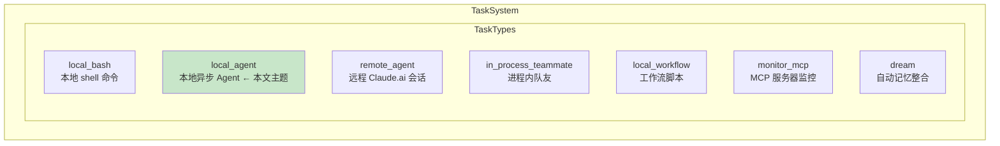

### 0.3 Agent 与其他 Task 类型的区别

| 维度 | `local_agent` (Agent) | `local_bash` | `in_process_teammate` |
|------|----------------------|--------------|----------------------|
| **本质** | 交互式 Agent，多轮对话循环 | 单一 shell 命令执行 | 进程内队友，持续交互 |
| **执行单元** | 一个 Agent 实例 | 一个命令 | 一个队友实例 |
| **工具调用** | 各种 Tool | 仅 bash | 各种 Tool |
| **状态字段** | `agentId`、`messages` | `command`、`result` | `identity`、`pendingMessages` |
| **生命周期** | Agent 自己决定何时完成 | 命令执行完即结束 | 持续运行直到 shutdown |
| **通信机制** | XML Notification | 仅输出 | File Mailbox |

### 0.4 为什么 Agent 和 Task 如此相关？

**SubAgent 的 Task ID 就是 Agent ID：**

```typescript
// tasks/LocalAgentTask/LocalAgentTask.tsx
const taskState: LocalAgentTaskState = {
  id: agentId,           // Task ID = Agent ID
  agentId,               // 冗余但清晰
  type: 'local_agent',
  status: 'running',
  ...
}
registerTask(taskState, setAppState)  // AppState.tasks[agentId] = taskState
```

**这种设计的优势：**
1. **一一对应**：每个 SubAgent 有一个对应的 Task 状态
2. **统一管理**：通过 `AppState.tasks` 统一管理所有后台任务
3. **生命周期关联**：Task 的状态变化驱动 Agent 的生命周期
4. **进度追踪**：统一的 `pollTasks()` 轮询机制

### 0.5 Task 与 Agent 的生命周期关联

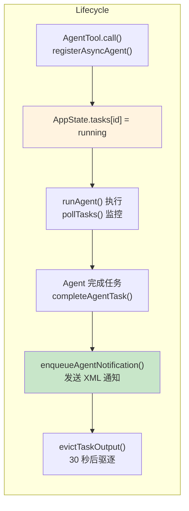

---

## 一、核心类型与接口定义

### 1.1 Task 类型体系

Claude Code 的任务系统基于统一的 `TaskStateBase`，所有任务类型共享以下基础字段：

```typescript
// Task.ts - 任务基础字段
type TaskStateBase = {
  id: string                           // 任务 ID
  type: TaskType                      // 'local_bash' | 'local_agent' | 'in_process_teammate' | ...
  status: TaskStatus                  // 'pending' | 'running' | 'completed' | 'failed' | 'killed'
  description: string                 // 任务描述
  toolUseId?: string                  // 关联的 tool_use_id
  startTime: number                   // 开始时间戳
  endTime?: number                    // 结束时间戳
  totalPausedMs?: number              // 暂停总时长
  outputFile: string                  // 磁盘输出文件路径
  outputOffset: number                // 已读取的字节偏移（增量读取用）
  notified: boolean                   // 是否已发送通知
}

type TaskType =
  | 'local_bash'      // 本地 shell 命令
  | 'local_agent'     // 本地异步 Agent（后台任务）
  | 'remote_agent'    // 远程 Claude.ai 会话
  | 'in_process_teammate'  // 进程内队友
  | 'local_workflow'  // 工作流脚本
  | 'monitor_mcp'     // MCP 服务器监控
  | 'dream'           // 自动记忆整合
```

### 1.2 LocalAgentTaskState

`local_agent` 类型任务的状态结构，用于后台 SubAgent：

```typescript
// LocalAgentTask.tsx
type LocalAgentTaskState = TaskStateBase & {
  type: 'local_agent'
  agentId: string              // SubAgent 的唯一标识
  prompt: string                // SubAgent 的初始 prompt
  selectedAgent: AgentDefinition // Agent 配置
  agentType: string             // Agent 类型
  abortController?: AbortController
  retrieved: boolean            // 是否已获取结果
  lastReportedToolCount: number
  lastReportedTokenCount: number
  isBackgrounded: boolean      // 是否已转入后台
  pendingMessages: string[]     // 待处理消息
  error?: string              // 错误信息
  retain: boolean               // 是否保留（不被驱逐）
  messages?: Message[]         // 对话消息
  diskLoaded: boolean           // 是否从磁盘加载
  result?: AgentToolResult     // 最终结果
  evictAfter?: number          // 驱逐时间戳
}
```

### 1.3 InProcessTeammateTaskState

进程内队友的状态结构：

```typescript
// InProcessTeammateTask/types.ts
type InProcessTeammateTaskState = TaskStateBase & {
  type: 'in_process_teammate'
  identity: TeammateIdentity   // 队友标识
  prompt: string
  model?: string
  selectedAgent?: AgentDefinition
  abortController?: AbortController
  currentWorkAbortController?: AbortController
  awaitingPlanApproval: boolean
  permissionMode: PermissionMode
  error?: string
  result?: AgentToolResult
  progress?: AgentProgress
  messages?: Message[]
  inProgressToolUseIDs?: Set<string>
  pendingUserMessages: string[]  // 待处理的来自 leader 的消息
  isIdle: boolean               // 是否处于空闲状态
  shutdownRequested: boolean     // 是否收到关闭请求
  onIdleCallbacks?: Array<() => void>  // 空闲时回调
}
```

### 1.4 TeammateIdentity 与 TeammateContext

```typescript
// InProcessTeammateTask/types.ts
type TeammateIdentity = {
  agentId: string        // e.g., "researcher@my-team"
  agentName: string     // e.g., "researcher"
  teamName: string
  color?: string
  planModeRequired: boolean
  parentSessionId: string
}

// teammateContext.ts - 使用 AsyncLocalStorage 实现并发隔离
type TeammateContext = {
  agentId: string
  agentName: string
  teamName: string
  color?: string
  planModeRequired: boolean
  parentSessionId: string
  isInProcess: true
  abortController: AbortController
}
```

**关键设计：AsyncLocalStorage 隔离**

`TeammateContext` 通过 Node.js 的 `AsyncLocalStorage` 实现并发隔离，确保同一进程内的多个 In-Process teammates 不会相互干扰。

```typescript
const teammateContextStorage = new AsyncLocalStorage<TeammateContext>()

export function runWithTeammateContext<T>(context: TeammateContext, fn: () => T): T {
  return teammateContextStorage.run(context, fn)
}
```

### 1.5 AgentDefinition

Agent 配置定义（从 frontmatter 加载）：

```typescript
// loadAgentsDir.ts
type AgentDefinition = {
  agentType: string
  whenToUse: string
  tools?: string[] | '*'
  disallowedTools?: string[]
  maxTurns?: number
  model?: ModelAlias | 'inherit'
  permissionMode?: PermissionMode
  source: 'built-in' | 'user'
  baseDir: string
  getSystemPrompt?: () => string | Promise<string>
  // ...
}
```

---

## 二、Main Agent 与 SubAgent 架构

### 2.1 架构概览

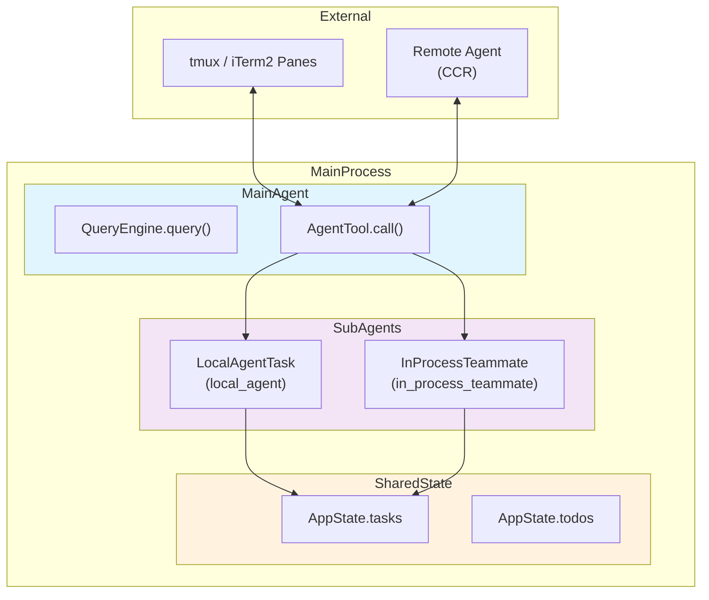

**读图说明：**

- Main Agent 与 SubAgent 运行在**同一 Node.js 进程**内，通过 `AppState.tasks` 共享内存状态
- `local_agent` 类型任务使用 `runAgent()` async generator 执行
- `in_process_teammate` 类型任务使用 `InProcessTeammateTask + inProcessRunner` 执行循环
- tmux/iTerm2 panes 和 Remote Agent 是外部进程，通过 stdio 或 CCR 协议通信

### 2.2 Main Agent 与 SubAgent 的关键差异

| 维度 | Main Agent | SubAgent |
|------|-----------|----------|
| **入口** | `QueryEngine.query()` 循环 | `runAgent()` async generator |
| **权限模式** | 用户 session 的 permission mode | 每个 agent 独立的 `permissionMode` |
| **工具池** | 完整工具通过 `useMergedTools()` | 通过 `filterToolsForAgent()` 过滤 |
| **中止控制** | 共享 `AbortController` | 异步 agent 独立；同步 agent 与父共享 |
| **状态存储** | 内存 + session disk | Task output 文件 + 可选的 sidechain transcript |
| **后台化** | N/A | 通过 `registerAgentForeground()` 支持自动后台化 |

### 2.3 SubAgent 执行流程

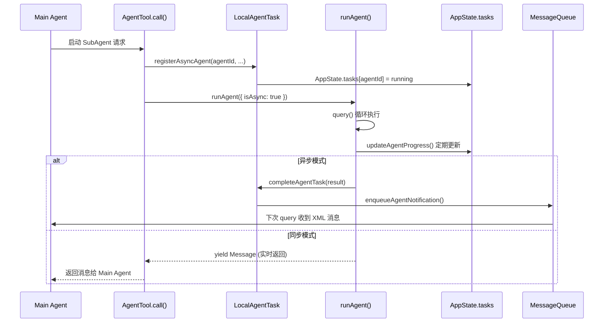

**读图说明：**

1. AgentTool 收到启动请求后，先通过 `registerAsyncAgent()` 在 AppState 注册任务
2. `runAgent()` 执行核心的 query 循环，期间通过 `yield` 实时返回消息
3. 对于异步（后台）agent，完成后通过 `enqueueAgentNotification()` 发送 XML 通知
4. Main Agent 在下次 query 轮询时从消息队列获取通知

---

## 二点五、四种编排模式

Claude Code 的 Agent 编排共有 **4 种核心模式**，每种模式有不同的 Main Agent 角色和通信机制。

### 2.5.1 模式总览

| 模式 | Main Agent 角色 | SubAgent 类型 | 通信机制 | 进程边界 |
|------|----------------|---------------|----------|----------|
| **Single Agent** | 唯一执行者 | 无 | - | 同一进程 |
| **Main + SubAgent** | 启动者 + 结果接收者 | `local_agent` / `fork` | XML Notification | 同一进程 |
| **Coordinator** | 协调者（不执行任务） | `local_agent` (workers) | Mailbox + SendMessage | 可跨进程 |
| **Swarm (Team)** | Leader 角色 | teammates | File Mailbox | 可跨进程 |

### 2.5.2 模式详解

#### 模式 1：Single Agent（单 Agent）

```
用户 → Main Agent → 处理完成 → 返回结果
```

Main Agent 独立处理所有请求，**不启动任何 SubAgent**。

#### 模式 2：Main + SubAgent/Fork

```
用户 → Main Agent → 启动 SubAgent → 后台执行 → XML 通知 → Main Agent 收到结果
```

Main Agent 启动后台 SubAgent（普通或 Fork），结果通过 XML 消息通知。

| 子类型 | 上下文继承 | 触发 |
|--------|-----------|------|
| **SubAgent** | 只有自己的 prompt | 指定 `subagent_type` |
| **ForkAgent** | 继承父完整上下文 | Fork 实验 + 不指定 `subagent_type` |

#### 模式 3：Coordinator（协调器模式）

```
用户 → Coordinator → 分发任务给 Workers → 等待 idle_notification → 继续/停止 Workers
```

Main Agent 专司协调，**自己不执行具体任务**，通过 `SendMessage` 继续 workers 或 `TaskStop` 停止。

#### 模式 4：Swarm（团队模式）

```
Leader ←→ Mailbox ←→ In-Process Teammate
Leader ←→ Mailbox ←→ tmux Pane
Leader ←→ Mailbox ←→ iTerm2 Pane
Leader ←→ Mailbox ←→ Remote Agent
```

Leader 和 teammates 通过 **File Mailbox** 通信，支持多种后端。

### 2.5.3 Fork Agent vs SubAgent 核心区别

| 维度 | Fork Agent | SubAgent (普通) |
|------|------------|-----------------|
| **对话上下文** | 继承父的**完整对话历史** | 只有自己的 `prompt` |
| **Prompt Cache** | 使用 placeholder 占位符确保 cache-identical | 正常构造 API 请求 |
| **工具池** | 继承父的 exact 工具池 (`useExactTools`) | 独立组装工具池 |
| **Model** | `inherit`（继承父的 model） | 可指定或默认 |
| **触发方式** | Fork 实验开启 + **不指定** `subagent_type` | 显式指定 `subagent_type` |

**上下文差异图解：**

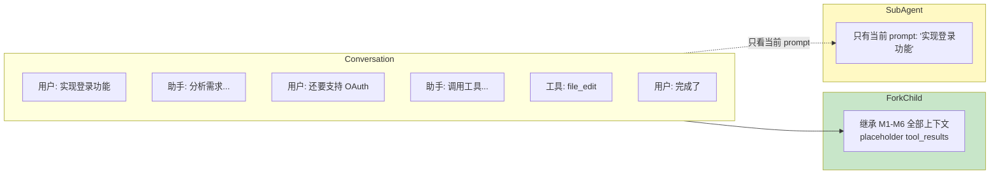

### 2.5.4 模式选择决策图

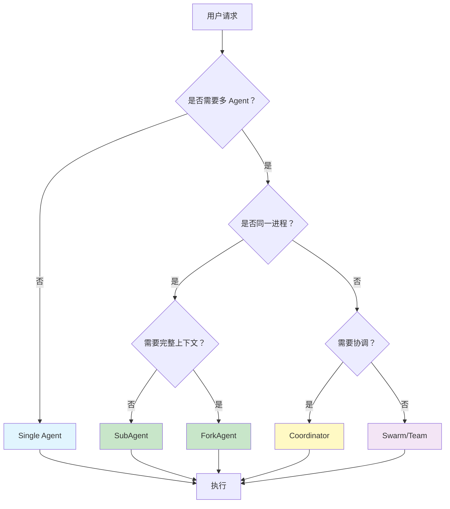

### 2.5.5 四种模式总结

| 模式 | 关键词 | 通信方式 | 典型场景 |
|------|--------|----------|----------|
| **Single** | 独立执行 | 无 | 简单任务 |
| **SubAgent/Fork** | 后台 + 继承上下文 | XML Notification | 长时任务 / 复杂多轮 |
| **Coordinator** | 协调不执行 | Mailbox + SendMessage | 批量任务分发 |
| **Swarm** | 团队协作 | File Mailbox | 多角色分工协作 |

---

## 三、Foreground vs Background 执行模式

### 3.1 两种模式的区别

| 维度 | Foreground (Sync) | Background (Async) |
|------|-------------------|-------------------|
| **执行方式** | 在主 turn 内运行，保持循环打开 | 注册后立即返回，后台执行 |
| **中止控制** | 共享父级 AbortController | 独立的 AbortController |
| **后台化** | 可被自动后台化（默认 120s） | 始终后台运行 |
| **结果传递** | 直接通过 `yield` 返回 | 通过 XML task notification |
| **注册函数** | `registerAgentForeground()` | `registerAsyncAgent()` |
| **生命周期** | `runAsyncAgentLifecycle()` | `runAsyncAgentLifecycle()` |

### 3.2 Foreground 执行流程

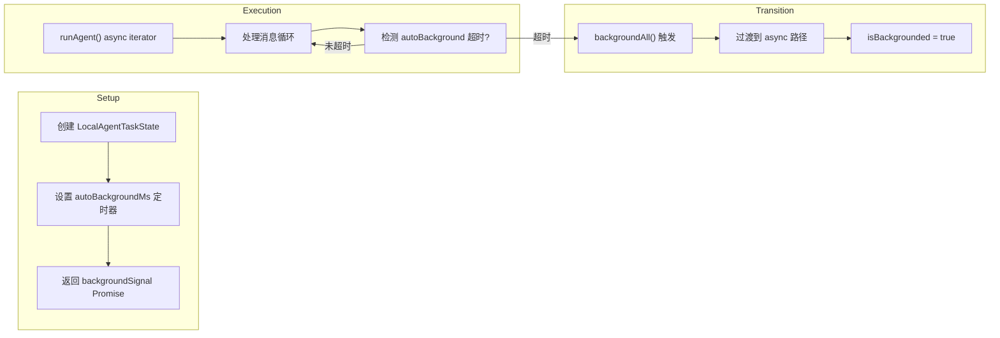

### 3.3 Background 执行流程

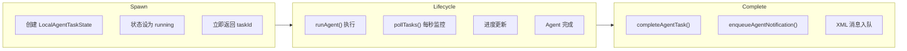

### 3.4 设计取舍

**当前方案：同一进程内的 async generator**

- **替代方案 1：独立进程 (child_process)**
  - 优点：更好的故障隔离
  - 代价：进程间通信开销大，需要序列化/反序列化消息
  - **未选原因**：同一进程共享内存，消息传递零拷贝，更高效

- **替代方案 2：Web Worker**
  - 优点：更好的线程隔离
  - 代价：消息传递需要 structured clone，不支持复杂对象
  - **未选原因**：Node.js 环境更适合 async generator 模型

### 3.5 关键澄清：Foreground vs Background SubAgent 的让出机制

**核心问题：SubAgent 是线程还是协程？如果 SubAgent 不让出，Main Agent 是否需要等待？**

#### 3.5.1 答案：SubAgent 是协程（async generator），不是线程

```typescript
// tools/AgentTool/runAgent.ts
export async function* runAgent({...}): AsyncGenerator<Message, void> {
  // SubAgent 通过 async generator 实现
  // 不是 thread，不是 child_process，是 async iterator

  for await (const msg of query(params)) {
    yield msg  // 通过 yield 返回消息
  }
}
```

#### 3.5.2 关键区分：Foreground 需要等待，Background 不需要

| 模式 | Main Agent 是否等待 | 实现方式 |
|------|---------------------|----------|
| **Foreground SubAgent** | ✅ 是，Main Agent 等待 | `for await (const msg of runAgent(...))` |
| **Background SubAgent** | ❌ 否，SubAgent 真正后台执行 | `void runAsyncAgentLifecycle(...)` |

#### 3.5.3 Foreground SubAgent 执行流程

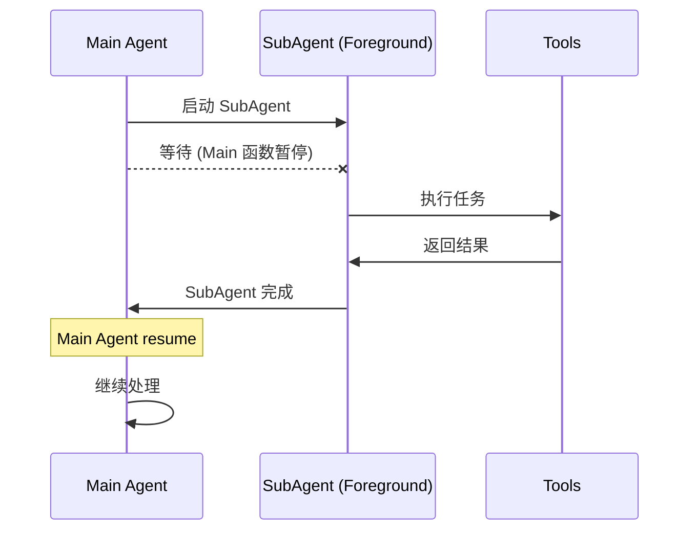

**代码示例：**
```typescript
// AgentTool.tsx
if (!shouldRunAsync) {
  // Foreground 模式
  for await (const msg of runAgent({...})) {
    // Main Agent 等待 SubAgent 的每条消息
    yield msg
  }
}
```

**特点：**
- SubAgent 在 Main Agent 的 turn 内执行
- Main Agent **必须等待**
- SubAgent 通过 `yield` 实时返回消息

#### 3.5.4 Background SubAgent 执行流程（真正后台）

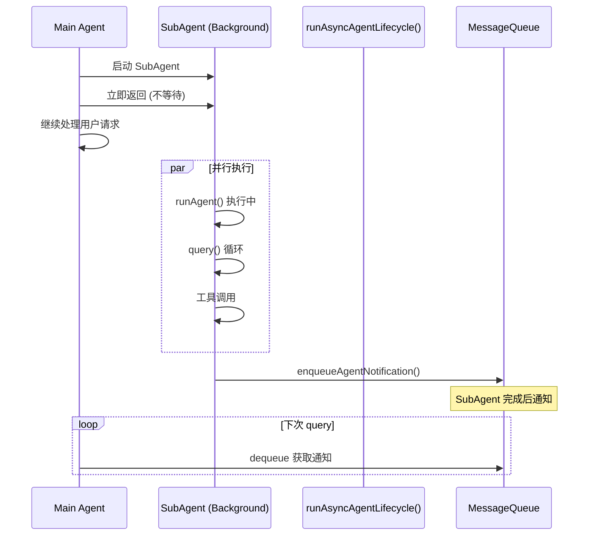

**代码示例：**
```typescript
// AgentTool.tsx
if (shouldRunAsync) {
  // Background 模式
  registerAsyncAgent(...)

  // 关键：使用 void，不等待结果
  void runWithAgentContext(
    asyncAgentContext,
    () => runAsyncAgentLifecycle({...})
  )

  // 立即返回，不等待
  return { status: 'async_launched' }
}
```

**关键区别：**

```typescript
// ❌ 错误的理解
const result = await runAgent(...)  // 这会等待，阻塞 Main Agent

// ✅ 正确的理解
void runAsyncAgentLifecycle(...)    // void 表示不等待
// Main Agent 立即继续执行
return { status: 'async_launched' }
```

#### 3.5.5 为什么 Background SubAgent 不会阻塞 Main Agent？

**因为 SubAgent 使用 `void` 启动，结果通过异步通知传递。**

```mermaid
flowchart LR
    subgraph MainTurn
        M1["用户请求"]
        M2["Main Agent 处理"]
        M3["启动 Background SubAgent"]
        M4["立即返回"]
        M5["Main Agent 继续处理"]
    end

    subgraph Background
        B1["runAsyncAgentLifecycle"]
        B2["runAgent() 执行"]
        B3["query() 循环"]
        B4["工具调用"]
        B5["完成 → Notification"]
    end

    M3 -->|void| B1
    B1 --> B2 --> B3 --> B4 --> B5

    M1 --> M2 --> M3 --> M4 --> M5
    M4 -. "不等待 SubAgent"|-> B5

    style MainTurn fill:#e1f5fe
    style Background fill:#c8e6c9
```

#### 3.5.6 SubAgent 的让出点

SubAgent 之所以能"不让出也不阻塞"，是因为它本质上就是异步的，**大量 await 操作自然让出事件循环**。

| 操作 | 是否让出 | 让出时机 |
|------|----------|----------|
| API 调用 (`query()`) | ✅ | `await` 时让出 |
| 工具调用 (`BashTool`) | ✅ | `await exec()` 时让出 |
| 文件读写 | ✅ | `await fs.readFile()` 时让出 |
| CPU 计算（无 await） | ❌ | 不让出 |

** практически：** SubAgent 的大部分操作都是 I/O 操作（API 调用、文件读写、命令执行），自然会有 await，自然会让出事件循环。

#### 3.5.7 线程 vs 协程 vs async generator 对比

| 维度 | 线程 (Thread) | 协程 (Coroutine) | SubAgent (Async Generator) |
|------|---------------|------------------|---------------------------|
| **执行单元** | OS 线程 | 函数实例 | async generator 实例 |
| **调度方式** | 抢占式 (OS) | 协作式 | 协作式 (事件循环) |
| **堆栈** | 独立堆栈 | 共享堆栈 | 共享堆栈 |
| **创建开销** | 大 (KB~MB) | 小 | 极小 |
| **并行性** | 真正并行 | 假并行 (单线程) | 假并行 (单线程) |
| **阻塞影响** | 只阻塞自己 | 可能阻塞其他协程 | 只阻塞 generator 本身 |

#### 3.5.8 设计取舍

**为什么不使用线程？**

1. **Node.js 单线程模型**：JavaScript 运行时本质是单线程
2. **线程开销大**：创建线程需要 KB~MB 内存
3. **线程间通信复杂**：需要消息序列化/反序列化
4. **调试困难**：多线程的竞态条件难以复现

**为什么选择 async generator？**

1. **符合 Node.js 模型**：自然的事件循环驱动
2. **零开销**：只是创建生成器对象
3. **灵活控制**：可以暂停/恢复，灵活控制执行流程
4. **易于调试**：单线程，无竞态条件

#### 3.5.9 总结

| 问题 | 答案 |
|------|------|
| **SubAgent 是线程吗？** | ❌ 不是 |
| **SubAgent 是协程吗？** | ✅ 是 (async generator) |
| **SubAgent 让 Main Agent 等待吗？** | Foreground 模式：✅ 等待；Background 模式：❌ 不等待 |
| **Background SubAgent 如何实现不等待？** | `void runAsyncAgentLifecycle(...)`，不 await 结果 |
| **SubAgent 会阻塞 Main Agent 吗？** | 不会，因为 SubAgent 本身是 async，大量 await 点让出控制权 |
| **如果 SubAgent 做纯 CPU 计算呢？** | 会阻塞，但因为 Agent 本质是 I/O 操作，这种情况极少 |

**一句话总结：**

- **Foreground SubAgent**：Main Agent 的 turn 内执行，必须等待
- **Background SubAgent**：`void` 启动，真正后台执行，Main Agent 立即继续
- SubAgent 的 async generator 模型保证大量 `await` 让出点，不会长期阻塞

---

## 四、Agent Team 与 Swarm 协作机制

### 4.1 Team 架构概览

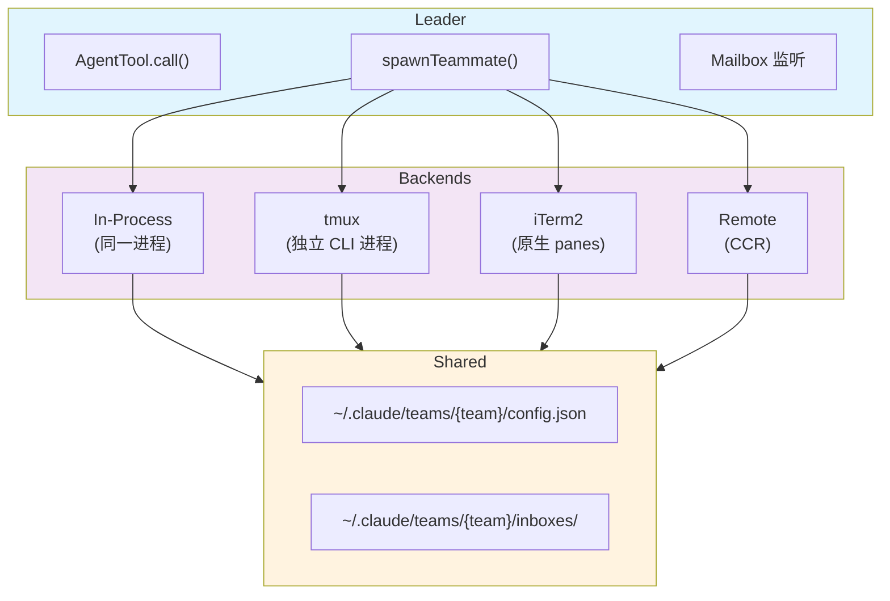

### 4.2 消息传递机制：Mailbox

Agent Team 通过文件邮箱（Mailbox）在进程间共享消息：

```
~/.claude/teams/{team_name}/inboxes/{agent_name}.json
```

```typescript
// teammateMailbox.ts
type TeammateMessage = {
  from: string              // 发送者名称
  text: string             // 消息文本
  timestamp: string        // ISO 时间戳
  read: boolean            // 是否已读
  color?: string           // 颜色标记
  summary?: string         // 摘要（用于通知）
}
```

**Mailbox 支持的结构化消息类型：**

| 类型 | 用途 |
|------|------|
| `idle_notification` | 队友进入空闲状态，附带了工作结果 |
| `permission_request/response` | 权限审批流程 |
| `shutdown_request/approved/rejected` | 优雅关闭请求 |
| `plan_approval_request/response` | Plan mode 审批 |
| `task_assignment` | 任务指派 |
| `team_permission_update` | 权限广播更新 |
| `mode_set_request` | 权限模式变更 |

### 4.3 Team 文件结构

```typescript
// teamHelpers.ts
type TeamFile = {
  name: string
  description?: string
  createdAt: number
  leadAgentId: string
  leadSessionId?: string
  hiddenPaneIds?: string[]
  teamAllowedPaths?: TeamAllowedPath[]
  members: Array<{
    agentId: string
    name: string
    agentType?: string
    model?: string
    prompt?: string
    color?: string
    planModeRequired?: boolean
    joinedAt: number
    tmuxPaneId: string
    cwd: string
    worktreePath?: string
    sessionId?: string
    subscriptions: string[]
    backendType?: BackendType
    isActive?: boolean
    mode?: PermissionMode
  }>
}
```

**存储位置：** `~/.claude/teams/{team_name}/config.json`

### 4.4 多种后端类型

```typescript
// utils/swarm/backends/types.ts
type BackendType = 'in-process' | 'tmux' | 'it2'

// In-Process: 同一 Node.js 进程，AsyncLocalStorage 隔离
// tmux: 独立的 CLI 进程，通过 tmux 命令通信
// iTerm2: 原生 iTerm2 panes，通过 iTerm2 协议通信
```

### 4.5 协作流程

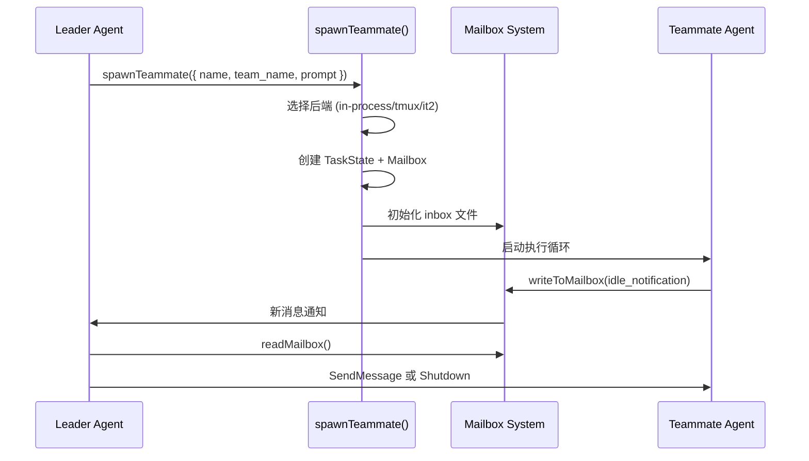

### 4.6 设计取舍

**文件邮箱 vs 内存队列**

- **替代方案 1：内存队列（如 Redis）**
  - 优点：低延迟，支持更多进程
  - 代价：需要额外的服务依赖
  - **未选原因**：保持无状态设计，team 信息存储在文件系统，天然持久化

- **替代方案 2：WebSocket**
  - 优点：实时推送
  - 代价：需要长时间连接，维护成本高
  - **未选原因**：Mailbox 基于文件轮询，更简单，适合 CLI 环境

---

## 五、SubAgent 结果传递给 Main Agent

### 5.1 核心机制：XML Task Notification

SubAgent 的执行结果通过 XML 消息传递给 Main Agent：

```xml
<task_notification>
  <task_id>a1b2c3d4e5f6g7h8</task_id>
  <tool_use_id>tool_xxx</tool_use_id>
  <task_type>local_agent</task_type>
  <output_file>/path/to/output</output_file>
  <status>completed</status>
  <summary>Agent "xxx" completed</summary>
  <result>这是 SubAgent 的最终输出文本</result>
  <usage>
    <total_tokens>1234</total_tokens>
    <tool_uses>5</tool_uses>
    <duration_ms>5000</duration_ms>
  </usage>
</task_notification>
```

### 5.2 传递流程

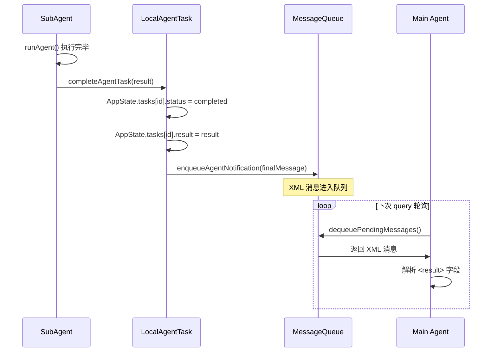

### 5.3 关键代码路径

| 步骤 | 文件 | 函数 |
|------|------|------|
| 1. 启动 SubAgent | `AgentTool.tsx` | `AgentTool.call()` |
| 2. 注册 Task | `LocalAgentTask.tsx` | `registerAsyncAgent()` |
| 3. 执行 Agent | `runAgent.ts` | `runAgent()` |
| 4. 完成 Task | `LocalAgentTask.tsx` | `completeAgentTask()` |
| 5. 发送通知 | `LocalAgentTask.tsx` | `enqueueAgentNotification()` |
| 6. 接收消息 | `QueryEngine.ts` | `query()` 主循环 |

### 5.4 设计取舍

**为什么用 XML 而不是 JSON？**

- **替代方案 1：JSON**
  - 优点：解析更标准
  - 代价：需要转义特殊字符，可能与对话内容冲突
  - **未选原因**：XML 标签更易于在纯文本流中定位和解析

- **替代方案 2：直接修改对话上下文对象**
  - 优点：无需序列化
  - 代价：跨查询循环的状态共享复杂
  - **未选原因**：query 循环是无状态的，每次都是新请求

---

## 六、Coordinator 模式

### 6.1 架构概览

当 `CLAUDE_CODE_COORDINATOR_MODE=1` 时启用：

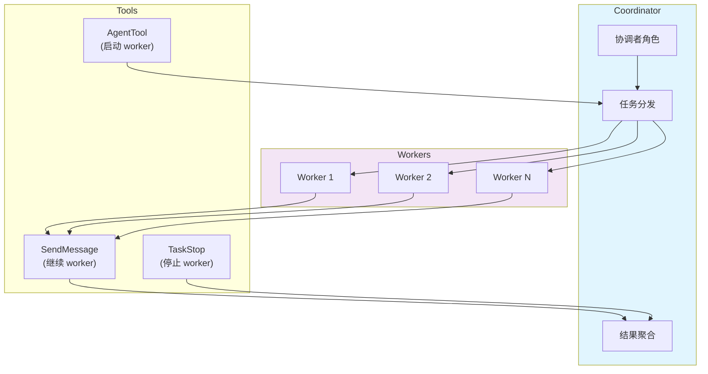

### 6.2 Coordinator 工作流程

1. **启动 Workers**：Coordinator 通过 `AgentTool` 启动多个 workers，传入 `team_name`
2. **任务分发**：Coordinator 通过 `SendMessage` 向 workers 发送任务
3. **结果收集**：Workers 完成时发送 `idle_notification`，结果在 message 中
4. **继续或停止**：Coordinator 决定继续 workers 或通过 `TaskStop` 停止

### 6.3 关键设计

- **Mailbox 路由**：每个 worker 有独立的 inbox，通过 `to` 字段指定收件人
- **权限隔离**：Workers 可以有不同的 `permissionMode`
- **并行执行**：多个 workers 可以同时执行不同任务

---

## 七、关键设计决策

### 7.1 决策 1：AsyncLocalStorage vs 闭包隔离

**问题**：同一进程内如何隔离多个 In-Process teammates 的上下文？

**决策**：使用 `AsyncLocalStorage` 实现上下文隔离

```typescript
const teammateContextStorage = new AsyncLocalStorage<TeammateContext>()

export function getTeammateContext(): TeammateContext | undefined {
  return teammateContextStorage.getStore()
}
```

**替代方案 1：闭包隔离**
- 代价：每个 teammate 需要独立模块作用域，无法动态创建
- **未选原因**：不够灵活，无法运行时创建新 teammate

**替代方案 2：Worker Threads**
- 代价：线程间通信开销大，不适合高频消息传递
- **未选原因**：AsyncLocalStorage 在单线程内零开销

### 7.2 决策 2：Task ID = Agent ID

**问题**：如何关联后台任务状态和 Agent 执行实例？

**决策**：使用相同的 ID 作为 Task ID 和 Agent ID

```typescript
// LocalAgentTask.tsx
const taskState: LocalAgentTaskState = {
  id: agentId,  // taskId === agentId
  agentId,      // 冗余但清晰
  ...
}
```

**替代方案 1：独立的任务 ID**
- 代价：需要维护 Task ID 到 Agent ID 的映射
- **未选原因**：增加复杂度，无明显收益

### 7.3 决策 3：File-based Mailbox vs 内存队列

**问题**：进程间消息传递使用什么机制？

**决策**：基于文件的 Mailbox 系统，使用 `proper-lockfile` 处理并发

**替代方案 1：Redis / 内存队列**
- 代价：需要外部服务依赖
- **未选原因**：Claude Code 设计为无状态 CLI 工具，不依赖外部服务

**替代方案 2：Unix Domain Socket**
- 代价：配置复杂，不支持 Windows
- **未选原因**：跨平台兼容优先

---

## 八、风险与技术债

### 8.1 风险登记表

| 风险 | 触发条件 | 影响范围 | 可观测信号 | 缓解动作 |
|------|----------|----------|------------|----------|
| **Mailbox 文件锁竞争** | 多个 teammate 同时读写同一 inbox | 消息延迟或丢失 | 锁定重试日志 | 使用指数退避重试 |
| **AsyncLocalStorage 泄漏** | `runWithTeammateContext` 未正确退出 | 上下文混乱 | 内存中残留 context | 确保 AbortController 在 finally 中清理 |
| **Agent 僵尸任务** | `pollTasks()` 轮询失败 | 任务状态停留在 running | 后台任务面板显示卡住 | 提供 `TaskStop` 手动终止 |
| **Session 重建后状态丢失** | `/clear` 后 resume agent | Agent 状态需要从磁盘重建 | 无法恢复进行中的任务 | `resumeAgentBackground()` 重新加载 |
| **Auto-Background 误触发** | 长时任务被错误后台化 | 用户失去可见性 | 长时间无输出 | `AUTO_BACKGROUND_TASKS=0` 禁用 |

### 8.2 技术债

| 项目 | 说明 | 优先级 |
|------|------|--------|
| **Task State 冗余字段** | `agentId` 和 `id` 冗余 | 低 |
| **Mailbox 轮询效率** | 当前轮询间隔固定，无法自适应 | 中 |
| **In-Process Runner 复杂度** | `inProcessRunner.ts` 超过 1000 行 | 中 |
| **Fork vs Regular Agent 路径分化** | 两套代码路径，维护成本高 | 高 |

---

## 九、证据索引

| 结论 | 证据 |
|------|------|
| SubAgent 在同一进程内执行 | `tools/AgentTool/runAgent.ts` -> `runAgent()` 是 async generator，无进程创建 |
| 使用 AsyncLocalStorage 隔离 | `utils/teammateContext.ts` -> `teammateContextStorage` |
| Task ID = Agent ID | `tasks/LocalAgentTask/LocalAgentTask.tsx` -> `id: agentId` |
| Mailbox 位置 | `utils/teammateMailbox.ts` -> `~/.claude/teams/{team}/inboxes/` |
| XML 通知格式 | `constants/xml.ts` -> `TASK_NOTIFICATION_TAG` |
| Coordinator 模式触发 | `coordinator/coordinatorMode.ts` -> `isCoordinatorMode()` |
| Team 文件存储 | `utils/swarm/teamHelpers.ts` -> `~/.claude/teams/{team}/config.json` |
| Foreground 可转后台 | `tools/AgentTool/agentToolUtils.ts` -> `backgroundAll()` |

---

## 相关页面

- [Task System 任务体系总览](TASK-SYSTEM.md)
- [消息队列机制](./MESSAGE-QUEUE.md)
- [Coordinator 协调模式](./COORDINATOR.md)