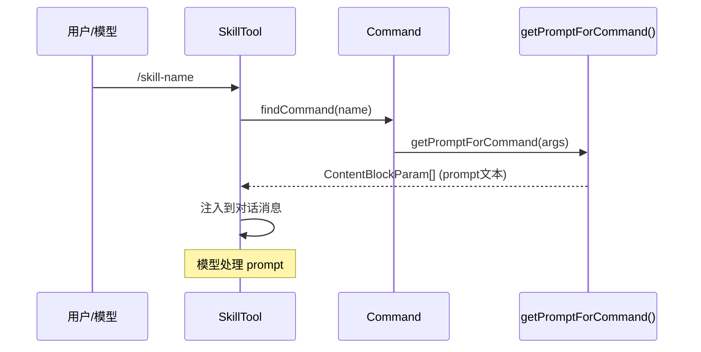
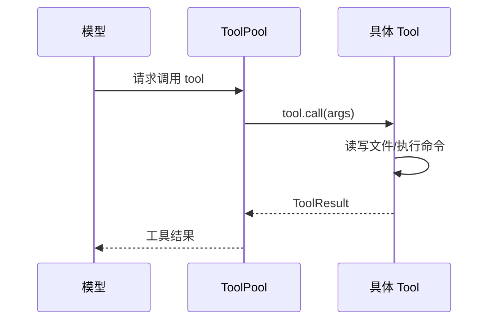
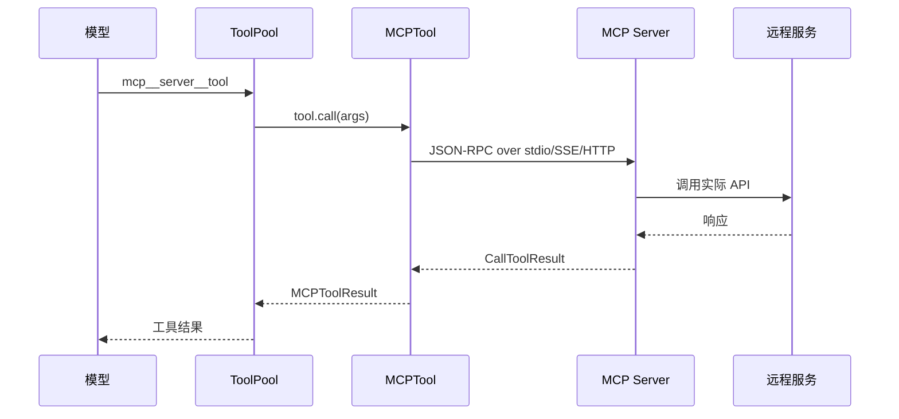

# SKILLS / TOOL / MCP 三系统对比

> 本文档横向对比 Claude Code 中三种扩展机制：Skill（技能）、Tool（工具）、MCP（MCP 服务器）。

---

## 一、定位对比

| 维度 | Skill | Tool | MCP |
|------|-------|------|-----|
| **定位** | 可扩展的 prompt 模板 | Agent 与外界交互的核心通道 | 外部服务（如文件系统、GitHub）的标准化接口 |
| **调用方** | 用户 `/skill-name` 或模型 | Agent 自动调用 | Agent 通过 MCP 协议调用 |
| **本质** | **文本 prompt** | **可执行代码** | **远程服务代理** |
| **执行位置** | 本地 prompt 展开 | 本地或远程执行 | MCP 服务器（可能是远程） |
| **状态管理** | 无状态（纯文本生成） | 有状态（文件编辑、Shell 执行等） | 有状态（与远程服务交互） |

---

## 二、类型定义对比

### Skill (`type: 'prompt'`)

```typescript
// Command.ts - PromptCommand
{
  type: 'prompt',
  name: string,
  description: string,
  allowedTools?: string[],        // 工具白名单
  model?: string,                // 模型覆盖
  context?: 'inline' | 'fork',   // 执行模式
  effort?: EffortValue,
  paths?: string[],              // 条件技能路径匹配
  hooks?: HooksSettings,
  getPromptForCommand(
    args: string,
    context: ToolUseContext,
  ): Promise<ContentBlockParam[]>  // ← 返回 prompt 文本
}
```

### Tool (`type: 'tool'`)

```typescript
// Tool.ts - Tool 接口
{
  name: string,
  inputSchema: z.ZodType,        // ← Zod schema
  outputSchema?: z.ZodType,
  description(input, options): Promise<string>,
  prompt?(): Promise<string>,
  call(
    args: z.infer<Input>,
    context: ToolUseContext,
    canUseTool: CanUseToolFn,
    parentMessage: AssistantMessage,
    onProgress?: ToolCallProgress<P>,
  ): Promise<ToolResult<Output>>  // ← 执行实际操作
}
```

### MCP

```typescript
// MCP SDK 类型
{
  name: string,                    // mcp__server__tool 格式
  inputSchema: JSONSchema,        // ← JSON Schema
  description: string,
  annotations?: {
    readOnlyHint?: boolean,
    destructiveHint?: boolean,
    openWorldHint?: boolean,
  }
}
```

---

## 三、内存占用对比

| 维度 | Skill | Tool | MCP |
|------|-------|------|-----|
| **内容形式** | Markdown 文本 (~5KB) | TypeScript 代码 | JSON Schema (~3-10KB) |
| **数量级** | 通常 < 50 个 | ~30 个内置 | 可达数百个 |
| **典型内存** | ~100KB - 2MB | ~500KB | ~2-10MB |
| **加载时机** | 启动时 + 动态发现 | 启动时注册 | MCP 连接时 |
| **懒加载** | ❌ `markdownContent` 全量加载 | ✅ `shouldDefer` + ToolSearch 按需 | ✅ 同样通过 ToolSearch |

**关键区别**：Tool 和 MCP 通过 `shouldDefer` + `ToolSearch` 实现真正的延迟加载，Skill 不支持延迟加载（`markdownContent` 直接全量加载到内存）。

---

## 四、加载流程对比

### Skill 加载流程

```
启动时：
  initBundledSkills()           → 注册内置 skills
  getSkillDirCommands()          → 扫描 ~/.claude/skills/

文件操作时（动态发现）：
  FileEditTool.call()
    → discoverSkillDirsForPaths()  ← 遍历查找 .claude/skills/
    → addSkillDirectories()       ← 加载 SKILL.md → Command 对象
    → activateConditionalSkills() ← paths 匹配激活
```

**加载到内存**：完整 `Command` 对象，包含 `markdownContent` 闭包引用

### Tool 延迟加载

```
启动时：
  assembleToolPool()
    → 内置 Tool 注册
    → shouldDefer=true 标记为延迟
    → MCP 工具默认延迟

ToolSearch 模式：
  模型请求时：
    → 检查 deferredTools
    → ToolSearchTool 搜索工具
    → 返回 tool_reference 块
    → 下次请求才加载完整 Schema
```

**延迟机制**：通过 `shouldDefer` 标记 + `ENABLE_TOOL_SEARCH` 环境变量控制，配合 ToolSearchTool 实现按需加载。

### MCP 工具加载流程

```
MCP 连接时：
  client.connect()
    → listTools()                 ← 调用 MCP 服务器
    → ListToolsResultSchema       ← 解析 JSON Schema
    → toolsToProcess.map()        ← 转换为 Tool 对象
    → AppState.mcp.commands       ← 存入内存
```

**加载到内存**：每个工具的 `inputSchema`（完整 JSON Schema 对象）

---

## 五、执行流程对比

### Skill 执行



**结果**：prompt 被注入对话，模型生成响应

### Tool 执行



**结果**：工具执行实际动作，返回结构化结果

### MCP 执行



**结果**：远程服务执行，返回结果

---

## 六、SKILL.md vs Tool vs MCP Schema

### SKILL.md 示例

````markdown
---
name: simplify
description: Review code for issues
allowed-tools:
  - Read
  - Edit
  - Bash
effort: medium
---

# Simplify

Review all changed files for reuse, quality, and efficiency.

## Phase 1: Identify Changes
Run `git diff` to see what changed.
````

### Tool 定义示例

```typescript
// BashTool.ts
export const BashTool = buildTool({
  name: 'Bash',
  inputSchema: z.object({
    command: z.string().describe('The shell command to execute'),
    timeout: z.number().optional(),
  }),
  description: async ({ command }) => `Execute shell command: ${command}`,
  async call({ command, timeout }, context) {
    // 执行 shell 命令
    const result = await exec(command, { timeout })
    return { content: result.stdout }
  }
})
```

### MCP Schema 示例

```typescript
{
  name: "filesystem_readFile",
  description: "Read the contents of a file from the filesystem",
  inputSchema: {
    "type": "object",
    "properties": {
      "path": {
        "type": "string",
        "description": "The path to the file to read"
      },
      "options": {
        "type": "object",
        "properties": {
          "encoding": { "type": "string" },
          "count": { "type": "number" }
        }
      }
    },
    "required": ["path"]
  }
}
```

---

## 七、权限与安全对比

| 维度 | Skill | Tool | MCP |
|------|-------|------|-----|
| **权限控制** | `allowedTools` 白名单 | 权限提示 + 规则匹配 | MCP 服务器授权 |
| **Shell 执行** | `executeShellCommandsInPrompt()` | BashTool 直接执行 | ❌ 不直接执行 |
| **文件访问** | 通过 allowedTools | 内置文件工具 | MCP 服务器决定 |
| **安全边界** | Skill prompt 不可执行代码 | Tool 实现是代码 | 信任 MCP 服务器 |
| **敏感属性** | `SAFE_SKILL_PROPERTIES` | N/A | 服务器级别 |

---

## 八、特性开关对比

### Skill 特性

| 特性 | 字段 | 说明 |
|------|------|------|
| 条件技能 | `paths` | 文件路径匹配激活 |
| 执行模式 | `context: fork` | 子 agent 执行 |
| 懒加载内容 | ❌ | 全量加载 |
| 远程技能 | `EXPERIMENTAL_SKILL_SEARCH` | AKI/GCS 按需加载 |

### Tool 特性

| 特性 | 字段 | 说明 |
|------|------|------|
| 并发安全 | `isConcurrencySafe()` | 是否可并发执行 |
| 只读标识 | `isReadOnly()` | 是否只读 |
| 进度回调 | `onProgress` | 长时间操作进度 |
| 延迟工具 | `alwaysLoad: false` | 按需加载 |

### MCP 特性

| 特性 | 字段 | 说明 |
|------|------|------|
| 只读注解 | `readOnlyHint` | hint 工具只读 |
| 破坏性注解 | `destructiveHint` | hint 具破坏性 |
| 开放世界 | `openWorldHint` | hint 调用外部 |
| 搜索摘要 | `searchHint` | 工具搜索关键词 |

---

## 九、优缺点对比

### Skill

| 优点 | 缺点 |
|------|------|
| ✅ 实现简单（纯文本） | ❌ 不能执行实际动作 |
| ✅ 可组合、灵活 | ❌ 全量加载占用内存 |
| ✅ 支持参数替换 | ❌ 权限控制粗糙 |
| ✅ 易于分享（Markdown） | ❌ 无状态，难以做复杂流程 |

### Tool

| 优点 | 缺点 |
|------|------|
| ✅ 完整执行能力 | ❌ 实现复杂（需要代码） |
| ✅ 精确权限控制 | ❌ 修改需要重新部署 |
| ✅ 状态管理 | ❌ 内置工具数量固定 |
| ✅ 高性能（本地执行） | ❌ 扩展需要代码变更 |

### MCP

| 优点 | 缺点 |
|------|------|
| ✅ 标准化协议 | ❌ Schema 冗长占内存 |
| ✅ 远程服务能力 | ❌ 依赖服务器可用性 |
| ✅ 工具数量可扩展 | ❌ 网络延迟 |
| ✅ 无需代码扩展 | ❌ 安全信任问题 |

---

## 十、选择指南

```
需要执行动作？
    │
    ├── 是 → 需要远程服务？
    │       ├── 是 → 使用 MCP
    │       └── 否 → 使用 Tool
    │
    └── 否 → 需要灵活的工作流指导？
            ├── 是 → 使用 Skill (inline)
            └── 否 → 需要子 agent 执行？
                    ├── 是 → 使用 Skill (fork)
                    └── 否 → 考虑 Tool 或 MCP
```

---

## 十一、相关文件

| 系统 | 核心文件 | 说明 |
|------|----------|------|
| **Skill** | `skills/loadSkillsDir.ts` | 技能加载与发现 |
| | `skills/bundledSkills.ts` | 内置技能注册 |
| | `tools/SkillTool/SkillTool.ts` | 技能工具实现 |
| **Tool** | `Tool.ts` | 工具核心接口 |
| | `tools/*/Tool.ts` | 各工具实现 |
| | `tools.ts` | 工具池管理 |
| **MCP** | `services/mcp/client.ts` | MCP 客户端 |
| | `tools/MCPTool/MCPTool.ts` | MCP 工具包装 |
| | `services/mcp/types.ts` | MCP 类型定义 |

---

## 十二、总结

| 维度 | Skill | Tool | MCP |
|------|-------|------|-----|
| **本质** | Prompt 模板 | 可执行代码 | 远程服务代理 |
| **内存占用** | 小 (~1MB) | 中 (~500KB) | 大 (~5MB) |
| **扩展方式** | 写 Markdown | 写 TypeScript | 接 MCP 服务器 |
| **执行能力** | ❌ 无 | ✅ 完整 | ⚠️ 取决于服务器 |
| **灵活性** | ✅ 最高 | ❌ 最低 | ⚠️ 中等 |
| **标准化** | ❌ 非标准 | ✅ 标准化 | ✅ 标准协议 |

**设计原则**：

- **Skill** = 让模型知道"怎么做"（指导）
- **Tool** = 让模型能够"做什么"（能力）
- **MCP** = 让模型能够"访问什么"（资源）
