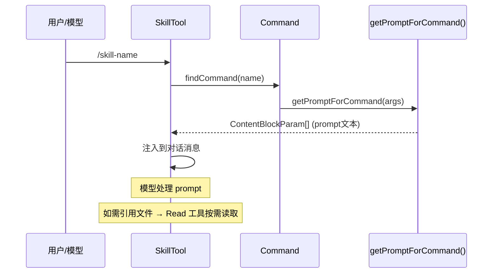
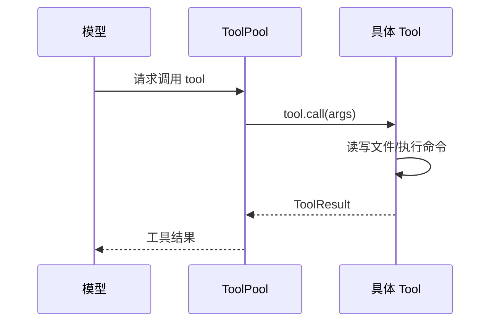
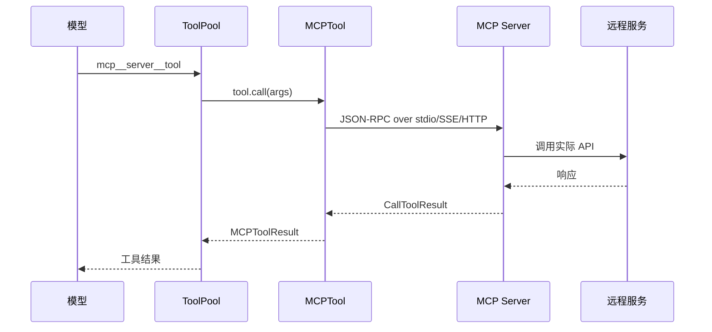

# SKILLS / TOOL / MCP 三系统对比

> 本文档横向对比 Claude Code 中三种扩展机制：Skill（技能）、Tool（工具）、MCP（MCP 服务器）。

---

## 一、定位对比

| 维度 | Skill | Tool | MCP |
|------|-------|------|-----|
| **定位** | 可扩展的 prompt 模板 | Agent 与外界交互的核心通道 | 外部服务（如文件系统、GitHub）的标准化接口 |
| **调用方** | 用户 `/skill-name` 或模型 | Agent 自动调用 | Agent 通过 MCP 协议调用 |
| **本质** | **文本 prompt** | **可执行代码** | **远程服务代理** |
| **执行位置** | 本地 prompt 展开 | 本地或远程执行 | MCP 服务器（可能是远程） |
| **状态管理** | 无状态（纯文本生成） | 有状态（文件编辑、Shell 执行等） | 有状态（与远程服务交互） |

---

## 二、类型定义对比

### Skill (`type: 'prompt'`)

```typescript
// Command.ts - PromptCommand
{
  type: 'prompt',
  name: string,
  description: string,
  allowedTools?: string[],        // 工具白名单
  model?: string,                // 模型覆盖
  context?: 'inline' | 'fork',   // 执行模式
  effort?: EffortValue,
  paths?: string[],              // 条件技能路径匹配
  hooks?: HooksSettings,
  getPromptForCommand(
    args: string,
    context: ToolUseContext,
  ): Promise<ContentBlockParam[]>  // ← 返回 prompt 文本
}
```

### Tool (`type: 'tool'`)

```typescript
// Tool.ts - Tool 接口
{
  name: string,
  inputSchema: z.ZodType,        // ← Zod schema
  outputSchema?: z.ZodType,
  description(input, options): Promise<string>,
  prompt?(): Promise<string>,
  call(
    args: z.infer<Input>,
    context: ToolUseContext,
    canUseTool: CanUseToolFn,
    parentMessage: AssistantMessage,
    onProgress?: ToolCallProgress<P>,
  ): Promise<ToolResult<Output>>  // ← 执行实际操作
}
```

### MCP

```typescript
// MCP SDK 类型
{
  name: string,                    // mcp__server__tool 格式
  inputSchema: JSONSchema,        // ← JSON Schema
  description: string,
  annotations?: {
    readOnlyHint?: boolean,
    destructiveHint?: boolean,
    openWorldHint?: boolean,
  }
}
```

---

## 三、Skill 发现机制

### 3.1 两层发现架构

```
Skills 发现分两层：

启动时加载（固定目录）：
  ├── ~/.claude/skills/           ✅ 已加载
  ├── .claude/skills/（项目根）    ✅ 已加载
  └── managed/.claude/skills/      ✅ 已加载

动态发现（嵌套目录）：
  └── src/components/.claude/skills/   ❌ 启动时不知道
                                         ↓
                                    只有操作文件时才加载
```

### 3.2 什么是"动态发现"

**动态发现**指的是：启动时不知道、只有文件操作时才去查找的那些**嵌套目录下的 Skills**。

```
项目结构示例：
/project/
├── .claude/skills/           ← 启动时加载
│   └── general/SKILL.md
├── src/
│   ├── components/
│   │   └── .claude/skills/   ← 动态发现（只有编辑 src/ 时才加载）
│   │       └── react-best-practices/SKILL.md
│   └── utils/
│       └── .claude/skills/   ← 动态发现（只有编辑 utils/ 时才加载）
│           └── python-guides/SKILL.md
```

这不是懒加载，而是**发现范围的扩展**——固定目录启动时加载，嵌套目录按需发现。

### 3.2 发现流程

```
文件操作触发（如 Read/Edit/Write）：
  ↓
1. discoverSkillDirsForPaths([filePath])
   - 从文件的父目录向上遍历到 cwd
   - 检查每个层级是否有 .claude/skills/
   - 跳过 gitignored 的目录
   - 返回发现的目录列表

2. addSkillDirectories(newDirs)
   - 加载这些目录下的 SKILL.md
   - 解析 frontmatter
   - 创建 Command 对象存入 dynamicSkills Map

3. activateConditionalSkillsForPaths([filePath])
   - 如果 Skill 有 paths frontmatter
   - 匹配成功则激活
   - 不匹配则保持待激活状态
```

### 3.3 发现示例

```
项目结构：
/project/
├── src/
│   ├── components/
│   │   ├── Button.tsx      ← 操作这个文件
│   │   └── .claude/
│   │       └── skills/     ← 发现这个目录！
│   │           └── react-best-practices/
│   │               └── SKILL.md
│   └── utils/
└── .claude/
    └── skills/             ← 也被发现（更上层）
        └── general/
            └── SKILL.md
```

当 `Button.tsx` 被编辑时，系统会向上遍历，发现 `src/components/.claude/skills/` 和 `.claude/skills/` 两个目录。

### 3.4 内存中的内容

| 部分 | 是否加载到内存 | 说明 |
|------|--------------|------|
| `SKILL.md` 正文 | ✅ 是 | 解析 frontmatter 后存入 Command 对象 |
| 目录中的其他文件 | ❌ 否 | LLM 需要时通过 `Read` 工具按需读取 |
| `${CLAUDE_SKILL_DIR}` 变量 | ✅ 替换 | 运行时替换为实际路径 |

### 3.5 Skill 目录结构示例

```
skill-name/
├── SKILL.md              ← 全量加载到内存（~5KB）
├── templates/
│   └── template.md       ← LLM 按需 Read
├── schemas/
│   └── config.json       ← LLM 按需 Read
└── scripts/
    └── run.sh             ← 通过 !`...` 按需执行
```

---

## 四、内存占用对比

| 维度 | Skill | Tool | MCP |
|------|-------|------|-----|
| **内容形式** | Markdown 文本 + frontmatter | TypeScript 代码 + Zod Schema | JSON Schema |
| **加载到内存** | `SKILL.md` 正文（~5KB） | 全部（代码必须） | 全部 Schema |
| **数量级** | 通常 < 50 个 | ~30 个内置 | 可达数百个 |
| **启动时内存** | ~250KB | ~500KB | ~2-10MB |
| **引用文件** | LLM 按需 Read | N/A | N/A |
| **延迟加载** | ✅ 发现延迟，内容不小 | ✅ `shouldDefer` + ToolSearch | ✅ 同样通过 ToolSearch |

**关键点**：
- Skill 的 `SKILL.md` 很小（~5KB），即使全量加载也几乎不占内存
- Skill 引用的其他文件由 LLM 按需读取，不占启动内存
- 真正占内存的是 MCP 的 JSON Schema（每个 3-10KB，数百个可达数 MB）

---

## 五、加载流程对比

### Skill 加载流程

```
启动时（固定目录）：
  initBundledSkills()           → 注册内置 skills
  getSkillDirCommands()         → 扫描 ~/.claude/skills/、项目根 .claude/skills/ 等

文件操作时（嵌套目录动态发现）：
  FileEditTool.call()
    → discoverSkillDirsForPaths()   ← 遍历文件路径查找嵌套的 .claude/skills/
    → addSkillDirectories()          ← 加载 SKILL.md → Command 对象
    → activateConditionalSkills()    ← paths 匹配激活
```

**动态发现的是什么**：是**嵌套在子目录中的 Skills 目录**（如 `src/components/.claude/skills/`），这些目录在启动时不知道存在。只有文件操作时遍历路径才发现。

### Tool 延迟加载

```
启动时：
  assembleToolPool()
    → 内置 Tool 注册
    → shouldDefer=true 标记为延迟
    → MCP 工具默认延迟

ToolSearch 模式：
  模型请求时：
    → 检查 deferredTools
    → ToolSearchTool 搜索工具
    → 返回 tool_reference 块
    → 下次请求才加载完整 Schema
```

### MCP 工具加载流程

```
MCP 连接时：
  client.connect()
    → listTools()                 ← 调用 MCP 服务器
    → ListToolsResultSchema       ← 解析 JSON Schema
    → toolsToProcess.map()        ← 转换为 Tool 对象
    → AppState.mcp.commands       ← 存入内存
```

---

## 六、执行流程对比

### Skill 执行



### Tool 执行



### MCP 执行



---

## 七、SKILL.md vs Tool vs MCP Schema

### SKILL.md 示例

````markdown
---
name: simplify
description: Review code for issues
allowed-tools:
  - Read
  - Edit
  - Bash
effort: medium
paths:
  - "**/*.ts"
  - "**/*.tsx"
---

# Simplify

Review all changed files for reuse, quality, and efficiency.

## Phase 1: Identify Changes
Run `git diff` to see what changed.

## Phase 2: Use Templates
Reference ${CLAUDE_SKILL_DIR}/templates/review-template.md
````

### Tool 定义示例

```typescript
// BashTool.ts
export const BashTool = buildTool({
  name: 'Bash',
  inputSchema: z.object({
    command: z.string().describe('The shell command to execute'),
    timeout: z.number().optional(),
  }),
  description: async ({ command }) => `Execute shell command: ${command}`,
  async call({ command, timeout }, context) {
    const result = await exec(command, { timeout })
    return { content: result.stdout }
  }
})
```

### MCP Schema 示例

```typescript
{
  name: "filesystem_readFile",
  description: "Read the contents of a file from the filesystem",
  inputSchema: {
    "type": "object",
    "properties": {
      "path": {
        "type": "string",
        "description": "The path to the file to read"
      },
      "options": {
        "type": "object",
        "properties": {
          "encoding": { "type": "string" },
          "count": { "type": "number" }
        }
      }
    },
    "required": ["path"]
  }
}
```

---

## 八、权限与安全对比

| 维度 | Skill | Tool | MCP |
|------|-------|------|-----|
| **权限控制** | `allowedTools` 白名单 | 权限提示 + 规则匹配 | MCP 服务器授权 |
| **Shell 执行** | `executeShellCommandsInPrompt()` | BashTool 直接执行 | ❌ 不直接执行 |
| **文件访问** | 通过 allowedTools | 内置文件工具 | MCP 服务器决定 |
| **安全边界** | Skill prompt 不可执行代码 | Tool 实现是代码 | 信任 MCP 服务器 |
| **敏感属性** | `SAFE_SKILL_PROPERTIES` | N/A | 服务器级别 |

---

## 九、特性开关对比

### Skill 特性

| 特性 | 字段 | 说明 |
|------|------|------|
| **启动时加载** | 固定目录 | `~/.claude/skills/`、`.claude/skills/` 等 |
| **动态发现** | 嵌套目录 | `src/components/.claude/skills/` 等 |
| 条件激活 | `paths` | 文件路径匹配才激活 |
| 执行模式 | `context: fork` | 子 agent 执行 |
| 远程技能 | `EXPERIMENTAL_SKILL_SEARCH` | AKI/GCS 按需加载 |

### Tool 特性

| 特性 | 字段 | 说明 |
|------|------|------|
| 延迟加载 | `shouldDefer` | ToolSearch 模式 |
| 强制加载 | `alwaysLoad` | 始终可用 |
| 并发安全 | `isConcurrencySafe()` | 是否可并发执行 |
| 进度回调 | `onProgress` | 长时间操作进度 |

### MCP 特性

| 特性 | 字段 | 说明 |
|------|------|------|
| 延迟加载 | 默认 `shouldDefer` | ToolSearch 模式 |
| 只读注解 | `readOnlyHint` | hint 工具只读 |
| 破坏性注解 | `destructiveHint` | hint 具破坏性 |
| 开放世界 | `openWorldHint` | hint 调用外部 |

---

## 十、优缺点对比

### Skill

| 优点 | 缺点 |
|------|------|
| ✅ 实现简单（纯文本） | ❌ 不能执行实际动作 |
| ✅ 引用文件按需读取，不占内存 | ❌ 全量加载 SKILL.md（小问题） |
| ✅ 支持参数替换、变量替换 | ❌ 权限控制粗糙 |
| ✅ 易于分享（Markdown） | ❌ 无状态，难以做复杂流程 |

### Tool

| 优点 | 缺点 |
|------|------|
| ✅ 完整执行能力 | ❌ 实现复杂（需要代码） |
| ✅ 精确权限控制 | ❌ 修改需要重新部署 |
| ✅ 状态管理 | ❌ 内置工具数量固定 |
| ✅ 高性能（本地执行） | ❌ 扩展需要代码变更 |

### MCP

| 优点 | 缺点 |
|------|------|
| ✅ 标准化协议 | ❌ Schema 冗长占内存 |
| ✅ 远程服务能力 | ❌ 依赖服务器可用性 |
| ✅ 工具数量可扩展 | ❌ 网络延迟 |
| ✅ 无需代码扩展 | ❌ 安全信任问题 |

---

## 十一、选择指南

```
需要执行动作？
    │
    ├── 是 → 需要远程服务？
    │       ├── 是 → 使用 MCP
    │       └── 否 → 使用 Tool
    │
    └── 否 → 需要灵活的工作流指导？
            ├── 是 → 使用 Skill (inline)
            └── 否 → 需要子 agent 执行？
                    ├── 是 → 使用 Skill (fork)
                    └── 否 → 考虑 Tool 或 MCP
```

---

## 十二、相关文件

| 系统 | 核心文件 | 说明 |
|------|----------|------|
| **Skill** | `skills/loadSkillsDir.ts` | 技能目录发现与加载 |
| | `skills/bundledSkills.ts` | 内置技能注册 |
| | `skills/bundled/*.ts` | 各内置技能实现 |
| | `tools/SkillTool/SkillTool.ts` | 技能工具实现 |
| | `commands.ts` | 命令查找与获取 |
| **Tool** | `Tool.ts` | 工具核心接口 |
| | `tools.ts` | 工具池管理 |
| | `utils/toolSearch.ts` | ToolSearch 延迟加载 |
| **MCP** | `services/mcp/client.ts` | MCP 客户端 |
| | `tools/MCPTool/MCPTool.ts` | MCP 工具包装 |

---

## 十三、总结

| 维度 | Skill | Tool | MCP |
|------|-------|------|-----|
| **本质** | Prompt 模板 | 可执行代码 | 远程服务代理 |
| **启动时加载** | ✅ 固定目录 | ❌ 启动时全部注册 | ❌ MCP 连接时全部加载 |
| **动态发现** | ✅ 嵌套目录按需 | ❌ 无 | ❌ 无 |
| **内容延迟** | ✅ 引用文件 LLM 按需读取 | ❌ 代码必须全量 | ❌ Schema 必须全量 |
| **启动内存** | ~250KB | ~500KB | ~2-10MB |
| **扩展方式** | 写 Markdown | 写 TypeScript | 接 MCP 服务器 |
| **执行能力** | ❌ 无 | ✅ 完整 | ⚠️ 取决于服务器 |

**设计原则**：

- **Skill** = 告诉模型"怎么做"（指导），引用文件按需读取
- **Tool** = 让模型"能做什么"（能力），代码必须全量加载
- **MCP** = 让模型"能访问什么"（资源），Schema 必须全量加载

**内存优化策略**：

- Skill：只加载 `SKILL.md`（~5KB），引用文件由 LLM 按需读取
- Tool/MCP：通过 `shouldDefer` + ToolSearch 实现 Schema 的延迟加载
