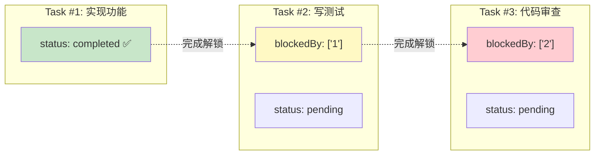
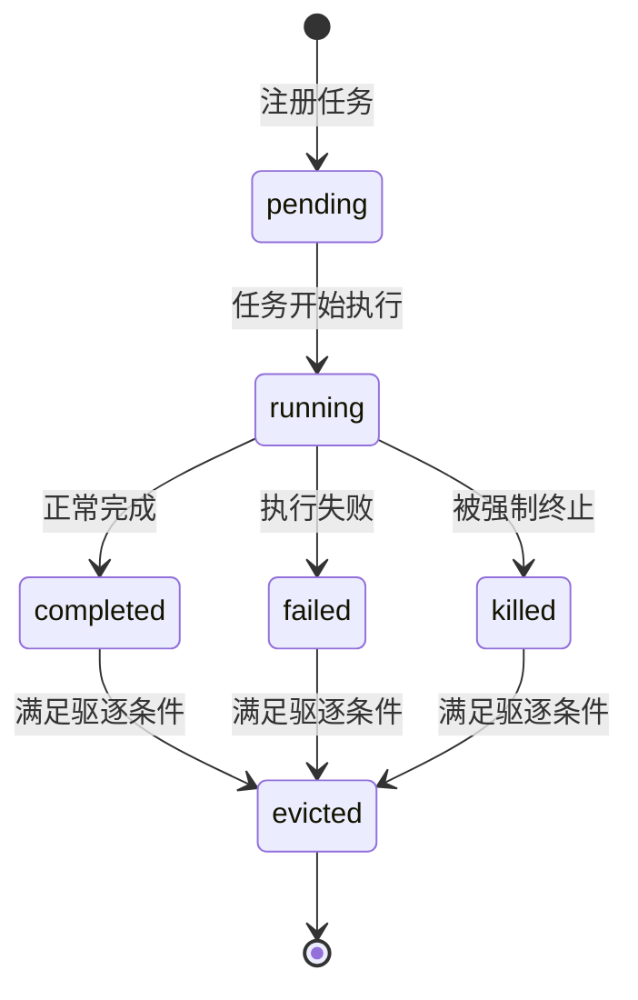
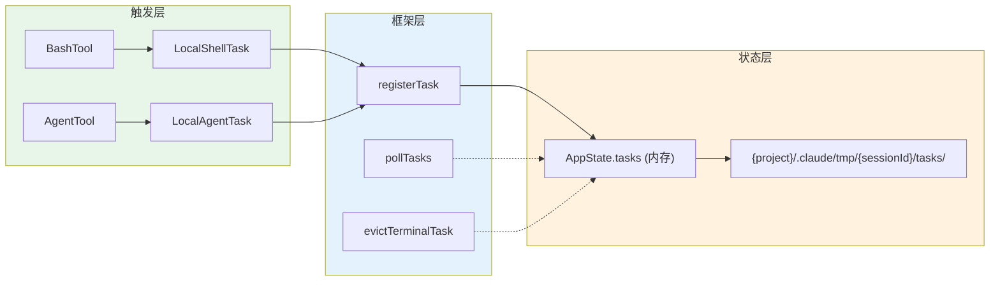
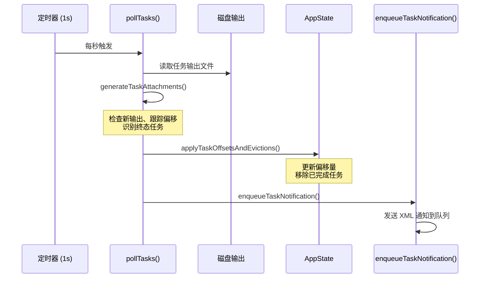
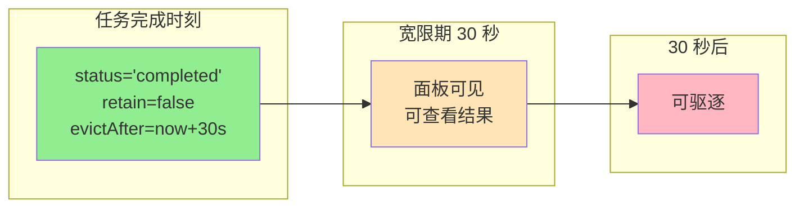
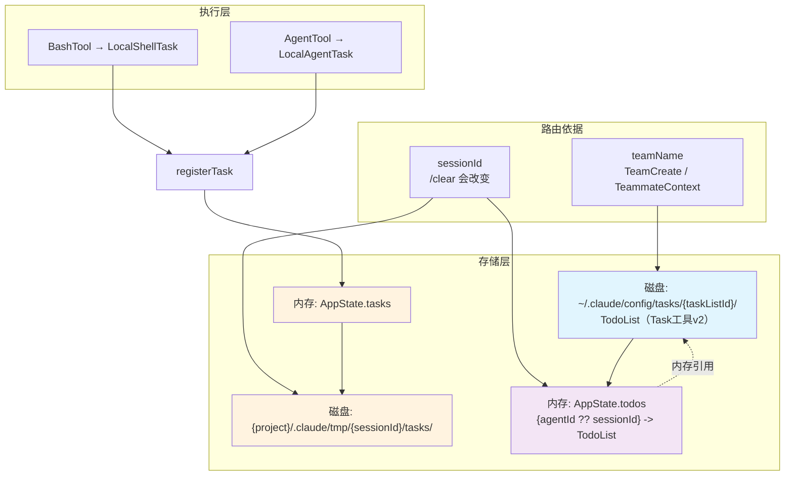
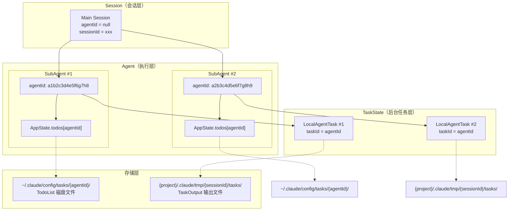
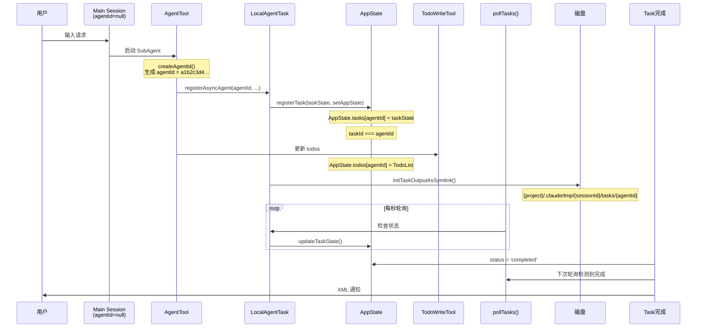
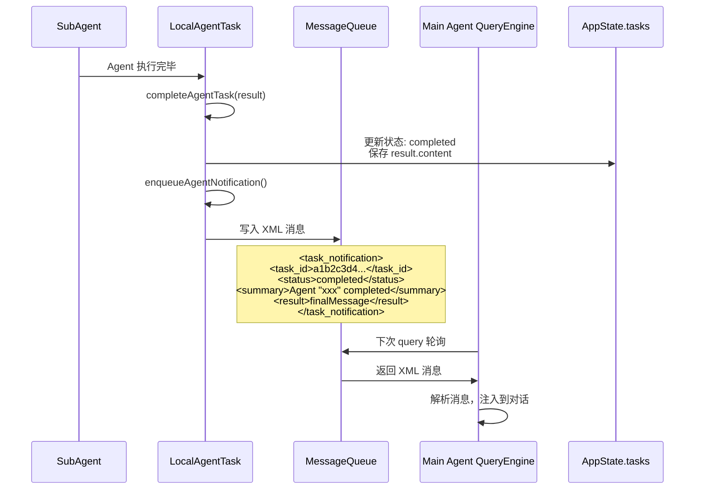
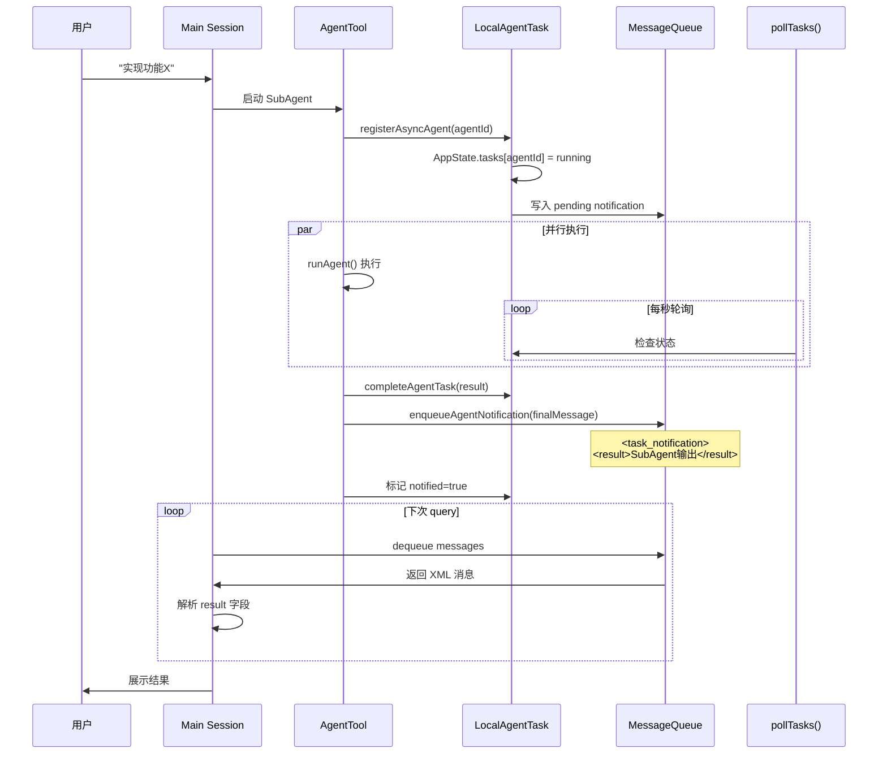

# Task System 任务体系总览

> 本文档基于代码分析，整理 Claude Code 中任务体系的完整设计。

## 概述

Claude Code 中存在**两套独立的任务系统**，分别服务于不同的目的：

| 系统 | 用途 | 存储位置 | 状态 |
|------|------|----------|------|
| **TodoList（Task 工具 v2）** | 任务跟踪与协调 | `~/.claude/config/tasks/{taskListId}/` | pending / in_progress / completed |
| **后台任务系统** | 长时操作执行 | 内存 `AppState.tasks` + `{project}/.claude/tmp/{sessionId}/tasks/` | pending / running / completed / failed / killed |

---

## 一、TodoList 系统（Task 工具 v2）

### 1.1 核心概念

TodoList 是**任务跟踪系统**，用于人工可读的任务清单管理，支持依赖关系。

**Task 数据结构：**

```typescript
{
  id: string,           // 数字字符串 "1", "2", "3"...
  subject: string,     // 任务标题
  description: string, // 详细描述
  activeForm: string,  // 进行时态（如 "Running tests"）
  owner?: string,      // 认领的 agent ID
  status: 'pending' | 'in_progress' | 'completed',
  blocks: string[],    // 此任务阻塞的任务 ID 列表
  blockedBy: string[], // 阻塞此任务的任务 ID 列表
  metadata?: Record<string, unknown>,
}
```

### 1.2 依赖关系



**依赖检查逻辑（`claimTask()`）：**

```typescript
// 只有 blockedBy 中所有任务都 completed 时才能认领
const unresolvedTaskIds = new Set(
  allTasks.filter(t => t.status !== 'completed').map(t => t.id)
)
const blockedByTasks = task.blockedBy.filter(id => unresolvedTaskIds.has(id))
if (blockedByTasks.length > 0) {
  return { success: false, reason: 'blocked', blockedByTasks }
}
```

### 1.3 路由：taskListId 的确定

Task 存储在 `~/.claude/config/tasks/{taskListId}/` 目录下，taskListId 的确定有优先级：

```typescript
function getTaskListId(): string {
  // 1. 显式环境变量指定（SDK / 多进程协作）
  if (process.env.CLAUDE_CODE_TASK_LIST_ID)
    return process.env.CLAUDE_CODE_TASK_LIST_ID

  // 2. 进程内 teammate → 用 teamName（与 tmux/iTerm2 teammates 共享）
  const teammateCtx = getTeammateContext()
  if (teammateCtx)
    return teammateCtx.teamName

  // 3. 兜底: leaderTeamName（TeamCreate） > sessionId
  return getTeamName() || leaderTeamName || getSessionId()
}
```

**路由结果：**

| 场景 | taskListId | 是否跨 Session |
|------|------------|----------------|
| 单人 Session | `sessionId` | ❌ `/clear` 会改变 sessionId，路由到新目录 |
| Team 中 | `teamName` | ✅ 所有成员共享同一任务清单 |
| SDK 指定 | `CLAUDE_CODE_TASK_LIST_ID` | ✅ 显式指定路径 |

**重要澄清：**
- **单人 Session 时，TodoList 不跨 Session** — `/clear` 会调用 `regenerateSessionId()`，导致 `getTaskListId()` 路由到新目录，旧的 Task 文件仍然存在但不再被访问
- **只有 Team 场景下才能真正跨 Session 共享**，因为 `leaderTeamName` 在 Team 存续期间保持不变

### 1.4 关键 API

| 函数 | 用途 |
|------|------|
| `createTask()` | 创建任务 |
| `getTask()` / `listTasks()` | 读取任务 |
| `updateTask()` | 更新任务状态 |
| `deleteTask()` | 删除任务（自动清理引用） |
| `claimTask()` | 认领任务（检查 blockedBy、agentBusy） |
| `blockTask(from, to)` | 设置 A 阻塞 B（双向设置） |

---

## 二、后台任务系统

### 2.1 任务类型

| 类型 | 前缀 | 描述 |
|------|------|------|
| `local_bash` | `b` | 本地 shell 命令执行 |
| `local_agent` | `a` | 本地异步 Agent（通过 AgentTool） |
| `remote_agent` | `r` | 远程 Claude.ai 会话（teleport） |
| `in_process_teammate` | `t` | 进程内队友 Agent |
| `local_workflow` | `w` | 工作流脚本（功能开关） |
| `monitor_mcp` | `m` | MCP 服务器监控（功能开关） |
| `dream` | `d` | 自动记忆整合（auto-dream） |

### 2.2 任务状态流转



**终态（Terminal States）：** `completed`、`failed`、`killed`

### 2.3 Task ID 格式

```
{prefix}{8位随机字符 [0-9a-z]}
```

示例：`b1a2b3c4d5e6f7g8`（bash 任务）、`a1b2c3d4e5f6g7h8`（agent 任务）

- 36^8 ≈ 2.8 万亿种组合
- 前缀保持向后兼容（bash 保持 `b`）

### 2.4 LocalBash vs LocalAgent

| | `local_bash` | `local_agent` |
|---|---|---|
| **本质** | 单一 shell 命令执行 | 交互式 Agent（多轮对话循环） |
| **执行单元** | 一个命令 + 等待结果 | 一个 Agent 实例，持续处理消息 |
| **工具调用** | 纯 bash（`exec()`） | 可以调用各种 Tool（FileEdit、Grep、Bash 等） |
| **状态字段** | `command`、`result`、`shellCommand` | `agentId`、`messages`、`progress`、`abortController` |
| **进度追踪** | 仅输出 + 退出码 | 详细的 `toolUseCount`、`tokenCount`、`lastActivity` |
| **生命周期** | 命令执行完即结束 | Agent 自己决定何时完成（通过 `result` 或 error） |
| **典型用途** | `npm install`、`git push` 等单次命令 | 代码生成任务、多步骤复杂工作 |

### 2.5 存储结构

```
{project}/.claude/tmp/{sessionId}/tasks/{taskId}.output
```

- **输出文件**：`{project}/.claude/tmp/{sessionId}/tasks/{taskId}.output`
- **内存状态**：`AppState.tasks`（进程内存，Session 结束时消失）
- **Session 隔离**：不同 Session 的后台任务输出互不干扰
- **进程重启丢失**：后台任务状态在进程退出后不保留（内存部分）

---

## 三、生命周期维护机制

### 3.1 任务创建者

**任务的创建者不是中央调度器，而是各个 Tool 工具自行触发的。**



### 3.2 框架函数

| 函数 | 用途 |
|------|------|
| `registerTask(task, setAppState)` | 添加新任务到 AppState |
| `updateTaskState<T>(taskId, setAppState, updater)` | 类型安全的 state 更新 |
| `pollTasks(getAppState, setAppState)` | 主轮询循环（每 1 秒） |
| `evictTerminalTask(taskId, setAppState)` | 移除已完成的任务 |
| `generateTaskAttachments(state)` | 生成推送通知 |
| `applyTaskOffsetsAndEvictions(...)` | 应用轮询结果 |

### 3.3 轮询机制



### 3.4 驱逐规则

1. 必须是终态（`completed` | `failed` | `killed`）
2. 必须 `notified=true`
3. 不能被保留（`retain !== true` 或 `evictAfter > now`）

### 3.5 面板宽限期



- **LocalAgentTask：** `PANEL_GRACE_MS = 30_000`（30 秒）
- **DreamTask：** 通知后立即驱逐（仅 UI）

---

## 四、三者关系总结



**关键关系：**

1. **TodoList 通过 `taskListId` 路由**，单人 Session 时为 sessionId，Team 时为 teamName
2. **后台任务的输出文件**在 `{project}/.claude/tmp/{sessionId}/tasks/`，与 Session 绑定
3. **AppState.todos** 的 key 是 `agentId ?? sessionId`，用于 UI 渲染
4. **TodoList 不跨 Session**（单人场景），因为 `/clear` 会改变 sessionId
5. **Team 场景下 TodoList 跨 Session 共享**，因为 leaderTeamName 不变

---

## 五、典型工作流

### 单人 Session

```
用户输入 "实现登录功能"
  → Agent 分析后创建 TodoList Task #1 "实现登录API"
  → Agent 创建 local_agent 任务执行
  → local_agent 后台运行，pollTasks() 监控状态
  → 完成 → 通知用户
```

**注意**：单人 Session 时 TodoList 存储在 `{sessionId}/` 目录下。`/clear` 会生成新的 sessionId，旧的任务文件仍在磁盘但不再被访问。

### Team 协作

```
Leader 创建 Team（teamName = "feature-login"）
  → leaderTeamName = "feature-login" → TodoList 路由到 team 名下
  → Leader 创建 Task #1 "实现登录API"
  → Leader 创建 Task #2 "写测试"（blockedBy #1）
  → Teammate 加入，共享同一 taskListId
  → Teammate claimTask() #2（检查 #1 已 completed）
  → Teammate 启动 local_agent 执行 → 后台任务在各自身份的 session
  → 完成 → 通知 Leader
```

**注意**：Team 场景下 TodoList 真正跨 Session 共享，所有成员访问同一个 `teamName` 目录。

---

## 八、Agent / Session / SubAgent / TodoList / Task 联动关系

### 8.1 核心 ID 体系

| ID 类型 | 格式 | 说明 |
|---------|------|------|
| `sessionId` | 字符串 | Session 唯一标识，`/clear` 会重新生成 |
| `AgentId` | `a{16-hex}` 或 `a{label}-{16-hex}` | SubAgent 唯一标识，由 `createAgentId()` 生成 |
| `taskId`（后台任务） | `{prefix}{8-random-chars}` | 后台任务 ID，如 `b1a2b3c4...` |
| `taskId`（TodoList） | 数字字符串 `"1"`, `"2"`, `"3"...` | Task 工具 v2 的任务 ID |

**关键区别：**
- **Main Session**：`agentId = null`（没有 agentId）
- **SubAgent**：有 `AgentId`，格式为 `a{16-hex}`
- `AppState.todos` 的 key 是 **`agentId ?? sessionId`**，即 SubAgent 用 agentId，Main Session 用 sessionId

### 8.2 架构层次



### 8.3 联动时序



### 8.4 SubAgent 与 LocalAgentTask 的一对一关系

每个 SubAgent 在启动时创建一个对应的 `LocalAgentTaskState`，**Task ID 就是 Agent ID**：

```typescript
// LocalAgentTask.tsx - registerAsyncAgent()
const taskState: LocalAgentTaskState = {
  type: 'local_agent',
  agentId,  // ← SubAgent 的 agentId 作为 taskId
  status: 'running',
  // ...
}
registerTask(taskState, setAppState)  // AppState.tasks[agentId] = taskState
```

### 8.5 SubAgent 与 TodoList 的 key 映射

`AppState.todos` 的 key 是 `agentId ?? sessionId`：

```typescript
// TodoWriteTool.tsx
const todoKey = context.agentId ?? getSessionId()
const oldTodos = appState.todos[todoKey] ?? []
```

| 上下文 | todoKey | TodoList 位置 |
|--------|---------|--------------|
| Main Session | `sessionId` | `~/.claude/config/tasks/{sessionId}/` |
| SubAgent | `agentId` | `~/.claude/config/tasks/{agentId}/` |

### 8.6 完整调用链

```
用户输入
  → Main Session 处理
  → AgentTool.call()
    → createAgentId() 生成 agentId
    → registerAsyncAgent(agentId, ...)
    │   → LocalAgentTaskState 创建（taskId = agentId）
    │   → registerTask() → AppState.tasks[agentId]
    │   → initTaskOutputAsSymlink() → 符号链接到 agent transcript
    → runAgent() 开始执行
    │   → query() 循环
    │   → TodoWriteTool / TaskCreateTool 调用
    │       → AppState.todos[agentId] 更新（内存）
    │       → 磁盘 ~/.claude/config/tasks/{agentId}/ 写入
    → pollTasks() 每秒监控
    → 完成 → 通知用户
```

### 8.7 总结：各实体关系

| 关系 | 说明 |
|------|------|
| Session → Agent | Session 可以启动多个 SubAgent，每个有独立 agentId |
| Agent → LocalAgentTask | **一对一**关系，Agent ID 就是 Task ID |
| Agent → TodoList | `AppState.todos[agentId]` 作为内存索引 |
| TodoList → 磁盘 | `~/.claude/config/tasks/{taskListId}/` 持久化 |
| LocalAgentTask → 输出 | `{project}/.claude/tmp/{sessionId}/tasks/{agentId}.output` |
| Main Session | `agentId = null`，用 `sessionId` 作为 AppState.todos 的 key |

**核心设计：**
- `agentId` 是 SubAgent 的唯一标识，同时作为 `AppState.tasks` 和 `AppState.todos` 的 key
- Main Session 的 `agentId = null`，所以用 `sessionId` 作为兜底 key
- TodoList 在磁盘和内存各有一份，磁盘是真正的持久化层

---

## 九、相关文件

### TodoList 系统

| 文件 | 用途 |
|------|------|
| `src/utils/tasks.ts` | Task 存储、CRUD、claimTask、blockTask |
| `src/utils/todo/types.ts` | TodoItem / TodoList Schema |
| `src/tools/TaskCreateTool/` | 创建任务 |
| `src/tools/TaskListTool/` | 列出任务 |
| `src/tools/TaskUpdateTool/` | 更新任务 |
| `src/tools/TaskGetTool/` | 获取单个任务 |

### 后台任务系统

| 文件 | 用途 |
|------|------|
| `src/Task.ts` | 核心类型、ID 生成 |
| `src/tasks.ts` | 任务注册表（getAllTasks, getTaskByType） |
| `src/tasks/types.ts` | 联合类型、isBackgroundTask 守卫 |
| `src/tasks/stopTask.ts` | 任务停止逻辑 |
| `src/tasks/LocalShellTask/` | LocalShellTask 实现 |
| `src/tasks/LocalAgentTask/` | LocalAgentTask 实现 |
| `src/tasks/LocalMainSessionTask.ts` | 主会话后台化 |
| `src/utils/task/framework.ts` | 核心框架函数 |
| `src/utils/task/diskOutput.ts` | 任务输出磁盘 I/O |

---

## 十、总结

| 维度 | TodoList | 后台任务 |
|------|----------|----------|
| **职责** | 任务跟踪与协调 | 长时操作执行 |
| **依赖** | ✅ `blockedBy` / `blocks` | ❌ 无 |
| **存储** | `~/.claude/config/tasks/{taskListId}/` | 内存 + `{project}/.claude/tmp/{sessionId}/tasks/` |
| **状态** | pending / in_progress / completed | pending / running / completed / failed / killed |
| **创建者** | Agent 显式调用 | Tool 自动创建 |
| **跨 Session** | 仅 Team 场景 ✅ | ❌ 绑定 sessionId |
| **调度** | Agent `claimTask()` 主动认领 | 框架 `pollTasks()` 自动轮询 |

**设计原则：**

- TodoList 负责**"计划"**——人可读的任务清单，支持依赖和认领
- 后台任务负责**"执行"**——具体的长时操作，独立运行
- Session/Team 负责**"隔离/共享"**——sessionId 隔离单人，teamName 共享 Team 上下文

---

## 十一、SubAgent 输出传递给 Main Agent

### 11.1 核心机制概览

SubAgent 的输出通过 **XML Task Notification 消息** 传递给 Main Agent。当 SubAgent 执行完毕后，其最终输出 (`finalMessage`) 被封装成 XML 消息 enqueue 到消息队列，下一次 query 循环时 Main Agent 会收到这条消息并注入到对话上下文中。



### 11.2 详细流程分解

#### Step 1: SubAgent 执行完毕

```typescript
// AgentTool.tsx - SubAgent 执行后
const agentResult = await runAgent(...)
const finalMessage = extractTextContent(agentResult.finalResult.content, '\n')

// 完成 agent task
completeAsyncAgent(backgroundedTaskId, rootSetAppState)

// 发送通知
enqueueAgentNotification({
  taskId: backgroundedTaskId,
  description,
  status: 'completed',
  finalMessage,        // ← SubAgent 的最终输出文本
  usage: { ... },
  toolUseId: toolUseContext.toolUseId,
  ...worktreeResult
})
```

#### Step 2: `enqueueAgentNotification` 构建 XML 消息

```typescript
// LocalAgentTask.tsx - enqueueAgentNotification()
const summary = status === 'completed' ? `Agent "${description}" completed` : ...
const resultSection = finalMessage ? `\n<result>${finalMessage}</result>` : ''

const message = `<${TASK_NOTIFICATION_TAG}>
<${TASK_ID_TAG}>${taskId}</${TASK_ID_TAG}>
<${STATUS_TAG}>${status}</${STATUS_TAG}>
<${SUMMARY_TAG}>${summary}</${SUMMARY_TAG}>${resultSection}
</${TASK_NOTIFICATION_TAG}>`

enqueuePendingNotification({
  value: message,
  mode: 'task-notification'
})
```

**XML 消息格式：**

```xml
<task_notification>
  <task_id>a1b2c3d4e5f6g7h8</task_id>
  <tool_use_id>tool_xxx</tool_use_id>
  <task_type>local_agent</task_type>
  <output_file>/path/to/output</output_file>
  <status>completed</status>
  <summary>Agent "xxx" completed</summary>
  <result>这是 SubAgent 的最终输出文本</result>
  <usage><total_tokens>1234</total_tokens>...</usage>
</task_notification>
```

#### Step 3: Main Agent 接收并注入消息

```typescript
// query.ts - 查询消息队列，获取 task_notification
const messages = dequeuePendingMessages()

// Main Agent 的 query 循环会收到这条消息作为 user message
// TaskNotification 会被解析并作为对话上下文
```

### 11.3 两种通知方式

| 方式 | 说明 | 代码路径 |
|------|------|----------|
| **同步等待 (foreground)** | Agent 作为 foreground task 运行，Main Agent 等待结果直接获取 | `runAgent()` 返回 `agentResult` |
| **异步通知 (background)** | Agent 后台运行，通过 `enqueueAgentNotification` 发送 XML 消息给 Main Agent | `enqueueAgentNotification()` → 消息队列 |

```typescript
// 同步模式 (foreground)
const result = await runAgent(...)
// Main Agent 直接使用 result

// 异步模式 (background)
enqueueAgentNotification({ finalMessage: "..." })
// Main Agent 在下次 query 中通过消息队列收到
```

### 11.4 SubAgent 结果存储

SubAgent 的结果不仅通过消息通知，还在 `AppState.tasks` 和磁盘都有存储：

```typescript
// AppState.tasks[agentId] = { ... }
{
  status: 'completed',
  result: {
    content: [...],      // 最终内容块
    stopReason: 'end_turn',
    usage: {...}
  },
  evictAfter: Date.now() + 30000  // 30秒后从内存驱逐
}
```

**存储位置：**

```
{project}/.claude/tmp/{sessionId}/tasks/{agentId}.output
  → 符号链接到完整 transcript
```

### 11.5 完整时序图



### 11.6 关键代码路径

| 步骤 | 文件 | 函数 |
|------|------|------|
| 启动 SubAgent | `AgentTool.tsx` | `AgentTool.call()` |
| 注册 Task | `LocalAgentTask.tsx` | `registerAsyncAgent()` |
| 执行 Agent | `AgentTool.tsx` | `runAgent()` |
| 完成 Task | `LocalAgentTask.tsx` | `completeAgentTask()` |
| 发送通知 | `LocalAgentTask.tsx` | `enqueueAgentNotification()` |
| 接收消息 | `query.ts` | `query()` 主循环 |

**核心是 XML 消息队列机制**：`enqueueAgentNotification` 将 SubAgent 的最终输出 (`finalMessage`) 封装成 XML，通过 `enqueuePendingNotification` 进入消息队列，Main Agent 在下次 query 轮询时获取并注入到对话上下文。
