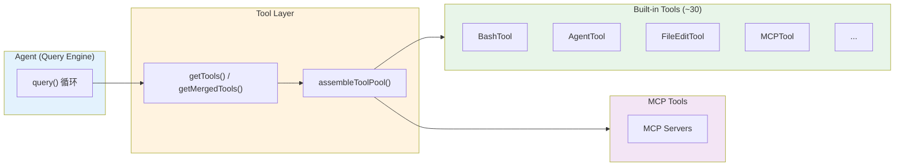
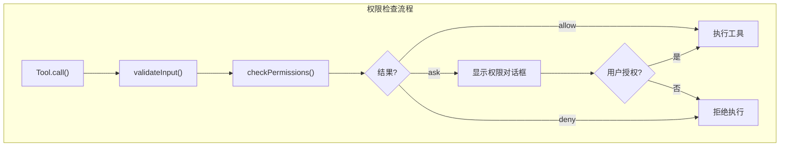
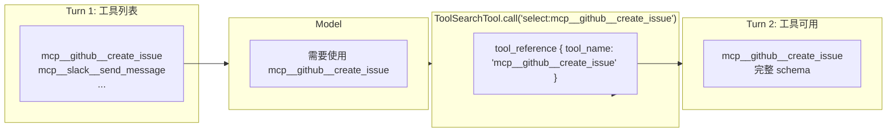
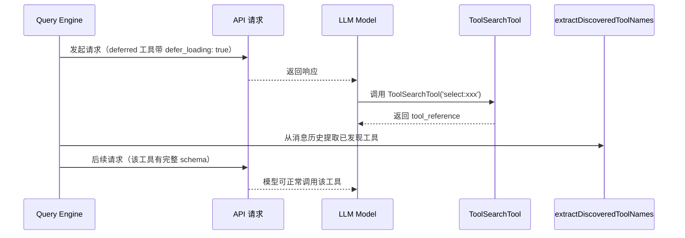
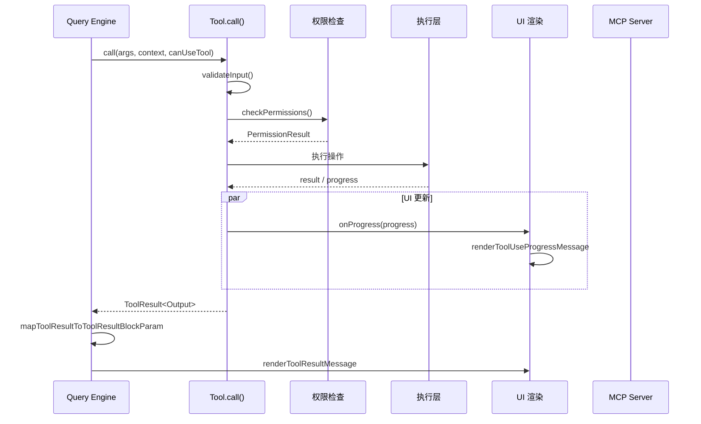

# Tool System 工具系统深度解析

> 本文档基于代码分析，整理 Claude Code 中工具体系的完整设计。

## 概述

Claude Code 的 Tool 系统是 **Agent 与外界交互的核心通道**。工具通过标准化接口封装各种操作（文件操作、Shell 执行、Agent 启动等），Agent 通过统一的 `call()` 方法调用工具，通过 `ToolUseContext` 获取执行上下文。



---

## 一、核心类型系统 (`Tool.ts`)

### 1.1 Tool 接口

`Tool.ts` 定义了所有工具的标准化接口，是整个工具系统的核心契约：

```typescript
export type Tool<
  Input extends AnyObject = AnyObject,  // Zod 输入 schema
  Output = unknown,                      // 输出类型
  P extends ToolProgressData = ToolProgressData, // 进度类型
> = {
  // === 标识 ===
  readonly name: string
  aliases?: string[]                    // 向后兼容别名
  searchHint?: string                   // ToolSearch 关键词提示

  // === Schema ===
  readonly inputSchema: Input           // Zod 输入 schema
  readonly inputJSONSchema?: ToolInputJSONSchema  // JSON Schema（用于 MCP）
  outputSchema?: z.ZodType<unknown>     // 输出 schema

  // === 核心调用 ===
  call(
    args: z.infer<Input>,
    context: ToolUseContext,
    canUseTool: CanUseToolFn,
    parentMessage: AssistantMessage,
    onProgress?: ToolCallProgress<P>,
  ): Promise<ToolResult<Output>>

  description(
    input: z.infer<Input>,
    options: {...},
  ): Promise<string>

  // === 能力声明 ===
  isConcurrencySafe(input: z.infer<Input>): boolean
  isReadOnly(input: z.infer<Input>): boolean
  isDestructive?(input: z.infer<Input>): boolean
  isEnabled(): boolean

  // === 权限 & 验证 ===
  validateInput?(input, context): Promise<ValidationResult>
  checkPermissions(input, context): Promise<PermissionResult>
  preparePermissionMatcher?(input): Promise<(pattern: string) => boolean>

  // === 渲染 (UI) ===
  renderToolUseMessage(input, options): React.ReactNode
  renderToolResultMessage?(content, progress, options): React.ReactNode
  renderToolUseProgressMessage?(progress, options): React.ReactNode
  renderToolUseRejectedMessage?(input, options): React.ReactNode
  renderToolUseErrorMessage?(result, options): React.ReactNode
  renderGroupedToolUse?(toolUses, options): React.ReactNode | null
  extractSearchText?(output): string
  getToolUseSummary?(input): string | null
  getActivityDescription?(input): string | null
  renderToolUseTag?(input): React.ReactNode

  // === 安全分类 ===
  toAutoClassifierInput(input: z.infer<Input>): unknown

  // === 工具特征 ===
  isSearchOrReadCommand?(input): { isSearch: boolean; isRead: boolean; isList?: boolean }
  isOpenWorld?(input): boolean
  requiresUserInteraction?(): boolean
  interruptBehavior?(): 'cancel' | 'block'
  isTransparentWrapper?(): boolean
  isMcp?: boolean
  isLsp?: boolean
  shouldDefer?: boolean                 // 是否延迟加载
  alwaysLoad?: boolean                  // 始终加载（不延迟）

  // === 其他 ===
  inputsEquivalent?(a, b): boolean
  getPath?(input): string               // 工具操作的文件路径
  maxResultSizeChars: number             // 结果大小限制
  strict?: boolean

  // === Prompt 生成 ===
  prompt(options): Promise<string>
  userFacingName(input): string
  userFacingNameBackgroundColor?(input): keyof Theme | undefined

  // === 输出映射 ===
  mapToolResultToToolResultBlockParam(content, toolUseID): ToolResultBlockParam
  backfillObservableInput?(input): void
}
```

### 1.2 `buildTool` 工厂函数

所有工具通过 `buildTool()` 创建，自动填充默认值：

```typescript
const TOOL_DEFAULTS = {
  isEnabled: () => true,
  isConcurrencySafe: (_input) => false,   // 默认：假设不安全
  isReadOnly: (_input) => false,         // 默认：假设有写操作
  isDestructive: (_input) => false,
  checkPermissions: (input) => ({ behavior: 'allow', updatedInput: input }),
  toAutoClassifierInput: () => '',        // 默认：跳过安全分类
  userFacingName: () => name,
}

export function buildTool<D extends ToolDef>(def: D): BuiltTool<D> {
  return { ...TOOL_DEFAULTS, userFacingName: () => def.name, ...def } as BuiltTool<D>
}
```

**设计原则**：fail-closed（默认不安全），每个工具必须显式声明自己是安全的。

### 1.3 ToolUseContext

工具执行的完整上下文，通过 `call()` 传递给每个工具：

```typescript
export type ToolUseContext = {
  // === 执行环境 ===
  abortController: AbortController
  messages: Message[]                    // 对话历史
  agentId?: AgentId                      // SubAgent 的 ID
  agentType?: string

  // === 状态管理 ===
  getAppState(): AppState
  setAppState(f: (prev: AppState) => AppState): void
  setAppStateForTasks?: (f: (prev: AppState) => AppState) => void

  // === 工具选项 ===
  options: {
    tools: Tools
    commands: Command[]
    debug: boolean
    verbose: boolean
    mainLoopModel: string
    thinkingConfig: ThinkingConfig
    mcpClients: MCPServerConnection[]
    mcpResources: Record<string, ServerResource[]>
    customSystemPrompt?: string
    appendSystemPrompt?: string
    refreshTools?: () => Tools           // 动态刷新工具列表
    // ...
  }

  // === 交互 & UI ===
  setToolJSX?: SetToolJSXFn             // 显示工具进度 UI
  setHasInterruptibleToolInProgress?: (v: boolean) => void
  addNotification?: (notif: Notification) => void
  sendOSNotification?: (opts) => void
  requestPrompt?: (sourceName, toolInputSummary?) => (request: PromptRequest) => Promise<PromptResponse>

  // === 文件 & 会话 ===
  readFileState: FileStateCache
  updateFileHistoryState: (f: (prev: FileHistoryState) => FileHistoryState) => void
  updateAttributionState: (f: (prev: AttributionState) => FileHistoryState) => void

  // === 工具执行追踪 ===
  toolUseId?: string
  setInProgressToolUseIDs: (f: (prev: Set<string>) => Set<string>) => void
  toolDecisions?: Map<string, { source: string; decision: 'accept' | 'reject'; timestamp: number }>

  // === 权限 & 验证 ===
  localDenialTracking?: DenialTrackingState
  contentReplacementState?: ContentReplacementState
  requireCanUseTool?: boolean

  // === Prompt 缓存 ===
  renderedSystemPrompt?: SystemPrompt    // 冻结的系统提示词字节数

  // === 其他 ===
  queryTracking?: QueryChainTracking
  criticalSystemReminder_EXPERIMENTAL?: string
  appendSystemMessage?: (msg: SystemMessage) => void
  openMessageSelector?: () => void
  // ...
}
```

### 1.4 工具结果类型

```typescript
export type ToolResult<T> = {
  data: T                               // 工具返回数据
  newMessages?: (UserMessage | AssistantMessage | AttachmentMessage | SystemMessage)[]
  // 插入到对话的新消息（如 AgentTool 的子 Agent 消息）
  contextModifier?: (context: ToolUseContext) => ToolUseContext
  // 修改后续工具调用的上下文
  mcpMeta?: { _meta?: Record<string, unknown>; structuredContent?: Record<string, unknown> }
  // MCP 协议元数据
}

export type ToolProgress<P extends ToolProgressData = ToolProgressData> = {
  toolUseID: string
  data: P                               // 进度数据（类型化）
}
```

---

## 二、工具注册与分发 (`tools.ts`)

### 2.1 工具列表获取

```typescript
// 获取所有可能可用的工具（不考虑权限过滤）
export function getAllBaseTools(): Tools

// 获取给定权限上下文下的工具（排除被拒绝的工具）
export function getTools(permissionContext: ToolPermissionContext): Tools

// 合并 built-in + MCP 工具（去重，built-in 优先）
export function assembleToolPool(
  permissionContext: ToolPermissionContext,
  mcpTools: Tools,
): Tools

// 获取所有工具（包括 MCP）
export function getMergedTools(
  permissionContext: ToolPermissionContext,
  mcpTools: Tools,
): Tools
```

### 2.2 工具条件加载（Dead Code Elimination）

工具通过 `feature()` 标志和 `process.env` 条件引入，实现按需编译：

```typescript
// 始终包含的核心工具
return [
  AgentTool,
  TaskOutputTool,
  BashTool,
  // 嵌入式搜索工具可用时，隐藏 Glob/Grep
  ...(hasEmbeddedSearchTools() ? [] : [GlobTool, GrepTool]),
  // ...
]

// 条件包含
...(process.env.USER_TYPE === 'ant' ? [REPLTool] : []),
...(isTodoV2Enabled() ? [TaskCreateTool, TaskGetTool, TaskUpdateTool, TaskListTool] : []),
...(isEnvTruthy(process.env.ENABLE_LSP_TOOL) ? [LSPTool] : []),
...(isAgentSwarmsEnabled() ? [getTeamCreateTool(), getTeamDeleteTool()] : []),
...cronTools,
...(WorkflowTool ? [WorkflowTool] : []),
```

### 2.3 简单模式工具集

```typescript
// --bare 模式：仅 Bash + Read + Edit
if (isEnvTruthy(process.env.CLAUDE_CODE_SIMPLE)) {
  if (isReplModeEnabled() && REPLTool) {
    return [REPLTool]  // REPL 包装了底层工具
  }
  return [BashTool, FileReadTool, FileEditTool]
}
```

---

## 三、工具分类体系

### 3.1 核心内置工具（~30 个）

| 工具 | 用途 | 关键特性 |
|------|------|----------|
| **BashTool** | Shell 命令执行 | 沙箱、安全验证、命令分类（search/read/list）、进度显示 |
| **AgentTool** | 启动 SubAgent | 支持 foreground/background、worktree 隔离、远程执行 |
| **FileReadTool** | 读取文件 | 编码检测、行数限制、大文件流式读取、图片处理 |
| **FileEditTool** | 编辑文件 | sed 解析、安全验证、原子性写入 |
| **FileWriteTool** | 写入文件 | 目录创建、编码处理 |
| **GlobTool** | 文件模式匹配 | 搜索限制、大小限制 |
| **GrepTool** | 内容搜索 | 正则、上下文、行号 |
| **NotebookEditTool** | Jupyter 笔记本编辑 | 单元格操作 |
| **WebFetchTool** | HTTP 请求 | URL 验证、错误处理 |
| **WebSearchTool** | 网络搜索 | 进度追踪 |
| **MCPTool** | MCP 服务器工具代理 | 动态 schema、elicitation |
| **TodoWriteTool** | 任务清单管理 | 阻塞关系、认领机制 |
| **TaskCreateTool / TaskGetTool / TaskUpdateTool / TaskListTool** | TodoList v2 | 依赖管理 |
| **TaskStopTool** | 停止后台任务 | 任务终止 |
| **TaskOutputTool** | 查看任务输出 | 文件读取 |
| **AskUserQuestionTool** | 向用户提问 | 交互式提示 |
| **EnterPlanModeTool / ExitPlanModeV2Tool** | 计划模式 | 主线程抽象 |
| **EnterWorktreeTool / ExitWorktreeTool** | Git worktree 管理 | 隔离执行环境 |
| **ConfigTool** | 配置管理（Ant only） | 设置读写 |
| **LSPTool** | 语言服务器协议 | 格式化、符号跳转 |
| **SkillTool** | Skill 调用 | 工具能力扩展 |
| **BriefTool** | 文件摘要 | AI 生成摘要 |
| **GrepTool / GlobTool** | 代码搜索 | 内嵌 vs 独立 |
| **ToolSearchTool** | 延迟工具搜索 | defer 机制 |
| **ListMcpResourcesTool / ReadMcpResourceTool** | MCP 资源访问 | URI 路由 |
| **SnipTool** | 历史剪报（HISTORY_SNIP） | 历史记录剪报 |
| **WorkflowTool** | 工作流脚本 | 脚本执行 |
| **CronCreateTool / CronDeleteTool / CronListTool** | 定时任务 | 基于 crontab |
| **RemoteTriggerTool** | 远程触发 | Agent 触发器 |
| **MonitorTool** | MCP 服务器监控 | 健康检查 |
| **SendMessageTool** | 进程间消息 | Team 协作 |
| **TeamCreateTool / TeamDeleteTool** | Team 管理 | Agent swarm |
| **PushNotificationTool / SubscribePRTool** | GitHub 集成 | Webhook |
| **WebBrowserTool** | 浏览器自动化 | 截图、点击、导航 |

### 3.2 BashTool 命令分类

BashTool 通过命令语义分析，自动识别操作的性质：

```typescript
// 可折叠的搜索命令
const BASH_SEARCH_COMMANDS = new Set([
  'find', 'grep', 'rg', 'ag', 'ack', 'locate', 'which', 'whereis'
])

// 可折叠的读取命令
const BASH_READ_COMMANDS = new Set([
  'cat', 'head', 'tail', 'less', 'more', 'wc', 'stat', 'file', 'strings',
  'jq', 'awk', 'cut', 'sort', 'uniq', 'tr'
])

// 可折叠的目录列表命令
const BASH_LIST_COMMANDS = new Set(['ls', 'tree', 'du'])

// 语义中立命令（不改变 pipeline 性质）
const BASH_SEMANTIC_NEUTRAL_COMMANDS = new Set([
  'echo', 'printf', 'true', 'false', ':'
])
```

---

## 四、工具权限体系

### 4.1 权限模式

```typescript
export type ToolPermissionContext = DeepImmutable<{
  mode: PermissionMode                    // 'default' | 'moderate' | 'bypass' | 'auto'
  additionalWorkingDirectories: Map<string, AdditionalWorkingDirectory>
  alwaysAllowRules: ToolPermissionRulesBySource
  alwaysDenyRules: ToolPermissionRulesBySource
  alwaysAskRules: ToolPermissionRulesBySource
  isBypassPermissionsModeAvailable: boolean
  isAutoModeAvailable?: boolean
  shouldAvoidPermissionPrompts?: boolean  // 后台 Agent 自动拒绝
  awaitAutomatedChecksBeforeDialog?: boolean
  prePlanMode?: PermissionMode
}>
```

### 4.2 工具拒绝规则

```typescript
// 全局禁止的工具（所有 Agent 都不能用）
export const ALL_AGENT_DISALLOWED_TOOLS = new Set([
  TASK_OUTPUT_TOOL_NAME,
  EXIT_PLAN_MODE_V2_TOOL_NAME,
  ENTER_PLAN_MODE_TOOL_NAME,
  ...(process.env.USER_TYPE === 'ant' ? [] : [AGENT_TOOL_NAME]),  // Ant 可嵌套
  ASK_USER_QUESTION_TOOL_NAME,
  TASK_STOP_TOOL_NAME,
  ...(feature('WORKFLOW_SCRIPTS') ? [WORKFLOW_TOOL_NAME] : []),
])

// 异步 Agent 可用的工具
export const ASYNC_AGENT_ALLOWED_TOOLS = new Set([
  FILE_READ_TOOL_NAME, WEB_SEARCH_TOOL_NAME, TODO_WRITE_TOOL_NAME,
  GREP_TOOL_NAME, WEB_FETCH_TOOL_NAME, GLOB_TOOL_NAME,
  ...SHELL_TOOL_NAMES,
  FILE_EDIT_TOOL_NAME, FILE_WRITE_TOOL_NAME, NOTEBOOK_EDIT_TOOL_NAME,
  SKILL_TOOL_NAME, SYNTHETIC_OUTPUT_TOOL_NAME, TOOL_SEARCH_TOOL_NAME,
  ENTER_WORKTREE_TOOL_NAME, EXIT_WORKTREE_TOOL_NAME,
])

// 协调者模式工具
export const COORDINATOR_MODE_ALLOWED_TOOLS = new Set([
  AGENT_TOOL_NAME, TASK_STOP_TOOL_NAME, SEND_MESSAGE_TOOL_NAME, SYNTHETIC_OUTPUT_TOOL_NAME,
])
```

### 4.3 权限检查流程



---

## 五、MCP 工具集成

### 5.1 MCPTool 架构

MCPTool 是一个**泛型包装器**，动态适配任何 MCP 服务器的工具：

```typescript
// MCPTool.ts - 基础模板
export const MCPTool = buildTool({
  isMcp: true,
  name: 'mcp',                           // 运行时被 mcp__server__tool 覆盖
  maxResultSizeChars: 100_000,
  async description() { return DESCRIPTION }
  async prompt() { return PROMPT }
  get inputSchema() { return inputSchema() }  // 运行时从 MCP server 获取
  async call() { return { data: '' } }         // 运行时调用真实 MCP 工具
  async checkPermissions() {
    return { behavior: 'passthrough' }  // 委托给 MCP 层权限
  },
  // ...渲染方法
})
```

### 5.2 MCP 工具注册

```typescript
// mcpClient.ts - 动态创建 MCP 工具实例
function createMcpTool(serverName: string, toolName: string, schema): Tool {
  return {
    ...MCPTool,                          // 复制基础模板
    name: `mcp__${serverName}__${toolName}`,  // 标准化命名
    mcpInfo: { serverName, toolName },
    inputSchema: schema,                 // MCP 提供的 JSON Schema
    async call(args, context) {
      // 调用 MCP 服务器
      const result = await mcpClient.callTool({ name: toolName, arguments: args })
      return { data: result.content }
    }
  }
}
```

### 5.3 工具池组装

```typescript
export function assembleToolPool(
  permissionContext: ToolPermissionContext,
  mcpTools: Tools,
): Tools {
  const builtInTools = getTools(permissionContext)
  const allowedMcpTools = filterToolsByDenyRules(mcpTools, permissionContext)

  // 按名称排序，保持 built-in 工具在前（用于 prompt cache）
  const byName = (a: Tool, b: Tool) => a.name.localeCompare(b.name)
  return uniqBy(
    [...builtInTools].sort(byName).concat(allowedMcpTools.sort(byName)),
    'name',                              // built-in 优先
  )
}
```

---

## 六、工具延迟加载（ToolSearch）

### 6.1 核心原理

延迟加载通过 **API 的 `defer_loading` 标志** 实现。Deferred 工具在系统提示词中只显示**名称**，不显示完整 schema，模型需要先调用 `ToolSearchTool` 获取完整定义后才能使用。



### 6.2 延迟规则

`isDeferredTool()` 判断工具是否延迟：

```typescript
// prompt.ts - isDeferredTool()
export function isDeferredTool(tool: Tool): boolean {
  // 1. alwaysLoad=true → 从不延迟（Turn 1 必需）
  if (tool.alwaysLoad === true) return false

  // 2. MCP 工具 → 始终延迟（workflow-specific）
  if (tool.isMcp === true) return true

  // 3. ToolSearchTool 自身 → 从不延迟
  if (tool.name === TOOL_SEARCH_TOOL_NAME) return false

  // 4. Fork-first 实验：Agent 必须 Turn 1 可用
  if (feature('FORK_SUBAGENT') && tool.name === AGENT_TOOL_NAME) {
    if (isForkSubagentEnabled()) return false
  }

  // 5. Brief/SendUserFile → 必须 Turn 1 可用（通信通道）
  if (tool.name === BRIEF_TOOL_NAME) return false
  if (tool.name === SEND_USER_FILE_TOOL_NAME) return false

  // 6. 其他：shouldDefer=true → 延迟
  return tool.shouldDefer === true
}
```

**被延迟的工具**（约 15 个内置 + 所有 MCP）：
```
TaskOutputTool, AskUserQuestionTool, ExitPlanModeV2Tool,
EnterPlanModeTool, TaskStopTool, TaskCreateTool, TaskGetTool,
TaskUpdateTool, TaskListTool, SendMessageTool, TeamCreateTool,
TeamDeleteTool, EnterWorktreeTool, ExitWorktreeTool,
RemoteTriggerTool, CronCreateTool, CronDeleteTool, CronListTool,
+ 所有 MCP 服务器提供的工具
```

### 6.3 ToolSearchTool 搜索能力

```typescript
// ToolSearchTool.call() 支持两种查询方式

// 1. 直接选择（精确匹配）
"select:Read,Edit,Grep"                      // 逗号分隔多选
"select:mcp__github__create_issue"             // MCP 工具全名

// 2. 关键词搜索
"notebook jupyter"      // 模糊匹配名称 + 描述
"+slack send"           // + 表示必须包含（可选 +term 强制包含）
```

**搜索评分算法**（`searchToolsWithKeywords`）：

| 匹配类型 | MCP 工具权重 | Built-in 权重 |
|---------|-------------|--------------|
| 精确的部分名匹配 | +12 | +10 |
| 包含匹配（part.includes(term)） | +6 | +5 |
| `searchHint` 关键词匹配 | +4 | +4 |
| 描述（description）匹配 | +2 | +2 |

### 6.4 动态加载支持

**支持真正的动态加载**。当 ToolSearchTool 返回 `tool_reference` 块后，后续请求中只发送已发现的延迟工具：

```typescript
// claude.ts - 提取已发现的工具
export function extractDiscoveredToolNames(messages: Message[]): Set<string> {
  // 扫描消息历史中的 tool_reference 块
  for (const msg of messages) {
    if (msg.type === 'user') {
      for (const block of msg.message?.content) {
        if (block.type === 'tool_result') {
          for (const item of block.content) {
            if (item.type === 'tool_reference') {
              discoveredTools.add(item.tool_name)
            }
          }
        }
      }
    }
  }
  return discoveredTools
}

// 后续 API 请求
if (useToolSearch) {
  const discoveredToolNames = extractDiscoveredToolNames(messages)
  // 只包含已被 ToolSearchTool 返回的工具
  // → 支持无限量 MCP 工具
}
```

**这意味着**：
- 理论上可以支持**无限量**的 MCP 工具（不需要全部预声明）
- 模型在 Turn 1 只看到 `alwaysLoad` 工具
- 随着对话进行，通过 ToolSearchTool 动态加载需要的工具

### 6.5 API 层实现

```typescript
// claude.ts - toolToAPISchema
const schema: BetaToolWithExtras = {
  name: base.name,
  input_schema: base.input_schema,
  // ...
}

// 添加 defer_loading 标志
if (options.deferLoading) {
  schema.defer_loading = true
}

// Beta header 必须在请求中设置
if (useToolSearch && getAPIProvider() !== 'bedrock') {
  betas.push(getToolSearchBetaHeader())  // 'advanced-tool-use' 或 'tool-search-tool'
}
```

### 6.6 容错机制

#### 6.6.1 MCP 服务器未连接

```typescript
// ToolSearchTool.call() 返回 pending 服务器信息
function getPendingServerNames(): string[] | undefined {
  const appState = getAppState()
  const pending = appState.mcp.clients.filter(c => c.type === 'pending')
  return pending.length > 0 ? pending.map(s => s.name) : undefined
}

// 返回结果示例
if (matches.length === 0) {
  return buildSearchResult([], query, deferredTools.length,
    pendingServers  // ["github", "slack"]
  )
}
```

#### 6.6.2 工具选择容错

```typescript
// 如果 select: 的工具不在 deferred 集合，但在完整工具集中存在
// → 直接返回（已经加载过，是无害的 no-op）
const tool = findToolByName(deferredTools, toolName)
  ?? findToolByName(tools, toolName)  // 回退到完整集合
```

#### 6.6.3 阈值自动启用（`tst-auto` 模式）

```typescript
// 默认：token 数 > 10% 上下文窗口时启用
ENABLE_TOOL_SEARCH=auto        // 默认阈值 10%
ENABLE_TOOL_SEARCH=auto:5       // 自定义阈值 5%

// 检测逻辑
const deferredToolTokens = await getDeferredToolTokenCount(...)
if (deferredToolTokens !== null) {
  // 使用精确 token 计数
  enabled = deferredToolTokens >= threshold
} else {
  // 字符数启发式备选
  enabled = deferredToolDescriptionChars >= charThreshold
}
```

#### 6.6.4 第三方代理兼容性

```typescript
// ANTHROPIC_BASE_URL 非官方地址时，默认禁用 tool search
if (
  !process.env.ENABLE_TOOL_SEARCH &&  // 用户未显式设置
  getAPIProvider() === 'firstParty' &&
  !isFirstPartyAnthropicBaseUrl()
) {
  return false  // 禁用（第三方代理通常不支持 defer_loading）
}
// 用户可通过 ENABLE_TOOL_SEARCH=true 强制启用
```

#### 6.6.5 模型兼容性

```typescript
// Haiku 不支持 tool_reference，默认禁用
const DEFAULT_UNSUPPORTED_MODEL_PATTERNS = ['haiku']

export function modelSupportsToolReference(model: string): boolean {
  // 否定测试：新模型默认支持，除非在不支持列表中
  for (const pattern of unsupportedPatterns) {
    if (normalizedModel.includes(pattern)) return false
  }
  return true
}
```

#### 6.6.6 Compact（上下文压缩）保留

```typescript
// compact.ts
const preCompactDiscovered = extractDiscoveredToolNames(messages)
// 压缩边界携带 preCompactDiscoveredTools
// 后续扫描时从 compactMetadata 恢复已发现的工具集合
```

#### 6.6.7 缓存失效检测

```typescript
// PROMPT_CACHE_BREAK_DETECTION: 排除 defer_loading 工具对 hash 的影响
const toolsForCacheDetection = allTools.filter(
  t => !('defer_loading' in t && t.defer_loading)
)
// 因为 API 会从 prompt 中剥离这些工具，包含它们会产生假阳性
```

### 6.7 配置方式

| 环境变量 | 模式 | 说明 |
|---------|------|------|
| `ENABLE_TOOL_SEARCH=true` | `tst` | 始终启用（默认） |
| `ENABLE_TOOL_SEARCH=auto` | `tst-auto` | 超过阈值才启用（默认 10% 上下文） |
| `ENABLE_TOOL_SEARCH=auto:5` | `tst-auto` | 自定义阈值 5% |
| `ENABLE_TOOL_SEARCH=false` | `standard` | 禁用，所有工具直接加载 |
| `ENABLE_TOOL_SEARCH=auto:100` | `standard` | 阈值 100% = 从不触发 |
| `CLAUDE_CODE_DISABLE_EXPERIMENTAL_BETAS=true` | — | Kill switch，强制禁用所有 beta |

### 6.8 延迟工具池变化通知

当 MCP 服务器连接/断开时，延迟工具池会变化。通知模型有两种方式：

```typescript
// 方式 1: <available-deferred-tools> 消息（默认）
// 每次 API 请求前 prepend 到 user 消息

// 方式 2: deferred_tools_delta attachment（Ant + glacier_2xr 实验）
// 只报告新增/移除的工具，减少 token 开销
export function getDeferredToolsDelta(
  tools: Tools,
  messages: Message[],
): DeferredToolsDelta | null {
  const announced = // 从历史消息中重建已通知的工具集合
  const added = deferred.filter(t => !announced.has(t.name))
  const removed = announced.filter(n => !deferredNames.has(n))
  // 返回增量变化
}
```

### 6.9 完整加载流程

以下是多轮对话中延迟工具的完整生命周期：

#### 6.9.1 Turn 1：初始状态

```
API 请求
├── tools: [alwaysLoad 工具..., deferred 工具（带 defer_loading: true）]
└── system: <available-deferred-tools> 列表

模型收到的 deferred 工具只有名称，没有完整 schema：
{
  name: 'mcp__github__create_issue',
  defer_loading: true,
  input_schema: { type: 'object', properties: {} }  // 最小 schema
}
```

#### 6.9.2 模型决策使用延迟工具

```
模型决策："用户要我创建一个 GitHub issue，需要调用 mcp__github__create_issue"
         ↓
模型调用 ToolSearchTool
{
  query: 'select:mcp__github__create_issue'  // 或关键词搜索
}
```

#### 6.9.3 ToolSearchTool 处理

```typescript
// ToolSearchTool.call() 逻辑

// 1. 解析 select: 前缀
const selectMatch = query.match(/^select:(.+)$/i)
if (selectMatch) {
  const toolName = selectMatch[1]

  // 2. 在 deferredTools 中查找
  const tool = findToolByName(deferredTools, toolName)
    ?? findToolByName(tools, toolName)  // 也支持已加载的工具

  // 3. 返回 tool_reference
  return {
    data: {
      matches: [tool.name],
      query,
      total_deferred_tools: deferredTools.length
    }
  }
}

// 4. mapToolResultToToolResultBlockParam() 生成 tool_reference 块
{
  type: 'tool_reference',
  tool_name: 'mcp__github__create_issue'
}
```

#### 6.9.4 后续请求：工具变为可用

```
API 请求（带有 ToolSearchTool 的结果）
├── tools: [
│   ├── 基础工具...,
│   └── mcp__github__create_issue（现在有完整 schema，不再 defer_loading）
│   ]
└── messages: [
    { role: 'user', content: [
      { type: 'tool_result', content: [
        { type: 'tool_reference', tool_name: 'mcp__github__create_issue' }
      ]}
    ]}
  ]

模型现在可以正常调用该工具了
```

#### 6.9.5 核心代码路径



#### 6.9.6 关键机制总结

| 步骤 | 机制 |
|------|------|
| 模型知道有哪些延迟工具 | `<available-deferred-tools>` 用户消息 |
| 模型选择工具 | 调用 `ToolSearchTool` + `select:` |
| 工具变为可用 | `tool_reference` 被 API 识别，后续请求包含完整 schema |
| 支持动态数量 | 只发送被选中的工具，不受工具数量限制 |
| 多次选择 | 模型可在同一对话中选择多个延迟工具 |

---

### 6.10 关键设计决策

| 决策 | 原因 |
|------|------|
| MCP 工具默认延迟 | 数量可能很大，workflow-specific，不需要 Turn 1 就加载 |
| `alwaysLoad` 退出机制 | 某些工具（如 Brief）必须 Turn 1 可用 |
| `tool_reference` 而非名称路由 | API 原生支持，无需自定义解析 |
| 延迟工具池 diff 机制 | 新 MCP 连接时通知模型，避免遗漏 |
| 搜索评分区分 MCP/built-in | MCP server 名权重更高（因为用户通常按 server 搜索） |
| Haiku 默认不支持 | tool_reference 是较新的 beta 功能，老模型不支持 |
| 第三方代理默认禁用 | 避免 400 错误（代理可能拒绝不认识的字段） |

### 6.11 工具发送给 LLM 的方式

**工具通过 API 请求体的 `tools` 字段发送，不在系统提示词中。**

```typescript
// services/api/claude.ts - paramsFromContext()
return {
  model: normalizeModelStringForAPI(options.model),
  messages: addCacheBreakpoints(messagesForAPI, ...),
  system,                              // 系统提示词（工具描述、指令等）
  tools: allTools,                      // ← 工具在此处发送
  tool_choice: options.toolChoice,
  // ...
}
```

**三层内容区分**：

| 内容 | 位置 | 用途 |
|------|------|------|
| 工具定义（name、schema） | `tools` 参数 | API 原生工具调用机制 |
| 工具描述文本（prompt） | `system` 参数 | 工具用途说明、使用指导 |
| 延迟工具名称列表 | `<available-deferred-tools>` 用户消息 | 告知模型哪些工具可用但不加载 |

**转换过程**：

```typescript
// utils/api.ts - toolToAPISchema()
export async function toolToAPISchema(
  tool: Tool,
  options: {
    getToolPermissionContext: () => Promise<ToolPermissionContext>
    tools: Tools
    agents: AgentDefinition[]
    deferLoading?: boolean
    // ...
  },
): Promise<BetaToolUnion> {
  const base = await getBaseToolSchema(tool, options)
  const schema: BetaToolWithExtras = {
    name: base.name,
    input_schema: base.input_schema,
    // ...
  }

  // 添加 defer_loading 标志
  if (options.deferLoading) {
    schema.defer_loading = true
  }

  return schema
}
```

**延迟工具的特殊处理**：

```typescript
// 延迟工具在 API 请求中带有 defer_loading: true
// 模型收到后不会立即可用，需要通过 ToolSearchTool 选择

// Turn 1: 延迟工具只有名称，没有完整 schema
{
  name: 'mcp__github__create_issue',
  input_schema: { /* 最小 schema */ },
  defer_loading: true
}

// Turn 2+: 模型调用 ToolSearchTool('select:mcp__github__create_issue')
// 返回 tool_reference 后，后续请求中该工具有完整 schema
```

---

## 七、工具执行流程

### 7.1 完整调用链



### 7.2 并发安全

```typescript
isConcurrencySafe(input: z.infer<Input>): boolean

// BashTool: 写操作不安全
isConcurrencySafe(input) {
  return this.isReadOnly(input)
}

// MCPTool: MCP 服务器自行决定
isConcurrencySafe: () => false
```

### 7.3 终端行为

```typescript
interruptBehavior?(): 'cancel' | 'block'

// 'cancel' - 停止工具，丢弃结果
// 'block'  - 保持运行，新消息等待（默认）

// BashTool: 写操作可取消
isDestructive: (input) => !this.isReadOnly(input)
interruptBehavior: () => 'cancel'
```

---

## 八、工具 UI 渲染系统

### 8.1 渲染方法层次

```typescript
// 工具调用消息（正在执行）
renderToolUseMessage(input, options): React.ReactNode

// 工具执行进度
renderToolUseProgressMessage?(progress, options): React.ReactNode

// 工具调用排队
renderToolUseQueuedMessage?(): React.ReactNode

// 工具结果
renderToolResultMessage?(content, progress, options): React.ReactNode

// 工具被拒绝
renderToolUseRejectedMessage?(input, options): React.ReactNode

// 工具执行错误
renderToolUseErrorMessage?(result, options): React.ReactNode

// 工具标签（超时、模型等元数据）
renderToolUseTag?(input): React.ReactNode

// 批量渲染（verbose=false 时）
renderGroupedToolUse?(toolUses, options): React.ReactNode | null
```

### 8.2 进度消息类型

```typescript
// types/tools.ts
type BashProgress = {
  type: 'bash'
  data: {
    shellId?: number
    cwd?: string
    partialLine?: string
    exitCode?: number
  }
}

type AgentToolProgress = {
  type: 'agent'
  data: {
    status: 'started' | 'progress' | 'completed' | 'error'
    message?: string
    toolUseId?: string
  }
}

type MCPProgress = {
  type: 'mcp'
  data: { serverName: string; progress?: unknown }
}

type SkillToolProgress = {
  type: 'skill'
  data: { skillName: string; message: string }
}
```

---

## 九、Tool vs Agent vs Task 关系

### 9.1 职责划分

| 系统 | 职责 | 创建者 | 执行方式 |
|------|------|--------|----------|
| **Tool** | 原子操作（文件、Shell、搜索等） | 框架 + Agent 调用 | 同步调用，返回 `ToolResult` |
| **Agent** | 决策 + 多轮 Tool 调用循环 | `AgentTool` 显式启动 | SubAgent 独立 `query()` 循环 |
| **Task（后台任务）** | 长时操作 | Tool 隐式创建（`AgentTool.call()` 触发） | `pollTasks()` 框架轮询 |

### 9.2 AgentTool 是工具也是任务工厂

`AgentTool.call()` 同时做了两件事：

1. **创建工具调用** — 同步等待，返回 Agent 执行结果
2. **创建后台任务** — 当 `run_in_background=true` 时，创建 `LocalAgentTask`，由 `pollTasks()` 管理生命周期

```typescript
// AgentTool.call()
if (run_in_background) {
  // 创建后台任务
  registerAsyncAgent(agentId, { ... })
  return { data: { backgroundTaskId: agentId } }
} else {
  // 同步等待
  const result = await runAgent(...)
  return { data: extractResult(result) }
}
```

### 9.3 三者数据流

```mermaid
flowchart LR
    subgraph QueryLoop["Query Engine (Agent)"]
        query["query()"]
    end

    subgraph ToolLayer["Tool Layer"]
        call["call()"]
        progress["onProgress()"]
    end

    subgraph BackgroundTask["Background Task"]
        register["registerAsyncAgent()"]
        poll["pollTasks() (1s)"]
        notify["enqueueAgentNotification()"]
    end

    subgraph TaskState["AppState.tasks"]
        memory["内存状态"]
    end

    query --> call
    call --> progress
    call -->|"run_in_background=true"| register
    register --> memory
    poll --> memory
    memory --> notify
    notify --> query
```

---

## 十、相关文件

### 核心类型

| 文件 | 用途 |
|------|------|
| `Tool.ts` | `Tool` 接口定义、`buildTool` 工厂、`ToolUseContext`、`ToolResult` |
| `tools.ts` | 工具注册表、`getTools()`、`assembleToolPool()`、条件加载 |

### 工具实现

| 目录 | 用途 |
|------|------|
| `tools/BashTool/` | Shell 命令执行、安全验证、命令分类 |
| `tools/AgentTool/` | SubAgent 启动、生命周期、fork |
| `tools/FileEditTool/` | 文件编辑、sed 解析 |
| `tools/FileReadTool/` | 文件读取、大文件处理 |
| `tools/MCPTool/` | MCP 工具泛型包装器 |
| `tools/TaskOutputTool/` | 后台任务输出查看 |
| `tools/TodoWriteTool/` | 任务清单管理 |
| `tools/TaskCreateTool/` 等 | TodoList v2 任务管理工具组 |
| `tools/LSPTool/` | 语言服务器协议集成 |
| `tools/GlobTool/` / `GrepTool/` | 文件搜索 |
| `tools/WebSearchTool/` / `WebFetchTool/` | 网络工具 |
| `tools/SkillTool/` | Skill 调用 |
| `tools/EnterPlanModeTool/` 等 | Plan Mode 控制 |
| `tools/EnterWorktreeTool/` 等 | Worktree 隔离 |
| `tools/TeamCreateTool/` 等 | Team 管理 |
| `tools/ScheduleCronTool/` | 定时任务 |

### 权限系统

| 文件 | 用途 |
|------|------|
| `utils/permissions/permissions.ts` | 权限规则匹配、拒绝规则 |
| `utils/permissions/bashClassifier.ts` | Bash 命令安全分类 |
| `utils/permissions/denialTracking.ts` | 拒绝计数追踪 |
| `constants/tools.ts` | 工具白名单/黑名单常量 |

### MCP 集成

| 文件 | 用途 |
|------|------|
| `services/mcp/types.ts` | MCP 类型定义 |
| `services/mcp/client.ts` | MCP 客户端实现 |
| `services/mcp/SdkControlTransport.ts` | SDK 控制传输 |

### ToolSearch（延迟加载）

| 文件 | 用途 |
|------|------|
| `utils/toolSearch.ts` | 延迟加载核心逻辑、阈值检测、模型兼容性、工具池 diff |
| `tools/ToolSearchTool/ToolSearchTool.ts` | 搜索工具实现（select: / 关键词搜索） |
| `tools/ToolSearchTool/prompt.ts` | `isDeferredTool()` 判断规则、prompt 生成 |
| `services/api/claude.ts` | `defer_loading` API 标志应用、tool_reference 提取 |

---

## 十一、总结

### 设计原则

1. **标准化接口** — 所有工具实现统一 `Tool` 接口，`buildTool` 填充默认值
2. **Fail-closed 安全** — 默认不安全，每个工具显式声明 `isConcurrencySafe`/`isReadOnly`
3. **权限层次分明** — 全局禁用列表 → 权限上下文过滤 → 单工具 `checkPermissions`
4. **延迟加载** — ToolSearch 机制避免长系统提示词
5. **条件编译** — 通过 `feature()` 和 `process.env` 按需引入工具
6. **职责分离** — Tool（原子操作）、Agent（决策循环）、Task（长时执行）各司其职
7. **UI 渲染解耦** — 工具负责自己的渲染逻辑，通过 `renderToolUseMessage` 等接口

### 核心入口

- **工具池**：`tools.ts` → `getAllBaseTools()` / `getTools()` / `assembleToolPool()`
- **工具调用**：`Tool.ts` → `tool.call(args, context, canUseTool)`
- **MCP 集成**：`MCPTool` 泛型包装 + `mcpClient.ts` 动态实例化
- **权限过滤**：`filterToolsByDenyRules()` 在进入 prompt 前过滤工具
- **延迟加载**：`utils/toolSearch.ts` → `isDeferredTool()` / `extractDiscoveredToolNames()` / `getDeferredToolsDelta()`
