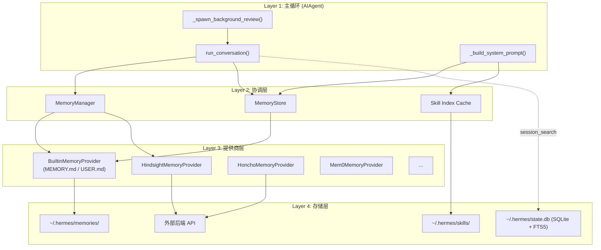
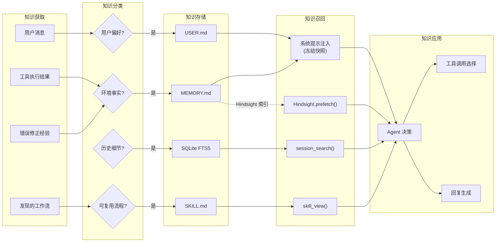
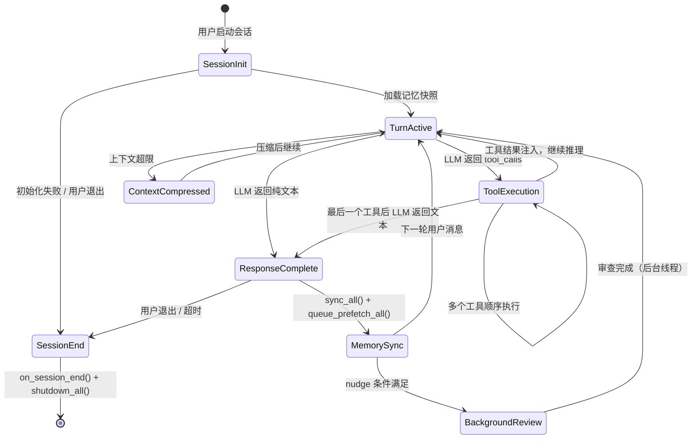
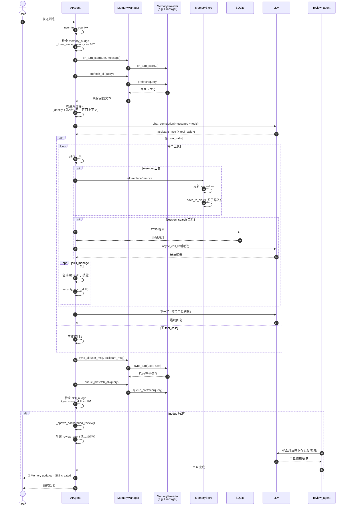
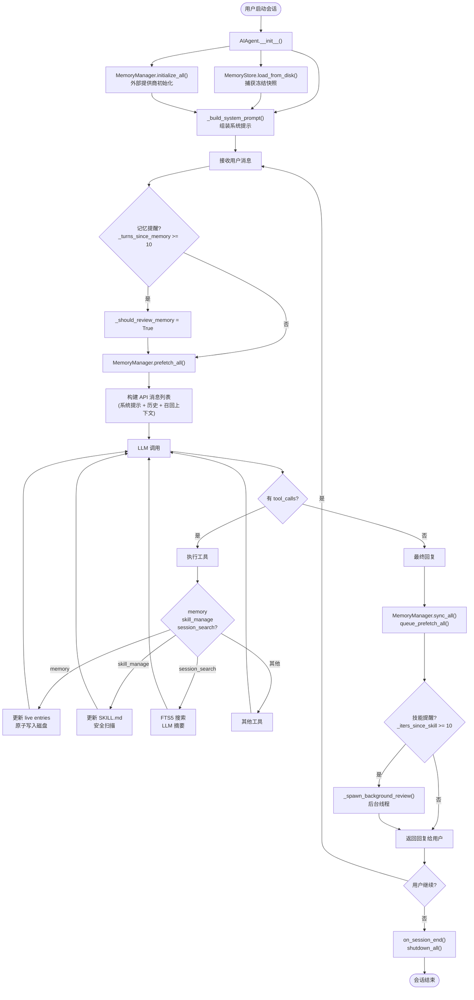
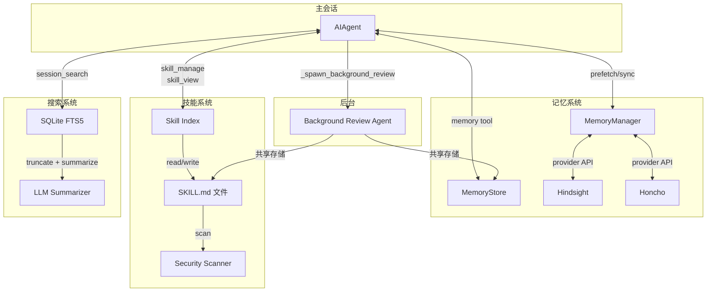

# 自进化学习循环 深度解析

> 本文档基于 Hermes Agent 代码库分析，整理其自进化学习循环（Self-Evolution Learning Loop）的完整设计。

## 目录

- [一、概述](#一概述)
- [二、核心概念](#二核心概念)
- [三、架构全景](#三架构全景)
- [四、完整数据流](#四完整数据流)
- [五、生命周期与状态流转](#五生命周期与状态流转)
- [六、核心工作流与交互时序](#六核心工作流与交互时序)
- [七、分模块详解](#七分模块详解)
  - [7.1 模块：内置记忆系统](#71-模块内置记忆系统)
  - [7.2 模块：技能系统](#72-模块技能系统)
  - [7.3 模块：会话搜索系统](#73-模块会话搜索系统)
  - [7.4 模块：外部记忆提供商](#74-模块外部记忆提供商)
  - [7.5 模块：后台审查引擎](#75-模块后台审查引擎)
  - [7.6 模块：流式输出系统](#76-模块流式输出系统)
- [八、设计原理与对比分析](#八设计原理与对比分析)
- [九、完整流程图](#九完整流程图)
- [十、相关文件索引](#十相关文件索引)
- [十一、总结](#十一总结)

---

## 一、概述

Hermes Agent 的**自进化学习循环**是一个让 AI Agent 在运行过程中积累经验、保存知识、召回知识并持续改进自身能力的闭环系统。它不依赖外部训练流程，而是在每次与用户的交互中实时完成"学习——记忆——应用——改进"的完整周期。

### 系统定位

| 维度 | 说明 |
|------|------|
| **核心职责** | 让 Agent 跨会话保持知识连续性，将成功经验转化为可复用技能 |
| **运行时机** | 嵌入在主对话循环中，每轮对话自动触发 |
| **知识形态** | 声明性记忆（事实）+ 程序性记忆（技能）+ 历史对话检索 |
| **持久化方式** | 文件系统（Markdown）+ SQLite（对话索引）+ 可选外部后端 |
| **与其他系统的关系** | 依赖工具调用循环提供写入接口；依赖系统提示注入提供召回通道；与上下文压缩系统协同防止信息丢失 |

### 关系总览表

| 相邻系统 | 交互方式 | 数据流向 |
|---------|---------|---------|
| 工具调用循环 | Agent 通过 `memory`、`skill_manage`、`session_search` 工具读写知识 | 双向：工具调用 → 知识存储；知识召回 → 系统提示注入 |
| 系统提示组装器 | 记忆/技能/会话搜索的指导语直接写入系统提示 | 单向：静态文本注入 |
| 上下文压缩器 | 压缩前通过 `on_pre_compress` 钩子提取待丢弃消息中的洞察 | 单向：压缩前提取 → 保留到摘要 |
| 子代理委派 | 父代理通过 `on_delegation` 观察子代理的完成结果 | 单向：子代理结果 → 父代理记忆 |
| 外部记忆插件 | 通过 `MemoryProvider` 抽象接口注册，由 `MemoryManager` 统一调度 | 双向：每轮预取 + 同步 |

---

## 二、核心概念

### 2.1 关键术语定义

| 术语 | 定义 | 示例 |
|------|------|------|
| **声明性记忆（Declarative Memory）** | 关于"是什么"的事实性知识，以陈述句形式保存 | "用户偏好 pytest 作为测试框架" |
| **程序性记忆（Procedural Memory）** | 关于"怎么做"的流程性知识，以可执行步骤保存 | 一个 SKILL.md 中记录的 Docker 调试流程 |
| **冻结快照（Frozen Snapshot）** | 会话开始时从磁盘加载的记忆状态副本，会话内保持不变以保护前缀缓存 | `MemoryStore._system_prompt_snapshot` |
| **记忆提醒（Memory Nudge）** | 每 N 轮用户对话后触发的后台审查，检查是否有值得保存的新事实 | `_should_review_memory` |
| **技能提醒（Skill Nudge）** | 每 N 次工具调用后触发的后台审查，检查是否有可复用的工作流值得保存为技能 | `_should_review_skills` |
| **后台审查（Background Review）** | 在独立线程中运行的 AIAgent 实例，对已完成对话进行记忆/技能审查 | `_spawn_background_review()` |
| **记忆提供商（Memory Provider）** | 实现 `MemoryProvider` 抽象基类的插件，提供额外的记忆后端能力 | Hindsight、Honcho、Mem0 |
| **上下文围栏（Context Fencing）** | 用 `<memory-context>` 标签包裹召回的记忆上下文，防止模型将其误认为用户输入 | `build_memory_context_block()` |

### 2.2 角色说明

| 角色 | 职责 |
|------|------|
| **AIAgent（主循环）** |  orchestrate 整个学习循环：初始化记忆、调度预取/同步、触发审查、管理会话生命周期 |
| **MemoryStore** | 管理内置记忆的内存状态和磁盘持久化，维护冻结快照 |
| **MemoryManager** | 协调内置提供商和外部提供商，统一处理预取、同步、工具路由 |
| **MemoryProvider** | 外部记忆后端的抽象接口，定义生命周期钩子和工具契约 |
| **Skill Manager** | 处理技能的创建、编辑、补丁、删除，执行安全扫描 |
| **Session Search** | 基于 FTS5 全文搜索历史对话，用辅助模型生成摘要 |
| **Background Review Agent** | 独立运行的 Agent 实例，不阻塞主会话，执行记忆/技能审查 |

### 2.3 概念间关系

```
声明性记忆 (MEMORY.md/USER.md)  ←─────┐
                                      │
程序性记忆 (Skills)  ←────────────────┼──→ 系统提示注入 → 影响 Agent 决策
                                      │
历史对话 (SQLite + FTS5)  ←───────────┘
                                      ↑
外部记忆提供商召回 (Hindsight 等) ────┘
```

---

## 三、架构全景

### 3.1 架构分层图



**架构分层图说明：**

1. 这张图展示了自进化学习循环的四层架构。
2. 阅读顺序：从上到下，主循环 → 协调层 → 提供商层 → 存储层。
3. 关键节点：
   - **AIAgent**（蓝色）是 orchestrator，控制整个循环的节奏
   - **MemoryManager**（橙色）是统一集成点，屏蔽不同后端的差异
   - **MemoryProvider**（紫色）代表可插拔的外部记忆后端
   - **存储层**（绿色）是数据的最终持久化位置
4. 详细的模块内部机制在第七章展开。

### 3.2 组件职责表

| 组件 | 职责 | 状态所有权 |
|------|------|-----------|
| `AIAgent` | 初始化所有记忆子系统；每轮调用 prefetch/sync；触发后台审查；会话结束时清理 | `_memory_store`, `_memory_manager`, `_session_db` |
| `MemoryStore` | 维护内存中的条目列表和冻结快照；处理 add/replace/remove；原子写入磁盘 | `memory_entries`, `user_entries`, `_system_prompt_snapshot` |
| `MemoryManager` | 注册和管理提供商；聚合系统提示块、预取结果、工具 schema；故障隔离 | `_providers`, `_tool_to_provider` |
| `MemoryProvider` | 定义生命周期契约（initialize/prefetch/sync/shutdown）和可选钩子 | 各实现自行管理 |
| `skill_manager_tool` | 验证、创建、编辑、删除技能；执行安全扫描；维护技能目录结构 | `~/.hermes/skills/` |
| `session_search_tool` | FTS5 搜索 → 会话分组 → 截断 → LLM 摘要 → 返回结构化结果 | `state.db`（只读） |

---

## 四、完整数据流

### 4.1 端到端数据流图



**数据流图说明：**

1. 这张图展示了知识从获取到应用的完整路径。
2. 阅读顺序：从左到右，知识获取 → 分类 → 存储 → 召回 → 应用。
3. 关键节点：
   - **知识分类**是隐式由 Agent（通过系统提示指导）完成的决策
   - **冻结快照**（R1）是每次会话固定注入的声明性记忆
   - **Hindsight.prefetch()**（R2）是每轮动态注入的语义检索结果
   - **session_search**（R3）是按需触发的历史对话检索
4. 知识应用后产生的新经验又会回到输入端，形成闭环。

### 4.2 每步转换说明

| 步骤 | 输入 | 输出 | 转换说明 | 失败模式 |
|------|------|------|---------|---------|
| 1. 知识获取 | 用户消息、工具结果、错误信息 | 原始经验 | Agent 在对话中自然产生经验 | 无（被动发生） |
| 2. 知识分类 | 原始经验 | 分类决策 | 由系统提示中的 `MEMORY_GUIDANCE` 和 `SKILLS_GUIDANCE` 指导 Agent 自行判断 | Agent 可能误判类别，将流程保存到记忆而非技能 |
| 3. 知识写入 | 分类后的内容 + 动作参数 | 持久化文件/数据库条目 | `MemoryStore` 执行原子写入；`skill_manage` 执行 YAML frontmatter 验证和安全扫描 | 磁盘空间不足、frontmatter 格式错误、安全扫描拦截 |
| 4. 知识召回（启动时） | 磁盘文件 | 冻结快照 | `load_from_disk()` 读取并去重，捕获 `_system_prompt_snapshot` | 文件损坏、并发写入冲突（由文件锁解决） |
| 5. 知识召回（每轮） | 用户消息（作为查询） | 召回文本 | `MemoryManager.prefetch_all()` 聚合所有提供商的召回结果 | 外部后端 API 故障、延迟过高（非阻塞） |
| 6. 知识应用 | 召回文本 + 当前上下文 | Agent 决策 | 召回文本作为系统提示或上下文注入，影响 LLM 的 token 分布 | 召回 irrelevant 内容导致注意力分散 |

---

## 五、生命周期与状态流转

### 5.1 状态机图



**状态图说明：**

1. 这张图展示了 Agent 会话中的动态状态流转。
2. 阅读顺序：从 `SessionInit` 开始，按正常流跟随箭头。
3. 关键状态：
   - **SessionInit**（蓝色）：一次性初始化，加载冻结快照
   - **TurnActive**（核心状态）：每轮 LLM 调用的主状态
   - **ToolExecution**（橙色）：工具调用可能多次递归
   - **MemorySync**（绿色）：每轮结束后的知识同步
   - **BackgroundReview**（紫色）：后台审查，不阻塞主流程
4. 正常流：`SessionInit → TurnActive → ToolExecution → ResponseComplete → MemorySync → TurnActive`
5. 异常流：工具执行错误会记录到 `ToolError`，但不会阻止状态流转。

### 5.2 终态定义

| 终态 | 触发条件 | 清理动作 |
|------|---------|---------|
| `SessionEnd`（正常退出） | 用户发送 `/exit`、CLI 退出、gateway 会话超时 | `on_session_end()` → 提取会话级洞察；`shutdown_all()` → 关闭连接；`MemoryStore.save_to_disk()` → 确保持久化 |
| `SessionEnd`（上下文压缩触发） | 消息长度超过阈值 | `commit_memory_session()` → 提取压缩前的洞察；生成压缩摘要；旋转 session_id |
| `ResponseComplete`（中断） | 用户发送新消息打断当前轮次 | 清除中断状态；不触发后台审查；保留已执行的工具结果 |

---

## 六、核心工作流与交互时序

### 6.1 正常流：单轮对话的完整学习循环



**时序图说明：**

1. 这张图展示了单轮对话中自进化学习循环的完整时序。
2. 阅读顺序：从上到下，按编号顺序阅读。
3. 关键交互：
   - **步骤 4-6**：预取发生在 LLM 调用之前，为模型提供额外上下文
   - **步骤 9-11**：工具执行期间，记忆和技能的修改是实时的（live state），但系统提示的冻结快照不变
   - **步骤 13-14**：sync_all 在回复完成后异步执行，不阻塞用户
   - **步骤 16-18**：后台审查在独立线程中运行，对主会话零影响
4. 详细的模块内部机制在第七章展开。

### 6.2 异常流

| 异常场景 | 触发条件 | 处理行为 | 对知识循环的影响 |
|---------|---------|---------|----------------|
| **外部记忆预取失败** | Hindsight API 超时/错误 | 捕获异常，记录 debug log，继续空上下文 | 该轮缺少外部召回上下文，但内置快照仍有效 |
| **内存工具写入失败** | 磁盘满、权限不足、并发锁冲突 | 返回 JSON 错误，Agent 在下一轮可见 | 知识未持久化，但 Agent 可能重试 |
| **安全扫描拦截** | skill_manage 创建的技能含危险模式 | 回滚写入，返回错误信息 | 恶意/危险技能被阻止进入存储 |
| **后台审查失败** | review_agent API 调用失败 | 捕获异常，不展示给用户 | 该轮未自动保存记忆/技能，由后续 nudge 补偿 |
| **上下文压缩** | 消息历史超过 token 预算 | 调用 `on_pre_compress` 钩子提取洞察，然后压缩 | 旧消息被摘要替代，但提供商有机会提取关键信息 |

---

## 七、分模块详解

### 7.1 模块：内置记忆系统

#### 数据结构

```python
class MemoryStore:
    """
    Bounded curated memory with file persistence.

    Maintains two parallel states:
      - _system_prompt_snapshot: frozen at load time, used for system prompt injection.
        Never mutated mid-session. Keeps prefix cache stable.
      - memory_entries / user_entries: live state, mutated by tool calls, persisted to disk.
        Tool responses always reflect this live state.
    """
    def __init__(self, memory_char_limit: int = 2200, user_char_limit: int = 1375):
        self.memory_entries: List[str] = []          # MEMORY.md 的实时条目
        self.user_entries: List[str] = []            # USER.md 的实时条目
        self.memory_char_limit = memory_char_limit   # ~800 tokens
        self.user_char_limit = user_char_limit       # ~500 tokens
        self._system_prompt_snapshot: Dict[str, str] = {"memory": "", "user": ""}

    ENTRY_DELIMITER = "\n§\n"  # 条目分隔符
```

#### 路由 / 分发 / 调度

内置记忆工具通过单一入口 `memory_tool()` 分发，无复杂路由逻辑：

```python
def memory_tool(action: str, target: str = "memory", content: str = None,
                old_text: str = None, store: Optional[MemoryStore] = None) -> str:
    if action == "add":
        result = store.add(target, content)
    elif action == "replace":
        result = store.replace(target, old_text, content)
    elif action == "remove":
        result = store.remove(target, old_text)
    return json.dumps(result)
```

#### 存储与持久化

存储路径：

```text
~/.hermes/
└── memories/
    ├── MEMORY.md      # Agent 的个人笔记（环境事实、项目约定、工具特性）
    └── USER.md        # 用户画像（偏好、沟通风格、期望）
```

**写入时序**：
1. 获取文件锁（`.lock` 文件，跨平台支持）
2. 重新读取磁盘（处理多会话并发）
3. 去重（保留首次出现）
4. 检查字符限制
5. 原子写入（tempfile + `os.replace`）
6. 释放文件锁

**读取时序**：
- 无需文件锁（原子写入保证读者看到完整旧文件或完整新文件）
- 按 `ENTRY_DELIMITER` 分割为条目列表

#### 关键机制：冻结快照模式

这是内置记忆系统的核心设计之一：

```python
def load_from_disk(self):
    # ... 读取文件 ...
    self._system_prompt_snapshot = {
        "memory": self._render_block("memory", self.memory_entries),
        "user": self._render_block("user", self.user_entries),
    }

def format_for_system_prompt(self, target: str) -> Optional[str]:
    # 返回冻结快照，NOT 实时状态
    block = self._system_prompt_snapshot.get(target, "")
    return block if block else None
```

**为什么这样设计**：
- 系统提示在每次 API 调用中作为前缀发送
- 如果 mid-session 写入改变了系统提示，前缀缓存（prefix cache）会失效
- 冻结快照确保整个会话中系统提示位完全一致，最大化缓存命中率
- 工具响应返回的 `entries` 是 live state，Agent 可以看到自己刚才的写入

---

### 7.2 模块：技能系统

#### 数据结构

```python
# SKILL.md 格式（YAML frontmatter + Markdown body）
---
name: docker-debug
description: 排查 Docker 容器启动失败的系统化流程
platforms: [cli]
conditions:
  requires_tools: [terminal]
---

## 触发条件

容器启动失败、日志中有 Error 级别条目。

## 步骤

1. 查看容器状态: `docker ps -a | grep <name>`
2. 查看最近日志: `docker logs --tail 50 <container>`
3. ...
```

技能目录结构：

```text
~/.hermes/skills/
├── my-skill/
│   ├── SKILL.md
│   ├── references/
│   ├── templates/
│   ├── scripts/
│   └── assets/
└── category-name/
    └── another-skill/
        └── SKILL.md
```

#### 路由 / 分发 / 调度

```python
def skill_manage(action: str, name: str, content: str = None,
                 category: str = None, file_path: str = None,
                 old_string: str = None, new_string: str = None) -> str:
    if action == "create":
        result = _create_skill(name, content, category)
    elif action == "edit":
        result = _edit_skill(name, content)
    elif action == "patch":
        result = _patch_skill(name, old_string, new_string, file_path)
    elif action == "delete":
        result = _delete_skill(name)
    # ...
```

#### 存储与持久化

- 所有用户创建的技能存放在 `~/.hermes/skills/`
- 外部目录（`skills.external_dirs`）的技能是只读的
- 写入使用原子操作（`tempfile.mkstemp` + `os.replace`）
- 每次成功修改后清除技能提示缓存：`clear_skills_system_prompt_cache()`

#### 关键机制：双层缓存与快照

```python
# Layer 1: 进程内 LRU 缓存（最多 8 个条目）
_SKILLS_PROMPT_CACHE: OrderedDict[tuple, str] = OrderedDict()

# Layer 2: 磁盘快照（.skills_prompt_snapshot.json）
# 通过 mtime/size manifest 验证有效性

def build_skills_system_prompt(...) -> str:
    cache_key = (str(skills_dir), tuple(external_dirs), ...)
    # 先查 LRU → 再查磁盘 → 最后全量扫描
```

**为什么这样设计**：
- 技能目录扫描 + frontmatter 解析在冷启动时昂贵
- 磁盘快照让进程重启后也能快速恢复
- mtime/size manifest 检测文件变更，保证缓存一致性

#### 关键机制：安全扫描

```python
def _security_scan_skill(skill_dir: Path) -> Optional[str]:
    result = scan_skill(skill_dir, source="agent-created")
    allowed, reason = should_allow_install(result)
    if allowed is False or allowed is None:  # None = "ask"，对 agent 创建意味着阻断
        shutil.rmtree(skill_dir)  # 回滚
        return f"Security scan blocked this skill ({reason}): ..."
```

Agent 创建的技能与社区 hub 安装的技能接受同等安全审查。

---

### 7.3 模块：会话搜索系统

#### 数据结构

SQLite `state.db` 核心表：

```text
sessions          -- 会话元数据（id, title, source, started_at, parent_session_id）
messages          -- 消息内容（session_id, role, content, timestamp）
messages_fts      -- FTS5 虚拟表（全文搜索索引）
```

#### 路由 / 分发 / 调度

```python
def session_search(query: str, role_filter: str = None, limit: int = 3, db=None) -> str:
    if not query.strip():
        return _list_recent_sessions(db, limit)  # 零成本模式

    # 1. FTS5 搜索
    raw_results = db.search_messages(query=query, limit=50)

    # 2. 解析委托链，归并到父会话
    seen_sessions = {}
    for result in raw_results:
        resolved_sid = _resolve_to_parent(result["session_id"])
        if resolved_sid not in seen_sessions:
            seen_sessions[resolved_sid] = result
        if len(seen_sessions) >= limit:
            break

    # 3. 加载对话并截断
    tasks = []
    for sid in seen_sessions:
        messages = db.get_messages_as_conversation(sid)
        text = _format_conversation(messages)
        text = _truncate_around_matches(text, query)
        tasks.append((sid, text, meta))

    # 4. 并行 LLM 摘要（ bounded concurrency ）
    summaries = _run_async(_summarize_all(tasks))
    return json.dumps({"results": summaries})
```

#### 关键机制：智能截断

```python
def _truncate_around_matches(full_text: str, query: str, max_chars: int = 100_000) -> str:
    # 策略 1: 完整短语匹配
    # 策略 2: 200 字符邻近窗口内的所有查询词共现
    # 策略 3: 单个词的位置
    # 选择覆盖最多匹配位置的窗口
```

**为什么这样设计**：
- 长会话可能包含数十万字符，无法全部送入摘要模型
- 智能截断确保保留与查询最相关的部分，提高摘要质量
- 窗口偏置 25% 前文 + 75% 后文，因为后续上下文通常更重要

#### 关键机制：辅助模型摘要

```python
async def _summarize_session(conversation_text: str, query: str, session_meta: dict):
    response = await async_call_llm(
        task="session_search",
        messages=[system_prompt, user_prompt],
        temperature=0.1,
        max_tokens=10_000,
    )
```

使用专门的辅助模型（如 Gemini Flash）进行摘要，主模型不受干扰。

---

### 7.4 模块：外部记忆提供商

#### 数据结构

```python
class MemoryProvider(ABC):
    @property
    @abstractmethod
    def name(self) -> str: ...

    @abstractmethod
    def is_available(self) -> bool: ...

    @abstractmethod
    def initialize(self, session_id: str, **kwargs) -> None: ...

    def prefetch(self, query: str, *, session_id: str = "") -> str:
        return ""  # 默认无操作

    def sync_turn(self, user_content: str, assistant_content: str, *, session_id: str = "") -> None:
        pass  # 默认无操作

    @abstractmethod
    def get_tool_schemas(self) -> List[Dict[str, Any]]: ...

    # -- 可选钩子 --
    def on_turn_start(self, turn_number: int, message: str, **kwargs) -> None: ...
    def on_session_end(self, messages: List[Dict[str, Any]]) -> None: ...
    def on_pre_compress(self, messages: List[Dict[str, Any]]) -> str: ...
    def on_memory_write(self, action: str, target: str, content: str) -> None: ...
    def on_delegation(self, task: str, result: str, **kwargs) -> None: ...
```

#### 路由 / 分发 / 调度

`MemoryManager` 是统一集成点：

```python
class MemoryManager:
    def add_provider(self, provider: MemoryProvider) -> None:
        # 内置提供商（name == "builtin"）始终接受
        # 外部提供商最多一个，第二个被拒绝

    def prefetch_all(self, query: str) -> str:
        # 遍历所有提供商，聚合非空结果，单点故障隔离

    def sync_all(self, user_content: str, assistant_content: str) -> None:
        # 遍历所有提供商，异步写入

    def handle_tool_call(self, tool_name: str, args: Dict[str, Any]) -> str:
        # 通过 _tool_to_provider 路由到正确的提供商
```

#### 关键机制：单外部提供商限制

```python
if not is_builtin:
    if self._has_external:
        logger.warning(
            "Rejected memory provider '%s' — external provider '%s' is "
            "already registered. Only one external memory provider is "
            "allowed at a time.",
            provider.name, existing,
        )
        return
```

**为什么这样设计**：
- 防止工具 schema 膨胀（每个提供商可能注册自己的工具）
- 避免多个后端之间的数据冲突和一致性问题
- 简化用户配置心智模型

---

### 7.5 模块：后台审查引擎

#### 数据结构

```python
class AIAgent:
    _MEMORY_REVIEW_PROMPT = (
        "Review the conversation above and consider saving to memory if appropriate.\n\n"
        "Focus on:\n"
        "1. Has the user revealed things about themselves...\n"
        "2. Has the user expressed expectations about how you should behave...\n\n"
        "If something stands out, save it using the memory tool. "
        "If nothing is worth saving, just say 'Nothing to save.' and stop."
    )

    _SKILL_REVIEW_PROMPT = (
        "Review the conversation above and consider saving or updating a skill if appropriate.\n\n"
        "Focus on: was a non-trivial approach used...\n\n"
        "If a relevant skill already exists, update it with what you learned. "
        "Otherwise, create a new skill if the approach is reusable.\n"
        "If nothing is worth saving, just say 'Nothing to save.' and stop."
    )
```

#### 关键机制：独立 Agent 实例

```python
def _spawn_background_review(self, messages_snapshot, review_memory=False, review_skills=False):
    def _run_review():
        review_agent = AIAgent(
            model=self.model,
            max_iterations=8,
            quiet_mode=True,
            platform=self.platform,
            provider=self.provider,
        )
        review_agent._memory_store = self._memory_store      # 共享存储
        review_agent._memory_enabled = self._memory_enabled
        review_agent._user_profile_enabled = self._user_profile_enabled
        review_agent._memory_nudge_interval = 0              # 禁用嵌套审查
        review_agent._skill_nudge_interval = 0

        review_agent.run_conversation(
            user_message=prompt,
            conversation_history=messages_snapshot,
        )

        # 扫描 review_agent 的消息，提取成功操作
        actions = []
        for msg in review_agent._session_messages:
            if msg.get("role") == "tool" and data.get("success"):
                actions.append(data.get("message", ""))

        if actions:
            self._safe_print(f"  💾 {' · '.join(actions)}")
```

**为什么这样设计**：
- 完全隔离：后台审查即使崩溃也不会影响主会话
- 共享存储：review_agent 直接写入主 Agent 的 `MemoryStore`，无需额外的同步机制
- 禁用 nudge：防止无限递归（审查触发审查）
- 输出摘要：将审查结果以简洁形式展示给用户，提供反馈闭环

---

### 7.6 模块：流式输出系统

#### 数据结构

```python
class AIAgent:
    def __init__(..., stream_delta_callback: callable = None):
        self.stream_delta_callback = stream_delta_callback   # 主显示回调（CLI/gateway）
        self._stream_callback = None                           # TTS 等次级回调（每轮临时设置）
        self._current_streamed_assistant_text = ""             # 累计已流式输出的文本
        self._stream_needs_break = False                       # 工具迭代后是否需要段落分隔
```

#### 路由 / 分发 / 调度

流式输出的调度逻辑通过 `_has_stream_consumers()` 统一判断：

```python
def _has_stream_consumers(self) -> bool:
    return (
        self.stream_delta_callback is not None
        or getattr(self, "_stream_callback", None) is not None
    )
```

当存在消费者时，API 调用走 `_interruptible_streaming_api_call`（流式路径），否则走 `_interruptible_api_call`（非流式路径）。两个路径返回相同形状的结果（`SimpleNamespace` 包装），对上层循环透明。

```python
def _fire_stream_delta(self, text: str) -> None:
    callbacks = [
        cb for cb in (self.stream_delta_callback, self._stream_callback)
        if cb is not None
    ]
    for cb in callbacks:
        try:
            cb(text)
        except Exception:
            pass
```

#### 存储与持久化

流式输出不持久化——它是纯展示层机制。`_current_streamed_assistant_text` 仅在内存中累积当前轮次的可见文本，用于：
1. 判断中间消息是否已经被流式展示过（避免重复输出）
2. 检测工具迭代边界（`_stream_needs_break` 在每次工具调用后设为 `True`，下一个 text delta 前插入 `\n\n`）

#### 关键机制：工具调用期间的流式抑制

```python
# _interruptible_streaming_api_call 的注释明确说明：
# "Tool-call turns suppress the callback — only text-only final responses
#  stream to the consumer."
```

**为什么这样设计**：
- 工具调用期间的流式输出没有意义（模型输出的是 JSON/函数调用，不是给用户看的自然语言）
- 抑制工具调用期间的流式输出可以避免用户看到无意义的 `<tool_call>` 标签或 JSON 片段
- 只有当模型返回最终纯文本回复时，流式回调才会触发

#### 关键机制：多消费者并行

流式系统支持同时向多个消费者投递 delta：

| 消费者 | 用途 | 生命周期 |
|--------|------|---------|
| `stream_delta_callback` | 终端显示 / Gateway 推送给客户端 | 整个会话持久 |
| `_stream_callback` | TTS（文本转语音）实时播报 | 每轮临时设置，轮末清空 |

两个消费者独立失败隔离（`try/except` 包裹单个回调），一个消费者的崩溃不影响另一个。

#### 关键机制：流式回退

```python
def _interruptible_streaming_api_call(self, api_kwargs, *, on_first_delta=None):
    # 如果 provider 返回不支持流式的错误，自动回退到非流式路径
    # Falls back to _interruptible_api_call on provider errors indicating
    # streaming is not supported.
```

当外部 API（如某些 OpenAI 兼容端点）不支持流式时，系统自动降级到 `_interruptible_api_call`，保证兼容性。

#### 配置与使用

CLI 默认关闭流式输出：

```python
# cli.py:1786
self.streaming_enabled = CLI_CONFIG["display"].get("streaming", False)

# cli.py:3256
stream_delta_callback=self._stream_delta if self.streaming_enabled else None,
```

**开启方式**：在 `~/.hermes/config.yaml` 中设置：

```yaml
display:
  streaming: true
```

Gateway 模式强制流式（`gateway/stream_consumer.py:56` 直接注册 `stream_delta_callback`），因为 WebSocket/HTTP SSE 推送需要流式才能提供良好的用户体验。

---

## 八、设计原理与对比分析

### 8.1 设计取舍（当前方案 vs 替代方案）

#### 取舍 1：冻结快照 vs 实时系统提示更新

| 维度 | 当前方案（冻结快照） | 替代方案（实时更新） |
|------|-------------------|-------------------|
| **实现** | 会话开始时加载快照，mid-session 写入只更新磁盘 | 每次写入后立即重新组装系统提示 |
| **优势** | 前缀缓存命中率最大化，显著降低 API 成本 | Agent 立即看到最新记忆，一致性更好 |
| **劣势** | 当前会话中 Agent "不知道" 自己刚保存的记忆（除非通过工具响应） | 前缀缓存频繁失效，成本大幅上升 |
| **代价量化** | 缓存命中可节省 30-50% 的输入 token 费用（取决于快照大小） | 实时更新下每次写入后首次 API 调用成本翻倍 |
| **适用场景** | 长会话、高频率记忆写入的场景 | 短会话、记忆写入极少的场景 |

**决策理由**：成本敏感的生产环境优先。Agent 通过工具响应看到 live state，已足够满足"我知道我刚写了什么"的需求。

#### 取舍 2：文件系统（Markdown）vs 数据库（SQL/向量）

| 维度 | 当前方案（Markdown 文件） | 替代方案（专用数据库） |
|------|------------------------|---------------------|
| **实现** | MEMORY.md / USER.md / SKILL.md 纯文本文件 | SQLite/Postgres + 向量数据库 |
| **优势** | 人类可读、可手动编辑、版本控制友好、零依赖 | 结构化查询、语义检索、并发性能更好 |
| **劣势** | 无结构化查询能力、并发需文件锁、全文搜索依赖外部 | 增加运维复杂度、数据不透明、需要迁移工具 |
| **代价量化** | 文件锁在并发 < 5 个会话时延迟 < 10ms | 引入向量数据库增加 ~100MB 内存占用和启动时间 |
| **适用场景** | CLI 单用户场景、需要人工审计记忆内容 | 多用户 gateway 场景、需要复杂语义检索 |

**决策理由**：内置记忆面向单个用户/Agent，人类可读性是第一优先级。复杂的语义检索由外部记忆提供商插件承担。

#### 取舍 3：后台审查（独立 Agent）vs 内联审查（同一 Agent）

| 维度 | 当前方案（后台独立 Agent） | 替代方案（内联审查） |
|------|------------------------|-------------------|
| **实现** | 新线程 + 新 AIAgent 实例 | 在当前对话末尾附加审查提示 |
| **优势** | 零延迟影响、崩溃隔离、可独立配置模型 | 实现简单、无并发问题、上下文完全连续 |
| **劣势** | 并发复杂性、需要共享存储句柄、资源占用 | 增加用户等待时间、可能改变对话流程 |
| **代价量化** | 用户感知延迟 = 0ms；后台消耗 ~1-2 次 API 调用 | 用户感知延迟 +3-10s（取决于模型速度） |
| **适用场景** | 交互式 CLI、需要即时反馈的场景 | 批处理、对延迟不敏感的场景 |

**决策理由**：交互体验优先。后台审查的 API 成本由"每 10 轮触发一次"的频率控制，平均成本可接受。

#### 取舍 4：单外部提供商 vs 多外部提供商并发

| 维度 | 当前方案（单外部提供商） | 替代方案（多提供商并发） |
|------|------------------------|-----------------------|
| **实现** | MemoryManager 最多接受一个非 builtin 提供商 | 注册多个提供商，结果聚合 |
| **优势** | 配置简单、工具 schema 不膨胀、避免数据冲突 | 召回覆盖率更高、不同提供商能力互补 |
| **劣势** | 用户只能选择一个后端 | 配置复杂、潜在的工具名冲突、聚合逻辑复杂 |
| **代价量化** | 工具 schema 数量固定（不随提供商增加） | 每增加一个提供商，工具 schema 可能增加 2-4 个 |
| **适用场景** | 大多数用户只需要一个最佳后端 | 企业级部署需要多后端容灾 |

**决策理由**：保持系统简洁。需要多后端时，可以通过自定义 provider 在内部聚合多个后端。

#### 取舍 5：流式输出（默认关闭）vs 非流式输出（默认开启）

| 维度 | 当前方案（默认非流式） | 替代方案（默认流式） |
|------|----------------------|-------------------|
| **实现** | CLI 默认 `streaming: false`，`stream_delta_callback=None`，走 `_interruptible_api_call` | CLI 默认 `streaming: true`，注册 `_stream_delta` 回调，走 `_interruptible_streaming_api_call` |
| **优势** | 终端输出更整洁（一次性打印完整段落）、无需处理工具调用期间的流式抑制逻辑、代码路径更简单 | 用户体验更好（感知延迟低、逐字输出有"思考中"的反馈）、长回复不会让用户等待过久 |
| **劣势** | 用户需等待完整回复生成后才能看到任何内容、长回复时终端"卡住"感明显 | 需要额外处理工具调用期间的流式抑制、需要累积文本做去重检测（`_interim_content_was_streamed`）、错误处理更复杂（流式中断） |
| **代价量化** | 零额外代码复杂度；用户感知延迟 = 完整生成时间 | 增加 ~200 行流式专用代码；用户感知延迟降至首个 token 时间（通常 < 1s） |
| **适用场景** | CLI 批处理脚本、纯文本终端、对延迟不敏感的场景 | Gateway/Web 前端、TTS 实时播报、需要即时反馈的交互场景 |

**决策理由**：CLI 的默认用户场景是开发者执行工具任务，输出完整性比实时性更重要。Gateway/Web 场景强制流式，因为用户在前端等待时"逐字输出"比"等待完整段落"体验好得多。这种"按场景选择默认值"的设计兼顾了两类用户。

### 8.2 系统间对比表

| 记忆类型 | 存储格式 | 召回方式 | 写入触发 | 持久化 | 容量限制 |
|---------|---------|---------|---------|--------|---------|
| **内置记忆 (MEMORY.md)** | Markdown 文件，§ 分隔 | 系统提示冻结快照 | Agent 主动调用 `memory` 工具 | 立即原子写入 | 2200 字符 |
| **用户画像 (USER.md)** | Markdown 文件，§ 分隔 | 系统提示冻结快照 | Agent 主动调用 `memory` 工具 | 立即原子写入 | 1375 字符 |
| **技能 (SKILL.md)** | YAML frontmatter + Markdown | `skill_view()` 按需加载 + 系统提示索引 | Agent 主动调用 `skill_manage` | 立即原子写入 | 100K 字符 |
| **会话历史** | SQLite + FTS5 | `session_search()` 关键词搜索 | 每轮自动写入 | 异步批量 | 无限制 |
| **外部记忆 (Hindsight 等)** | 各提供商自定 | `prefetch()` 每轮预取 | `sync_turn()` 每轮同步 | 各提供商决定 | 各提供商决定 |

---

## 九、完整流程图

### 9.1 端到端流程图



**端到端流程图说明：**

1. 这张图展示了从会话启动到结束的完整自进化学习循环。
2. 阅读顺序：从上到下，从 `Start` 到 `Stop`。
3. 关键路径用粗体标注：初始化 → 预取 → LLM 调用 → 工具执行 → 同步 → 可能的审查 → 回复交付。
4. 循环结构：`UserMsg → ... → Deliver → MoreMsg → UserMsg` 构成多轮对话的闭环。

### 9.2 交互关系全景图



---

## 十、相关文件索引

| 文件路径 | 职责 | 关键符号 |
|---------|------|---------|
| `run_agent.py` | AIAgent 主循环， orchestrate 整个学习循环 | `AIAgent`, `_build_system_prompt`, `_spawn_background_review`, `run_conversation` |
| `environments/agent_loop.py` | 可复用的多轮 Agent 引擎（RL/评估使用） | `HermesAgentLoop`, `AgentResult`, `ToolError` |
| `agent/prompt_builder.py` | 系统提示组装，包含行为指导常量 | `MEMORY_GUIDANCE`, `SKILLS_GUIDANCE`, `SESSION_SEARCH_GUIDANCE`, `build_skills_system_prompt` |
| `agent/memory_manager.py` | 协调内置和外部记忆提供商 | `MemoryManager`, `build_memory_context_block`, `sanitize_context` |
| `agent/memory_provider.py` | MemoryProvider 抽象基类 | `MemoryProvider`, `prefetch`, `sync_turn`, `on_turn_start`, `on_session_end` |
| `tools/memory_tool.py` | 内置持久化记忆工具 | `MemoryStore`, `memory_tool`, `_scan_memory_content`, `ENTRY_DELIMITER` |
| `tools/skill_manager_tool.py` | 技能创建/编辑/删除工具 | `skill_manage`, `_create_skill`, `_patch_skill`, `_security_scan_skill` |
| `tools/session_search_tool.py` | 历史会话搜索与摘要 | `session_search`, `_summarize_session`, `_truncate_around_matches` |
| `plugins/memory/hindsight/__init__.py` | Hindsight 记忆提供商（知识图谱+多策略检索） | `HindsightMemoryProvider` |
| `plugins/memory/holographic/store.py` | Holographic 内存存储 | `HolographicMemoryProvider` |
| `gateway/stream_consumer.py` | Gateway 流式消费者，将 delta 推送到 WebSocket/SSE | `StreamConsumer`, `on_delta` |
| `cli.py` | CLI 入口，`streaming_enabled` 配置与 `_stream_delta` 回调 | `streaming_enabled`, `_stream_delta`, `_on_tool_gen_start` |
| `website/docs/user-guide/features/memory.md` | 用户文档：持久化内存 | — |
| `website/docs/developer-guide/agent-loop.md` | 开发者文档：Agent 循环内部机制 | — |

---

## 十一、总结

### 核心关系总表

| 问题 | 答案 |
|------|------|
| 这是什么？ | 一个嵌入在对话循环中的实时知识积累与改进系统 |
| 为什么存在？ | 让 Agent 跨会话保持连续性，减少用户重复指导，将经验转化为可复用资产 |
| 知识如何进入系统？ | Agent 主动调用 `memory`、`skill_manage` 工具；系统自动保存对话历史 |
| 知识如何被使用？ | 声明性记忆通过系统提示注入；技能通过索引按需加载；历史通过 FTS5 搜索召回 |
| 知识如何被改进？ | 后台审查引擎定期检查并建议更新；Agent 使用中发现问题可立即 patch |
| 失败时会发生什么？ | 单点故障被隔离（一个提供商失败不影响其他）；写入失败返回错误供 Agent 重试 |

### 设计原则

1. **人类可读优先**：所有内置记忆和技能都以 Markdown 存储，用户可以直接阅读和编辑
2. **缓存友好**：冻结快照模式确保系统提示在整个会话中稳定，最大化前缀缓存收益
3. **故障隔离**：外部记忆提供商的失败从不阻塞主会话；后台审查的失败不影响用户体验
4. **主动学习**：系统提示中的 `MEMORY_GUIDANCE` 和 `SKILLS_GUIDANCE` 引导 Agent 主动保存知识，而非被动等待用户指令
5. **安全内建**：Agent 创建的技能与社区技能接受同等安全扫描，危险内容被自动回滚

### 核心洞察

Hermes Agent 的自进化学习循环本质上是一个**将 Agent 的运行时经验转化为静态知识资产**的 ETL 管道：

- **Extract**：从对话和工具执行中提取有价值的经验（由 Agent 自身判断）
- **Transform**：将经验分类为声明性记忆、程序性技能或历史索引
- **Load**：通过原子写入持久化到文件系统或数据库

这个设计的精妙之处在于，它没有引入一个外部的"学习模块"，而是将整个学习循环嵌入到 Agent 已有的工具调用基础设施中。Agent 既是被教育者（通过系统提示接收召回的知识），也是教育者（通过工具调用写入新知识），形成一个真正的**自进化**闭环。
