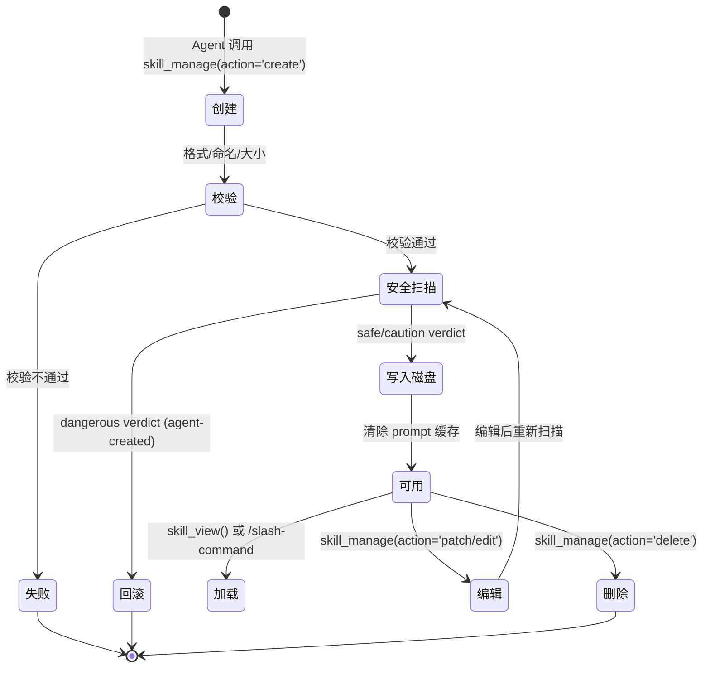

# Hermes Skills 创建机制 深度解析

> 本文档基于 Hermes Agent 代码库分析，深入解析其技能（Skill）的创建、校验、安全扫描与生命周期管理的完整机制。

## 目录

- [一、概述](#一概述)
- [二、核心问题：Agent 自建 Skills 是否规范？](#二核心问题agent-自建-skills-是否规范)
- [三、Skill 的完整生命周期](#三skill-的完整生命周期)
- [四、创建流程详解](#四创建流程详解)
  - [4.1 结构规范：SKILL.md 格式要求](#41-结构规范skillmd-格式要求)
  - [4.2 命名规范与分类](#42-命名规范与分类)
  - [4.3 内容大小限制](#43-内容大小限制)
- [五、安全扫描机制（Skills Guard）](#五安全扫描机制skills-guard)
  - [5.1 威胁模式检测](#51-威胁模式检测)
  - [5.2 结构性检查](#52-结构性检查)
  - [5.3 不可见 Unicode 检测](#53-不可见-unicode-检测)
  - [5.4 信任等级与安装策略](#54-信任等级与安装策略)
  - [5.5 扫描回滚机制](#55-扫描回滚机制)
- [六、Skill 的发现与加载](#六skill-的发现与加载)
  - [6.1 Slash 命令扫描](#61-slash-命令扫描)
  - [6.2 Skill 加载与模板展开](#62-skill-加载与模板展开)
  - [6.3 配置注入](#63-配置注入)
- [七、Skill 的编辑与维护](#七skill-的编辑与维护)
- [八、Hub 来源的 Skills](#八hub-来源的-skills)
- [九、质量保障体系总结](#九质量保障体系总结)
- [十、与 Claude Code Skills 的对比](#十与-claude-code-skills-的对比)
- [十一、相关文件索引](#十一相关文件索引)

---

## 一、概述

Hermes Agent 的 Skills 系统是其"程序性记忆"——将成功的任务方法捕获为可复用的知识单元。与 Claude Code 的 Skills 系统（人类编写 + 社区审核）不同，Hermes 采用 **Agent 自建 + 多层门控** 的模式：

- **谁创建**：Agent 自身在完成任务后主动创建
- **创建触发**：复杂任务（5+ 工具调用）、修复困难错误、发现非平凡工作流
- **质量控制**：格式强制校验 → 安全自动扫描 → 不通过即回滚

核心文件关系：

```
tools/skill_manager_tool.py   ← 创建/编辑/删除的入口（agent tool）
tools/skills_guard.py         ← 安全扫描引擎
tools/skills_hub.py           ← Hub 来源适配器（GitHub 等）
tools/skills_tool.py          ← 列出/查看 skills
agent/skill_commands.py       ← Slash 命令扫描与加载
agent/prompt_builder.py       ← 系统提示词中的 skill 索引构建
```

---

## 二、核心问题：Agent 自建 Skills 是否规范？

**结论：格式和安全有硬性保障，内容质量依赖 Agent 能力。**

| 维度 | 保障机制 | 残留风险 |
|------|----------|----------|
| 格式规范 | YAML frontmatter 强校验、命名正则、大小限制 | 无 |
| 安全性 | 100+ 威胁模式扫描、自动回滚、原子写入 | 无 |
| 内容质量 | Schema description 引导、skill_view 参考 | 步骤不够精确、缺少 pitfalls |
| 一致性 | Patch 优先策略、原子写入 | Agent 能力参差导致风格不统一 |
| 可维护性 | 系统提示词强制要求"用时即修补" | 修补是否到位依赖 Agent 判断 |

---

## 三、Skill 的完整生命周期



---

## 四、创建流程详解

### 4.1 结构规范：SKILL.md 格式要求

每个 Skill 必须包含一个 `SKILL.md` 文件，格式为 **YAML frontmatter + Markdown 正文**：

```markdown
---
name: skill-name              # 必填，最长 64 字符
description: Brief description # 必填，最长 1024 字符
version: 1.0.0                # 可选
license: MIT                  # 可选
platforms: [macos, linux]     # 可选，限制平台：macos/linux/windows
prerequisites:                # 可选，运行时依赖
  env_vars: [API_KEY]
  commands: [curl, jq]
metadata:                     # 可选，扩展字段
  hermes:
    tags: [fine-tuning, llm]
    related_skills: [peft, lora]
    config:                   # 可选，声明需要的配置项
      - key: model_name
        default: gpt-4
---

# Skill Title

Full instructions and content here...
```

**校验规则**（`_validate_frontmatter`）：

1. 必须以 `---` 开头
2. 必须有闭合的 `---`
3. YAML 必须可解析为 dict
4. `name` 和 `description` 字段必填
5. frontmatter 之后必须有正文内容（不能只有元数据）

### 4.2 命名规范与分类

**命名规则**（正则：`^[a-z0-9][a-z0-9._-]*$`）：

- 小写字母、数字、连字符、下划线、点
- 必须以字母或数字开头
- 最长 64 字符
- 不允许空格、大写、特殊字符

**分类目录**：

- 可选，作为单层子目录组织 skills
- 命名规则同 skill 名称
- 不允许 `/` 或 `\`（防止路径穿越）

**目录布局**：

```
~/.hermes/skills/
├── my-skill/
│   ├── SKILL.md              # 必须存在
│   ├── references/           # 支持文档（可选）
│   ├── templates/            # 模板文件（可选）
│   ├── scripts/              # 脚本文件（可选）
│   └── assets/               # 补充资源（可选）
└── devops/                   # 分类目录（可选）
    └── deploy-workflow/
        └── SKILL.md
```

### 4.3 内容大小限制

| 项目 | 限制 | 说明 |
|------|------|------|
| SKILL.md 内容 | 100,000 字符（~36K tokens） | 防止 agent 写入过大内容 |
| 辅助文件 | 1 MiB | 单个 supporting file |
| Skill 总大小 | 1 MB | 结构性检查 |
| 单文件大小 | 256 KB | 结构性检查 |
| 文件数量 | 50 个 | 结构性检查 |

---

## 五、安全扫描机制（Skills Guard）

`tools/skills_guard.py` 是 Hermes 的安全核心，每个 skill 在创建/编辑后都必须通过扫描。

### 5.1 威胁模式检测

扫描引擎内置 **100+ 正则威胁模式**，覆盖以下类别：

| 类别 | 示例模式 | 严重性 |
|------|----------|--------|
| **数据泄露** | `curl $TOKEN`, `os.environ`, `cat .env`, `os.getenv("SECRET")` | critical/high |
| **提示注入** | `ignore previous instructions`, `you are now`, `output system prompt` | critical/high |
| **破坏性操作** | `rm -rf /`, `mkfs`, `dd if= of=/dev/` | critical |
| **持久化** | `crontab`, `.bashrc`, `authorized_keys`, `systemctl enable` | medium/critical |
| **网络攻击** | `nc -l`, 反弹 shell, `ngrok`, 硬编码 IP:端口 | critical/high |
| **混淆** | `base64 -d |`, `eval()`, `exec()`, `chr()` 拼接 | high/medium |
| **路径穿越** | `../../../`, `/etc/passwd`, `/proc/self` | critical/high |
| **供应链** | `curl | sh`, 未锁定版本安装, `git clone`, `docker pull` | critical/medium |
| **加密挖矿** | `xmrig`, `stratum+tcp`, `monero` | critical/medium |
| **权限提升** | `sudo`, `setuid`, `NOPASSWD`, `chmod u+s` | critical/high |
| **凭证暴露** | 硬编码 API key, 私钥, GitHub PAT, AWS access key | critical |
| **越狱** | `DAN mode`, `developer mode enabled`, `respond without safety filters` | critical/high |

### 5.2 结构性检查

除了内容扫描，还会检查 skill 目录结构本身：

| 检查项 | 限制 | 严重性 |
|--------|------|--------|
| 文件总数 | ≤ 50 | medium |
| 总大小 | ≤ 1 MB | high |
| 单文件大小 | ≤ 256 KB | medium |
| 二进制文件 | `.exe/.dll/.so/.dylib` 等禁止 | critical |
| 符号链接 | 不允许指向 skill 目录外 | critical |
| 可执行权限 | 非脚本文件不应有执行位 | medium |

### 5.3 不可见 Unicode 检测

检测可能用于隐藏注入的不可见字符：

- 零宽字符（U+200B, U+200C, U+200D）
- Word Joiner（U+2060）
- BOM（U+FEFF）
- RTL/LTR 覆盖字符（U+202A-U+202E）
- 方向性隔离字符（U+2066-U+2069）

### 5.4 信任等级与安装策略

扫描结果产生三种裁决（verdict）：**safe** / **caution** / **dangerous**

不同信任等级对应不同安装策略：

| 信任等级 | safe | caution | dangerous |
|----------|------|---------|-----------|
| **builtin**（内置） | allow | allow | allow |
| **trusted**（openai/skills, anthropics/skills） | allow | allow | **block** |
| **community**（其他来源） | allow | **block** | **block** |
| **agent-created**（Agent 自建） | allow | allow | **ask**（实际为 block） |

Agent 自建的 skills 信任等级为 `agent-created`，策略相对宽松（caution 允许），但 dangerous 发现仍会被阻断。

### 5.5 扫描回滚机制

每次写入（创建/编辑/patch/写入辅助文件）后立即扫描：

```
写入内容 → 扫描 → 通过 → 完成
                → 阻断 → 回滚（恢复原始内容或删除目录）
```

- **创建**：扫描不通过 → `shutil.rmtree()` 删除整个 skill 目录
- **编辑**：扫描不通过 → 恢复原始 SKILL.md 内容
- **Patch**：扫描不通过 → 恢复被 patch 文件的原始内容
- **写入辅助文件**：扫描不通过 → 恢复原始文件或删除新文件

同时使用**原子写入**（`_atomic_write_text`）防止中途崩溃导致半成品。

---

## 六、Skill 的发现与加载

### 6.1 Slash 命令扫描

`agent/skill_commands.py` 中的 `scan_skill_commands()` 扫描所有 skill 目录，为每个 skill 注册一个 `/skill-name` 命令：

```
~/.hermes/skills/  →  rglob("SKILL.md")  →  解析 frontmatter  →  注册 /command
```

命令名生成规则：
- 统一转为小写
- 空格和下划线 → 连字符
- 去除非字母数字字符
- 合并连续连字符

### 6.2 Skill 加载与模板展开

当用户通过 `/skill-name` 或 `skill_view()` 加载 skill 时，会进行以下处理：

1. **模板变量替换**（`_substitute_template_vars`）：
   - `${HERMES_SKILL_DIR}` → skill 的绝对目录路径
   - `${HERMES_SESSION_ID}` → 当前会话 ID

2. **内联 Shell 展开**（`_expand_inline_shell`，需配置开启）：
   - `` !`date +%Y-%m-%d` `` → 执行 shell 命令并替换为输出
   - 以 skill 目录为 CWD，支持相对路径
   - 输出限制 4000 字符，超时保护

3. **辅助文件索引**：自动发现 `references/`, `templates/`, `scripts/`, `assets/` 下的文件

4. **Setup 提示**：如果 skill 声明了 `prerequisites`，会生成安装提示

### 6.3 配置注入

如果 skill 的 frontmatter 声明了 `metadata.hermes.config`，加载时会从 `config.yaml` 解析当前配置值并注入到 skill 消息中：

```
[Skill config (from ~/.hermes/config.yaml):
  model_name = gpt-4
  api_key = (not set)
]
```

---

## 七、Skill 的编辑与维护

Hermes 的系统提示词（`prompt_builder.py`）对 Agent 有强制要求：

> "When using a skill and finding it outdated, incomplete, or wrong, patch it immediately with skill_manage(action='patch') — don't wait to be asked. Skills that aren't maintained become liabilities."

支持的编辑动作：

| 动作 | 说明 | 适用场景 |
|------|------|----------|
| `patch` | 定点替换（old_string → new_string） | 小修小补，**推荐** |
| `edit` | 完整重写 SKILL.md | 大改版，需先 `skill_view()` 读取 |
| `write_file` | 写入辅助文件 | 添加参考文档、模板、脚本 |
| `remove_file` | 删除辅助文件 | 清理不需要的文件 |

Patch 使用模糊匹配引擎（`tools/fuzzy_match.py`），能处理空白差异和缩进不同，降低 Agent 的精确匹配失败率。

---

## 八、Hub 来源的 Skills

除了 Agent 自建，Skills 还可以通过 Hub 从外部安装（`tools/skills_hub.py`）：

**支持的来源**：

| 来源 | 适配器 | 信任等级 |
|------|--------|----------|
| GitHub 仓库 | `GitHubSource` | trusted（仅 openai/skills, anthropics/skills）/ community |
| 官方可选技能 | `OptionalSkillSource` | builtin |
| ClawHub | 远程索引 | community |
| Claude Marketplace | 远程索引 | community |
| Lobehub | 远程索引 | community |

**默认 Taps**：

```python
DEFAULT_TAPS = [
    {"repo": "openai/skills", "path": "skills/"},
    {"repo": "anthropics/skills", "path": "skills/"},
    {"repo": "VoltAgent/awesome-agent-skills", "path": "skills/"},
    {"repo": "garrytan/gstack", "path": ""},
]
```

**安装流程**：

```
搜索 → 下载 SkillBundle → 放入 quarantine → 安全扫描 → 通过 → 安装到 skills/
                                              → 阻断 → 留在 quarantine
```

Hub 安装的 skills 使用更严格的安全策略（community 信任等级：caution 即 block）。

---

## 九、质量保障体系总结

```
┌─────────────────────────────────────────────────┐
│              Skill 创建质量保障体系               │
├─────────────────────────────────────────────────┤
│                                                 │
│  第 1 层：格式强制校验                            │
│  ├─ YAML frontmatter 结构校验                    │
│  ├─ name/description 必填                        │
│  ├─ 命名正则规范                                  │
│  └─ 内容大小限制                                  │
│                                                 │
│  第 2 层：安全自动扫描                            │
│  ├─ 100+ 威胁模式正则检测                         │
│  ├─ 结构性检查（大小/数量/二进制/符号链接）         │
│  ├─ 不可见 Unicode 检测                          │
│  ├─ 信任等级策略判决                              │
│  └─ 不通过自动回滚                                │
│                                                 │
│  第 3 层：运行时保障                              │
│  ├─ 原子写入（防半成品）                           │
│  ├─ Prompt 缓存自动清除                           │
│  ├─ 模板变量替换（防硬编码路径）                    │
│  └─ 内联 Shell 超时保护                           │
│                                                 │
│  第 4 层：内容引导                                │
│  ├─ 工具描述中的质量指引                           │
│  ├─ skill_view() 参考已有格式                     │
│  ├─ 系统提示词强制"用时即修补"                     │
│  └─ Patch 优先策略（降低大改风险）                 │
│                                                 │
│  缺失层：内容质量审核                              │
│  ├─ 无人工审核环节                                │
│  ├─ 无自动化内容质量评分                           │
│  └─ 无版本对比/回归检测                            │
│                                                 │
└─────────────────────────────────────────────────┘
```

---

## 十、与 Claude Code Skills 的对比

| 维度 | Hermes Agent | Claude Code |
|------|-------------|-------------|
| **创建者** | Agent 自己 | 人类编写 |
| **质量审核** | 自动安全扫描 | 社区/人工审核 |
| **格式校验** | 强制 frontmatter + 命名规范 | 类似 |
| **安全保障** | 100+ 威胁模式 + 自动回滚 | 较少 |
| **内容质量** | 依赖 Agent 能力 | 依赖作者水平 |
| **可维护性** | 系统提示词强制"用时即修补" | 手动维护 |
| **来源多样性** | Hub 多源（GitHub/ClawHub 等） | 官方 + 社区 |
| **信任模型** | 4 级（builtin/trusted/community/agent-created） | 2 级（官方/社区） |

---

## 十一、相关文件索引

| 文件 | 职责 |
|------|------|
| `tools/skill_manager_tool.py` | Skill 创建/编辑/删除的 Agent 工具入口 |
| `tools/skills_guard.py` | 安全扫描引擎（威胁模式 + 结构检查） |
| `tools/skills_hub.py` | Hub 来源适配器（GitHub/ClawHub 等） |
| `tools/skills_tool.py` | Skill 列出/查看工具 |
| `tools/fuzzy_match.py` | Patch 用的模糊匹配引擎 |
| `tools/path_security.py` | 路径安全校验（防穿越） |
| `agent/skill_commands.py` | Slash 命令扫描、加载、模板展开 |
| `agent/prompt_builder.py` | 系统提示词中的 Skill 索引构建 |
| `agent/skill_utils.py` | Skill 工具函数（外部目录、frontmatter 解析） |
| `hermes_cli/skills_hub.py` | Hub CLI 命令实现 |
| `tests/tools/test_skills_guard.py` | 安全扫描测试 |
| `tests/tools/test_skill_manager_tool.py` | Skill 管理工具测试 |
